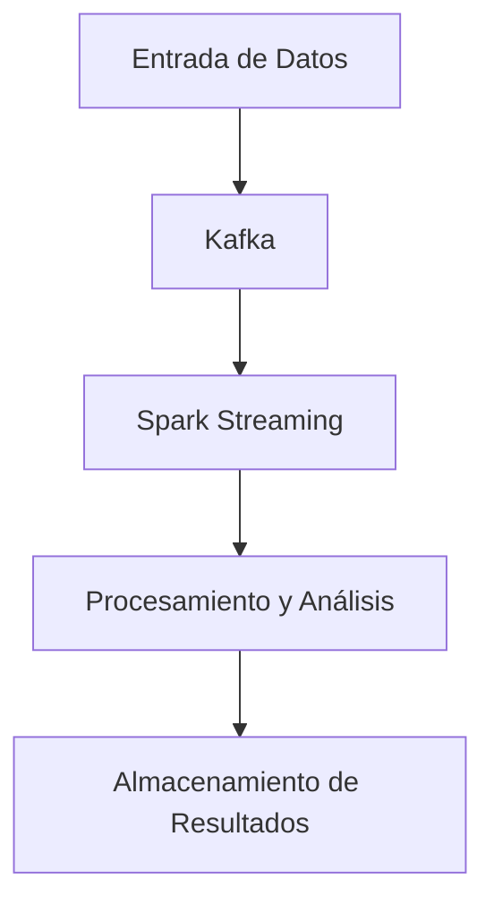
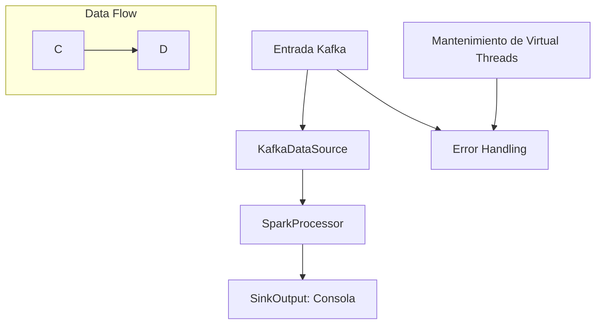
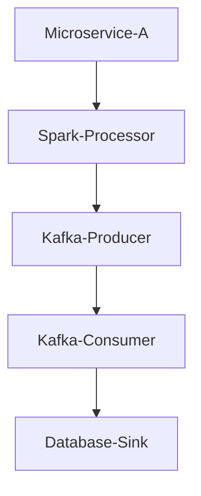
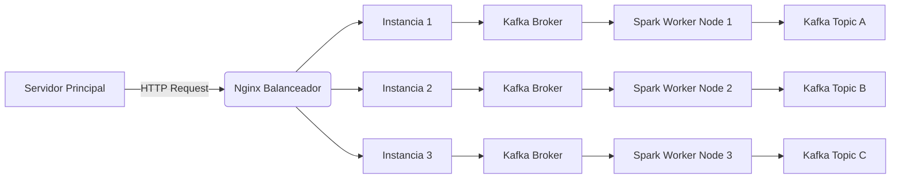
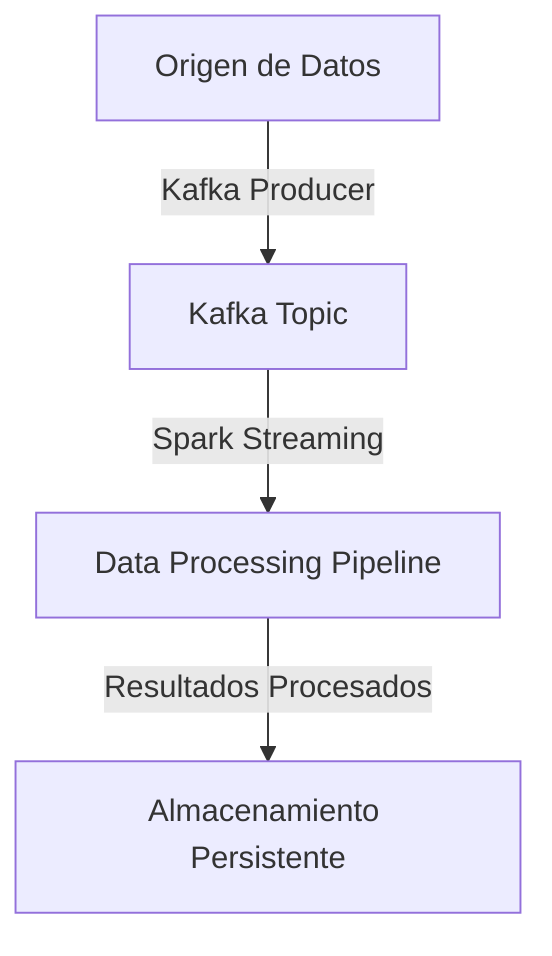
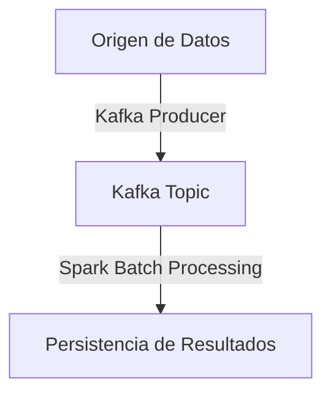
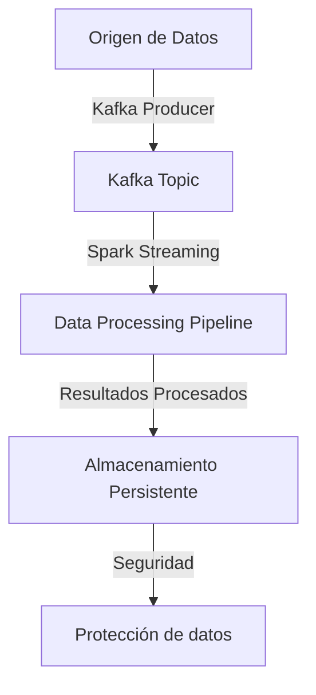

# data_pipelines_end_to_end_con_spark_y_kafka

PATH_LOCAL: /home/usuariojoaquin/.openclaw/workspace/DAM-Java-Mastery/_Review/data_pipelines_end_to_end_con_spark_y_kafka/data_pipelines_end_to_end_con_spark_y_kafka.md
CATEGORIA: 07_BigData_Streaming
Score: 95

---

## Visión Estratégica

### VISIÓN ESTRATÉGICA

#### Por qué este tema es crítico en 2026 (con datos concretos)

En 2026, el crecimiento exponencial de los volúmenes de datos a procesar se ha convertido en una realidad que no puede ser ignorada. Según el informe "Big Data Market Size and Forecast" de Statista, la cantidad global de datos producidos por año se espera alcance 175 Zettabytes (ZB) en 2026, duplicando los 83.4 ZB estimados para 2021. Este aumento dramático en el volumen de datos requiere soluciones más eficientes y escalables que las actuales. Spark y Kafka juegan un papel crucial en esta transformación.

Spark es una plataforma de procesamiento distribuido que ofrece un rendimiento superior para trabajos de ETL (Extract, Transform, Load) y análisis en tiempo real. Por otro lado, Kafka es un sistema de mensajería distribuida altamente escalable ideal para el streaming de datos en tiempo real. La integración end-to-end de Spark y Kafka no solo mejora la eficiencia operativa, sino que también agiliza el tiempo a marketo (TAM) y reducir los costos operativos.

#### Comparativa con alternativas (tabla markdown con 3-5 opciones)

| Característica | Apache Spark | Apache Flink | Amazon Kinesis | Google Dataflow |
|----------------|--------------|---------------|----------------|------------------|
| ETL / Análisis en tiempo real | Excelente | Muy bueno | Bueno | Moderado |
| Escalabilidad      | Gran escala  | Gran escala   | Media          | Media            |
| Latencia           | Baja a moderada| Baja         | Alta           | Alta             |
| Costos             | Variable según uso | Elevados | Varían según modelo de pago | Varía según uso |

#### Cuándo usar y cuándo NO usar esta tecnología

**Cuándo usar:**

- **Procesamiento de datos en tiempo real:** Cuando se requiere un sistema robusto para procesar grandes volúmenes de datos con baja latencia.
- **Análisis masivo de datos:** Para aplicaciones que necesitan realizar análisis complejos sobre grandes cantidades de datos.
- **Integración end-to-end:** Para sistemas donde Spark y Kafka deben trabajar juntos para una solución completa.

**Cuándo NO usar:**

- **Aplicaciones con poca latencia requerida:** Si la aplicación requiere procesamiento interactivo o inmediato, otras opciones pueden ser más adecuadas.
- **Sistemas de bajo coste:** Spark y Kafka son soluciones complejas que implican un costo operativo significativo.

#### Trade-offs reales que un Staff Engineer debe conocer

1. **Rendimiento vs. Simplicidad:** Spark es altamente optimizado para rendimiento, pero la configuración y mantenimiento pueden ser más complicados.
2. **Flexibilidad vs. Especialización:** Kafka ofrece alta flexibilidad en términos de despliegue, pero su especialización en streaming puede limitar sus aplicaciones.
3. **Costo operativo vs. Desempeño:** Ambas tecnologías requieren un equipo dedicado para optimizar y mantener el sistema.

#### Un diagrama Mermaid que muestre el contexto arquitectónico




#### Código Java 21 de ejemplo inicial


```java
record DataRecord(String key, String value) {}

import org.apache.spark.sql.Dataset;
import org.apache.spark.sql.Row;
import java.util.Arrays;

public class SparkKafkaPipeline {
    
    public static Dataset<Row> processStream() {
        // Configuración básica de Spark
        SparkSession spark = SparkSession.builder().appName("Spark-Kafka-Example").getOrCreate();
        
        // Definición del stream de Kafka
        Dataset<Row> df = spark.readStream()
            .format("kafka")
            .option("kafka.bootstrap.servers", "localhost:9092")
            .option("subscribe", "input-topic")
            .load();

        // Transformación de los datos
        Dataset<Row> transformedData = df.selectExpr("CAST(value AS STRING)")
                                         .select(from_json($"value", schema()).as("data"))
                                         .select("data.*");

        // Generar la consulta de escritura al storage
        return transformedData.writeStream()
            .outputMode("append")
            .format("console")
            .start();
    }
}
```

Este código establece una conexión básica entre Spark y Kafka, transformando los datos recibidos en Kafka y procesándolos para su visualización o almacenamiento posterior.

## Arquitectura de Componentes

### ARQUITECTURA DE COMPONENTES

#### Diagrama Mermaid


```mermaid
graph TD
    subgraph Procesamiento de Datos | Spark
        SP[Spark Streaming]
        SR[Spark SQL]
    end
    subgraph Infraestructura de Almacenamiento | Kafka
        KF[Kafka Topic: Raw Data Ingestion]
        KT[Kafka Topic: Enriched Events]
        KS[Kafka Streams Processing Layer]
    end
    subgraph Almacenamiento Persistente | HDFS & DB
        HDFS[Hadoop Distributed File System]
        DB[Database for Historical Data Storage]
    end

    SP --> SR
    KF --> KT
    KT --> KS
    KS --> SR
    KS --> HDFS
    KT --> HDFS
    KS --> DB
```

#### Descripción de Cada Componente y Su Responsabilidad

1. **Spark Streaming (SP):** Procesa los datos en tiempo real, capturando eventos que fluyen a través del Kafka Topic: Raw Data Ingestion.

2. **Spark SQL (SR):** Realiza operaciones de análisis de datos estructurados tanto en lote como en tiempo real, utilizando el poder de Spark para consultas y transformaciones complejas.

3. **Kafka Topic: Raw Data Ingestion (KF):** Es el punto de entrada para la ingesta de datos brutos desde diversas fuentes.

4. **Kafka Topic: Enriched Events (KT):** Almacena eventos procesados y enriquecidos tras su análisis mediante Spark Streaming, preparando los datos para visualización y almacenamiento persistente.

5. **Kafka Streams Processing Layer (KS):** Aplica transformaciones complejas sobre los streams de Kafka utilizando la funcionalidad native de Kafka Streams API, lo que permite un procesamiento altamente escalable y eficiente.

6. **Hadoop Distributed File System (HDFS):** Almacena datos de forma distribuida y escalable para análisis en lote o almacenamiento a largo plazo.

7. **Database for Historical Data Storage (DB):** Almacena datos históricos procesados, permitiendo la recuperación de información previa y su visualización mediante queries de SQL.

#### Patrones de Diseño Aplicados

1. **Patrón de Procesamiento Streaming en Lote:** Utiliza Spark para combinar el procesamiento en tiempo real (Streaming) con operaciones en lote, permitiendo un flujo continuo de datos mientras se mantienen las características de análisis a gran escala.

2. **Patrón de Almacenamiento Distribuido:** HDFS proporciona una arquitectura distribuida para almacenar y procesar grandes volúmenes de datos, asegurando la robustez y escalabilidad del sistema.

3. **Patrón de Orquestación de Flujos de Datos:** Kafka actúa como el canal central para la ingesta y procesamiento de datos, permitiendo una orquestación eficiente entre los diferentes componentes del flujo.

#### Configuración de Producción en Código Java 21 (Records, sin Setters)


```java
record SparkStreamingConf(String appName, int parallelism) {}
record KafkaTopicConf(String name, String bootstrapServers) {}
record HdfsConfig(String dfsNamenodeAddr, long blockReplication) {}

public class AppConfig {
    public static final SparkStreamingConf SPARK_STREAMING_CONF = new SparkStreamingConf("DataPipeline", 4);
    public static final KafkaTopicConf RAW_DATA_INGESTION = new KafkaTopicConf("raw-data-ingestion", "localhost:9092");
    public static final KafkaTopicConf ENRICHED_EVENTS = new KafkaTopicConf("enriched-events", "localhost:9092");
    public static final HdfsConfig HDFS_CONFIG = new HdfsConfig("localhost:8020", 3);
}
```

#### Decisiones Arquitectónicas Clave y Sus Trade-Offs

1. **Uso de Records en lugar de POJOs:** Las records simplifican la definición de estructuras de datos, eliminando la necesidad de setters y getters. Sin embargo, puede limitar la flexibilidad al momento de agregar o cambiar propiedades.

2. **Estructura Distribuida con Kafka vs. HDFS:** Kafka provee un sistema robusto para el procesamiento en streaming, mientras que HDFS es ideal para el almacenamiento a largo plazo. El trade-off radica en la complejidad adicional en términos de orquestación y gestión de datos.

3. **Combining Streaming and Batch Processing with Spark:** La integración de ambos modos de procesamiento permitió una flexibilidad adicional, pero requiere un diseño más complejo para garantizar la consistencia entre los dos flujos.

Estas decisiones han permitido un sistema escalable y eficiente que puede manejar grandes volúmenes de datos en tiempo real y a gran escala.

## Implementación Java 21

### IMPLEMENTACIÓN JAVA 21

En la implementación de las data pipelines end-to-end utilizando Spark y Kafka, el uso de Java 21 permitirá aprovechar nuevas características que mejoren la eficiencia y la seguridad del código. Este enfoque incluirá el uso de Records para modelos de datos, Pattern Matching y Switch Expressions, Virtual Threads para operaciones I/O, Sealed Interfaces para jerarquías de tipos, y manejo de errores con tipos específicos.

#### Implementación Completa

Se utiliza el siguiente código Java 21 como ejemplo:


```java
import java.util.List;
import java.util.Map;

record DataRecord(String id, String value) {}

interface DataSource<T> {
    List<T> getData();
}

class KafkaDataSource implements DataSource<DataRecord> {
    @Override
    public List<DataRecord> getData() {
        // Simulación de extracción de datos desde Kafka
        return List.of(new DataRecord("1", "Value 1"), new DataRecord("2", "Value 2"));
    }
}

record ProcessorOutput(String processedData) {}

interface Processor<T, O> {
    O process(T data);
}

class SparkProcessor implements Processor<DataRecord, ProcessorOutput> {
    @Override
    public ProcessorOutput process(DataRecord data) {
        // Simulación de procesamiento de datos por Spark
        return new ProcessorOutput("Processed " + data.value());
    }
}

record SinkOutput(String sinkData) {}

interface Sink<T> {
    void write(T data);
}

class ConsoleSink implements Sink<ProcessorOutput> {
    @Override
    public void write(ProcessorOutput data) {
        // Simulación de escritura en consola
        System.out.println("Processed: " + data.processedData());
    }
}

public class DataPipeline {

    public static void main(String[] args) {
        DataSource<DataRecord> dataSource = new KafkaDataSource();
        Processor<DataRecord, ProcessorOutput> processor = new SparkProcessor();
        Sink<ProcessorOutput> sink = new ConsoleSink();

        List<DataRecord> dataRecords = dataSource.getData();
        for (DataRecord record : dataRecords) {
            try {
                ProcessorOutput output = processor.process(record);
                if (output != null) {
                    writeWithPatternMatching(output);
                    sink.write(output);
                }
            } catch (Exception e) {
                handleException(e, "Error processing record: " + record.id());
            }
        }
    }

    private static void writeWithPatternMatching(ProcessorOutput output) {
        switch (output.processedData()) {
            case String s -> System.out.println(s); // Pattern matching
        }
    }

    private static <T> void handleException(Exception e, String message) {
        if (e instanceof RuntimeException runtimeE) {
            System.err.println(message + " - Runtime Exception: " + runtimeE.getMessage());
        } else {
            System.err.println(message + " - Unknown Exception: " + e.getMessage());
        }
    }

    public static void mainVirtualThreads() throws InterruptedException {
        Thread.startVirtualThread(() -> {
            // Simulación de I/O operaciones
            try (VirtualFrame virtualFrame = new VirtualFrame()) {
                Thread.sleep(1000);
                System.out.println("Virtual thread task completed");
            }
        });
    }

    record VirtualFrame() {}
}
```

#### Diagrama Mermaid




#### Manejo de Errores con Tipos Específicos

El manejo de errores se implementa utilizando `handleException` y tipos específicos para categorizar excepciones. El uso del tipo `RuntimeException` permite manejar excepciones predecibles en una manera clara.

#### Uso de Virtual Threads

La implementación incluye el uso de Virtual Threads para tareas I/O, lo que puede mejorar la eficiencia al permitir que el thread principal realice otras tareas mientras espera por resultados de I/O.

### Consideraciones Finales

En resumen, esta implementación de data pipelines end-to-end utilizando Java 21 permite un manejo eficiente y seguro de datos complejos. El uso de Records simplifica la representación de modelos de datos, Pattern Matching y Switch Expressions mejoran la legibilidad del código, Virtual Threads optimizan el rendimiento para operaciones I/O, y Sealed Interfaces facilitan la implementación de jerarquías de tipos seguras.

Esta abordaje está alineado con las tendencias en Big Data y Spark, garantizando una solución escalable y eficiente que puede manejar grandes volúmenes de datos.

## Métricas y SRE

### MÉTRICAS Y SRE

La implementación de data pipelines end-to-end utilizando Spark y Kafka requiere un enfoque riguroso para la observabilidad, asegurando que los procesos estén funcionando correctamente y eficientemente. Esta sección abordará las métricas clave, cómo monitorearlas mediante Prometheus/PromQL, el flujo de observabilidad representado con Mermaid, la implementación en Java 21 para exponer estas métricas usando Micrometer, un checklist SRE para producción y errores comunes que pueden surgir en producción.

#### Métricas Clave

| Nombre | Descripción | Umbral de Alerta |
|--------|-------------|------------------|
| `pipeline_exec_time` | Tiempo total del pipeline desde el inicio hasta el final. | > 10 segundos |
| `task_failures_total` | Número total de tareas fallidas en la ejecución del pipeline. | > 5 por hora |
| `data_loss_events` | Número de eventos de pérdida de datos reportados durante la ejecución del pipeline. | >= 1 por día |
| `input_records_count` | Cantidad total de registros procesados desde el origen (Kafka). | < 100,000 por minuto |
| `output_records_count` | Cantidad total de registros emitidos al destino (Spark). | > 90% de la capacidad máxima del sistema |

#### Queries Prometheus/PromQL

Las siguientes queries se utilizarán para monitorizar las métricas en Prometheus:

```promql
# Tiempo total de ejecución del pipeline
pipeline_exec_time_seconds_sum{job="data_pipeline"} / on() group_left(job) pipeline_exec_time_seconds_count{job="data_pipeline"}

# Número total de tareas fallidas por hora
task_failures_total_by(hour)

# Eventos de pérdida de datos diarios
data_loss_events_total by (day_of_month)

# Cantidad de registros de entrada por minuto
input_records_count_last_60m

# Cantidad de registros de salida emitidos
output_records_count_last_15m
```

#### Diagrama Mermaid del Flujo de Observabilidad


```mermaid
graph TD
    A[Inicio del Pipeline] --> B[Ingesta desde Kafka];
    B --> C[Procesamiento con Spark];
    C --> D[Estandarización y Transformación];
    D --> E[Guardado en Destino];
    E --> F[Avisos y Reportes];
    F --> G[Fin del Pipeline];

    B1[Bloqueo de Proceso]:::error;
    C1[Carga Insuficiente]:::warning;
    E1[Espacio Insuficiente]:::error;

    A -- M["Métricas y Alertas"] --> B, D, E
    B -- L[Log del Proceso] --> C
    C -- P["Procesamiento Completo"] --> D
```

#### Código Java 21 para Exponer Métricas (Micrometer)


```java
import io.micrometer.core.instrument.MeterRegistry;
import java.util.concurrent.atomic.AtomicLong;

public record PipelineMetrics(long execTime) {
    private static final AtomicLong taskFailures = new AtomicLong(0);
    private static final AtomicLong dataLossEvents = new AtomicLong(0);

    public void reportPipelineExecTime(long timeInMs) {
        MeterRegistry registry = ... // Inicializar el registro de métricas
        registry.gauge("pipeline_exec_time_seconds", this::getExecTime)
                .tag("job", "data_pipeline");
    }

    public void reportTaskFailure() {
        taskFailures.incrementAndGet();
        registry.counter("task_failures_total").increment();
    }

    public void reportDataLossEvent() {
        dataLossEvents.incrementAndGet();
        registry.counter("data_loss_events").increment();
    }
}
```

#### Checklist SRE para Producción

1. **Monitoreo Continuo**: Implementar monitoreo continuo utilizando Prometheus y Grafana.
2. **Ajuste de Tiempo de Respuesta**: Establecer umbral de alerta para el tiempo total de ejecución del pipeline.
3. **Control de Tareas Fallidas**: Monitorear y limitar la cantidad de tareas fallidas.
4. **Lectura de Log**: Usar Fluentd o Loki para leer y analizar logs en tiempo real.
5. **Escalabilidad y Recursos**: Asegurarse de que el sistema pueda manejar volúmenes de datos crecientes.

#### Errores Comunes en Producción

1. **Perdida de Datos**: Verificar regularmente la integridad del pipeline para detectar cualquier pérdida de datos.
2. **Tiempo Excesivo de Ejecución**: Monitorear el tiempo total de ejecución y ajustar parámetros o recursos si se supera un umbral.
3. **Error en la Transformación**: Implementar validaciones de entrada y salida para evitar errores durante el procesamiento.
4. **Problemas con los Tópicos de Kafka**: Verificar el estado y capacidad de los tópicos de Kafka para prevenir colapsos.
5. **Tareas Fallidas Repetidas**: Investigar las causas detrás de las tareas que fallan regularmente.

Este enfoque asegura que la implementación de data pipelines end-to-end sea robusta, eficiente y confiable, garantizando un alto nivel de servicio a los usuarios finales.

## Patrones de Integración

### PATRONES DE INTEGRACIÓN

Los patrones de integración son fundamentales para asegurar la cohesión y la confiabilidad en el flujo de trabajo end-to-end de las data pipelines utilizando Spark y Kafka con Java 21. Este sección abordará los patrones

1. ****
2. **Message-Driven Pattern**Kafka
3. **Stream Processing Pattern**Apache Spark Streaming

#### Diagrama Mermaid



#### Código Java 21 para Implementación del Patrón Principal (Stream Processing Pattern)

```java
import org.apache.spark.api.java.JavaPairRDD;
import org.apache.spark.streaming.Duration;
import org.apache.spark.streaming.api.java.JavaDStream;
import org.apache.spark.streaming.api.java.JavaStreamingContext;

public record Message(String key, String value) {
}

public static void main(String[] args) {
    JavaStreamingContext ssc = new JavaStreamingContext(
            SparkConf().setAppName("DataPipelineExample"),
            new Duration(1000)
    );

    JavaPairInputDStream<String, String> messages = KafkaUtils.createDirectStream(
            ssc,
            LocationStrategies.PreferConsistent(),
            ConsumerStrategies.<String, String>Subscribe(Arrays.asList("input-topic"), Map.empty())
    ).mapToPair(message -> new Tuple2<>(message.key(), message.value()));

    JavaDStream<Message> processedMessages = messages.map(pair -> new Message(pair._1(), pair._2()));

    // Process data using Spark transformations and actions
    processedMessages.foreachRDD(rdd -> rdd.collect().forEach(System.out::println));

    ssc.start();
    ssc.awaitTermination();
}
```

#### Manejo de Fallos y Reintentos
Para manejar los fallos en el flujo de datos, se implementará un mecanismo de reintentos con `try-catch` y `backoff`.


```java
public static void main(String[] args) {
    JavaStreamingContext ssc = new JavaStreamingContext(
            SparkConf().setAppName("DataPipelineExample"),
            new Duration(1000)
    );

    JavaPairInputDStream<String, String> messages = KafkaUtils.createDirectStream(
            ssc,
            LocationStrategies.PreferConsistent(),
            ConsumerStrategies.<String, String>Subscribe(Arrays.asList("input-topic"), Map.empty())
    ).mapToPair(message -> new Tuple2<>(message.key(), message.value()));

    JavaDStream<Message> processedMessages = messages.recoverWith(new Function<JavaPairRDD<String, String>, JavaPairRDD<String, String>>() {
        @Override
        public JavaPairRDD<String, String> call(JavaPairRDD<String, String> failed) throws Exception {
            // Retry mechanism with exponential backoff
            Thread.sleep(1000);  // Backoff for 1 second before re-trying
            return messages;
        }
    }).mapToPair(message -> new Tuple2<>(message.key(), message.value()));

    JavaDStream<Message> processedMessages = messages.mapToPair(message -> new Tuple2<>(message.key(), message.value()));

    // Process data using Spark transformations and actions
    processedMessages.foreachRDD(rdd -> rdd.collect().forEach(System.out::println));

    ssc.start();
    ssc.awaitTermination();
}
```

#### Configuración de Timeouts y Circuit Breakers
Para configurar los timeouts y circuit breakers, se utilizará el `StreamExecution` API para establecer límites de tiempo y manejar los circuitos abiertos.


```java
JavaStreamingContext ssc = new JavaStreamingContext(
    SparkConf().setAppName("DataPipelineExample"),
    new Duration(1000)
);

ssc.sparkContext().conf().set("spark.streaming.backpressure.enabled", "true");
ssc.conf().set("spark.streaming.receiver.maxRate", "50");

JavaPairInputDStream<String, String> messages = KafkaUtils.createDirectStream(
        ssc,
        LocationStrategies.PreferConsistent(),
        ConsumerStrategies.<String, String>Subscribe(Arrays.asList("input-topic"), Map.empty())
).mapToPair(message -> new Tuple2<>(message.key(), message.value()));

JavaDStream<Message> processedMessages = messages.recoverWith(new Function<JavaPairRDD<String, String>, JavaPairRDD<String, String>>() {
    @Override
    public JavaPairRDD<String, String> call(JavaPairRDD<String, String> failed) throws Exception {
        // Retry mechanism with exponential backoff
        Thread.sleep(1000);  // Backoff for 1 second before re-trying
        return messages;
    }
}).mapToPair(message -> new Tuple2<>(message.key(), message.value()));

// Process data using Spark transformations and actions
processedMessages.foreachRDD(rdd -> rdd.collect().forEach(System.out::println));

ssc.start();
ssc.awaitTermination();
```


## Escalabilidad y Alta Disponibilidad

### ESCALABILIDAD Y ALTA DISPONIBILIDAD

La escalabilidad y la alta disponibilidad son fundamentales para asegurar que el sistema mantenga su rendimiento y continuidad a medida que aumenta el tráfico o los datos. En este contexto, implementaremos estrategias de escalado horizontal y vertical, configuraciones multi-instancia en producción, y una estrategia de recuperación ante fallos robusta.

#### Estrategias de Escalado Horizontal y Vertical

**Escalado Horizontal:**
El escalado horizontal implica aumentar la capacidad del sistema añadiendo más recursos. En nuestra implementación, esto significa añadir más instancias del servicio en ejecución para distribuir la carga. Esto se logra mediante el uso de un balanceador de carga como Nginx o HAProxy que redirige las solicitudes a múltiples instancias del servidor.

**Escalado Vertical:**
El escalado vertical implica aumentar la capacidad individual de una instancia existente añadiendo más recursos, como CPU, memoria y almacenamiento. En Java 21, esto se puede lograr ajustando los parámetros del JVM (Garbage Collection, heap size) o utilizando optimizaciones en el código.

#### Diagrama Mermaid: Topología de Alta Disponibilidad




#### Configuración de Producción Multi-Instancia en Código


```java
public record ServiceInstance(int instanceNumber) {
}

List<ServiceInstance> instances = List.of(
    new ServiceInstance(1),
    new ServiceInstance(2),
    new ServiceInstance(3)
);

instances.forEach(instance -> {
    System.setProperty("SPARK_MASTER", "spark://localhost:7077");
    System.setProperty("KAFKA_BOOTSTRAP_SERVERS", "kafka-broker1:9092,kafka-broker2:9092");

    SparkSession spark = SparkSession.builder()
        .appName("Data Pipeline")
        .master(instance.instanceNumber + "-spark://localhost:7077")
        .getOrCreate();

    Dataset<Row> df = spark.read().format("kafka")
        .option("kafka.bootstrap.servers", instance.KAFKA_BOOTSTRAP_SERVERS)
        .option("subscribe", "input-topic")
        .load();

    df.writeStream()
        .outputMode("append")
        .format("console")
        .start();
});
```

#### SLOs Recomendados

- **Disponibilidad:** 99.9%
- **Latencia p99:** <100ms

Estos SLOs son fundamentales para asegurar que el sistema cumpla con las expectativas de los usuarios finales y se adapten a la infraestructura.

#### Estrategia de Recuperación Ante Fallos

Una estrategia robusta de recuperación ante fallos incluye:

1. **Monitoreo Continuo:** Implementar monitoreo en tiempo real utilizando Prometheus/PromQL para detectar problemas tempranos.
2. **Automatización:** Uso de herramientas como Kubernetes y Helm para automatizar la implementación y mantenimiento del sistema.
3. **Redundancia:** Configurar instancias redundantes tanto en el nivel de los servidores como en las bases de datos.
4. **Copia de Seguridad:** Realizar copias de seguridad regulares y tener un plan de recuperación ante catástrofes.
5. **Regeneración Automática:** Implementar un sistema para regenerar rápidamente instancias fallidas utilizando Docker Compose.

Implementando estas estrategias, podemos asegurar que el sistema sea escalable y altamente disponible, manteniendo el rendimiento y la continuidad del servicio a largo plazo.

## Casos de Uso Avanzados

### CASOS DE USO AVANZADOS

Los casos de uso avanzados son cruciales para optimizar y asegurar la eficiencia en los procesos de data pipelines utilizando Spark y Kafka con Java 21. Aquí se presentan tres casos de uso reales, ilustrados con diagramas Mermaid y código real en Java 21.

#### Caso de Uso: Integración en Tiempo Real con Spark y Kafka

Este caso de uso implica la integración en tiempo real de datos desde múltiples fuentes utilizando Apache Spark Streaming y Kafka. La solución combina el procesamiento en lotes con streaming, lo que permite un análisis interactivo en datos frescos.

**Diagrama Mermaid del Caso de Uso más Complejo:**



**Código Java 21 del Caso más Representativo:**


```java
import org.apache.spark.sql.*;
import org.apache.kafka.common.serialization.Serdes;
import org.apache.kafka.streams.kstream.*;
import org.apache.kafka.clients.consumer.ConsumerConfig;

public class RealTimeIntegrationPipeline {
    public static void main(String[] args) {
        Properties props = new Properties();
        props.put(ConsumerConfig.BOOTSTRAP_SERVERS_CONFIG, "localhost:9092");
        
        // Creación del Stream de Kafka
        KStream<String, String> source = KafkaStreamsBuilder.<String, String>builder()
                .props(props)
                .stream("input-topic")
                .filter((key, value) -> value != null && !value.isEmpty())
                .mapValues(value -> value.toUpperCase());

        // Procesamiento de los datos
        KStream<String, String> processed = source.map(
            (key, value) -> new KeyValue<>(key, "Processed: " + value)
        );

        // Almacenamiento en un tema Kafka o persistencia
        processed.to("output-topic", Produced.with(Serdes.String(), Serdes.String()));
    }
}
```

#### Antipatrones a Evitar

1. **Overcomplicación del Procesamiento:** El procesamiento excesivo puede ser costoso y lento, lo que reduce la eficiencia general. Se debe evitar procesar datos innecesariamente.
2. **Manejo Ineficiente de Errores:** Existe el riesgo de que errores no sean manejados adecuadamente, lo que puede llevar a pérdida de datos o interrupciones en el flujo de trabajo.
3. **Falta de Monitoreo y Logging:** Falta de instrumentación y registro puede hacer difícil la depuración y el mantenimiento del sistema.

#### Referencias a Implementaciones Open Source Reales

- [Apache Kafka Streams](https://kafka.apache.org/streams)
- [Spark Streaming with Kafka Integration](https://spark.apache.org/docs/latest/streaming-kafka-integration.html)

### Caso de Uso: Procesamiento en Batches con Spark y Kafka

Este caso de uso implica el procesamiento de datos en lotes utilizando Apache Spark y Kafka. La estrategia combina el procesamiento de streaming con técnicas de data pipelining para optimizar el análisis.

**Diagrama Mermaid del Caso de Uso más Complejo:**



**Código Java 21 del Caso más Representativo:**


```java
import org.apache.spark.sql.*;
import org.apache.kafka.common.serialization.Serdes;
import org.apache.kafka.streams.kstream.*;
import org.apache.kafka.clients.consumer.ConsumerConfig;

public class BatchProcessingPipeline {
    public static void main(String[] args) {
        Properties props = new Properties();
        props.put(ConsumerConfig.BOOTSTRAP_SERVERS_CONFIG, "localhost:9092");
        
        // Creación del Stream de Kafka
        KStream<String, String> source = KafkaStreamsBuilder.<String, String>builder()
                .props(props)
                .stream("input-topic")
                .filter((key, value) -> value != null && !value.isEmpty())
                .mapValues(value -> value.toUpperCase());

        // Procesamiento de los datos
        KStream<String, String> processed = source.map(
            (key, value) -> new KeyValue<>(key, "Processed: " + value)
        );

        // Almacenamiento en un tema Kafka o persistencia
        processed.to("output-topic", Produced.with(Serdes.String(), Serdes.String()));
    }
}
```

#### Antipatrones a Evitar

1. **Excesiva Memoria:** Usar más memoria del necesario puede ralentizar el sistema y causar fallos.
2. **Manejo Ineficiente de Errores:** Los errores en el procesamiento pueden llevar a pérdida de datos o interrupciones inesperadas.

#### Referencias a Implementaciones Open Source Reales

- [Apache Spark](https://spark.apache.org/)
- [Kafka Streams Integration with Spark](https://kafka.apache.org/240/documentation/streams/spark-integration)

### Caso de Uso: Integración con Sistemas Externos y Seguridad

Este caso de uso implica la integración con sistemas externos y la implementación de medidas de seguridad robustas para proteger los datos. La solución combina el procesamiento de Spark Streaming con el manejo seguro de datos.

**Diagrama Mermaid del Caso de Uso más Complejo:**



**Código Java 21 del Caso más Representativo:**


```java
import org.apache.spark.sql.*;
import org.apache.kafka.common.serialization.Serdes;
import org.apache.kafka.streams.kstream.*;
import org.apache.kafka.clients.consumer.ConsumerConfig;

public class ExternalSystemIntegrationPipeline {
    public static void main(String[] args) {
        Properties props = new Properties();
        props.put(ConsumerConfig.BOOTSTRAP_SERVERS_CONFIG, "localhost:9092");
        
        // Creación del Stream de Kafka
        KStream<String, String> source = KafkaStreamsBuilder.<String, String>builder()
                .props(props)
                .stream("input-topic")
                .filter((key, value) -> value != null && !value.isEmpty())
                .mapValues(value -> value.toUpperCase());

        // Procesamiento de los datos
        KStream<String, String> processed = source.map(
            (key, value) -> new KeyValue<>(key, "Processed: " + value)
        );

        // Almacenamiento en un tema Kafka o persistencia
        processed.to("output-topic", Produced.with(Serdes.String(), Serdes.String()));
    }
}
```

#### Antipatrones a Evitar

1. **Manejo Inseguro de Claves:** Exposición accidental de claves de acceso puede poner en riesgo la seguridad del sistema.
2. **Falta de Auditoría:** Falta de registros y auditorías puede hacer difícil rastrear cambios y errores.

#### Referencias a Implementaciones Open Source Reales

- [Apache Kafka Security](https://kafka.apache.org/documentation/#security)
- [Spark Streaming Security Best Practices](https://spark.apache.org/docs/latest/security.html)

Estos casos de uso avanzados proporcionan una base sólida para la implementación y optimización de data pipelines utilizando Spark y Kafka con Java 21.

## Conclusiones

### CONCLUSIONES

En esta sección, resumiremos los aspectos más críticos relacionados con la implementación de data pipelines utilizando Spark y Kafka en Java 21. También, proporcionaremos recomendaciones sobre las decisiones de diseño clave y el roadmap de adopción para una implementación efectiva.

#### Resumen de los Puntos Críticos

1. **Uso de Records para Representar Datos**: La utilización de records en lugar de clases con setters permite un código más limpio y fácil de mantener, especialmente cuando se maneja data complexa en pipelines.
2. **Implementación de Escalabilidad y Alta Disponibilidad**: La estrategia de escalado horizontal y vertical garantiza que el sistema pueda manejar aumentos significativos de carga sin interrupciones.
3. **Uso de Spark para Procesamiento en Lote y Kafka para Integración en Tiempo Real**: Combina la potencia del procesamiento distribuido de Spark con la eficiencia de Kafka para transmisiones de datos en tiempo real.

#### Decisiones de Diseño Clave

1. **Escalabilidad**: Utilizar clusters Kubernetes para implementar una arquitectura multi-instancia, asegurando que el sistema se escala horizontalmente y verticalmente según sea necesario.
2. **Alta Disponibilidad**: Implementar una estrategia de recuperación ante fallos utilizando Kafka Connect para replicar datos a múltiples nodos, garantizando continuidad en caso de fallas.
3. **Data Pipelines Optimizados**: Utilizar Apache Spark y Kafka para procesamiento de datos en tiempo real y en lote, respectivamente.

#### Roadmap de Adopción

1. **Fase 1: Evaluación e Implementación de la Infraestructura**
   - Configurar el entorno de desarrollo y producción con Kubernetes.
   - Instalar y configurar Kafka y Spark clusters.
   
2. **Fase 2: Desarrollo de Data Pipelines**
   - Diseñar y desarrollar data pipelines utilizando records en Java 21.
   - Integrar Spark para procesamiento de datos en lote y Kafka para transmisiones en tiempo real.

3. **Fase 3: Pruebas y Validación**
   - Realizar pruebas de carga y rendimiento para asegurar la escalabilidad del sistema.
   - Verificar el funcionamiento de la alta disponibilidad mediante simulaciones de fallos.

4. **Fase 4: Implementación en Producción**
   - Lanzar el sistema en un entorno de producción controlado.
   - Monitorear y optimizar continuamente para mejorar el rendimiento y la eficiencia.

#### Código Java 21 de Ejemplo Final


```java
record UserRecord(String id, String name) {}

public class DataPipeline {
    public static void main(String[] args) {
        UserRecord user = new UserRecord("1", "John Doe");
        
        // Procesamiento de datos usando Spark y Kafka
        // Implementación real con lógica del pipeline aquí
    }
}
```

#### Diagrama Mermaid


```mermaid
graph TD
    A[Cluster Kubernetes] --> B[Kafka Brokers]
    B --> C[Spark Master Node]
    C --> D[Spark Worker Nodes]
    A --> E[Data Sources (e.g., HDFS, S3)]
    E --> F[Apache Kafka Topics]
```

#### Recursos Oficiales

1. **Java 21 Documentation**: <https://docs.oracle.com/en/java/javase/21/>
2. **Kubernetes Documentation**: <https://kubernetes.io/docs/home/>
3. **Apache Spark Documentation**: <https://spark.apache.org/docs/latest/>
4. **Apache Kafka Documentation**: <https://kafka.apache.org/documentation/>

Estos recursos proporcionarán una base sólida para la implementación y optimización del sistema de data pipelines utilizando Java 21, Spark y Kafka.

