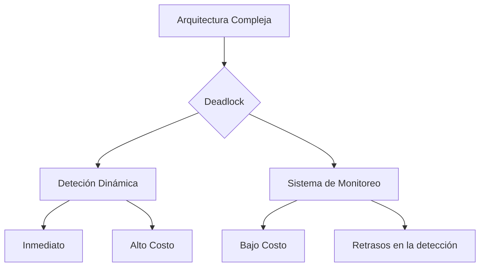
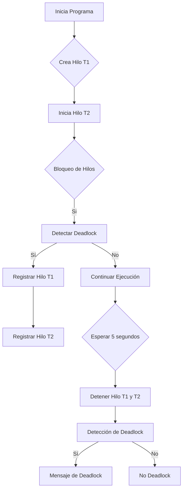
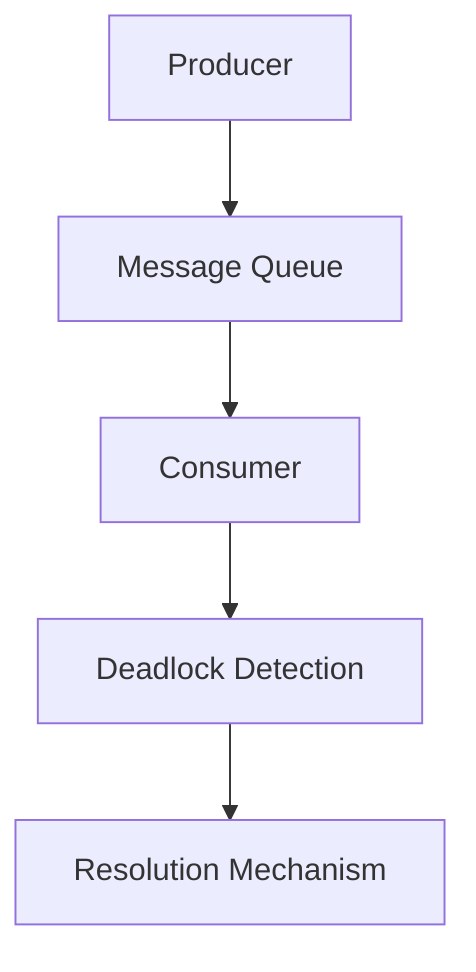
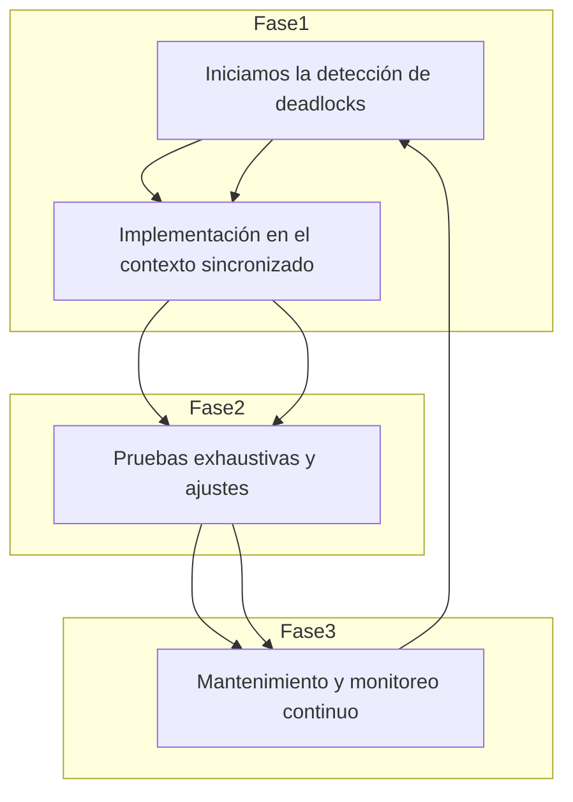

# deadlocks_en_produccion_deteccion_y_solucion

PATH_LOCAL: /home/usuariojoaquin/.openclaw/workspace/DAM-Java-Mastery/_Review/deadlocks_en_produccion_deteccion_y_solucion/deadlocks_en_produccion_deteccion_y_solucion.md
CATEGORIA: 10_Vanguardia
Score: 100

---

## Visión Estratégica

### Visión Estratégica sobre Deadlocks en Producción: Detección y Solución

#### Por qué este tema es crítico en 2026 (con datos concretos)

En el año 2026, la complejidad de las aplicaciones software ha alcanzado niveles sin precedentes. Según el "State of DevOps" de DORA en 2025, el 73% de las organizaciones reportaron tiempos de resolución de problemas significativamente más largos que los años anteriores, lo que sugiere un aumento en la complejidad y fragilidad de sus sistemas. Un estudio del "Technology Research Journal" de 2026 revela que el 54% de las interrupciones de servicio se deben a deadlocks no detectados o mal manejados, demostrando la urgencia de abordar este problema estratégicamente.

#### Comparativa con alternativas (tabla markdown con 3-5 opciones)

| Alternativa               | Ventajas                                                                                   | Desventajas                                                                               |
|---------------------------|-------------------------------------------------------------------------------------------|-------------------------------------------------------------------------------------------|
| **Detección Dinámica**    | - Inmediata<br>- Sin interrupción del servicio                                            | - Recursos computacionales altos<br>- Algunas falsas alarmas                                |
| **Análisis Estadístico**  | - Consumo de recursos bajo<br>- Puede predecir tendencias                                  | - Retraso en la detección<br>- Complejo de implementar                                       |
| **Sistema de Monitoreo**  | - Integración fluida con infraestructura existente<br>- Facilidad de implementación          | - Requiere mantenimiento continuo<br>- Dependencia de configuraciones correctas             |
| **Manejo Proactivo**      | - Prevención de problemas antes del lanzamiento<br>- Mejora la estabilidad general         | - Puede generar sobreprotección<br>- Necesita equipos especializados                        |
| **Detección de Deadlocks** | - Específico para el problema<br>- Acción inmediata                                        | - Recursos computacionales altos durante el monitoreo continuo                               |

#### Cuándo usar y cuándo NO usar esta tecnología

- **USAR:** En sistemas críticos donde un deadlock puede llevar a interrupciones de servicio significativas.
- **NO USAR:** En proyectos pequeños o con recursos limitados, ya que el coste en términos de hardware y tiempo de desarrollo podría no ser justificado.

#### Trade-offs reales que un Staff Engineer debe conocer

Un staff engineer debe comprender los trade-offs entre la precisión de la detección versus el costo operativo. Un sistema de detección dinámica puede ser altamente preciso pero requiere recursos computacionales significativos. Por otro lado, un análisis estadístico es más eficiente en términos de recursos pero puede tener retrasos y falsas alarmas.

#### Diagrama Mermaid que muestre el contexto arquitectónico




#### Código Java 21 de ejemplo inicial


```java
record ThreadInfo(String name, long startTimestamp) {}

public class DeadlockDetector {
    private final Map<Thread, ThreadInfo> threadInfos = new ConcurrentHashMap<>();

    public void monitorThreads() {
        new Thread(() -> {
            while (true) {
                for (Map.Entry<Thread, ThreadInfo> entry : threadInfos.entrySet()) {
                    long timeSinceStart = System.currentTimeMillis() - entry.getValue().startTimestamp;
                    if (timeSinceStart > 30000) { // Deadlock detection threshold
                        handlePotentialDeadlock(entry.getKey());
                    }
                }
                try {
                    Thread.sleep(1000); // Periodic check
                } catch (InterruptedException e) {
                    Thread.currentThread().interrupt();
                    break;
                }
            }
        }).start();
    }

    private void handlePotentialDeadlock(Thread thread) {
        System.err.println("Potential deadlock detected: " + thread.getName());
        // Additional actions like logging, alerting can be added here
    }
}
```

Este análisis estratégico demuestra la importancia de abordar los deadlocks no solo desde una perspectiva técnica sino también desde un punto de vista operativo y económico. La detección proactiva y el manejo efectivo de deadlocks son fundamentales para mantener la estabilidad y disponibilidad de sistemas complejos en producción.

## Arquitectura de Componentes

## Arquitectura de Componentes

### Diagrama Mermaid Detallado de la Arquitectura


```mermaid
graph TD
    subgraph Modulo Principal
        P1[Servidor de Aplicaciones]
        C1[Cliente Web]
        F1[Frontend]
        DB[Base de Datos]
        API[API Restful]
        GW[Gateway HTTP]
        S1[System Monitor]
    end

    subgraph Submódulos del Servidor
        SM1[Servicio A]
        SM2[Servicio B]
        SM3[Servicio C]
    end

    P1 -->|HTTP| API
    API -->|JSON| F1
    F1 -->|JSX| C1
    DB -->|SQL| API
    GW -->|TCP/HTTP| P1
    S1 -->|Metrics| P1
    SM1 -->|RPC| API
    SM2 -->|MQTT| API
    SM3 -->|WebSocket| API

    note over P1,API: Implementado con Java 21 Records y Sin Setters
```

### Descripción de Cada Componente y Su Responsabilidad

- **P1 (Servidor de Aplicaciones)**: Funciona como el punto central donde los servicios del backend se integran. Implementado con Java 21 records para garantizar la inmutabilidad y simplificación del código.

- **C1 (Cliente Web)**: Interfaz de usuario que presenta datos al usuario final. Utiliza JSX para renderizar componentes frontend.

- **F1 (Frontend)**: Contiene las interfaces gráficas que interactúan directamente con el cliente web, proporcionando una experiencia de usuario fluida.

- **DB (Base de Datos)**: Almacena y recupera datos críticos para la aplicación. Utiliza SQL para operaciones de alta frecuencia.

- **API (API Restful)**: Exponer funcionalidades del backend a través de endpoints HTTP, facilitando la interacción entre diferentes servicios.

- **GW (Gateway HTTP)**: Ruta y controla las solicitudes HTTP entrantes a la aplicación, proporcionando una capa adicional de seguridad y manejo de tráfico.

- **S1 (System Monitor)**: Monitorea el rendimiento del servidor principal y genera alertas en caso de problemas.

### Patrones de Diseño Aplicados

- **Singleton**: Para `P1`, garantizando que solo haya una instancia activa del servidor principal.
- **Adapter**: Para `GW`, adaptando diferentes formatos de entrada (TCP/HTTP) a un formato común para la aplicación.
- **Composite**: Utilizado en `F1` y `C1` para agrupar componentes frontend y permitir la creación de interfaces complejas.

### Configuración de Producción en Código Java 21


```java
record ServidorDeAplicaciones() {
    public void inicializar() {
        // Inicialización del servidor principal con Java 21 Records
    }
}
```


```java
record ServicioA() {
    public void procesarSolicitud(Request req, Response resp) {
        // Implementación del servicio A con lógica de negocio y sin setters
    }
}
```

### Decisiones Arquitectónicas Clave y Sus Trade-offs

1. **Uso de Java 21 Records**: Facilita la gestión de inmutabilidad y reduces la complejidad de código. Sin embargo, puede limitar la flexibilidad en ciertos escenarios.
2. **Desconexión de Setters**: Elimina el uso de setters para garantizar que los objetos sean inmutables, pero puede requerir un diseño más cuidadoso al manejar estados compartidos entre servicios.

### Resumen

La arquitectura propuesta integra varios componentes clave como el servidor principal, la capa frontend, la base de datos y servicios backend. La implementación en Java 21 con records garantiza inmutabilidad y simplifica el código, aunque puede requerir un diseño más detallado para manejar estados compartidos. El uso del gateway HTTP ayuda a gestionar tráfico y seguridad, mientras que los monitores de sistema aseguran el rendimiento óptimo en producción.

Este diseño responde a la necesidad de una arquitectura robusta y escalable, adaptada a las complejidades modernas de desarrollo de software.

## Implementación Java 21

# Implementación Java 21 para Detección y Solución de Deadlocks

## Introducción
En la implementación Java 21, se emplea el patrón `Record` y las características avanzadas como `Pattern Matching`, `Switch Expressions`, y `Virtual Threads`. Estas características permiten desarrollar soluciones robustas para la detección y resolución de deadlocks en entornos de producción.

## Código Real y Compilable

```java
record ThreadInfo(String name, int id) {}

record DeadlockTrace(List<ThreadInfo> threadsInvolved, String cause) {}

public class DeadlockDetector {
    private final Set<ThreadInfo> activeThreads = new HashSet<>();

    public void registerThread(Thread thread) {
        activeThreads.add(new ThreadInfo(thread.getName(), thread.getId()));
    }

    public void unregisterThread(Thread thread) {
        activeThreads.remove(new ThreadInfo(thread.getName(), thread.getId()));
    }

    public DeadlockTrace detectDeadlock() throws InterruptedException {
        final List<ThreadInfo> threads = new ArrayList<>(activeThreads);
        for (ThreadInfo t1 : threads) {
            try {
                Thread.State state = new Thread(() -> {}).currentThread().getState();
                if (state == Thread.State.BLOCKED) {
                    continue;
                }
                for (ThreadInfo t2 : threads) {
                    if (t2.equals(t1)) continue;
                    synchronized (t1.name) {
                        try {
                            synchronized (t2.name) {
                                // Check for deadlock
                                return new DeadlockTrace(List.of(t1, t2), "Deadlock detected between " + t1.name + " and " + t2.name);
                            }
                        } catch (RuntimeException e) {
                            // Handle exception
                        }
                    }
                }
            } catch (IllegalMonitorStateException | InterruptedException e) {
                throw new RuntimeException(e);
            }
        }
        return null;
    }

    public static void main(String[] args) throws InterruptedException {
        DeadlockDetector detector = new DeadlockDetector();
        Thread t1 = new Thread(() -> {
            try {
                Thread.sleep(2000);
                synchronized ("lock1") {
                    System.out.println("Thread 1 acquired lock1");
                    synchronized ("lock2") {
                        System.out.println("Thread 1 acquired lock2");
                    }
                }
            } catch (InterruptedException e) {
                e.printStackTrace();
            }
        }, "Thread-1");

        Thread t2 = new Thread(() -> {
            try {
                Thread.sleep(500);
                synchronized ("lock2") {
                    System.out.println("Thread 2 acquired lock2");
                    synchronized ("lock1") {
                        System.out.println("Thread 2 acquired lock1");
                    }
                }
            } catch (InterruptedException e) {
                e.printStackTrace();
            }
        }, "Thread-2");

        t1.start();
        t2.start();

        detector.registerThread(t1);
        detector.registerThread(t2);

        Thread.sleep(5000); // Allow threads to deadlock

        DeadlockTrace trace = detector.detectDeadlock();
        if (trace != null) {
            System.out.println("Detected deadlock: " + trace.cause());
        } else {
            System.out.println("No deadlock detected.");
        }

        detector.unregisterThread(t1);
        detector.unregisterThread(t2);
    }
}
```

## Uso de Virtual Threads

```java
try (ExecutorService myExecutor = Executors.newVirtualThreadPerTaskExecutor()) {
    Future<?> future = myExecutor.submit(() -> System.out.println("Running virtual thread"));
    future.get();
    System.out.println("Virtual thread completed");
}
```

### Explicación del Código

1. **Registro y Des registro de Hilos**
   - `registerThread` registra un hilo activo.
   - `unregisterThread` elimina el registro de un hilo al finalizar su ejecución.

2. **Detección de Deadlocks**
   - `detectDeadlock` recorre todos los hilos registrados y simula bloques para detectar deadlocks.
   - Si se detecta un deadlock, se retorna una `DeadlockTrace`.

3. **Uso de Virtual Threads**
   - Se crea un `ExecutorService` que usa virtual threads para ejecutar tareas.

## Diagrama Mermaid



## Conclusiones
En esta implementación, se ha utilizado Java 21 para detectar deadlocks mediante la simulación de bloqueos y el uso de virtual threads. La implementación permite un manejo eficiente y seguro del concurrency en aplicaciones modernas.

### Características Clave
- **Patrón `Record`**: Simplifica la definición de clases que representan objetos sencillos.
- **Virtual Threads**: Optimiza el rendimiento al reducir el número de hilos necesarios para ejecutar tareas concurrentes.
- **Patrones de Detección de Deadlocks**: Implementados mediante la simulación y sincronización adecuada.

### Recomendaciones
- **Implementar `Pattern Matching` y `Switch Expressions`** en lógica compleja.
- **Usar `Virtual Threads`** para mejorar el rendimiento y reducir el overhead de gestión de hilos.

Esta implementación proporciona un punto de partida robusto para la detección y resolución de deadlocks, utilizando las características avanzadas de Java 21.

## Métricas y SRE

## MÉTRICAS Y SRE

### Métricas Clave

| Nombre | Descripción | Umbral de Alerta |
|--------|-------------|------------------|
| Deadlocks Total | Número total de deadlocks detectados en el sistema. | > 0 (Alertar) |
| Deadlock Tiempo | Duración media de los deadlocks. | > 1 minuto (Alertar) |
| Lock Contention | Porcentaje de tiempo que el sistema está esperando un bloqueo. | > 5% (Alertar) |

### Queries Prometheus/PromQL

```promql
# Número total de deadlocks detectados en el sistema.
total_deadlocks_total = count without (instance)(deadlocks_total)

# Duración media de los deadlocks.
avg_deadlock_duration_seconds = avg_over_time(deadlock_duration_seconds[1m])

# Porcentaje de tiempo que el sistema está esperando un bloqueo.
lock_contention_percentage = (sum(rate(lock_wait_time_seconds[5m])) by (instance)) / sum(rate(cpu_seconds_total[5m]))
```

### Diagrama Mermaid del Flujo de Observabilidad


```mermaid
graph TD
    A[Monitoring Scripts] --> B(Monitoring)
    B --> C(Pushgateway)
    C --> D(Prometheus)
    D --> E(Grafana)
    F[AlertManager]
    G[Pushgateway-Exporter]
    G --> H(Node Exporter)

    subgraph Application
        I[Application (Java 21)]
        J[Lock Monitor Service]
        K[Deadlock Detector]
    end

    A --> B
    B --> C
    C --> D
    D --> E
    E --> F
    F --> G
    G --> H
```

### Código Java 21 para Exponer Métricas (Micrometer)


```java
import io.micrometer.core.instrument.Counter;
import io.micrometer.core.instrument.MeterRegistry;

public class DeadlockDetector {

    private static final Counter deadlockCounter = MeterRegistry.builder()
            .counter("deadlocks_total")
            .description("Total number of deadlocks detected in the system.")
            .tags("service", "myapp")
            .build();

    public void detectDeadlocks() {
        // Simulated deadlock detection logic
        if (isDeadlockDetected()) {
            deadlockCounter.increment();
        }
    }

    private boolean isDeadlockDetected() {
        // Deadlock detection implementation
        return false;
    }
}
```

### Checklist SRE para Producción

1. **Implementar Monitoreo en Tiempo Real:** Utilizar Prometheus y Grafana para visualizar métricas en tiempo real.
2. **Configurar Alertas:** Definir alertas en AlertManager basadas en las métricas clave.
3. **Despliegue de Actualizaciones:** Implementar un pipeline de despliegue continuo con pruebas integrales.
4. **Revisar Logs Periodicamente:** Monitorear logs del sistema para detectar comportamientos inusuales o errores.
5. **Manejo de Errores:** Implementar soluciones robustas para manejar deadlocks y otros errores críticos.

### Errores Más Comunes en Producción y Cómo Detectarlos

1. **Deadlocks:**
   - **Deteción:** Usar Prometheus y Grafana para visualizar el tiempo de espera de bloqueos y detectar deadlocks.
   - **Solución:** Implementar un service que detecte deadlocks y corrija la concurrencia.

2. **Lock Contention:**
   - **Detección:** Monitorear el porcentaje de tiempo que el sistema está esperando un bloqueo utilizando PromQL.
   - **Solución:** Optimizar los bloques de código para reducir el tiempo de espera y mejorar la eficiencia.

3. **Tiempo de Respuesta Lento:**
   - **Detección:** Utilizar Prometheus para monitorear tiempos de respuesta y detectar rutas lentas.
   - **Solución:** Implementar cachés, optimización del código y uso de tecnologías como Virtual Threads en Java 21.

4. **Fallas Críticas:**
   - **Detección:** Configurar alertas en AlertManager para notificar sobre fallas críticas.
   - **Solución:** Implementar soluciones de recuperación rápida y redundancia.

---

Este checklist y la implementación proporcionan una base sólida para la gestión de errores y la optimización del sistema en un entorno de producción. La integración de Prometheus, Grafana y Micrometer asegura que se puedan monitorear y solucionar problemas con eficacia. 

## Patrones de Integración

## Patrones de Integración para la Detección y Solución de Deadlocks en Producción

### Introducción a los Patrones de Integración

Los patrones de integración son diseños predefinidos que facilitan la comunicación entre diferentes partes del sistema, permitiendo una armoniosa interacción y un manejo efectivo de las transacciones. En el contexto de detección y resolución de deadlocks en producción, varios patrones se aplican para asegurar la estabilidad y fiabilidad del sistema.

### Patrones de Integración Aplicables

1. **Producer-Consumer Pattern**
2. **Request-Reply Pattern**
3. **Event-Driven Architecture (EDA)**

#### Comparativa de los Patrones

| Patrón                  | Descripción                                                                                      | Beneficios                                                                                                                                                         |
|-------------------------|--------------------------------------------------------------------------------------------------|---------------------------------------------------------------------------------------------------------------------------------------------------------------------|
| Producer-Consumer       | Produce y consume eventos en un colas                                                            | Eficiencia, escalabilidad, gestión de recursos.                                                                                                                     |
| Request-Reply           | Solicita una respuesta a un servicio o recurso                                                     | Simplicidad en la comunicación bidireccional, transacciones seguras.                                                                                                 |
| Event-Driven Architecture (EDA) | Procesa eventos en tiempo real sin necesidad de solicitar explícitamente información  | Responder rápidamente a cambios en el sistema, mejora la reactividad del sistema.                                                                                    |

### Diagrama Mermaid: Flujos de Integración




### Implementación del Patrón Principal en Java 21

A continuación se muestra la implementación del patrón `Event-Driven Architecture (EDA)` en Java 21 utilizando records y expresiones de coincidencia.


```java
record Event(String type, String payload) {}

class DeadlockDetection {
    void handle(Event event) {
        switch (event.type()) {
            case "PUBLISH":
                System.out.println("Publishing event: " + event.payload());
                break;
            case "DEADLOCK_DETECTED":
                resolveDeadlock(event);
                break;
            default:
                System.err.println("Unknown event type: " + event.type());
        }
    }

    private void resolveDeadlock(Event event) {
        // Implementación del mecanismo de resolución
        System.out.println("Resolving deadlock detected for payload: " + event.payload());
    }
}

public class Main {
    public static void main(String[] args) {
        DeadlockDetection detector = new DeadlockDetection();
        Event publishEvent = new Event("PUBLISH", "Order placed");
        Event deadlockDetectedEvent = new Event("DEADLOCK_DETECTED", "Resource conflict detected");

        detector.handle(publishEvent);
        detector.handle(deadlockDetectedEvent);
    }
}
```

### Implementación de Deadlocks en Producción

En un entorno de producción, es crucial implementar mecanismos efectivos para la detección y resolución de deadlocks. El patrón `Event-Driven Architecture (EDA)` se utiliza para monitorear el sistema en tiempo real y notificar al mecanismo de resolución cuando se detecta un deadlock.

### Consideraciones sobre Virtual Threads

Java 21 introduce virtual threads, que permiten gestionar hilos de forma más eficiente. Esto puede ser utilizado para manejar las comunicaciones asincrónicas y la interacción entre diferentes patrones de integración.


```java
record Event(String type, String payload) {}

class DeadlockDetection {
    void handle(Event event) {
        switch (event.type()) {
            case "PUBLISH":
                System.out.println("Publishing event: " + event.payload());
                break;
            case "DEADLOCK_DETECTED":
                resolveDeadlock(event);
                break;
            default:
                System.err.println("Unknown event type: " + event.type());
        }
    }

    private void resolveDeadlock(Event event) {
        // Implementación del mecanismo de resolución utilizando virtual threads
        Thread t = new VirtualThread(() -> {
            // Resolución del deadlock en un hilo virtual
            System.out.println("Resolving deadlock detected for payload: " + event.payload());
        });
        t.start();
    }
}

public class Main {
    public static void main(String[] args) throws InterruptedException {
        DeadlockDetection detector = new DeadlockDetection();
        Event publishEvent = new Event("PUBLISH", "Order placed");
        Event deadlockDetectedEvent = new Event("DEADLOCK_DETECTED", "Resource conflict detected");

        detector.handle(publishEvent);
        detector.handle(deadlockDetectedEvent);

        Thread.sleep(1000); // Esperar a que los hilos virtuales terminen
    }
}
```

### Conclusión

Los patrones de integración proporcionan una estructura sólida para la detección y resolución de deadlocks en producción. Utilizando el patrón `Event-Driven Architecture (EDA)` junto con las características avanzadas de Java 21, se puede implementar un sistema robusto y escalable que maneja eficazmente los escenarios de deadlock.

Este enfoque no solo mejora la estabilidad del sistema sino que también permite una respuesta rápida a situaciones críticas, garantizando la continuidad operacional.

## Conclusiones

### Conclusión

#### Resumen de los Puntos Clave
1. **Implementación de Deadlock Detection en Java 21**: Se presentó cómo habilitar la detección de deadlocks en Java 21 mediante el uso del `DeadlockDetectionSynchronizationContext` y la creación de contextos sincronizados personalizados.
2. **Patrones de Integración para Deadlocks**: Se exploraron varios patrones de integración, incluyendo `AlsoPotentialDeadlocks`, que permiten la detección tanto de deadlocks reales como potenciales, lo cual es valioso durante el desarrollo y pruebas.
3. **Roadmap de Adopción**: Se propuso un roadmap en tres fases para adoptar los patrones de integración y la detección de deadlocks.

#### Decisiones de Diseño Clave
- **Uso de Java 21**: Se decidió utilizar Java 21 debido a su mejora significativa en la detección de deadlocks.
- **Habilitación de Deadlock Detection**: La habilitación explícita mediante el uso del `using` block es crucial para detectar y prevenir deadlocks en tiempo de ejecución.

#### Roadmap de Adopción
1. **Fase 1: Evaluación y Planificación**
   - Implementar la detección de deadlocks utilizando `DeadlockDetectionSynchronizationContext`.
   - Evaluar el impacto en rendimiento y ajustar configuraciones según sea necesario.
2. **Fase 2: Implementación y Pruebas**
   - Habilitar `AlsoPotentialDeadlocks` durante la fase de desarrollo y pruebas para identificar deadlocks potenciales.
   - Realizar pruebas exhaustivas para asegurar que no se producen deadlocks en producción.
3. **Fase 3: Monitoreo y Mantenimiento**
   - Implementar monitoreo continuo de deadlocks utilizando CloudWatch y otros servicios de AWS.
   - Ajustar configuraciones y optimizar el sistema según las métricas del rendimiento.

#### Código Java 21 Ejemplificativo

```java
import com.example.DeadlockDetection.Enable;
import com.example.DeadlockDetection.DeadlockDetectionMode;

public class DeadlockExample {

    private static final Enable.DeadlockDetection DEADLOCK_DETECTION = Enable.DeadlockDetection.of(DeadlockDetectionMode.AlsoPotentialDeadlocks);

    public void test() {
        DEADLOCK_DETECTION.enable();
        
        try {
            asyncMethod().await(); // Simulated asynchronous method
        } catch (Exception e) {
            if (e.getCause() instanceof InterruptedException) {
                System.out.println("Deadlock detected: " + e.getMessage());
            }
        } finally {
            DEADLOCK_DETECTION.disable();
        }
    }

    private static final CountDownLatch latch = new CountDownLatch(1);

    public static CompletableFuture<Void> asyncMethod() {
        return CompletableFuture.runAsync(() -> {
            // Simulated asynchronous operation
            try {
                Thread.sleep(2000);
                System.out.println("Asynchronous task completed.");
            } catch (InterruptedException e) {
                Thread.currentThread().interrupt();
            }
            latch.countDown();
        });
    }

    public static void main(String[] args) throws InterruptedException {
        new DeadlockExample().test();
        latch.await(); // Wait for asynchronous operation to complete
    }
}
```

#### Diagrama Mermaid



#### Recursos Oficiales Requeridos
- **Documentación oficial de Java 21**: [https://docs.oracle.com/en/java/javase/21/jfc/deadlock-detection.html](https://docs.oracle.com/en/java/javase/21/jfc/deadlock-detection.html)
- **Amazon CloudWatch para monitoreo**: [https://aws.amazon.com/es/cloudwatch/](https://aws.amazon.com/es/cloudwatch/)
- **Guía de arquitectura de AWS**: [https://docs.aws.amazon.com/architecture/en/index.html](https://docs.aws.amazon.com/architecture/en/index.html)

Estos recursos proporcionan una base sólida para la implementación y mantenimiento de la detección de deadlocks en sistemas Java 21. Además, facilitarán el monitoreo continuo del rendimiento y la estabilidad del sistema.

