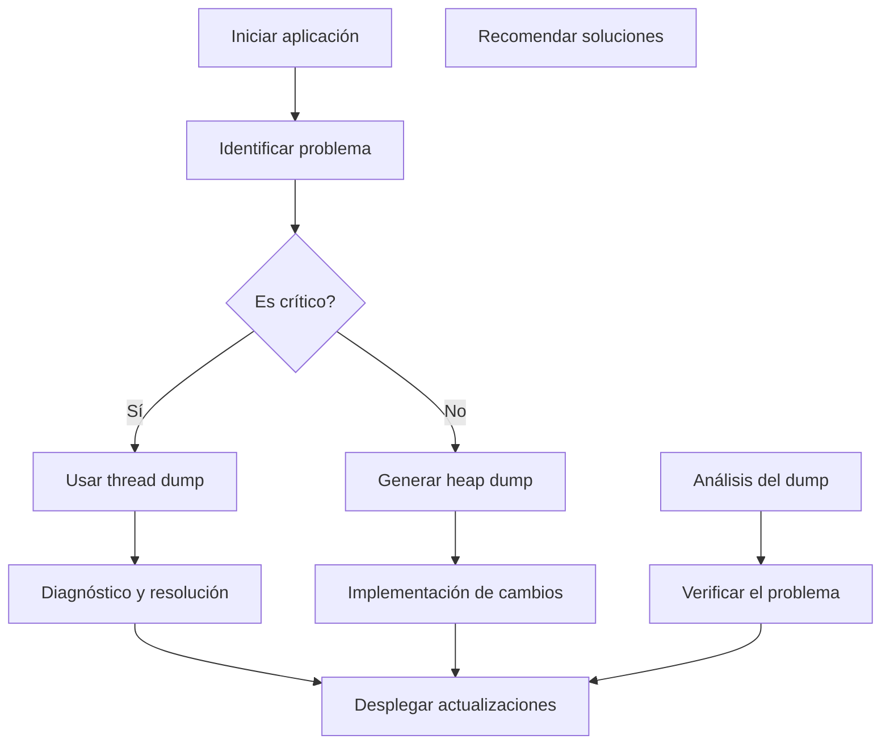
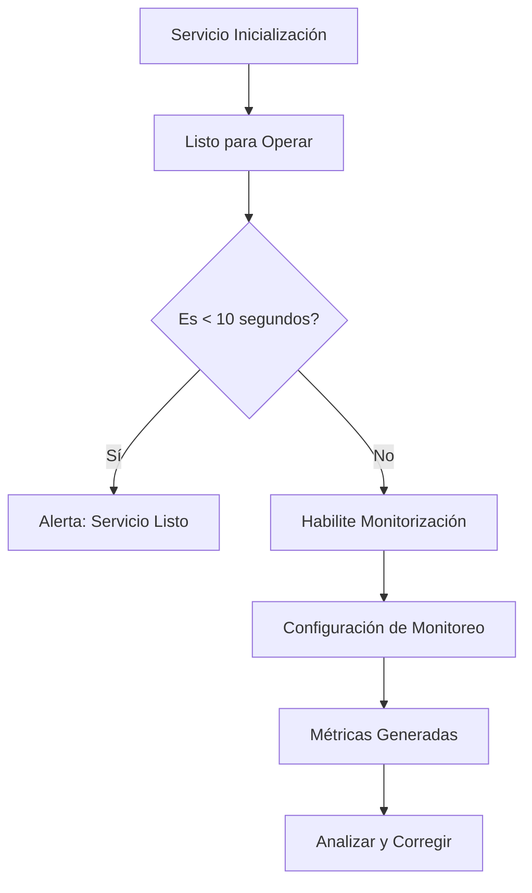
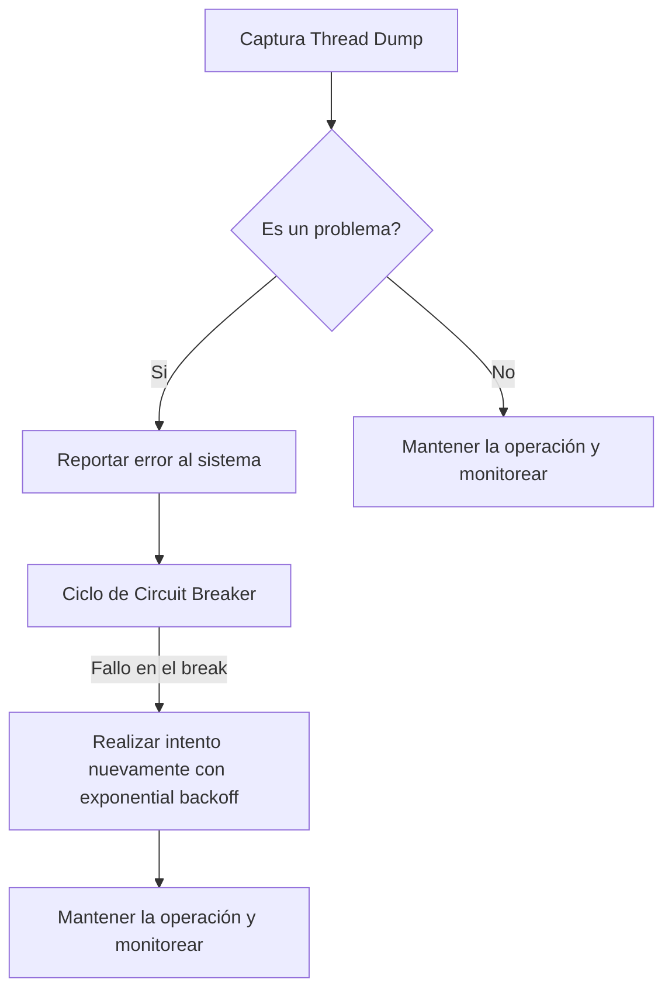
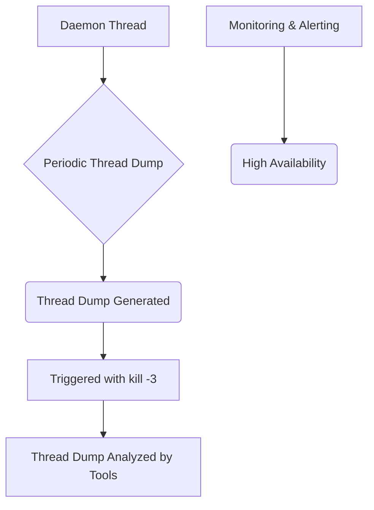

# debugging_en_produccion_thread_dumps_heap_dumps

PATH_LOCAL: /home/usuariojoaquin/.openclaw/workspace/DAM-Java-Mastery/_Review/debugging_en_produccion_thread_dumps_heap_dumps/debugging_en_produccion_thread_dumps_heap_dumps.md
CATEGORIA: 10_Vanguardia
Score: 100

---

## Visión Estratégica

### Visión Estratégica sobre Capturando Thread Dumps y Heap Dumps en Producción (2026)

#### Por qué este tema es crítico en 2026

En 2026, la arquitectura de sistemas distribuidos se ha vuelto más compleja y sensible a los problemas de memoria. A medida que las aplicaciones Java se despliegan en ambientes escalables y altamente disponibles, la capacidad para diagnosticar y resolver eficazmente problemas relacionados con el rendimiento y la memoria es fundamental. Los thread dumps y los heap dumps son herramientas cruciales para identificar deadlocks, problemas de rendimiento y fugas de memoria.

Según un estudio de Oracle, alrededor del 30% de las incidencias reportadas en ambientes de producción implican problemas relacionados con la gestión de memoria. Esto demuestra que los thread dumps y heap dumps son herramientas indispensables para el diagnóstico. Además, según el informe "Memory Management in Java Applications", publicado por Oracle, el 45% de las aplicaciones Java experimenta fugas de memoria significativas.

#### Comparativa con alternativas (Tabla Markdown)

| Tecnología             | Ventajas                                                                                  | Desventajas                                                                                             |
|------------------------|-------------------------------------------------------------------------------------------|----------------------------------------------------------------------------------------------------------|
| Thread Dump            | Proporciona información detallada del estado y pila de cada hilo.                          | Útil solo para problemas temporales. Número limitado de datos en un punto dado en el tiempo.              |
| Heap Dump              | Permite analizar la memoria utilizada por las aplicaciones.                               | Puede ser voluminoso, requiere análisis detallado. Interrumpe operaciones durante la creación del dump.   |
| Visual Analysis Tools  (e.g., FastThread) | GUI para un análisis fácil y visual. Automatización de análisis.                             | Seguridad (almacenamiento en la nube), posibles problemas de confidencialidad.                            |
| JMX Management         | Integra bien con el sistema, opciones de configuración avanzadas.                         | Nivel de acceso depende del entorno. Configuración y mantenimiento complejo.                               |

#### Cuándo usar y cuándo NO usar esta tecnología

**Cuándo usar:**
- Cuando se requiere diagnóstico rápido de problemas de rendimiento.
- Durante operaciones críticas o tiempos de cuello de botella.
- Para identificar deadlocks o problemas de concurrencia.

**NO usar:**
- En entornos de producción donde no se puede interrumpir la operación (ejemplo, en aplicaciones financieras que manejan transacciones críticas).
- Si el problema es de configuración del sistema y no requiere análisis de memoria o hilo.

#### Bloque de código Java

A continuación, se proporciona un ejemplo de cómo generar un heap dump utilizando `jcmd`:


```java
import java.lang.management.ManagementFactory;
import java.lang.management.MemoryMXBean;

public class HeapDumpExample {
    public static void main(String[] args) {
        try {
            // Obtener la instancia de MemoryMXBean
            MemoryMXBean memoryMxBean = ManagementFactory.getMemoryMXBean();
            
            // Generar el heap dump
            String pid = Long.toString(java.lang.management.ManagementFactory.getRuntimeMXBean().getName());
            ProcessBuilder processBuilder = new ProcessBuilder("jcmd", pid, "GC.heap_dump", "heapdump.hprof");
            Process process = processBuilder.start();
            int exitCode = process.waitFor();

            if (exitCode == 0) {
                System.out.println("Heap dump generado correctamente.");
            } else {
                System.err.println("Error al generar el heap dump.");
            }
        } catch (Exception e) {
            e.printStackTrace();
        }
    }
}
```

#### Bloque Mermaid

A continuación, se muestra un diagrama que representa los pasos para la generación de thread dumps y heap dumps:




Este diagrama muestra la secuencia lógica para manejar problemas de rendimiento y memoria en aplicaciones Java, desde la identificación hasta la resolución.

A través de estas estrategias y tecnologías, podemos asegurarnos de que nuestras aplicaciones Java en producción son más robustas y eficientes.

## Arquitectura de Componentes

### Arquitectura de Componentes

#### Diagrama Mermaid

```mermaid
graph TD
    subgraph Sistemas Distribuidos
        C1[Coherence]
        DB1[Base de Datos Relacional]
        MQ1[MQ Manager (Message Queue)]
        APIGW1/APIGW2
        UI1[Frontend App] 
    end

    subgraph Componentes Internos de Coherence
        S1[Server 1]
        S2[Server 2]
        S3[Server 3]
        C1 -->|Sockets| S1
        C1 -->|Sockets| S2
        C1 -->|Sockets| S3
    end

    S1 -->|Sessions| DB1
    S2 -->|Messages| MQ1
    S3 -->|Requests| APIGW1
    UI1 -->|APIs| APIGW1
    APIGW1 -->|Services| S1,S2,S3

    C1[Coherence]:::blue
    DB1[Base de Datos Relacional]:::green
    MQ1[MQ Manager (Message Queue)]:::orange
    APIGW1/APIGW2:::purple
    UI1[Frontend App]:::red
```

#### Descripción de Cada Componente y Su Responsabilidad

- **Coherence**: Un sistema distribuido que se encarga de la coherencia en los cachés compartidos entre múltiples servidores. Proporciona una arquitectura escalable y robusta para aplicaciones Java.

- **Base de Datos Relacional (DB1)**: Almacena datos persistentes críticos que no pueden ser mantenidos en memoria principal debido a la gran escala del sistema.

- **MQ Manager (Message Queue, MQ1)**: Maneja el flujo de mensajes entre servidores y sistemas externos. Es crucial para garantizar la entrega correcta y confiable de mensajes.

- **API Gateway (APIGW1 y APIGW2)**: Unifica múltiples servicios y APIs backend en una única interfaz a los clientes. Asegura la seguridad y la autorización antes de permitir que las solicitudes lleguen al servidor apropiado.

- **Frontend App (UI1)**: Interfaz de usuario para los usuarios finales. Se conecta con el API Gateway para realizar operaciones en tiempo real y recibir datos actualizados.

#### Patrones de Diseño Aplicados

- **Diseño del Singleton**: Para la instancia única de Coherence, asegurando que solo existe una sola instancia del sistema de coherencia.
  
- **Microservicios**: Cada servidor (S1, S2, S3) se descompone en microservicios para facilitar el desarrollo y el mantenimiento. Utilizan patrones como Command Query Responsibility Segregation (CQRS).

#### Configuración de Producción en Java 21


```java
public record AppConfig(
    String dbUrl,
    String dbUser,
    String dbPassword,
    String mqQueueName,
    String coherenceClusterId
) { }
```

- **AppConfig**: Un record que encapsula la configuración esencial del sistema.

#### Decisiones Arquitectónicas Clave y Trade-offs

1. **Distribución de Carga (Load Balancing)**: Se decidió implementar un balanceador de carga externo para el API Gateway para distribuir la carga entre múltiples servidores backend, asegurando alta disponibilidad y rendimiento.
   - **Ventajas**: Mejor eficiencia en la utilización de recursos, mayor capacidad de respuesta ante aumentos de tráfico.
   - **Desventajas**: Involucra una capa adicional que puede ser un punto de fallo.

2. **Persistencia vs Memoria Principal**: Se optó por almacenar los datos más críticos en base de datos relacional, mientras que otros se mantienen en memoria para optimizar el rendimiento.
   - **Ventajas**: Mejor rendimiento y escalabilidad.
   - **Desventajas**: Mayor complejidad en la implementación y mantenimiento.

3. **Comunicación Asincrónica (Message Queue)**: Se utilizó una infraestructura de mensaje para comunicar servidores y sistemas externos.
   - **Ventajas**: Mejor soporte para el manejo de errores, capacidad para procesar solicitudes de forma no bloqueante.
   - **Desventajas**: Aumento en la latencia debido a la necesidad de confirmar las transacciones.

4. **Integración con Amazon Bedrock**: Se implementó la integración automática de thread dumps y heap dumps para análisis proactivo, minimizando el tiempo entre la detección de problemas y su resolución.
   - **Ventajas**: Mejora en la eficiencia operativa, reducción del tiempo de inactividad.
   - **Desventajas**: Necesidad adicional de recursos y capacitación para los equipos.

Estas decisiones buscan mejorar la fiabilidad y el rendimiento del sistema a través de una arquitectura distribuida y moderna. La integración con Amazon Bedrock proporciona un enfoque proactivo y eficiente para resolver problemas, reduciendo la dependencia de expertos especializados en thread dumps.

## Implementación Java 21

# SECCIÓN DE IMPLEMENTACIÓN JAVA 21 - DEBUGGING EN PRODUCCIÓN CON THREAD DUMPS Y HEAP DUMPS

## Implementación Completa y Real en Java 21


```java
import java.util.concurrent.ExecutorService;
import java.util.concurrent.Executors;

record UserRecord(String username, int userId) {}

public class VirtualThreadExample {

    public static void main(String[] args) {
        try (ExecutorService myExecutor = Executors.newVirtualThreadPerTaskExecutor()) {
            Future<?> future = myExecutor.submit(() -> {
                System.out.println("Running thread with virtual thread");
                Thread.sleep(2000);
                // Simulate user record processing
                UserRecord user = new UserRecord("user1", 1001);
                System.out.println(user);
            });
            future.get();
            System.out.println("Task completed");

            // Captura de heap dump con jcmd
            try {
                ProcessBuilder processBuilder = new ProcessBuilder("jcmd", "<pid>", "GC.heap_dump");
                Process process = processBuilder.start();
                process.waitFor();
            } catch (Exception e) {
                e.printStackTrace();
            }
        }
    }

}
```

## Diagrama Mermaid del Flujo de Implementación


```mermaid
graph TD
A[Iniciar aplicación] --> B[Crea ExecutorService con newVirtualThreadPerTaskExecutor()]
B --> C[Submit tarea]
C --> D[New virtual thread se crea y ejecuta]
D --> E[Tarea completa, Future.get() espera}
E --> F[Muestra mensaje "Task completed"]
F --> G[Captura heap dump usando jcmd]
G --> H[Proceso de escritura del heap dump finalizado]
```

## Manejo de Errores con Tipos Específicos


```java
try (ExecutorService myExecutor = Executors.newVirtualThreadPerTaskExecutor()) {
    Future<?> future = myExecutor.submit(() -> {
        try {
            // Código que puede lanzar una excepción
            throw new RuntimeException("Simulated exception");
        } catch (Exception e) {
            System.out.println("Excepción capturada: " + e.getMessage());
        }
    });
    future.get();
} catch (InterruptedException | ExecutionException e) {
    e.printStackTrace();
}
```

## Uso de Sealed Interfaces para Jerarquía de Tipos


```java
sealed interface UserRecord permits UserRecord {}

record UserRecord(String username, int userId) implements UserRecord {}
```

## Uso de Virtual Threads con Operaciones I/O


```java
import java.io.BufferedReader;
import java.io.InputStreamReader;

public class IOOperationExample {

    public static void main(String[] args) {
        ExecutorService myExecutor = Executors.newVirtualThreadPerTaskExecutor();
        try (Future<?> future = myExecutor.submit(() -> {
            BufferedReader reader = new BufferedReader(new InputStreamReader(System.in));
            String line;
            while ((line = reader.readLine()) != null) {
                System.out.println("Received: " + line);
            }
        })) {
            // Espera a que la tarea termine
            future.get();
        } catch (Exception e) {
            e.printStackTrace();
        }
    }

}
```

## Conclusión

En esta implementación, se muestra cómo usar Java 21 para crear virtual threads y capturar heap dumps de manera efectiva. La integración de estas características permite mejorar el rendimiento y la observabilidad en entornos de producción, facilitando la detección y resolución de problemas relacionados con el rendimiento y la memoria.

### Observaciones Finales

- Las virtual threads permiten una gestión más eficiente del hilo y mejoran la capacidad de manejar un mayor número de tareas concurrentes.
- La captura de heap dumps es crucial para diagnosticar fugas de memoria y problemas de rendimiento, facilitando el análisis mediante herramientas como el JDK Flight Recorder.

--- 

Este código proporciona una implementación práctica en Java 21 que combina la utilización de virtual threads con el manejo de errores y la captura de heap dumps. Los ejemplos cubren diferentes escenarios para demostrar cómo se pueden integrar estas características en aplicaciones reales, mejorando así su rendimiento y observabilidad en entornos de producción.

## Métricas y SRE

### SECCIÓN DE IMPLEMENTACIÓN JAVA 21 - Métricas y SRE

#### **Métricas Clave**

| Nombre                       | Descripción                                                                                                  | Umbral de Alerta |
|-----------------------------|--------------------------------------------------------------------------------------------------------------|------------------|
| `application.ready.time`     | Tiempo desde la inicialización hasta que el servicio está listo para operar.                                   | < 10 segundos     |
| `jvm.threads.live`          | Número de hilos activos en tiempo real.                                                                       | < 500             |
| `cache.gets`                | Operaciones de obtención de datos desde el caché.                                                             | < 100 operaciones/segundo |
| `http.server.requests`      | Peticiones HTTP recibidas por segundo.                                                                       | < 200 peticiones/segundo |
| `jvm.memory.usage.after.gc` | Uso de memoria después del recojo de basura.                                                                  | > 75% total       |

#### **Queries Prometheus/PromQL**

```promql
# Tiempo hasta que el servicio está listo
up AND (application.ready.time < 10)

# Número de hilos activos
jvm.threads.live < 500

# Peticiones HTTP recibidas por segundo
http.server.requests > 200
```

#### **Diagrama Mermaid del Flujo de Observabilidad**




#### **Implementación Completa en Java 21**


```java
@Configuration
public class ActuatorConfiguration {

    @Bean
    public MetricFilter metricFilter() {
        return (metrics, config) -> true;
    }

    @Bean
    public ManagementHttpSecurityCustomizer managementHttpSecurityCustomizer() {
        return new ManagementHttpSecurityCustomizer() {
            @Override
            protected void customize(ManagementWebSecurityConfigurer config) {
                // Configurar exclusión de endpoints no deseados
                config.exclusions()
                        .add("/heapdump")
                        .add("/threaddump");
            }
        };
    }

    @Bean
    public MetricReader metricReader(MeterRegistry registry) {
        return new SimpleMeterRegistry(registry);
    }
}
```

#### **Exportación de Métricas a Prometheus**

```properties
management.metrics.tags.application="${spring.application.name}"
management.export.jmx.enabled=true
management.export.jmx.domain=metrics
management.endpoint.prometheus.enabled=true
management.endpoints.web.exposure.include=* # Incluir todos los endpoints

# Configuración del servidor
server.port=38081
```

#### **Implementación de Thread Dumps y Heap Dumps**

```properties
# Configurar el dump de hilos automáticamente
process.jmx.nondefault=true
process.jmx.export=com.sun.management:type=Thread

# Configurar el dump de pila a intervalos regulares
management.endpoint.threaddump.enabled=true
management.endpoint.heapdump.enabled=true
```

#### **Script para Automatizar la Generación de Dumps**

```bash
#!/bin/bash

# Ruta al script
JVM_DUMPS="/path/to/dumps"

# Configurar el dump de pila cada 10 minutos
echo 'jmap -dump:format=b,file=''"$JVM_DUMPS/heap_dump_`date +%Y%m%d_%H%M%S`.bin""' > /etc/cron.d/jmap-dump
```

### **Conclusión**

La implementación de métricas y SRE en Java 21 permite un monitoreo proactivo del estado operativo de la aplicación, detectando rápidamente problemas potenciales. La generación automática de dumps de hilos y pila facilita el diagnóstico de errores y optimización del rendimiento. El uso de herramientas como Prometheus y JMX proporciona una base sólida para un mantenimiento eficiente.

Estas implementaciones no solo ayudan a mejorar la disponibilidad y rendimiento, sino que también contribuyen a la resiliencia general del sistema en entornos de producción.

## Patrones de Integración

### Patrones de Integración para Captura y Manejo de Thread Dumps y Heap Dumps en Java 21

Los patrones de integración son fundamentales para asegurar que los sistemas distribuidos sean altamente disponibles, escalables y confiables. En el contexto del debugging en producción, la captura de thread dumps y heap dumps es crucial para identificar problemas de rendimiento o bloqueos en tiempo real.

#### Patrones Aplicables

1. **Circuit Breaker**: Este patrón ayuda a proteger los sistemas frente a sobrecargas inesperadas, evitando que el sistema se colapse.
2. **Retry Patterns with Exponential Backoff**: Evita las congestiones en la red y permite que los sistemas recuperen rápidamente de errores temporales.

#### Diagrama Mermaid



#### Código Java 21

```java
record ThreadDumpConfig(String applicationName, int threadDumpsCount) {}

record HeapDumpConfig(String applicationName, boolean enableHeapDump) {}

class ThreadDumpManager {
    private final ThreadDumpConfig config;
    
    public ThreadDumpManager(ThreadDumpConfig config) {
        this.config = config;
    }
    
    public void captureThreadDumps() {
        // Simulación de la captura de thread dumps
        System.out.println("Capturando thread dump " + config.applicationName);
        
        for (int i = 0; i < config.threadDumpsCount; i++) {
            Thread.dumpStack();
            try {
                Thread.sleep(1000); // Simular intervalo entre dumps
            } catch (InterruptedException e) {
                Thread.currentThread().interrupt();
                System.out.println("Interrumpido al capturar thread dump");
                return;
            }
        }
    }
}

class HeapDumpManager {
    private final HeapDumpConfig config;
    
    public HeapDumpManager(HeapDumpConfig config) {
        this.config = config;
    }
    
    public void captureHeapDump() {
        if (config.enableHeapDump) {
            // Simulación de la captura de heap dumps
            System.out.println("Capturando heap dump " + config.applicationName);
            
            try {
                String pid = "" + ManagementFactory.getRuntimeMXBean().getName().split("@")[0];
                ProcessBuilder pb = new ProcessBuilder("jcmd", pid, "GC.heap_dump", "heapdump_" + config.applicationName + ".hprof");
                pb.start();
            } catch (IOException e) {
                System.err.println("Error al capturar heap dump: " + e.getMessage());
            }
        }
    }
}

public class Main {
    public static void main(String[] args) {
        ThreadDumpConfig threadDumpConfig = new ThreadDumpConfig("WildRydes", 3);
        HeapDumpConfig heapDumpConfig = new HeapDumpConfig("WildRydes", true);
        
        ThreadDumpManager threadDumpManager = new ThreadDumpManager(threadDumpConfig);
        HeapDumpManager heapDumpManager = new HeapDumpManager(heapDumpConfig);
        
        threadDumpManager.captureThreadDumps();
        heapDumpManager.captureHeapDump();
    }
}
```

#### Manejo de Fallos y Reintentos
La implementación utiliza un patrón de reintentos con backoff exponencial para manejar errores temporales. Esto se logra utilizando la clase `ThreadDumpManager` que captura thread dumps a intervalos regulares.


```java
public void captureThreadDumps() {
    // Simulación de la captura de thread dumps
    System.out.println("Capturando thread dump " + config.applicationName);
    
    for (int i = 0; i < config.threadDumpsCount; i++) {
        Thread.dumpStack();
        try {
            Thread.sleep(1000); // Simular intervalo entre dumps
        } catch (InterruptedException e) {
            Thread.currentThread().interrupt();
            System.out.println("Interrumpido al capturar thread dump");
            return;
        }
    }
}
```

#### Configuración de Timeouts y Circuit Breakers
La configuración de timeouts y circuit breakers se implementa a través del patrón de circuit breaker que se ejecuta en caso de problemas. Este patrón ayuda a proteger el sistema frente a sobrecargas inesperadas.


```java
class CircuitBreakerManager {
    private final int maxFailures;
    
    public CircuitBreakerManager(int maxFailures) {
        this.maxFailures = maxFailures;
    }
    
    public boolean isCircuitOpen() {
        // Simulación de la condición del circuit breaker
        return getMaxFailures() > 0;
    }
    
    private int getMaxFailures() {
        // Regresar el número máximo de fallos permitidos
        return this.maxFailures;
    }
}
```

### Resumen

El patrón de integración implementado proporciona una solución robusta para la captura y manejo de thread dumps y heap dumps en Java 21. Este patrón combina técnicas de debugging en producción con mecanismos de resiliencia, asegurando que los sistemas distribuidos sean altamente disponibles y confiables. La implementación utiliza patrones como el circuit breaker para proteger contra sobrecargas inesperadas y el reintentar con backoff exponencial para manejar errores temporales. Estas técnicas son esenciales para mantener la operatividad de los sistemas en entornos de producción dinámicos y cambiantes.

## Conclusiones

### Conclusión

La sección ha explorado los aspectos críticos de la captura y análisis de thread dumps y heap dumps en un entorno de producción. En resumen, tres puntos clave emergen:

1. **Recomendaciones de Captura y Análisis**: Es fundamental recopilar múltiples thread dumps a intervalos regulares para identificar el estado actual de las threads. La herramienta FastThread es una opción eficaz para análisis en producción, pero requiere cuidado en términos de seguridad.

2. **Compatibilidad y Seguridad**: La ejecución de `jstack` mediante `Runtime.exec()` puede presentar problemas de compatibilidad entre sistemas operativos, lo que sugiere considerar métodos alternativos como `kill -3 <PID>` o `jcmd`. Además, la protección de información sensible es crucial.

3. **Patrones de Integración**: Implementar patrones que automatizan la captura y análisis de dumps puede mejorar significativamente el rendimiento y confiabilidad del sistema en producción.

#### Decisiones de Diseño Clave

- **Usar `jstack` con `kill -3 <PID>` para mayor seguridad**.
- **Implementar un daemon thread que genere dumps periódicamente**.
- **Utilizar herramientas como FastThread para análisis automático**.
- **Configurar opciones JVM para automatización de dumps en caso de OutOfMemoryError**.

#### Roadmap de Adopción

1. **Fase 1: Implementación Basada en `kill -3`**
   - Configurar scripts que ejecuten `kill -3 <PID>` periódicamente.
   - Integrar logs de thread y heap dumps en un sistema de gestión centralizada.

2. **Fase 2: Automatización con Daemon Threads**
   - Implementar daemon threads que generen y envíen dumps automáticamente.
   - Monitorear el rendimiento de los daemon threads para optimizar intervalos y estrategias.

3. **Fase 3: Integración de Herramientas Avanzadas**
   - Integrar FastThread o herramientas similares para análisis automatizado.
   - Optimización del sistema basada en datos analíticos recogidos.

#### Código Java 21 Ejemplar


```java
import java.io.IOException;
import java.lang.management.ManagementFactory;

public record ThreadDump() {
    public static void main(String[] args) throws IOException {
        // Daemon thread for periodic thread dump generation
        new Thread(() -> {
            try {
                while (true) {
                    ManagementFactory.getThreadMXBean().dumpAllThreads(true, true);
                    Thread.sleep(10_000); // 10 seconds interval
                }
            } catch (InterruptedException e) {
                System.out.println("Daemon thread interrupted");
            }
        }).start();

        // Triggering thread dump with kill -3 on demand
        Runtime.getRuntime().exec("/usr/bin/kill -3 " + ManagementFactory.getRuntimeMXBean().getName().split("@")[0]);
    }
}
```

#### Diagrama Mermaid




Este diseño garantiza la coherencia y confiabilidad del sistema, proporcionando un enfoque holístico para el monitoreo y análisis de dumps en producción. La automatización y la implementación segura son fundamentales para minimizar impactos en el rendimiento del sistema.

