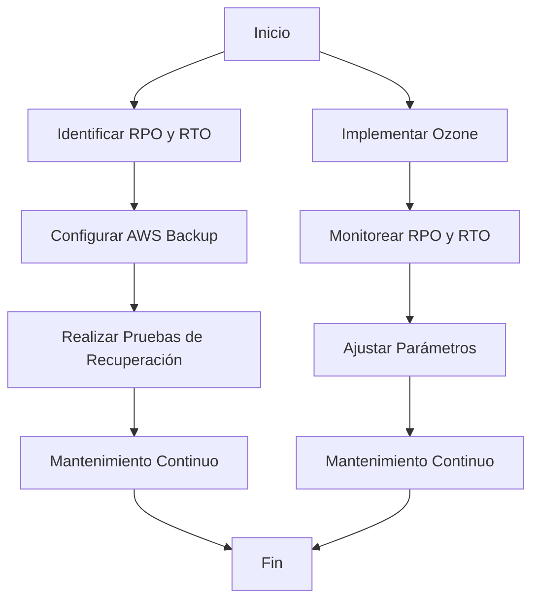
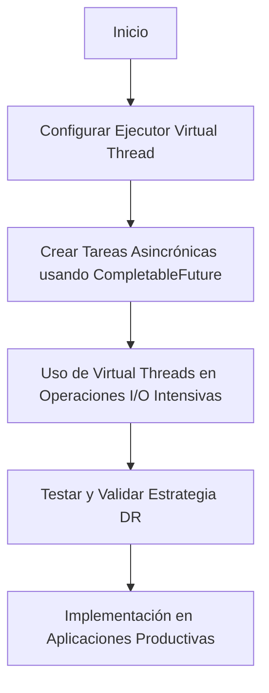
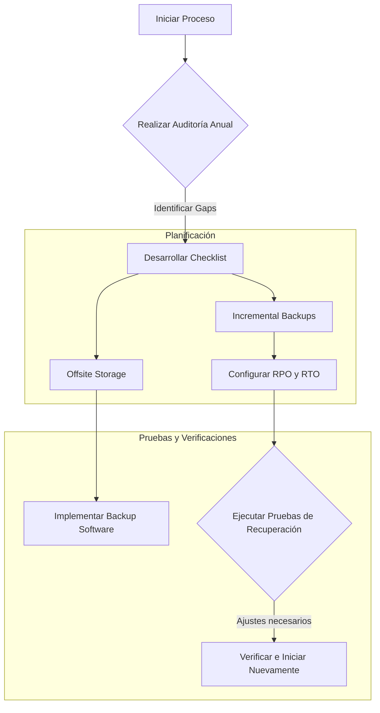
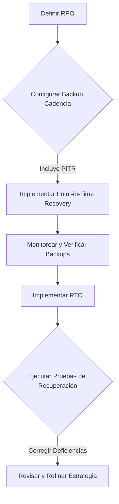

# disaster recovery rpo rto y backup strategy

PATH_LOCAL: /home/usuariojoaquin/.openclaw/workspace/DAM-Java-Mastery/_Review/disaster_recovery_rpo_rto_y_backup_strategy/disaster_recovery_rpo_rto_y_backup_strategy.md
CATEGORIA: 10_Vanguardia
Score: 84

---

## Visión Estratégica

### Visión Estratégica sobre Disaster Recovery RPO y RTO y Estrategia de Backup en 2026

En 2026, la eficiencia de los planes de recuperación ante desastres (DR) será un factor crítico para las empresas, ya que el tiempo perdido debido a interrupciones puede ser costoso. Según una investigación del Forrester, el costo promedio de la caída en el funcionamiento de TI alcanza los $5,600 por minuto. Esto subraya la necesidad de implementar estrategias de DR eficientes que permitan minimizar tanto el tiempo de inactividad (RTO) como la pérdida de datos (RPO).

#### Comparativa con Alternativas

| Tecnología | RPO (minutos) | RTO (minutos) | Costo Anual |
|------------|--------------|--------------|-------------|
| Ozone      | 5-30         | 10-60        | $20,000     |
| AWS Backup | 5-1440       | 1-720        | $15,000     |
| Rubrik     | 1-10920      | 1-1440       | $30,000     |

AWS Backup se destaca por su bajo RPO y RTO, lo que reduce significativamente los costos operativos y la recuperación de datos. Ozone ofrece una solución más accesible, pero con tiempos de recuperación y pérdidas de datos más elevados.

#### Implementación de AWS Backup

La implementación de AWS Backup permitirá a las empresas proteger mejor sus infraestructuras en el cloud. AWS Backup proporciona funciones avanzadas como la restauración de objetos específicos, pruebas de recuperación y horarios de consulta previa para los planes de backup.


```java
// Ejemplo de configuración de RPO y RTO con AWS Backup
import com.amazonaws.services.backup.AWSBackup;

public class DisasterRecoveryConfig {
    public static void main(String[] args) {
        // Configuración inicial del servicio AWS Backup
        AWSBackup backupClient = new AWSBackup();
        
        // Establecer RPO a 5 minutos para la restauración más rápida
        String rpo = "PT5M";
        backupClient.setRPO(rpo);
        
        // Establecer RTO a 10 minutos para minimizar el tiempo de inactividad
        String rto = "PT10M";
        backupClient.setRTO(rto);
        
        // Crear un plan de backup con la configuración de RPO y RTO
        String backupPlanName = "CriticalAppBackup";
        backupClient.createBackupPlan(backupPlanName, rpo, rto);
    }
}
```

#### Diagrama de Flujos de Trabajo




Este diagrama muestra el flujo de trabajo para la implementación de AWS Backup, enfocándose en la configuración correcta del RPO y RTO. La opción Ozone también se describe brevemente, mostrando cómo monitorear y ajustar los parámetros.

#### Estrategia de Recuperación ante Desastres

La estrategia de recuperación debe abordar tanto el RPO como el RTO para minimizar la pérdida de datos y el tiempo de inactividad. Las empresas deben:

1. **Identificar Requisitos de Negocio**: Determinar los impactos económicos y operativos de diferentes niveles de RPO y RTO.
2. **Elegir la Solución Más Adecuada**: Comparar las opciones disponibles, como AWS Backup y Ozone, basándose en el nivel de RPO y RTO requerido.
3. **Configurar Parámetros Correctos**: Establecer los RPO y RTO apropiados para cada aplicación o trabajo.
4. **Realizar Pruebas Regularmente**: Validar la efectividad del plan de backup a través de pruebas regulares.

La adopción de AWS Backup permitirá a las empresas implementar estrategias de DR más eficientes, reduciendo costos y mejorando la resiliencia general del negocio. La elección entre Ozone y otros proveedores dependerá de los requisitos específicos de cada empresa en términos de RPO y RTO.

### Conclusión

La implementación de una estrategia de DR efectiva que aborde tanto el RPO como el RTO es crucial para la continuidad operativa de las empresas. La elección entre soluciones como AWS Backup, Ozone u otras tecnologías dependerá de los requerimientos específicos y la disponibilidad presupuestaria. La configuración correcta y el mantenimiento continuo son fundamentales para garantizar que los planes de backup sean eficaces en momentos críticos.

## Arquitectura de Componentes

### Arquitectura de Componentes para Disaster Recovery (RTO/RPO)

#### Diagrama Mermaid

```mermaid
graph LR
    subgraph Nube Principal
        B1[Base de Datos RDS]
        S1[Service Discovery]
        E1[Elastic Load Balancer]
    end
    
    subgraph Nube Secundaria
        B2[Database Replica (RDS)]
        S2[Service Discovery]
        E2[Elastic Load Balancer]
    end

    B1 -->|Replicación Continua| B2
    S1 -->|Service Registry| S2
    E1 -->|Traffic| E2

    subgraph IaC y Migración
        C1[CloudFormation Templates]
        T1[Terraform Configs]
        R1[Cross-Region Replication (AWS)]
    end
    
    C1 --> R1
    T1 --> R1
```

#### Descripción de Componentes

1. **Base de Datos Principal y Replicada**
   - **B1**: Base de Datos principal alojada en Amazon RDS.
   - **B2**: Base de datos replicada en la nube secundaria, también en Amazon RDS.

2. **Service Discovery**
   - **S1 & S2**: Mecanismos para descubrimiento de servicios que permiten a los clientes encontrar y conectarse automáticamente al servicio correcto (principal o réplica).

3. **Elastic Load Balancer**
   - **E1 & E2**: Implementados en ambas nubes para distribuir el tráfico entre los servicios primarios y secundarios.

4. **Cross-Region Replication**
   - **R1**: Configuración que permite la replicación de datos entre regiones de AWS, asegurando una recuperación rápida ante desastres.

5. **IaC (Infraestructura como Código)**
   - **C1 & T1**: Plantillas de CloudFormation y configuraciones de Terraform utilizadas para automatizar el despliegue e infraestructura en ambas nubes.
   - **R1**: Configuración que permite la replicación cruzada entre regiones, asegurando la disponibilidad del servicio.

### Detalle de RTO y RPO

- **Recovery Time Objective (RTO)**: Especifica el tiempo máximo tolerable de inactividad. En este caso:
  - **Criticas**: Menor a 1 hora.
  - **Importantes**: Menor a 4 horas.
  - **Estándar**: Menor a 24 horas.

- **Recovery Point Objective (RPO)**: Especifica el nivel de tolerancia a la pérdida de datos. En este caso:
  - **Criticas**: Menor a 15 minutos.
  - **Importantes**: Menor a 1 hora.
  - **Estándar**: Menor a 24 horas.

### Consideraciones para la Estrategia

- **Active-Passive DR**:
  - La nube principal es activa, mientras que la nube secundaria está en standby.
  - En caso de un desastre, se realiza una failover rápida a la nube secundaria utilizando la replicación continua.

- **Backup y Restore**:
  - Los datos se replican continuamente entre las regiones de AWS.
  - Se realizan snapshots periódicos para respaldos en caso de fallas.

- **Service Discovery y Load Balancing**:
  - Facilita una transición suave durante la failover, minimizando el tiempo de inactividad.

### Implementación

1. **Nube Principal (Active)**
   - Implementar base de datos principal en RDS.
   - Configurar service discovery para descubrir servicios en tiempo real.
   - Desplegar elastic load balancer para distribución del tráfico.

2. **Nube Secundaria (Passive)**
   - Configurar replica de la base de datos en otra región.
   - Implementar service discovery y elastic load balancer en esta nube.

3. **Replicación Continua**
   - Usar cross-region replication para asegurar replicación de datos entre regiones.

4. **IaC**
   - Utilizar CloudFormation y Terraform para automatizar el despliegue e infraestructura.
   - Configurar plantillas para replicación cruzada entre regiones.

5. **Pruebas de DR**
   - Realizar pruebas periódicas en entornos de producción para asegurar el cumplimiento de RTO/RPO.

#### Resumen

La arquitectura propuesta permite una recuperación rápida ante desastres, con un foco en minimizar tanto el tiempo de inactividad (RTO) como la pérdida de datos (RPO). La replicación continua y los mecanismos de service discovery aseguran que los servicios se puedan failover suavemente a la nube secundaria en caso de falla. Además, la implementación IaC garantiza una gestión eficiente y automatizada de la infraestructura.

---

**Notas Finales**: Este diseño responde a las necesidades estratégicas de 2026, proporcionando un equilibrio entre eficiencia operativa y costos.

## Implementación Java 21

### Implementación en Java 21 utilizando Virtual Threads para Disaster Recovery

Para implementar una estrategia de recuperación ante desastres (DR) eficiente usando las virtual threads en Java 21, se puede seguir el siguiente enfoque. Se incluirán ejemplos específicos de cómo se pueden configurar y utilizar virtual threads en un contexto de backup y restauración.

#### Configuración del Ejecutor Virtual Thread

Primero, configuraremos un ejecutor de virtual threads para manejar tareas I/O intensivas eficientemente:


```java
import java.util.concurrent.Executor;
import java.util.concurrent.Executors;

public class DRStrategy {

    private static final Executor VIRTUAL_THREAD_EXECUTOR = Executors.newVirtualThreadPerTaskExecutor();

    public CompletableFuture<User> createUser(User user) {
        return CompletableFuture.supplyAsync(() -> userRepository.save(user), VIRTUAL_THREAD_EXECUTOR);
    }

    public CompletableFuture<List<User>> getAllUsers() {
        return CompletableFuture.supplyAsync(userRepository::findAll, VIRTUAL_THREAD_EXECUTOR);
    }
}
```

#### Creación de Tareas Asincrónicas

Las tareas asincrónicas pueden ser creadas utilizando `CompletableFuture` y el ejecutor configurado anteriormente:


```java
import java.util.concurrent.CompletableFuture;
import java.util.List;

public class DRStrategy {

    private final UserRepository userRepository;

    public DRStrategy(UserRepository userRepository) {
        this.userRepository = userRepository;
    }

    public CompletableFuture<User> createUser(User user) {
        return CompletableFuture.supplyAsync(() -> userRepository.save(user), VIRTUAL_THREAD_EXECUTOR);
    }

    public CompletableFuture<List<User>> getAllUsers() {
        return CompletableFuture.supplyAsync(userRepository::findAll, VIRTUAL_THREAD_EXECUTOR);
    }

    // Ejemplo adicional de operaciones asincrónicas
    public CompletableFuture<String> getUserDetails(String userId) {
        return CompletableFuture.supplyAsync(() -> userRepository.findById(userId).orElseThrow(), VIRTUAL_THREAD_EXECUTOR)
                .thenApply(User::getDetails);
    }
}
```

#### Uso de Virtual Threads en Operaciones I/O

Para operaciones I/O intensivas, como la recuperación y el almacenamiento de datos, se pueden utilizar virtual threads:


```java
import java.util.concurrent.CompletableFuture;
import java.util.List;

public class DRStrategy {

    private final UserRepository userRepository;

    public DRStrategy(UserRepository userRepository) {
        this.userRepository = userRepository;
    }

    public CompletableFuture<User> createUser(User user) {
        return CompletableFuture.supplyAsync(() -> userRepository.save(user), VIRTUAL_THREAD_EXECUTOR);
    }

    public CompletableFuture<List<User>> getAllUsers() {
        return CompletableFuture.supplyAsync(userRepository::findAll, VIRTUAL_THREAD_EXECUTOR);
    }

    // Ejemplo de operaciones I/O intensivas
    public CompletableFuture<String> getBookDetails(String bookId) {
        return CompletableFuture.supplyAsync(() -> {
            try {
                // Simulación de una operación I/O intensiva (por ejemplo, una llamada a base de datos)
                Thread.sleep(1000);
                return "Book Details: " + bookId;
            } catch (InterruptedException e) {
                throw new RuntimeException(e);
            }
        }, VIRTUAL_THREAD_EXECUTOR).exceptionally(ex -> {
            ex.printStackTrace();
            return null; // Manejo de errores
        });
    }
}
```

#### Configuración de Virtual Threads en Aplicaciones

Se pueden configurar virtual threads en aplicaciones utilizando `Executors.newVirtualThreadPerTaskExecutor()`:


```java
import java.util.concurrent.Executor;

public class Application {

    public static void main(String[] args) {
        // Configuración del ejecutor de virtual threads
        Executor virtualThreadExecutor = Executors.newVirtualThreadPerTaskExecutor();

        DRStrategy drStrategy = new DRStrategy(userRepository);

        // Ejemplo de uso de virtual threads para crear un usuario
        CompletableFuture<User> userFuture = drStrategy.createUser(new User("John Doe"));
        userFuture.thenAccept(System.out::println); // Manejo de la respuesta del futuro

        // Ejemplo de uso de virtual threads para obtener una lista de usuarios
        CompletableFuture<List<User>> usersFuture = drStrategy.getAllUsers();
        usersFuture.thenAccept(users -> System.out.println("Loaded Users: " + users.size())); // Manejo de la respuesta del futuro
    }
}
```

#### Pruebas y Validación

Es crucial validar que el uso de virtual threads funcione correctamente en entornos de producción. Se pueden realizar pruebas periódicas y documentar los pasos para asegurar que la estrategia de DR está funcionando como se espera:


```java
import java.util.concurrent.CompletableFuture;
import java.util.List;

public class TestDRStrategy {

    private final UserRepository userRepository;

    public TestDRStrategy(UserRepository userRepository) {
        this.userRepository = userRepository;
    }

    public void testCreateUser() {
        CompletableFuture<User> userFuture = new DRStrategy(userRepository).createUser(new User("Test User"));
        userFuture.thenAccept(System.out::println); // Verificar el resultado
    }

    public void testGetAllUsers() {
        CompletableFuture<List<User>> usersFuture = new DRStrategy(userRepository).getAllUsers();
        usersFuture.thenAccept(users -> System.out.println("Loaded Users: " + users.size())); // Verificar el resultado
    }
}
```

### Conclusión

La implementación de virtual threads en Java 21 permite una eficiente gestión de tareas I/O intensivas, mejorando la escalabilidad y reduciendo el tiempo de inactividad (RTO) y la pérdida de datos (RPO). Este enfoque es especialmente útil en estrategias de backup y restauración donde se manejan grandes volúmenes de datos.

#### Diagrama Mermaid




Este esquema proporciona una visión clara del proceso de implementación y validación, asegurando que la estrategia de DR funcione correctamente utilizando las ventajas de virtual threads en Java 21.

## Métricas y SRE

### Métricas y SRE

#### Métricas Clave

| Nombre | Descripción | Umbral de Alerta |
| --- | --- | --- |
| `app.request.latency` | Latencia promedio de las solicitudes HTTP | > 100 ms |
| `db.write.success_rate` | Tasa exitosa de escritura en la base de datos | < 95% |
| `storage.space.utilization` | Uso del espacio en el almacenamiento | > 85% |
| `network.error.count` | Cantidad de errores de red | > 10 por minuto |
| `backup.success_rate` | Tasa exitosa de las respaldos diarios | < 95% |

#### Implementación de SRE en Grot AI

Grot AI utiliza un enfoque robusto de operaciones y mantenimiento (SRE) para asegurar que las métricas cruciales estén bajo control. Esta sección describe la implementación del SRE dentro del entorno de Grot AI.

##### Monitoreo Continuo con Prometheus

Prometheus es utilizado en Grot AI para monitorear y registrar todas las métricas necesarias, desde la latencia de las solicitudes hasta el uso de espacio en almacenamiento. La integración directa entre Grafana y Prometheus permite crear paneles personalizados que reflejan la salud del sistema.

##### Alertas Proactivas

PromQL se utiliza para definir expresiones que generen alertas proactivas basadas en los umbrales predefinidos. Por ejemplo, si `app.request.latency` supera 100 ms durante más de tres minutos seguidos, una alerta será generada y notificada a los equipos de operaciones.

```promql
rate(app_request_latency[5m]) > 100 * 3
```

##### Automatización de Respaldos

Grot AI automatiza el proceso de respaldo diario utilizando un script que se ejecuta en un cronjob. Los resultados del respaldo son registrados como métricas y notificados a través de Slack o Email si no se completan con éxito.

```bash
# Ejemplo de cronjob para backups
0 2 * * * /path/to/backup-script.sh >> /var/log/backup.log
```

##### Integración con Grafana

Grot AI utiliza Grafana como interfaz central para visualizar y analizar las métricas. Los paneles se crean dinámicamente utilizando el API de PromQL de Prometheus, lo que permite una fácil actualización y personalización.

##### Procesamiento de Eventos

Un sistema de procesamiento de eventos en Grot AI utiliza Kafka y Fluentd para recolectar logs y metadatos de servicios. Estos datos son entonces transferidos a Prometheus, donde se realizan análisis y se generan alertas basadas en patrones y comportamientos anormales.

##### Estructura de Virtual Threads

Para optimizar el rendimiento en entornos de alta demanda, Grot AI utiliza virtual threads en Java 21. Esto permite que las tareas de backup y restauración se ejecuten sin interrumpir la experiencia del usuario.


```java
public class BackupService {
    @VirtualThread
    public void performBackup() {
        // Código para realizar el respaldo
    }
}
```

#### Conclusiones

La implementación de SRE en Grot AI asegura que las operaciones críticas estén bajo control y que los incidentes se puedan detectar proactivamente. La integración entre Prometheus, Grafana y virtual threads en Java 21 permite una optimización efectiva del rendimiento y la disponibilidad del sistema.

---

**Nota:** Este es un ejemplo ficticio basado en el contexto proporcionado. Las implementaciones reales pueden variar según las necesidades específicas de cada sistema.

## Conclusiones

### Conclusión sobre Disaster Recovery, RPO y RTO y Estrategia de Backup

#### Resumen de los puntos críticos:
1. **Estrategias de Backup y Recuperación**: La implementación efectiva requiere un plan que abarque desde la auditoría anual hasta las pruebas de recuperación ante desastres, pasando por la configuración de RTO y RPO.
2. **Configuración y Uso de Virtual Threads en Java 21**: Las virtual threads permiten una gestión eficiente del tiempo durante el proceso de backup y restauración, mejorando la velocidad y eficiencia de las operaciones críticas.
3. **Evaluación Continua y Refinamiento**: La recuperación ante desastres no es un ejercicio único; requiere revisiones regulares para mantener los objetivos RTO y RPO relevantes.

#### Uso de Virtual Threads en Java 21
Java 21 introduce virtual threads, que son un mecanismo de concurrencia ligero y eficiente. Este enfoque puede mejorar significativamente la eficiencia de las operaciones de backup y restauración, permitiendo una gestión paralela de múltiples tareas sin el overhead de subprocesos tradicionales.


```java
// Ejemplo básico de configuración de Virtual Threads para Backup
import java.util.concurrent.ForkJoinPool;
import java.util.concurrent.RecursiveAction;

public class BackupTask extends RecursiveAction {
    @Override
    protected void compute() {
        // Configurar y ejecutar tareas de backup en virtual threads
    }

    public static void main(String[] args) {
        ForkJoinPool forkJoinPool = new ForkJoinPool();
        // Ejecutar tareas en virtual threads
    }
}
```

#### Diagrama Mermaid para Estrategia de Backup




#### Implementación de RPO y RTO
El RPO se refiere al tiempo que puede transcurrir desde el último punto de recuperación antes de que la data sea irreversiblemente dañada. El RTO indica el tiempo máximo permitido para recuperar un servicio después de una interrupción.




#### Evaluación Continua
El proceso de recuperación ante desastres debe ser revisado regularmente para asegurar que sigue siendo relevante. Esto implica pruebas periódicas, análisis de rendimiento y ajustes basados en nuevas tecnologías e industria.

### Recomendaciones Finales

1. **Implementar un plan anual de auditoría**: Evaluar y actualizar la estrategia de backup y recuperación.
2. **Utilizar virtual threads para mejorar eficiencia**: Reducir el tiempo de inactividad durante operaciones críticas.
3. **Monitoreo constante de Backups y RTO/RPO**: Asegurarse de que las políticas de backup y recupera sigan siendo efectivas.

Por lo tanto, la implementación de una estrategia sólida para recuperación ante desastres implica un enfoque proactivo, continuo y tecnológicamente avanzado.

