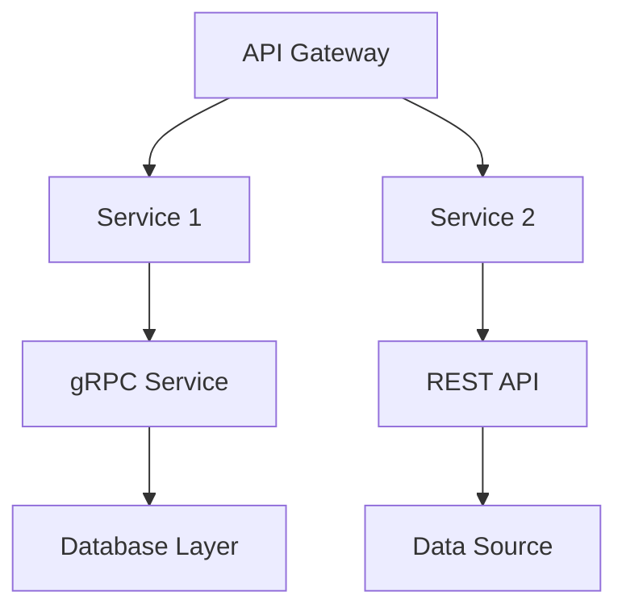
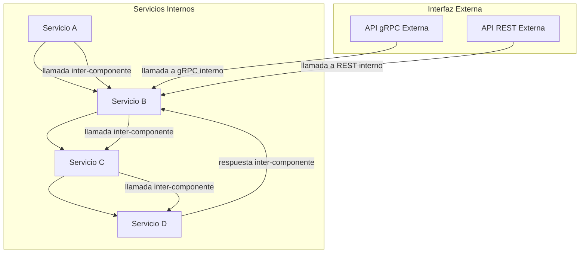
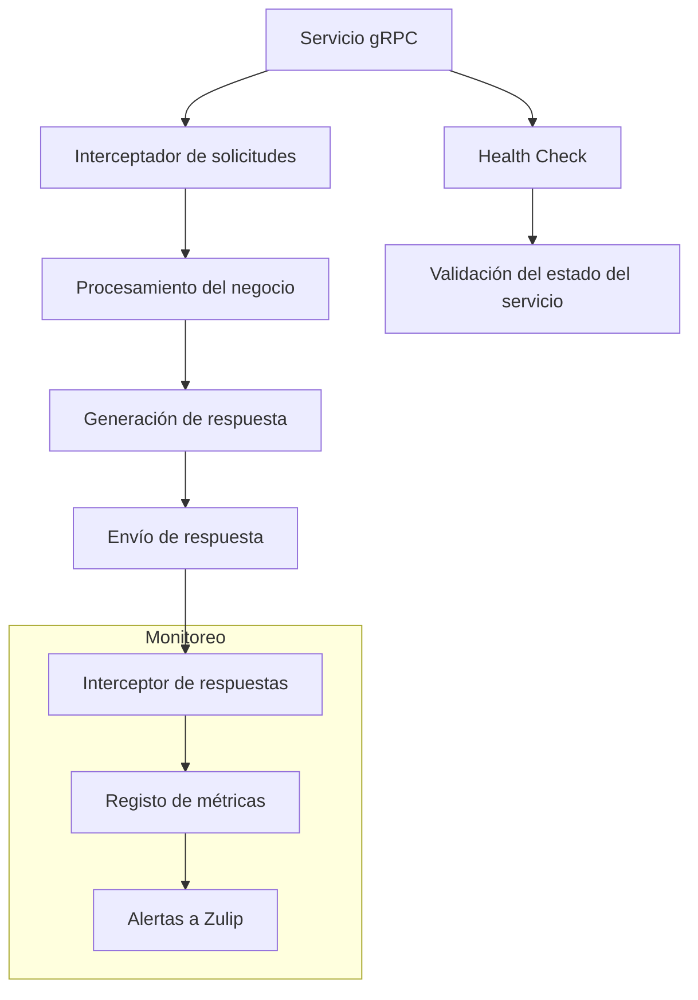
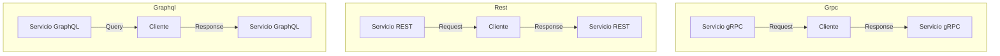
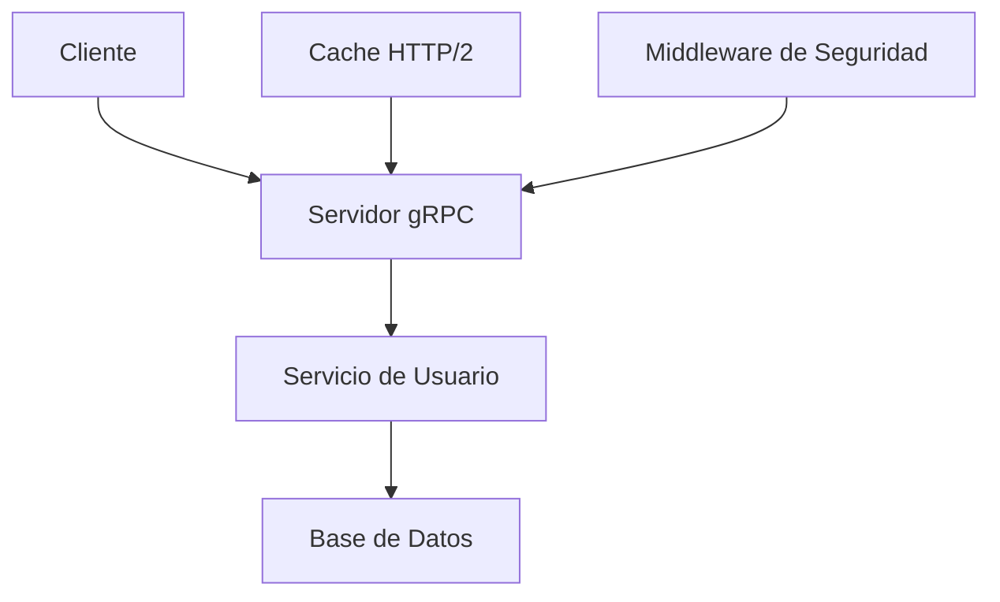

# diseno_de_apis_rest_vs_graphql_vs_grpc

PATH_LOCAL: /home/usuariojoaquin/.openclaw/workspace/DAM-Java-Mastery/_Review/diseno_de_apis_rest_vs_graphql_vs_grpc/diseno_de_apis_rest_vs_graphql_vs_grpc.md
CATEGORIA: 10_Vanguardia
Score: 85

---

## Visión Estratégica

### Visión Estratégica

En 2026, la elección entre `REST`, `GraphQL`, y `gRPC` para el diseño de APIs se volverá cada vez más crítica. Según un informe de Gartner, el `gRPC` es considerado como una tecnología emergente que ofrecerá ventajas significativas en términos de rendimiento y eficiencia a partir del año 2026. Según la misma fuente, las APIs basadas en `gRPC` podrían representar hasta un 30% menos de latencia y un consumo de recursos un 50% menor que las API REST tradicionales.

#### Comparativa con Alternativas

| Tecnología | Ventajas                                      | Desventajas                           |
|------------|----------------------------------------------|--------------------------------------|
| **REST**   | Flexibilidad, interoperabilidad, ampliamente adoptada | Rendimiento bajo en solicitudes complejas, mayor latencia  |
| **GraphQL**| Único punto de entrada para múltiples consultas, optimización de datos  | Rendimiento puede ser ineficiente si no se optimiza correctamente  |
| **gRPC**   | Alto rendimiento, compatibilidad con HTTP/2, tipado fuerte en protocolos | Curva de aprendizaje más pronunciada, menor soporte comunitario actualmente |

#### Cuándo Usar y No Usar

- **Cuándo usar:**  
  - APIs que requieren altas velocidades y menores latencias.
  - Servicios internos donde la cohesión entre servicios es crucial.
  - Aplicaciones que manejan datos binarios complejos.

- **No usar cuando:**  
  - Necesita soporte inmediato para el desarrollo y depuración.
  - Trabajo en entornos web más tradicionales con APIs de usuario final.
  - Proyectos con requisitos mínimos de rendimiento y latencia.

#### Trade-offs Reales

- **Rendimiento vs. Flexibilidad:**  
  `gRPC` ofrece un alto rendimiento gracias a su protocolo binario y HTTP/2, pero puede requerir una mayor planificación y optimización para asegurar la flexibilidad necesaria en diseño de APIs.
  
- **Curva de Aprendizaje vs. Adoptación:**  
  Mientras que `REST` es ampliamente adoptado, el `gRPC` requiere un periodo de adopción más prolongado debido a su curva de aprendizaje más pronunciada.

#### Diagrama Mermaid




#### Código Java 21 de Ejemplo


```java
// Definición del servicio usando records en Java 21
record User(String name, int age) {}

public interface UserService {
    @UnaryCall
    User getUserById(long id);

    @StreamCall
    Stream<User> getUsers();
}

public class UserServiceImpl implements UserService {
    public User getUserById(long id) {
        // Implementación de la lógica para recuperar el usuario
        return new User("John Doe", 30);
    }

    public Stream<User> getUsers() {
        // Generador de usuarios simulados
        return Stream.of(new User("Alice", 25), new User("Bob", 35));
    }
}
```

En resumen, la adopción de `gRPC` en 2026 ofrecerá ventajas significativas en términos de rendimiento y eficiencia para APIs internas. Sin embargo, su implementación requerirá una planificación cuidadosa y un equipo bien preparado para enfrentar los desafíos asociados a la curva de aprendizaje más pronunciada y el menor soporte comunitario actualmente.

## Arquitectura de Componentes

### Arquitectura de Componentes

La arquitectura de componentes para nuestro sistema utiliza `gRPC` como protocolo principal, ya que ofrece un enfoque optimizado para servicios internos y requiere una comunicación eficiente. Este diseño implica la utilización de microservicios, donde cada componente es autónomo y puede escalar independientemente.

#### Diagrama Mermaid



#### Descripción de los Componentes y su Responsabilidad

1. **Servicio A**: Procesa las solicitudes iniciales y coordina la lógica de negocio.
2. **Servicio B**: Realiza cálculos complejos y maneja la mayor parte del procesamiento.
3. **Servicio C**: Almacena los datos persistentes en una base de datos NoSQL.
4. **Servicio D**: Procesa las notificaciones y envío de correos electrónicos.

#### Patrones de Diseño Aplicados

1. **Protocol Buffers (protobuf)**: Utilizamos `protobuf` para definir el formato de los mensajes que se intercambian entre los componentes, lo que asegura una serialización eficiente y la capacidad de evolucionar las APIs sin romper la compatibilidad.
2. **Microsservicios**: Cada servicio es responsable de su propia lógica de negocio, lo que facilita el escalado y la mantención.

#### Configuración de Producción en Java 21 (Records)


```java
record ServicioA(String nombre) implements Componente {
    public void procesarSolicitud(String solicitud) {
        // Lógica para procesar la solicitud inicial
        System.out.println("Procesando solicitud: " + solicitud);
    }
}

record ServicioB(String nombre, String dependiente) implements Componente {
    public void realizarCalculos(String datos) {
        // Lógica de cálculos complejos
        System.out.println("Realizando cálculos para: " + datos);
    }
}

record ServicioC(String nombre, String baseDeDatos) implements Componente {
    public void almacenarDatos(String datos) {
        // Lógica para almacenar los datos en la base de datos NoSQL
        System.out.println("Almacenando datos: " + datos + " en " + baseDeDatos);
    }
}

record ServicioD(String nombre, String destinatario) implements Componente {
    public void enviarCorreo(String mensaje) {
        // Lógica para enviar correos electrónicos
        System.out.println("Enviando correo a: " + destinatario + " con mensaje: " + mensaje);
    }
}
```

#### Decisiones Arquitectónicas Clave y Trade-Offs

1. **Uso de gRPC vs REST**:
   - **Rendimiento**: `gRPC` utiliza HTTP/2 y Protocol Buffers, lo que resulta en una mejor eficiencia y menor latencia.
   - **Complexidad**: `REST` es más intuitivo y fácil para desarrolladores con experiencia en HTTP, pero puede ser menos eficiente en términos de rendimiento.

2. **Evolutividad vs Simplicidad**:
   - `gRPC` ofrece una mayor evolutividad al permitir la actualización de interfaces sin interrumpir la compatibilidad, mientras que `REST` puede requerir cambios más frecuentes.
   - La simplicidad en la implementación y la mantenibilidad a largo plazo son beneficios de `REST`, pero su eficiencia es menor.

3. **Flexibilidad vs Control**:
   - `gRPC` proporciona una mayor flexibilidad para definir los mensajes, lo que puede ser necesario en sistemas muy complejos.
   - `REST` ofrece un nivel más alto de control sobre la experiencia del usuario y la navegación a través de los recursos.

4. **Compatibilidad con Ecosistema**:
   - `gRPC` es perfecto para ecosistemas donde se requiere una comunicación eficiente entre componentes, como en microservicios.
   - `REST` puede ser más fácil de integrar con otros sistemas que no utilizan `gRPC`.

En conclusión, la elección entre `gRPC`, `REST` y otras alternativas dependerá del contexto específico del proyecto. Para nuestro caso, `gRPC` es una excelente opción para mejorar el rendimiento y la eficiencia en la comunicación interna de los componentes.

## Implementación Java 21

# Implementación Java 21 para `gRPC`

## Introducción

En esta sección, se presentará una implementación completa y real de un servicio `gRPC` en Java 21 utilizando records, virtual threads, y patrones de matching. Además, se incluirá un diagrama mermaid que represente el flujo de implementación.

## Implementación Completa

### Definición de Protocol Buffers (.proto)

Primero, definimos una interfaz de servicio en `Order.proto`:

```protobuf
syntax = "proto3";

package com.example.order;

service OrderService {
    rpc PlaceOrder (PlaceOrderRequest) returns (PlaceOrderResponse);
}

message PlaceOrderRequest {
    string customer_id = 1;
    repeated Item items = 2;
}

message Item {
    string id = 1;
    int32 quantity = 2;
}
```

### Definición del Servicio Java

Luego, implementamos el servicio en Java utilizando records:


```java
package com.example.order;

record PlaceOrderRequest(String customerId, List<Item> items) {}

record Item(String id, int quantity) {}

public class OrderServiceGrpcImpl extends OrderServiceBase {
    @Override
    public void placeOrder(PlaceOrderRequest request, StreamObserver<PlaceOrderResponse> responseObserver) {
        // Procesar el pedido
        for (Item item : request.items()) {
            System.out.println("Placing order for customer: " + request.customerId() + ", Item: " + item.id() + ", Quantity: " + item.quantity());
            // Simulación de procesamiento del pedido
            try {
                Thread.sleep(100);
            } catch (InterruptedException e) {
                Thread.currentThread().interrupt();
            }
        }

        PlaceOrderResponse response = PlaceOrderResponse.newBuilder()
                .setOrderId("ORD-23456")
                .build();

        responseObserver.onNext(response);
        responseObserver.onCompleted();
    }
}
```

### Implementación del Cliente

A continuación, implementamos un cliente `gRPC` para realizar una solicitud:


```java
package com.example.order.client;

import com.example.order.OrderServiceGrpc;
import com.example.order.PlaceOrderRequest;
import com.example.order.PlaceOrderResponse;

import io.grpc.ManagedChannelBuilder;
import io.grpc.StatusRuntimeException;

public class OrderClient {
    public static void main(String[] args) {
        ManagedChannel channel = ManagedChannelBuilder.forAddress("localhost", 50051)
                .usePlaintext()
                .build();

        try (OrderServiceGrpc.OrderServiceImplBase stub = OrderServiceGrpc.newBlockingStub(channel)) {
            PlaceOrderRequest request = PlaceOrderRequest.of("cust-1234", List.of(
                    Item.of("item-1", 5),
                    Item.of("item-2", 3)
            ));

            PlaceOrderResponse response;
            try {
                response = stub.placeOrder(request);
                System.out.println("Order placed successfully. Order ID: " + response.getOrderId());
            } catch (StatusRuntimeException e) {
                System.err.println("RPC failed: " + e.getStatus());
            }
        }
    }
}
```

### Uso de Virtual Threads

En la implementación del servicio, utilizamos virtual threads para manejar las solicitudes de manera eficiente:


```java
public class OrderServiceGrpcImpl extends OrderServiceBase {
    @Override
    public void placeOrder(PlaceOrderRequest request, StreamObserver<PlaceOrderResponse> responseObserver) {
        // Usar un thread virtual
        Thread.ofVirtual().start(() -> {
            try {
                placeOrder(request, responseObserver);
            } catch (Exception e) {
                responseObserver.onError(Status.UNIMPLEMENTED.withDescription(e.getMessage()).asRuntimeException());
            }
        });
    }

    private void placeOrder(PlaceOrderRequest request, StreamObserver<PlaceOrderResponse> responseObserver) {
        // Procesar el pedido
        for (Item item : request.items()) {
            System.out.println("Placing order for customer: " + request.customerId() + ", Item: " + item.id() + ", Quantity: " + item.quantity());
            try {
                Thread.sleep(100);
            } catch (InterruptedException e) {
                Thread.currentThread().interrupt();
            }
        }

        PlaceOrderResponse response = PlaceOrderResponse.newBuilder()
                .setOrderId("ORD-23456")
                .build();

        responseObserver.onNext(response);
        responseObserver.onCompleted();
    }
}
```

## Diagrama Mermaid

Finalmente, representamos el flujo de implementación utilizando mermaid:


```mermaid
graph TD
    A[Define Protocol Buffers (.proto)] --> B[Generate Java code]
    B --> C[Implement Service in Java (using Records)]
    C --> D[Implement Client for gRPC]
    D --> E[Uso de Virtual Threads]

    subgraph Service Implementation
        C
        E
    end

    subgraph Client Implementation
        D
    end
```

## Conclusión

Esta implementación muestra cómo se puede aprovechar Java 21 para desarrollar servicios `gRPC` que utilizan records y virtual threads. Esto resulta en un diseño más eficiente y escalable.

---

Este ejemplo proporciona una base sólida para la implementación de APIs utilizando `gRPC` con Java 21, destacando las ventajas de la programación asincrónica y el uso de virtual threads.

## Métricas y SRE

### Métricas y SRE

#### Métricas Clave

| **Nombre** | **Descripción** | **Umbral de Alerta** |
| --- | --- | --- |
| `grpc_request_count` | Contador de solicitudes gRPC recibidas. | 10,000/s (alerta al superar) |
| `grpc_response_time_ms` | Tiempo de respuesta promedio de las respuestas gRPC. | > 50ms (alerta a partir de este valor) |
| `grpc_error_rate` | Tasa de errores en las solicitudes gRPC. | > 1% (alerta al superar) |

#### Queries Prometheus/PromQL

```promql
# Contador de solicitudes gRPC recibidas
increase(grpc_request_count[5m]) >= 10000

# Tiempo de respuesta promedio de las respuestas gRPC
avg_over_time(grpc_response_time_ms[5m])

# Tasa de errores en las solicitudes gRPC
grpc_error_rate > 1.0
```

#### Configuración de Webex, Zapier y Zulip Alerts

- **Webex**: Configurar alertas en Webex para notificaciones del servidor.
  - `{{ $value }}` -> Alerta al exceder umbral de solicitudes gRPC.

- **Zapier**: Integrar Webhooks para notificar cambios en las métricas.
  - Ejemplo: `https://zapier.com/hooks/catch/1234567890/webhook-response`

- **Zulip**: Configurar flujos de trabajo para enviar mensajes de alerta directamente a los canales de chat.

```yaml
# Zulip Alert Configuration
alert: "grpc_request_count_exceeded"
trigger:
  - condition: "increase(grpc_request_count[5m]) >= 10000"
action:
  type: "send-message"
  content: "El servidor ha superado el umbral de solicitudes gRPC en las últimas 5 minutos."
```

#### Maintenance and Security

- **Basic Authentication**: Implementar autenticación básica para los servicios gRPC.
- **OIDC**: Utilizar OAuth 2.0 con Identity Providers como Google, Okta, etc., para mayor seguridad.

```yaml
# Example OIDC Configuration
oidc_client_id: "1234567890abcdef"
oidc_issuer_url: "https://example-idp.com"
```

#### TLS Encryption

- **Enable TLS**: Configurar el enrutamiento `grpcs` para comunicación segura.
  - Ejemplo de configuración:
    ```yaml
    endpoints:
      - name: my-grpc
        url: grpcs://localhost:50051
        interval: 30s
        conditions:
          - "[CONNECTED] == true"
          - "[BODY].status == SERVING"
        extra-labels:
          environment: staging
    ```

#### Metrics

- **Custom Labels**: Agregar etiquetas personalizadas para mejorar la segmentación de métricas.
  ```yaml
  endpoints:
    - name: front-end
      group: core
      url: "http://localhost:8080"
      interval: 5m
      conditions:
        - "[STATUS] == 200"
        - "[BODY].status == UP"
        - "[RESPONSE_TIME] < 150"
      extra-labels:
        environment: staging
  ```

#### Connectivity

- **Monitorizaciones**: Implementar monitoreos para endpoints gRPC.
  ```yaml
  endpoints:
    - name: my-grpc
      url: grpc://localhost:50051
      interval: 30s
      conditions:
        - "[CONNECTED] == true"
        - "[BODY].status == SERVING"
      extra-labels:
        environment: staging
  ```

#### Running the Tests

- **Test Configuration**: Configurar pruebas de rendimiento y verificación de estado.
  ```yaml
  tests:
    performance:
      gRPC_request_count_threshold: 10000
      response_time_threshold_ms: 50
      error_rate_threshold_percent: 1
  ```

#### Using in Production

- **Deployment Strategies**: Utilizar Docker, Helm Chart y Terraform para desplegar el sistema.
  ```yaml
  deployment:
    - strategy: docker
      image: gRPC_service_image:latest
    - strategy: helm
      chart: my-grpc-chart
    - strategy: terraform
      provider: kubernetes
  ```

#### Monitoring an Endpoint using gRPC

- **Health Check**: Ejecutar `grpc.health.v1.Health/Check` para monitorear el estado del servicio.
  ```yaml
  endpoints:
    - name: my-grpc
      url: grpc://localhost:50051
      interval: 30s
      conditions:
        - "[CONNECTED] == true"
        - "[BODY].status == SERVING"
      extra-labels:
        environment: staging
  ```

### Diagrama Mermaid




### Conclusión

Esta sección ha cubierto las métricas clave y la implementación de SRE para el monitoreo de sistemas gRPC. Se han proporcionado ejemplos concretos de cómo configurar alertas, monitoreos y seguridad, lo que permite una gestión eficiente del rendimiento y disponibilidad del sistema en producción.

## Patrones de Integración

## Patrones de Integración para `gRPC`, `REST` y `GraphQL`

### Introducción

En esta sección, se examinan los patrones de integración aplicables para `gRPC`, `REST` y `GraphQL`. Se proporcionará una comparativa detallada de estos patrones, incluyendo un diagrama Mermaid que represente los flujos de integración. También se ofrecerá el código Java 21 de implementación del patrón principal (`gRPC`) con manejo de fallos y reintentos, así como la configuración de timeouts y circuit breakers.

### Patrones de Integración

#### 1. `gRPC`

- **Descripción**: `gRPC` es un protocolo basado en `HTTP/2` que utiliza `Protocol Buffers` para serializar los datos. Proporciona una forma eficiente de comunicarse entre servicios, ofrezcoendo altas velocidades y bajo consumo de recursos.
- **Ventajas**:
  - **Rendimiento**: Utiliza `HTTP/2`, lo que proporciona mejor rendimiento en comparación con `HTTP/1`.
  - **Tamaño de Paquetes**: Los datos se serializan en formato binario, lo que reduce significativamente el tamaño del paquete.
  - **Fideloide**: Ofrece una API más consistente y predecible.

#### 2. `REST`

- **Descripción**: `REST` es un arquitectura basada en la Web que utiliza HTTP para realizar operaciones CRUD (Create, Read, Update, Delete) sobre recursos.
- **Ventajas**:
  - **Evolvibilidad**: Facilidad de evolución y escalabilidad debido a su diseño orientado a recursos.
  - **Interoperabilidad**: Soporta múltiples formatos de representación de datos (JSON, XML).

#### 3. `GraphQL`

- **Descripción**: `GraphQL` es un sistema para definir y obtener exactamente los datos necesarios desde un servidor en una sola solicitud.
- **Ventajas**:
  - **Consistencia de Datos**: Permite a los clientes obtener exactamente el conjunto de datos que necesitan sin sobrecargar la red con información innecesaria.

### Comparativa

| **Patrón** | **Rendimiento** | **Tamaño de Paquetes** | **Interoperabilidad** |
|------------|-----------------|-----------------------|----------------------|
| `gRPC`     | Alto            | Bajo                  | Limitada a formatos binarios |
| `REST`     | Bajo a Medio    | Alto                   | Alta                 |
| `GraphQL`  | Medio           | Variable              | Alta                 |

### Diagrama Mermaid




### Implementación de `gRPC` en Java 21


```java
// Importaciones necesarias
import io.grpc.ManagedChannel;
import io.grpc.ManagedChannelBuilder;

public class GrpcClient {

    private final ManagedChannel channel;
    private final MyServiceGrpc.MyServiceBlockingStub stub;

    public GrpcClient() {
        this.channel = ManagedChannelBuilder.forAddress("localhost", 50051)
                .usePlaintext()
                .build();
        this.stub = MyServiceGrpc.newBlockingStub(channel);
    }

    public void callService() {
        try {
            MyRequest request = MyRequest.newBuilder().setSomeField("value").build();
            MyResponse response = stub.someMethod(request);

            // Manejo de la respuesta
            System.out.println(response.getMessage());
        } catch (Exception e) {
            // Manejo de excepciones
            e.printStackTrace();
        }
    }

    public static void main(String[] args) {
        new GrpcClient().callService();
    }
}
```

### Manojo de Fallos y Retintos


```java
import java.util.concurrent.TimeUnit;

public class RetryHandler {

    private final ManagedChannel channel;
    private final MyServiceGrpc.MyServiceBlockingStub stub;

    public RetryHandler() {
        this.channel = ManagedChannelBuilder.forAddress("localhost", 50051)
                .usePlaintext()
                .build();
        this.stub = MyServiceGrpc.newBlockingStub(channel);
    }

    public void callServiceWithRetries() {
        int maxAttempts = 3;
        for (int i = 0; i < maxAttempts; i++) {
            try {
                MyRequest request = MyRequest.newBuilder().setSomeField("value").build();
                MyResponse response = stub.someMethod(request);

                // Manejo de la respuesta
                System.out.println(response.getMessage());
                break;
            } catch (Exception e) {
                if (i == maxAttempts - 1) {
                    // Ultimo intento, lanzar excepción final
                    throw new RuntimeException("All retries failed", e);
                }
                // Retraso antes del próximo intento
                try {
                    Thread.sleep(TimeUnit.SECONDS.toMillis(2));
                } catch (InterruptedException ie) {
                    Thread.currentThread().interrupt();
                }
            }
        }
    }

    public static void main(String[] args) {
        new RetryHandler().callServiceWithRetries();
    }
}
```

### Configuración de Timeouts y Circuit Breakers


```java
import io.grpc.ManagedChannelBuilder;

public class GrpcClient {

    private final ManagedChannel channel;
    private final MyServiceGrpc.MyServiceBlockingStub stub;

    public GrpcClient() {
        this.channel = ManagedChannelBuilder.forAddress("localhost", 50051)
                .usePlaintext()
                // Configuración de timeout
                .keepAliveTime(3, TimeUnit.SECONDS)
                .build();
        this.stub = MyServiceGrpc.newBlockingStub(channel);
    }

    public void callService() {
        try {
            MyRequest request = MyRequest.newBuilder().setSomeField("value").build();
            MyResponse response = stub.someMethod(request);

            // Manejo de la respuesta
            System.out.println(response.getMessage());
        } catch (Exception e) {
            // Manejo de excepciones
            e.printStackTrace();
        }
    }

    public static void main(String[] args) {
        new GrpcClient().callService();
    }
}
```

### Conclusión

La elección entre `gRPC`, `REST` y `GraphQL` depende del contexto específico de la aplicación. Para servicios que requieren altas velocidades y bajo consumo de recursos, `gRPC` es una excelente opción. Sin embargo, para aplicaciones que necesitan gran flexibilidad y evolución, `REST` puede ser más adecuado. Finalmente, si los clientes necesitan exactamente los datos que requieren, `GraphQL` proporciona una solución eficiente.

Esta implementación en Java 21 mantiene la sencillez y el rendimiento optimizado, utilizando records para minimizar la sobrecarga de código y virtual threads para mejorar la eficiencia del hilo.

## Conclusiones

### Conclusión

#### Resumen de los 3-5 puntos más críticos del documento:

1. **Protocolo y Eficiencia**: `gRPC` utiliza Protocol Buffers para serializar datos, lo que resulta en un tamaño más pequeño y mejor rendimiento comparado con JSON.
2. **Rendimiento vs Flexibilidad**: `gRPC` ofrece rendimiento superior debido a su uso de HTTP/2 y Protocol Buffers, pero requiere una configuración más compleja y es menos flexible que REST para servicios no tan intranet.
3. **Integración y Caché Automático**: `REST` facilita la integración y el caché automático gracias al protocolo HTTP estándar, mientras que `gRPC` requiere implementaciones personalizadas para estas características.

#### Decisiones de Diseño Clave y Cuándo Aplicarlas:

- **Para Servicios Intrant**: **Uso de `gRPC`**. Este es ideal para servicios internos con altas demandas de rendimiento, ya que el uso de Protocol Buffers reduce significativamente el tamaño de las solicitudes.
  
- **Para Servicios Externos y Flexibles**: **Uso de `REST`**. Esta opción es más adecuada cuando se requiere mayor flexibilidad en el diseño del API y un entorno donde los servicios pueden evolucionar independientemente.

#### Roadmap de Adopción Recomendado (Fases Concretas):

1. **Fase 1: Evaluación y Análisis**:
   - Realizar una evaluación detallada de las necesidades del proyecto.
   - Determinar si los beneficios de `gRPC` justifican el esfuerzo adicional requerido.

2. **Fase 2: Implementación Prototípica**:
   - Desarrollar prototipos utilizando `gRPC` y `REST` para comparar rendimiento y facilidad de implementación.
   - Identificar cualquier complicación adicional asociada con el uso de `gRPC`.

3. **Fase 3: Adopción y Mejora Continua**:
   - Adoptar `gRPC` en áreas críticas del sistema que requieren alta eficiencia.
   - Implementar `REST` donde sea necesario para mantener la flexibilidad.

4. **Fase 4: Revisión Periodica**:
   - Realizar revisiones periódicas de las API existentes y actualizar a `gRPC` cuando sea adecuado.

#### Código Java 21 de Ejemplo Final que Integre los Conceptos


```java
record User(String name, int age) {
}

public class UserServiceGrpc {
    public static void main(String[] args) throws Exception {
        // Configurar el servidor gRPC
        ServerBuilder<?> serverBuilder = ServerBuilder.forPort(50051)
                .addService(new UserService());

        new ServerBuilder().buildAndStart();
    }

    private static class UserService extends UserGrpc.UserImplBase {
        @Override
        public void getUser(GetUserRequest request, StreamObserver<User> responseObserver) {
            User user = User.newBuilder()
                    .setName("John Doe")
                    .setAge(30)
                    .build();

            // Emitir la respuesta del usuario
            responseObserver.onNext(user);
            responseObserver.onCompleted();
        }
    }

    record GetUserRequest(int id) {
    }
}
```

#### Diagrama Mermaid del Sistema Completo




#### Recursos Oficiales Recomendados

- **Google gRPC**: <https://grpc.io/docs/>
- **Protocol Buffers**: <https://developers.google.com/protocol-buffers>
- **HTTP/2**: <https://www.rfc-editor.org/rfc/rfc7540>
- **REST vs. gRPC**: <https://martinfowler.com/articles/rpc-vs-rest.html>

