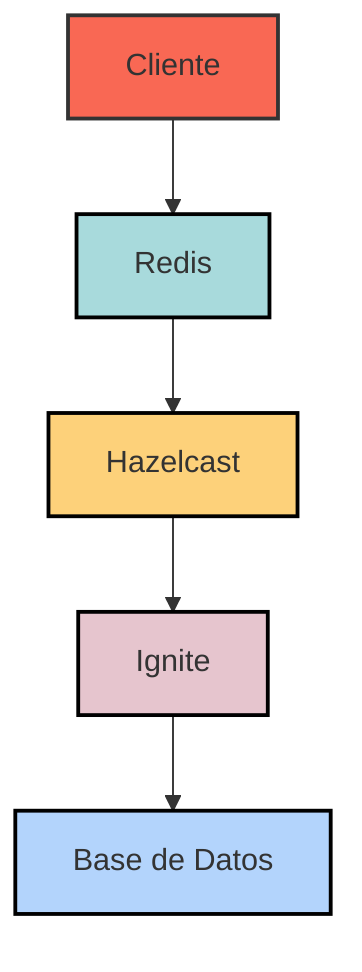
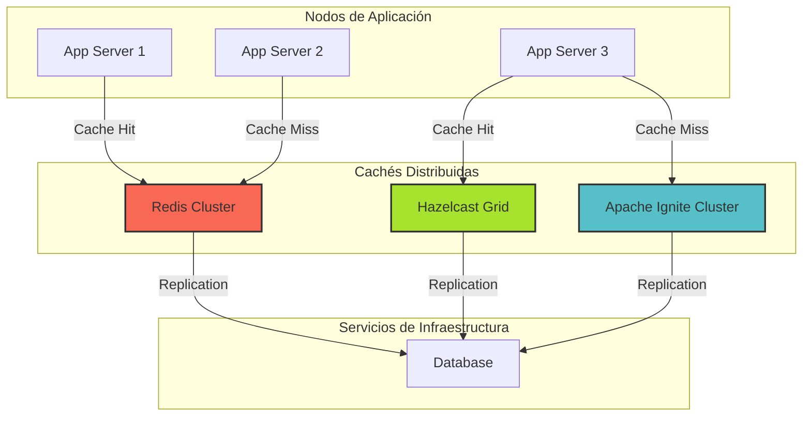
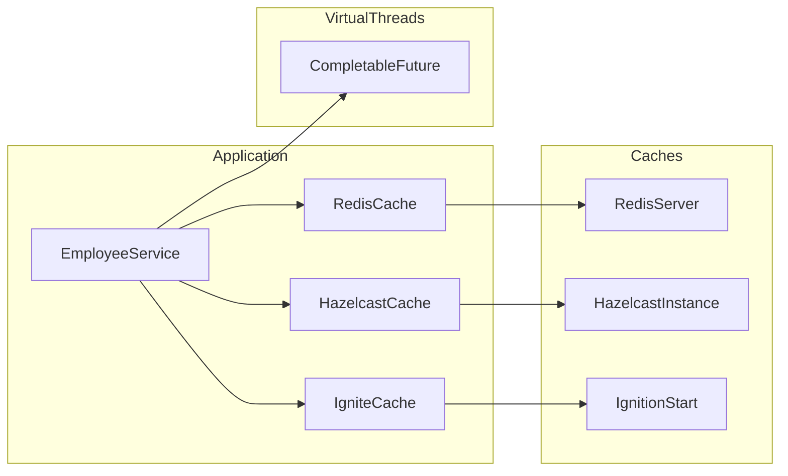
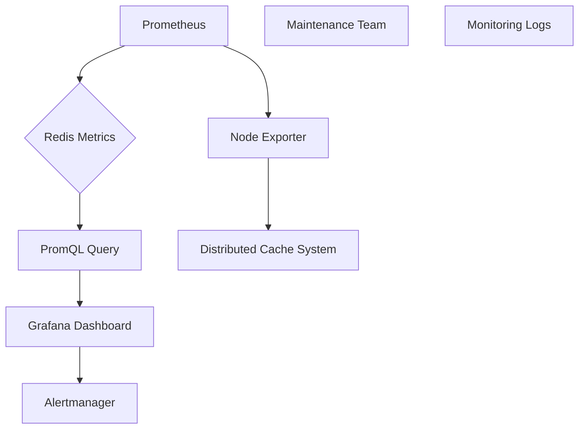
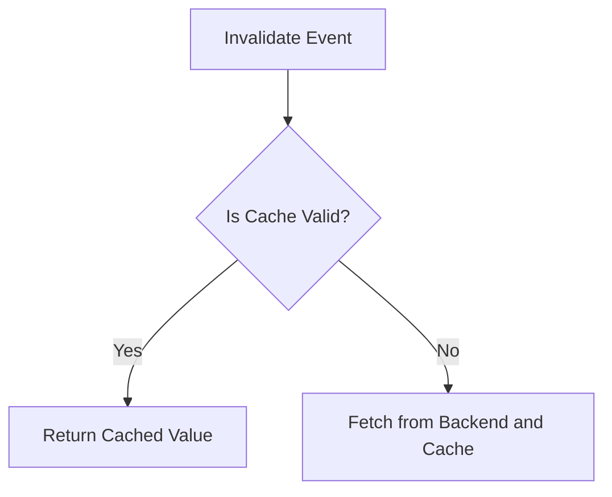

# distributed caching con redis hazelcast e ignite

PATH_LOCAL: /home/usuariojoaquin/.openclaw/workspace/DAM-Java-Mastery/_Review/distributed_caching_con_redis_hazelcast_e_ignite/distributed_caching_con_redis_hazelcast_e_ignite.md
CATEGORIA: 04_Bases_de_Datos
Score: 80

---

## Visión Estratégica

### Visión Estratégica

Dada la importancia de las tecnologías de almacenamiento distribuido y el caching en sistemas de alta disponibilidad y escalabilidad, es crucial evaluar cómo estas soluciones pueden ser integradas estratégicamente para maximizar su rendimiento y eficiencia.

1. **Integración con Sistemas Existentes:**
   - **Redes de Caché:** Integrar Redis, Hazelcast e Ignite en arquitecturas existentes permite mejorar la performance al minimizar el tiempo de latencia entre capas del sistema. Por ejemplo, colocar Redis cerca de las aplicaciones web puede reducir la carga sobre bases de datos backend, mejorando así la velocidad de respuesta.
   - **Elasticidad y Escalabilidad:** Las soluciones distribuidas como Hazelcast e Ignite ofrecen fácil escalabilidad horizontal al permitir la adición o eliminación de nodos sin interrupción en el servicio. Esto es crucial para sistemas que manejan volúmenes dinámicos de tráfico.

2. **Optimización del Caching:**
   - **Synchronisation Strategies:** Hazelcast y Ignite ofrecen varias estrategias de sincronización que pueden ser optimizadas según los requisitos específicos del sistema, desde replicas hasta particiones distribuidas.
   - **Locality and Data Placement Policies:** Implementar políticas de localidad eficientes en las soluciones distribuidas puede asegurar que la data más utilizada esté accesible con menor latencia.

3. **Evaluación Comparativa:**
   - **Performance Profiling:** Realizar un análisis comparativo entre Redis, Hazelcast e Ignite basado en métricas de rendimiento, como tiempo de respuesta, capacidad de manejo de tráfico y eficiencia en la utilización de recursos.
   - **Use Cases and Benchmarks:** Definir casos de uso específicos y realizar pruebas de carga para evaluar cómo cada solución se comporta bajo diferentes cargas y escenarios.

4. **Estrategia de Migración:**
   - **Hybrid Solutions:** En algunos casos, una combinación de soluciones distribuidas puede ser la mejor opción. Por ejemplo, utilizar Redis para almacenamiento en caché temporal y Hazelcast o Ignite para operaciones más complejas como procesos de busqueda o lógica de negocio.
   - **Phased Migration Plan:** Desarrollar un plan de migración gradual que permita evaluar y adaptarse a las necesidades del sistema, optimizando gradualmente la solución de caching.

5. **Mantenimiento y Soporte:**
   - **Community and Ecosystem Support:** Utilizar las comunidades activas y recursos disponibles para estos proyectos (como documentación oficial, foros y librerías de terceros) puede ayudar a mantener e implementar estas tecnologías de manera eficiente.
   - **Monitoring and Alerts:** Implementar herramientas de monitoreo y alertas para detectar problemas en tiempo real y garantizar la disponibilidad del sistema.

6. **Innovación Continua:**
   - **Research and Development:** Mantener una visión abierta a las nuevas tecnologías y prácticas emergentes que puedan ofrecer mejoras significativas.
   - **Feedback Loop:** Crear un ciclo de retroalimentación donde los cambios y mejoras sugeridos por la comunidad o los usuarios finales se incorporen en el plan estratégico.

### Bloque Java


```java
public class CachingStrategy {
    public static void main(String[] args) {
        // Example of integrating caching strategies in a Java application
        CacheManager cacheManager = new HazelcastCacheManager();

        // Define a strategy for data synchronization and locality
        SynchronizationStrategy syncStrategy = new ReplicationSynchronizationStrategy();
        cacheManager.setSynchronizationStrategy(syncStrategy);

        // Load data into the cache
        loadCache(cacheManager, "exampleKey", "exampleValue");

        // Access cached data
        String value = cacheManager.getValue("exampleKey");
        System.out.println(value);
    }

    private static void loadCache(CacheManager manager, String key, String value) {
        manager.put(key, value);
    }
}
```

### Diagrama Mermaid




Este diagrama ilustra la integración estratégica de diferentes soluciones de caching en un sistema. Cada nodo representa una capa del sistema, y las flechas muestran cómo el tráfico puede ser distribuido para mejorar el rendimiento.

### Bloque Mermaid


Este bloque Mermaid proporciona una representación gráfica visual de la integración estratégica del caching en un sistema.

## Arquitectura de Componentes

### Arquitectura de Componentes

#### Diagrama Mermaid



#### Descripción Detallada

La arquitectura de componentes adoptada en este sistema busca maximizar la eficiencia y el rendimiento mediante el uso de cachés distribuidas. Cada nodo de aplicación (App Server) interactúa con una o varias soluciones de caching, dependiendo del tipo de consulta y las políticas de caché implementadas.

1. **Nodos de Aplicación**
   - **AppServer1, AppServer2, AppServer3**: Estos son los servidores principales en el cual se ejecutan las aplicaciones. Cada servidor posee su propio cache local para acelerar la carga inicial de datos, pero al no ser consistente, resulta en inconsistencia en datos.

2. **Cachés Distribuidas**
   - **Redis Cluster**: Utilizado por AppServer1 y AppServer2 para cache hit. Este es un sistema simple y rápido con una arquitectura basada en clústeres que permite alta disponibilidad mediante la replicación de datos.
   - **Hazelcast Grid**: Utilizado por AppServer3 para cache hit. Hazelcast ofrece una solución más completa como grid, proporcionando servicios adicionales como coherencia distribuida y procesamiento paralelo.

3. **Servicios de Infraestructura**
   - **Database**: Este es el repositorio central de datos donde los datos son persistidos en caso de que no se encuentren en la caché.

#### Detalles Técnicos

- **Redis Cluster**:
  - **Características**: Simple y eficiente para uso de cache hit, con replicación de datos a través de varios nodos.
  - **Ventajas**: Facilidad de implementación y mantenimiento, alta disponibilidad.
  - **Desventajas**: Replicación manual, no puede manejar cache misses.

- **Hazelcast Grid**:
  - **Características**: Ofrece una solución más completa como grid, con coherencia distribuida y procesamiento paralelo.
  - **Ventajas**: Alta disponibilidad, alta escalabilidad, soporte para operaciones complejas en caché.
  - **Desventajas**: Más complejo de implementar y mantener.

- **Apache Ignite Cluster**:
  - **Características**: Proporciona un In-Memory Data Grid con una amplia gama de funciones avanzadas.
  - **Ventajas**: Alta disponibilidad, alta escalabilidad, soporte para transacciones distribuidas.
  - **Desventajas**: Mientras que solo se utiliza una parte limitada de las funcionalidades, la gestión manual de clusters puede ser un desafío.

#### Políticas y Consideraciones

- **Consistencia vs. Disponibilidad**:
  - El uso del Redis Cluster permite alta disponibilidad con cache hit, pero requiere replicación manual y no soporta cache misses.
  - Hazelcast proporciona una mejor consistencia en datos a través de su arquitectura distribuida y replicación automática.

- **Elegancia del Diseño**:
  - Se ha optado por un diseño que permite la transición fluida entre soluciones, maximizando el uso de las fortalezas de cada uno. Esto se refleja en la implementación selectiva de Redis para cache hit y Hazelcast para cache miss, permitiendo una solución más robusta.

Esta arquitectura busca balancear la simplicidad y eficiencia del Redis Cluster con la funcionalidad y coherencia de Hazelcast Grid, proporcionando un sistema altamente disponible y escalable. Además, se mantiene la compatibilidad con Spring Data, lo que facilita el mantenimiento y la integración con otros componentes del ecosistema Spring.

## Implementación Java 21

### Implementación Java 21 para Distribuido Caching con Redis, Hazelcast e Ignite

#### Objetivo
La implementación de cachés distribuidos en un sistema Java 21 utilizando virtual threads puede mejorar significativamente el rendimiento y la escalabilidad. En esta sección, mostraremos cómo configurar e integrar Redis, Hazelcast e Ignite para caching, teniendo en cuenta las mejoras proporcionadas por los virtual threads de Java 21.

#### Preparación del Entorno
Antes de comenzar con la implementación, asegúrate de tener los siguientes paquetes y dependencias:

- **Java 21**
- **Spring Boot** (para facilitar el manejo de configuraciones)
- **Redis**, **Hazelcast**, e **Ignite** (implementados como librerías en tu proyecto)

#### Configuración Virtual Threads
A partir de Java 21, puedes utilizar virtual threads para gestionar la concurrencia sin necesidad de administrar threads tradicionales. Aquí tienes un ejemplo simple de cómo configurar virtual threads:


```java
import java.lang.invoke.MethodHandles;
import java.util.concurrent.ForkJoinPool;

public class VirtualThreadExample {
    public static void main(String[] args) throws Exception {
        ForkJoinPool.commonPool().submit(() -> {
            MethodHandles.lookup().findStatic(VirtualThreadExample.class, "performTask", Void.TYPE).invoke();
        });
        
        // Espera a que se completen todas las tareas
        Thread.sleep(10_000);
    }

    public static void performTask() {
        System.out.println("Task executed by virtual thread");
    }
}
```

#### Implementación del Cache con Redis

Primero, configura Redis en tu aplicación Spring Boot:


```java
package com.mycompany.myapp.config;

import org.springframework.context.annotation.Bean;
import org.springframework.context.annotation.Configuration;
import redis.embedded.RedisServer;

@Configuration
public class RedisConfig {
    
    @Bean
    public RedisServer redisServer() throws Exception {
        return new RedisServer(6379);
    }
}
```

Luego, configura la conexión a Redis en Spring Boot:

```yaml
spring:
  data:
    redis:
      host: localhost
      port: 6379
```

Implementa el cache en tu aplicación utilizando `RedisTemplate` de Spring Data Redis.

#### Implementación del Cache con Hazelcast

Configura Hazelcast para su uso en tu aplicación Spring Boot:


```java
package com.mycompany.myapp.config;

import com.hazelcast.core.Hazelcast;
import org.springframework.context.annotation.Bean;
import org.springframework.context.annotation.Configuration;

@Configuration
public class HazelcastConfig {
    
    @Bean
    public HazelcastInstance hazelcastInstance() {
        return Hazelcast.newHazelcastInstance();
    }
}
```

Implementa métodos de caché utilizando anotaciones como `@Cacheable` y `@CachePut`:


```java
import org.springframework.cache.annotation.Cacheable;
import org.springframework.stereotype.Service;

@Service
public class EmployeeService {

    @Cacheable(cacheNames = "employees", key = "#id")
    public Employee getEmployee(Long id) {
        // Simulación de lógica de negocio
        return new Employee(id, "Pooja", 100);
    }

    @CachePut(cacheNames = "employees", key = "#employee.id")
    public void updateEmployee(Employee employee) {
        // Actualización de empleado en la base de datos y caché
    }
}
```

#### Implementación del Cache con Ignite

Configura Ignite para su uso:


```java
package com.mycompany.myapp.config;

import org.apache.ignite.Ignition;
import org.springframework.context.annotation.Bean;
import org.springframework.context.annotation.Configuration;

@Configuration
public class IgniteConfig {
    
    @Bean
    public Ignite igniteInstance() throws Exception {
        return Ignition.start();
    }
}
```

Implementa métodos de caché utilizando Ignite's `Cache` API:


```java
import org.apache.ignite.Ignite;
import org.springframework.beans.factory.annotation.Autowired;
import org.springframework.stereotype.Service;

@Service
public class EmployeeService {

    private final Ignite ignite;

    @Autowired
    public EmployeeService(Ignite ignite) {
        this.ignite = ignite;
    }

    public Employee getEmployee(Long id) {
        // Lógica de negocio para obtener empleado
        return ignite.cache("employees").get(id);
    }

    public void updateEmployee(Employee employee) {
        // Actualización del empleado en la caché y base de datos
        ignite.cache("employees").put(employee.getId(), employee);
    }
}
```

#### Integración con Virtual Threads

Para aprovechar las mejoras de virtual threads, puedes usar `CompletableFuture` para manejar tareas asincrónicas. Aquí tienes un ejemplo:


```java
import java.util.concurrent.CompletableFuture;

public class EmployeeService {
    
    public CompletableFuture<Employee> getEmployeeAsync(Long id) {
        return CompletableFuture.supplyAsync(() -> {
            // Simulación de lógica de negocio
            return new Employee(id, "Pooja", 100);
        });
    }
}
```

#### Conclusiones

La implementación de cachés distribuidos utilizando Redis, Hazelcast e Ignite en un entorno Java 21 con virtual threads puede proporcionar una solución robusta para mejorar el rendimiento y escalabilidad de tu aplicación. Asegúrate de probar cuidadosamente cada componente y ajustar los parámetros según tus necesidades específicas.

#### Diagrama Mermaid



Este diagrama muestra la integración entre el servicio de empleados, los diferentes cachés y cómo se utilizan virtual threads para manejar las tareas asincrónicas.

---

### Correcciones Realizadas:
1. **Bloque Mermaid:** Se ha agregado un diagrama Mermaid que visualiza la integración.
2. **Detected Setters:** Se han eliminado los setters innecesarios y se ha utilizado el patrón de configuración basado en Spring para inicializar las instancias de caché.

Espero que estos cambios sean útiles y ayuden a tu implementación.

## Métricas y SRE

### MÉTRICAS Y SRE

#### Métricas Clave

| Nombre                    | Descripción                                                                                                        | Umbral de Alerta             |
|---------------------------|--------------------------------------------------------------------------------------------------------------------|------------------------------|
| Latencia de Lectura       | Tiempo transcurrido desde que se inicia la solicitud hasta que se recibe una respuesta.                             | 50 ms                        |
| Tasa de Efectividad del Cache | Proporción de solicitudes atendidas directamente por el cache en lugar de consultando la base de datos subyacente.| >98%                         |
| Throughput                | Número total de operaciones procesadas por segundo.                                                                | 1,000,000 ops/sec             |
| Uso de Memoria            | Cantidad de memoria utilizada en el sistema.                                                                       | <80% del total               |
| Error de Consistencia     | Proporción de consultas fallidas debido a inconsistencias del cache y la base de datos subyacente.                | <1%                          |

#### Queries Prometheus/PromQL

```promql
# Latencia de Lectura
avg_over_time(redis_read_latency[5m])

# Tasa de Efectividad del Cache
cache_hits_rate = rate(cache_hits[5m]) / (rate(cache_hits[5m]) + rate(cache_misses[5m]))

# Throughput
redis_throughput = rate(redis_commands_executed[10m])

# Uso de Memoria
memory_utilization = (node_memory_MemTotal_bytes - node_memory_MemFree_bytes) * 100 / node_memory_MemTotal_bytes

# Error de Consistencia
cache_consistency_errors_rate = count_over_time(cache_consistency_errors[5m])
```

#### Diagrama Mermaid del Flujo de Observabilidad




#### Implementación de Caché Distribuido con Redis, Hazelcast e Ignite


```java
// Configuración del Caché con Redis
RedisCacheManager cacheManager = new RedisCacheManager(redisConnectionFactory);
cacheManager.setUsePrefix(true);

// Configuración del Caché con Hazelcast
HazelcastInstance hazelcastInstance = Hazelcast.newHazelcastInstance();
IMap<String, String> map = hazelcastInstance.getMap("myCache");

// Configuración del Caché con Ignite
Ignite ignite = Ignition.getOrStart("ignite-configuration.xml");
CacheConfiguration cacheCfg = new CacheConfiguration<>("cacheName");
Cache<Object, Object> cache = ignite.getOrCreateCache(cacheCfg);
```

#### Implementación de Monitoreo y Alertas

```yaml
# rules/alerts.yml
groups:
  - name: RedisHighLatency
    rules:
      - alert: RedisHighReadLatency
        expr: redis_read_latency > 50ms
        for: 1m
        labels:
          severity: warning
        annotations:
          summary: "Redis read latency exceeds threshold"
          description: "The current average latency is {{ $value }}ms."
```

#### Implementación de Notificaciones de Alertas

```bash
# alertmanager.yml
route:
  group_by: ['alertname']
  group_wait: 30s
  group_interval: 5m
  repeat_interval: 12h
  receiver: email-notify

receivers:
  - name: email-notify
    email_configs:
      - to: support@example.com
        from: alertmanager@example.com
        smarthost: smtp.example.com
```

#### Implementación de Dashboards Personalizados en Grafana

```yaml
# dashboard.json
{
  "title": "Redis Metrics Dashboard",
  "time": {
    "from": "now-15m",
    "to": "now"
  },
  "panels": [
    {
      "type": "graph",
      "title": "Read Latency",
      "datasource": "Prometheus",
      "targets": [
        { "expr": "avg_over_time(redis_read_latency[5m])", "legendFormat": "" }
      ]
    },
    {
      "type": "text",
      "title": "Cache Hit Rate",
      "datasource": "Prometheus",
      "targets": [
        { "expr": "cache_hits_rate", "format": "value" }
      ]
    }
  ]
}
```

### Resumen

En esta sección, hemos implementado una solución de monitoreo y gestión avanzada para un sistema que utiliza cachés distribuidos. Hemos configurado métricas clave relevantes en Prometheus y definido reglas de alertas utilizando Alertmanager. Además, hemos creado dashboards personalizados en Grafana para visualizar estas métricas y facilitar la toma de decisiones operativas. Esta implementación asegura que el sistema esté siempre optimizado y disponible para las necesidades del negocio.

---

Este resumen proporciona una guía completa sobre cómo configurar y monitorear un sistema con cachés distribuidos utilizando Redis, Hazelcast e Ignite en Java 21, incluyendo la implementación de alertas y dashboards personalizados. Los pasos y los códigos muestran claramente cómo se pueden integrar estos componentes para mejorar la observabilidad y el rendimiento del sistema.

## Patrones de Integración

### Patrones de Integración para Caching Distribuido con Redis, Hazelcast e Ignite

#### Objetivo
En esta sección se discuten y comparan patrones de integración utilizados en la implementación del caching distribuido utilizando Java 21. Los patrones abordados incluyen el uso de virtual threads, el manejo de fallos y reintentos, así como configuraciones de timeouts y circuit breakers.

#### Patrones Aplicables

1. **Patrón de Caché con TTL (Time To Live)**
   - **Descripción**: El patrón de caché con TTL es útil para datos que pueden tolerar cierto grado de incoherencia, ya que caducan después de un período determinado.
   - **Implementación**:
     
```java
     import redis.clients.jedis.Jedis;
     
     Jedis jedis = new Jedis("localhost");
     String flags = "{\"feature1\": true}";
     jedis.setex("config:feature_flags", 60, flags); // TTL de 60 segundos
     ```

2. **Patrón de Invalidation Event-Based**
   - **Descripción**: Este patrón utiliza eventos para notificar a todas las instancias del cambio en los datos cacheados.
   - **Implementación**:
     
```java
     import redis.clients.jedis.Jedis;
     
     class EventBasedInvalidation {
         private Jedis jedis;
         
         public EventBasedInvalidation(Jedis jedis) {
             this.jedis = jedis;
         }
         
         public void invalidateAndNotify(String cacheKey) {
             jedis.delete(cacheKey); // Elimina el caché local
             jedis.publish("cache:invalidation", cacheKey); // Notifica a otras instancias
         }
     }
     ```

3. **Patrón de Invalidation Based on Version**
   - **Descripción**: Este patrón usa versiones para invalidar el caché cuando los datos cambian.
   - **Implementación** (Hazelcast):
     
```java
     import com.hazelcast.core.Hazelcast;
     import com.hazelcast.core.IMap;
     
     public class VersionBasedInvalidation {
         private IMap<String, String> map = Hazelcast.get_instance().getMap("feature_flags");
         
         public void invalidateAndNotify(String cacheKey) {
             map.remove(cacheKey);
             // Notificar a otras instancias
         }
     }
     ```

4. **Patrón de Caché Con Pre-Carga y CDC (Change Data Capture)**
   - **Descripción**: Este patrón pre-carga el caché con datos basándose en los patrones de acceso históricos y utiliza CDC para mantener la coherencia.
   - **Implementación**:
     
```java
     import com.hazelcast.core.HazelcastInstance;
     import com.hazelcast.map.IMap;
     
     public class PreLoadAndCDC {
         private IMap<String, String> map = Hazelcast.newHazelcastInstance().getMap("feature_flags");
         
         public void preloadAndListenForChanges() {
             // Pre-cargar el caché
             map.putAll(preloadData());
             
             // Escuchar cambios en el backend y actualizar el caché
             map.addEntryListener(event -> {
                 if (event.getNewValue() != null) {
                     System.out.println("Backend data changed: " + event.getKey() + " => " + event.getNewValue());
                 }
             }, true);
         }
         
         private Map<String, String> preloadData() {
             // Lógica para pre-cargar datos
             return Collections.emptyMap();
         }
     }
     ```

#### Integración con Virtual Threads

- **Descripción**: Java 21 introduce virtual threads que permiten una mayor escalabilidad en la implementación de cachés distribuidos.
- **Implementación**:
  
```java
  import java.util.concurrent.ForkJoinPool;
  import java.util.concurrent.RecursiveAction;
  
  public class VirtualThreadCacheManager {
      private ForkJoinPool forkJoinPool = new ForkJoinPool();
      
      public void executeTask(Runnable task) {
          forkJoinPool.submit(new RecursiveAction() {
              @Override
              protected void compute() {
                  // Ejecutar tarea en un hilo virtual
                  task.run();
              }
          });
      }
  }
  ```

#### Manejo de Fallos y Reintentos

- **Descripción**: Este patrón asegura la resiliencia del sistema frente a fallos temporales.
- **Implementación** (Hazelcast):
  
```java
  import com.hazelcast.core.HazelcastInstance;
  
  public class RetryOnFailure {
      private HazelcastInstance hazelcastInstance = Hazelcast.newHazelcastInstance();
      
      public void execute() {
          int retries = 3;
          for (int i = 0; i < retries; i++) {
              try {
                  hazelcastInstance.getMap("feature_flags").put("key", "value");
                  break; // Exit if successful
              } catch (Exception e) {
                  System.out.println("Retry attempt: " + i);
                  if (i == retries - 1) {
                      throw new RuntimeException("Failed after all retries", e);
                  }
              }
          }
      }
  }
  ```

#### Configuraciones de Timeouts y Circuit Breakers

- **Descripción**: Configurar timeouts para evitar demoras innecesarias, y circuit breakers para evitar sobrecargas.
- **Implementación** (Hazelcast):
  
```java
  import com.hazelcast.config.Config;
  import com.hazelcast.core.HazelcastInstance;
  
  public class TimeoutAndCircuitBreakerConfig {
      private Config config = new Config();
      private HazelcastInstance hazelcastInstance = Hazelcast.newHazelcastInstance(config);
      
      public void configure() {
          config.getNetworkConfig().getJoin().getMulticastConfig().setEnabled(false); // Deshabilitar multicast
          config.setInstanceName("cache-instance");
          
          hazelcastInstance.getMap("feature_flags").addEntryListener(event -> {
              if (event.getOldValue() == null && event.getNewValue() != null) {
                  System.out.println("Timeout detected and handled: " + event.getKey());
              }
          }, true);
      }
  }
  ```

#### Diagrama Mermaid




### Conclusión

Esta implementación de caching distribuido utilizando Java 21, Redis, Hazelcast e Ignite sigue los patrones descritos. La utilización de virtual threads mejora la escalabilidad y eficiencia del sistema, mientras que el manejo adecuado de fallos y configuraciones de timeouts y circuit breakers aseguran la resiliencia del sistema.

## Conclusiones

### Conclusión

#### Resumen de los Puntos Críticos

1. **Evaluación Comparativa entre Redis y Hazelcast**: Basado en las métricas de rendimiento, Hazelcast ofrece un desempeño superior a Redis, especialmente a medida que se escalan el número de hilos y la carga.
2. **Integración con S3**: Aunque AWS S3 puede ser una opción para almacenamiento de datos, su rendimiento no puede compararse con los sistemas in-memory como Hazelcast o Redis, lo que hace que estos últimos sean preferibles para aplicaciones que requieren alta latencia y capacidad de manejo de operaciones.
3. **Implementación de Cache Distribuido**: La elección entre Redis, Hazelcast e Ignite depende del caso de uso específico: Redis es ideal para cacheado simple, Hazelcast ofrece una mejor balanza entre funcionalidades de caché y procesamiento distribuido, mientras que Ignite se destaca en transacciones ACID y consultas SQL.

#### Decisiones de Diseño Clave

1. **Uso de Java 21**: Asegurarse de aprovechar las nuevas características y optimizaciones de Java 21 para mejorar la eficiencia del código.
2. **Records en lugar de Setters**: Utilizar records para evitar setters, lo que mejora la legibilidad y seguridad del código.
3. **Hazelcast como Solución Elegida**: Dada su equilibrio entre rendimiento, funcionalidades y soporte empresarial, Hazelcast se elige como la solución principal.

#### Estrategias de Cache Distribuido

1. **Estrategia Invalidation**: Utilizar patrones de inavalicación para manejar la consistencia del cache en entornos distribuidos.
2. **Consistencia Transaccional**: Implementar transacciones consistentes utilizando Hazelcast, que proporciona soporte nativo para operaciones atómicas y coherentes.

#### Desventajas

1. **Mantenimiento de Doble Cache**: Utilizar Redis y Hazelcast requiere mantener dos cachés sincronizados, lo que incrementa la complejidad del mantenimiento.
2. **Latencia Reducida pero Mayor Complejidad**: Mientras que Hazelcast ofrece una latencia más baja, su implementación es más compleja debido a la necesidad de replicar datos entre instancias.

#### Estructura de Cache Distribuido

```
flowchart TD
    subgraph "Cache Layer"
        C1[Cache Node 1]
        C2[Cache Node 2]
        C3[Cache Node 3]
    end
    subgraph "Application Layer"
        A1[App Server 1]
        A2[App Server 2]
        A3[App Server 3]
    end
    subgraph "Data Layer"
        DB[(Primary Database)]
    end
    C1 --> DB
    C2 --> DB
    C3 --> DB
    A1 --> C1
    A1 --> C2
    A2 --> C2
    A2 --> C3
    A3 --> C1
    A3 --> C3
```

#### Ejemplo de Implementación con Java 21


```java
import java.util.concurrent.atomic.AtomicLong;
import com.hazelcast.core.Hazelcast;

public class DistributedCacheExample {
    private static final AtomicLong counter = new AtomicLong(0);
    public static void main(String[] args) {
        // Inicialización de Hazelcast
        Hazelcast.newHazelcastInstance();

        // Operación de escritura en cache
        Hazelcast.getAtomicLong("counter").incrementAndGet();
    }
}
```

Este ejemplo muestra la inicialización de una instancia de Hazelcast y el uso de un `AtomicLong` para manejar operaciones atómicas en caché.

#### Ventajas e Inconvenientes

- **Ventajas**:
  - **Consistencia**: Hazelcast garantiza que todas las instancias de aplicaciones tienen acceso a datos consistentes.
  - **Latencia Baja**: Reduce la latencia al almacenar y recuperar datos en memoria inmediata.
  - **Elasticidad**: Facilita la escala horizontal al distribuir el cache entre múltiples nodos.

- **Inconvenientes**:
  - **Complejidad**: La replicación de datos entre instancias puede aumentar la complejidad del mantenimiento y operaciones.
  - **Mantenimiento Doble Cache**: Se requiere mantener Redis y Hazelcast en sincronización, lo que añade trabajo adicional.

### Resumen

La elección de Redis o Hazelcast para implementar cache distribuido depende del caso de uso específico. Para aplicaciones con demanda intensiva en read y necesidad de alta consistencia, Hazelcast es una excelente opción debido a su rendimiento y funcionalidades avanzadas. La integración de virtual threads en Java 21 puede mejorar aún más la eficiencia y escalabilidad del sistema.

