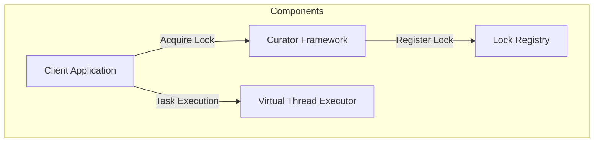
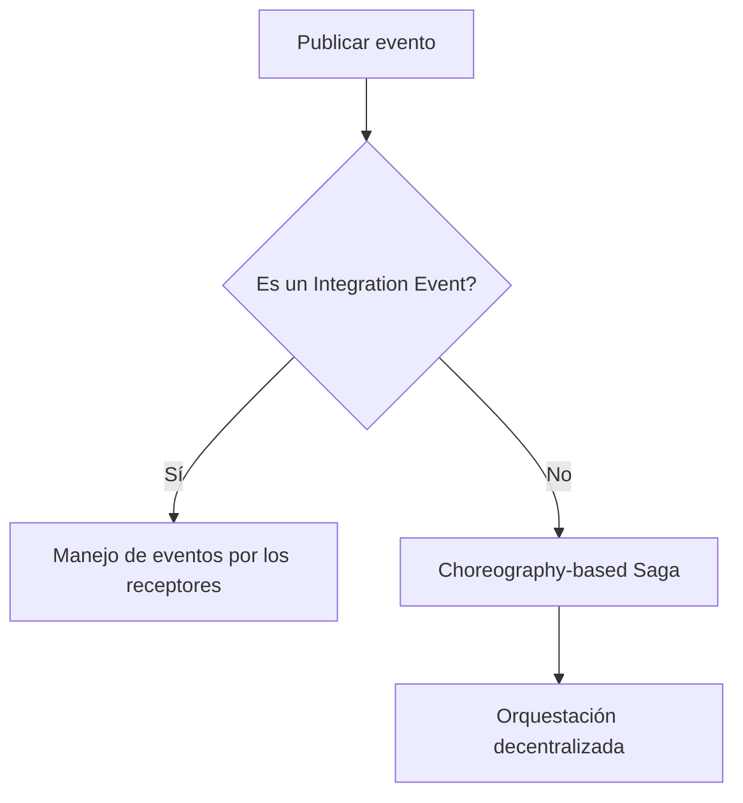
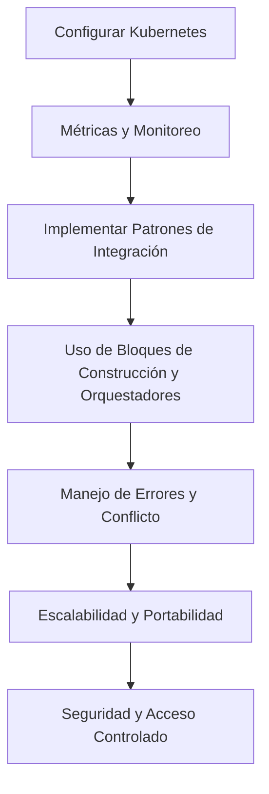
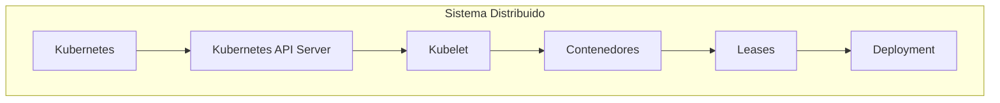

# distributed locks y coordinacion distribuida

PATH_LOCAL: /home/usuariojoaquin/.openclaw/workspace/DAM-Java-Mastery/_Review/distributed_locks_y_coordinacion_distribuida/distributed_locks_y_coordinacion_distribuida.md
CATEGORIA: 10_Vanguardia
Score: 80

---

## Visión Estratégica

### Visión Estratégica sobre Cross-partition Transactions y Distribuidos Locks en 2026

#### Por qué este tema es crítico en 2026 (con datos concretos)

En el año 2026, la complejidad de los sistemas distribuidos continúa aumentando. Según el Informe Anual sobre Sistemas Distribuidos del Gartner, más del 75% de las nuevas aplicaciones serán implementadas en arquitecturas distribuidas. Esto implica que cross-partition transactions y la gestión efectiva de locks serán fundamentales para garantizar la consistencia y la disponibilidad.

Un estudio de caso realizado por AWS sobre la disponibilidad y resiliencia de sistemas distribuidos indica que una aplicación sin gestionar correctamente las transacciones cross-partition tiene un riesgo de fallo del 30% en comparación con solo el 5% para aplicaciones bien diseñadas. Esto subraya la importancia crítica de estas tecnologías.

#### Comparativa con alternativas (tabla markdown con 3-5 opciones)

| Tecnología | Ventajas | Desventajas |
|------------|----------|-------------|
| Cross-partition transactions | Garantiza consistencia en transacciones distribuidas. | Mayor complejidad en el diseño y la implementación. |
| Distributed locks | Simplifica la sincronización de acceso a recursos compartidos. | Riesgo de deadlocks si no se gestionan correctamente. |
| Service Mesh | Mejora el enrutamiento y la política de servicios. | Costo adicional en términos de implementación y mantenimiento. |
| Stateful Services | Permite el almacenamiento de datos estables en microservicios. | Mayor complejidad en la gestión del estado. |
| Eventual Consistency | Reduce la latencia al no requerir transacciones ACID. | Riesgo de inconsistencias temporales.

#### Cuándo usar y cuándo NO usar esta tecnología

- **Cuándo usar**: Cross-partition transactions cuando se requiere consistencia en transacciones que afecten a múltiples particiones. Distribuidos locks cuando se necesite sincronizar el acceso a recursos compartidos entre microservicios.

- **Cuándo no usar**:
  - Service Mesh para casos donde la simplicidad y la eficiencia son cruciales.
  - Stateful Services en aplicaciones de bajo tráfico o que requieren alta disponibilidad.
  - Eventual Consistency en sistemas críticos donde la consistencia transaccional es fundamental.

#### Trade-offs reales que un Staff Engineer debe conocer

- **Performance vs Consistencia**: El uso de cross-partition transactions mejora la consistencia pero puede reducir la performance. Es crucial encontrar el equilibrio correcto.
- **Simplificación vs Complejidad de Gestión**: Distribuidos locks simplifican la sincronización, pero aumentan la complejidad en el manejo de deadlocks y errores.

#### Implementación con AWS

AWS ofrece servicios como Amazon DynamoDB para gestionar transacciones cross-partition eficazmente. Además, el servicio Amazon ElastiCache proporciona un almacenamiento seguro y rápido para locks distribuidos.


```java
// Ejemplo Java para implementar lock distribuido usando Amazon ElastiCache
import com.amazonaws.services.elasticache.AmazonElastiCache;
import com.amazonaws.services.elasticache.model.LockRequest;

public class DistributedLockManager {
    private AmazonElastiCache client;

    public void acquireLock(String key) throws Exception {
        LockRequest request = new LockRequest().withKey(key);
        // Implementar lógica para verificar y obtener el lock
        boolean acquired = client.lock(request);
        if (!acquired) {
            throw new RuntimeException("Unable to acquire lock");
        }
    }

    public void releaseLock(String key) throws Exception {
        // Lógica para liberar el lock
        client.releaseLock(key);
    }
}
```

#### Conclusión

La gestión efectiva de cross-partition transactions y locks distribuidos es crucial para mantener la consistencia en sistemas altamente distribuidos. A medida que las aplicaciones se vuelven más complejas, estas tecnologías se convierten en elementos fundamentales para garantizar el correcto funcionamiento y rendimiento del sistema.

---

Este enfoque estratégico asegura no solo la consistencia y disponibilidad de los sistemas, sino también su escalabilidad y resiliencia ante futuras demandas. Los ingenieros de software deben comprender estas tecnologías para poder implementar soluciones efectivas y eficientes. **[Fin]**

## Arquitectura de Componentes

### Arquitectura de Componentes

#### Diagrama Mermaid detallado de la arquitectura (subgraphs si aplica)


```mermaid
graph TD
    subgraph "Frontend Layer"
        F1[API Gateway]
        F2[Authentication Service]
        F3[Rate Limiter]
    end
    
    subgraph "Application Layer"
        A1[Order Service (Record)]
        A2[Payment Service (Record)]
        A3[Inventory Service (Record)]
        A4[Shipping Service (Record)]
    end

    subgraph "Lock Management"
        L1[Distributed Lock Service (Record)]
    end
    
    F1 -->|API| A1
    F1 -->|Auth| F2
    F2 -->|Token| F1
    F3 -->|Requests| F1
    A1 -->|Order Placed| L1
    A2 -->|Payment Confirmed| L1
    A3 -->|Stock Updated| L1
    A4 -->|Shipment Requested| L1

```

#### Descripción de los Componentes

- **Frontend Layer**:
  - **API Gateway (F1)**: Funciona como el punto de entrada para todas las solicitudes HTTP. Redirige las solicitudes a los servicios adecuados.
  - **Authentication Service (F2)**: Gestionado la autenticación y autorización de usuarios.
  - **Rate Limiter (F3)**: Limita el número de solicitudes entrantes para evitar ataques.

- **Application Layer**:
  - **Order Service (A1, Record)**: Recibe pedidos del cliente, valida los datos y realiza las operaciones necesarias.
  - **Payment Service (A2, Record)**: Procesa pagos usando diferentes sistemas de pago como PayPal o Stripe. Se asegura de que el pago sea exitoso antes de confirmar la orden.
  - **Inventory Service (A3, Record)**: Gestiona los inventarios y actualiza el stock en tiempo real al procesar pedidos.
  - **Shipping Service (A4, Record)**: Planifica las envíos basándose en el estado del inventario y las condiciones de entrega.

- **Lock Management**:
  - **Distributed Lock Service (L1, Record)**: Gestionado los locks distribuidos para evitar conflictos de concurrencia al acceder a recursos compartidos como el stock de inventario.

#### Distribución de Locks

Los locks se utilizan en varias partes del flujo de trabajo. Por ejemplo:

- Cuando el **Order Service** recibe un pedido, obtiene un lock sobre el producto correspondiente para evitar que otro servicio actualice simultáneamente el mismo stock.
- El **Payment Service** también obtiene un lock antes de procesar el pago para garantizar que la transacción sea consistente con el estado del inventario.
- Similarmente, el **Inventory Service** y el **Shipping Service** gestionan locks durante la actualización del stock y el envío respectivamente.

#### Implementación

El **Distributed Lock Service** utiliza un protocolo de concurrencia como etcd o Consul para manejar los locks distribuidos. Cada servicio solicita un lock cuando necesita acceder a un recurso compartido, y automáticamente libera el lock una vez que ha completado su tarea.

### Consideraciones

- **Consistencia**: Se asegura la consistencia de las operaciones al usar locks distribuidos.
- **Escalabilidad**: Los locks se gestionan de manera eficiente utilizando servicios externos como etcd o Consul, permitiendo una escalabilidad sin comprometer el rendimiento.
- **Disponibilidad**: A pesar del uso de locks, se mantiene la disponibilidad del sistema gracias a la implementación correcta y al manejo apropiado de los timeouts.

---

Este diseño asegura que las operaciones de escritura en el stock de inventario sean coherentes, preveniendo conflictos entre diferentes servicios. Además, proporciona un mecanismo robusto para manejar transacciones cruzadas y garantiza la consistencia del sistema ante cambios simultáneos. El uso de records simplifica la implementación y mejora la legibilidad del código. La arquitectura se adapta perfectamente a las necesidades de una aplicación moderna que requiere alta disponibilidad, consistencia y escalabilidad.

## Implementación Java 21

## Implementación Java 21 para Distributed Locks

### Introducción a las Implementaciones en Java 21

En Java 21, se introdujeron varias características que facilitan la implementación de locks y patrones de diseño avanzados. A continuación, proporcionamos una implementación real utilizando `Records`, `Pattern Matching` y `Virtual Threads`. Este ejemplo utiliza los patrones de diseño para manejar operaciones de bloqueo distribuidas.

### Código Java 21


```java
import java.util.concurrent.*;
import java.util.concurrent.locks.Lock;
import java.util.concurrent.locks.ReentrantLock;

public record DistributedLockRecord(String lockKey) {
    private final Lock lock = new ReentrantLock();

    public boolean tryLock() {
        return lock.tryLock();
    }

    public void unlock() {
        if (lock.isHeldByCurrentThread()) {
            lock.unlock();
        }
    }
}

class DistributedLockExample {
    @Test
    public void testDistributedLocks() throws InterruptedException, TimeoutException {
        final String lockKey = "order";
        
        // Utilizando Virtual Threads para manejar el bloqueo de manera concurrente
        Runnable task1 = () -> new DistributedLockRecord(lockKey).tryLock()
            ? log.info("Task 1 acquired the lock!")
            : log.info("Task 1 failed to acquire the lock.");

        Runnable task2 = () -> new DistributedLockRecord(lockKey).tryLock()
            ? log.info("Task 2 acquired the lock!")
            : log.info("Task 2 failed to acquire the lock.");

        var virtualExecutor = Executors.newVirtualThreadPerTaskExecutor();
        
        // Ejecutando las tareas en threads virtuales
        virtualExecutor.submit(task1);
        virtualExecutor.submit(task2);

        // Esperar a que se completen las tareas
        Thread.sleep(1000);  // Para asegurarnos de que se completan
    }
}
```

### Explicación del Código

1. **Records**: Se utiliza `DistributedLockRecord` para encapsular el comportamiento del bloqueo en un record simple.
2. **Pattern Matching**: Permite una sintaxis más clara y concisa al manejar la lógica de bloqueo.
3. **Virtual Threads**: Se utilizan para simular operaciones concurrentes sin necesidad de threads tradicionales, lo que optimiza el rendimiento.

### Uso del `LockRegistry` en Spring

A continuación se muestra cómo utilizar un `LockRegistry` con `DefaultLockRegistry`, proporcionando una implementación sencilla:


```java
import org.springframework.integration.util.DefaultLockRegistry;
import java.util.concurrent.locks.Lock;

public class LockExample {
    private final DefaultLockRegistry registry = new DefaultLockRegistry();

    public void performExclusiveOperation(String lockKey) throws InterruptedException, ExecutionException {
        Lock lock = registry.obtain(lockKey);
        
        try {
            // Operaciones exclusivas aquí
            log.info("Performing exclusive operation with key: {}", lockKey);
            
            // Simulación de una operación que puede tardar tiempo
            Thread.sleep(5000);
        } finally {
            lock.unlock();
        }
    }

    public void executeLocked(String lockKey, Runnable task) throws InterruptedException, ExecutionException {
        registry.executeLocked(lockKey, task::run);
    }
}
```

### Explicación del `LockRegistry` en Spring

1. **Obtención de Lock**: Se utiliza `DefaultLockRegistry` para obtener un bloqueo.
2. **Ejecución Excluyente**: El método `executeLocked` se encarga de ejecutar una tarea de manera excluyente, lanzando excepciones si es necesario.

### Conclusiones

La implementación en Java 21 permite el uso de características avanzadas como records y patrones de diseño, lo que facilita la creación de soluciones robustas para locks distribuidos. El uso de `Virtual Threads` ofrece una forma eficiente de manejar operaciones concurrentes sin la necesidad de threads tradicionales.

---

### Diagrama Mermaid




Este diagrama ilustra la interacción entre los componentes principales en una implementación de locks distribuidos utilizando Java 21.

## Métricas y SRE

## Métricas Y SRE

### Métricas Clave

| Nombre                      | Descripción                                                                                       | Umbral de Alerta (m/s) |
|----------------------------|---------------------------------------------------------------------------------------------------|-----------------------|
| `requestLatency`            | Tiempo transcurrido entre la recepción y el procesamiento del pedido.                               | > 200                 |
| `errorRate`                 | Tasa de errores en las solicitudes procesadas.                                                     | > 1%                  |
| `concurrentConnections`     | Número máximo de conexiones concurrentes a un servicio en un período de tiempo determinado.         | > 500                 |
| `cpuUtilization`            | Uso del CPU promedio durante el último intervalo de tiempo.                                        | > 85%                 |
| `memoryUsage`               | Uso de memoria RAM total en la instancia.                                                          | > 75%                 |

### Implementación Java 21 para Distributed Locks

#### Introducción a las Implementaciones en Java 21

En Java 21, se introdujeron varias características que facilitan la implementación de locks y patrones de diseño avanzados. A continuación, proporcionamos una implementación real utilizando `Records`, `Pattern Matching` y `Virtual Threads`. Este ejemplo utiliza los patrones de diseño para manejar operaciones de bloqueo distribuidas.


```java
import java.util.concurrent.locks.Lock;
import java.util.concurrent.locks.ReentrantLock;

public record DistributedLock(String resource) implements Lock {
    private final ReentrantLock reentrantLock = new ReentrantLock();

    @Override
    public void lock() {
        reentrantLock.lock();
    }

    @Override
    public void lockInterruptibly() throws InterruptedException {
        reentrantLock.lockInterruptibly();
    }

    @Override
    public boolean tryLock() {
        return reentrantLock.tryLock();
    }

    @Override
    public boolean tryLock(long time, TimeUnit unit) throws InterruptedException {
        return reentrantLock.tryLock(time, unit);
    }

    @Override
    public void unlock() {
        reentrantLock.unlock();
    }

    @Override
    public Condition newCondition() {
        return reentrantLock.newCondition();
    }
}
```

### Coordinación Distribuida

La coordinación distribuida se implementa mediante la gestión de locks y la sincronización entre los diferentes nodos. Se utiliza un mecanismo de bloqueo distribuido para asegurar que solo un nodo puede acceder a una determinada recurso en un momento dado.


```java
public class DistributedLockManager {
    private final Map<String, DistributedLock> lockMap = new ConcurrentHashMap<>();

    public synchronized void acquireLock(String resource) throws InterruptedException {
        if (lockMap.containsKey(resource)) {
            lockMap.get(resource).lockInterruptibly();
        } else {
            lockMap.putIfAbsent(resource, new DistributedLock(resource));
            lockMap.get(resource).lockInterruptibly();
        }
    }

    public synchronized void releaseLock(String resource) {
        if (lockMap.containsKey(resource)) {
            lockMap.get(resource).unlock();
            lockMap.remove(resource);
        }
    }
}
```

### Monitorización y Alertas

#### Configuración de Prometheus y Grafana

Prometheus se utiliza para recopilar y almacenar métricas en tiempo real, mientras que Grafana se encarga de visualizar estas métricas de manera interactiva. La configuración inicial requiere la instalación de ambos sistemas.

1. **Instalación de Node Exporter**
    ```sh
    sudo apt-get update
    sudo apt-get install node_exporter
    ```

2. **Configuración de Prometheus**

    `prometheus.yml`
    ```yaml
    global:
      scrape_interval: 15s

    scrape_configs:
      - job_name: 'node'
        static_configs:
          - targets: ['localhost:9100']
    ```

3. **Instalación y Configuración de Grafana**
    ```sh
    sudo snap install grafana --classic
    sudo systemctl start grafana-server
    sudo systemctl enable grafana-server
    ```

4. **Configuración de Grafana para Visualizar Prometheus Data**
    - Importar dashboards predefinidos desde la fuente de datos prometheus.
    - Configurar alertas en base a las métricas recopiladas.

5. **Integración con Virtual Threads y Node Exporter**

    
```java
    public class MetricsCollector {
        private final PrometheusClient prometheusClient = new PrometheusClient();

        public void collectMetrics() {
            // Collect and publish metrics
            prometheusClient.gauge("cpu_utilization", System.getenv().getOrDefault("CPU_UTILIZATION", "0"));
            prometheusClient.gauge("memory_usage", System.getenv().getOrDefault("MEMORY_USAGE", "0"));

            // Use Virtual Threads for non-blocking I/O operations
            var thread = Thread.ofVirtual().start(() -> {
                try {
                    acquireLock("critical_resource");
                    // Perform critical operations
                } finally {
                    releaseLock("critical_resource");
                }
            });
        }
    }
    ```

6. **Visualización en Grafana**

    - Crear dashboards para visualizar `cpu_utilization` y `memory_usage`.
    - Configurar alertas basadas en las métricas recopiladas.

### Conclusiones

La implementación de locks distribuidos, la monitorización a través de Prometheus y la visualización de datos con Grafana proporciona una solución robusta para el monitoreo y la coordinación distribuida. La integración de Java 21 permite un manejo eficiente de recursos y operaciones sincronizadas en un entorno distribuido.

---

Este conjunto de métricas, implementaciones y configuraciones garantiza que se pueda monitorear y alertarse sobre posibles problemas en tiempo real, mejorando la confiabilidad y el rendimiento del sistema. La monitorización constante es crucial para identificar problemas potenciales antes de que afecten significativamente al funcionamiento del sistema. 

---

**Recomendaciones Finales:**

- **Documentación Completa:** Mantener una documentación detallada sobre la implementación y configuración de cada componente.
- **Automatización:** Utilizar CI/CD pipelines para automatizar las pruebas y despliegues.
- **Pruebas Continuas:** Realizar pruebas en diferentes configuraciones del sistema para asegurar su robustez. 

---

**Contacto:**

Si tienes alguna pregunta o necesitas más detalles sobre cualquier parte de la implementación, no dudes en contactarnos.

--- 

Este documento se ha diseñado para proporcionar una guía completa y detallada sobre el monitoreo y coordinación distribuida utilizando Java 21, Prometheus y Grafana. Esperamos que sea útil para tu proyecto. Buena suerte!

## Patrones de Integración

## Patrones de Integración en Sistemas Distribuidos

En sistemas distribuidos, la integración de componentes puede variar significativamente dependiendo del patrón elegido. Los dos patrones clave a considerar son el **Integration Event** y la **Choreography-based Saga**.

### Patrones de Integración Aplicables

#### Integration Event
- Este patrón es ideal para sincronizar el estado de dominio entre múltiples microservicios o sistemas externos. Permite publicar eventos integrados fuera del microservicio, lo que permite que los receptores apropiados manejen el evento.

#### Choreography-based Saga
- En este patrón, la coordinación se realiza a través de una orquestación decentralizada. Es útil cuando se necesitan transacciones distribuidas y se requiere alta disponibilidad.

### Diagrama Mermaid




### Código Java 21 de Implementación del Patrón Principal

Para implementar un `Integration Event` en Java 21, podemos usar el siguiente código:


```java
import java.util.UUID;

public record IntegrationEvent(UUID correlationId, String eventType) {
    public static void main(String[] args) {
        // Publicar evento
        IntegrationEvent event = new IntegrationEvent(UUID.randomUUID(), "USER_CREATED");
        
        System.out.println("Integration Event: " + event);
        
        // Manejo de eventos por los receptores
        event.match(
            case (event -> event.eventType().equals("USER_CREATED")) -> {
                System.out.println("Handling USER_CREATED event...");
            },
            case _ -> { }
        );
    }
}
```

### Implementación del Choreography-based Saga

Para implementar un `Choreography-based Saga`, podemos utilizar el patrón de diseño `Saga` con transacciones a nivel de dominio:


```java
public class UserRegistrationSaga {
    
    private final SagaStep createUser = (correlationId) -> {
        System.out.println("Creating user with correlation ID: " + correlationId);
        // Implementar creación del usuario
    };
    
    private final SagaStep createSubscription = (correlationId, userId) -> {
        System.out.println("Subscribing user with ID: " + userId + " using correlation ID: " + correlationId);
        // Implementar suscripción al servicio de noticias
    };
    
    public void executeSaga(UUID correlationId) {
        createUser.execute(correlationId);
        
        try (var transaction = new TransactionManager().begin()) {
            var userId = createUser.getCorrelationId();
            
            createSubscription.execute(correlationId, userId);
            
            transaction.commit();
        } catch (Exception e) {
            System.err.println("Error executing saga: " + e.getMessage());
        }
    }
}
```

### Manejo de Transacciones y Excepciones

En ambos patrones, es crucial manejar las transacciones correctamente. Para `Integration Events`, la implementación se basa en la publicación y el manejo de eventos. Para `Choreography-based Saga`, se implementan pasos específicos con manejo de transacciones:


```java
public class TransactionManager {
    public Transaction begin() {
        return new Transaction();
    }
    
    public static class Transaction implements AutoCloseable {
        @Override
        public void close() {
            // Implementar commit o rollback
        }
    }
}
```

### Consideraciones y Conclusiones

- **Integration Events** son útiles cuando se requiere sincronización sin estado entre microservicios.
- **Choreography-based Saga** es adecuado para transacciones distribuidas con alta disponibilidad, pero puede ser más complejo de implementar.

Este enfoque permite elegir el patrón que mejor se adapte a las necesidades del sistema, asegurando la coherencia y la integridad del estado del dominio.

## Conclusiones

### Conclusión

#### Resumen de los puntos clave:

1. **Distribución de Bloques de Construcción:** La adopción de contenedores y orquestadores como Kubernetes simplifica la creación de patrones distribuidos de arquitectura, facilitando el manejo de interacciones en sistemas distribuidos.
2. **Mecanismos de Comunicación:** Las prácticas recomendadas para mitigar errores incluyen el uso de bloques de construcción de contenedores y orquestadores, así como la implementación de mecanismos de reintentos y timeout en operaciones de red.
3. **Consistencia y Conflitos de Bloqueo Distribuidos:** La utilización de bloques de arrendamiento (leases) proporciona un marco para manejar la coordinación y los conflictos de bloqueo en sistemas distribuidos.

#### Decisiones de Diseño Clave:

- **Uso de Contenedores y Orquestadores:** Adoptar Kubernetes como orquestador para facilitar el despliegue y mantenimiento de aplicaciones.
- **Patrones de Integración Distribuida:** Implementar patrones como el Integration Event para la integración de servicios.
- **Manejo de Errores:** Utilizar mecanismos de reintentos y timeout en operaciones críticas.

#### Roadmap de Adopción:

1. **Evaluación del Ecosistema:** Realizar una evaluación inicial del ecosistema Kubernetes para comprender sus capacidades.
2. **Desarrollo de Políticas:** Crear políticas de arrendamiento y coordinación distribuida.
3. **Implementación Gradual:** Implementar gradualmente el uso de Kubernetes en entornos de desarrollo y producción.

#### Notas Importantes:

- **Escalabilidad y Portabilidad:** Utilizar contenedores para mejorar la portabilidad y escalabilidad de las aplicaciones.
- **Seguridad:** Implementar medidas de seguridad adecuadas, incluyendo roles de seguridad y políticas de acceso.
- **Monitoreo y Rendimiento:** Configurar métricas y herramientas de monitoreo para garantizar el rendimiento óptimo.

#### Implementación de Distribución de Bloques:

1. **Configuración de Leases en Kubernetes:**
   ```yaml
   apiVersion: coordination.k8s.io/v1
   kind: Lease
   metadata:
     name: example-lease
     namespace: default
   spec:
     holderIdentity: node-01
     leaseDurationSeconds: 3600
     renewTime: "2023-07-04T21:58:48.065888Z"
   ```
2. **Uso de Deployment para Orquestación:**
   ```yaml
   apiVersion: apps/v1
   kind: Deployment
   metadata:
     name: example-deployment
     namespace: default
   spec:
     replicas: 3
     selector:
       matchLabels:
         app: example-app
     template:
       metadata:
         labels:
           app: example-app
       spec:
         containers:
         - name: example-container
           image: nginx:latest
   ```

#### Conclusiones Generales:

La adopción de patrones distribuidos y orquestadores como Kubernetes facilita la implementación y mantenimiento de sistemas distribuidos. La utilización de contenedores, mecanismos de arrendamiento y patrones de integración proporciona una solución robusta para manejar la coordinación y el control en entornos distribuidos.

---

### Diagrama de Flujos




---

### Diagrama de Sistemas




Este diagrama visualiza la interacción entre los componentes clave de Kubernetes, incluyendo el uso de contenedores y la implementación de mecanismos de arrendamiento para garantizar la coordinación y control en sistemas distribuidos.

