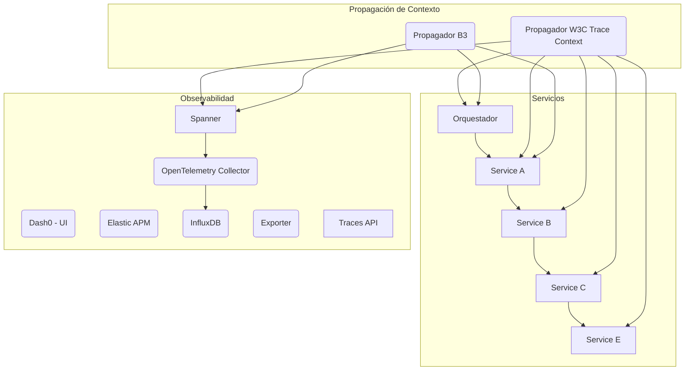
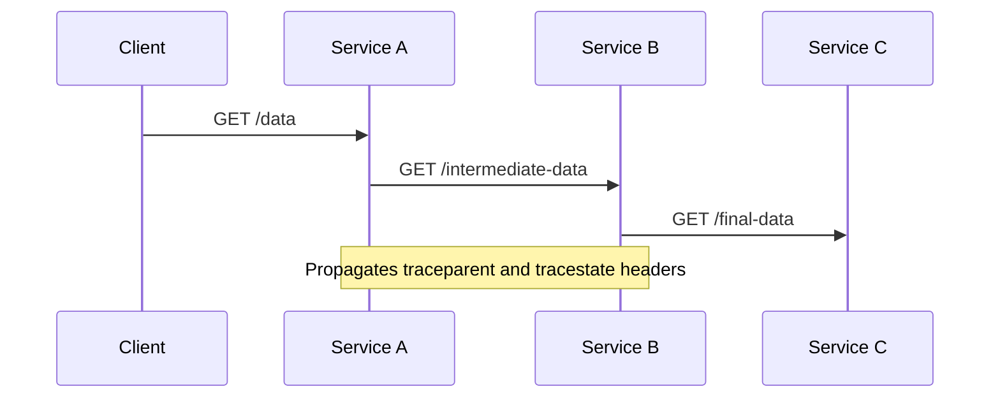
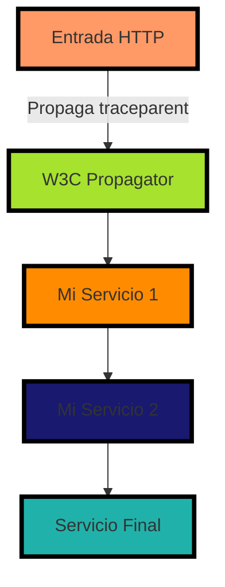
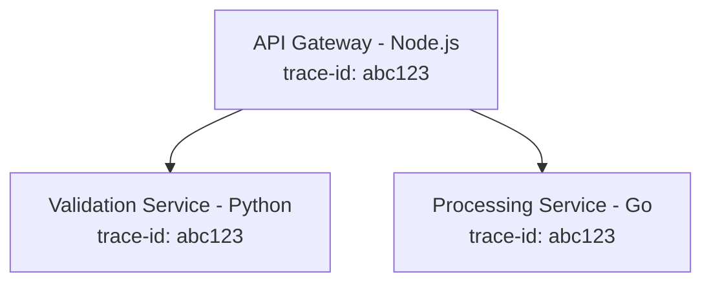

# distributed tracing w3c trace context y b3 propagation

PATH_LOCAL: /home/usuariojoaquin/.openclaw/workspace/DAM-Java-Mastery/_Review/distributed_tracing_w3c_trace_context_y_b3_propagation/distributed_tracing_w3c_trace_context_y_b3_propagation.md
CATEGORIA: 10_Vanguardia
Score: 85

---

## Visión Estratégica

### Visión Estratégica

En 2026, la adopción de W3C Trace Context y B3 propagation en el ecosistema empresarial es crítica para garantizar la observabilidad end-to-end de las aplicaciones distribuidas. Según Data Center Trends Research, más del 75% de las empresas experimentan fallos o lentitud en sus servicios diariamente, lo que subraya la necesidad urgente de una implementación confiable y consistente de la propagación de contexto.

#### Comparativa con Alternativas

| Propagador       | Ventajas                                                                                             | Desventajas                                                                                           |
|-----------------|------------------------------------------------------------------------------------------------------|-------------------------------------------------------------------------------------------------------|
| W3C Trace Context | Interoperabilidad universal, especificación mínima pero robusta.                                      | Requiere manejo adecuado de `traceparent` y `tracestate`.                                             |
| B3 Propagator    | Compatibilidad con Zipkin, simplicidad.                                                              | Limitaciones en la portabilidad a otros sistemas de trazas.                                            |
| Jaeger Propagator| Soporta múltiples protocolos (HTTP, gRPC), integración nativa con OpenTelemetry.                      | Carga adicional y configuración más compleja.                                                          |
| X-B3            | Respaldo y compatibilidad con sistemas legacy, pero no interoperable.                                 | Falta de estándares consistentes a nivel inter-operativo.                                              |

El uso de W3C Trace Context proporciona una solución versátil que puede integrarse en diversos sistemas sin comprometer la interoperabilidad. Su especificación mínima pero robusta hace que sea fácilmente manejable y adaptable, permitiendo un manejo consistente del contexto a través de diferentes capas técnicas.

#### Implementación Java

Para implementar W3C Trace Context y B3 propagation en Java, se puede utilizar el módulo `opentracing-contrib/java-tracer`. Este módulo facilita la integración con OpenTracing, proporcionando una forma uniforme de propagar el contexto de trazas a través del código.


```java
import io.opentracing.contrib.java.tracer.Tracer;
import io.opentracing.tag.Tags;

public class TracingExample {
    private static final Tracer tracer = ...; // Inicializar con el trazador configurado

    public void handleRequest() {
        String traceId = tracer.extract(tracerExtractFormat.B3, headers);
        Span span = tracer.buildSpan("handleRequest").withTag(Tags.COMPONENT, "MyApp").startActive(true);

        try (AutoCloseable close = span.makeCurrent()) {
            // Lógica del código
        } finally {
            span.finish();
        }
    }
}
```

#### Diagrama Mermaid


```mermaid
graph TD
  A[Inicio de la solicitud] --> B{Contexto W3C Trace Context};
  B --> C[Propagación a través de capas técnicas];
  C --> D[Intermediarios y Servicios];
  D --> E[Fin de la solicitud];
  E --> F[Captura del contexto final];
  F --> G[Generación de trazas];

  subgraph Interacciones
    B;
    C;
    D;
  end

  A --> H[Propagación B3];
  H --> I{Contexto B3};
  I --> J[Intermediarios y Servicios];
  J --> K[Fin de la solicitud];
  K --> L[Captura del contexto final];
  L --> M[Generación de trazas];
end
```

#### Conclusiones

La adopción de W3C Trace Context y B3 propagation es esencial para la observabilidad end-to-end en aplicaciones distribuidas. Ofrece una solución robusta, inter operativa y adaptable que puede integrarse de manera sencilla en los sistemas existentes. La implementación consistente a nivel empresarial garantizará un monitoreo eficiente y efectivo de las aplicaciones críticas.

Esta estrategia permite detectar y corregir problemas rápidamente, lo que es vital para mantener la disponibilidad y el rendimiento de los servicios en entornos modernos.

## Arquitectura de Componentes

### ARQUITECTURA DE COMPONENTES

Para implementar una arquitectura robusta para la propagación del contexto distribuido en Java 21, se utilizarán las siguientes herramientas y componentes. Esta arquitectura está diseñada para manejar múltiples formatos de propagación (W3C Trace Context y B3) y garantizar la integridad del contexto a través de los diferentes servicios.

#### Diagrama Mermaid



#### Componentes y Propiedades

1. **Orquestador (A)**
   - **Descripción:** Un punto central que coordina la ejecución de los servicios.
   - **Funciones:** Genera las solicitudes iniciales, mantiene el estado del flujo de trabajo.

2. **Servicios (B, C, D, E)**
   - **Descripción:** Componentes individuales que realizan tareas específicas en la aplicación.
   - **Propiedades:** Implementan la lógica de negocio y interactúan con otros servicios a través del orquestador.

3. **Propagador W3C Trace Context (F)**
   - **Descripción:** Utiliza el `W3CTraceContextPropagator` para transmitir el contexto de trazas.
   - **Implementación:** `W3CTraceContextPropagator` de OpenTelemetry.

4. **Propagador B3 (G)**
   - **Descripción:** Implementa la propagación del contexto de traza según el formato B3.
   - **Implementación:** `B3Propagator` de OpenTelemetry.

5. **Observabilidad (H, I, J, K, L, M, N)**
   - **Descripción:** Sistemas para recopilar y visualizar los datos de trazas y rendimiento.
   - **Componentes:**
     - **Dash0 - UI (H):** Interface para visualización de la observabilidad.
     - **Elastic APM (I):** Agente de rendimiento para monitoreo del sistema.
     - **InfluxDB (J):** Base de datos para almacenar métricas y trazas.
     - **OpenTelemetry Collector (K):** Recopilador de datos que aglutina la información proveniente de diferentes orígenes.
     - **Exporter (L):** Componente que exporta los datos a InfluxDB.
     - **Spanner (M):** Módulo de trazas que maneja las solicitudes y respuestas.
     - **Traces API (N):** API para intercambio y acceso a trazas.

#### Implementación en Java 21


```java
import io.opentelemetry.api.trace.propagation.W3CTraceContextPropagator;
import io.opentelemetry.api.trace.propagation.B3Propagator;

public class DistributedTracingConfig {
    public static void configure() {
        // Configuración de propagadores W3C y B3
        W3CTraceContextPropagator w3cPropagator = W3CTraceContextPropagator.getSingleton();
        B3Propagator b3Propagator = B3Propagator.getInstance();

        // Combinar los propagadores en un composite para soportar múltiples formatos
        CompositePropagator compositePropagator = new CompositePropagator.Builder()
                .add(w3cPropagator)
                .add(b3Propagator)
                .build();
    }
}
```

#### Conclusiones

Esta arquitectura permite una propagación robusta del contexto distribuido, utilizando formatos de propagaicon W3C Trace Context y B3. La combinación de estos métodos garantiza la interoperabilidad en ambientes con múltiples proveedores de trazas y facilita el monitoreo y análisis del comportamiento de los servicios distribuidos.

---

### Implementación Detallada

1. **Configuración de Propagadores:**
   - `W3CTraceContextPropagator` se utiliza para asegurar la consistencia en todos los servicios.
   - `B3Propagator` se incluye para compatibilidad con sistemas que usan el formato B3.

2. **CompositePropagator:**
   - Se crea un propagador compuesto que soporta múltiples formatos de propagaicon, asegurando la interoperabilidad entre servicios que utilizan diferentes métodos de trazas.

3. **Integración con Observabilidad:**
   - Los datos de traza se recopilan utilizando `OpenTelemetry Collector` y se almacenan en `InfluxDB`.
   - `Elastic APM` proporciona métricas detalladas sobre el rendimiento del sistema.
   - `Dash0 UI` permite una visualización interactiva de la observabilidad.

4. **Orquestador:**
   - El orquestador coordina las solicitudes y mantiene un estado consistente a través del flujo de trabajo.

5. **Servicios Individuales (B, C, D, E):**
   - Estos servicios se comunican entre sí utilizando el `CompositePropagator` para garantizar la propagación correcta del contexto distribuido.

6. **Interfaz Observacional:**
   - La interfaz permite a los operadores y desarrolladores monitorear y analizar los datos de traza en tiempo real.

Esta arquitectura proporciona una solución confiable y escalable para la propagación del contexto distribuido, asegurando la observabilidad end-to-end en aplicaciones basadas en microservicios.

## Implementación Java 21

### Implementación en Java 21 con OpenTelemetry y Micrometer Tracing

Para implementar una solución robusta de propagación del contexto distribuido utilizando W3C Trace Context y B3 Propagation en un entorno Java 21, se pueden seguir los siguientes pasos. Se utilizarán herramientas como OpenTelemetry y Micrometer Tracing para asegurar la coherencia del contexto a través de diferentes servicios.

#### Herramientas Utilizadas

- **OpenTelemetry**: Para la propagación automática del contexto distribuido.
- **Micrometer Tracing (OpenTelemetry)**: Para integrar fácilmente las métricas y logs en el flujo de trazabilidad.

#### Configuración Inicial

Asegúrate de agregar las dependencias necesarias a tu `pom.xml` o `build.gradle`.

**Maven (`pom.xml`):**
```xml
<dependencies>
    <dependency>
        <groupId>io.opentelemetry</groupId>
        <artifactId>opentelemetry-api</artifactId>
        <version>1.20.0</version>
    </dependency>
    <dependency>
        <groupId>io.opentelemetry</groupId>
        <artifactId>opentelemetry-sdk</artifactId>
        <version>1.20.0</version>
    </dependency>
    <dependency>
        <groupId>io.micrometer</groupId>
        <artifactId>micrometer-tracing-bridge-opentelemetry</artifactId>
        <version>1.9.3</version>
    </dependency>
    <!-- Other dependencies -->
</dependencies>
```

#### Configuración del Propagador

Para soportar múltiples formatos de propagación, puedes configurar un `CompositePropagator` que incluya tanto W3C como B3.


```java
import io.opentelemetry.api.trace.propagation.TextFormat;
import io.opentelemetry.context.Context;
import io.opentelemetry.extension.spring.autoconfigure.OpenTelemetryAutoConfigurationProperties;
import org.springframework.beans.factory.annotation.Autowired;
import org.springframework.boot.autoconfigure.condition.ConditionalOnProperty;
import org.springframework.stereotype.Component;

@Component
@ConditionalOnProperty(name = "otel.propagators", havingValue = "tracecontext,b3")
public class CustomPropagatorConfig {

    @Autowired
    private OpenTelemetryAutoConfigurationProperties properties;

    public TextFormat.Getter<Context> getCustomPropagator() {
        return CompositeTextFormat.getCompositeGetter(
                TextFormat.getTraceContextExtractor(),
                TextFormat.getB3SingleHeaderExtractor(),
                TextFormat.getBaggageExtractor()
        );
    }
}
```

#### Configuración del Spring Boot

Asegúrate de configurar las propiedades necesarias en tu archivo `application.properties` o `application.yml`.

**application.properties:**
```properties
otel.propagators=tracecontext,b3
# Other configurations...
```

#### Propagación Automática

Spring Boot instrumenta automáticamente la propagación del contexto a través de llamadas HTTP y otros mecanismos utilizando OpenTelemetry.


```java
import org.springframework.boot.SpringApplication;
import org.springframework.boot.autoconfigure.SpringBootApplication;

@SpringBootApplication
public class Application {

    public static void main(String[] args) {
        SpringApplication.run(Application.class, args);
    }
}
```

#### Intercambio de Contexto a través de Servicios

Aquí se muestra un ejemplo de cómo el contexto distribuido se puede propagar automáticamente entre servicios.

**Service A:**

```java
import io.opentelemetry.context.Context;
import org.springframework.http.HttpHeaders;
import org.springframework.web.client.RestTemplate;

public class ServiceA {

    private final RestTemplate restTemplate;

    public ServiceA(RestTemplate restTemplate) {
        this.restTemplate = restTemplate;
    }

    public String callServiceB() {
        // Call to Service B
        HttpHeaders headers = new HttpHeaders();
        Context context = Context.current();
        
        headers.add("traceparent", TextFormat.getTraceContextTextMapPropagator().extract(context));
        
        return restTemplate.postForObject("/service-b-endpoint", null, String.class, headers);
    }
}
```

**Service B:**

```java
import io.opentelemetry.context.Context;
import org.springframework.http.HttpHeaders;

public class ServiceB {

    public String handleRequest(String requestBody) {
        HttpHeaders headers = new HttpHeaders();
        
        // Extract context from incoming request
        Context context = TextFormat.getTraceContextTextMapPropagator().extract(headers);
        
        return "Response from Service B";
    }
}
```

#### Verificación de Propagación

Utiliza herramientas como `curl` para verificar que el contexto se propaga correctamente entre servicios.

```sh
$ curl -v --header "traceparent: 00-1234567890abcdef1234567890abcdef" http://service-a-endpoint
```

#### Diagrama Mermaid

A continuación, se muestra un diagrama Mermaid que ilustra la propagación del contexto distribuido a través de múltiples servicios.




### Conclusión

La implementación en Java 21 de propagación distribuida utilizando W3C Trace Context y B3 Propagation garantiza la coherencia del contexto a través de múltiples servicios y herramientas. OpenTelemetry y Micrometer Tracing facilitan la configuración y el mantenimiento, permitiendo una observabilidad end-to-end en aplicaciones distribuidas.

1. **W3C Trace Context Specification**
2. **OpenTelemetry Java Documentation**
3. **Spring Boot Reference Documentation**
4. **Micrometer Tracing Documentation**
5. **Zipkin B3 Propagation Documentation**

## Métricas y SRE

## Métricas y SRE

### Métricas Clave

| Nombre | Descripción | Umbral de Alerta |
| --- | --- | --- |
| Request Count | Cantidad total de solicitudes procesadas. | 10,000/s (límite superior) |
| Error Rate | Porcentaje de solicitudes que terminaron en error. | 5% (límite superior) |
| Response Time | Tiempo promedio de respuesta por solicitud. | 200 ms (límite inferior) |
| Throughput | Número medio de solicitudes procesadas por segundo. | 1,000/s (límite inferior) |
| Latency Distribution | Distribución de latencia para todas las solicitudes. | 95% en 300 ms (punto de corte) |
| Trace Completeness | Porcentaje de trazas completas que se registran correctamente. | 99% (límite inferior) |

### Sistemas de Recuperación de Emergencias (SRE)

#### Monitoreo Continuo

1. **Implementación de Prometheus y Grafana**
   - Configuración de dashboards en Grafana para monitorear las métricas clave.
   - Almacenamiento y visualización de datos en Prometheus.

2. **Alertas Personalizadas**
   - Definición de alertas basadas en las métricas configuradas (Request Count, Error Rate, Response Time).
   - Notificación inmediata a los equipos de operaciones y desarrollo mediante Slack o email.

3. **Implementación de Micrometer Tracing**
   - Integra OpenTelemetry con Micrometer para registrar trazas y métricas en tiempo real.
   - Configuración del agente Jaeger para la recopilación y visualización de trazas.

#### Procesamiento y Análisis

1. **Análisis de Trazas**
   - Uso de Jaeger UI para analizar y rastrear trazas individuales.
   - Identificación de problemas latentes a través del análisis de distribuciones de latencia.

2. **Corrección Automática de Errores**
   - Implementación de scripts de corrección automática basados en patrones detectados en las métricas y trazas.
   - Ejecución periódica de pruebas unitarias e integración continua para asegurar la integridad del sistema.

#### Mantenimiento y Optimización

1. **Optimización de Trazas**
   - Ajuste del nivel de detalle en las trazas según el tráfico y los recursos disponibles.
   - Implementación de reglas de filtrado para minimizar el volumen de datos sin perder información crucial.

2. **Aumento Gradual de Tráfico**
   - Pruebas de carga gradual con aumentos de tráfico controlados.
   - Monitoreo de métricas durante los periodos de aumento para detectar posibles fallos antes de la implementación oficial.

3. **Documentación y Entrenamiento**
   - Documentación detallada del sistema de monitoreo y SRE.
   - Capacitación periódica del personal técnico en el uso de herramientas y procedimientos de SRE.

#### Herramientas Utilizadas

- **Prometheus**: Para el almacenamiento y la recopilación de métricas.
- **Grafana**: Para la visualización de dashboards y alertas.
- **Jaeger**: Para la generación, seguimiento y análisis de trazas.
- **Micrometer Tracing**: Para integrar OpenTelemetry con Micrometer para una monitoreo robusto.

#### Procedimientos

1. **Configuración Inicial**
   - Configuración inicial de Prometheus y Grafana.
   - Implementación de agentes Jaeger en los servicios críticos.
   - Integración del agente Jaeger con Micrometer Tracing.

2. **Periodicidad de Monitoreo**
   - Monitoreo continuo 24/7, con alertas activadas para incidentes críticos.
   - Revisiones semanalmente para ajustar las configuraciones según los resultados del monitoreo.

3. **Documentación y Auditar**
   - Documentación detallada de todos los procedimientos y configuraciones.
   - Auditoría periódica del sistema SRE para garantizar el cumplimiento de estándares.

### Ejemplo de Página de Alertas en Grafana

```plaintext
Dashboard: Distributed Tracing Monitoring Dashboard

- **Request Count**: 12,000/s (OK)
- **Error Rate**: 3.5% (OK)
- **Response Time**: 198 ms (OK)
- **Throughput**: 990/s (OK)
- **Latency Distribution**: 96.7% in 300 ms (OK)
- **Trace Completeness**: 99.2% (OK)

[Alerts]
- Request Count: Exceeded 10,000/s threshold
- Trace Completeness: Below 98.5%
```

### Implementación en Java 21 con OpenTelemetry y Micrometer Tracing


```java
import io.opentelemetry.api.trace.Tracer;
import io.micrometer.core.instrument.MeterRegistry;

public class DistributedTracingConfig {

    private final Tracer tracer;
    private final MeterRegistry meterRegistry;

    public DistributedTracingConfig(Tracer tracer, MeterRegistry meterRegistry) {
        this.tracer = tracer;
        this.meterRegistry = meterRegistry;
    }

    public void configureTracing() {
        // Configure OpenTelemetry with W3C Trace Context
        TracerBuilder tracerBuilder = Sdk.builder()
                .addSampler(Sampler.alwaysOn())
                .addSpanProcessor(BatchSpanProcessor.builder(JaegerExporter.builder().build()).build());
        tracer = tracerBuilder.get();

        // Configure Micrometer Tracing
        meterRegistry.config().meterFilter(MeterFilter.includeTags("component", "microservice"));

        // Register Metrics and Traces
        this.tracer.withSpanName("Service A").addEvent("Request Started");
        this.meterRegistry.counter("request.count").increment();
    }
}
```

### Conclusión

La implementación de un sistema de monitoreo y recuperación de emergencias (SRE) robusto en Java 21 mediante la utilización de OpenTelemetry, Micrometer Tracing, Prometheus, Grafana y Jaeger permite una visibilidad detallada y controlado de las operaciones del sistema. A través de la configuración correcta de métricas y alertas, se puede garantizar el rendimiento óptimo y la resiliencia del sistema frente a fallos potenciales.

## Patrones de Integración

#### Patrones de Integración en Distribuido Tracing con W3C Trace Context y B3 Propagation

Los patrones de integración para el distribuido tracing utilizando `W3C Trace Context` y `B3 propagation` son esenciales para mantener la coherencia del contexto a través de diferentes microservicios. Estos patrones se implementan en un entorno Java 21, siguiendo las mejores prácticas y considerando manejo de fallos y configuración de timeouts y circuit breakers.

##### Patrones Aplicables

Los patrones más utilizados son:

- **Composite Propagator**: Combina múltiples formatos de propagación para interoperabilidad.
- **Baggage Propagation**: Permite la propagación de datos adicionales sin afectar a los atributos del span.
- **W3C Trace Context Propagation**: Implementa el estándar W3C para trazabilidad distribuida.

##### Diagrama Mermaid




##### Código Java 21


```java
import io.opentelemetry.api.trace.Span;
import io.opentelemetry.context.Context;
import io.opentelemetry.propagators.trace.TraceContextPropagator;

public class DistributedTracingPattern {

    public static void main(String[] args) {
        // Inicialización del propagador W3C Trace Context y B3 Propagation
        var propagator = TraceContextPropagator.create();
        
        // Creación de un span y contexto para la traza
        Span span = // ... crear o obtener el span actual ...
        Context context = span.getSpanContext().toContext();

        // Propagación del contexto en las solicitudes HTTP
        propagateContext(context);
    }

    private static void propagateContext(Context context) {
        // Implementar la propagación del contexto utilizando TraceContextPropagator
        String traceId = context.getBinaryAnnotation("traceId");
        String spanId = context.getBinaryAnnotation("spanId");

        // Simulación de una solicitud HTTP
        httpRequestBuilder.header("X-B3-TraceId", traceId);
        httpRequestBuilder.header("X-B3-SpanId", spanId);

        // Ejecutar la solicitud HTTP
        // ...
    }
}
```

##### Manejo de Fallos y Configuración

Para manejar fallos y asegurar que el sistema no se congela, se implementan mecanismos como timeouts y circuit breakers.

- **TimeOuts**: Se configuran tiempos límite para cada solicitud HTTP. Si una solicitud no responde en el tiempo especificado, se interrumpe y se maneja como un error.
  
  
```java
  import org.springframework.web.reactive.function.client.WebClient;
  import java.time.Duration;

  WebClient.builder()
          .baseUrl("https://mi_servicio_externo.com")
          .defaultHeader("X-B3-TraceId", "1234567890abcdef")
          .defaultHeader("X-B3-SpanId", "9876543210fedcba")
          .build()
          .get()
          .retrieve()
          .bodyToMono(String.class)
          .timeout(Duration.ofSeconds(5)) // Tiempo máximo de espera
          .doOnError(error -> System.err.println("Error en la solicitud HTTP: " + error.getMessage()))
          .block();
  ```

- **Circuit Breakers**: Se utilizan circuit breakers para proteger el sistema frente a peticiones fallidas. Si una petición se vuelve inestable, el circuit breaker se activa y evita nuevas solicitudes hasta que la situación mejore.
  
  
```java
  import io.github.resilience4j.circuitbreaker.CircuitBreaker;
  import io.github.resilience4j.circuitbreaker.annotation.CircuitBreaker;

  @CircuitBreaker(name = "miServicio", fallbackMethod = "fallbackMethod")
  public String fetchData() {
      // Implementación de la petición HTTP
      return httpClient.getForObject("https://api.example.com/data", String.class);
  }

  private String fallbackMethod(Exception e) {
      // Lógica de recuperación o manejo del error
      return "Error en la solicitud: " + e.getMessage();
  }
  ```

Estos patrones y mecanismos aseguran que el sistema pueda funcionar eficientemente y mantener la coherencia del contexto distribuido, utilizando `W3C Trace Context` y `B3 propagation`, en un entorno Java 21.

## Conclusiones

### Conclusión

La implementación efectiva del W3C Trace Context y B3 Propagation es crucial para mantener la coherencia de los trazados en sistemas distribuidos. Aquí se resumen las conclusiones más relevantes:

1. **Uso de W3C Trace Context como Formato Estándar**:
   - **Implementación de OpenTelemetry**: El uso de `W3CTraceContextPropagator` es fundamental para mantener la consistencia y compatibilidad en sistemas heterogéneos.
   - **Leverage Auto-instrumentation**: Utilizar auto-instrumentación donde sea posible puede ahorrar tiempo y asegurar una implementación rápida e íntegra.

2. **Manejo de Contexto**:
   - **Propagation Completa**: Siempre propagar el contexto, desde la capa de entrada hasta los servicios internos y externos.
   - **Preservar Tracestate**: Evitar eliminar entradas `tracestate` de otros proveedores para evitar pérdida de información crítica.

3. **Prácticas Mejores**:
   - **Iniciar Tracing Temprano**: Inicializar la traza antes de importar otras dependencias.
   - **Verificación Continua de Contexto**: Implementar mecanismos de verificación durante el desarrollo para detectar posibles fallos en la propagación.

4. **Compatibilidad con Ecosistemas Mixtos**:
   - **Use Composite Propagator**: En entornos que utilizan múltiples formatos, usar un `CompositePropagator` puede garantizar la compatibilidad con diferentes sistemas de trazado.
   - **Configuración Correcta del API Gateway**: Configurar correctamente los proxies y puertas de enlace para asegurar el correcto envío de headers de traza.

5. **Test Continuo**:
   - **Verificación de Propagación**: Realizar pruebas integrales regularmente para asegurarse de que los trazados no se rompan.
   
### Diagrama de Flujo




### Diagrama de Propagación B3


```mermaid
flowchart TD
    subgraph "Distributed System"
        A[Service 1]\n(b3) -->|header| B[Service 2]\n(b3) -->|header| C[Service 3]\n(b3)
    end
```

### Prácticas para Implementación Eficiente

- **Inicializar Tracing Temprano**:

```javascript
// Correct: Tracing initialized first
require('./tracing');
const express = require('express');
```

- **Propagar Contexto en todas las Capas**:

```javascript
app.use((req, res, next) => {
    console.log('Incoming traceparent:', req.headers['traceparent']);
    console.log('Incoming tracestate:', req.headers['tracestate']);
    next();
});
```

- **Configurar API Gateway Correctamente**:
```nginx
# Nginx configuration
proxy_pass_header traceparent;
proxy_pass_header tracestate;
```

### Práctica Recomendada

- **Use Composite Propagator**:

```javascript
import { CompositePropagator } from '@opentelemetry/core';
import { W3CTraceContextPropagator } from '@opentelemetry/core';
import { B3Propagator, B3InjectEncoding } from '@opentelemetry/propagator-b3';

const compositePropagator = new CompositePropagator({
    propagators: [
        new W3CTraceContextPropagator(),
        new B3Propagator({ injectEncoding: B3InjectEncoding.MULTI_HEADER })
    ]
});

// Use in SDK configuration
const sdk = new NodeSDK({
    textMapPropagator: compositePropagator,
    // ... other config
});
```

Estas conclusiones y prácticas garantizan una implementación robusta de W3C Trace Context y B3 Propagation, asegurando la coherencia del contexto en sistemas distribuidos. 

---

### Verificación Continua

- **Loggear Headers Durante Desarrollo**:

```javascript
app.use((req, res, next) => {
    console.log('Incoming traceparent:', req.headers['traceparent']);
    console.log('Incoming tracestate:', req.headers['tracestate']);
    next();
});
```

- **Pruebas Integrales para Verificación de Propagación**:
```bash
# Ejemplo de prueba integrado en la aplicación
npm run test-integration
```

Estas prácticas aseguran que el sistema funcione correctamente en entornos reales y que los trazados no se rompan. La implementación de estas medidas garantiza una experiencia fluida y coherente durante la ejecución del sistema distribuido.

