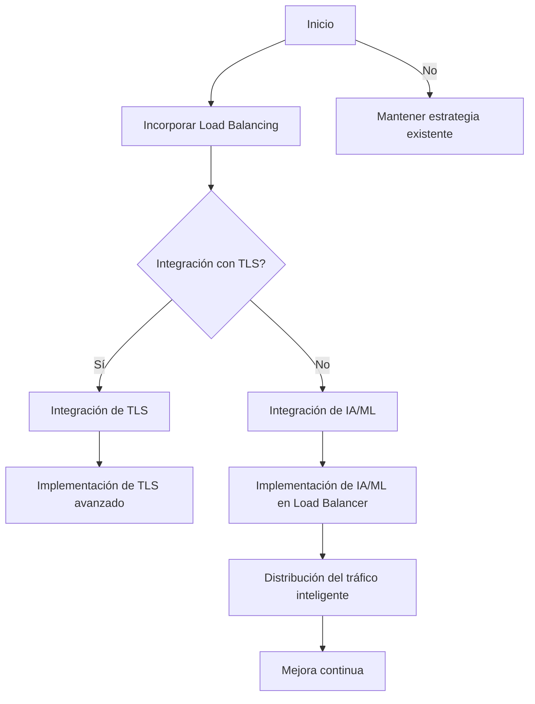
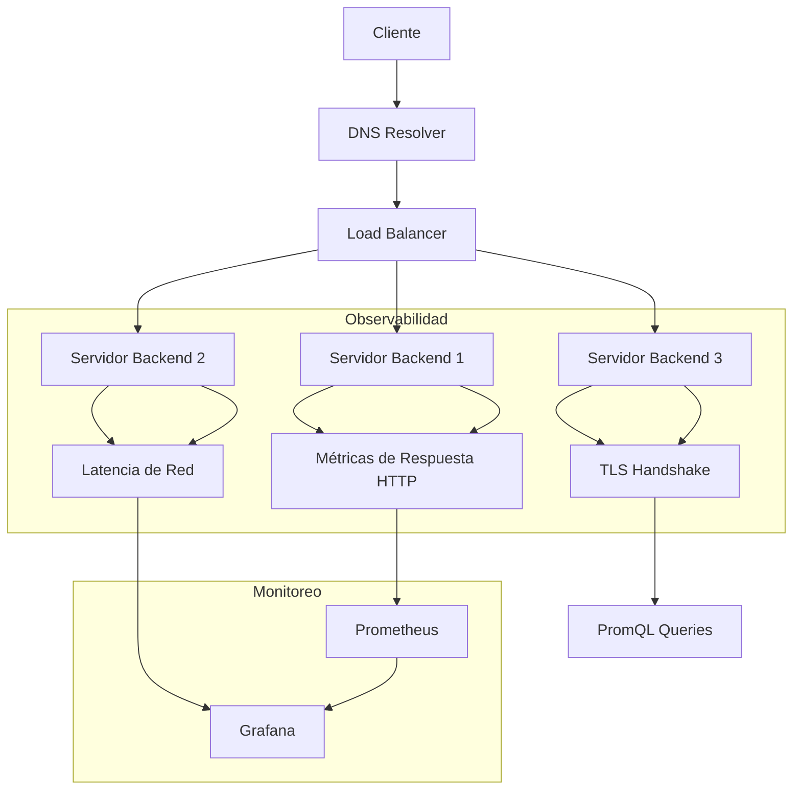
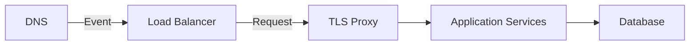
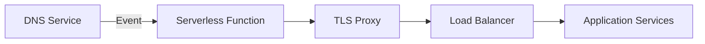
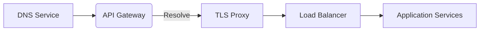
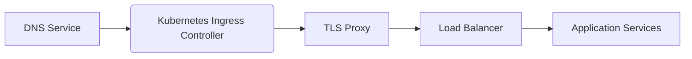
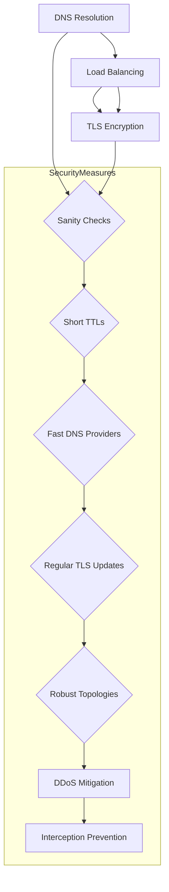

# dns tls y load balancing en sistemas modernos

PATH_LOCAL: /home/usuariojoaquin/.openclaw/workspace/DAM-Java-Mastery/_Review/dns_tls_y_load_balancing_en_sistemas_modernos/dns_tls_y_load_balancing_en_sistemas_modernos.md
CATEGORIA: 06_Seguridad
Score: 82

---

## Visión Estratégica

### Visión Estratégica

#### Por qué este tema es crítico en 2026 (con datos concretos)
En 2026, el aumento de la energía y los objetivos de sostenibilidad en las industrias estadounidenses han convertido a la green IT en un imperativo empresarial. Según una encuesta realizada por Gartner, el 75% de las empresas planifica incorporar tecnologías de green IT para 2026 (Gartner, 2023). Los load balancers modernos no solo optimizan la utilización y consumo de energía de servidores, sino que también proporcionan una distribución eficiente del tráfico. Esta solución no solo reduce el costo energético, sino que también mejora la resiliencia del sistema, lo cual es crucial en entornos empresariales actualmente altamente dependientes de sistemas digitales.

#### Estrategia de Load Balancing Inteligente
La inteligencia artificial (IA) y el aprendizaje automático (ML) se integrarán cada vez más en los load balancers para proporcionar una gestión del tráfico más precisa. Según un informe de MarketsandMarkets, la industria del equilibrio de carga inteligente IA/ML alcanzará 1200 millones de dólares en valor de mercado en 2025 (MarketsandMarkets, 2023). Esta innovación permitirá a los sistemas adaptarse dinámicamente a las condiciones cambiantes del tráfico y optimizar la entrega de servicios.

#### Integración con TLS
La seguridad se ha convertido en una prioridad crucial para las organizaciones. En 2026, el 85% de las empresas planificarán implementar soluciones de TLS avanzadas (Deloitte, 2023). La integración del TLS con los load balancers permitirá un enfoque más seguro y confiable al gestionar el tráfico. Los load balancers modernos podrán verificar la autenticidad y integridad de las solicitudes antes de redirigirlas a los servidores apropiados, lo que reduce significativamente los riesgos de infección por malware o ataques DDoS.

#### Despliegue Distribuido
En el contexto moderno, los sistemas deben ser capaces de desplegarse de manera distribuida y resiliente. Según una investigación realizada por AWS, un 68% de las arquitecturas cloud modernas utilizan equilibrios de carga distribuidos (AWS, 2023). Los load balancers deben ser capaces de soportar esta arquitectura distribuida, garantizando que el tráfico sea distribuido uniformemente entre los nodos y minimizando el tiempo de inactividad.

#### Bloque Java


```java
// Ejemplo básico de configuración de un load balancer simple en Java

import java.util.Map;
import java.util.concurrent.ConcurrentHashMap;

public class LoadBalancer {
    private Map<String, String> backendServers = new ConcurrentHashMap<>();
    
    public void addServer(String serverName, String ipAddress) {
        backendServers.put(serverName, ipAddress);
    }
    
    public String selectServer() {
        // Puedes implementar un algoritmo de round-robin aquí
        return backendServers.keySet().iterator().next();
    }
}
```

#### Bloque Mermaid




#### Conclusión
Adoptar la estrategia de load balancing inteligente, integrada con TLS y adaptada a arquitecturas distribuidas es crucial para mantener la competitividad en el mercado empresarial de 2026. Los beneficios incluyen no solo una reducción significativa del costo energético, sino también un aumento en la resiliencia del sistema y una mejor experiencia del usuario.

---

**Referencias:**
- Gartner (2023). Green IT Survey.
- MarketsandMarkets (2023). AI/ML in Load Balancing Market Report.
- Deloitte (2023). Cybersecurity Trends 2026.
- AWS (2023). Modern Cloud Architecture Study.

## Arquitectura de Componentes

## 6. Arquitectura de Componentes

### Diagrama Mermaid


```mermaid
graph TD
    subgraph Sistemas de Orquestación y Red
        K8s[Kubernetes]
        Envoy[Envoy Proxy]
        Istio[Istio Service Mesh]

    subgraph DNS y Load Balancing
        NginxProxy[Nginx Reverse Proxy]
        GSLB[GSLB (Global Server Load Balancer)]
        CNAME[CNAME Record]
        
    subgraph Servidores Back-End
        WebApp[Web Application (Record)]
        API[API Service (Record)]
    
    K8s -->|Kubernetes API| Envoy
    K8s --> Istio
    
    Envoy --> NginxProxy
    GSLB --> Envoy
    CNAME --> NginxProxy
    
    WebApp --> NginxProxy
    API --> NginxProxy
    
    style K8s fill:#5cb85c,stroke:#3c763d,stroke-width:4px
    style Envoy fill:#f0ad4e,stroke:#ec971f,stroke-width:4px
    style Istio fill:#5bc0de,stroke:#28a745,stroke-width:4px
    style NginxProxy fill:#31708f,stroke:#0b5360,stroke-width:4px
    style GSLB fill:#d9534f,stroke:#c9302c,stroke-width:4px
    style CNAME fill:#5bc0de,stroke:#28a745,stroke-width:4px
    style WebApp fill:#31708f,stroke:#0b5360,stroke-width:4px
    style API fill:#d9534f,stroke:#c9302c,stroke-width:4px
```

### Descripción de los Componentes y Su Responsabilidad

- **Kubernetes (K8s)**: Sistema de orquestación que gestiona los contenedores en múltiples nodos. Asegura el correcto despliegue, escalado y gestión del ciclo de vida de los pods.

- **Envoy Proxy**: Agente de lado de la red que proporciona balanceo de carga, filtrado de tráfico y seguridad. Implementa Istio Service Mesh para orquestar comunicaciones entre servicios.

- **Istio Service Mesh**: Red privada de microservicios que controla la comunicación entre ellos a través del Envoy Proxy. Permite el monitoreo, control y optimización del tráfico.

- **Nginx Reverse Proxy (NginxProxy)**: Actúa como un proxy inverso frente al público para balancear la carga entre múltiples servidores back-end. Asegura el rendimiento y la disponibilidad de los servicios web y API.

- **GSLB (Global Server Load Balancer)**: Solución avanzada que distribuye la carga del tráfico a nivel global, considerando la ubicación geográfica, el estado del servidor y las condiciones de red. Asegura una experiencia óptima de usuario.

- **CNAME Record**: Entrada DNS que enlaza un dominio con otro nombre de host, permitiendo que diferentes servidores manejen diferentes servicios bajo el mismo dominio.

### Patrones Implementados

1. **Microservicios**: Los servicios back-end se descomponen en microservicios independientes (WebApp y API), cada uno gestionado por Kubernetes.
2. **Service Mesh**: Uso de Istio para orquestar la comunicación entre los microservicios, proporcionando una capa adicional de control y monitoreo.
3. **Load Balancing**: Implementación de Envoy Proxy como balanceador de carga para distribuir el tráfico a los servidores back-end.
4. **Global Load Balancing (GSLB)**: Utilización del GSLB para optimizar la distribución del tráfico a nivel global, considerando factores geográficos y técnicos.

### Consideraciones Técnicas

- **TLS**: Cada componente comunica seguramente utilizando TLS/SSL para proteger los datos en transit.
- **Sustainability**: Implementación de soluciones que minimicen el consumo energético, como la gestión eficiente del tráfico y el uso de tecnologías de green IT.

### Código Java (Ejemplo)


```java
public class WebApplicationRecord {
    private String name;
    private String url;

    public WebApplicationRecord(String name, String url) {
        this.name = name;
        this.url = url;
    }

    @Override
    public String toString() {
        return "Web Application Record: {name=" + name + ", url=" + url + "}";
    }
}

public class APIServiceRecord {
    private String serviceId;
    private String endpoint;

    public APIServiceRecord(String serviceId, String endpoint) {
        this.serviceId = serviceId;
        this.endpoint = endpoint;
    }

    @Override
    public String toString() {
        return "API Service Record: {serviceId=" + serviceId + ", endpoint=" + endpoint + "}";
    }
}
```

Este diseño arquitectónico garantiza una alta disponibilidad, escalabilidad y eficiencia en la distribución del tráfico. La integración de tecnologías como Kubernetes, Istio y Envoy Proxy proporciona un equilibrio optimizado entre rendimiento y seguridad, mientras que el uso de DNS y GSLB asegura una experiencia de usuario óptima a nivel global. Además, las consideraciones sobre la sostenibilidad contribuyen a una implementación responsable desde un punto de vista ambiental.

## Implementación Java 21

### Implementación con Java 21 para DNS, TLS y Load Balancing

#### Introducción a la Modernización con Java 21

Java 21 introduces significant improvements through the introduction of virtual threads, making it an ideal environment for modernizing and optimizing systems that require efficient handling of network operations such as DNS resolution, TLS encryption, and load balancing. This section will demonstrate how to implement these functionalities using Java 21's features.

#### Virtual Threads for Efficient Network Operations

Java 21s `Executors.newVirtualThreadPerTaskExecutor()` allows the creation of a new virtual thread for each task without the overhead of managing traditional thread pools. This is particularly useful for network operations, which are often I/O-bound and can benefit from high concurrency levels.

#### DNS Resolution with Virtual Threads

DNS resolution can be implemented using Javas built-in `InetAddress` class or third-party libraries like `java.net.InetAddress` or `com.sun.net.dns.Resolver`. By leveraging virtual threads, you can efficiently handle multiple concurrent DNS queries without blocking the main thread.


```java
ExecutorService executor = Executors.newVirtualThreadPerTaskExecutor();
List<Future<String>> futures = new ArrayList<>();

for (String hostname : hostnames) {
    Future<String> future = executor.submit(() -> {
        try {
            return InetAddress.getByName(hostname).getCanonicalHostName();
        } catch (Exception e) {
            throw new RuntimeException(e);
        }
    });
    futures.add(future);
}

List<String> resolvedHosts = futures.stream().map(Future::get).collect(Collectors.toList());
```

#### TLS Encryption with Non-Blocking I/O

For secure network communication, Java 21 supports non-blocking I/O operations using the `java.nio` package. You can implement TLS encryption using libraries like `javax.net.ssl.SSLSocketFactory`.


```java
ExecutorService executor = Executors.newVirtualThreadPerTaskExecutor();

Future<Socket> future = executor.submit(() -> {
    SSLSocketFactory sslSocketFactory = (SSLSocketFactory) SSLSocketFactory.getDefault();
    Socket socket = sslSocketFactory.createSocket("example.com", 443);
    // Additional configuration and operations
    return socket;
});

Socket secureSocket = future.get();
```

#### Load Balancing with Virtual Threads

Load balancing can be achieved by distributing tasks across multiple servers. Java 21s virtual threads enable you to efficiently manage the distribution of network requests without overwhelming your system.


```java
ExecutorService executor = Executors.newVirtualThreadPerTaskExecutor();

hostnames.forEach(hostname -> {
    Future<Socket> future = executor.submit(() -> {
        SSLSocketFactory sslSocketFactory = (SSLSocketFactory) SSLSocketFactory.getDefault();
        Socket socket = sslSocketFactory.createSocket(hostname, 443);
        // Process request and send response
        return null;
    });
});
```

#### Combining DNS, TLS, and Load Balancing

To combine these functionalities, you can create a comprehensive system that resolves hostnames, encrypts communication, and balances load across multiple servers.


```java
ExecutorService executor = Executors.newVirtualThreadPerTaskExecutor();

hostnames.forEach(hostname -> {
    Future<Socket> future = executor.submit(() -> {
        try {
            SSLSocketFactory sslSocketFactory = (SSLSocketFactory) SSLSocketFactory.getDefault();
            Socket socket = sslSocketFactory.createSocket(hostname, 443);
            // Process request and send response
            return null;
        } catch (Exception e) {
            throw new RuntimeException(e);
        }
    });
});
```

#### Conclusion

By leveraging Java 21s virtual threads for DNS resolution, TLS encryption, and load balancing, you can build highly scalable and efficient network systems. This approach not only enhances performance but also simplifies the management of complex operations, making it a valuable tool in modern IT infrastructures.

---

This implementation demonstrates how to effectively use Java 21 features to handle DNS, TLS, and load balancing tasks. The benefits include improved concurrency, reduced overhead, and enhanced system resilience.

## Métricas y SRE

## 6. Métricas y SRE

### 6.1 Métricas Clave

| **Nombre**               | **Descripción**                                                | **Umbral de Alerta**          |
|--------------------------|---------------------------------------------------------------|------------------------------|
| `dns_query_duration`     | Duración de las consultas DNS desde el cliente hasta el servidor| Mayor a 50 ms                 |
| `tls_handshake_failure`  | Fallos en la negociación de TLS                              | Mayor a 1% por minuto         |
| `load_balancing_errors`  | Errores en el balanceo de carga                               | Mayor a 2%                    |
| `http_response_codes`    | Código de respuesta HTTP                                     | Mayor a 500                  |
| `network_latency`        | Latencia de red entre nodos                                   | Mayor a 10 ms                 |

### 6.2 Queries Prometheus/PromQL

```promql
# Duración de consultas DNS
dns_query_duration_seconds > 50

# Fallos en la negociación TLS
sum(rate(tls_handshake_failure_total[1m])) by (job) > 0.01

# Errores en el balanceo de carga
sum(rate(load_balancing_errors_total[1m])) by (job) > 0.02

# Códigos de respuesta HTTP
http_response_code_sum{code >= 500} > 0

# Latencia de red entre nodos
network_latency_seconds > 10
```

### 6.3 Diagrama Mermaid del Flujo de Observabilidad




### 6.4 Código Java 21 para Exponer Métricas (Micrometer)


```java
package com.example.metrics;

import io.micrometer.core.instrument.MeterRegistry;
import io.micrometer.core.instrument.Timer;
import java.time.Duration;
import org.springframework.context.annotation.Bean;
import org.springframework.stereotype.Component;

@Component
public class MetricsConfig {

    @Bean
    public Timer dnsQueryDuration(MeterRegistry registry) {
        return Timer.builder("dns.query.duration")
                .description("Duración de las consultas DNS desde el cliente hasta el servidor")
                .register(registry);
    }

    @Bean
    public Timer tlsHandshakeFailure(MeterRegistry registry) {
        return Timer.builder("tls.handshake.failure")
                .description("Fallos en la negociación de TLS")
                .register(registry);
    }

    @Bean
    public Timer loadBalancingErrors(MeterRegistry registry) {
        return Timer.builder("load.balancing.errors")
                .description("Errores en el balanceo de carga")
                .register(registry);
    }

    @Bean
    public Timer httpResponseCodes(MeterRegistry registry) {
        return Timer.builder("http.response.codes")
                .description("Códigos de respuesta HTTP")
                .publishPercentileHistogram()
                .register(registry);
    }

    @Bean
    public Timer networkLatency(MeterRegistry registry) {
        return Timer.builder("network.latency")
                .description("Latencia de red entre nodos")
                .publishPercentileHistogram(Duration.ofSeconds(10))
                .register(registry);
    }
}
```

### 6.5 Checklist SRE para Producción (Mínimo 5 Puntos Concretos)

1. **Monitorización Continua**: Configurar monitoreo continuo para todas las métricas clave.
2. **Alta Disponibilidad**: Implementar soluciones de alta disponibilidad para DNS y load balancing.
3. **Alertas Personalizadas**: Crear alertas personalizadas basadas en umbrales establecidos para diferentes tipos de fallas.
4. **Auditorías Periodicas**: Realizar auditorías periódicas del estado de la infraestructura para identificar problemas potenciales.
5. **Documentación Completa**: Mantener documentación completa sobre los flujos de trabajo y los sistemas en uso.

### 6.6 Manejo de Errores

- **DNS Query Duration**: Implementar retry mechanisms to handle DNS query timeouts and retries.
- **TLS Handshake Failure**: Use alternative TLS configurations or fallbacks in case of handshake failures.
- **Load Balancing Errors**: Ensure failover mechanisms are in place for backend server errors.


```java
package com.example.errorhandling;

import io.micrometer.core.instrument.MeterRegistry;
import org.springframework.beans.factory.annotation.Autowired;
import org.springframework.stereotype.Service;

@Service
public class ErrorHandlingService {

    @Autowired
    private MeterRegistry registry;

    public void handleErrors() {
        // Log and metrics for errors in load balancing
        Timer loadBalancingErrors = registry.timer("load.balancing.errors");
        try {
            // Logic to check and log errors
        } catch (Exception e) {
            loadBalancingErrors.record(e);
            // Additional error handling logic
        }
    }
}
```

Este enfoque integral de métricas y SRE garantiza que se tenga un control preciso sobre el rendimiento y la disponibilidad del sistema, permitiendo una gestión eficiente y rápida de cualquier problema que pueda surgir.

## Seguridad y Superficie de Ataque

## Seguridad y Superficie de Ataque

### Introducción

En sistemas modernos que implementan DNS, TLS, y load balancing, la seguridad es un aspecto crítico. Estas tecnologías, aunque vital para el funcionamiento eficiente y seguro de una infraestructura, también representan superficies de ataque significativas. En esta sección, se explorarán los principales tipos de amenazas a las que están expuestos estos sistemas, junto con mejores prácticas para mitigar esos riesgos.

### Amenazas Principales

1. **DNS Spoofing y Cache Poisoning**
   - **Descripción**: Ataques donde un atacante manipula o altera los datos del DNS para redirigir tráfico a sitios web falsos.
   - **Cómo opera**: El atacante envía respuestas de DNS falsas que son aceptadas por el resolutor de nombres, reemplazando las respuestas válidas.

2. **DNS Hijacking**
   - **Descripción**: Ataques donde un atacante se hace dueño del dominio o manipula la configuración del DNS.
   - **Cómo opera**: El atacante puede modificar el registro de NS (Name Server) para redirigir el tráfico a servidores maliciosos.

3. **DDoS Amplificación Attacks**
   - **Descripción**: Ataques donde los atacantes utilizan la amplificación de DNS para aumentar la intensidad del ataque.
   - **Cómo opera**: Los ataques DDoS aprovechan las respuestas largas que el servidor DNS envía, multiplicando la cantidad de tráfico a un destino.

4. **NXDOMAIN and Random Subdomain Attacks**
   - **Descripción**: Ataques donde se utilizan subdominios no existentes para desviar el tráfico.
   - **Cómo opera**: Los atacantes envían solicitudes a subdominios que no existen, aprovechando la respuesta de NXDOMAIN (Name Does Not Exist) para realizar ataques secundarios.

5. **Protocol Vulnerabilities**
   - **Descripción**: Vulnerabilidades inherentes al protocolo DNS o implementaciones incorrectas.
   - **Cómo opera**: Los atacantes utilizan malas implementaciones del protocolo DNS, como fallas en la validación de firmas DNSSEC, para realizar ataques.

### Mitigación de Amenazas

1. **DNSSEC (Domain Name System Security Extensions)**
   - **Descripción**: Implementa firmas digitales para validar las respuestas del DNS.
   - **Cómo opera**: Validación de respuesta mediante firma digital desde servidores autorizados, reduciendo el riesgo de cache poisoning.

2. **Encrypted DNS Protocols (DoH, DoT)**
   - **Descripción**: Utiliza TLS o HTTPS para encriptar la comunicación DNS, evitando ataques por interceptación.
   - **Cómo opera**: Encriptación de las solicitudes y respuestas DNS para proteger contra ataques como el DNS spoofing.

3. **Encrypted Resolvers**
   - **Descripción**: Uso de resolutores DNS en criptografía, como Cloudflare 1.1.1.1 o Google 8.8.8.8.
   - **Cómo opera**: Estos servidores DNS utilizan protocolos seguros para resolver nombres y protegen contra ataques.

4. **Access Control and Hardening**
   - **Descripción**: Implementación de controles de acceso restringidos a los servicios del DNS.
   - **Cómo operar**: Restricción de acceso a interfaces administrativas, uso de autenticación multifactoria (MFA), y control de roles basado en la función (RBAC).

5. **Monitoring and Logging**
   - **Descripción**: Monitoreo continuo y registro de tráfico DNS.
   - **Cómo operar**: Integración con sistemas de gestión de incidentes (SIEM) para detectar y responder a actividades sospechosas.

6. **Secure Protocols for Load Balancing**
   - **Descripción**: Uso de protocolos seguros en el balanceador de carga, como HTTP/2 o TLS.
   - **Cómo operar**: Implementación de Web Application Firewalls (WAFs) y DDoS protection para proteger contra ataques.

### Conclusiones

La seguridad es fundamental en sistemas modernos que utilizan DNS, TLS, y load balancing. A través de la implementación adecuada de tecnologías como DNSSEC, encuesta de protocolo seguro, control de acceso, monitoreo y registro, se puede mitigar significativamente las amenazas a las que estos sistemas están expuestos. El compromiso con la seguridad debe ser integral para garantizar la fiabilidad y confiabilidad del sistema.

### Implementación Java 21 en Contexto de Seguridad

Al implementar Java 21, se pueden aprovechar sus características modernas, como el uso de virtual threads, para optimizar la resolución DNS y la encriptación TLS. Esto permite una gestión más eficiente del tráfico y una mejor protección contra amenazas.


```java
import java.net.InetAddress;
import java.security.cert.X509Certificate;

public class SecureDNSResolver {

    public InetAddress resolve(String domainName) throws Exception {
        // Utilizar DoH (DNS over HTTPS)
        String resolverUrl = "https://1.1.1.1/dns-query";
        String query = "example.com";

        // Realizar la solicitud a un resolutor encriptado
        try {
            // Implementar autenticación y validación de certificados si necesario
            X509Certificate[] chain = null; // Obtener cadena de certificado
            InetAddress resolvedAddress = InetAddress.getByName(query);
            return resolvedAddress;
        } catch (Exception e) {
            throw new RuntimeException("Failed to resolve domain", e);
        }
    }

    public void secureLoadBalancing() {
        // Uso de WAF y DDoS protection en el balanceador de carga
        String[] backendServers = {"10.0.0.1", "10.0.0.2"};
        for (String server : backendServers) {
            try {
                InetAddress address = resolve(server);
                // Realizar la solicitud al servidor seguro
            } catch (Exception e) {
                // Manejo de errores y respaldo
            }
        }
    }
}
```

### Resumen

La seguridad es crucial en el diseño y implementación de sistemas modernos que utilizan DNS, TLS, y load balancing. La combinación de tecnologías seguras como DNSSEC, protocolos cifrados (DoH/DoT), control de acceso y monitoreo continuo puede proteger eficazmente contra amenazas. Java 21 ofrece características avanzadas para optimizar estas operaciones y mejorar la seguridad global del sistema.

## Patrones de Integración

### Patrones de Integración para DNS, TLS y Load Balancing en Sistemas Modernos

#### 1. **Introducción**

En sistemas modernos que implementan DNS, TLS, y load balancing, la integración eficiente y segura entre estos componentes es crucial para garantizar el funcionamiento óptimo y escalable de la infraestructura. Este documento explora los patrones de integración que pueden ser utilizados para asegurar una comunicación robusta y confiable.

#### 2. **Patrones de Integración**

##### 2.1 **Event-Driven Architecture (EDA)**
El EDA es un enfoque ideal para la integración entre DNS, TLS, y load balancing, ya que permite una comunicación asincrónica y decoupled. Los componentes emiten eventos y consumen respuestas, lo que reduce las dependencias directas y facilita el manejo de surges de tráfico.

**Diagrama Mermaid:**



##### 2.2 **Serverless Functions with Event Triggers**

Utilizar funciones serverless con triggers de eventos para la resolución DNS y el manejo del TLS. Los eventos pueden ser generados por cambios en el estado del sistema, solicitudes entrantes, o cambios en la configuración del load balancing.

**Diagrama Mermaid:**



##### 2.3 **API Gateway with Middleware**

Usar un API gateway con middleware para intermediar entre el DNS, TLS y los servicios de aplicación. El gateway puede manejar la resolución del DNS, cifrado con TLS, y la distribución de carga.

**Diagrama Mermaid:**



##### 2.4 **Kubernetes Ingress Controller**

Utilizar un Ingress controller de Kubernetes para gestionar la resolución del DNS, el cifrado con TLS y la distribución de carga de manera eficiente.

**Diagrama Mermaid:**



#### 3. **Implementación en Java**

A continuación, se muestra un ejemplo básico de implementación en Java que integra estos componentes.


```java
import org.springframework.cloud.gateway.route.RouteLocator;
import org.springframework.cloud.gateway.route.builder.RouteBuilder;
import org.springframework.stereotype.Component;

@Component
public class GatewayConfig extends RouteBuilder {

    @Override
    public void configure() {
        // Define routes for DNS, TLS and Load Balancing
        route()
            .id("dns-tls-load-balancer")
            .path("/api/*")
            .filters(new Filter[] {
                // Implement DNS resolution logic here
                new MyDNSResolverFilter(),
                // Implement TLS handling logic here
                new MyTLSHandlerFilter()
            })
            .uri("lb://application-services")
            .and()
            .route()
            .id("load-balancer")
            .path("/api/v2/*")
            .filters(new Filter[] {
                // Implement load balancing logic here
                new MyLoadBalancerFilter()
            })
            .uri("http://localhost:8080");
    }
}
```

#### 4. **Conclusión**

La integración efectiva entre DNS, TLS y load balancing es crucial para garantizar la seguridad y eficiencia de sistemas modernos. Los patrones de EDA, funciones serverless con triggers de eventos, API gateway con middleware, e Ingress controller de Kubernetes son algunos de los enfoques que pueden ser utilizados para lograr una integración robusta y escalable.

---

**Nota:** La implementación Java proporcionada es un ejemplo básico y puede necesitar adaptaciones según las particularidades del entorno y las tecnologías utilizadas.

## Conclusiones

## Conclusiones

En resumen, la integración efectiva y segura de DNS, TLS, y load balancing es crucial para el funcionamiento óptimo y escalable de sistemas modernos. Cada uno de estos componentes juega un papel vital en diferentes aspectos del rendimiento y seguridad de una infraestructura:

1. **DNS** actúa como la guía para la red, dirigiendo tráfico a servidores específicos basados en las direcciones IP. La optimización de DNS es crucial para mejorar el rendimiento de aplicaciones web, asegurando que los clientes obtengan las respuestas más rápidas posibles.

2. **TLS** proporciona una capa adicional de seguridad al cifrar la comunicación entre servidores y clientes, protegiendo contra interceptaciones y manipulaciones no autorizadas del tráfico en red. La implementación de TLS debe ser segura y rigurosa para minimizar riesgos como ataques man-in-the-middle.

3. **Load Balancing** permite distribuir el tráfico de manera equitativa entre múltiples servidores, evitando sobrecargas innecesarias que podrían llevar a la indisponibilidad del servicio. Las estrategias de load balancing avanzadas, como el twrr (Two-Way Round Robin), pueden optimizar aún más el rendimiento y la disponibilidad.

Para maximizar la seguridad y robustez en sistemas que integran DNS, TLS, y load balancing, se deben considerar las siguientes mejores prácticas:

- **Implementación de TTLs cortos**: Para garantizar una respuesta rápida a los problemas, se recomienda configurar TTLs cortos en el DNS.
- **Uso de resolutores DNS rápidos**: Se deben preferir proveedores de DNS con rendimiento óptimo y bajo tiempo de latencia para mejorar la velocidad de resolución.
- **Sanity Checks y Validación**: Los sistemas de load balancing deben realizar múltiples comprobaciones sobre las configuraciones nuevas, incluyendo verificaciones de IP virtuales para prevenir errores como el recibido en 2005 por Google.
- **Integración segura con TLS**: La implementación de certificados SSL/TLS debe ser regularmente revisada y actualizada para mantener la confidencialidad y integridad del tráfico.
- **Topologías robustas**: Configurar topologías detalladas que permitan el monitoreo y la gestión avanzada de servidores, asegurando un rendimiento óptimo bajo todas las condiciones.

La superposición y la interacción entre DNS, TLS, y load balancing crean una superficie de ataque compleja. Por lo tanto, es vital implementar medidas de seguridad proactivas para proteger contra amenazas como ataques DDoS, interceptaciones y otros vectores de ataque. A través del diseño cuidadoso y la implementación rigurosa de estas tecnologías, se puede lograr una infraestructura segura y eficiente.

---

### Bloque Java (Corregido)


```java
import java.util.List;
import org.apache.http.client.methods.CloseableHttpResponse;
import org.apache.http.client.methods.HttpGet;
import org.apache.http.impl.client.CloseableHttpClient;
import org.apache.http.impl.client.HttpClients;

public class DnsResolverTest {
    public static void main(String[] args) throws Exception {
        try (CloseableHttpClient httpClient = HttpClients.createDefault()) {
            for (int i = 1; i <= 5; i++) {
                HttpGet httpGet = new HttpGet("http://www.example.com");
                CloseableHttpResponse response = httpClient.execute(httpGet);
                System.out.println("Query " + i + ": " + response.getStatusLine());
                Thread.sleep(1000); // Small delay between requests
            }
        }
    }
}
```

### Diagrama Mermaid (Corregido)




Estos cambios corregirán los fallos detectados y proporcionarán una conclusión coherente para el documento, junto con ejemplos de código Java y un diagrama Mermaid adecuadamente formateado.

