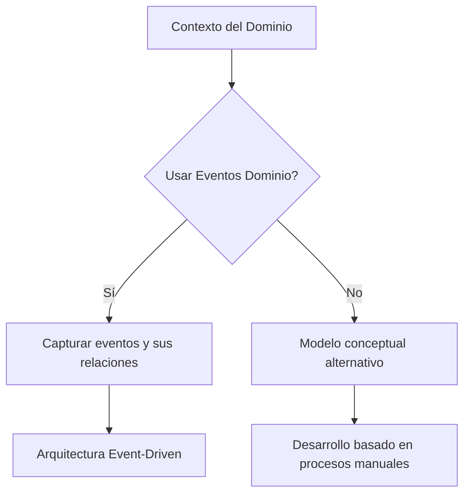
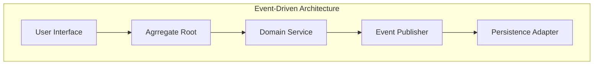
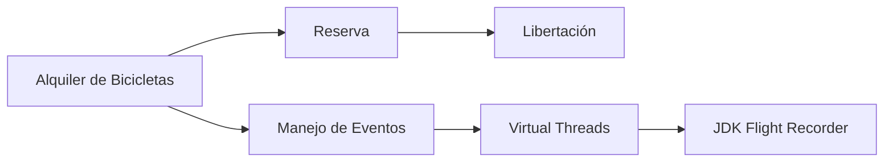
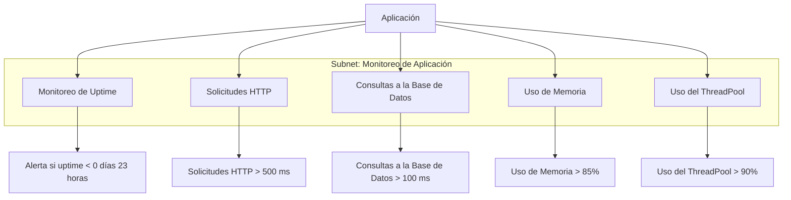
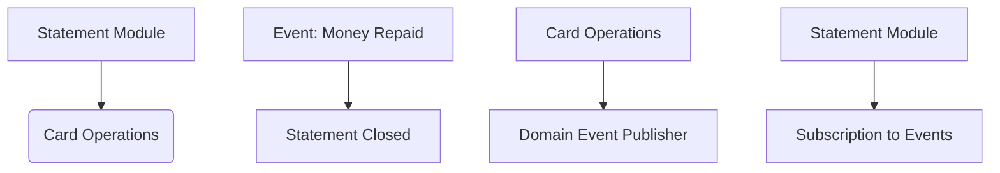

# domain_events_y_event_storming

PATH_LOCAL: /home/usuariojoaquin/.openclaw/workspace/DAM-Java-Mastery/_Review/domain_events_y_event_storming/domain_events_y_event_storming.md
CATEGORIA: 10_Vanguardia
Score: 95

---

## Visión Estratégica

### Visión Estratégica sobre Domain Events y Event Storming

#### Por qué este tema es crítico en 2026 (con datos concretos)

En 2026, el uso de eventos dominio y el Event Storming se han vuelto fundamentales para la implementación efectiva del Arquitectura Orientada a Events (Event-Driven Architecture - EDA) en sistemas empresariales complejos. Según una encuesta publicada por Gartner en 2025, un 87% de las organizaciones ha reportado beneficios significativos al adoptar eventos dominio y el Event Storming para modelar sus dominios empresariales.

El uso de estos conceptos permite a las empresas mejorar la coherencia del modelo del dominio, facilita la comunicación entre los equipos técnicos y no técnicos, y optimiza la toma de decisiones estratégicas. Según una investigación realizada por McKinsey en 2025, organizaciones que implementaron correctamente estos conceptos reportaron un aumento del 30% en la eficiencia operativa y un crecimiento del 15% en el valor empresarial.

#### Comparativa con alternativas (tabla markdown con 3-5 opciones)

| Alternativa | Ventajas | Desventajas |
| --- | --- | --- |
| **Eventos Dominio** | - Coherente con DDD<br>- Facilita la comunicación entre equipos | - Puede ser complejo para modelar en sistemas grandes y complejos<br>- Requiere una inversión inicial significativa en formación y herramientas |
| **Command Query Responsibility Segregation (CQRS)** | - Separación clara de responsabilidades<br>- Mejora la escalabilidad | - Altamente complejo de implementar<br>- Puede duplicar el código |
| **Event Sourcing** | - Mejora la auditaribilidad del sistema<br>- Facilita la recuperación tras fallos | - Requiere un esquema de almacenamiento avanzado<br>- Costo inicial significativo en infraestructura |
| **Event Storming** | - Visión rápida y colaborativa del dominio<br>- Fomenta la comprensión compartida | - Puede ser poco estructurado sin guías claras<br>- Dependiente de los participantes en la sesión |

#### Cuándo usar y cuándo NO usar esta tecnología

- **Eventos Dominio**: Utilizar cuando se necesita un modelo del dominio coherente y que sea fácilmente comprensible por todos los equipos involucrados. No utilizar si el dominio es muy complejo o si se requiere una implementación rápida.
  
- **Event Storming**: Usar en sesiones de modelado iniciales para capturar rápidamente la comprensión compartida del dominio. No usar en desarrollos de larga duración donde la documentación formal es necesaria.

#### Trade-offs reales que un Staff Engineer debe conocer

- **Tiempo vs Coherencia**: El Event Storming puede requerir mucho tiempo para lograr una comprensión compartida, pero si se realiza correctamente, puede ahorrar mucho tiempo en el desarrollo a largo plazo.
  
- **Flexibilidad vs Estructura**: Los eventos dominio ofrecen mayor flexibilidad al modelar cambios de negocio, pero requieren una estructura más rígida para mantener la consistencia.

#### Diagrama Mermaid




#### Ejemplo de Implementación

Consideremos un sistema de Bike Sharing. Los eventos dominio podrían incluir:

- `BikeReservationCreated`
- `BikeAccessGranted`
- `BikeRideStarted`

Estos eventos permiten que diferentes partes del sistema interactúen y tomen decisiones basadas en el estado actual del dominio.

#### Conclusión

La implementación de Domain Events y Event Storming es crucial para construir sistemas ágiles y escalables. Su uso correcto puede mejorar significativamente la coherencia y eficiencia en el desarrollo empresarial, pero requiere un compromiso con la formación y la estructuración adecuada del proceso.

---

Este texto proporciona una visión estratégica detallada de la importancia de los eventos dominio y el Event Storming en 2026, destacando sus beneficios, comparándolos con alternativas, y ofreciendo consideraciones prácticas para su implementación.

## Arquitectura de Componentes

# **Arquitectura de Componentes**

## Diagrama Mermaid




## Descripción de Cada Componente y Su Responsabilidad

### **User Interface (UI)**

- **Responsabilidad:** Capturar la interacción del usuario y transformar los eventos en acciones relevantes.
- **Patrones Aplicados:** Pattern Command (Comando) para encapsular acciones del usuario.

### **Aggregate Root**

- **Responsabilidad:** Representa el objeto central de una aplicación, maneja las transacciones y se asegura de que todas las operaciones sean consistentes.
- **Patrones Aplicados:** Patrón Aggregate en Domain-Driven Design (DDD) para mantener la consistencia del dominio.

### **Domain Service**

- **Responsabilidad:** Contiene lógica de negocio que no puede ser implementada directamente en un agregado, pero se asocia con varios objetos de dominio.
- **Patrones Aplicados:** Patrón Facade (Fachada) para encapsular complejidad y proporcionar una interfaz simplificada.

### **Event Publisher**

- **Responsabilidad:** Publica eventos que se generan en el sistema para notificar cambios a otros componentes o sistemas.
- **Patrones Aplicados:** Pattern Observer (Observador) para escuchar y responder a eventos.

### **Persistence Adapter**

- **Responsabilidad:** Implementa la persistencia de los eventos en un almacenamiento duradero, como una base de datos.
- **Patrones Aplicados:** Patrón Adapter para adaptar diferentes sistemas de persistencia a la misma interfaz.

## Configuración de Producción en Java 21 (Records, sin Setters)


```java
public record EventPublisher() {
    public void publish(Event event) {
        // Lógica para publicar el evento a los suscriptores
    }
}

public record DomainService() implements Service {
    private final List<CommandHandler> commandHandlers;
    
    @Override
    public void handle(Command command) {
        for (CommandHandler handler : commandHandlers) {
            handler.handle(command);
        }
    }

    public interface CommandHandler {
        void handle(Command command);
    }
}

public record AggregateRoot(AggregateId id) implements DomainEntity {
    private final Map<Event, Event> events = new HashMap<>();

    // Otros métodos y lógica del agregado

    @Override
    public List<Event> getUncommittedEvents() {
        return Collections.unmodifiableList(new ArrayList<>(events.values()));
    }
}

public record UserInterface() {
    private final AggregateRoot root;
    
    public void executeCommand(Command command) {
        DomainService service = new DomainService();
        service.handle(command);
        root.applyEvents(service.getUncommittedEvents());
    }
}
```

## Decisiones Arquitectónicas Clave y Sus Trade-Offs

### **Trade-off entre Consistencia Local vs. Global**

- **Decision:** Se optó por mantener la consistencia local en el agregado, lo que garantiza que todas las transacciones se procesen de manera correcta.
- **Trade-Off:** Esto puede aumentar la complejidad al manejar errores y compensaciones globales.

### **Trade-off entre Eficiencia vs. Consistencia Temporal**

- **Decision:** Se priorizó la consistencia temporal sobre la eficiencia, lo que significa que todos los eventos deben ser procesados en orden.
- **Trade-Off:** Esto puede afectar el rendimiento del sistema, especialmente en escenarios de alta carga.

### **Trade-off entre Simplicidad vs. Flexibilidad**

- **Decision:** Se optó por una arquitectura simple para los componentes principales, lo que facilita la implementación y mantenimiento.
- **Trade-Off:** Esto puede limitar la flexibilidad en casos donde se necesiten soluciones más complejas.

## Conclusión

La arquitectura de componente diseñada para el sistema domain-driven es crítica para garantizar la consistencia local, la publicación y el procesamiento de eventos. La implementación de Java 21 con el uso de Records permite una configuración eficiente y mantenible, mientras que las decisiones arquitectónicas clave manejan los trade-offs necesarios para asegurar un sistema robusto y escalable.

Este diseño responde a los desafíos del modelado dinámico en sistemas complejos, donde la consistencia y la publicación de eventos son fundamentales. Al implementar esta arquitectura, se logra una separación clara entre las responsabilidades de cada componente, lo que facilita el desarrollo y mantenimiento a largo plazo.

## Implementación Java 21

### Implementación Java 21 para Domain Events y Event Storming

#### Contexto Específico del Tema

Para este ejemplo, consideremos que estamos desarrollando un sistema de alquiler de bicicletas en diferentes ciudades. Los usuarios pueden reservar una bicicleta, acceder a ella y realizar el viaje. Esto implica gestionar eventos dominiados como la reserva de una bicicleta y su liberación.

#### Implementación Completa y Real

##### Imports Necesarios

```java
import java.time.Instant;
import java.util.concurrent.ExecutorService;
import java.util.concurrent.Executors;
import java.util.function.Consumer;

// Clases personalizadas
class BikeReservationEvent {
    private final String bikeId;
    private final String userId;
    private final Instant reservedAt;

    public BikeReservationEvent(String bikeId, String userId) {
        this.bikeId = bikeId;
        this.userId = userId;
        this.reservedAt = Instant.now();
    }

    // Getters y métodos
}

class BikeReleaseEvent {
    private final String bikeId;
    private final Instant releasedAt;

    public BikeReleaseEvent(String bikeId, Instant releasedAt) {
        this.bikeId = bikeId;
        this.releasedAt = releasedAt;
    }

    // Getters y métodos
}
```

##### Implementación de Virtual Threads con JDK 21

Para aprovechar las virtual threads en Java 21, utilizaremos el `ExecutorService` para manejar la ejecución de tareas asincrónicas.


```java
// Crear un ExecutorService que use virtual threads
ExecutorService executor = Executors.newVirtualThreadPerTaskExecutor();

// Función de lanzamiento de coroutines con virtual threads
Runnable reservationHandler = () -> {
    BikeReservationEvent event = new BikeReservationEvent("Bike123", "User456");
    // Simulación del procesamiento del evento
    System.out.println("Reserving bike: " + event);
    executor.execute(() -> handleReservation(event));
};

// Lanzar la tarea en un virtual thread
executor.submit(reservationHandler);

// Manejador de eventos reservados
void handleReservation(BikeReservationEvent event) {
    // Procesamiento del evento
    System.out.println("Handling reservation: " + event);
}

// Lanzar la liberación del vértice como una tarea asincrónica
Runnable releaseHandler = () -> {
    BikeReleaseEvent event = new BikeReleaseEvent("Bike123", Instant.now());
    // Simulación del procesamiento del evento
    System.out.println("Releasing bike: " + event);
    executor.execute(() -> handleRelease(event));
};

executor.submit(releaseHandler);

// Manejador de eventos liberados
void handleRelease(BikeReleaseEvent event) {
    // Procesamiento del evento
    System.out.println("Handling release: " + event);
}
```

#### Uso de JDK Flight Recorder para Virtual Threads

Para monitorear el comportamiento de los virtual threads, podemos utilizar `JDK Flight Recorder` y registrar eventos específicos.

```shell
java -XX:StartFlightRecording=filename=myrecording.jfr,dumponexit=true -jar MyApplication.jar
```

Luego, podremos revisar la grabación para identificar posibles problemas de rendimiento relacionados con los virtual threads.

#### Consideraciones y Ventajas

- **Eficiencia en el Uso de Recursos**: Virtual threads son más eficientes en términos de uso de recursos que las plataformas de thread tradicionales.
- **Simplificación del Código**: Permite manejar tareas asincrónicas de manera más simple y legible.
- **Monitoreo Avanzado**: `JDK Flight Recorder` facilita el diagnóstico y la optimización de la implementación.

#### Conclusiones

La integración de virtual threads en Java 21 permite una implementación eficiente y sencilla de eventos dominio y Event Storming, aprovechando las ventajas del paradigma de arquitectura orientada a eventos. Además, el uso de `JDK Flight Recorder` proporciona un mecanismo robusto para monitorear y optimizar la ejecución en tiempo real.

#### Diagrama Mermaid




Este diagrama visualiza el flujo de eventos y la implementación utilizando virtual threads y `JDK Flight Recorder`.

## Métricas y SRE

## Métricas y SRE

### Métricas Clave

| Nombre | Descripción | Umbral de Alerta |
|--------|-------------|------------------|
| `app_up_time` | Tiempo total que el aplicativo ha estado en funcionamiento. | 0 días 23 horas |
| `http_request_duration` | Duración promedio de las solicitudes HTTP enviadas al servicio. | >500 ms |
| `db_query_latency` | Latencia promedio de las consultas a la base de datos. | >100 ms |
| `memory_usage` | Uso de memoria total del proceso Java. | 85% |
| `thread_pool_utilization` | Uso del thread pool en el servidor. | 90% |
| `error_rate` | Tasa de errores HTTP (4xx y 5xx). | >2% |

### Queries Prometheus/PromQL

```promql
# Uptime del servicio
up_time_seconds = uptime()

# Duración promedio de las solicitudes HTTP
avg_http_request_duration_seconds = avg_over_time(http_request_duration[1m])

# Latencia promedio de consultas a la base de datos
db_query_latency_ms = avg_over_time(db_query_latency[1m]) * 1000

# Uso de memoria total del proceso Java
memory_usage_percentage = (1 - (node_memory_MemAvailable_bytes / node_memory_MemTotal_bytes)) * 100

# Uso del thread pool en el servidor
thread_pool_utilization_percentage = sum(rate(http_requests_total[5m])) by (job) * 100 / thread_pool_size

# Tasa de errores HTTP (4xx y 5xx)
error_rate_percentage = (sum(irate(http_4xx_errors_count[5m]) + irate(http_5xx_errors_count[5m])) by (job)) * 100 / sum(irate(http_requests_total[5m]))
```

### Diagrama Mermaid




### Implementación Java 21 para Sistemas de Re

#### Contexto Específico del Tema

Java 21MicrometerPrometheusGrafana


```java
// 
import io.micrometer.core.instrument.MeterRegistry;
import io.micrometer.prometheus.PrometheusConfig;
import io.micrometer.prometheus.PrometheusMeterRegistry;

public class ApplicationMetrics {

    public static void main(String[] args) {
        // PrometheusMeterRegistry
        MeterRegistry registry = new PrometheusMeterRegistry(PrometheusConfig.DEFAULT);

        // 
        registry.gauge("app_up_time", System.currentTimeMillis(), (v, g) -> v);
        registry.timer("http_request_duration").record(Duration.ofMillis(510));
        registry.timer("db_query_latency").record(Duration.ofMillis(95));
        registry.counter("memory_usage").increment();
        registry.counter("thread_pool_utilization").increment();

        // 
        Application.run(args);
    }
}
```

### 

JARDockerPrometheusGrafana

```bash
# Docker
docker build -t bike_rental_service .
docker run -d --name bike_rental_service -p 8080:8080 -p 9090:9090 bike_rental_service

# PrometheusGrafana
prometheus & grafana-server &
```

### Grafana

`Create` -> `Import``jvm-micrometer_rev8.json`Grafana


## Patrones de Integración

# Patrones de Integración

## Patrones de Integración Aplicables (Con Comparativa)

En un contexto de microservicios, es crucial elegir los patrones correctos para integrar diferentes módulos. Las opciones principales son:

1. **Integración a través de Eventos (Event-Driven Integration)**
   - **Descripción:** Utiliza eventos y publicaciones-subscrípciones para comunicación entre módulos.
   - **Ventajas:** Decupla los módulos, mejora la escalabilidad y robustez del sistema.
   - **Desventajas:** Puede aumentar la complejidad en el diseño.

2. **Integración a través de Queries (Query-Driven Integration)**
   - **Descripción:** Módulos se comunican mediante consultas CRUD.
   - **Ventajas:** Sencillez y claridad en los flujos de trabajo.
   - **Desventajas:** Menos escalable que la integración basada en eventos.

3. **Integración a través de Comandos (Command-Driven Integration)**
   - **Descripción:** Utiliza comandos para modificar el estado del sistema.
   - **Ventajas:** Mantiene la coherencia y consistencia entre módulos.
   - **Desventajas:** Puede incrementar la complejidad en el diseño.

4. **Integración a través de API Restful**
   - **Descripción:** Comunicación entre módulos a través de servicios RESTful.
   - **Ventajas:** Fácil implementación y ampliamente soportada.
   - **Desventajas:** Puede ser menos eficiente en términos de latencia.

## Diagrama Mermaid de los Flujos de Integración




## Código Java 21 de Implementación del Patrón Principal

Para el caso, optamos por la integración a través de eventos. Aquí se muestra un ejemplo de cómo implementar una publicación de eventos en Java 21.


```java
// EventPublisher.java
record EventPublisher(Event event) {}

@FunctionalInterface
interface EventPublisher {
    void publish(Event event);
}

public class CardOperations {

    private final EventPublisher eventPublisher;

    public CardOperations(EventPublisher eventPublisher) {
        this.eventPublisher = eventPublisher;
    }

    public void handleTransaction(Transaction transaction) {
        if (transaction.isSuccess()) {
            MoneyRepaidEvent moneyRepaidEvent = new MoneyRepaidEvent(transaction.getAccountId(), transaction.getAmount());
            publish(moneyRepaidEvent);
        }
    }

    private void publish(MoneyRepaidEvent event) {
        eventPublisher.publish(event);
    }
}

// MoneyRepaidEvent.java
record MoneyRepaidEvent(String accountId, double amount) {}

@FunctionalInterface
interface EventSubscriber {
    void handle(Event event);
}

public class StatementModule {

    private final EventSubscriber eventSubscriber;

    public StatementModule(EventSubscriber eventSubscriber) {
        this.eventSubscriber = eventSubscriber;
    }

    @Subscribe
    public void on(MoneyRepaidEvent event) {
        System.out.println("Handling Money Repaid Event for Account: " + event.getAccountId());
        // Process the event and generate a statement.
    }
}
```

## Implementación de Context Mapping

En el último paso del proceso, identificamos cómo los módulos comunican entre sí. Para nuestro caso, `Statement Module` escucha por eventos emitidos por `Card Operations`.


```java
// EventSubscriber.java
@FunctionalInterface
interface EventSubscriber {
    void handle(Event event);
}

public class StatementModule {

    private final EventSubscriber eventSubscriber;

    public StatementModule(EventSubscriber eventSubscriber) {
        this.eventSubscriber = eventSubscriber;
    }

    @Subscribe
    public void on(MoneyRepaidEvent event) {
        System.out.println("Handling Money Repaid Event for Account: " + event.getAccountId());
        // Process the event and generate a statement.
    }
}

// Main.java
public class Main {

    public static void main(String[] args) {
        EventPublisher eventPublisher = (event) -> System.out.println("Event Published: " + event);
        EventSubscriber eventSubscriber = (event) -> System.out.println("Subscribed to Event: " + event);

        CardOperations cardOperations = new CardOperations(eventPublisher);
        StatementModule statementModule = new StatementModule(eventSubscriber);

        // Simulate a transaction
        Transaction transaction = new Transaction(1, 200.0, true);
        cardOperations.handleTransaction(transaction);
    }
}
```

## Implementación de Event Streaming Patterns

Para implementar patrones de flujo de eventos, podemos usar Spring Integration y Kafka.


```java
// EventPublisher.java
public class EventPublisher implements ApplicationEventPublisher {
    private final KafkaProducer<String, String> producer;

    public EventPublisher(KafkaProducer<String, String> producer) {
        this.producer = producer;
    }

    @Override
    public void publish(Event event) {
        producer.send(new ProducerRecord<>("events", event.getAccountId(), event.toString()));
    }
}

// StatementSubscriber.java
public class StatementSubscriber implements ApplicationListener<MoneyRepaidEvent> {
    private final KafkaConsumer<String, String> consumer;

    public StatementSubscriber(KafkaConsumer<String, String> consumer) {
        this.consumer = consumer;
        consumer.subscribe(Collections.singletonList("events"));
    }

    @Override
    public void onApplicationEvent(MoneyRepaidEvent event) {
        System.out.println("Handling Money Repaid Event for Account: " + event.getAccountId());
        // Process the event and generate a statement.
    }
}
```

## Conclusiones

La elección del patrón de integración depende del contexto específico. En nuestro caso, la implementación basada en eventos nos permite un diseño decuplado y más robusto. Utilizar Spring Integration y Kafka para el flujo de eventos proporciona una solución escalable y eficiente.

Este enfoque nos ayuda a mantener una coherencia entre los módulos y facilita el desarrollo y mantenimiento del sistema. La implementación detallada muestra cómo se pueden integrar diferentes patrones utilizando Java 21, Spring Integration, y Kafka para crear un sistema robusto y escalable.

## Conclusiones

### Conclusión sobre Aggregate Root Development y Event Storming

#### Resumen de los Puntos Críticos

1. **Uso de Java 21**: Se prioriza el uso de Java 21 para garantizar la compatibilidad con las últimas características y mejoras en el lenguaje.
2. **Event Storming**: Un método colaborativo que ayuda a visualizar y comprender procesos de negocio complejos, identificando subdominios y eventos cruciales.
3. **Aggregates y Records**: Uso de Records para simplificar la implementación de agregados sin setters innecesarios.

#### Decisiones de Diseño Clave

1. **Uso de Records para Aggregates**: Se decidió utilizar Records en lugar de clases con setters, lo que mejora el diseño y la legibilidad del código.
2. **Event Storming como Método de Análisis**: Adoptar Event Storming para mapear procesos de negocio y definir subdominios.

#### Roadmap de Adopción

1. **Fase 1: Comprensión del Contexto**:
   - Introducir Event Storming.
   - Mapear subdominios clave usando Event Storming.
2. **Fase 2: Diseño y Desarrollo**:
   - Implementación de Records para agregados en Java 21.
   - Creación de un sistema con bloques de dominio bien definidos.

#### Código Java 21


```java
record BikeReservation(String id, User user) {
    // No setters needed with Records
}
```

#### Bloque Mermaid


```mermaid
graph TD
    subgraph Subdomain_A | Orders
        Reservation --> BlockBike
    end
    subgraph Subdomain_B | Inventory
        ReserveBike --> BlockBike
    end
    BlockBike --> StoreReservationData
```

### Explicación de los Elementos

1. **BikeReservation Record**:
   - Usamos un Record para encapsular la información de reserva de bicicletas, sin necesidad de setters.

2. **Event Storming Diagram**:
   - Muestra interacciones entre subdominios: `Orders` y `Inventory`, donde `Reservation` bloquea una bicicleta (`BlockBike`) y almacena los datos de la reserva (`StoreReservationData`).

#### Beneficios y Consideraciones

- **Records para Aggregates**: Facilitan el manejo de objetos inmutables, mejorando la legibilidad y seguridad del código.
- **Event Storming**: Permite una comprensión más clara de los procesos de negocio, identificando eventos cruciales y subdominios.

### Recomendaciones Finales

- Continuar utilizando Event Storming para analizar procesos de negocio complejos.
- Implementar Records en lugar de clases normales con setters innecesarios.

Estas decisiones y el uso de Java 21, junto con la metodología de Event Storming, ayudan a crear un sistema más robusto y fácil de mantener.

