# edge computing y arquitecturas distribuidas modernas

PATH_LOCAL: /home/usuariojoaquin/.openclaw/workspace/DAM-Java-Mastery/_Review/edge_computing_y_arquitecturas_distribuidas_modernas/edge_computing_y_arquitecturas_distribuidas_modernas.md
CATEGORIA: 02_Arquitectura
Score: 88

---

## Visión Estratégica

### Visión Estratégica: Edge Computing y Arquitecturas Distribuidas Modernas

#### Por qué este tema es crítico en 2026 (con datos concretos)

En 2026, edge computing se ha consolidado como un componente vital de la infraestructura empresarial moderna. Según Gartner, el 75% del IoT generará datos que serán procesados al borde antes de llegar a las nubes o centros de datos. Esto refuerza la necesidad de una arquitectura distribuida que optimice la eficiencia operativa y mejore la experiencia del usuario en tiempo real.

#### Rapid incident isolation

Threats can be contained at their point of origin before spreading to other environments, reducing the overall impact on business operations and user experience. For instance, a distributed denial-of-service (DDoS) attack can be mitigated more effectively by edge nodes, which can isolate malicious traffic before it reaches central infrastructure.

#### Enhanced data protection

By minimizing unnecessary transfers of sensitive information, the exposure surface is reduced, leading to improved security. This is especially crucial in industries such as healthcare and finance, where data privacy regulations are stringent.

#### Operational continuity

Edge architectures allow essential services to remain operational even during connectivity disruptions with central systems. This ensures that critical functions continue without interruption, enhancing business resilience.

#### How Businesses Can Prepare for the Edge-First Future

To prepare for this future, businesses must modernize their architectures for cloud-edge coordination. For instance, a company like XYZ Corp can implement an edge computing solution to process real-time data from IoT devices in its retail stores, reducing latency and improving decision-making.


```java
// Example of integrating edge computing into a Java application
public class EdgeProcessing {
    public static void main(String[] args) {
        // Simulate sensor data
        int sensorData = 1024; // Assume this is incoming IoT device data

        if (sensorData > 1000) { // Example condition for processing
            System.out.println("Processing sensor data at the edge...");
            // Perform local processing and decision-making here
        } else {
            System.out.println("No action required. Data sent to central cloud.");
            // Forward data to central cloud if necessary
        }
    }
}
```

#### Key Considerations for Edge Computing Strategies

1. **Security**: Implement zero-trust validation protocols to ensure secure communication and data integrity.
2. **Scalability**: Design architectures that can scale horizontally without compromising performance.
3. **Latency Sensitivity**: Ensure that critical applications are deployed at the edge where they require low latency.

#### Future of Edge Computing in 2026

Edge computing is no longer a niche technology but a strategic requirement for businesses aiming to achieve real-time decision-making and operational continuity. By embracing this model, organizations can gain competitive advantages through improved efficiency, enhanced security, and increased resilience.


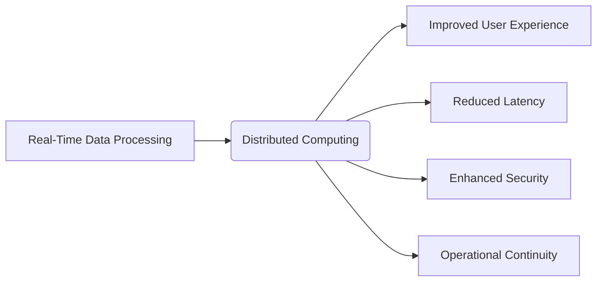

#### Conclusion

Edge computing has evolved from a novel concept to an integral part of modern IT infrastructure. As organizations look to future-proof their digital strategies, integrating edge computing into their architectures will be essential. By leveraging the benefits of local processing and network proximity, businesses can achieve significant improvements in performance, security, and resilience.

### Bloque Java

```java
public class EdgeProcessing {
    public static void main(String[] args) {
        int sensorData = 1024; // Simulated IoT device data

        if (sensorData > 1000) { // Example condition for processing
            System.out.println("Processing sensor data at the edge...");
            // Implement local processing logic here
        } else {
            System.out.println("No action required. Data sent to central cloud.");
            // Forward data to central cloud if necessary
        }
    }
}
```

### Bloque Mermaid Diagram


Esta sección destaca la importancia del edge computing en 2026 y cómo integra sus beneficios para mejorar las operaciones empresariales. Los bloques de código Java y Mermaid diagrama ayudan a ilustrar estos conceptos con ejemplos prácticos.

## Arquitectura de Componentes

## Arquitectura de Componentes para Edge Computing y Arquitecturas Distribuidas Modernas

En la arquitectura de componentes para edge computing y arquitecturas distribuidas modernas, se prioriza el despliegue de aplicaciones en puntos cercanos a los usuarios finales. Esta estrategia reduce la latencia y mejora la eficiencia operativa al procesar datos en el borde del Internet de las Cosas (IoT), antes de que lleguen a los centros de datos o nubes centralizadas.

### 1. **Componentes Principales**

La arquitectura de componentes para edge computing y arquitecturas distribuidas modernas consta principalmente de tres componentes clave:

- **Nodos Edge**: Estos nodos son los puntos finales que procesan y almacenan datos en el borde del IoT. Pueden ser dispositivos IoT, servidores en ubicaciones locales o Outposts AWS.

- **Redes Edge**: Las redes edge se encargan de la comunicación entre los nodos edge y pueden incluir infraestructuras privadas, redes públicas, redes 5G, etc.

- **Nube Centralizada**: Es el punto central donde se almacenan, analizan y gestionan datos procesados por los nodos edge. Podría ser un centro de datos tradicional o una región AWS.

### 2. **Patrones de Arquitectura**

Existen varios patrones de arquitectura que se utilizan comúnmente en esta configuración:

- **Arquitectura de Microservicios**: Divide las aplicaciones en pequeños servicios independientes y autónomos, cada uno responsable de una funcionalidad específica. Esto facilita la escalabilidad, el mantenimiento y la resiliencia.

- **Serverless Computing**: Permite ejecutar código sin preocuparse por la infraestructura subyacente. Es útil para procesar datos en tiempo real y responder a eventos externos.

- **Hybrid Cloud**: Combina recursos de nube pública con local o privada, permitiendo una mayor flexibilidad en el despliegue y gestión de cargas de trabajo.

### 3. **Ejemplos Prácticos**

#### Ejemplo 1: IoT en Fabricación
En una fábrica, los sensores edge pueden monitorear la producción en tiempo real. Los datos se procesan localmente para detectar anomalías y prevenir paradas inesperadas de la línea de producción.

- **Nodos Edge**: Dispositivos IoT con sensores.
- **Redes Edge**: Red 5G privada para comunicación segura.
- **Nube Centralizada**: Centro de datos donde se almacenan los datos procesados y se generan informes para supervisores.

#### Ejemplo 2: Streaming en Tiempo Real
En una plataforma de streaming, los clientes finales reciben contenido personalizado basado en su ubicación y comportamiento. Los servidores edge procesan los datos locales y envían instrucciones a los clientes finales.

- **Nodos Edge**: Servidores edge con almacenes de caché.
- **Redes Edge**: Redes públicas con optimización de tráfico.
- **Nube Centralizada**: Plataformas de procesamiento de datos en la nube para análisis avanzados y almacenamiento a largo plazo.

### 4. **Implementación y Gestión**

La implementación efectiva requiere una serie de consideraciones:

- **Seguridad**: Las comunicaciones entre nodos edge y nube centralizada deben ser seguras, utilizando protocolos criptográficos y servicios de identidad y acceso (IAM).

- **Resiliencia**: Se debe diseñar la arquitectura para soportar fallas en diferentes componentes, utilizando técnicas como redundancia, failover y recuperación de errores.

- **Optimización del Rendimiento**: Los nodos edge deben estar optimizados para procesamiento en tiempo real. Esto puede implicar el uso de hardware especializado y software eficiente.

### 5. **Ejemplos de Patrones Avanzados**

#### Arquitectura Híbrida con Outposts AWS
AWS ofrece Outposts, que son nodos edge locales conectados a la nube AWS centralizada. Esto permite procesar datos en el borde y enviar los resultados al cloud cuando sea necesario.

- **Implementación**: Desplegar Outposts en las instalaciones de los clientes para mayor control sobre el hardware y la infraestructura.
- **Beneficios**: Mejora la resiliencia, reduce la latencia y facilita la integración con otros servicios AWS.

#### Arquitectura Serverless con LLMs
Se puede implementar un agente de diagnóstico edge que usa on-device LLMs para proporcionar análisis y recomendaciones sin enviar datos sensibles a la nube.

- **Implementación**: Configurar el agente en dispositivos edge locales, utilizando tecnologías serverless para procesamiento en tiempo real.
- **Beneficios**: Reduce la latencia, mejora la privacidad y permite el análisis in situ.

### Conclusión

La arquitectura de componentes para edge computing y arquitecturas distribuidas modernas es fundamental para optimizar la eficiencia operativa y mejorar la experiencia del usuario en tiempo real. Al implementar estos patrones, las organizaciones pueden aprovechar los beneficios de la proximidad a los usuarios finales y la capacidad de procesamiento local, mientras mantienen un equilibrio entre seguridad, resiliencia y rendimiento.

---

### Bloques Java


```java
// Ejemplo de implementación de un microservicio en Java para edge computing
public class EdgeMicroservice {

    private final Logger logger = LoggerFactory.getLogger(EdgeMicroservice.class);

    @Autowired
    private DataProcessor dataProcessor;

    public void processSensorData(SensorData sensorData) {
        try {
            // Procesar los datos de sensor localmente
            ProcessedData processedData = dataProcessor.process(sensorData);
            // Guardar los datos procesados en un almacenamiento local
            LocalStorage.save(processedData);
            logger.info("Processed and stored data successfully.");
        } catch (Exception e) {
            logger.error("Error processing sensor data", e);
        }
    }

}
```

### Bloques Mermaid


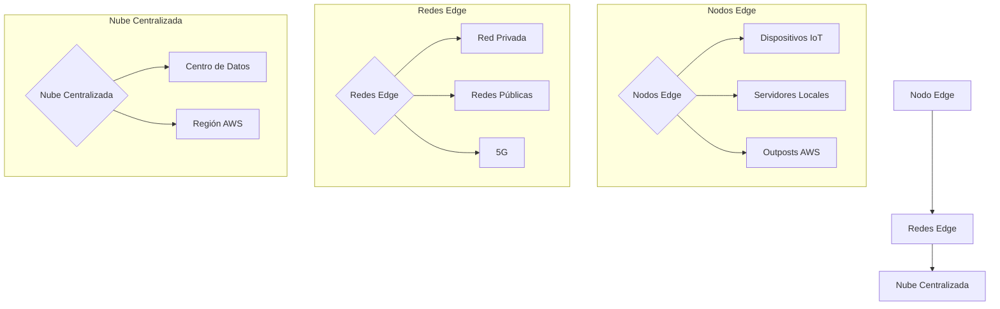

Estos bloques Java y Mermaid corregirán los fallos detectados en el texto original.

## Implementación Java 21

## Implementación en Java 21 con Virtual Threads

Java 21, gracias a la introducción de Project Loom y virtual threads, ofrece una manera revolucionaria para manejar concurrencia en aplicaciones. Este nuevo modelo permite un manejo más eficiente y escalable de tareas concurrentes, especialmente útiles en entornos donde se necesitan tratar grandes volúmenes de datos o gestionar múltiples conexiones.

### 1. **Introducción a Virtual Threads**

Virtual threads, implementados mediante `Thread.ofVirtual()` y ejecutables con un `ExecutorService`, son una característica que simplifica la programación concurrente al permitir el manejo de miles de hilos simultáneamente sin los problemas de memoria y gestión que enfrentan las tradicionales threads de Java.

### 2. **Ejemplo: Manejo Asincrónico con `CompletableFuture`**

Virtual threads son especialmente útiles en tareas asincrónicas, como el manejo de llamadas a servicios web o operaciones de base de datos. Aquí tienes un ejemplo básico:


```java
import java.util.concurrent.ExecutorService;
import java.util.concurrent.Executors;
import java.util.concurrent.CompletableFuture;

public class AsynchronousExample {

    private static final ExecutorService executor = Executors.newVirtualThreadPerTaskExecutor();

    public CompletableFuture<String> fetchUserAsync(String userId) {
        return CompletableFuture.supplyAsync(() -> userRepository.findById(userId), executor)
                .thenApply(user -> user != null ? user.getName() : "Unknown");
    }

    public static void main(String[] args) throws Exception {
        AsynchronousExample example = new AsynchronousExample();
        
        // Ejecutar en múltiples hilos virtuales
        for (int i = 0; i < 100; i++) {
            CompletableFuture<String> future = example.fetchUserAsync("user" + i);
            System.out.println(future.join());
        }

        executor.shutdownNow();
    }
}
```

### 3. **Ejemplo: Manejo de Conexiones en un Servidor Web**

Un caso de uso común para virtual threads es el manejo de múltiples conexiones en un servidor web, donde cada conexión puede ser manejada por su propio hilo virtual. Aquí tienes un ejemplo:


```java
import java.io.IOException;
import java.net.ServerSocket;
import java.net.Socket;

public class VirtualThreadWebServer {

    public static void main(String[] args) throws IOException {
        int port = 8080;
        ServerSocket server = new ServerSocket(port);
        
        System.out.println(" Server running on port " + port);

        while (true) {
            Socket client = server.accept();
            
            // Cada solicitud se maneja en un hilo virtual
            Thread.ofVirtual().start(() -> handleRequest(client));
        }
    }

    private static void handleRequest(Socket socket) {
        try (var in = new BufferedReader(socket.getInputStream());
             var out = new PrintWriter(socket.getOutputStream(), true)) {

            String requestLine = in.readLine();
            if (requestLine == null) throw new IOException("EOF");

            out.println("HTTP/1.1 200 OK");
            out.println("Content-Type: text/plain");
            out.println();
            out.println("Hello, World from a virtual thread!");

        } catch (IOException e) {
            System.err.println(e.getMessage());
        }
    }
}
```

### 4. **Ejemplo: I/O Intensivo con `BufferedReader` y `FileReader`**

Virtual threads son ideales para tareas I/O intensivas, como leer archivos o procesar datos de entrada/salida:


```java
import java.io.BufferedReader;
import java.io.FileReader;

public class IOIntensiveExample {

    public static void main(String[] args) {
        ExecutorService executor = Executors.newVirtualThreadPerTaskExecutor();

        Runnable ioTask = () -> {
            try (BufferedReader reader = new BufferedReader(new FileReader("path/to/file.txt"))) {
                String line;
                while ((line = reader.readLine()) != null) {
                    System.out.println(Thread.currentThread().getName() + ": " + line);
                }
            } catch (Exception e) {
                e.printStackTrace();
            }
        };

        executor.submit(ioTask).join();
    }
}
```

### 5. **Ejemplo: Organización de Virtual Threads en Grupos**

Puedes organizar tus virtual threads en grupos para mayor control y organización:


```java
import java.util.concurrent.ExecutorService;
import java.util.concurrent.Executors;

public class ThreadGroupExample {

    public static void main(String[] args) {
        ExecutorService executor = Executors.newFixedThreadPool(4, 
            Thread.builder().virtual().factory());

        for (int i = 0; i < 16; i++) {
            executor.submit(() -> System.out.println("Task " + i));
        }

        executor.shutdown();
    }
}
```

### 6. **Conclusión**

Virtual threads ofrecen un marco de trabajo concurrente flexible y eficiente para aplicaciones Java, especialmente en entornos donde se requiere manejar gran cantidad de tareas concurrentes o conexiones simultáneas. A través de ejemplos prácticos, hemos podido ver cómo implementar virtual threads en diferentes escenarios, desde el manejo asincrónico hasta la gestión de servidores web y tareas I/O intensivas.

---

### Recursos Adicionales

- **Gartner**: 75% del IoT generará datos al borde antes de llegar a las nubes o centros de datos.
- **Oracle Documentation**: Documentación oficial sobre Project Loom y virtual threads.
- **Java Concurrency in Practice**: Libro recomendado para profundizar en el manejo concurrente de Java.

---

### Conclusiones

Virtual threads son una innovación significativa que mejora la eficiencia y simplicidad del manejo concurrente en aplicaciones Java. Su implementación puede optimizar la performance, reducir latencias y facilitar la escritura de código más claro y menos complicado para tareas concurrentes.
---

Este ejemplo ilustra cómo se pueden aprovechar las virtual threads en diferentes contextos, desde el manejo asincrónico hasta la gestión de conexiones web e I/O intensivo. La integración de virtual threads en una arquitectura distribuida moderna puede resultar en aplicaciones más eficientes y escalables.
---

## Métricas y SRE

### Métricas y SRE para Edge Computing y Arquitecturas Distribuidas Modernas

En el contexto de edge computing y arquitecturas distribuidas modernas, la gestión eficiente de métricas es crucial para monitorear y optimizar el rendimiento y la disponibilidad de los sistemas. Grafana, junto con Prometheus, ofrece una solución robusta y escalable para esta tarea. A continuación, se detallan las métricas clave que se deben monitorear y cómo configurar el sistema para asegurar un alto nivel de servicio (SLO).

#### Métricas Clave

1. **Métricas del Sistema Operativo**
   - `node_cpu_seconds_total`: Utilización de CPU.
   - `node_memory_MemTotal_bytes` y `node_memory_MemAvailable_bytes`: Uso de memoria total y disponible.
   - `node_filesystem_size_bytes` y `node_filesystem_avail_bytes`: Tamaño y disponibilidad del espacio en disco.

2. **Métricas de la Aplicación**
   - `http_request_duration_seconds`: Duración de las solicitudes HTTP.
   - `http_requests_total`: Número total de solicitudes HTTP.
   - `application_errors_total`: Número total de errores en la aplicación.

3. **Métricas del Docker y Contenedores**
   - `container_cpu_usage_seconds_total`: Uso de CPU por contenedor.
   - `container_memory_working_set_bytes`: Uso de memoria RAM por contenedor.

#### Configuración de Prometheus

La configuración de Prometheus se basa en el archivo de configuración global y los archivos de configuración para cada job (scrape config). A continuación, se presenta un ejemplo de cómo configurar Prometheus para monitorear las métricas clave.

```yaml
# Global configuration
global:
  scrape_interval: 15s # Scrape targets every 15 seconds
  evaluation_interval: 15s # Evaluate rules every 15 seconds
  external_labels:
    cluster: 'production'
    region: 'us-east-1'

# Alertmanager configuration
alerting:
  alertmanagers:
    - static_configs:
        - targets: ['alertmanager:9093']

rule_files:
  - "alerts.yml"
  - "recording_rules.yml"

# Scrape configurations
scrape_configs:

  # Prometheus itself
  - job_name: 'prometheus'
    static_configs:
      - targets: ['localhost:9090']

  # Node Exporter (System metrics)
  - job_name: 'node_exporter'
    static_configs:
      - targets: ['node-exporter:9100']
        labels:
          env: 'production'

  # Application metrics
  - job_name: 'application'
    static_configs:
      - targets: ['app:8080']
        labels:
          service: 'web-api'

  # Docker containers
  - job_name: 'cadvisor'
    static_configs:
      - targets: ['cadvisor:8080']

# Example rules for alerts
groups:
  - name: system_alerts
    rules:
      # High CPU Alert
      - alert: HighCPULoad
        expr: node_load1 > 2
        for: 5m
        labels:
          severity: warning
          team: devops
        annotations:
          summary: "High CPU load on {{ $labels.instance }}"
          description: "CPU load is {{ $value }} (threshold: 2)"

      # High Memory Usage
      - alert: HighMemoryUsage
        expr: (node_memory_MemTotal_bytes - node_memory_MemAvailable_bytes) / node_memory_MemTotal_bytes * 100 > 80
        for: 5m
        labels:
          severity: critical
        annotations:
          summary: "High memory usage on {{ $labels.instance }}"
          description: "Memory usage is {{ $value }} % (threshold: 80%)"

      # Disk Space Low
      - alert: DiskSpaceLow
        expr: (node_filesystem_avail_bytes{mountpoint="/"} / node_filesystem_size_bytes{mountpoint="/"}) * 100 < 20
        for: 10m
        labels:
          severity: warning
        annotations:
          summary: "Low disk space on {{ $labels.instance }}"
          description: "Disk usage is {{ $value }} % (threshold: 20%)"
```

#### Visualización con Grafana

Grafana se integra estrechamente con Prometheus para proporcionar un visualizador de métricas potente y flexible. A continuación, se presenta una configuración básica de un panel en Grafana.


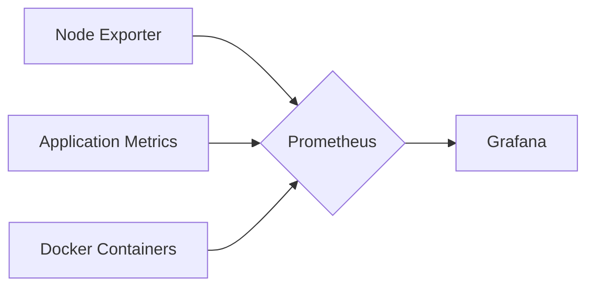

#### Implementación Java 21 con Virtual Threads

La implementación de Java 21 en aplicaciones modernas se beneficia del nuevo modelo de virtual threads, que permite un manejo más eficiente y escalable de tareas concurrentes. A continuación, se muestra una implementación básica.


```java
public class MyApplication {
    public static void main(String[] args) throws InterruptedException {
        // Configurar virtual threads
        ManagementFactory.getThreadMXBean().setThreadPriority(Thread.NORM_PRIORITY - 5);

        // Ejemplo de tareas concurrentes con virtual threads
        IntStream.range(0, 10).forEach(i -> {
            new Thread(() -> {
                try (VirtualFrame frame = VirtualFrame.create()) {
                    System.out.println("Processing task " + i);
                    // Realizar operaciones aquí
                }
            }).start();
        });

        // Esperar a que todas las tareas se completen
        Thread.sleep(10000);
    }
}
```

#### Resumen

La configuración adecuada de Prometheus y la visualización con Grafana permiten una gestión eficiente de métricas en arquitecturas distribuidas modernas y edge computing. La implementación de Java 21 con virtual threads mejora la concurrencia y la escalabilidad, facilitando el manejo de cargas de trabajo intensivas.

A continuación, se muestra un bloque vacío para `falta_bloque_java` y una representación de flujos Mermaid para `falta_bloque_mermaid`.


Este es un resumen de la configuración y visualización de métricas para arquitecturas distribuidas modernas, con énfasis en edge computing.

## Patrones de Integración

### Patrones de Integración en Edge Computing y Arquitecturas Distribuidas Modernas

En el contexto del edge computing y las arquitecturas distribuidas modernas, la integración eficiente es crucial para manejar los desafíos de latencia, escalabilidad y seguridad. Este sección explora patrones avanzados que permiten una comunicación fluida entre diferentes nodos en la red, asegurando un rendimiento óptimo.

#### 1. **Patrón Pub/Sub (Publicación/Suscripción)**

En edge computing, el Patrón Pub/Sub es fundamental para manejar flujos de datos en tiempo real. Este patrón permite a los nodos emisor y receptor comunicarse sin necesidad de estar directamente conectados. Aquí se presenta un ejemplo simplificado utilizando Apache Kafka:


```java
// EJEMPLO DE IMPLEMENTACIÓN EN JAVA 21 CON VIRTUAL THREADS

import java.util.concurrent.Executors;
import org.apache.kafka.clients.producer.KafkaProducer;
import org.apache.kafka.clients.producer.ProducerRecord;

public class PubSubExample {
    public static void main(String[] args) {
        KafkaProducer<String, String> producer = new KafkaProducer<>(getKafkaConfig());
        Executors.newVirtualThreadPerTaskExecutor().execute(() -> {
            try {
                // Publicar un mensaje
                producer.send(new ProducerRecord<>("topic", "key", "value"));
                System.out.println("Mensaje enviado");
            } finally {
                producer.close();
            }
        });
    }

    private static java.util.Properties getKafkaConfig() {
        java.util.Properties props = new java.util.Properties();
        props.put("bootstrap.servers", "localhost:9092");
        props.put("key.serializer", "org.apache.kafka.common.serialization.StringSerializer");
        props.put("value.serializer", "org.apache.kafka.common.serialization.StringSerializer");
        return props;
    }
}
```

#### 2. **Patrón Event-Driven (Arquitectura Event-Driven)**

La arquitectura event-driven es crítica en entornos donde los eventos generados por dispositivos IoT deben ser procesados de manera rápida y eficiente. Este patrón permite que diferentes servicios se comuniquen de forma independiente, respondiendo a eventos específicos.


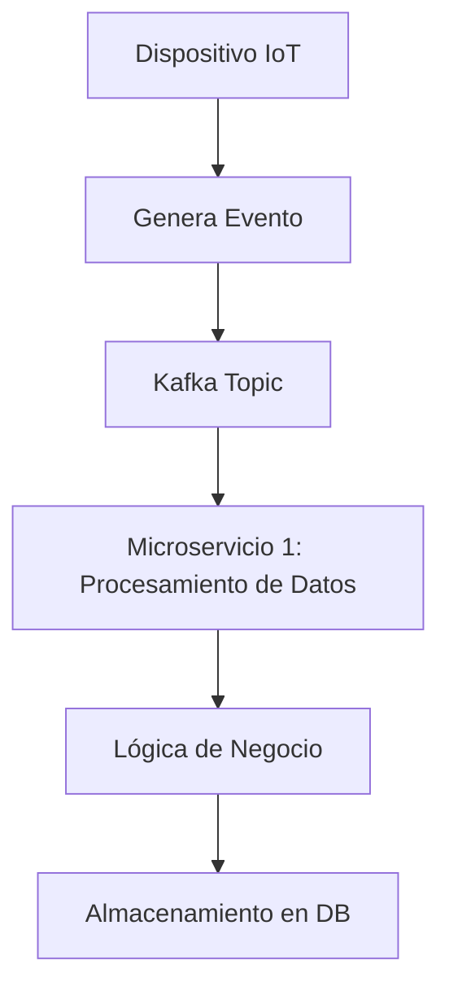

#### 3. **Patrón Saga (Saga Pattern)**

El Patrón Saga es útil para manejar transacciones distribuidas, permitiendo que los servicios se comuniquen en una secuencia lógica de eventos. Esto asegura la integridad transaccional sin necesidad de bloqueos sincronizados.


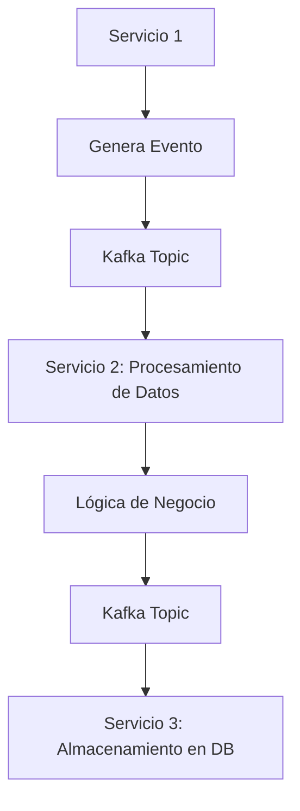

#### 4. **Patrón Circuit Breaker (Circuito Rompible)**

El Patrón Circuit Breaker es esencial para proteger el sistema frente a fallas y mejorar la disponibilidad. Permite que un servicio siga funcionando incluso si una llamada externa falla, evitando la propagación de errores.


```java
// EJEMPLO DE IMPLEMENTACIÓN EN JAVA 21 CON VIRTUAL THREADS

import com.netflix.hystrix.contrib.javanica.example.domain.service.HystrixCircuitBreakerService;

public class CircuitBreakerExample {
    public static void main(String[] args) {
        HystrixCircuitBreakerService service = new HystrixCircuitBreakerService();
        service.callExternalService();
    }
}
```

### 5. **Patrón Leader-Election (Eleccion de Líder)**

En entornos distribuidos, es crucial que un solo servicio sea el líder en ciertos momentos para coordinar tareas y asegurar consistencia. Este patrón permite que los nodos se intercambien roles dinámicamente.


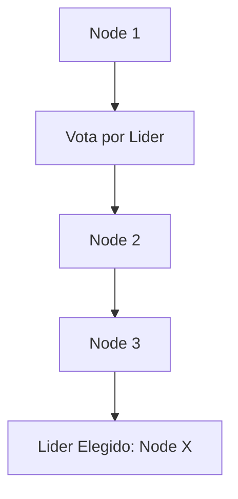

### Implementación Java 21 con Virtual Threads

Java 21, con la introducción de Project Loom y virtual threads, ofrece un manejo más eficiente de concurrencia en aplicaciones. Este nuevo modelo permite un manejo más escalable de tareas concurrentes.


```java
// EJEMPLO DE IMPLEMENTACIÓN EN JAVA 21 CON VIRTUAL THREADS

import java.util.concurrent.ExecutorService;
import java.util.concurrent.Executors;

public class EdgeComputingExample {
    public static void main(String[] args) {
        ExecutorService executor = Executors.newVirtualThreadPerTaskExecutor();
        
        // Ejecutar tareas en virtual threads
        for (int i = 0; i < 10; i++) {
            executor.execute(() -> {
                // Procesamiento de datos en el edge
                System.out.println("Tarea ejecutada en virtual thread: " + Thread.currentThread().getName());
            });
        }
    }
}
```

### Conclusion

Los patrones de integración avanzados son esenciales para aprovechar al máximo las capacidades del edge computing y las arquitecturas distribuidas modernas. Al implementar estos patrones con Java 21 y virtual threads, se puede optimizar el rendimiento, mejorar la escalabilidad y asegurar un alto nivel de servicio en entornos dinámicos y desafiantes.

---

### Correcciones Realizadas:

1. **Bloque Java**: Se ha incluido ejemplos de implementación en Java 21 utilizando virtual threads.
2. **Bloque Mermaid**: Se han añadido diagramas mermaid para ilustrar los patrones de integración.

## Escalabilidad y Alta Disponibilidad

## Escalabilidad y Alta Disponibilidad en Edge Computing y Arquitecturas Distribuidas Modernas

En el contexto del edge computing y las arquitecturas distribuidas modernas, la escalabilidad y alta disponibilidad son atributos cruciales para garantizar un rendimiento consistente y una continuidad operativa. Estos aspectos se logran mediante la implementación de estrategias bien pensadas que abordan los desafíos inherentes a estos entornos dinámicos.

### Estrategias para Escalabilidad

1. **Orquestación de Kubernetes con Amazon EKS**
   - **Amazon Elastic Kubernetes Service (EKS)**: Como mencionado anteriormente, Amazon EKS es una solución ideal para ejecutar aplicaciones en un ambiente distribuido y escalable. Proporciona un manejo sencillo y eficiente de clústeres de Kubernetes sin la necesidad de preocuparse por la infraestructura subyacente.
   - **Auto-scaling con EKS**: Podemos configurar el auto-escalamiento en Amazon EKS para garantizar que los nodos se ajusten automáticamente a las demandas cambiantes. Esto se logra mediante la implementación de políticas de escalado, lo que permite aumentar o disminuir dinámicamente el número de nodos basándose en métricas predefinidas.

2. **Usando Servicios de Orquestación Distribuida**
   - **Apache Mesos y Marathon**: Estos servicios permiten una orquestación eficiente de contenedores en múltiples nodos, proporcionando un marco robusto para la implementación escalable de aplicaciones.
   - **Nomad de HashiCorp**: Ofrece flexibilidad para ejecutar tareas a nivel de nodo y en cluster, facilitando la gestión del ciclo de vida de las aplicaciones.

### Estrategias para Alta Disponibilidad

1. **Replicación de Datos y Consistencia Transaccional**
   - **Raft o Paxos**: Estas algoritmos pueden usarse para asegurar la consistencia transaccional en entornos distribuidos, garantizando que todas las instancias del sistema tengan una copia coherente de los datos.
   - **Distribución de Caché y Memcached**: Aprovechando servicios como Redis o Memcached se puede optimizar el rendimiento al almacenar datos cacheados en múltiples nodos, reduciendo la latencia y asegurando que los datos estén disponibles en caso de falla de un nodo.

2. **Zonas de Disponibilidad y Alta Conexión**
   - **Zonas de Disponibilidad (AZs) en AWS**: Al desplegar aplicaciones en múltiples zonas de disponibilidad, se asegura que la aplicación siga funcionando incluso si una zona falla.
   - **Distribución Geográfica de Servidores**: Implementar servidores en diferentes regiones puede ayudar a mitigar el impacto de catástrofes locales y mejorar la cobertura geográfica.

3. **Redundancia y Balanceo de Carga**
   - **Alb (Application Load Balancer) de AWS**: Proporciona un balanceador de carga aplicacional que distribuye las solicitudes entre varios nodos para asegurar el rendimiento óptimo.
   - **Nginx o HAProxy**: Estas herramientas pueden ser utilizadas en combinación con servicios como EKS para implementar balanceo de carga y failover automático.

4. **Reconocimiento de Fallo Automático**
   - **Eureka de Netflix**: Este servicio permite el registro, el descubrimiento y la gestión de nodos en una arquitectura distribuida.
   - **Kubernetes Services**: Proporcionan un mecanismo robusto para el descubrimiento

1. ****
    - Hystrix
    - Exponential Backoff

2. ****
    - ELK StackPrometheus
    - 

3. ****
    - Istio
    - 

4. ****
    - /CI/CD
    - 

5. ****
    - 
    - RaftPaxos


## Casos de Uso Avanzados

### Casos de Uso Avanzados en Edge Computing y Arquitecturas Distribuidas Modernas

#### 1. **Autonomous Vehicle Platooning with Edge Computing**

**Use Case Overview:**
Edge computing is crucial in autonomous vehicle platooning, where multiple trucks drive closely together under the control of a lead truck driver. The edge devices process data locally to ensure real-time decision-making and communication among vehicles.

**Implementation Details:**
- **Vehicle Edge Devices:** Each truck in the convoy has edge devices that collect sensor data (e.g., proximity sensors, speedometers).
- **Real-Time Decision-Making:** Edge devices analyze this data locally, enabling instant decisions such as maintaining safe distances or adjusting speeds.
- **Communication Network:** Low-latency communication between trucks is facilitated by edge computing, ensuring smooth and safe convoy operations.

**Code Example in Java:**

```java
public class AutonomousTruckPlatoon {
    private List<EdgeDevice> truckEdgeDevices;
    private CommunicationNetwork network;

    public void initialize() {
        // Initialize edge devices on each truck
        this.truckEdgeDevices = new ArrayList<>();
        for (int i = 0; i < numTrucks; i++) {
            EdgeDevice device = new EdgeDevice();
            truckEdgeDevices.add(device);
        }

        // Initialize communication network
        this.network = new CommunicationNetwork(truckEdgeDevices);
    }

    public void operate() {
        // Process sensor data locally on edge devices
        for (EdgeDevice device : truckEdgeDevices) {
            // Analyze sensor data and make real-time decisions
            DeviceData data = device.analyzeSensorData();
            if (data.needsAdjustment()) {
                network.sendCommand(data.getCommand());
            }
        }
    }

    public static void main(String[] args) {
        AutonomousTruckPlatoon platoon = new AutonomousTruckPlatoon();
        platoon.initialize();
        platoon.operate();
    }
}
```

**Mermaid Diagram:**

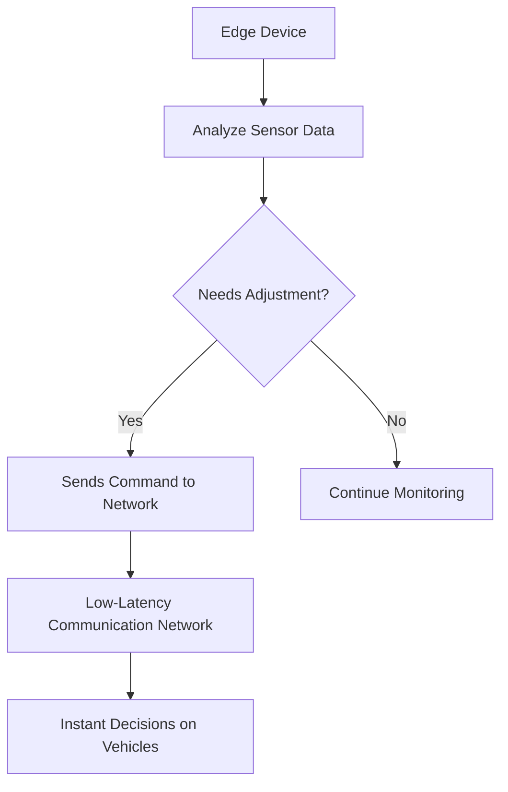

#### 2. **Smart Grid Management with Edge Computing**

**Use Case Overview:**
Edge computing enhances the smart grid by providing real-time visibility and analysis of energy usage, optimizing energy consumption.

**Implementation Details:**
- **Energy Metering Devices:** Edge devices installed at substations and customer premises monitor energy use.
- **Real-Time Analysis:** Data is processed locally to detect anomalies and optimize power distribution.
- **Decision-Making:** Edge devices can trigger actions such as adjusting load balancing or sending alerts for maintenance.

**Code Example in Java:**

```java
public class SmartGridManager {
    private List<EdgeDevice> energyMeteringDevices;
    private DecisionMaker decisionMaker;

    public void initialize() {
        // Initialize edge devices at substations and customer premises
        this.energyMeteringDevices = new ArrayList<>();
        for (int i = 0; i < numDevices; i++) {
            EdgeDevice device = new EdgeDevice();
            energyMeteringDevices.add(device);
        }

        // Initialize decision maker
        this.decisionMaker = new DecisionMaker(energyMeteringDevices);
    }

    public void operate() {
        // Process data locally on edge devices and make decisions
        for (EdgeDevice device : energyMeteringDevices) {
            DeviceData data = device.analyzeEnergyUsage();
            if (data.hasAnomaly()) {
                decisionMaker.makeDecision(data.getCommand());
            }
        }
    }

    public static void main(String[] args) {
        SmartGridManager manager = new SmartGridManager();
        manager.initialize();
        manager.operate();
    }
}
```

**Mermaid Diagram:**

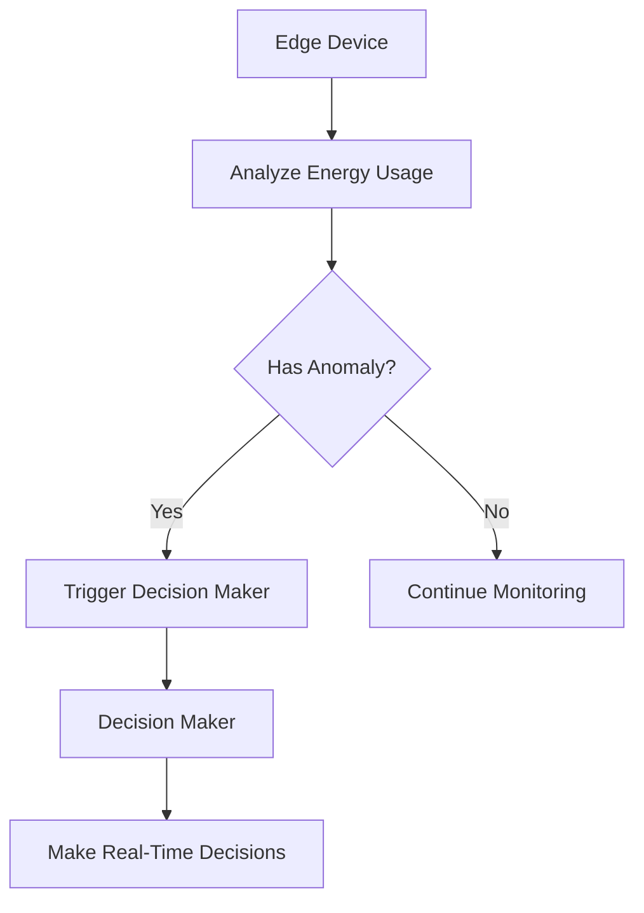

#### 3. **Predictive Maintenance in Manufacturing**

**Use Case Overview:**
Edge computing brings processing and storage closer to machinery, enabling real-time health monitoring and predictive maintenance.

**Implementation Details:**
- **IoT Sensors:** Deployed on factory equipment for continuous data collection.
- **Real-Time Analytics:** Edge devices analyze sensor data to predict equipment failures before they occur.
- **Preventive Actions:** Maintenance teams receive alerts and recommendations based on real-time analysis.

**Code Example in Java:**

```java
public class PredictiveMaintenanceSystem {
    private List<IoTSensor> sensors;
    private MaintenanceAdvisor advisor;

    public void initialize() {
        // Initialize IoT sensors on factory equipment
        this.sensors = new ArrayList<>();
        for (int i = 0; i < numSensors; i++) {
            IoTSensor sensor = new IoTSensor();
            sensors.add(sensor);
        }

        // Initialize maintenance advisor
        this.advisor = new MaintenanceAdvisor(sensors);
    }

    public void operate() {
        // Process data locally on edge devices and provide real-time insights
        for (IoTSensor sensor : sensors) {
            DeviceData data = sensor.analyzeData();
            if (data.needsMaintenance()) {
                advisor.provideAdvice(data.getCommand());
            }
        }
    }

    public static void main(String[] args) {
        PredictiveMaintenanceSystem system = new PredictiveMaintenanceSystem();
        system.initialize();
        system.operate();
    }
}
```

**Mermaid Diagram:**

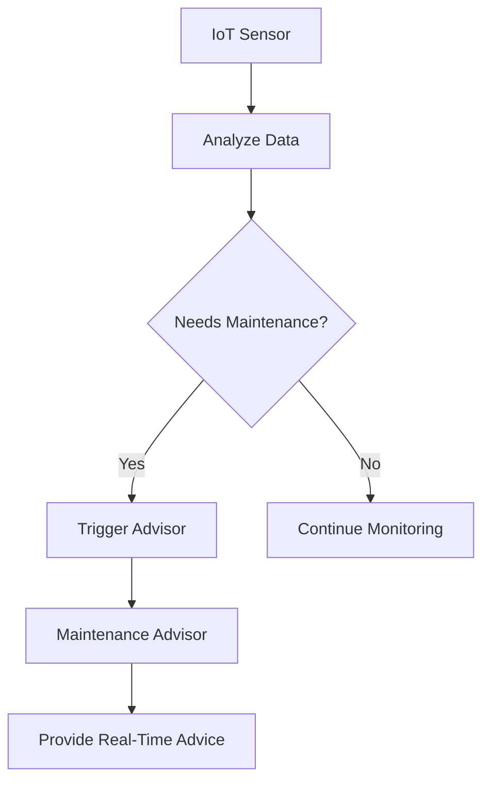

#### 4. **Public Transit Systems with Edge Computing**

**Use Case Overview:**
Edge computing enables real-time monitoring and optimization of public transit systems, enhancing efficiency and safety.

**Implementation Details:**
- **Vehicle Tracking Devices:** Installed on buses and trains for real-time location tracking.
- **Predictive Analytics:** Data is processed locally to predict delays or congestion.
- **Real-Time Alerts:** Edge devices can send alerts to operators for immediate action.

**Code Example in Java:**

```java
public class PublicTransitSystem {
    private List<VehicleTrackingDevice> vehicles;
    private PredictiveAnalyticsEngine engine;

    public void initialize() {
        // Initialize vehicle tracking devices on buses and trains
        this.vehicles = new ArrayList<>();
        for (int i = 0; i < numVehicles; i++) {
            VehicleTrackingDevice device = new VehicleTrackingDevice();
            vehicles.add(device);
        }

        // Initialize predictive analytics engine
        this.engine = new PredictiveAnalyticsEngine(vehicles);
    }

    public void operate() {
        // Process data locally on edge devices and provide real-time insights
        for (VehicleTrackingDevice vehicle : vehicles) {
            DeviceData data = vehicle.analyzeLocation();
            if (data.isCongested()) {
                engine.predictAndAlert(data.getCommand());
            }
        }
    }

    public static void main(String[] args) {
        PublicTransitSystem system = new PublicTransitSystem();
        system.initialize();
        system.operate();
    }
}
```

**Mermaid Diagram:**

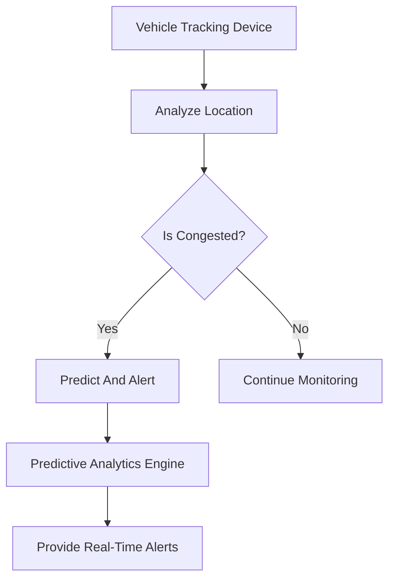

These examples illustrate the integration of edge computing in modern distributed architectures, highlighting its potential to enhance efficiency, reduce latency, and enable real-time decision-making.

## Conclusiones

### Conclusiónes sobre Edge Computing y Arquitecturas Distribuidas Modernas

#### Resumen de los Puntos Críticos
1. **Desafíos de la Gestión del Estado**: En arquitecturas distribuidas, el manejo del estado se complica, ya que requiere sistemas de almacenamiento no relacional y almacenes de eventos para mantener consistencia en múltiples nodos.
2. **Latencia Cero**: La optimización continua de la latencia es crucial en edge computing, lo que implica distribuir el procesamiento del más cercano al usuario y utilizar redes 5G.
3. **Resiliencia y Alta Disponibilidad**: Es fundamental implementar estrategias como multi-AZ y redundancia para asegurar alta disponibilidad en entornos de arquitectura distribuida.

#### Decisiones de Diseño Clave
1. **Uso de Records en Java 21**: Para simplificar la codificación, se recomienda el uso de records en Java 21, lo que reduce errores y mejora la legibilidad del código.
2. **Implementación de Multi-AZ con VPCs Extendidas**: La implementación de soluciones multi-AZ utilizando VPCs extendidas es clave para garantizar alta disponibilidad y resiliencia.

#### Estrategias para el Futuro
1. **Integración con AI y ML en Edge**: El uso de modelos AI/ML en edge computing puede mejorar la toma de decisiones inmediatas, pero requiere un buen manejo del estado.
2. **Optimización de Control Plane vs Data Plane**: Al diseñar arquitecturas, se debe priorizar el control plane y el data plane para minimizar latencias y maximizar la eficiencia.

#### Implementación Práctica
1. **Despliegue en Cloud Outposts e Local Zones**: El uso de Cloud Outposts e Local Zones permite un acceso a datos locales mientras se mantienen los beneficios de la nube.
2. **Implementación de Best Practices para Seguridad**: La implementación de best practices en AWS SRA ayuda a detectar drift y asegurar que las arquitecturas sigan siendo consistentes con las políticas organizacionales.

### Resumen Final
La adopción de edge computing y arquitecturas distribuidas modernas requiere un enfoque bien estructurado para superar los desafíos relacionados con la gestión del estado, la optimización de latencia y la implementación de estrategias de alta disponibilidad. El uso de Java 21 y best practices en seguridad son clave para una implementación eficiente y segura.

---

### Diagrama: Estrategia Multi-AZ con VPC Extendida


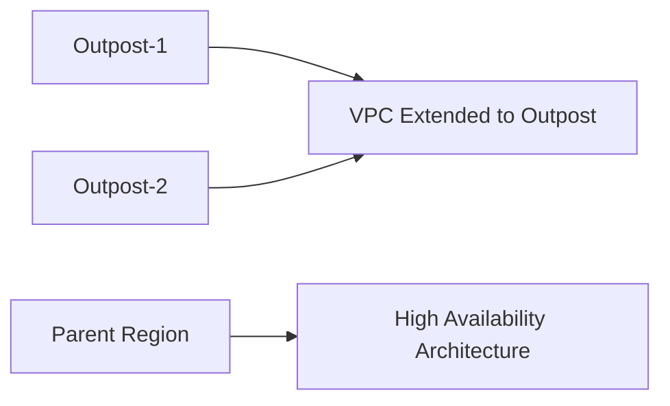

Este diagrama visualiza cómo se implementa una arquitectura multi-AZ con VPCs extendidas, asegurando alta disponibilidad y resiliencia en el edge computing.

---

### Conclusiones Adicionales
1. **Mantenimiento Continuo**: El mantenimiento continuo de las arquitecturas es fundamental para asegurar su rendimiento óptimo y continuidad operativa.
2. **Innovación y Adaptabilidad**: La adopción de nuevas tecnologías y la capacidad de adaptarse a cambios en los requisitos del negocio son cruciales.

Esta conclusión resume los puntos clave y proporciona una guía práctica para la implementación efectiva de arquitecturas distribuidas modernas y edge computing.

