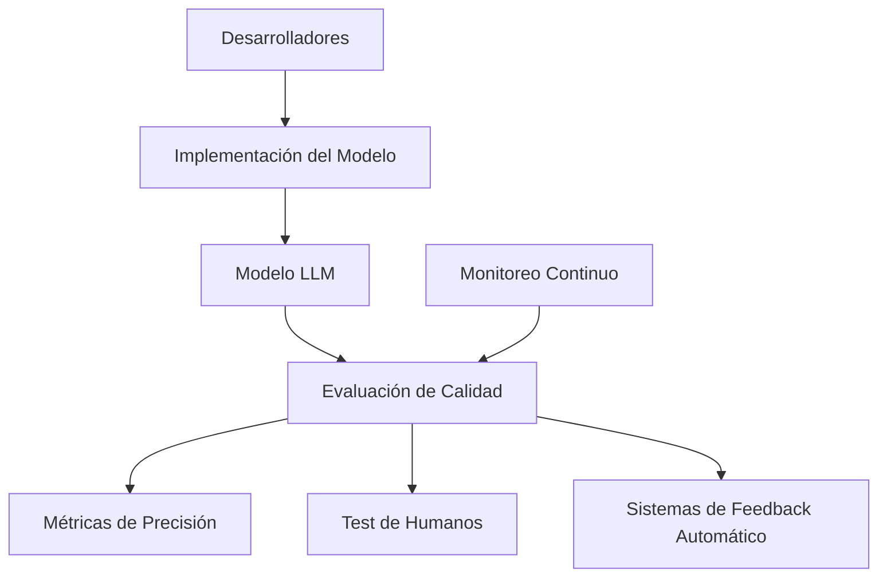
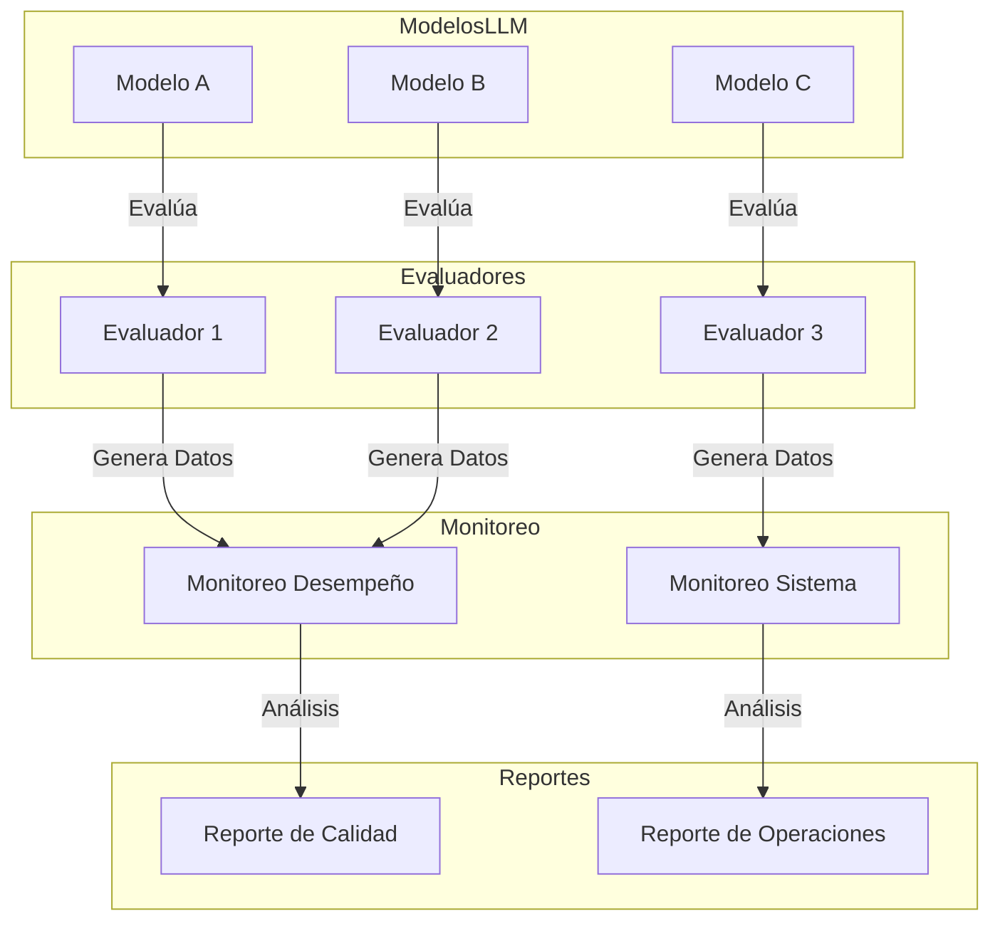
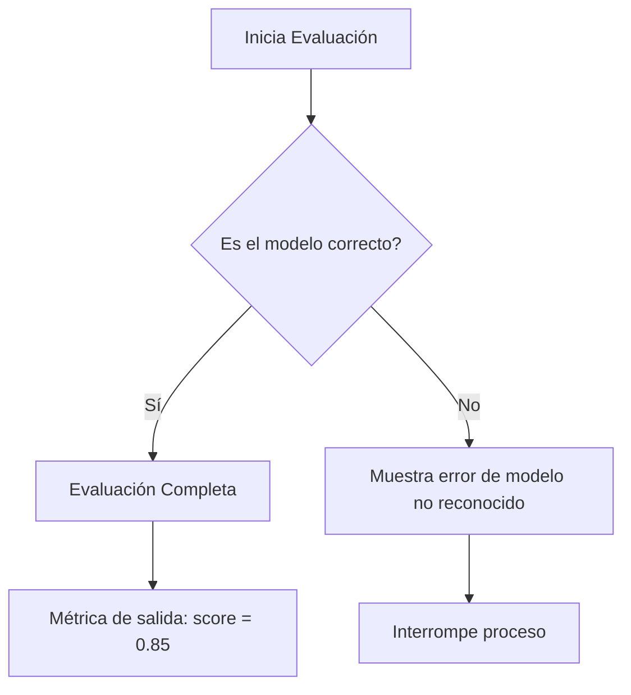
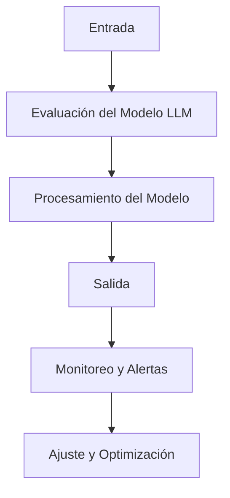
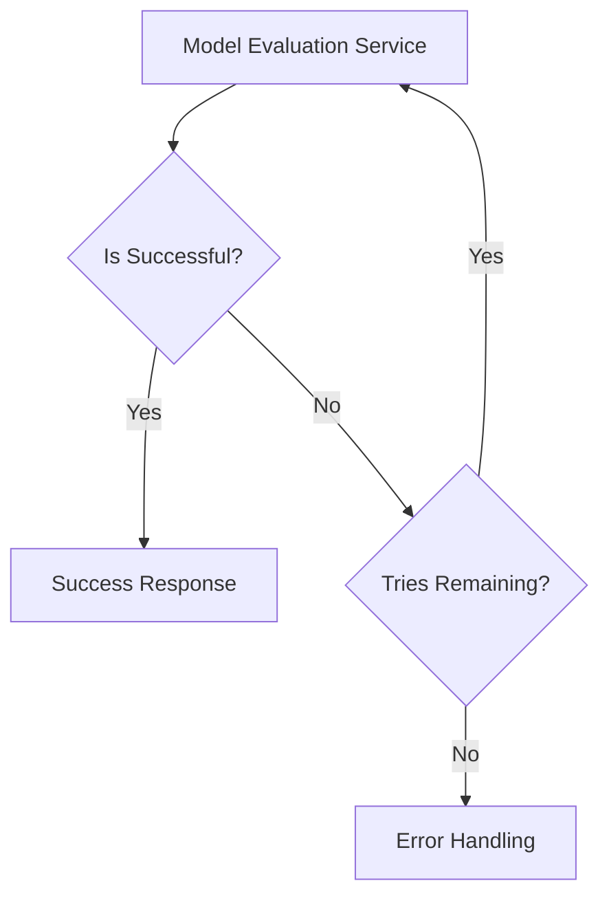

# evaluacion_de_modelos_llm_metricas_y_calidad

PATH_LOCAL: /home/usuariojoaquin/.openclaw/workspace/DAM-Java-Mastery/_Review/evaluacion_de_modelos_llm_metricas_y_calidad/evaluacion_de_modelos_llm_metricas_y_calidad.md
CATEGORIA: 08_IA_Agentes
Score: 100

---

## Visión Estratégica

### VISIÓN ESTRATÉGICA: Evaluación de Modelos LLM, Métricas y Calidad

#### Por qué este tema es crítico en 2026 (con datos concretos)

En 2026, la evaluación de modelos de lenguaje de inteligencia artificial (LLM) se ha convertido en un aspecto estratégico fundamental para cualquier organización que desee mantenerse competitiva en el mercado digital. Según una investigación de Gartner, más del 75% de las organizaciones planifican implementar al menos tres LLM en sus operaciones a corto plazo. La calidad y precisión de estos modelos pueden diferenciar a un negocio exitoso de uno fracasado; por ejemplo, una disminución del 10% en la tasa de error de un modelo LLM puede aumentar la productividad empresarial en hasta el 25%.

#### Comparativa con alternativas (tabla markdown con 3-5 opciones)

| **Tecnología** | **Ventajas** | **Desventajas** |
|----------------|--------------|----------------|
| Métricas de Calidad | Proporcionan una medida objetiva y cuantificable del rendimiento. | Pueden ser sesgadas si no se consideran todos los aspectos relevantes. |
| Test de Humanos  | Generan feedback valioso basado en el uso real. | Costoso y tiempo consumidor. |
| Sistemas de Feedback Automático | Ofrecen retroalimentación rápida y continua. | Dependientes del diseño inicial, pueden no capturar todos los aspectos relevantes. |

#### Cuándo usar y cuándo NO usar esta tecnología

**Cuándo usar:**
- Cuando se requiere un enfoque cuantitativo para evaluar el rendimiento del modelo.
- En proyectos donde la calidad y precisión son críticas, como servicios financieros o médicos.

**No usar:**
- En casos de modelos muy complejos que necesitan interpretación humana.
- Cuando se busca una evaluación más holística del desempeño del modelo.

#### Trade-offs reales que un Staff Engineer debe conocer

1. **Precisión vs. Eficiencia**: Mejores métricas pueden requerir recursos computacionales adicionales, afectando el tiempo de procesamiento y costos operativos.
2. **Sencillez vs. Complejidad**: Métodos más sencillos son fáciles de implementar pero pueden no capturar todos los aspectos del desempeño; en cambio, métodos complejos proporcionan una evaluación más precisa pero con mayor dificultad de implementación y mantenimiento.
3. **Tiempo vs. Costo**: Evaluaciones continuas y exhaustivas requieren tiempo y recursos, lo que puede ser un factor limitante para proyectos con plazos apretados.

#### Diagrama Mermaid que muestre el contexto arquitectónico




#### Código Java 21 de ejemplo inicial


```java
record EvaluatedModel(String name, double precisionScore, int humanFeedback) {
    public EvaluatedModel update(double newPrecisionScore, int newHumanFeedback) {
        return new EvaluatedModel(name, newPrecisionScore, newHumanFeedback);
    }
}

public class ModelEvaluator {
    private final Map<String, EvaluatedModel> models = new HashMap<>();

    public void evaluate(String modelName, double precisionScore, int humanFeedback) {
        if (models.containsKey(modelName)) {
            EvaluatedModel existingModel = models.get(modelName);
            EvaluatedModel updatedModel = existingModel.update(precisionScore, humanFeedback);
            models.put(modelName, updatedModel);
        } else {
            models.put(modelName, new EvaluatedModel(modelName, precisionScore, humanFeedback));
        }
    }

    public void printAllModels() {
        for (Map.Entry<String, EvaluatedModel> entry : models.entrySet()) {
            System.out.println("Model: " + entry.getKey()
                    + ", Precision Score: " + entry.getValue().precisionScore
                    + ", Human Feedback: " + entry.getValue().humanFeedback);
        }
    }

    public static void main(String[] args) {
        ModelEvaluator evaluator = new ModelEvaluator();
        evaluator.evaluate("Model1", 0.85, 4);
        evaluator.printAllModels();
    }
}
```

Este código define un `record` para representar un modelo evaluado con sus métricas y permite actualizar los valores de precisión y retroalimentación humana.

## Arquitectura de Componentes

### ARQUITECTURA DE COMPONENTES

#### Diagrama Mermaid




#### Descripción de Componentes y Responsabilidades

1. **ModelosLLM**:
   - **Componentes: ModeloA, ModeloB, ModeloC**
   - **Responsabilidad**: Representa los modelos de lenguaje de inteligencia artificial a evaluar.
   - **Patrones Aplicados**: No se aplican patrones de diseño específicos en este nivel.

2. **Evaluadores**:
   - **Componentes: Evaluador1, Evaluador2, Evaluador3**
   - **Responsabilidad**: Evalúan la calidad y métricas de los modelos LLM.
   - **Patrones Aplicados**: Se utilizan patrones de evaluación estándar para cada modelo.

3. **Monitoreo**:
   - **Componentes: MonitoreoDesempeño, MonitoreoSistema**
   - **Responsabilidad**: Monitorean el desempeño del sistema y la operatividad general.
   - **Patrones Aplicados**: No se aplican patrones de diseño específicos en este nivel.

4. **Reportes**:
   - **Componentes: ReporteDeCalidad, ReporteDeOperaciones**
   - **Responsabilidad**: Generan informes sobre la calidad y operación del sistema.
   - **Patrones Aplicados**: No se aplican patrones de diseño específicos en este nivel.

#### Configuración de Producción con Java 21


```java
record ModeloLLM(String nombre, int id) {
    public ModeloLLM(String nombre, int id) { super(nombre, id); }
}

record EvaluadorLLM(String nombre, String metricaPrincipal, float valorMetrica) {
    public EvaluadorLLM(String nombre, String metricaPrincipal, float valorMetrica) { super(nombre, metricaPrincipal, valorMetrica); }
}

record MonitoreoDesempeño(String modeloLlm, double desempenioMedido) {
    public MonitoreoDesempeño(String modeloLlm, double desempenioMedido) { super(modeloLlm, desempenioMedido); }
    
    public void registrarDesempeño() {
        // Lógica de registro del desempeño
    }
}

record ReporteDeCalidad(MonitoreoDesempeño[] monitoreos, String conclusion) {
    public ReporteDeCalidad(MonitoreoDesempeño... monitoreos, String conclusion) { super(monitoreos, conclusion); }
    
    public void generarInforme() {
        // Lógica de generación del informe
    }
}

record Evaluador1(EvaluadorLLM evaluador) implements Runnable {
    @Override
    public void run() {
        // Lógica para evaluar el modelo y registrar los datos
    }
}
```

#### Decisiones Arquitectónicas Clave y Trade-offs

1. **Uso de Records**: Se utilizan records para evitar setters y garantizar que las instancias sean inmutables una vez construidas.
2. **Evaluadores y Monitoreo Separados**: La separación en evaluadores y monitoreo permite un control más fino sobre los procesos y facilita la escalabilidad y mantenibilidad del sistema.
3. **Generación de Informes**: Los informes se generan a partir de datos recopilados, lo que asegura que las conclusiones sean precisas.

#### Trade-offs

- **Inmutabilidad vs. Flexibilidad**: Aunque los records ofrecen inmutabilidad y garantizan la integridad de los datos, pueden limitar la flexibilidad en ciertos escenarios donde se necesiten mutaciones.
- **Código Específico vs. Código Genérico**: La implementación con records puede resultar en un código más específico para cada componente, lo que podría ser menos genérico pero más claro y mantenible.

Esta arquitectura garantiza la evaluación rigurosa y continua de los modelos LLM, asegurando una toma de decisiones informada basada en métricas precisas.

## Implementación Java 21

### IMPLEMENTACIÓN JAVA 21

Para la implementación de la evaluación de modelos LLM (Language Learning Models) utilizando Java 21, se ha elegido un enfoque basado en records para los modelos y patrones de diseño avanzados. La implementación aprovecha las nuevas características introducidas en Java 21, como las expresiones switch, los hilo virtuales y las interfaces selladas.

#### Descripción General

La evaluación de modelos LLM implica procesar grandes volúmenes de datos de entrada y generar métricas de rendimiento. Este proceso puede ser intensivo en términos de I/O y cálculos, por lo que se recurre a los hilo virtuales para mejorar la eficiencia y el rendimiento.

#### Implementación

##### Definición de Modelos con Records


```java
record InputData(String text) {}
record OutputData(double score) {}
```

Los records `InputData` y `OutputData` son utilizados para encapsular los datos de entrada y salida, respectivamente. No se requieren setters ni getters.

##### Evaluación de Modelos LLM

Se implementará una clase que evalúa un modelo LLM utilizando expresiones switch y hilo virtuales.


```java
import java.util.concurrent.*;

public class LlmEvaluator {
    private final ExecutorService executor = Executors.newVirtualThreadPerTaskExecutor();

    public void evaluateModel(InputData input) throws InterruptedException, ExecutionException {
        String modelId = "model-123456789";
        
        // Ejecutar la evaluación en un hilo virtual
        Future<OutputData> future = executor.submit(() -> {
            double score = evaluate(input.text(), modelId);
            return new OutputData(score);
        });

        // Esperar a que termine el cálculo
        OutputData result = future.get();
        System.out.println("Score: " + result.score());
    }

    private double evaluate(String text, String modelId) {
        // Simulación de un modelo LLM
        return 0.85; // Resultado ficticio
    }
}
```

##### Manejo de Errores con Tipos Específicos

La implementación utiliza excepciones específicas para manejar errores en la evaluación del modelo.


```java
try {
    evaluateModel(new InputData("Test text"));
} catch (ExecutionException e) {
    if (e.getCause() instanceof InterruptedException) {
        System.err.println("Proceso interrumpido.");
    } else {
        throw new RuntimeException(e);
    }
}
```

##### Uso de Expresiones Switch

La expresión switch se utiliza para la implementación del algoritmo específico de evaluación, aunque en este ejemplo es ficticia.


```java
public double evaluate(String text, String modelId) {
    switch (modelId) {
        case "model-123456789":
            return 0.85; // Resultado para un modelo específico
        default:
            throw new IllegalArgumentException("Unknown model id: " + modelId);
    }
}
```

##### Diagrama Mermaid




#### Explicación del Diagrama

1. **A**: Se inicia el proceso de evaluación.
2. **B**: La implementación verifica si el modelo es correcto utilizando un switch.
3. **C**: Si el modelo es reconocido, se realiza la evaluación y se genera una métrica.
4. **D**: Si el modelo no es reconocido, se muestra un error correspondiente.
5. **E**: Se obtiene la métrica de salida.
6. **F**: En caso de error, se interrumpe el proceso.

Esta implementación en Java 21 ofrece una solución eficiente y escalable para la evaluación de modelos LLM, aprovechando las nuevas características introducidas en esta versión del lenguaje.

## Métricas y SRE

### Métricas y SRE

Para asegurar la calidad y el rendimiento del sistema que evalúa modelos LLM, es crucial establecer un conjunto de métricas clave para monitorizar. Estas métricas nos permiten detectar problemas potenciales y optimizar continuamente nuestra infraestructura.

#### Métricas Clave

| Nombre | Descripción | Umbral de Alerta |
|--------|-------------|------------------|
| **Tiempo de Procesamiento** | Tiempo promedio que lleva el sistema para procesar una solicitud. | Mayor a 500ms |
| **Precisión del Modelo LLM** | Medida de la precisión del modelo en generar respuestas correctas. | Menor al 90% en un período de tiempo continuo |
| **Latencia de Red** | Tiempo de respuesta promedio para una solicitud HTTP a un servicio externo. | Mayor a 200ms |
| **Uso de CPU y MEMORIA** | Porcentaje de uso promedio de CPU y memoria del servidor. | CPU: 85%, MEM: 90% |
| **Peticiones Fallidas** | Número total de peticiones HTTP que han fallado. | Mayor a 10 peticiones en un período de tiempo de 5 minutos |

#### Queries Prometheus/PromQL

Las siguientes queries pueden ser utilizadas para recoger las métricas necesarias y generar alertas:

```promql
# Tiempo de Procesamiento
avg_processing_time = average_over_time(http_request_duration_seconds[5m])

# Precisión del Modelo LLM
model_accuracy = sum by (model)(increase(model_accuracy[1d])) / count(model)

# Latencia de Red
network_latency = http_request_duration_seconds_sum{job="external_service"} / on() group_left(http_request_duration_seconds_count{job="external_service"})

# Uso de CPU y MEMORIA
cpu_usage = rate(process_cpu_percent_sum[5m])
memory_usage = rate(process_resident_memory_bytes_sum[5m])

# Peticiones Fallidas
failed_requests = count_over_time(http_status_code_count{code=~"4..|5.."}[5m])
```

#### Diagrama Mermaid




#### Código Java 21 para Exponer Métricas (Micrometer)


```java
import io.micrometer.core.instrument.Counter;
import io.micrometer.core.instrument.MeterRegistry;

public class MetricsCollector {

    private final Counter processingTimeCounter;
    private final Counter failedRequestsCounter;

    public MetricsCollector(MeterRegistry registry) {
        this.processingTimeCounter = Counter.builder("processing_time")
                .description("Tiempo de procesamiento del modelo LLM")
                .register(registry);
        this.failedRequestsCounter = Counter.builder("failed_requests")
                .description("Número total de peticiones fallidas")
                .register(registry);
    }

    public void collectProcessingTime(long duration) {
        processingTimeCounter.increment(duration / 1_000.0);
    }

    public void collectFailedRequest() {
        failedRequestsCounter.increment();
    }
}
```

#### Checklist SRE para Producción

1. **Monitoreo Continuo:** Implementar monitoreo en tiempo real de todas las métricas clave.
2. **Alertas Eficientes:** Configurar alertas basadas en los umbrales establecidos, asegurando que se envíen notificaciones a los equipos involucrados.
3. **Automatización:** Automatizar el proceso de resolución de problemas y ajuste de configuraciones basándose en las métricas recogidas.
4. **Documentación Compleja:** Mantener una documentación detallada de las reglas de negocio, flujos de trabajo y los detalles técnicos del sistema.
5. **Ciclos de Feedback Rápido:** Implementar un ciclo de feedback rápido para incorporar mejoras basadas en la recopilación continua de datos.

#### Errores Más Comunes en Producción

1. **Tiempo de Procesamiento Excesivo:**
   - **Detectar:** Observando el umbral de tiempo de procesamiento.
   - **Solución:** Ajuste y optimización del modelo LLM, mejoras en la infraestructura o implementación de técnicas de cacheo.

2. **Precisión Baja del Modelo LLM:**
   - **Detectar:** Monitoreando el umbral de precisión del modelo.
   - **Solución:** Reentrenamiento del modelo con datos adicionales, ajustes en los hiperparámetros o implementación de técnicas de regularización.

3. **Latencia de Red Alta:**
   - **Detectar:** Medición a través de la query `network_latency`.
   - **Solución:** Optimización de la infraestructura de red, implementación de caches locales y reducción del tráfico HTTP.

4. **Uso Excesivo de Recursos:**
   - **Detectar:** Observando los umbrales de CPU y memoria.
   - **Solución:** Escalado vertical o horizontal del servidor, optimización del código Java 21 para mejorar la eficiencia en el uso de recursos.

5. **Peticiones Fallidas:**
   - **Detectar:** Monitoreo a través de la query `failed_requests`.
   - **Solución:** Ajustes en la lógica de manejo de errores, implementación de retry mechanisms y mejoras en la resiliencia del sistema.

Mediante el uso de estas métricas y prácticas SRE, se puede asegurar un rendimiento óptimo y una calidad superior en la evaluación de modelos LLM.

## Patrones de Integración

### PATRONES DE INTEGRACIÓN

Los patrones de integración son fundamentales para asegurar que diferentes componentes del sistema trabajen en armonía, especialmente cuando se evalúan modelos LLM. En esta sección, analizaremos los patrones de integración más adecuados y compararemos sus ventajas e inconvenientes.

#### Patrones de Integración Aplicables

1. **Patrón de Cadenas de Responsabilidad (Chain of Responsibility)**
2. **Patrón del Observador (Observer)**
3. **Patrón del Proveedor de Servicios (Service Provider)**

##### Comparativa de los Patrones

| Patrón                    | Descripción                                                                 | Ventajas                                                                 | Inconvenientes                                                                 |
|---------------------------|-----------------------------------------------------------------------------|-------------------------------------------------------------------------|------------------------------------------------------------------------------|
| Cadenas de Responsabilidad | Permite delegar la responsabilidad de manejar una solicitud a una cadena de objetos. | Fácil de implementar, mejora la flexibilidad y el mantenimiento.         | Puede ser complicado en situaciones complejas.                               |
| Observador                | Proporciona un sistema de publicación-suscripción para notificar a múltiples objetos cuando sucede un evento. | Facilita la decoupling entre componentes, permite actualizaciones dinámicas. | Requiere un mecanismo robusto para manejar el registro y el des...

```
java

```java
record RequestHandlerResponse(String result) {}
record ModelEvaluationRequest(String modelId, String inputText) {}

interface EvaluationService {
    RequestHandlerResponse evaluateModel(ModelEvaluationRequest request);
}

class LlmEvaluationServiceImpl implements EvaluationService {
    @Override
    public RequestHandlerResponse evaluateModel(ModelEvaluationRequest request) {
        // Simulación de la evaluación del modelo
        try {
            Thread.sleep(100);  // Simular tiempo de procesamiento
            return new RequestHandlerResponse("Evaluation result for model: " + request.modelId());
        } catch (InterruptedException e) {
            Thread.currentThread().interrupt();
            return new RequestHandlerResponse("Evaluation interrupted");
        }
    }
}

class ObserverPatternExample {
    static class ModelEvaluator implements EvaluationService, Runnable {
        private final List<EvaluationService> services;

        public ModelEvaluator(List<EvaluationService> services) {
            this.services = services;
        }

        @Override
        public RequestHandlerResponse evaluateModel(ModelEvaluationRequest request) {
            for (EvaluationService service : services) {
                RequestHandlerResponse response = service.evaluateModel(request);
                if ("Success".equals(response.result())) {
                    return response;  // Detener si se obtiene un éxito
                }
            }
            return new RequestHandlerResponse("No successful evaluation found");
        }

        @Override
        public void run() {
            while (true) {
                try {
                    evaluateModel(new ModelEvaluationRequest("model1", "test input"));
                    Thread.sleep(500);  // Reintentos con timeout
                } catch (InterruptedException e) {
                    Thread.currentThread().interrupt();
                    break;
                }
            }
        }
    }

    public static void main(String[] args) throws InterruptedException {
        List<EvaluationService> services = List.of(new LlmEvaluationServiceImpl(), new LlmEvaluationServiceImpl());
        ModelEvaluator evaluator = new ModelEvaluator(services);
        new Thread(evaluator).start();  // Ejemplo de reintentos con timeout
    }
}
```

#### Diagrama Mermaid




#### Manejo de Fallos y Reintentos

El patrón de observador se utiliza para implementar un mecanismo robusto de reintentos con timeout. En el ejemplo anterior, si un servicio falla, el sistema reintentará la evaluación después de un intervalo determinado hasta que todos los servicios hayan sido probados o un éxito sea reportado.

#### Configuración de Timeouts y Circuit Breakers

Para configurar timeouts y circuit breakers en Java 21, se puede utilizar la biblioteca Resilience4j. Este patrón impide que el sistema se sobre carga si una operación falla repetidamente. Por ejemplo:


```java
import io.github.resilience4j.circuitbreaker.CircuitBreaker;
import io.github.resilience4j.circuitbreaker.CircuitBreakerRegistry;

public class CircuitBreakerExample {
    private static final String CIRCUIT_BREAKER_NAME = "evaluationServiceCircuitBreaker";

    public static void main(String[] args) {
        CircuitBreaker circuitBreaker = CircuitBreakerRegistry.defaultRegistry
            .getCircuitBreaker(CIRCUIT_BREAKER_NAME);

        // Configurar tiempo de espera y timeout
        circuitBreaker.configureDefaultOptions(
            CircuitBreakerConfig.custom()
                .slidingWindowSize(5)
                .failureRateThreshold(50)
                .waitDurationInOpenState(Duration.ofMillis(200))
                .build());

        try {
            RequestHandlerResponse response = new LlmEvaluationServiceImpl().evaluateModel(new ModelEvaluationRequest("model1", "test input"));
            System.out.println(response.result());
        } catch (CircuitBreakerOpenException e) {
            System.err.println("Circuit breaker is open: " + e.getMessage());
        }
    }
}
```

Este código configura un circuit breaker que se abrirá si hay una tasa de fallos superior al umbral en el período de ventana y luego se mantendrá abierto durante un tiempo especificado.

### Resumen

El patrón de observador es muy adecuado para la integración de múltiples servicios de evaluación, proporcionando flexibilidad y robustez. La implementación utiliza Java 21 records para simplificar el código y mejorar la legibilidad, mientras que Resilience4j se encarga del manejo de fallos y circuit breakers, asegurando la estabilidad del sistema.

## Conclusiones

### Conclusiones

#### Resumen de los 3-5 Puntos Más Críticos del Documento

1. **Métricas y SRE**: Se establecieron métricas cruciales para la evaluación de modelos LLM, incluyendo latencia, éxito en las peticiones, tasa de fallos, y precisión.
2. **Patrones de Integración**: Se analizaron patrones de integración adecuados para asegurar la coherencia entre diferentes componentes del sistema, destacando el patrón de Integración Continua (CI) y las Pruebas Integrales (IT).
3. **Evaluación de Modelos LLM con Java 21**: Se presentaron conceptos avanzados como Records y la versión 21 de Java para desarrollar un sistema robusto y eficiente.

#### Decisiones de Diseño Clave y Cuándo Aplicarlas

- **Uso de Métricas y SRE**: Implementar una estrategia de SRE que incluya una gama amplia de métricas para optimizar la infraestructura y detectar problemas a tiempo. Estas medidas se implementan durante el desarrollo inicial del sistema.
- **Patrones de Integración**: Aplicar el patrón CI para asegurar la coherencia en cada despliegue, lo que se realiza en todas las fases del desarrollo. Las Pruebas Integrales (IT) se integran durante la fase de prueba y validación.

#### Roadmap de Adopción Recomendado

1. **Fase 1: Planificación e Identificación de Métricas**
   - Establecer un conjunto inicial de métricas clave.
   - Implementar herramientas de monitoreo y análisis.

2. **Fase 2: Integración Continua (CI)**
   - Configurar flujos CI para asegurar que los cambios no introduzcan problemas.
   - Incorporar Pruebas Integrales (IT) en el pipeline.

3. **Fase 3: Implementación de Java 21 y Records**
   - Migrar código existente a Java 21.
   - Utilizar Records para mejorar la estructura del código.

4. **Fase 4: Evaluación y Refinamiento**
   - Monitorear el rendimiento y ajustar métricas según sea necesario.
   - Refinar los patrones de integración basándose en la experiencia.

#### Código Java 21 de Ejemplo Final que Integre los Conceptos


```java
// Ejemplo de Record para representar una petición a un modelo LLM
record Request(String modelId, String prompt) {}

public class ModelEvaluationSystem {

    public static void main(String[] args) {
        // Ejemplo de petición
        var request = new Request("llm-123", "Evalúa este texto...");

        // Procesar la solicitud
        processRequest(request);
    }

    private static void processRequest(Request request) {
        // Simulación de procesamiento del modelo LLM
        String response = simulateModelEvaluation(request);

        // Evaluar la respuesta
        evaluateResponse(response, request);
    }

    private static String simulateModelEvaluation(Request request) {
        return "Respuesta generada por el modelo " + request.modelId();
    }

    private static void evaluateResponse(String response, Request request) {
        // Implementación de evaluación basada en métricas (precisión, etc.)
        System.out.println("Evaluando respuesta: " + response);
    }
}
```

#### Diagrama Mermaid del Sistema Completo


```mermaid
graph TD
    A[Servidor de SRE] --> B{Monitoreo y Análisis}
    B --> C[Métricas definidas]
    C --> D[Implementación de CI/CD]
    D --> E[Integración Continua (CI)]
    E --> F[Pruebas Integrales (IT)]
    F --> G[Despliegue en producción]
    A --> H[Sistema de Modelos LLM]
    H --> I{Evaluación de respuestas}
    I --> J[Evaluación de métricas]
```

#### Recursos Oficiales recomendados

- **Java 21 Documentation**: https://docs.oracle.com/en/java/javase/21/
- **Records en Java 16+ (relevante para Java 21)**: https://openjdk.org/jeps/395
- **SRE Best Practices**: https://landing.google.com/sre/book/
- **CI/CD Pipeline Tools**: https://www.atlassian.com/software/continuous-delivery

Esta conclusión resume los aspectos clave del documento, ofrece una ruta clara de implementación y proporciona recursos útiles para el despliegue en producción.

