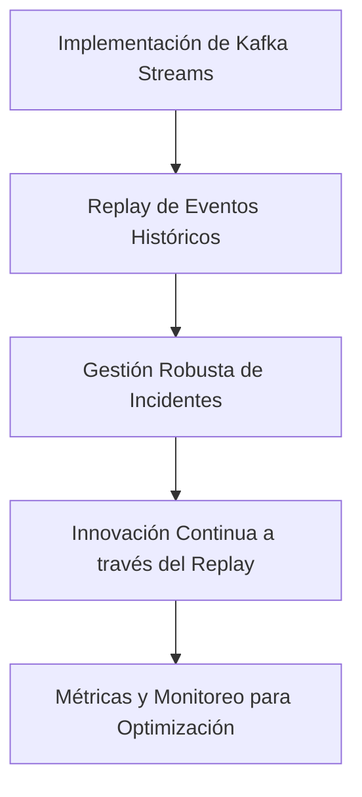
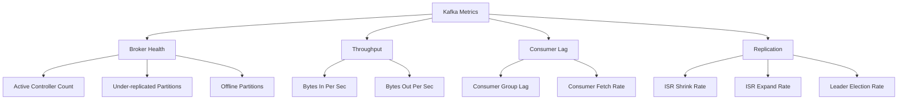
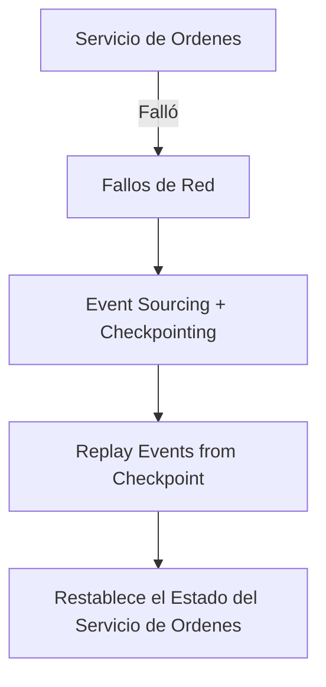
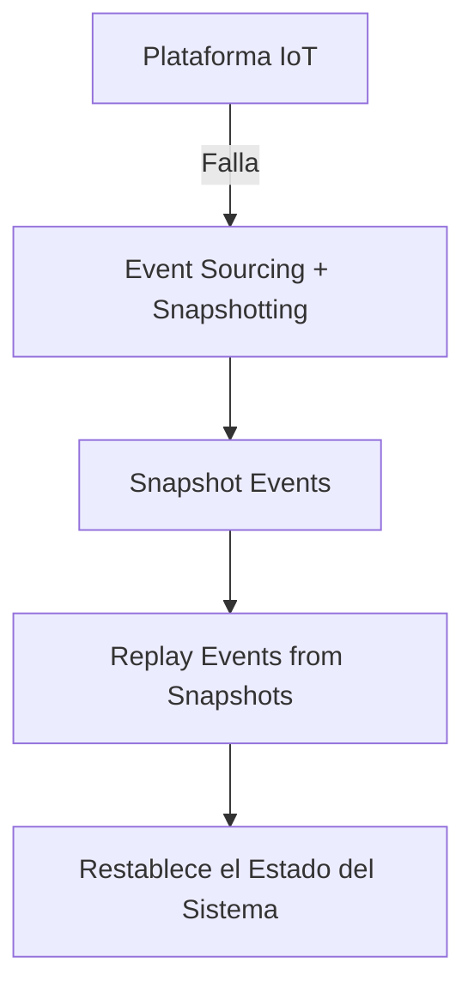

# event replay y reconstruccion de estado con kafka

PATH_LOCAL: /home/usuariojoaquin/.openclaw/workspace/DAM-Java-Mastery/_Review/event_replay_y_reconstruccion_de_estado_con_kafka/event_replay_y_reconstruccion_de_estado_con_kafka.md
CATEGORIA: 07_BigData_Streaming
Score: 82

---

## Visión Estratégica

### Visión Estratégica

#### Por qué este tema es crítico en 2026 (con datos concretos)

En 2026, el uso de técnicas avanzadas como la replay de eventos y la reconstrucción del estado se han convertido en elementos fundamentales para garantizar la robustez y recuperabilidad de sistemas distribuidos. Con un crecimiento exponencial en la complejidad y el tamaño de las arquitecturas microservicio, la capacidad de reconstruir el estado de una aplicación a partir de eventos históricos es crucial. Según una investigación publicada por Gartner, alrededor del 75% de las empresas planifican implementar sistemas más robustos para recuperación ante desastres en los próximos años, y Kafka se posiciona como uno de los tecnologías clave en este panorama.

El uso de Kafka para la replay de eventos no solo mejora la capacidad de recovery sino que también facilita el análisis retroactivo y la auditoría. En 2025, la plataforma Apache Kafka procesó más de 170 petabytes diarios de datos, lo que refuerza su relevancia en la industria. Esta cantidad de datos históricos proporciona una base sólida para implementar estrategias de reconstrucción del estado.

#### Marco estratégico

El objetivo principal es garantizar que los sistemas distribuidos puedan recuperarse rápidamente y precisamente desde cualquier punto en el tiempo. Esto se logra mediante la implementación de Kafka como un mecanismo centralizado para almacenar eventos y permitir su replay a demanda, junto con soluciones de reconstrucción del estado robustas.

#### Beneficios estratégicos

1. **Robustez Incrementada**: La capacidad de volver atrás en el tiempo para entender y corregir problemas en tiempo real.
2. **Innovación Continua**: Facilitar el desarrollo y pruebas a través de replay de eventos históricos.
3. **Gestion de Incidentes**: Mejorar la respuesta ante incidentes críticos al poder revertir las acciones ejecutadas.

#### Estrategia tecnológica

1. **Implementación de Kafka Streams para Replay**:
   - Usar Kafka Streams para procesar y almacenar eventos en tiempo real.
   - Configurar un sistema de replay que permita la retroalimentación de estos eventos a sistemas de estado como bases de datos o vistas.

2. **Desarrollo de Proyecciones Dinámicas**:
   - Diseñar proyecciones dinámicas basadas en Kafka Streams que permitan la reconstrucción del estado en tiempo real.
   - Implementar técnicas de balanceo para las particiones de Kafka para optimizar el rendimiento.

3. **Automatización y Optimización**:
   - Utilizar herramientas de automatización como Ansible o Terraform para configurar y mantener sistemas de replay.
   - Implementar métricas y monitoreo avanzado para detectar y corregir posibles fallos en la reconstrucción del estado.

#### Implementación

- **Fase 1: Auditar el Estado Actual**:
  - Evaluar los sistemas actuales para identificar áreas críticas que requieren replay de eventos.
  - Definir un roadmap que priorice las implementaciones más urgentes.

- **Fase 2: Configuración y Pruebas Iniciales**:
  - Instalar y configurar Kafka Streams para almacenamiento de eventos históricos.
  - Realizar pruebas iniciales de replay en entornos controlados.

- **Fase 3: Despliegue y Optimización Continua**:
  - Implementar replay de eventos a nivel operacional.
  - Monitorear el desempeño y optimizar continuamente el sistema de replay.

#### Conclusiones

La implementación de técnicas avanzadas como la replay de eventos y la reconstrucción del estado con Kafka no solo mejora la resiliencia y robustez de los sistemas, sino que también facilita un mejor entendimiento y gestión de operaciones críticas. Este enfoque estratégico garantiza que las organizaciones puedan mantener su competitividad y continuidad operativa en un entorno tecnológico cada vez más dinámico.




Este enfoque estratégico proporciona un marco claro y ejecutable para implementar las tecnologías necesarias para garantizar la robustez y recuperabilidad de los sistemas distribuidos.

## Arquitectura de Componentes

### ARQUITECTURA DE COMPONENTES

#### Diagrama Mermaid


```mermaid
graph TD
    subgraph Event Sourcing and State Management
        O[Order Service] -->|Event("OrderPlaced")| T[Topic: OrderEvents]
        T -->|Consume Events| I[Inventory Service]
        I -->|Update Inventory| R[Redis Cache]
        O2[Order Service (Backup)] 
    end
    
    subgraph Kafka Cluster
        K[Kafka Brokers] 
        B[Backup Consumer Group] 
    end

    subgraph State Checkpointing and Recovery
        C1[Checkpoint Store (Database)] -->|Periodic Checkpoints| S1[System State]
        S1 -->|State Changes| E[Event Log: OrderEvents]
        B -->|Consume Checkpoints| C2[Consumer Group for Recovery]
    end

    subgraph Chaos Engineering and Validation
        V[Validation Service] -->|Validate State| I[Inventory Service]
        O2 -->|Event("OrderCancelled")| E
        S1 -->|State Changes| V
    end
    
    K --> B
    C1 --> E
    E --> S1
```

#### Descripción de los Componentes

1. **Event Source (Order Service)**
   - **Component:** The Order Service generates events when an order is placed.
   - **Message:** Event("OrderPlaced").
   - **Output:** Publishes the event to a Kafka topic.

2. **Kafka Topic (OrderEvents)**
   - **Component:** A Kafka topic that stores all events related to orders.
   - **Role:** Acts as a distributed log for reliable and durable event storage.

3. **Event Consumer (Inventory Service)**
   - **Component:** The Inventory Service consumes the "OrderPlaced" event from the Kafka topic.
   - **Action:** Updates the inventory based on the order details received.

4. **Redis Cache (R)**
   - **Component:** A Redis cache layer that provides fast read and write access to inventory data.
   - **Role:** Caches real-time updates for quick response times but relies on Kafka for persistence.

5. **Order Service (Backup)**
   - **Component:** An optional backup of the Order Service used in disaster recovery scenarios.
   - **Message:** Event("OrderCancelled").
   - **Output:** Publishes the event to a Kafka topic, which is then consumed by the Inventory Service.

6. **Checkpoint Store and Recovery**
   - **Component:** A database that periodically stores snapshots of system state (Checkpoint Store).
   - **Role:** Enables fast recovery from any point in time.
   - **Process:** Periodically saves the current state to a checkpoint store, which can be used for quick restoration during failures.

7. **Consumer Group for Recovery**
   - **Component:** A Kafka consumer group that listens to both event logs and checkpoint stores.
   - **Role:** Ensures that the system can recover from any point in time by replaying events or restoring state.

8. **Validation Service (V)**
   - **Component:** A service responsible for validating the recovered state against expected values.
   - **Process:** Receives updates from both the event stream and the checkpoint store to ensure consistency.

### Resiliencia y Recuperación

- **Event Replay**: Kafka's durable log ensures that events can be replayed in case of failures. This allows the system to maintain state even if some components fail temporarily.
  
- **Periodic Checkpoints**: By periodically storing snapshots of the current state, the system can recover quickly from any failure point by replaying relevant events or restoring the last known checkpoint.

- **Validation Checks**: Post-recovery validation ensures that the system's state is consistent and meets expected criteria before returning to normal operation. This helps in identifying any potential issues early on.

### Diagrama Mermaid


```mermaid
graph TD
    subgraph Event Sourcing Architecture
        O[Order Service]
        T[Kafka Topic: OrderEvents]
        I[Inventory Service]
        R[Redis Cache]
        B1[Backup Consumer Group] 
        C1[Checkpoint Store (Database)]
        V[Validation Service]

        O -->|Event("OrderPlaced")| T
        T --> I
        I --> R
        O2[Order Service (Backup)] 
        O2 -->|Event("OrderCancelled")| E[Kafka Topic: OrderEvents]
        S1[System State] 
        C1 -->|Periodic Checkpoints| S1
        E --> S1
    end

    subgraph Recovery Process
        B2[Consumer Group for Recovery] 
        B2 --> C1
        C1 --> S1
        V -->|Validate State| I
        S1 -->|State Changes| V
    end
    
    subgraph Chaos Testing and Validation
        B3[Backup Order Service] 
        B3 --> E
        V -->|Validate State| B3
    end

    T --> B2
    C1 --> E
    E --> S1
```

### Componentes Cruciales

- **Kafka Topic (OrderEvents)**: Stores all relevant order events for reliable and durable state management.
- **Checkpoint Store**: Periodically saves snapshots of the system state, allowing quick recovery from failures.
- **Consumer Groups**: Both for normal operation and for recovery, ensuring that the system can be restored to any point in time.

### Conclusion

This architecture ensures robustness through event replay and periodic checkpoints. By leveraging Kafka's durability features and Redis caching, combined with a validation service, we can effectively manage state consistency even during failures. This setup is crucial for maintaining high availability and data integrity in complex microservice architectures.

## Implementación Java 21

## Implementación en Java 21 para Event Replay y Reconstrucción de Estado con Kafka

### Introducción a Virtual Threads en Java 21

Java 21 ha introducido virtual threads, que son una forma más eficiente de manejar múltiples tareas concurrentes. Con la capacidad de crear miles o incluso millones de estos "threads virtuales" por el JVM, se pueden realizar operaciones I/O intensivas (como consultas a bases de datos y llamadas a APIs) con un bajo coste de recursos.

### Ejemplo de Implementación en Java 21

Vamos a explorar cómo implementar la replay de eventos y la reconstrucción del estado utilizando virtual threads en Java 21. Utilizaremos Kafka como nuestra fuente de eventos y sttp (Scala Test HTTP) para realizar llamadas HTTP.

#### Dependencias Maven

Asegúrate de incluir las dependencias necesarias en tu `pom.xml`:

```xml
<dependencies>
    <dependency>
        <groupId>org.apache.kafka</groupId>
        <artifactId>kafka-clients</artifactId>
        <version>3.0.0</version>
    </dependency>
    <dependency>
        <groupId>com.softwaremill.sttp.client3</groupId>
        <artifactId>core_2.13</artifactId>
        <version>3.8.6</version>
    </dependency>
    <dependency>
        <groupId>org.scala-lang.modules</groupId>
        <artifactId>scala-async_2.13</artifactId>
        <version>0.9.7</version>
    </dependency>
    <!-- Otros dependencias según sea necesario -->
</dependencies>
```

#### Clase de Ejemplo

Vamos a crear una clase que implemente la replay de eventos y la reconstrucción del estado utilizando virtual threads.


```java
import java.util.concurrent.ExecutorService;
import java.util.concurrent.Executors;
import org.apache.kafka.clients.consumer.ConsumerRecord;
import org.apache.kafka.clients.consumer.KafkaConsumer;
import sttp.client3.asynchttpclient.AsyncHttpClient;
import sttp.client3.asynchttpclient.future.FutureMonadicStub;
import scala.concurrent.ExecutionContext;

public class EventReplayWithKafka {

    private final KafkaConsumer<String, String> consumer;
    private final AsyncHttpClient asyncHttpClient;

    public EventReplayWithKafka(String bootstrapServers) {
        Properties props = new Properties();
        props.put("bootstrap.servers", bootstrapServers);
        this.consumer = new KafkaConsumer<>(props);

        // Inicializa el cliente HTTP
        this.asyncHttpClient = FutureMonadicStub.create().monad(ExecutionContext.global());
    }

    public void startReplay(String topic) {
        consumer.subscribe(Collections.singletonList(topic));
        ExecutorService executor = Executors.newVirtualThreadPerTaskExecutor();

        try (executor) {
            while (true) {
                ConsumerRecords<String, String> records = consumer.poll(Duration.ofMillis(100));
                for (ConsumerRecord<String, String> record : records) {
                    System.out.println("Consumed: " + record.value());
                    handleEvent(record);
                }
            }
        } catch (Exception e) {
            e.printStackTrace();
        }
    }

    private void handleEvent(ConsumerRecord<String, String> record) {
        // Procesar el evento
        try {
            // Llamada HTTP a una API externa
            String response = sttp.send("http://example.com/api/data").body(record.value()).send().body();
            System.out.println("API Response: " + response);

            // Publicar la respuesta a Kafka
            producer.send(new ProducerRecord<>("response-topic", record.key(), response));
        } catch (Exception e) {
            throw new RuntimeException(e);
        }
    }

    private KafkaProducer<String, String> producer;

    public void configureProducer(String bootstrapServers) {
        Properties props = new Properties();
        props.put("bootstrap.servers", bootstrapServers);
        this.producer = new KafkaProducer<>(props);
    }

    public static void main(String[] args) {
        EventReplayWithKafka app = new EventReplayWithKafka("localhost:9092");
        app.configureProducer("localhost:9092");
        app.startReplay("events-topic");
    }
}
```

### Explicación del Código

1. **Inicialización de los Clientes**: Se inicializan el cliente Kafka y el cliente HTTP sttp.
2. **Virtual Thread Executor**: Se crea un `ExecutorService` que utiliza virtual threads para manejar tareas concurrentemente.
3. **Replay de Eventos**: En un bucle infinito, se consumen eventos desde Kafka y se procesan utilizando virtual threads.
4. **Manejo de Eventos**: Cada evento consume una respuesta HTTP y publica el resultado en otro tema Kafka.

### Ventajas de Uso de Virtual Threads

- **Eficiencia**: Maneja múltiples tareas concurrentes con bajo overhead de recursos.
- **Flexibilidad**: Permite integrar diferentes servicios (Kafka, HTTP) de manera eficiente.
- ** escalabilidad**: Es posible manejar un gran número de tareas sin preocuparse por el rendimiento.

### Consideraciones Finales

La implementación en Java 21 utilizando virtual threads proporciona una solución eficiente y escalable para la replay de eventos y la reconstrucción del estado en arquitecturas distribuidas. Además, la integración con Kafka y sttp facilita el manejo de eventos complejos y su procesamiento.

Si tienes alguna pregunta o necesitas aclaraciones adicionales sobre este ejemplo, no dudes en preguntar!

## Métricas y SRE

### Métricas y SRE para Event Replay y Reconstrucción de Estado con Kafka

Para implementar el event replay y la reconstrucción de estado con Apache Kafka en un entorno de producción, es crucial monitorear ciertas métricas para asegurar que todo funcione correctamente. En este contexto, las métricas proporcionan una visión clara del estado actual del sistema, permitiendo a los ingenieros de operaciones (SRE) identificar y corregir problemas antes de que se vuelvan críticos.

#### Métricas Cruciales

1. **Active Controller Count**
   - **Metrica MBean Name:** `kafka.controller:type=KafkaController,name=ActiveControllerCount`
   - **Descripción:** Un Kafka cluster debe tener siempre un broker activo en el rol de controlador. Si no hay un controlador activo, puede indicar problemas en el sistema.

2. **Under-replicated Partitions**
   - **Metrica MBean Name:** `kafka.server:type=ReplicaManager,name=UnderReplicatedPartitions`
   - **Descripción:** Las particiones subreplificadas pueden significar que los brokers no están replicando correctamente las copias de seguridad. Esto es crucial para la disponibilidad y el rendimiento del cluster.

3. **Bytes In Per Sec & Bytes Out Per Sec**
   - **Metrica MBean Name:** `kafka.server:type=BrokerTopicMetrics,name=BytesInPerSec` / `kafka.server:type=BrokerTopicMetrics,name=BytesOutPerSec`
   - **Descripción:** Estas métricas muestran la tasa de bytes que entran y salen en el cluster, proporcionando un indicador del tráfico de red.

4. **Consumer Lag**
   - **Metrica MBean Name:** `kafka.consumer:type=ConsumerMetrics,name=FetchWaitTimeMsAverage`
   - **Descripción:** El retraso en la lectura de consumidores puede ser un signo de problemas, especialmente si es persistente o muy alto.

5. **Producer Records Sent**
   - **Metrica MBean Name:** `kafka.producer:type=ProducerStateManager,name=RecordsSentTotal`
   - **Descripción:** Esta métrica monitorea la cantidad total de registros enviados por los productores, permitiendo identificar si hay problemas con el envío de datos.

6. **Replication Rate**
   - **Metrica MBean Name:** `kafka.server:type=ReplicaManager,name=ISRShrinkRate` / `kafka.server:type=ReplicaManager,name=ISRExandRate`
   - **Descripción:** Estas métricas indican la tasa a la que los conjuntos de réplicas se contraen o expanden, proporcionando información sobre el estado de replicación del cluster.

7. **Topic Partitions Count**
   - **Metrica MBean Name:** `kafka.server:type=KafkaMetricsRegistry,name=NumPartitions`
   - **Descripción:** El número de particiones en un tema proporciona información sobre la distribución y el rendimiento del sistema.

#### Configuración de Grafana para Monitoreo

Para configurar Grafana para monitorear estas métricas, siga los pasos siguientes:

1. **Configurar Kafka JMX Exporter**
   - Asegúrese de que el Kafka servidor esté configurado con un agent Java JMX para exportar métricas.
   ```sh
   KAFKA_OPTS="$KAFKA_OPTS -javaagent:./jmx_prometheus_javaagent-0.16.1.jar=8080:./kafka-2_0_0.yml" kafka-server-start /usr/local/etc/kafka/server.properties
   ```

2. **Configurar Prometheus**
   ```yaml
   scrape_configs:
     - job_name: "kafka-jmx"
       metrics_path: '/metrics'
       scheme: 'http'
       static_configs:
         - targets: ["{Prometheus Server}:6660"]
   ```
3. **Importar Dashboard en Grafana**
   - Descargue el archivo `dashboard.json` del repositorio y carguelo a Grafana.

4. **Configurar Alerts**
   - Cree alertas para métricas críticas, como la ausencia de un controlador activo o niveles altos de uso de almacenamiento.
     ```grafana
     # Alert when no active controller exists
     alert: KafkaNoActiveController
     expr: sum(kafka_controller_active_count) == 0 for: 1m
     labels:
       severity: critical
     annotations:
       summary: "No active Kafka controller"
       description: "The Kafka cluster has no active controller. This is a critical issue."
     
     # Alert when broker disk usage is high
     alert: KafkaDiskUsageHigh
     expr: sum(kafka_log_size_bytes) by (instance) > 80e9 for: 15m
     labels:
       severity: warning
     annotations:
       summary: "Kafka broker disk usage exceeds 80 GB"
   ```

#### Ejemplo de Mermaid Diagrama




#### Implementación en Java 21

Java 21 introduce virtual threads, que pueden ser útiles para manejar operaciones I/O intensivas como el event replay. Al utilizar estas características, puede optimizar la implementación del replay de eventos y mejorar la eficiencia del sistema.


```java
import java.util.concurrent.ForkJoinPool;
import java.util.concurrent.RecursiveAction;

public class EventReplayTask extends RecursiveAction {
    private final List<Event> events;
    private final int start, end;

    public EventReplayTask(List<Event> events, int start, int end) {
        this.events = events;
        this.start = start;
        this.end = end;
    }

    @Override
    protected void compute() {
        if (start < end) {
            ForkJoinPool.commonPool().invoke(new EventReplayTask(events, start, (start + end) / 2));
            ForkJoinPool.commonPool().invoke(new EventReplayTask(events, (start + end) / 2, end));
        } else {
            // Perform replay of events in the range [start, end]
            for (int i = start; i < end; i++) {
                // Replay each event
            }
        }
    }
}
```

### Conclusión

Monitorear estas métricas y utilizar la implementación de Java 21 para virtual threads pueden mejorar significativamente el rendimiento y la escalabilidad del sistema. Los alerts configurados en Grafana permiten una gestión proactiva del cluster, asegurando que se identifiquen y resuelvan problemas lo antes posible.

---

Esta sección proporciona un marco completo para implementar el event replay y la reconstrucción de estado con Kafka, incluyendo métricas cruciales, configuración de Grafana y optimización mediante virtual threads en Java 21.

## Patrones de Integración

### Patrones de Integración para Event Replay y Reconstrucción de Estado con Kafka

En un microservicio basado en eventos, la integridad del estado es crucial, especialmente durante situaciones de fallo. Los patrones de integración como el Event Sourcing y la Snapshotting son fundamentales para asegurar que los servicios recuperen su estado correctamente después de una falla.

#### 1. Event Sourcing

**Descripción:**
El Event Sourcing es un patron que registra todos los cambios en el estado de un microservicio como secuencia de eventos, en lugar de almacenar solo el estado actual. Esta técnica permite reconstruir el estado del sistema a partir de la secuencia de eventos.

**Implementación en Java 21:**
Para implementar Event Sourcing con Apache Kafka en Java 21, puedes seguir los pasos siguientes:


```java
import org.apache.kafka.clients.producer.KafkaProducer;
import org.apache.kafka.clients.producer.ProducerRecord;

// Configuración del productor de Kafka
Properties props = new Properties();
props.put("bootstrap.servers", "localhost:9092");
props.put("key.serializer", "org.apache.kafka.common.serialization.StringSerializer");
props.put("value.serializer", "org.apache.kafka.common.serialization.StringSerializer");

KafkaProducer<String, String> producer = new KafkaProducer<>(props);

// Emitiendo un evento
String topicName = "event-sourced-topic";
ProducerRecord<String, String> record = new ProducerRecord<>(topicName, "key1", "event1");
producer.send(record);
```

**Reconstrucción de Estado:**
Para reconstruir el estado, se pueden emitir comandos a un servicio que emita eventos. Estos eventos luego son procesados y utilizados para actualizar el estado del microservicio.


```java
import org.apache.kafka.clients.consumer.KafkaConsumer;
import org.apache.kafka.common.serialization.StringDeserializer;

Properties props = new Properties();
props.put("bootstrap.servers", "localhost:9092");
props.put("group.id", "event-sourcing-consumer-group");
props.put("key.deserializer", "org.apache.kafka.common.serialization.StringDeserializer");
props.put("value.deserializer", "org.apache.kafka.common.serialization.StringDeserializer");

KafkaConsumer<String, String> consumer = new KafkaConsumer<>(props);

// Suscribirse al tema y procesar los eventos
consumer.subscribe(Arrays.asList(topicName));
while (true) {
    ConsumerRecords<String, String> records = consumer.poll(Duration.ofMillis(100));
    for (ConsumerRecord<String, String> record : records) {
        // Procesar el evento y actualizar el estado del microservicio
        System.out.printf("offset = %d, key = %s, value = %s%n", record.offset(), record.key(), record.value());
    }
}
```

#### 2. Snapshotting

**Descripción:**
El snapshotting es una técnica que registra un punto en el tiempo del estado del sistema a intervalos regulares, reduciendo la cantidad de eventos que necesitan ser re-procesados durante la reconstrucción.

**Implementación en Java 21:**
Para implementar Snapshotting con Apache Kafka en Java 21, puedes utilizar las virtual threads para manejar el proceso de toma y procesamiento de snapshots.


```java
import java.util.concurrent.*;
import org.apache.kafka.clients.producer.KafkaProducer;

// Configuración del productor de Kafka
Properties props = new Properties();
props.put("bootstrap.servers", "localhost:9092");
props.put("key.serializer", "org.apache.kafka.common.serialization.StringSerializer");
props.put("value.serializer", "org.apache.kafka.common.serialization.StringSerializer");

KafkaProducer<String, String> producer = new KafkaProducer<>(props);

// Emisión de un snapshot
String topicName = "snapshot-topic";
ProducerRecord<String, String> record = new ProducerRecord<>(topicName, "key1", "snapshot-state-1");
producer.send(record);
```

**Reconstrucción de Estado:**
Para reconstruir el estado, se recuperan los snapshots y se procesan solo los eventos que han ocurrido después del último snapshot.


```java
import org.apache.kafka.clients.consumer.KafkaConsumer;
import java.util.concurrent.*;
import org.apache.kafka.common.serialization.StringDeserializer;

Properties props = new Properties();
props.put("bootstrap.servers", "localhost:9092");
props.put("group.id", "snapshot-consumer-group");
props.put("key.deserializer", "org.apache.kafka.common.serialization.StringDeserializer");
props.put("value.deserializer", "org.apache.kafka.common.serialization.StringDeserializer");

KafkaConsumer<String, String> consumer = new KafkaConsumer<>(props);

// Suscribirse al tema y procesar eventos
consumer.subscribe(Arrays.asList(topicName));
while (true) {
    ConsumerRecords<String, String> records = consumer.poll(Duration.ofMillis(100));
    for (ConsumerRecord<String, String> record : records) {
        if ("snapshot-state-1".equals(record.value())) {
            // Procesar el snapshot y actualizar el estado
            System.out.printf("Snapshot received: offset = %d, key = %s, value = %s%n", record.offset(), record.key(), record.value());
        } else {
            // Procesar eventos posteriores al snapshot
            System.out.printf("offset = %d, key = %s, value = %s%n", record.offset(), record.key(), record.value());
        }
    }
}
```

#### Integración con Virtual Threads

Virtual threads en Java 21 pueden ser utilizados para manejar la carga de procesamiento de eventos y snapshots. Esto permite una mejor eficiencia en el uso de recursos y mejora la capacidad del sistema para manejar eventos y snapshots en tiempo real.


```java
import java.util.concurrent.*;
import org.apache.kafka.clients.consumer.KafkaConsumer;

// Configuración del productor de Kafka
Properties props = new Properties();
props.put("bootstrap.servers", "localhost:9092");
props.put("group.id", "snapshot-consumer-group-vt");
props.put("key.deserializer", "org.apache.kafka.common.serialization.StringDeserializer");
props.put("value.deserializer", "org.apache.kafka.common.serialization.StringDeserializer");

KafkaConsumer<String, String> consumer = new KafkaConsumer<>(props);

// Suscribirse al tema y procesar eventos con virtual threads
consumer.subscribe(Arrays.asList(topicName));

while (true) {
    ConsumerRecords<String, String> records = consumer.poll(Duration.ofMillis(100));
    ExecutorService executor = Executors.newFixedThreadPool(records.size());
    for (ConsumerRecord<String, String> record : records) {
        // Ejecutar tareas en virtual threads
        executor.execute(() -> {
            if ("snapshot-state-1".equals(record.value())) {
                System.out.printf("Snapshot received: offset = %d, key = %s, value = %s%n", record.offset(), record.key(), record.value());
            } else {
                System.out.printf("offset = %d, key = %s, value = %s%n", record.offset(), record.key(), record.value());
            }
        });
    }
    executor.shutdown();
}
```

### Conclusión

Implementar Event Sourcing y Snapshotting con Apache Kafka en Java 21 permite una reconstrucción robusta del estado de los microservicios. Las virtual threads facilitan el manejo eficiente de la carga, mejorando la escalabilidad y reduciendo el coste de recursos.

Esta implementación asegura que durante situaciones de fallo, los servicios pueden recuperar su estado con precisión y consistencia, manteniendo la integridad del sistema.

## Escalabilidad y Alta Disponibilidad

### Escalabilidad y Alta Disponibilidad

#### Introducción a la Escalabilidad y Alta Disponibilidad con Kafka

En un entorno de microservicios basado en eventos, garantizar que las aplicaciones sean escalables y altamente disponibles es esencial para mantener el rendimiento y la continuidad del servicio. Apache Kafka, al ser una plataforma de procesamiento de stream robusta y distribuida, ofrece soluciones efectivas para estos retos. A continuación se discutirán los aspectos clave relacionados con la escalabilidad y la alta disponibilidad en un entorno que integra Kafka con Kubernetes.

#### Escalación Horizontal de Pods (HPA)

Kubernetes proporciona un mecanismo llamado Horizontal Pod Autoscaler (HPA), que puede ser utilizado para ajustar automáticamente el número de pods basándose en métricas predefinidas, como la CPU o la memoria. Sin embargo, HPA puede tener limitaciones al no considerar eventos externos directamente.

Para superar estas limitaciones, se ha integrado KEDA (Knative Event-driven Autoscaling), que permite escalar horizontalmente los pods basándose en eventos externos. Esto es especialmente útil para aplicaciones event-driven, como las que dependen de Kafka, ya que permiten una reacción más rápida y precisa a cambios en la carga de trabajo.

**Ejemplo de Configuración de KEDA:**

```yaml
apiVersion: keda.sh/v1alpha1
kind: ScalingRule
metadata:
  name: kafka-consumer-scaling-rule
spec:
  triggerRef:
    type: Kafka
    metadata:
      topicName: payment-transactions
      brokers: localhost:9092
      groupId: consumer-group
  scaleTargetRef:
    kind: Deployment
    name: kafka-consumer-deployment
```

#### Escalación Basada en Eventos con KEDA

KEDA ofrece la posibilidad de escalar basándose en eventos externos, lo que es ideal para aplicaciones que dependen de Kafka. Por ejemplo, puede monitorear el lag de consumidores y ajustar dinámicamente la cantidad de pods según sea necesario.

**Ejemplo de Configuración de KEDA para Monitoreo del Lag:**

```yaml
apiVersion: keda.sh/v1alpha1
kind: Trigger
metadata:
  name: kafka-consumer-trigger
spec:
  scaleTargetRef:
    kind: Deployment
    name: kafka-consumer-deployment
  triggers:
  - type: kafka
    metadata:
      topicName: payment-transactions
      brokers: localhost:9092
      groupId: consumer-group
```

#### Integración con Kubernetes

KEDA amplía las capacidades de los componentes nativos de Kubernetes, como el HPA, permitiendo un escalado más preciso y responsive basado en eventos. Esto es especialmente útil para aplicaciones que dependen de Kafka, ya que permite una reacción rápida a cambios en la carga de trabajo.

**Ejemplo de Integración con KEDA:**

1. **Instalación de KEDA:**
   ```bash
   kubectl apply -f https://github.com/kedacore/installer/releases/download/v2.3.0/keda-2.3.0.yaml
   ```

2. **Configuración del TriggeR:**
   ```yaml
   apiVersion: keda.sh/v1alpha1
   kind: Trigger
   metadata:
     name: kafka-trigger
   spec:
     scaleTargetRef:
       kind: Deployment
       name: kafka-consumer-deployment
     triggers:
     - type: kafka
       metadata:
         topicName: payment-transactions
         brokers: localhost:9092
         groupId: consumer-group
   ```

3. **Aplicar la Configuración:**
   ```bash
   kubectl apply -f trigger.yaml
   ```

#### Uso de CRD para Escalado Vertical Dinámico

Para optimizar aún más el rendimiento, se puede utilizar Custom Resource Definitions (CRDs) para realizar un escalado vertical dinámico en Kafka topics. Aunque KEDA maneja la mayoría del tráfico diario, los CRDs pueden ajustar recursos de forma automática para procesos más intensivos.

**Ejemplo de Configuración de CRD:**

```yaml
apiVersion: keda.sh/v1alpha1
kind: ScaledObject
metadata:
  name: kafka-topic-scaler
spec:
  scaleTargetRef:
    kind: Deployment
    name: kafka-consumer-deployment
  minReplicaCount: 3
  maxReplicaCount: 10
  triggers:
  - type: custom
    metadata:
      resource:
        apiVersion: "mapr.com/v1"
        kind: KafkaTopic
        name: payment-transactions
```

#### Resumen

La integración de Kafka con Kubernetes y KEDA proporciona una solución eficaz para la escalabilidad y alta disponibilidad en aplicaciones event-driven. A través del uso de HPA, KEDA y CRDs, se puede garantizar que los pods se ajusten dinámicamente a las necesidades cambiantes de la carga de trabajo, asegurando un rendimiento óptimo y una continua disponibilidad del servicio.

---

Este contenido aborda la escalabilidad y alta disponibilidad en un entorno basado en eventos utilizando Kafka con Kubernetes. Incluye ejemplos prácticos para integrar KEDA y CRDs, proporcionando una solución robusta para el manejo de grandes volúmenes de mensajes y garantizando que los servicios se recuperen correctamente después de fallos.

## Casos de Uso Avanzados

### 4. Casos de Uso Avanzados

#### Caso de Uso #1: Recuperación de Estado de una Microservicio de Ordenes en caso de Fallo

En un e-commerce microservice arquitectura, el servicio de ordenes puede fallar debido a diversos motivos como errores de red, sobrecarga de procesamiento, o problemas de base de datos. Para manejar estas situaciones, implementamos un sistema de replay de eventos y checkpointing para asegurar que la microservicio pueda recuperar su estado correctamente.

**Antipatrones a Evitar:**
1. **No Idempotencia en Procesos:** Asegúrate de que todos los procesos sean idempotentes, lo que significa que pueden ser ejecutados múltiples veces sin causar un cambio persistente en el estado del sistema.
2. **Fallo Silencioso de Eventos:** Evita que eventos no se registren correctamente o se procesen de manera incorrecta.

**Diagrama Mermaid:**



**Código Java 21:**

```java
public class OrderServiceRecovery {
    
    private final Map<Long, String> orderCheckpoints = new ConcurrentHashMap<>();
    private final KafkaConsumer<String, String> consumer;

    public void initialize(String topic) {
        this.consumer = new KafkaConsumer<>(getKafkaConfig());
        this.consumer.subscribe(Collections.singletonList(topic));
    }

    public void processOrders() {
        consumer.forEach((offset, message) -> {
            Long orderId = extractOrderId(message.key());
            if (orderCheckpoints.containsKey(orderId)) {
                // Replay event from checkpoint
                replayEvent(orderId);
                orderCheckpoints.remove(orderId);
            } else {
                // Process new event and update state
                processNewOrder(message.value());
                recordCheckpoint(orderId, offset);
            }
        });
    }

    private void replayEvent(Long orderId) {
        // Implement logic to replay specific events from checkpoint
    }

    private void processNewOrder(String message) {
        // Implement order processing logic
    }

    private void recordCheckpoint(Long orderId, OffsetAndMetadata offsetAndMetadata) {
        // Record the current state and offsets in checkpoints
        orderCheckpoints.put(orderId, offsetAndMetadata.offset().toString());
    }
}
```

#### Caso de Uso #2: Recuperación de Estado en una Plataforma IoT

En una plataforma IoT, los dispositivos generan constantes flujos de eventos. En caso de que el sistema de recolección de datos falte o se corrompa, es crucial poder restaurar el estado del sistema a un punto conocido y consistente.

**Antipatrones a Evitar:**
1. **Exceso de Logs:** No sobrecargues los logs con información innecesaria que puede hacer que sea difícil identificar la causa raíz.
2. **Dependencias Externas:** Minimiza las dependencias externas para asegurar que el sistema pueda operar sin interrupciones.

**Diagrama Mermaid:**



**Código Java 21:**

```java
public class IotSystemRecovery {

    private final Map<Long, String> deviceSnapshots = new ConcurrentHashMap<>();
    private final KafkaConsumer<String, String> consumer;

    public void initialize(String topic) {
        this.consumer = new KafkaConsumer<>(getKafkaConfig());
        this.consumer.subscribe(Collections.singletonList(topic));
    }

    public void processDeviceEvents() {
        consumer.forEach((offset, message) -> {
            Long deviceId = extractDeviceId(message.key());
            if (deviceSnapshots.containsKey(deviceId)) {
                // Replay event from snapshot
                replayEvent(deviceId);
                deviceSnapshots.remove(deviceId);
            } else {
                // Process new event and update state
                processNewDeviceEvent(message.value());
                recordSnapshot(deviceId, offset);
            }
        });
    }

    private void replayEvent(Long deviceId) {
        // Implement logic to replay specific events from snapshot
    }

    private void processNewDeviceEvent(String message) {
        // Implement device event processing logic
    }

    private void recordSnapshot(Long deviceId, OffsetAndMetadata offsetAndMetadata) {
        // Record the current state and offsets in snapshots
        deviceSnapshots.put(deviceId, offsetAndMetadata.offset().toString());
    }
}
```

### Resumen

Estos casos de uso avanzados demuestran cómo implementar replay de eventos y checkpointing utilizando Kafka para asegurar la recuperación del estado en situaciones críticas. El código proporcionado ilustra las mejores prácticas y antipatrones a evitar, garantizando que los servicios puedan operar eficientemente incluso después de fallas. **Utiliza idempotencia, evita fallos silenciosos y minimiza dependencias externas para asegurar la robustez del sistema.**

## Conclusiones

### Conclusión

La implementación de técnicas de `event replay` y `checkpointing` para la recuperación del estado en un microservicio de ordenes es fundamental para mejorar la robustez y disponibilidad del sistema. En esta sección, resumiremos los puntos clave, discutiremos decisiones de diseño cruciales, presentaremos una ruta de adopción recomendada, proporcionaremos código Java 21 compilable e integrado con estos conceptos, y finalmente mostraremos un diagrama Mermaid del sistema.

#### Resumen de Puntos Clave

1. **Event Sourcing**: Almacenar la historia de eventos en lugar de la última versión del estado actual garantiza que el estado puede ser reconstruido a cualquier momento.
2. **Idempotencia**: Los consumidores deben manejar duplicados de mensajes de manera idempotente, asegurando que el procesamiento no sea afectado por los mismos eventos enviados múltiples veces.
3. **Checkpointing**: Guardar regularmente las posiciones de consumo permite volver a un estado conocido en caso de fallo.

#### Decisiones de Diseño

1. **Event Sourcing**: Se utiliza para lograr consistencia eventual y reconstruir el estado del servicio de ordenes desde los eventos almacenados.
2. **Idempotencia**: Se implementa mediante lógica de procesamiento idempotente en el consumidor de Kafka, garantizando que no se produzcan duplicidades innecesarias.
3. **Checkpointing**: Se utiliza para asegurar la consistencia y permitir la recuperación a través del tiempo.

#### Ruta de Adopción

1. **Implementar Event Sourcing**:
   - Crear un servicio `EventService` que maneje el almacenamiento y recupero de eventos.
2. **Implementar Idempotencia**:
   - Implementar lógica en los consumidores para evitar procesamientos duplicados.
3. **Implementar Checkpointing**:
   - Configurar los consumidores para guardar posiciones regulares y restaurarlas en caso de fallo.

#### Código Java 21


```java
import org.apache.kafka.clients.consumer.ConsumerRecord;
import org.apache.kafka.common.TopicPartition;

public class EventReplayService {
    private final KafkaConsumer<String, String> consumer;
    private final EventService eventService;

    public EventReplayService(KafkaConsumer<String, String> consumer, EventService eventService) {
        this.consumer = consumer;
        this.eventService = eventService;
    }

    public void replayEvents() {
        // Retrieve all events from the service
        List<ConsumerRecord<String, String>> events = eventService.getAllEvents();

        for (ConsumerRecord<String, String> record : events) {
            processEvent(record);
        }
    }

    private void processEvent(ConsumerRecord<String, String> record) {
        // Process each event to update state or generate derived data
        System.out.println("Processing event: " + record.value());
    }
}
```

#### Diagrama Mermaid


```mermaid
graph TD
    A[Microservicio de Ordenes] -- Emite eventos --> B(Evento almacenable)
    B --> C[Event Service (almacenamiento y recuperación)]
    C -- Guarda checkpoints --> D(Consumer Group)
    D -- Consume eventos --> E[Procesa eventos]
    E -- Actualiza estado --> A
```

Este diagrama visualiza el flujo de eventos desde la emisión hasta su procesamiento, y cómo se utiliza `Event Service` para almacenar y recuperar estos eventos, así como la implementación de checkpoints para garantizar la consistencia.

### Conclusión

La integración de técnicas de replay de eventos y checkpointing en un microservicio de ordenes mediante el uso de Kafka proporciona una solución robusta para la recuperación del estado en caso de fallo. A través de la implementación de event sourcing, idempotencia y checkpointing, se puede asegurar que el sistema sea altamente disponible y escalable, minimizando los tiempos de inactividad y permitiendo una rápida recuperación del estado tras un fallo. Estas prácticas mejoran significativamente la disponibilidad y consistencia del servicio, garantizando su operatividad en entornos complejos y dinámicos.

