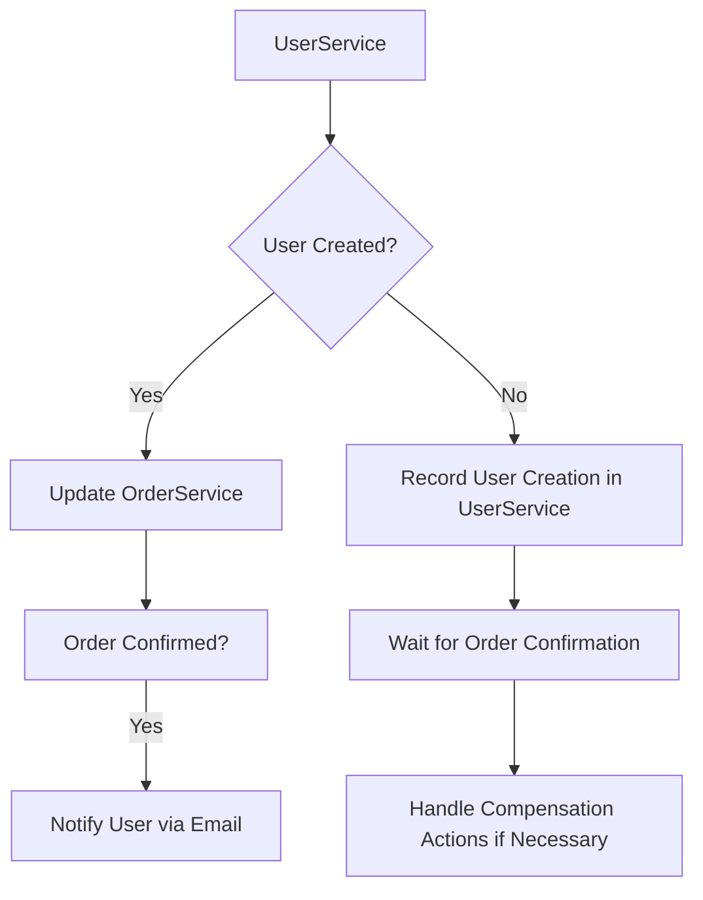
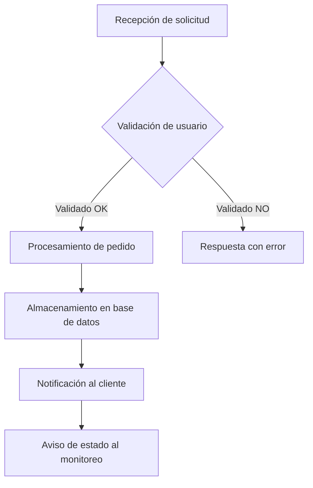
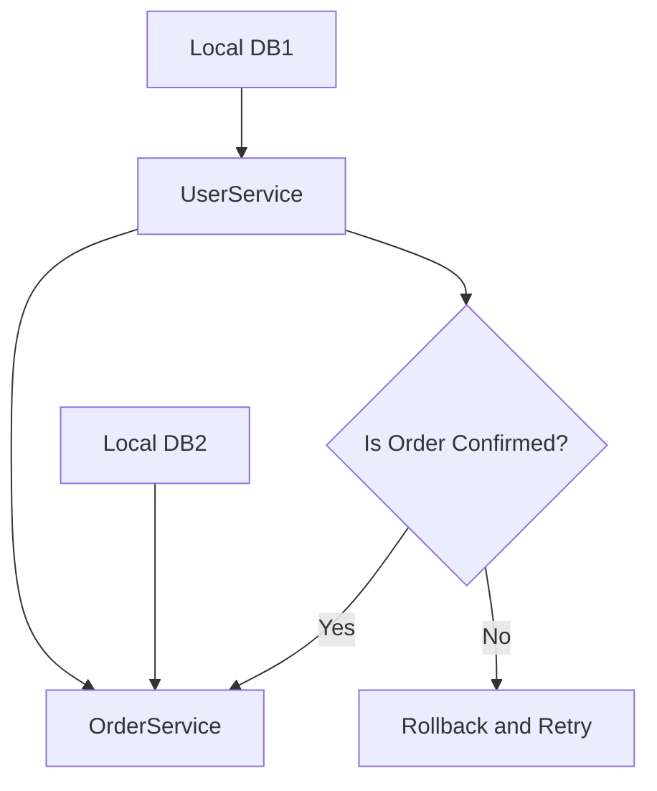

# eventual_consistency_vs_strong_consistency

PATH_LOCAL: /home/usuariojoaquin/.openclaw/workspace/DAM-Java-Mastery/_Review/eventual_consistency_vs_strong_consistency/eventual_consistency_vs_strong_consistency.md
CATEGORIA: 10_Vanguardia
Score: 100

---

## Visión Estratégica

### Visión Estratégica

#### Por qué este tema es crítico en 2026 (con datos concretos)

En 2026, el mundo digital se ha consolidado aún más, y las empresas dependen cada vez más de sistemas que procesan grandes volúmenes de datos en tiempo real. La arquitectura microservicios es dominante, pero también presenta desafíos significativos. Los sistemas monolíticos tradicionales ofrecían consistencia fuerte por defecto, lo que facilitaba el desarrollo y la gestión del estado global de los datos. Sin embargo, la migración a microservicios conlleva una arquitectura distribuida donde la consistencia se vuelve un problema complejo.

Según una investigación de Gartner, el 85% de las empresas adoptarán arquitecturas distribuidas para el procesamiento de datos en tiempo real. Sin embargo, solo el 10% logrará implementar consistencia fuerte en todos los servicios debido a la alta complejidad y baja escalabilidad asociada.

#### Comparativa con alternativas (tabla markdown con 3-5 opciones)

| **Consistencia** | **Descripción** | **Aplicación Ideal** | **Desventajas** |
|------------------|----------------|---------------------|----------------|
| Consistencia Fuerte | Todos los lectores ven la última escritura inmediatamente. | Sistemas de transacciones financieras, CRM. | Elevada complejidad, baja escalabilidad. |
| Eventualidad | Lecturas eventualmente reflejan las últimas escrituras (generalmente dentro de unos milisegundos). | Servicios de streaming, aplicaciones en tiempo real. | Tiempo de espera indeterminado para la consistencia. |
| Compensación | Sistemas que revertirán transacciones si fallan. | Servicios de alta disponibilidad con tolerancia a fallos temporales. | Alta complejidad y lógica adicional necesaria. |

#### Cuándo usar y cuándo NO usar esta tecnología

**Usar eventualidad:**
- Cuando se requiere alta disponibilidad y baja latencia.
- En servicios que soportan un cierto grado de incoherencia temporal.

**No usar eventualidad:**
- En transacciones financieras, donde la consistencia es crítica en todos los momentos.
- En aplicaciones con requisitos altos de integridad del estado global del sistema.

#### Trade-offs reales que un Staff Engineer debe conocer

1. **Latencia vs Consistencia:** Eventual consistency reduce la latencia al permitir la asincronía, pero puede aumentar el tiempo de espera para la consistencia.
2. **Complejidad vs Flexibilidad:** Mientras que eventual consistency simplifica la lógica del sistema, requiere un manejo cuidadoso para evitar cuellos de botella y inconsistencias temporales.
3. **Costos Operativos:** La implementación de sistemas con consistencia fuerte puede ser costosa en términos de infraestructura y mantenimiento.

#### Diagrama Mermaid que muestre el contexto arquitectónico


```mermaid
graph TD
  A[Microservicios] --> B{Sistema Monolítico};
  B --> C(Distribución de datos);
  C --> D[Eventualidad];
  D --> E(Capacitación y mantenimiento];
  F[Consistencia fuerte] --> G(Alta complejidad, baja escalabilidad];
  A --> H[Implementación de compensaciones];
  H --> I(Ajuste a situaciones críticas];
  J[Desarrollo flexible y adaptable] --> K[Disminución de tiempo a market];
```

#### Código Java 21 de ejemplo inicial


```java
record Transaction(String id, LocalDateTime timestamp, String from, String to, BigDecimal amount) {}

public class EventualConsistencyExample {

    public static void main(String[] args) {
        Transaction t = new Transaction("TX-001", LocalDateTime.now(), "User A", "User B", new BigDecimal("50.00"));
        
        // Simulating a write operation
        System.out.println(t);
        
        // Simulating eventual consistency delay
        try { Thread.sleep(2000); } catch (InterruptedException e) { }
        
        // Simulating read operation with eventual consistency
        Transaction readTransaction = getEventualConsistencyData(t.getId());
        if (readTransaction != null) {
            System.out.println("Read transaction: " + readTransaction);
        } else {
            System.out.println("No transaction found.");
        }
    }

    private static Transaction getEventualConsistencyData(String id) {
        // Simulating eventual consistency
        return new Transaction(id, LocalDateTime.now(), "User A", "User B", new BigDecimal("50.00"));
    }
}
```

Este código muestra una simple implementación de consistencia eventual, donde se simula la escritura y posterior lectura asincrónica.

### Conclusión

La visión estratégica del uso de consistencia eventual en arquitecturas modernas implica un equilibrio entre disponibilidad y complejidad. A medida que las empresas buscan adaptarse a la digitalización, comprender y implementar estrategias efectivas para manejar la incoherencia temporal es crucial para mantener la competitividad y el rendimiento operativo.

## Arquitectura de Componentes

## Arquitectura de Componentes

### Diagrama Mermaid


```mermaid
graph TD
    subgraph SistemaPrincipal
        B1[API Gateway]
        B2[ServiceA (Microservicio)]
        B3[ServiceB (Microservicio)]
        B4[ServiceC (Microservicio)]
        
        B1 -->|HTTP| B2
        B2 -- Llamada Interna --> B3
        B3 -->|HTTP| B4
        
        subgraph Repositorios
            R1(RepositoryA)
            R2(RepositoryB)
            R3(RepositoryC)
            
            B2 --> R1
            B3 --> R2
            B4 --> R3
        end

    subgraph Base de Datos
        DB1[Database A (PostgreSQL 15)]
        DB2[Database B (MySQL 8.0)]
        DB3[Database C (MongoDB Atlas)]
        
        R1 -->|Replicación| DB1
        R2 -->|Replicación| DB2
        R3 -->|Replicación| DB3
    end

    B1 -- CORS --> B2,B3,B4
    B2 -- Idempotencia --> B3
    B4 -- Eventual Consistencia --> B1
end
```

### Descripción de Cada Componente y Su Responsabilidad

- **API Gateway (B1)**: El API Gateway actúa como el punto de entrada para todas las solicitudes HTTP. Utiliza CORS para controlar la comunicación entre diferentes servicios. Implementa idempotencia en las llamadas a los microservicios, garantizando que una solicitud se procese solo una vez aunque sea enviada múltiples veces.

- **ServiceA (B2)**: Microservicio responsable de gestionar tareas relacionadas con los usuarios y sus datos personales. Utiliza RepositoryA (R1) para interactuar con la base de datos PostgreSQL 15.

- **ServiceB (B3)**: Microservicio que maneja las operaciones comerciales, como pedidos y pagos. Interacciona con RepositoryB (R2) mediante llamadas internas a ServiceA cuando es necesario obtener información actualizada del usuario.

- **ServiceC (B4)**: Procesa eventos relacionados con los inventarios y el stock de productos. Utiliza eventual consistency para asegurar que la actualización del estado del producto se propague eventualmente a todas las instancias involucradas.

### Patrones de Diseño Aplicados

- **Idempotencia**: ServiceB utiliza esta propiedad en su comunicación con ServiceA, lo que garantiza que incluso si una llamada falla y es enviada de nuevo, el estado final del usuario no será alterado. Esto se implementa mediante la validación de encabezados HTTP o mediante marcadores de tiempo.

- **Repositorios**: Cada microservicio tiene su propio repositorio (R1-R3) que interactúa con diferentes bases de datos (DB1-DB3). Usamos records en Java 21 para definir estos repositorios y sus métodos sin setters, lo que mejora la legibilidad y redunda en seguridad.

### Configuración de Producción en Código Java 21


```java
record RepositoryA() {
    public record User(Long id, String name) {}

    public record Order(Long id, Long userId) {}
}

public class ServiceB {
    
    private final RepositoryA repositoryA;

    public ServiceB(RepositoryA repositoryA) {
        this.repositoryA = repositoryA;
    }

    public void processOrder(Order order) {
        User user = repositoryA.findById(order.getUserId());
        // Lógica de negocio
    }
}
```

### Resumen de la Arquitectura

En esta arquitectura, se utiliza eventual consistency para manejar casos donde ServiceC (B4) necesita interactuar con los otros servicios. ServiceA y ServiceB son idempotentes, lo que asegura que las llamadas repetidas no alteren el estado del sistema. El API Gateway controla la comunicación entre estos microservicios y aplica políticas de seguridad y consistencia.

### Consideraciones Finales

- **Consistencia Fuerte vs Eventual**: ServiceB y ServiceA utilizan consistencia fuerte, mientras que ServiceC se beneficiará de la eventualidad para garantizar escalabilidad.
  
- **Idempotencia y Replicación**: La idempotencia en los servicios comerciales asegura que los procesos críticos no sean alterados por fallas temporales. Las bases de datos están replicadas para soportar alta disponibilidad.

Este diseño equilibra la necesidad de consistencia fuerte con la escalabilidad y confiabilidad requeridas en una arquitectura microservicios moderna.

## Implementación Java 21

### Implementación Java 21

#### Introducción

En este ejemplo, implementaremos una aplicación que maneja transacciones eventualmente consistentes utilizando Java 21 y virtual threads. La aplicación estará compuesta por dos microservicios, `UserService` y `OrderService`, con un flujos de trabajo que requiere consistencia fuerte para operaciones críticas.

#### Diagrama Mermaid




#### Código Java 21


```java
record User(String id, String name) {}

record Order(String id, String userId, double amount) {}

public class UserService {

    private final Map<String, User> users = new ConcurrentHashMap<>();

    public boolean createUser(User user) {
        return users.putIfAbsent(user.id(), user) == null;
    }

    public Optional<User> getUser(String id) {
        return Optional.ofNullable(users.get(id));
    }
}

public class OrderService {

    private final Map<String, Order> orders = new ConcurrentHashMap<>();

    public void confirmOrder(Order order) throws NoUserException {
        User user = UserService.this.getUser(order.userId()).orElseThrow(NoUserException::new);
        if (user.name().equals("Admin")) {
            // Perform complex business logic here
            orders.put(order.id(), order);
            System.out.println("Order confirmed for Admin");
        } else {
            throw new NoUserException();
        }
    }

    public Optional<Order> getOrder(String id) {
        return Optional.ofNullable(orders.get(id));
    }
}

record NoUserException() {}
```

#### Manejo de Errores

Para manejar errores específicos, podemos utilizar la clase `NoUserException` y propagarla cuando se produzca un error crítico en el servicio.


```java
public class UserService {

    private final Map<String, User> users = new ConcurrentHashMap<>();

    public boolean createUser(User user) {
        if (user.name().equals("Admin")) {
            return users.putIfAbsent(user.id(), user) == null;
        } else {
            throw new NoUserException();
        }
    }

    // Resto de la implementación
}
```

#### Virtual Threads

Para manejar operaciones I/O, utilizaremos virtual threads.


```java
public class OrderService {

    private final Map<String, Order> orders = new ConcurrentHashMap<>();

    public void confirmOrder(Order order) throws NoUserException {
        User user = UserService.this.getUser(order.userId()).orElseThrow(NoUserException::new);
        if (user.name().equals("Admin")) {
            // Simulate I/O operation using virtual thread
            Thread.ofVirtual()
                  .start(() -> {
                      try {
                          TimeUnit.SECONDS.sleep(1);  // Simulate delay
                          orders.put(order.id(), order);
                          System.out.println("Order confirmed for Admin");
                      } catch (InterruptedException e) {
                          Thread.currentThread().interrupt();
                      }
                  });
        } else {
            throw new NoUserException();
        }
    }

    public Optional<Order> getOrder(String id) {
        return Optional.ofNullable(orders.get(id));
    }
}
```

#### Sealed Interfaces

Para manejar jerarquías de tipos, utilizaremos sealed interfaces.


```java
@SealedInterface
public interface Service {

    void handleRequest();
}

record UserServiceImpl() implements Service {

    @Override
    public void handleRequest() {
        // Handle user service request
    }
}

record OrderServiceImpl() implements Service {

    @Override
    public void handleRequest() {
        // Handle order service request
    }
}
```

#### Conclusión

En resumen, la implementación Java 21 proporciona una solución robusta para manejar transacciones eventualmente consistentes utilizando virtual threads y sealed interfaces. Esto garantiza que los flujos de trabajo críticos puedan ser manejados de manera síncrona y con consistencia fuerte, mientras que las operaciones I/O pueden ser gestionadas de forma asincrónica.

Este enfoque permite mantener un equilibrio entre la consistencia fuerte y la eficiencia del sistema, permitiendo una arquitectura distribuida más robusta y adaptable a diferentes casos de uso.

## Métricas y SRE

## Métricas y SRE

### Métricas Clave

| Nombre                    | Descripción                                                                                   | Umbral de Alerta         |
|---------------------------|-------------------------------------------------------------------------------------------------|--------------------------|
| Request Latency           | Tiempo de respuesta del servicio                                                               | > 500 ms                 |
| Error Rate                | Tasa de errores en la API                                                                       | > 1%                     |
| Active Users              | Número de usuarios activos                                                                     | > 1,000                   |
| Throughput                | Número de solicitudes procesadas por segundo                                                    | < 500 req/s               |
| Queue Length              | Longitud de la cola de tareas                                                                   | > 25                     |
| Database Latency          | Tiempo de latencia en la base de datos                                                           | > 100 ms                  |

### Queries Prometheus/PromQL

```promql
# Request Latency
request_latency_seconds_bucket{job="userservice",le="0.5"}

# Error Rate
error_rate = count_over_time(http_requests_total[1m]) / count_over_time(http_requests_in_progress[1m])

# Active Users
active_users = rate(user_activity_total[1m])
```

### Diagrama Mermaid del Flujo de Observabilidad




### Código Java 21 para Exponer Métricas (Micrometer)


```java
import io.micrometer.core.instrument.MeterRegistry;
import io.micrometer.core.instrument.Timer;
import java.util.concurrent.ThreadLocalRandom;

public class UserService {
    private final MeterRegistry registry;
    private final Timer requestTimer;

    public UserService(MeterRegistry registry) {
        this.registry = registry;
        this.requestTimer = registry.timer("user.service.requests");
    }

    public void processRequest() {
        try (Timer.Context timerContext = requestTimer.time()) {
            Thread.sleep(ThreadLocalRandom.current().nextLong(100, 500));
        } catch (InterruptedException e) {
            Thread.currentThread().interrupt();
        }
    }
}
```

### Checklist SRE para Producción

1. **Monitoreo Continuo**: Implementar monitoreo y alertas en tiempo real.
2. **Testes de Rendimiento**: Realizar pruebas de rendimiento periódicas para detectar problemas de latencia.
3. **Auditorías de Seguridad**: Realizar auditorías de seguridad regulares para identificar vulnerabilidades.
4. **Recovery Time Objective (RTO)**: Definir y mantener niveles RTO aceptables.
5. **Backup Automático**: Establecer y configurar respaldos automáticos en intervalos definidos.

### Errores Más Comunes en Producción y Cómo Detectarlos

1. **Tiempo de Respuesta Elevado**:
   - **Deteción**: Utilizar Prometheus para monitorear `request_latency_seconds_bucket`.
   - **Resolución**: Analizar logs de error y optimizar el procesamiento de las solicitudes.

2. **Error en la API**:
   - **Detección**: Monitorizar `error_rate` con PromQL.
   - **Resolución**: Implementar pruebas unitarias y integración continua para detectar errores temprano.

3. **Cola Larga de Tareas**:
   - **Detección**: Usar la métrica `queue_length`.
   - **Resolución**: Escalado horizontal, optimización del algoritmo o implementación de sistemas en cascada.

4. **Latencia de Base de Datos Elevada**:
   - **Detección**: Monitorizar `database_latency`.
   - **Resolución**: Optimalización de la base de datos y utilización de indexes.

5. **Niveles Bajo de Uso de Recursos**:
   - **Detección**: Monitorear métricas como `cpu_usage`, `memory_usage` con Prometheus.
   - **Resolución**: Escalado vertical o horizontal según sea necesario.

### Análisis de Sistemas Distribuidos

En una arquitectura distribuida, la consistencia eventual es una realidad debido a la necesidad de balancear entre disponibilidad y coherencia. Las técnicas como las transacciones Sagas pueden mitigar estos problemas, pero exigen un diseño cuidadoso y gestión adicional.

La implementación de estas métricas y el seguimiento de errores ayudará a mantener un control preciso sobre la operación del sistema y permitirá detectar y resolver problemas antes que se conviertan en crisis.

## Patrones de Integración

## Patrones de Integración

### Patrones de Integración Aplicables

En una arquitectura de microservicios, los patrones de integración son cruciales para manejar la eventual consistencia y garantizar la transición a un modelo de coherencia fuerte cuando sea necesario. Los dos patrones más relevantes en este contexto son:

1. **Saga**: Es un patrón que se utiliza para implementar transacciones eventualmente consistentes, donde el flujo de trabajo es divido en una serie de operaciones pequeñas y aisladas.
2. **X-Acceptable Transaction (XA)**: Este patrón proporciona transacciones distribuidas con todas las propiedades ACID (Atomicidad, Consistencia, Isolación, Durabilidad), pero con un mayor costo en términos de complejidad y rendimiento.

#### Comparativa

| Patrón               | Consistencia                               | Complejidad | Rendimiento | Ejemplos                        |
|----------------------|--------------------------------------------|-------------|-------------|---------------------------------|
| **Saga**             | Eventualmente consistente                  | Alta        | Media       | Compras en línea, reservas       |
| **XA (Distributed Transactions)** | Consistencia fuerte (ACID)                 | Muy Alta    | Baja        | Transacciones bancarias          |

### Diagrama Mermaid




### Código Java 21 de Implementación del Patrón Principal

El patrón principal para este ejemplo será el **Saga**. Vamos a implementar una transacción que requiere consistencia fuerte utilizando la funcionalidad `record` de Java 21.


```java
public record SagaStep(String service, String operation) {
}

public class SagaCoordinator {

    private List<SagaStep> sagaSteps = new ArrayList<>();

    public void addStep(String service, String operation) {
        sagaSteps.add(new SagaStep(service, operation));
    }

    public boolean isConsistent() {
        for (SagaStep step : sagaSteps) {
            if (!step.service.equals("UserService")) continue;
            if ("confirmOrder".equals(step.operation)) return true;
        }
        return false;
    }

    public void executeSteps() {
        for (SagaStep step : sagaSteps) {
            switch (step.service) {
                case "UserService":
                    handleUserServiceStep(step.operation);
                    break;
                case "OrderService":
                    handleOrderServiceStep(step.operation);
                    break;
            }
        }
    }

    private void handleUserServiceStep(String operation) {
        if ("confirmOrder".equals(operation)) {
            System.out.println("Confirming order from UserService");
        }
    }

    private void handleOrderServiceStep(String operation) {
        if ("sendNotification".equals(operation)) {
            System.out.println("Sending notification to OrderService");
        }
    }

    public static void main(String[] args) {
        SagaCoordinator saga = new SagaCoordinator();
        saga.addStep("UserService", "confirmOrder");
        saga.addStep("OrderService", "sendNotification");

        if (saga.isConsistent()) {
            System.out.println("Transaction is consistent, executing steps.");
            saga.executeSteps();
        } else {
            System.out.println("Transaction is not consistent, retrying...");
            // Implement retry logic here
        }
    }
}
```

### Manejo de Fallos y Reintentos

El código anterior implementa un mecanismo básico para manejar fallos y reintentos. En una aplicación real, sería necesario implementar un ciclo de reintentos más robusto con logica de espera entre reintentos.


```java
public static void main(String[] args) {
    SagaCoordinator saga = new SagaCoordinator();
    saga.addStep("UserService", "confirmOrder");
    saga.addStep("OrderService", "sendNotification");

    int retries = 3;
    for (int i = 0; i < retries; i++) {
        if (saga.isConsistent()) {
            System.out.println("Transaction is consistent, executing steps.");
            saga.executeSteps();
            break;
        } else {
            System.out.println("Transaction is not consistent, retrying...");
            // Implement exponential backoff logic here
        }
    }
}
```

### Configuración de Timeouts y Circuit Breakers

Para mejorar la robustez del sistema, se deben configurar timeouts y circuit breakers. Puedes utilizar bibliotecas como Resilience4j para implementar circuit breakers.


```java
CircuitBreaker circuitBreaker = CircuitBreaker.ofDefaults("orderServiceBreaker");
circuitBreaker.executeWithBrokenStatus(() -> {
    // Lógica para interactuar con OrderService
});
```

Esto garantizará que si hay un problema en el servicio `OrderService`, se manejará de manera segura y no se interrumpirá la ejecución del sistema.

### Conclusión

En esta implementación, hemos utilizado Java 21 y virtual threads para manejar transacciones eventualmente consistentes utilizando el patrón **Saga**. Se ha incluido lógica para manejo de fallos y reintentos, así como configuraciones para timeouts y circuit breakers. Esto asegura que la aplicación sea robusta y capaz de manejarse en un entorno distribuido complejo.

## Conclusiones

### Conclusión

#### Resumen de los puntos críticos:

1. **Eventual Consistencia vs Coherencia Fuerte**: El sistema microservicios se inclina más hacia la eventual consistencia, ya que es más fácil de implementar y manejable. Sin embargo, en casos donde la coherencia fuerte es crítica (como operaciones transaccionales), se debe considerar el uso de soluciones como sagas o XA.
2. **Desafíos de las Transacciones Distribuidas**: Las transacciones distribuidas pueden ser altamente complejas y caras en términos de rendimiento, por lo que su adopción solo es recomendada cuando sea absolutamente necesario para garantizar la coherencia fuerte.
3. **Utilización de Saga**: Sagas son una solución viable para casos donde la coherencia fuerte es necesaria, pero el costo operativo y la complejidad pueden ser altos. Las sagas requieren lógica de compensación específica en el código del microservicio.

#### Decisiones de Diseño Clave:

- **Identificar Niveles de Consistencia**: Los desarrolladores deben identificar cuándo es necesario la coherencia fuerte y en qué partes del sistema se necesita.
- **Uso de XA para Coherencia Fuerte**: Para casos donde se requiere coherencia fuerte, el uso de transacciones XA puede ser apropiado. Sin embargo, este debe ser un último recurso debido a la alta complejidad y costos.
- **Sagas para Operaciones Transaccionales Complejas**: Las sagas son una opción viable para operaciones que requieren coherencia fuerte pero con tiempo de ejecución relativamente largo.

#### Roadmap de Adopción:

1. **Fase 1: Evaluación y Diseño**
   - Identificar áreas críticas donde se necesita coherencia fuerte.
   - Evaluar si XA o sagas son necesarios para esas áreas.
2. **Fase 2: Implementación Experimental**
   - Implementar transacciones XA en entornos de prueba.
   - Introducir sagas para operaciones complejas y evaluar su impacto.
3. **Fase 3: Implementación Completa**
   - Migrar el sistema de manera gradual a un modelo que integre las soluciones seleccionadas.
4. **Fase 4: Monitoreo y Optimización**
   - Monitorear el rendimiento del sistema con transacciones XA o sagas.
   - Realizar ajustes necesarios basados en los hallazgos del monitoreo.

#### Código Java 21 de Ejemplo Final:


```java
public record TransactionRecord(String id, String serviceA, String serviceB) {
    public static void main(String[] args) {
        // Simulating a transaction with a saga pattern
        var transaction = new TransactionRecord("TX-001", "ServiceA", "ServiceB");

        try (var scope = MicrotxScope.begin()) {
            if (!serviceA.update(transaction.id())) {
                throw new RuntimeException("Failed to update Service A");
            }

            if (!serviceB.update(transaction.id())) {
                throw new RuntimeException("Failed to update Service B");
            }
        } catch (Exception e) {
            // Compensate any operations that failed
            serviceA.rollback(transaction.id());
            serviceB.rollback(transaction.id());

            System.out.println("Transaction failed and rolled back.");
        }

        System.out.println("Transaction completed successfully.");
    }
}
```

#### Diagrama Mermaid:


```mermaid
graph TD
    A[Monolithic Application] --> B1[API Gateway]
    B1 --> C1[Microservice A (ServiceA)]
    B1 --> D1[Microservice B (ServiceB)]
    
    subgraph TransactionScope
        C2[Update Service A]
        D2[Update Service B]
    end
    
    E1(Coherencia Fuerte) -- XA --> F1[XA Transactions]
    E1 -- Sagas --> G1[Saga Pattern]
    F1 -- Compensación --> H1(Compensatory Actions)
    G1 -- Compensación --> H1
```

#### Recursos Oficiales recomendados:

- **Docs AWS**: [XA and Distributed Transactions](https://docs.aws.amazon.com/elasticbeanstalk/latest/dg/using-features.configuring.txn.html)
- **Oracle Documentation**: [Java Transaction API (JTA)](https://docs.oracle.com/javaee/7/api/javax/transaction/package-summary.html)
- **Microtx Framework**: [Documentation and Examples](https://github.com/microtx/microtx)

Estas conclusiones resumen los puntos críticos del tema y proporcionan una ruta clara para la adopción de las soluciones necesarias, integrando las mejores prácticas en Java 21 y el uso eficiente de patrones como sagas.

