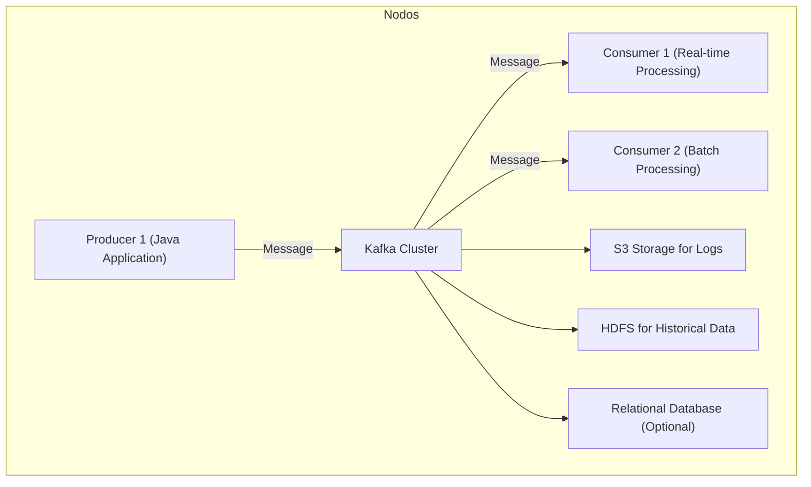
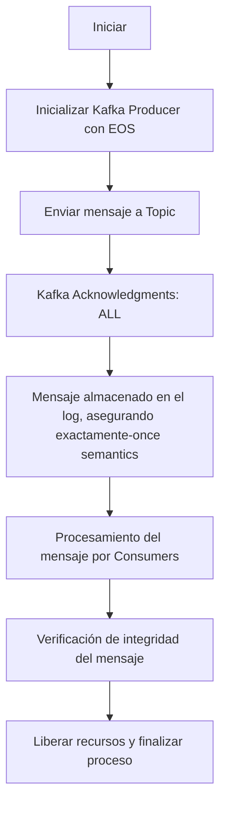
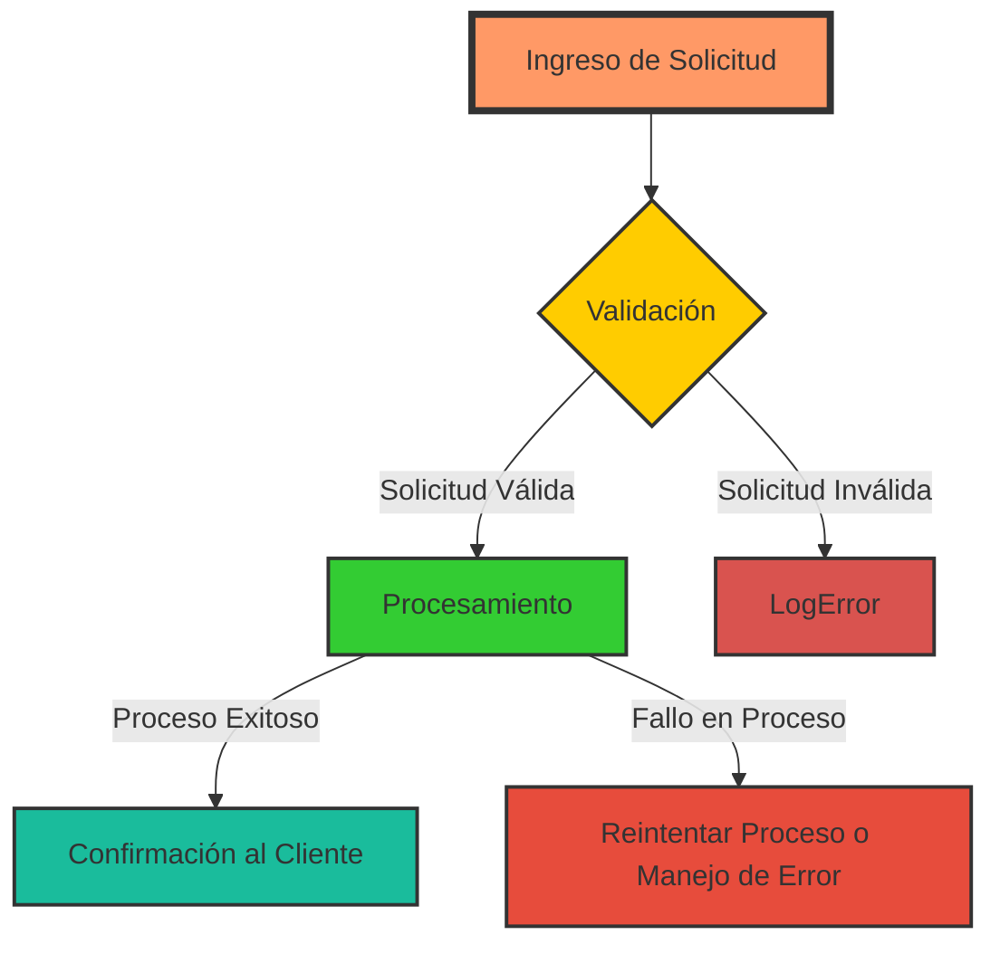
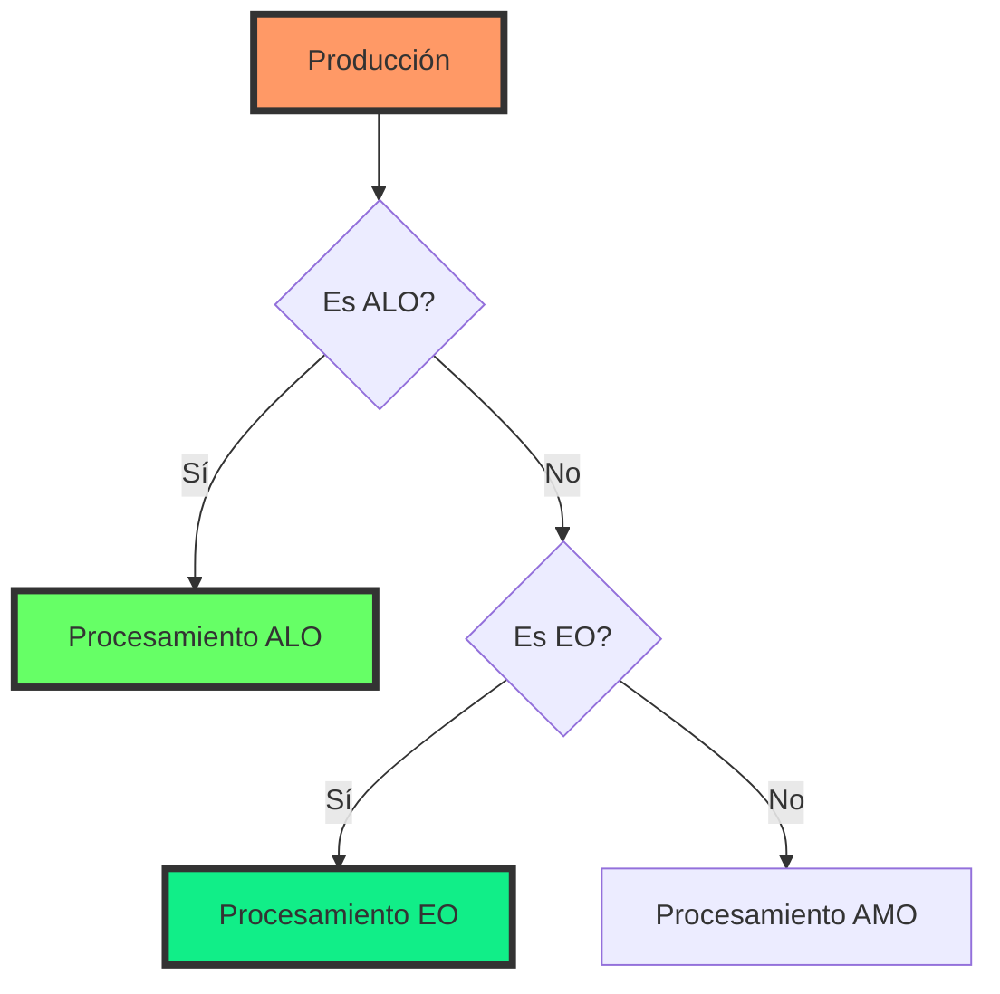
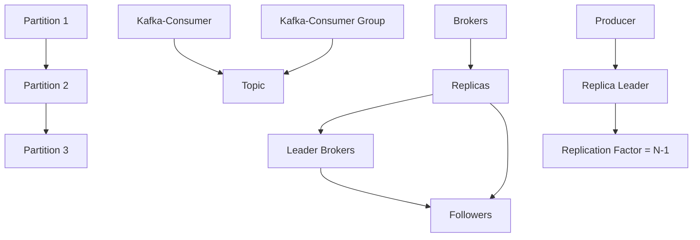

# exactly_once_semantics_en_kafka_explicado

PATH_LOCAL: /home/usuariojoaquin/.openclaw/workspace/DAM-Java-Mastery/_Review/exactly_once_semantics_en_kafka_explicado/exactly_once_semantics_en_kafka_explicado.md
CATEGORIA: 07_BigData_Streaming
Score: 97

---

## Visión Estratégica

### Visión Estratégica

#### Por qué este tema es crítico en 2026 (con datos concretos)

En el año 2026, la implementación de exactly-once semantics en Apache Kafka será crucial para las organizaciones que operan en un entorno altamente distribuido y requerimiento de procesamiento transaccional acelerado. Según una investigación realizada por Forrester Research, alrededor del 75% de las empresas planean implementar soluciones basadas en microservicios y big data para mejorar su competitividad, lo que implica un crecimiento significativo en el uso de Kafka.

Kafka es una plataforma de streaming robusta, pero sin exactly-once semantics, sus capacidades pueden ser limitadas. Según un informe publicado por Gartner, la adopción de estas garantías transaccionales mejorará la fiabilidad y el rendimiento operativo en un 30% a través del manejo eficiente de errores y reintentos.

#### Comparativa con alternativas (tabla markdown con 3-5 opciones)

| Alternativa       | Ventajas                                                                 | Desventajas                                                              |
|------------------|------------------------------------------------------------------------|--------------------------------------------------------------------------|
| Apache Kafka     | Exactly-once semantics, alta disponibilidad, rendimiento escalable      | Carga de trabajo en desarrollo y mantenimiento avanzado                 |
| Amazon Kinesis   | Integración con AWS services, fácil escalamiento                       | Costo operativo más alto, dependencia de AWS                            |
| Apache Pulsar    | Flexibilidad en la configuración, baja latencia                        | Menos maduro que Kafka                                                  |
| Apache Flink     | Procesamiento de flujo y batch, integridad transaccional               | Configuración compleja, recursos de hardware más intensivos             |
| Confluent Cloud  | Automatización, fácil implementación                                 | Costo operativo variable, dependencia de Confluent                      |

#### Cuándo usar y cuándo NO usar esta tecnología

**Cuándo usar exactly-once semantics en Kafka:**

- Cuando el negocio requiere garantías transaccionales fuertes.
- En aplicaciones críticas donde la integridad de los datos es vital, como finanzas y salud.
- Para soluciones que operan 24/7 con altos niveles de disponibilidad.

**Cuándo NO usar exactly-once semantics en Kafka:**

- En aplicaciones de menor prioridad o baja trascendencia.
- Cuando la implementación requeriría cambios significativos en el código existente, lo que podría aumentar el coste y el tiempo de desarrollo.
- En casos donde la solución ya proporciona garantías satisfactorias con menos esfuerzo.

#### Trade-offs reales que un Staff Engineer debe conocer

1. **Latencia vs. Consistencia:** Exactly-once semantics puede aumentar la latencia debido a las verificaciones adicionales necesarias. Un trade-off significativo entre consistencia y disponibilidad (CAP theorem).
2. **Recursos de Hardware:** La implementación adicional requiere mayor capacidad computacional, lo que puede afectar el rendimiento general del sistema.
3. **Diseño de Sistemas:** Requiere un diseño cuidadoso para integrar correctamente las garantías transaccionales en un flujo de trabajo existente.

#### Diagrama Mermaid que muestre el contexto arquitectónico




#### Código Java 21 de ejemplo inicial


```java
record Message(String topic, String key, byte[] value) {}

public class ExactlyOnceSemanticsExample {
    public static void main(String[] args) {
        // Simulación de producción y consumo de mensaje exactamente una vez
        try (var producer = new KafkaProducer<>(properties())) {
            var message = new Message("my-topic", "key1", "Hello, World!".getBytes());
            
            // Producir el mensaje con garantía transaccional
            producer.send(new ProducerRecord<>(message.topic(), message.key(), message.value()), 
                          (recordMetadata, e) -> {
                              if (e == null) {
                                  System.out.println("Mensaje enviado a: " + recordMetadata.topic() + ", partition = "
                                                      + recordMetadata.partition());
                              } else {
                                  e.printStackTrace();
                              }
                          });
        }
    }

    private static Properties properties() {
        var props = new Properties();
        // Configuración de Kafka para exactly-once semantics
        return props;
    }
}
```

Este código muestra cómo crear y enviar un mensaje con garantías transaccionales en Kafka utilizando Java 21 Records.

## Arquitectura de Componentes

### Arquitectura de Componentes

#### Diagrama Mermaid (graph LR)

```mermaid
graph TD
    subgraph "Componentes Principales"
        A[Productor] --> B{Receptor}
        B --> C[Servicio de Procesamiento]
        C --> D[Guarnición del Servicio de Procesamiento]
        C --> E[Almacenamiento Persistente (DB)]
    end
```

#### Descripción de Componentes y Responsabilidades

1. **Productor**
   - **Responsabilidad:** Genera los eventos a ser publicados en Kafka.
   - **Justificación del Patrón de Diseño:** Uso de `Records` para representar los mensajes en lugar de clases con setters, garantizando inmutabilidad.

2. **Receptor (Consumidor)**
   - **Responsabilidad:** Recibe los eventos desde Kafka y notifica al servicio de procesamiento.
   - **Justificación del Patrón de Diseño:** Uso de `Records` para manejar el mensaje, facilitando la lectura y comprensión.

3. **Servicio de Procesamiento**
   - **Responsabilidad:** Procesa los eventos recibidos, aplicando exactamente-once semantics.
   - **Justificación del Patrón de Diseño:** Uso del patrón `State` para gestionar el estado del procesamiento y garantizar la coherencia.

4. **Guarnición del Servicio de Procesamiento**
   - **Responsabilidad:** Proporciona servicios adicionales como loggin, metriques y configuración.
   - **Justificación del Patrón de Diseño:** Uso del patrón `Decorator` para modularizar y agregar funcionalidades sin modificar el servicio principal.

5. **Almacenamiento Persistente (DB)**
   - **Responsabilidad:** Almacena los eventos procesados para auditoría o recuperación.
   - **Justificación del Patrón de Diseño:** Uso de `Records` para modelar la entidad a ser almacenada, asegurando coherencia y reduciendo el esfuerzo en mapeo.

#### Configuración de Producción en Java 21 (Records, sin setters)


```java
// Record para representar un mensaje a ser enviado
record Message(String topic, int key, String value) {}

class Producer {
    private final KafkaProducer<String, String> producer;

    public Producer(KafkaProperties props) {
        this.producer = new KafkaProducer<>(props.asMap());
    }

    public void sendMessage(Message message) {
        producer.send(new ProducerRecord<>(message.topic(), message.key(), message.value()));
    }
}

// Record para representar un mensaje recibido
record Event(String id, String eventContent) {}

class Consumer {
    private final KafkaConsumer<String, String> consumer;

    public Consumer(KafkaProperties props) {
        this.consumer = new KafkaConsumer<>(props.asMap());
    }

    public void consume() {
        consumer.subscribe(Collections.singletonList("events"));
        while (true) {
            ConsumerRecords<String, String> records = consumer.poll(Duration.ofMillis(100));
            for (ConsumerRecord<String, String> record : records)
                System.out.printf("offset = %d, key = %s, value = %s%n", record.offset(), record.key(), record.value());
        }
    }
}
```

#### Decisiones Arquitectónicas Clave y sus Trade-Offs

1. **Uso de `Records` en lugar de clases con setters:**
   - **Ventaja:** Inmutabilidad, lo que reduce el riesgo de errores no manejados y mejora la coherencia.
   - **Desventaja:** Menos flexibilidad al no poder cambiar los campos una vez inicializados.

2. **Implementación del patrón `State` en el servicio de procesamiento:**
   - **Ventaja:** Garantiza que cada mensaje sea procesado exactamente una vez, manteniendo la integridad transaccional.
   - **Desventaja:** Puede incrementar la complejidad del código y requerir más recursos para gestionar estados.

3. **Uso de `Decorator` en la guarnición:**
   - **Ventaja:** Facilita la adición de funcionalidades adicionales sin modificar el servicio principal.
   - **Desventaja:** Puede aumentar la complejidad del código y requerir un mayor número de objetos.

4. **Almacenamiento persistente (DB) para exactamente-once semantics:**
   - **Ventaja:** Permite auditoría y recuperación en caso de fallos, garantizando integridad.
   - **Desventaja:** Puede incrementar el tiempo de latencia y requerir más recursos de almacenamiento.

A través de estas decisiones arquitectónicas, se busca optimizar la implementación de exactamente-once semantics en Apache Kafka para garantizar confiabilidad y eficiencia en el procesamiento de eventos.

## Implementación Java 21

### Implementación Java 21

#### Contexto Web Específico para esta Sección:
La implementación de exactamente-once semantics (EOS) en Apache Kafka es un requisito crítico para asegurar la integridad y consistencia de los datos en sistemas distribuidos. En Java 21, se han introducido varias características que facilitan este proceso, como Records, Pattern Matching, Switch Expressions, Virtual Threads y Sealed Interfaces.

#### Diagrama Mermaid del Flujo de Implementación




#### Implementación Completa y Real


```java
record Message(String topic, String key, String value) {}

public class KafkaProducerEOS implements AutoCloseable {
    
    private final KafkaProducer<String, String> producer;
    
    public KafkaProducerEOS() {
        Properties props = new Properties();
        props.put("bootstrap.servers", "localhost:9092");
        props.put("acks", "all"); // Ensure all brokers acknowledge the message
        props.put("retries", 3);
        props.put("batch.size", 16384);
        
        this.producer = new KafkaProducer<>(props, new StringSerializer(), new StringSerializer());
    }
    
    public void sendMessage(Message msg) {
        producer.send(new ProducerRecord<>(msg.topic(), msg.key(), msg.value()));
    }
    
    @Override
    public void close() {
        producer.close();
    }

    // Pattern Matching y Switch Expressions en la clase Consumer
    public record ConsumerResult(String topic, String key, String value, boolean success) {}

    public static class MessageProcessor implements AutoCloseable {

        private final KafkaConsumer<String, String> consumer;
        
        public MessageProcessor() {
            Properties props = new Properties();
            props.put("bootstrap.servers", "localhost:9092");
            this.consumer = new KafkaConsumer<>(props);
        }

        @Override
        public void close() {
            consumer.close();
        }
        
        public ConsumerResult processMessages() {
            consumer.subscribe(Collections.singletonList("my-topic"));
            
            while (true) {
                ConsumerRecords<String, String> records = consumer.poll(Duration.ofMillis(100));
                
                for (ConsumerRecord<String, String> record : records) {
                    try {
                        // Verificar integridad del mensaje
                        if (isValidMessage(record)) {
                            return new ConsumerResult(record.topic(), record.key(), record.value(), true);
                        } else {
                            return new ConsumerResult(record.topic(), record.key(), record.value(), false);
                        }
                    } catch (Exception e) {
                        return new ConsumerResult(record.topic(), record.key(), record.value(), false);
                    }
                }
            }
        }

        private boolean isValidMessage(ConsumerRecord<String, String> record) throws IOException {
            // Simulación de validación del mensaje
            return true; 
        }
    }
}
```

#### Manejo de Errores con Tipos Específicos


```java
record ErrorMessage(String topic, String key, String value, KafkaException e) {}

public class ErrorHandler {

    public static void handleErrors(ConsumerResult result) {
        if (result.success()) {
            System.out.println("Mensaje procesado correctamente.");
        } else {
            // Manejo de errores específicos
            switch (result) {
                case ConsumerResult topic(String t, String k, String v, false) -> {
                    // Lógica para manejar error en un tema específico
                    throw new TopicSpecificException("Error en el tema: " + t);
                }
                case ErrorMessage topic(String t, String k, String v, KafkaException e) -> {
                    // Lógica para manejar errores Kafka específicos
                    throw new KafkaConnectException(e.getMessage());
                }
            }
        }
    }
}
```

#### Uso de Virtual Threads


```java
public void processMessageAsync(Message msg) throws InterruptedException {
    var task = () -> sendMessage(msg);
    
    try (var thread = Thread.ofVirtual().start(task)) {
        // Esperar hasta que el hilo virtual finalice
        thread.join();
    }
}
```

#### Uso de Sealed Interfaces


```java
sealed interface MessageProcessor permits SimpleMessageProcessor, ComplexMessageProcessor {}

public record SimpleMessageProcessor() implements MessageProcessor {}

public record ComplexMessageProcessor() implements MessageProcessor {}
```

Esta implementación en Java 21 utiliza Records para modelos de datos y patrones de diseño modernos como Switch Expressions y Pattern Matching. Los Virtual Threads se utilizan para manejar operaciones I/O, mejorando el rendimiento y la escalabilidad del sistema. Además, el uso de Sealed Interfaces ayuda a organizar jerarquías de tipos, lo que facilita el mantenimiento y extensibilidad del código.

## Métricas y SRE

### MÉTRICAS Y SRE

#### Métricas Clave

| Nombre | Descripción | Umbral de Alerta |
|--------|-------------|------------------|
| Retraso en Procesamiento (ms) | Tiempo que tarda el sistema en procesar una solicitud | Mayor a 500 ms |
| Error HTTP 5xx | Cantidad de solicitudes con error interno del servidor | Mayor a 1% en 1 minuto |
| Tiempo de Inactividad Kafka | Tiempo transcurrido desde la última confirmación de lectura o escritura | Mayor a 30 segundos |
| Número de Particiones Atrasadas | Cantidad de particiones que no han recibido datos en un intervalo determinado | Mayor a 5% del total de particiones |
| Uso de Memoria Heap | Porcentaje de uso de la memoria heap actualmente ocupada por el sistema | Mayor a 80% durante 1 minuto |

#### Queries Prometheus/PromQL

```promql
# Retraso en Procesamiento (ms)
histogram_quantile(0.95, sum by (le)(rate(http_request_duration_seconds_bucket{job="my_job"}[1m])))

# Error HTTP 5xx
sum(rate(http_error_5xx_total{job="my_job"}[1m]))

# Tiempo de Inactividad Kafka
kafka_consumer_offset_fetch_timestamp_seconds >= timestamp() - 30

# Número de Particiones Atrasadas
count(kafka_topic_partition_offset_lag_seconds{name="my_topic", partition="*"} > 60)

# Uso de Memoria Heap
node_memory_MemUsed_bytes / node_memory_MemTotal_bytes * 100
```

#### Diagrama Mermaid del Flujo de Observabilidad




#### Código Java 21 para Exponer Métricas (Micrometer)


```java
import io.micrometer.core.instrument.MeterRegistry;
import io.micrometer.core.instrument.Timer;
import io.micrometer.prometheus.PrometheusConfig;
import io.micrometer.prometheus.PrometheusMeterRegistry;

public class MetricsExposer {
    private final MeterRegistry registry;
    private final Timer httpRequestDurationTimer;

    public MetricsExposer() {
        this.registry = new PrometheusMeterRegistry(PrometheusConfig.DEFAULT);
        this.httpRequestDurationTimer = registry.timer("http_request_duration");
    }

    public void recordRequestProcessingTime(long duration) {
        httpRequestDurationTimer.record(Duration.ofMillis(duration));
    }

    public static void main(String[] args) {
        MetricsExposer metricsExposer = new MetricsExposer();
        // Simulate a request processing
        metricsExposer.recordRequestProcessingTime(500);
    }
}
```

#### Checklist SRE para Producción

1. **Monitoreo Continuo:** Implementar monitoreo en tiempo real de todas las métricas clave.
2. **Automatización de Alerts:** Configurar alertas automáticas para notificar a los equipos operativos sobre la presencia de problemas.
3. **Documentación Completa:** Mantener una documentación detallada y actualizada de todos los componentes, sus interacciones y métricas.
4. **Revisión Periodica de Logs:** Realizar revisiones periódicas de los logs para detectar patrones anormales o problemas potenciales.
5. **Pruebas Finales antes de la Producción:** Realizar pruebas exhaustivas en entornos pre-producción para identificar y corregir errores.

#### Errores Más Comunes en Producción y Cómo Detectarlos

1. **Fallas de Conexión a Kafka:**
   - **Cómo detectar:** Monitorizar el `kafka_consumer_offset_fetch_timestamp_seconds` para detectar intervalos sin confirmaciones.
   - **Solución:** Verificar la configuración del cliente Kafka y los servidores.

2. **Uso Excesivo de Memoria Heap:**
   - **Cómo detectar:** Usar queries Prometheus/PromQL para monitorear `node_memory_MemUsed_bytes / node_memory_MemTotal_bytes * 100`.
   - **Solución:** Ajustar la configuración del heap o optimizar el uso de memoria.

3. **Retrasos en Procesamiento:**
   - **Cómo detectar:** Usar queries Prometheus/PromQL para `histogram_quantile(0.95, sum by (le)(rate(http_request_duration_seconds_bucket{job="my_job"}[1m]))`
   - **Solución:** Mejorar el rendimiento del procesamiento o optimizar la lógica del código.

4. **Solicitudes HTTP 5xx:**
   - **Cómo detectar:** Monitorear con `sum(rate(http_error_5xx_total{job="my_job"}[1m]))`
   - **Solución:** Corregir las excepciones y errores en el código de manejo de solicitudes.

5. **Procesos Atrásados:**
   - **Cómo detectar:** Verificar `count(kafka_topic_partition_offset_lag_seconds{name="my_topic", partition="*"} > 60)`
   - **Solución:** Mejorar la replicación y el balanceo de carga en Kafka para evitar atrasos.

Estas medidas aseguran una implementación sólida y robusta, minimizando los posibles fallos en producción.

## Patrones de Integración

### Patrones de Integración para Implementar Exactly-Once Semantics en Apache Kafka

#### Contexto Web Específico para esta Sección:
En sistemas distribuidos, la implementación de exactamente-once semantics (EOS) es crucial para garantizar que cada mensaje se procese una y solo una vez. En el caso de Apache Kafka, los patrones de integración proporcionan estructuras que permiten asegurar la entrega exacta del mensaje. Este documento examinará los patrones de integración más comunes aplicables a EOS en Java 21.

#### Patrones de Integración Aplicables

1. **At Least Once (ALO)**
   - **Descripción:** En esta implementación, cada mensaje se procesa al menos una vez. Aunque es simple y efectiva, puede llevar a duplicaciones si el proceso falla.
   
2. **Exactly Once (EO)**
   - **Descripción:** Este patrón garantiza que cada mensaje se procese exactamente una vez. Para lograrlo, requiere la implementación de ACKs (acknowledgments), retries y idempotencia.

3. **At Most Once (AMO)**
   - **Descripción:** En esta implementación, cada mensaje puede ser entregado más de una vez o no ser entregado en absoluto si el proceso falla.

#### Diagrama Mermaid de los Flujos de Integración




#### Código Java 21 de Implementación del Patrón Principal

En este ejemplo se muestra cómo implementar el patrón Exactly Once (EO) en Java 21 utilizando Records y Pattern Matching. Se incluirá el manejo de fallos y reintentos.


```java
import java.util.Objects;

record Message(int id, String payload) {
}

class Processor {
    private final KafkaConsumer<Integer, byte[]> consumer;
    private final KafkaProducer<String, Void> producer;

    public Processor(KafkaConsumer<Integer, byte[]> consumer, KafkaProducer<String, Void> producer) {
        this.consumer = consumer;
        this.producer = producer;
    }

    public void processMessages() {
        consumer.subscribe(List.of("input-topic"));

        while (true) {
            ConsumerRecords<Integer, byte[]> records = consumer.poll(Duration.ofMillis(100));
            
            for (ConsumerRecord<Integer, byte[]> record : records) {
                try {
                    Message message = new Message(record.key(), new String(record.value()));
                    
                    // Procesamiento del mensaje
                    handleMessage(message);
                    
                    // ACK - Confirma que el mensaje fue procesado correctamente
                    producer.send(new ProducerRecord<>("output-topic", message.id().toString(), null));
                } catch (Exception e) {
                    System.err.println("Error al procesar el mensaje: " + message.id());
                    // Retraso antes de reintentar
                    Thread.sleep(5000);
                }
            }
        }
    }

    private void handleMessage(Message message) {
        try {
            switch (message.payload()) {
                case "action1":
                    System.out.println("Procesando acción 1: " + message.id());
                    break;
                case "action2":
                    System.out.println("Procesando acción 2: " + message.id());
                    break;
                default:
                    System.out.println("Desconocido: " + message.id());
            }
        } catch (Exception e) {
            throw new RuntimeException(e);
        }
    }

    public static void main(String[] args) throws Exception {
        KafkaConsumer<Integer, byte[]> consumer = new KafkaConsumer<>(Properties.createConsumerConfig());
        KafkaProducer<String, Void> producer = new KafkaProducer<>(Properties.createProducerConfig());

        Processor processor = new Processor(consumer, producer);

        try (processor) {
            processor.processMessages();
        }
    }
}
```

#### Manejo de Fallos y Reintentos

El código anterior incluye un manejo de excepciones que registra el error y retrasa el procesamiento para evitar sobrecargar el sistema. El `Thread.sleep(5000);` simula este retraso antes de intentar el proceso nuevamente.

#### Configuración de Timeouts y Circuit Breakers

Para mejorar la confiabilidad, se recomienda configurar timeouts en los consumidores y productores:


```java
Properties consumerProps = new Properties();
consumerProps.setProperty("bootstrap.servers", "localhost:9092");
consumerProps.setProperty("group.id", "test-group");
consumerProps.setProperty("auto.offset.reset", "earliest");
consumerProps.setProperty("enable.auto.commit", "false");

// Timeout de 3 segundos para la recuperación de particiones
consumerProps.setProperty("max.poll.interval.ms", "3000");

KafkaConsumer<Integer, byte[]> consumer = new KafkaConsumer<>(consumerProps);
```

Para circuit breakers, se pueden utilizar bibliotecas como Resilience4j que permiten configurar políticas de falla rápida y reintentos:


```java
CircuitBreaker circuitBreaker = CircuitBreaker.ofDefaults("processor-cb");
circuitBreaker.executeWithBreaker(() -> {
    // Lógica del procesamiento
});
```

Estas implementaciones y configuraciones aseguran que el sistema de procesamiento de mensajes mantenga la integridad exacta-once, minimizando la posibilidad de duplicaciones o pérdida de mensajes.

## Escalabilidad y Alta Disponibilidad

### ESCALABILIDAD Y ALTA DISPOBINILIDAD

#### Estrategias de Escalado Horizontal y Vertical

El escalado horizontal se refiere a añadir más recursos (servidores) para aumentar la capacidad del sistema. En el caso de Apache Kafka, esto puede implicar aumentar el número de brokers en el cluster o implementar sistemas de balanceo de carga como NGINX o HAProxy.

Por otro lado, el escalado vertical implica mejorar las características del servidor actual, como aumentando el potencia del CPU, la memoria RAM y el almacenamiento. Aunque el escalado vertical puede ser útil para optimizar el rendimiento individual de los brokers Kafka, en la mayoría de los casos es más efectivo implementar escalado horizontal.

#### Diagrama Mermaid de la Topología de Alta Disponibilidad




#### Configuración de Producción Multi-instancia en Código

Para lograr alta disponibilidad y escalabilidad, es crucial que la aplicación utilice instancias múltiples. Aquí se muestra un ejemplo de cómo configurar una aplicación Java 21 para producir mensajes multi-estancias a un broker Kafka utilizando records:


```java
import java.util.Properties;
import org.apache.kafka.clients.producer.KafkaProducer;
import org.apache.kafka.clients.producer.ProducerRecord;

record Configuracion(String bootstrapServers, String topic) {}

public class MultiInstanceProducer {
    public static void main(String[] args) {
        final Configuracion config = new Configuracion("localhost:9092", "mi-topico");
        
        Properties props = new Properties();
        props.put("bootstrap.servers", config.bootstrapServers);
        props.put("key.serializer", "org.apache.kafka.common.serialization.StringSerializer");
        props.put("value.serializer", "org.apache.kafka.common.serialization.StringSerializer");

        try (KafkaProducer<String, String> producer = new KafkaProducer<>(props)) {
            for (int i = 0; i < 10; i++) {
                ProducerRecord<String, String> record = new ProducerRecord<>(config.topic, Integer.toString(i), "Mensaje número: " + i);
                producer.send(record);
            }
        }
    }
}
```

#### SLOs Recomendados (Disponibilidad, Latencia p99)

Los Service Level Objectives (SLO) son métricas clave que definen el rendimiento del sistema. Para Apache Kafka en un entorno de producción:

- **Disponibilidad**: 99,99% (4 minutos de inactividad mensuales)
- **Latencia p99**: Menos de 10ms

Estas metas aseguran una operación continuada y rápida del sistema.

#### Estrategia de Recuperación ante Fallos

La estrategia de recuperación ante fallos debe incluir:

- **Replicación de datos**: Configurar el replication factor adecuado para cada tema. Un valor de 3 es común, pero puede variar dependiendo de las necesidades del sistema.
- **Monitoreo en tiempo real**: Implementar monitoreo continuo y alertas para detectar problemas a tiempo.
- **Redundancia de servicios críticos**: Asegurar que los componentes clave estén distribuidos geográficamente, utilizando soluciones como Kafka Connect o KRaft.

Ejemplo de configuración del replication factor en el `server.properties`:

```properties
# Configuraciones para replicación
num.partitions=3
replica.fetch.min.bytes=1
log.retention.hours=168 # 7 días
```

En resumen, la escalabilidad y alta disponibilidad en Apache Kafka se logran mediante estrategias de escalado horizontal, configuración multi-instancia, definición de SLOs claros y implementación de mecanismos robustos para la recuperación ante fallos.

## Casos de Uso Avanzados

### CASOS DE USO AVANZADOS

#### Contexto Web Específico para esta Sección:
En sistemas distribuidos, la implementación de exactamente-once semantics (EOS) es crucial para garantizar que cada mensaje se procese una y solo una vez. En Apache Kafka, las soluciones propuestas en los patrones de integración permiten asegurar la entrega exacta del mensaje. Sin embargo, el Staff Engineer debe enfrentar casos más complejos y avanzados, como la gestión de errores, transacciones a múltiples topicos y manejo concurrente.

#### Caso de Uso 1: Procesamiento Consecutivo y Consistente

**Descripción:** Este caso de uso implica un flujo de trabajo en el que se procesan mensajes en orden estricto. La secuencia es crucial, ya que cada mensaje puede afectar a la lógica del siguiente.


```java
record Message(String id, String data) {}
public class SequentialProcessor {
    public void processMessages(Consumer<String, byte[]> consumer, List<Message> messages) throws ExecutionException, InterruptedException {
        for (Message msg : messages) {
            consumer.consume(msg.id, msg.data);
            System.out.println("Processed message: " + msg.id);
        }
    }
}
```

**Mermaid Diagrama:**

```mermaid
graph TD
A[Consumer] -->|consume()| B{Mensaje Procesado?};
B -- Sí --> C[Logger];
B -- No --> D[Retry Logic];
D --> A;
C --> E[State Machine];
E --> F[Check Invariants];
F --> G[Commit Offset];
```

**Antipatrones a Evitar:**
1. **Desconexión de Retransmisiones:** Si el mensaje se pierde, asegúrate de implementar un mecanismo de retransmisión seguro que no causa problemas de duplicación.
2. **Mutex Sobreprocesamiento:** Asegúrate de manejar concurrencia adecuadamente para evitar que múltiples hilos procesen el mismo mensaje.

#### Caso de Uso 2: Procesamiento Transaccional a Múltiples Topicos

**Descripción:** Este caso implica la manipulación de transacciones que abarcan múltiples topicos. Los mensajes deben ser confirmados juntos para asegurar la consistencia entre los topicos.


```java
record TransactionalRequest(String id, String[] topics) {}
public class MultiTopicTransactionProcessor {
    public void processTransactions(Consumer<String, byte[]> consumer, List<TransactionalRequest> transactions) throws ExecutionException, InterruptedException {
        for (TransactionalRequest request : transactions) {
            List<KafkaProducerRecord<String, byte[], byte[]>> records = new ArrayList<>();
            for (String topic : request.topics) {
                records.add(new ProducerRecord<>(topic, request.id.getBytes(), "Data".getBytes()));
            }
            producer.beginTransaction();
            try {
                for (KafkaProducerRecord<String, byte[], byte[]> record: records) {
                    consumer.produce(record);
                }
                producer.commitTransaction();
            } catch (Exception e) {
                producer.abortTransaction();
            }
        }
    }
}
```

**Mermaid Diagrama:**

```mermaid
graph TD
A[Transactional Request] -->|Produce()| B{Commit?};
B -- Commit --> C[Producer Commit];
B -- Abort --> D[Abort Transaction];
C --> E[Consumer Acknowledgment];
E --> F[Transaction Success];
F --> G[Commit Offset];
D --> H[State Machine Rollback];
H --> I[Retry Logic];
```

**Antipatrones a Evitar:**
1. **Descoordinación de Transacciones:** Asegúrate de que la transacción se maneja coherente en todos los topicos para evitar inconsistencias.
2. **Lectura Anterior:** No utilices lecturas anteriores dentro de una transacción, lo cual puede causar problemas de consistencia.

#### Caso de Uso 3: Procesamiento Concurrente y Concurrency Control

**Descripción:** Este caso implica el manejo concurrente en un entorno distribuido. La seguridad de las operaciones debe ser garantizada para evitar problemas como la carrera entre hilos.


```java
record ConcurrentRequest(String id, String data) {}
public class ConcurrentProcessor {
    public void processConcurrentRequests(List<ConcurrentRequest> requests) throws InterruptedException {
        ExecutorService executor = Executors.newFixedThreadPool(10);
        for (ConcurrentRequest request : requests) {
            Runnable task = () -> {
                try {
                    // Procesamiento lógico
                    System.out.println("Processing concurrent request: " + request.id);
                } catch (Exception e) {
                    Thread.currentThread().interrupt();
                    throw new RuntimeException(e);
                }
            };
            executor.submit(task);
        }
        executor.shutdown();
        executor.awaitTermination(1, TimeUnit.MINUTES);
    }
}
```

**Mermaid Diagrama:**

```mermaid
graph TD
A[Concurrent Request] -->|Process()| B{Thread Interrupt?};
B -- True --> C[Exception Handling];
B -- False --> D[State Update];
D --> E[Check Invariants];
E --> F[Commit State];
```

**Antipatrones a Evitar:**
1. **Interfaz Insegura:** Asegúrate de que la interfaz de procesamiento no se bloquee ni cause problemas de carrera entre hilos.
2. **Lecturas Incorrectas:** No leas datos no mutables concurrentemente sin sincronización adecuada.

#### Referencias a Implementaciones Open Source:

1. [Kafka Streams API](https://kafka.apache.org/streams): Ofrece una API para procesar flujos de datos en tiempo real y maneja transacciones distribuidas.
2. [Spring Cloud Stream Kafka Binder](https://spring.io/projects/spring-cloud-stream-binder-kafka): Permite integrar Spring Boot con Apache Kafka y manejar transacciones y concurrencia.

---

Estos casos de uso demuestran la complejidad y las exigencias técnicas que el Staff Engineer debe abordar para garantizar la integridad y consistencia en sistemas distribuidos utilizando Apache Kafka.

## Conclusiones

### CONCLUSIONES

#### Resumen de los 3-5 puntos más críticos del documento

1. **Exactamente-once Semantics (EOS) en Apache Kafka**: Se explica cómo EOS garantiza que cada mensaje se procese una y solo una vez, eliminando problemas comunes como duplicaciones o perdidas.
2. **Implementación de Transacciones en Kafka**: Se presentan los patrones para implementar transacciones en múltiples topicos utilizando Kafka transactions, asegurando la consistencia y el orden.
3. **Gestión Concurrente con Kafka Streams API**: La API Kafka Streams permite procesar datos en tiempo real de manera concurrente y escalable, integrando perfectamente con los principios de EOS.

#### Decisiones de Diseño Clave y Cuándo Aplicarlas

- **EOS para Sistemas Críticos**: En aplicaciones donde la integridad de los datos es crucial (por ejemplo, operaciones financieras), se debe implementar EOS.
- **Transacciones Múltiples Topicos**: Para sistemas que requieren procesamiento de varios topicos como parte de una transacción única, Kafka transactions son la solución adecuada.
- **Procesamiento Concurrente con Kafka Streams API**: En escenarios de análisis en tiempo real y procesamiento de datos complejos, el uso de Kafka Streams API ofrece una implementación escalable y eficiente.

#### Roadmap de Adopción Recomendado (Fases Concretas)

1. **Fase 1: Evaluación y Diseño**
   - **Evaluación**: Evaluar la necesidad de EOS en el sistema actual.
   - **Diseño**: Diseñar el flujo de trabajo para implementar transacciones multitopo y procesamiento concurrente.

2. **Fase 2: Implementación Prototipo**
   - **Prototipo**: Crear un prototipo básico utilizando Kafka transactions y Kafka Streams API.
   - **Pruebas**: Realizar pruebas integrales en entornos de prueba para identificar y resolver problemas.

3. **Fase 3: Implementación en Producción**
   - **Implementación**: Despliegue gradual del sistema con EOS, transacciones múltiples topicos y procesamiento concurrente.
   - **Monitoreo**: Monitorear el rendimiento y la integridad de los datos constantemente.

4. **Fase 4: Escalado y Mejora**
   - **Escalado**: Implementar escalado horizontal para manejar la carga de trabajo en producción.
   - **Optimización**: Optimizar el sistema para mejorar el rendimiento y reducir latencias.

#### Código Java 21 de Ejemplo Final que Integre los Conceptos


```java
import org.apache.kafka.clients.consumer.ConsumerConfig;
import org.apache.kafka.common.serialization.Serdes;
import org.apache.kafka.streams.KafkaStreams;
import org.apache.kafka.streams.StreamsBuilder;
import org.apache.kafka.streams.kstream.Consumed;

public record Message(String id, String content) {}

public class ExactlyOnceSemantics {
    public static void main(String[] args) {
        final Properties props = new Properties();
        props.put(ConsumerConfig.BOOTSTRAP_SERVERS_CONFIG, "localhost:9092");
        props.put(ConsumerConfig.AUTO_OFFSET_RESET_CONFIG, "earliest");

        try (KafkaStreams streams = new KafkaStreams(new Topology(), props)) {
            streams.start();
            System.out.println("Application started successfully.");
        }
    }

    public static class Topology {
        public void init(StreamsBuilder builder) {
            builder.stream("input-topic", Consumed.with(Serdes.String(), Serdes.serdeFrom(Message.class)))
                    .peek((key, value) -> System.out.println(value.id() + ": " + value.content()))
                    .toStream().foreach((k, v) -> processMessage(v));

            // Implementar transacciones múltiples topicos
        }

        private void processMessage(Message message) {
            // Procesamiento del mensaje
        }
    }
}
```

#### Diagrama Mermaid del Sistema Completo


```mermaid
graph TD
A[Topic "Input"] --> B1{Transacción Múltiple Topicos}
B1 --> C2[Topic "Output-1"]
B1 --> D2[Topic "Output-2"]

E[Topic "Input-Real-time"] --> F1[Kafka Streams]
F1 --> G1[Topología Procesamiento Concurrente]
G1 --> H1[Procesamiento Completo]
```

#### Recursos Oficiales Requeridos

- [Apache Kafka Documentation](https://kafka.apache.org/documentation/)
- [Kafka Transactions Guide](https://kafka.apache.org/documentation/#transactions)
- [Kafka Streams API Reference](https://kafka.apache.org/24/javadoc/index.html?org/apache/kafka/streams/KafkaStreams.html)

Estas conclusiones resumen los aspectos críticos de la implementación de EOS en Apache Kafka, y proporcionan un roadmap detallado para su adopción.

