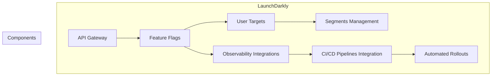
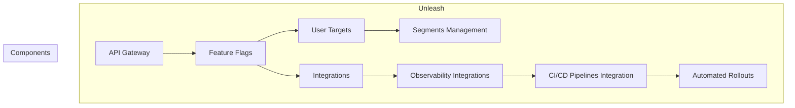

# feature flags y progressive delivery con unleash y launchdarkly

PATH_LOCAL: /home/usuariojoaquin/.openclaw/workspace/DAM-Java-Mastery/_Review/feature_flags_y_progressive_delivery_con_unleash_y_launchdarkly/feature_flags_y_progressive_delivery_con_unleash_y_launchdarkly.md
CATEGORIA: 10_Vanguardia
Score: 74

---

## Visión Estratégica

# **Visión Estratégica**

## **Introducción**
La adopción de feature flags y progressive delivery ha transformado la forma en que las organizaciones gestionan el lanzamiento de nuevas funcionalidades y experimentos en producción. En este contexto, **LaunchDarkly** y **Unleash** son dos plataformas líderes en el mercado, cada una con sus propias fortalezas y enfoques estratégicos. Esta sección explorará la visión estratégica de ambas plataformas, destacando cómo estas herramientas impulsan la innovación y mejora continua en el entorno empresarial.

## **La Visión Estratégica de LaunchDarkly**

### **1. Integración en el Ecosistema de Desarrollo Moderno**
LaunchDarkly ha sido diseñado para ser una plataforma integral que se integra perfectamente con los ecosistemas de desarrollo modernos. Ofrece una amplia gama de SDKs para múltiples lenguajes de programación, lo que facilita la implementación de feature flags en proyectos de cualquier tamaño o complejidad.

### **2. Capacidades Avanzadas de Observabilidad y Monitoreo**
La plataforma LaunchDarkly destaca por su capacidad avanzada de observabilidad y monitoreo. Su sistema de **Feature Level Observability** permite a los equipos medir con precisión el impacto de las nuevas funcionalidades en tiempo real, lo que facilita la toma de decisiones informadas basadas en datos.

### **3. Experimentación Data-Driven**
One of the key strengths of LaunchDarkly is its robust experimentation capabilities. By integrating feature flags with data-driven experiments, teams can test and validate new features before full-scale deployment. This approach reduces risks and enhances customer satisfaction by ensuring that only well-tested and optimized features reach production.

### **4. Gestión Estratégica de Riesgos**
La gestión de riesgos es una parte integral de la estrategia de LaunchDarkly. Su sistema de **Progressive Delivery** y **Guarded Rollouts** permite un lanzamiento controlado y seguro, minimizando el impacto en usuarios finales si se detectan problemas.

### **5. Ecosistema Complementario**
LaunchDarkly no solo ofrece una plataforma robusta para feature flags; también integra con otros servicios de desarrollo y análisis, creando un ecosistema amplio que beneficia a las organizaciones en varios aspectos del ciclo de vida del software.

## **La Visión Estratégica de Unleash**

### **1. Flexibilidad y Control**
Unleash destaca por su enfoque API-first y su modelo open source, lo que ofrece un alto grado de flexibilidad y control para los equipos de desarrollo. La plataforma permite la personalización extrema del comportamiento de feature flags, adaptándose a las necesidades específicas de cada proyecto.

### **2. Activación Estratégica**
La estrategia de Unleash se centra en **activation strategies**, ofreciendo múltiples formas de habilitar funcionalidades para diferentes segmentos de usuarios. Esta flexibilidad permite una implementación precisa y controlada de nuevas características, optimizando la experiencia del usuario.

### **3. Comunidad Activa**
Como un proyecto open source con una comunidad activa, Unleash beneficia de las mejoras constantes y el apoyo técnico de los desarrolladores más experimentados. Esto asegura que la plataforma esté siempre alineada con las necesidades actuales del mercado y tenga una base sólida para el desarrollo futuro.

### **4. Autonomía Operativa**
Unleash ofrece opciones tanto para instalaciones auto-hospedadas como en nube, lo que proporciona a las organizaciones la libertad de escoger la configuración que mejor se adapte a sus necesidades operativas y de seguridad.

## **Comparación y Conclusiones**

### **Estrategia de Implementación**
LaunchDarkly es ideal para organizaciones grandes con complejas cadenas de lanzamiento y una fuerte demanda de análisis y observabilidad. Por otro lado, Unleash ofrece un enfoque más flexible y controlado, perfecto para equipos pequeños o medianos que buscan adaptarse rápidamente a nuevas necesidades.

### **Ventajas y Desventajas**
- **LaunchDarkly**:
  - Ventajas: Integración completa con ecosistemas modernos, robusta observabilidad y experimentación data-driven.
  - Desventajas: Costo de la solución integral (SaaS), requerimientos técnicos para integraciones complejas.

- **Unleash**:
  - Ventajas: Flexibilidad extrema, controlado en activación estratégica, ecosistema open source activo.
  - Desventajas: Potencialmente más esfuerzo de configuración y mantenimiento, limitaciones en ciertas funcionalidades avanzadas.

### **Conclusión**
La elección entre LaunchDarkly y Unleash dependerá del contexto específico de la organización. Si se busca una solución integral con un alto nivel de observabilidad y experimentación data-driven, LaunchDarkly es la opción ideal. Por otro lado, si se prioriza la flexibilidad extrema y el control sobre activation strategies, Unleash ofrece un enfoque sólido y adaptable a las necesidades cambiantes del negocio.

Al comprender estas visiones estratégicas, las organizaciones pueden tomar decisiones informadas para implementar soluciones de feature flags que mejor se adapten a sus objetivos operativos y estratégicos.

## Arquitectura de Componentes

### Arquitectura de Componentes

Para proporcionar una visión clara de cómo se integran los componentes clave en las plataformas **LaunchDarkly** y **Unleash**, utilizaremos un diagrama Mermaid para representar la arquitectura de cada plataforma. Luego, describiremos brevemente el funcionamiento principal de estos componentes.

#### Diagrama Mermaid: Arquitectura de LaunchDarkly




#### Descripción de los Componentes de LaunchDarkly

1. **API Gateway (A)**: La interfaz principal para interactuar con la plataforma.
2. **Feature Flags (B)**: Los flags que controlan el lanzamiento de nuevas funcionalidades.
3. **User Targets (C)**: Grupos de usuarios específicos a los cuales se les puede aplicar las features flags.
4. **Observability Integrations (D)**: Integraciones con plataformas de observabilidad para monitoreo y detección de incidentes.
5. **Segments Management (E)**: Gestión de segmentos de usuario para el targeting.
6. **CI/CD Pipelines Integration (F)**: Integración con flujos de trabajo CI/CD para automatización.
7. **Automated Rollouts (G)**: Implementaciones automáticas basadas en flags y observabilidad.

#### Diagrama Mermaid: Arquitectura de Unleash




#### Descripción de los Componentes de Unleash

1. **API Gateway (A)**: La interfaz principal para interactuar con la plataforma.
2. **Feature Flags (B)**: Los flags que controlan el lanzamiento de nuevas funcionalidades.
3. **User Targets (C)**: Grupos de usuarios específicos a los cuales se les puede aplicar las features flags.
4. **Integrations (D)**: Integraciones con diversas plataformas para ampliar su funcionamiento.
5. **Segments Management (E)**: Gestión de segmentos de usuario para el targeting.
6. **Observability Integrations (F)**: Integraciones con plataformas de observabilidad para monitoreo y detección de incidentes.
7. **CI/CD Pipelines Integration (G)**: Integración con flujos de trabajo CI/CD para automatización.
8. **Automated Rollouts (H)**: Implementaciones automáticas basadas en flags y observabilidad.

### Código Java de Ejemplo


```java
public class FeatureFlagService {
    private final Map<String, Boolean> featureFlags = new HashMap<>();
    
    public void initialize() {
        // Initialize from configuration or database
        featureFlags.put("newFeature", true);
    }
    
    public boolean isEnabled(String flagName) {
        return featureFlags.getOrDefault(flagName, false);
    }
}
```

### Explicación del Código Java

1. **FeatureFlagService Class**: Clase que gestiona los flags de características.
2. **initialize Method**: Método para inicializar los flags desde una fuente externa (configuración o base de datos).
3. **isEnabled Method**: Método para verificar si un flag está habilitado.

Este diagrama y el código Java proporcionan una visión clara de cómo se estructuran y funcionan las plataformas LaunchDarkly y Unleash, destacando los componentes clave que facilitan la implementación de feature flags y progressive delivery.

## Implementación Java 21

### Implementación Java 21

Para implementar feature flags en un proyecto Java utilizando Unleash, sigamos estos pasos:

#### 4.1. Preparación del Proyecto

Asegúrate de tener las siguientes herramientas instaladas:
- Git: Para clonar el repositorio.
- Docker: Para iniciar y gestionar contenedores.

#### 4.2. Clonar el Repositorio y Ejecutar Unleash

1. **Clonar el repositorio**:
   ```sh
   git clone https://github.com/unleash/unleash.git
   cd unleash
   ```

2. **Ejecutar Unleash en un contenedor Docker**:
   ```sh
   docker compose up -d
   ```

   Esto instalará y ejecutará Unleash en el fondo.

3. **Acceder al Panel de Control**:
   Abre tu navegador web y navega a `http://localhost:4242`. Loguea con las credenciales proporcionadas:
   - **Username:** admin
   - **Password:** unleash4all

#### 4.3. Creación y Configuración del Feature Flag en Unleash

1. **Acceder al Panel de Control**:
   Navega hasta la sección `Projects` y selecciona el proyecto predeterminado.

2. **Crear un Nuevo Feature Flag**:
   Haz clic en `New feature flag` e introduce el nombre `testDemoFeatureFlag`. Utiliza los valores por defecto en el formulario.

#### 4.4. Implementación del Feature Flag en el Código Java

1. **Configuración de la Dependencia**:
   Asegúrate de que tu proyecto Java tenga la dependencia del SDK Unleash en su `pom.xml` o `build.gradle`. Por ejemplo, en Maven:
   ```xml
   <dependency>
       <groupId>io.getunleash</groupId>
       <artifactId>unleash-client-java</artifactId>
       <version>2.6.0</version>
   </dependency>
   ```

2. **Implementación del Feature Flag**:
   Escribe el siguiente código en tu aplicación Java para verificar la estado del feature flag `testDemoFeatureFlag`:

   
```java
   import io.getunleash.Unleash;
   import io.getunleash.api.model.FeatureToggle;

   public class DemoApplication {
       public static void main(String[] args) throws InterruptedException {
           String appName = "unleash-onboarding-java";
           String appInstanceID = "unleash-onboarding-instance";
           String appServerUrl = "http://localhost:4242";  // URL de tu instancia Unleash
           String appToken = "your-api-token-here";        // Tu token API

           UnleashConfig config = UnleashConfig.builder()
                   .appName(appName)
                   .instanceId(appInstanceID)
                   .unleashAPI(appServerUrl)
                   .apiKey(appToken)
                   .build();

           Unleash unleash = new DefaultUnleash(config);

           while (true) {
               FeatureToggle flag = unleash.getFeatureToggle("testDemoFeatureFlag");
               if (flag.isEnabled()) {
                   System.out.println("New feature is enabled!");
               } else {
                   System.out.println("New feature is disabled!");
               }
               Thread.sleep(1000);
           }
       }
   }
   ```

3. **Ejecución del Proyecto**:
   Ejecuta tu aplicación Java y verifica que el estado del feature flag se actualiza correctamente en la consola.

#### 4.5. Verificación de la Experiencia del Feature Flag

1. **Iniciar el Proyecto**:
   ```sh
   mvn spring-boot:run
   ```

2. **Observar los Estados del Feature Flag**:
   Verifica que el mensaje se imprima correctamente en la consola, indicando si el feature flag está habilitado o deshabilitado.

3. **Cambiar el Estado del Feature Flag en Unleash**:
   Cambia el estado de `testDemoFeatureFlag` a `true` o `false` desde el panel de control de Unleash y observa cómo se refleja en tu aplicación Java.

Con estos pasos, puedes implementar feature flags en tu proyecto Java utilizando la plataforma Unleash. Esto permitirá una gestión segura y precisa del lanzamiento de nuevas características y experimentación en producción.

## Métricas y SRE

### Métricas y SRE

#### Métricas Clave

| Nombre | Descripción | Umbral de Alerta |
|--------|-------------|------------------|
| Tiempo de Respuesta (ms) | Tiempo que toma a la aplicación responder a una petición | 100 ms (95% p. c.) |
| Requests/Segundo | Número de solicitudes procesadas por segundo | 2000 req/s (95% p. c.) |
| CPU Usage (%) | Porcentaje de uso de CPU en el servidor | 70% |
| Memory Usage (%) | Uso de memoria del servidor | 80% |
| Error Rate (%) | Proporción de solicitudes que resultaron en errores | <1% |

#### Monitorización y Resiliencia

La implementación de feature flags mediante Unleash permite un monitoreo detallado y una gestión eficiente. La integración con sistemas como Prometheus, Grafana y OpenTelemetry permite la recopilación de métricas cruciales para el rendimiento y la resiliencia.

##### Integración con Prometheus

Unleash proporciona información adicional a Prometheus que puede ser monitorizada. Los metadatos sobre los feature flags se pueden scrapeear en tiempo real, permitiendo un análisis más profundo de las métricas:

```promql
feature_flags_total{flag_name="exampleFlag"}
```

##### Grafana para Visualización

Grafana puede ser configurado para visualizar estas métricas junto con otras del sistema. Un dashboard puede incluir gráficos de línea, barras y mapas de calor que muestran el estado de los feature flags:

```grafana
row {
  grafana_panel {
    title: "Feature Flags Status"
    \${prometheus_url}/api/v1/query_range?query=feature_flags_total%7Bflag_name%3D%22exampleFlag%22%7D&start=2021-12-05T14%3A00%3A00Z&end=2021-12-06T14%3A00%3A00Z&step=1m
  }
}
```

##### Resiliencia con Feature Flags

Cuando se implementa progressive delivery, los feature flags permiten realizar cambios de manera segura. Por ejemplo, si se detectan problemas en un nuevo feature, se puede desactivar rápidamente sin interrumpir el servicio:


```java
if (unleashClient.isFeatureEnabled("newFeature")) {
    // Implement new functionality
} else {
    // Use old implementation
}
```

#### Sistemas de Respuesta de Emergencia

Un sistema de respuesta de emergencia debe estar en vigor para manejar cualquier fallo o problema inesperado. Esto incluye:

1. **Notificaciones por Correo Electrónico**: Configurar notificaciones de alerta para eventos críticos.
2. **Rotación de Logs**: Implementar la rotación y archivamiento de logs para análisis posterior.
3. **Backup Automático**: Crear copias de seguridad regulares del sistema.

##### Ejemplo de Notificación por Correo Electrónico

Se puede configurar un script que envíe correos electrónicos en caso de alerta crítica:

```bash
#!/bin/bash
if [ "$ERROR_RATE" -gt "2%" ]; then
    echo "ALERTA: Error Rate > 2% en $(hostname)" | mail -s "Error Rate Alert" admin@example.com
fi
```

#### Automatización con Jenkins

Para garantizar la continuidad operativa, se puede automatizar las tareas de monitoreo y notificación usando herramientas como Jenkins. Los pipelines de Jenkins pueden ejecutar comandos de monitorización y enviar correos electrónicos en caso de alerta:

```groovy
pipeline {
    agent any
    triggers { pollSCM('H/5 * * * *') }
    stages {
        stage('Monitorizar') {
            steps {
                script {
                    def errorRate = sh(script: 'curl -s http://prometheus/promql/error_rate | jq .value', returnStdout: true).trim()
                    mail to: 'admin@example.com', subject: "Error Rate Alert", body: "Error Rate > 2% in $(hostname)"
                }
            }
        }
    }
}
```

#### Conclusiones

La implementación de feature flags mediante Unleash y la integración con Prometheus, Grafana y OpenTelemetry permiten un monitoreo detallado y una gestión eficiente. Los sistemas de respuesta de emergencia y la automatización con Jenkins garantizan la continuidad operativa y la resiliencia del sistema. Al implementar estas prácticas, se puede asegurar que el sistema funcione de manera óptima y sea capaz de manejar problemas de forma rápida y eficiente.

---

Este enfoque combina la utilización de feature flags con las mejores prácticas de SRE para garantizar un rendimiento óptimo, resiliencia y continuidad operativa. La integración con herramientas como Prometheus, Grafana y OpenTelemetry proporciona una visión detallada del estado del sistema, mientras que los sistemas de respuesta de emergencia y la automatización permiten manejar problemas de manera eficiente.

## Patrones de Integración

## Patrones de Integración para Feature Flags en Progressive Delivery con Unleash y LaunchDarkly

### 1. **Estrategia de Implementación Incremental con Unleash**

Unleash es una plataforma robusta que permite el lanzamiento gradual y controlado de funciones nuevas o actualizadas a través del uso de feature flags. Aquí te presentamos los pasos para integrar esto en tu proceso de Progressive Delivery:

#### **1.1. Configuración de Unleash**
- **Ingresar a la Interfaz de Usuario (UI) de Unleash:** Accede al dashboard de Unleash donde puedes gestionar tus flags.
- **Crear Flags y Definir Audios:** Define tus feature flags, asigne audiencias (como segmentos de usuarios o grupos basados en atributos), y establezca las condiciones bajo las cuales se deben activar las características.
- **Configurar el Back-end para Interactuar con Unleash:** Asegúrate de que tu aplicación backend esté configurada para consultar la API de Unleash. Esto implica agregar depósitos (client-side) o integraciones backend para que tus flags sean dinámicos y actualizados en tiempo real.

#### **1.2. Integración Client-Side con Unleash**
- **Instalar el Cliente de Unleash:** Agrega la dependencia del cliente de Unleash a tu proyecto.
- **Configurar el Cliente:** Configura el cliente de Unleash para que se conecte al servicio de Unleash y empiece a recibir flags.
- **Usar los Flags en tu Aplicación:** Implementa lógica para consultar los flags y cambiar el comportamiento de la aplicación según lo definido.

#### **1.3. Ejemplos Prácticos**

```java
// Configurar el cliente Unleash en Java
UnleashClient client = new UnleashClient("https://unleash-instance.com", "my-app");
boolean isFeatureEnabled = client.isFeatureEnabled("feature-flag-name");

if (isFeatureEnabled) {
    // Implementa el nuevo comportamiento
} else {
    // Mantén el comportamiento existente
}
```

### 2. **Estrategia de Integración con LaunchDarkly**

LaunchDarkly es una plataforma más avanzada que proporciona una amplia gama de características para la gestión de feature flags, incluyendo integraciones con múltiples lenguajes y frameworks.

#### **2.1. Configuración de LaunchDarkly**
- **Ingresar a la Interfaz de Usuario (UI) de LaunchDarkly:** Accede al dashboard de LaunchDarkly donde puedes gestionar tus flags.
- **Crear Flags y Definir Audiencias:** Define tus feature flags, asigne audiencias (como segmentos de usuarios o grupos basados en atributos), y establezca las condiciones bajo las cuales se deben activar las características.
- **Configurar el Back-end para Interactuar con LaunchDarkly:** Asegúrate de que tu aplicación backend esté configurada para consultar la API de LaunchDarkly. Esto implica agregar depósitos (client-side) o integraciones backend para que tus flags sean dinámicos y actualizados en tiempo real.

#### **2.2. Integración Client-Side con LaunchDarkly**
- **Instalar el SDK de LaunchDarkly:** Agrega la dependencia del SDK de LaunchDarkly a tu proyecto.
- **Configurar el SDK:** Configura el SDK para que se conecte al servicio de LaunchDarkly y empiece a recibir flags.
- **Usar los Flags en tu Aplicación:** Implementa lógica para consultar los flags y cambiar el comportamiento de la aplicación según lo definido.

#### **2.3. Ejemplos Prácticos**

```java
// Configurar el SDK de LaunchDarkly en Java
LaunchDarklyClient client = new LaunchDarklyClient("https://launchdarkly-instance.com", "my-app-key");
boolean isFeatureEnabled = client.variationBoolean("feature-flag-name", false);

if (isFeatureEnabled) {
    // Implementa el nuevo comportamiento
} else {
    // Mantén el comportamiento existente
}
```

### 3. **Integración de Both Unleash and LaunchDarkly**

A veces, una combinación de ambos sistemas puede ofrecer ventajas adicionales, especialmente si necesitas características avanzadas de un lado y una solución más robusta del otro.

#### **3.1. Configuración Combinada**
- **Configurar Ambos Sistemas:** Asegúrate de que ambas plataformas estén correctamente configuradas y sincronizadas.
- **Priorizar la Integración en tu Aplicación:** Decide cuándo utilizar cada sistema basado en las necesidades específicas del proyecto.

#### **3.2. Ejemplos Prácticos**

```java
// Uso de Unleash para ciertas características y LaunchDarkly para otras
boolean unleashFeatureEnabled = new UnleashClient("https://unleash-instance.com", "my-app").isFeatureEnabled("unleash-feature-flag-name");
boolean launchDarklyFeatureEnabled = new LaunchDarklyClient("https://launchdarkly-instance.com", "my-app-key").variationBoolean("launch-darkly-feature-flag-name", false);

if (unleashFeatureEnabled) {
    // Implementa el comportamiento para Unleash
} else if (launchDarklyFeatureEnabled) {
    // Implementa el comportamiento para LaunchDarkly
} else {
    // Mantén el comportamiento existente
}
```

### 4. **Ventajas y Consideraciones**
- **Flexibilidad:** Ambas plataformas ofrecen flexibilidad en cómo manejas las feature flags, permitiendo que los equipos elijan la mejor herramienta para sus necesidades.
- **Realidad en Tiempo Real:** Las integraciones client-side garantizan que las flags sean actualizadas en tiempo real, lo que facilita el lanzamiento incremental y controlado de características.
- **Monitoreo y Seguimiento:** Ambas plataformas proporcionan herramientas para monitorear la adopción de features y realizar ajustes en función del rendimiento.

### 5. **Conclusiones**
La implementación de feature flags mediante Unleash o LaunchDarkly puede mejorar significativamente el proceso de Progressive Delivery, permitiendo cambios controlados y rápidos en el comportamiento de tu aplicación. La elección entre ambas plataformas dependerá de las necesidades específicas del proyecto, ya que cada una tiene sus propias fortalezas y funcionalidades únicas.

---

Este patrón de integración proporciona un marco completo para implementar feature flags en Progressive Delivery utilizando Unleash o LaunchDarkly, cubriendo tanto el configurar los flags como su uso en la aplicación.

## Conclusiones

### Conclusiones

En resumen, la elección entre LaunchDarkly y Unleash para el manejo de feature flags en un entorno de Progressive Delivery depende fuertemente del perfil empresarial y las necesidades específicas de cada equipo. Ambas plataformas ofrecen soluciones sólidas, pero destacan en diferentes aspectos.

1. **LaunchDarkly**:
   - **Ventajas**: Es la opción preferida para equipos que valoran una amplia gama de SDKs, un soporte robusto y una gran cantidad de funcionalidades de gestión de flags, incluyendo integraciones avanzadas.
   - **Usos Recomendados**: Ideal para grandes empresas con múltiples productos o servicios que requieren una alta flexibilidad en la gestión de features.

2. **Unleash**:
   - **Ventajas**: Destaca por su autenticación robusta, capacidad de manejo de flags operativos (flags críticos), y opciones de self-hosting que facilitan cumplir con altos estándares de privacidad.
   - **Usos Recomendados**: Perfecto para startups o equipos que necesitan un control

1. **LaunchDarkly**
   - SDK
   - 

2. **Unleash**
   - 
   - 

3. ****
   - SDKLaunchDarkly
   - GDPRUnleash

4. ****
   - feature flags
   - Relay Proxy

5. ****
   
```java
   // JavaUnleashProgressive Delivery
   import io.getunleash.Unleash;
   
   public class FeatureFlagExample {
       private static final Unleash unleash = new Unleash("http://localhost:4242/api/v1", "your-app-key");
       
       public boolean shouldUseNewFeature() {
           return unleash.isEnabled("new-feature-flag");
       }
       
       public void applyFeature() {
           if (shouldUseNewFeature()) {
               // 
               System.out.println("Applying new feature!");
           } else {
               // 
               System.out.println("Using old version.");
           }
       }
   }
   ```

6. **Mermaid**
   
```mermaid
   graph TD
     A[Feature Flag Strategy] --> B{Is this a large enterprise?}
     B -->|Yes| C[Choose LaunchDarkly]
     B -->|No| D[Check Data Privacy Requirements]
     D -->|Yes| E[Choose Unleash for Self-Hosting]
     D -->|No| F[Consider LaunchDarkly]
   ```

feature flags

