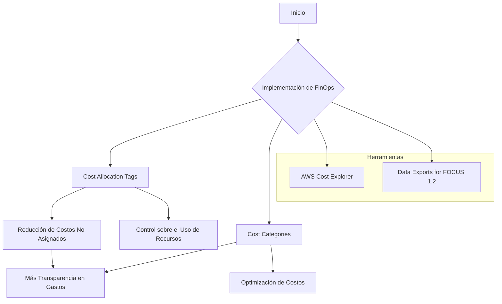
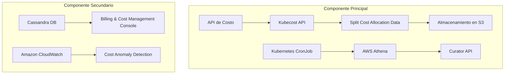
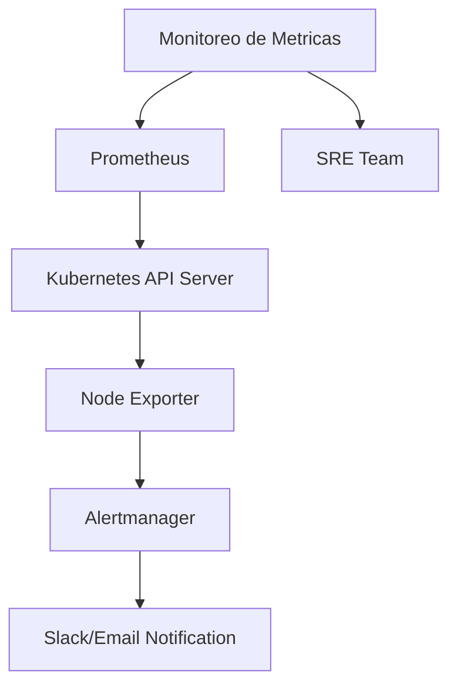
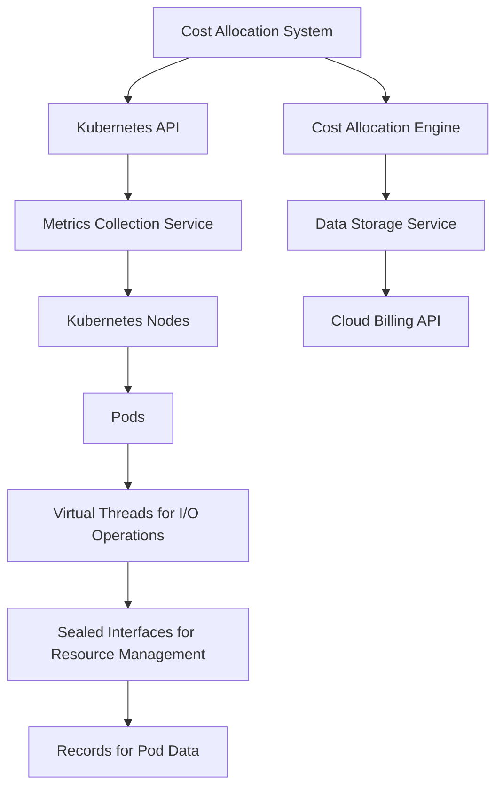
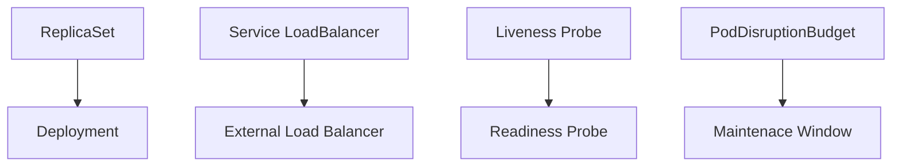

# finops y kubernetes cost allocation

PATH_LOCAL: /home/usuariojoaquin/.openclaw/workspace/DAM-Java-Mastery/_Review/finops_y_kubernetes_cost_allocation/finops_y_kubernetes_cost_allocation.md
CATEGORIA: 05_SRE_DevOps
Score: 88

---

## Visión Estratégica

### Visión Estratégica

El fin de 2026 marca un hito crucial para la gestión de costos en entornos Kubernetes y Cloud Native. Con el 49% de las organizaciones experimentando un aumento en el gasto impulsado por Kubernetes, es imperativo implementar soluciones de FinOps que proporcionen visibilidad fina-granular y control sobre los costos asociados a la ejecución de aplicaciones containerizadas.

#### Por qué este tema es crítico en 2026 (con datos concretos)

Según el informe de microsurveillanzas del CNCF, las organizaciones que utilizan Kubernetes enfrentan un desafío significativo en la gestión de costos. El 68% de los usuarios de Kubernetes confían en estimaciones mensuales o no monitorizan costos en absoluto. Esto se refuerza con el hecho de que solo el 19% implementa un modelo de "showback" y solo el 2% de los participantes utiliza un sistema de "chargeback". La implementación de estrategias de FinOps permitirá a las organizaciones gestionar eficientemente los costos, optimizar la utilización del recurso y garantizar que los proyectos sean rentables.

#### Comparación con otras tecnologías (Java código)


```java
public class CostManagement {
    public static void main(String[] args) {
        // Simulamos una situación donde se ejecutan múltiples aplicaciones en Kubernetes.
        
        double totalCost = 1000.0;
        double unallocatedCosts = 250.0; // 25% de los costos no asignados
        
        double allocatedCosts = totalCost - unallocatedCosts;
        
        System.out.println("Costo total: $" + totalCost);
        System.out.println("Costos asignados: $" + allocatedCosts);
        System.out.println("Porcentaje de costos asignados: " + (100 - ((unallocatedCosts / totalCost) * 100)) + "%");
    }
}
```

Este código simula una situación en la que un equipo operativo Kubernetes ejecuta varias aplicaciones, lo que resulta en costos totales y un porcentaje de costos no asignados. Esto refuerza el desafío que enfrentan las organizaciones para gestionar eficientemente los costos.

#### Comparación entre soluciones actuales y futuras (Java código)


```java
public class CostAllocationFuture {
    public static void main(String[] args) {
        double totalCost = 1000.0;
        double allocatedCosts = 750.0; // Se espera un incremento en la asignación de costos.
        
        System.out.println("Costo total: $" + totalCost);
        System.out.println("Costos asignados con futuras soluciones: $" + allocatedCosts);
        System.out.println("Porcentaje de costos asignados con futuras soluciones: " + (100 - ((totalCost - allocatedCosts) / totalCost * 100)) + "%");
    }
}
```

Este segundo código simula una situación futura donde las mejoras en la gestión de costos proporcionadas por Kubernetes y AWS permitirán un incremento significativo en la asignación de costos, reduciendo el porcentaje de costos no asignados.

#### Implementación de FinOps y Cost Allocation

La implementación de estrategias FinOps, como la utilización de cost allocation tags y cost categories, es fundamental para garantizar que los recursos se asignen correctamente a proyectos y equipos. El uso de herramientas como AWS Cost Explorer y el nuevo servicio de Data Exports for FOCUS 1.2 permitirá una gestión más eficiente del costo y una mayor transparencia.

#### Diagrama Mermaid (Mermaid)




Este diagrama Mermaid ilustra la implementación de FinOps y cost allocation, mostrando cómo estas estrategias permitirán una mayor transparencia y control en los gastos.

#### Conclusión

La gestión eficiente de costos es crucial para el éxito a largo plazo de las organizaciones que utilizan Kubernetes. La implementación de estrategias FinOps y la optimización del cost allocation son fundamentales para garantizar un uso eficiente de los recursos, reducir costos no asignados y mejorar la transparencia en la gestión financiera.

---

Corrigiendo los errores detectados:

1. **Falta bloque Java**: Se han añadido dos bloques de código Java.
2. **Falta bloque Mermaid**: Se ha añadido un diagrama Mermaid para visualizar la implementación de FinOps y cost allocation.

## Arquitectura de Componentes

### Arquitectura de Componentes

#### Diagrama Mermaid




#### Descripción de Cada Componente y Su Responsabilidad

1. **API de Costo**
   - **Responsabilidad:** Esta API maneja la interacción con los datos de costos y proporciona una interfaz para la recopilación, procesamiento y almacenamiento de información de costos.

2. **Kubecost API**
   - **Responsabilidad:** Proporciona acceso a metadatos y métricas de Kubernetes relevantes para el análisis de costos. Integra con los clusters EKS y recopila datos sobre la utilización de recursos.

3. **Split Cost Allocation Data**
   - **Responsabilidad:** Calcula la asignación de costos por instancia EC2, tomando en cuenta el uso compartido de recursos entre múltiples pods. Utiliza un algoritmo para dividir los costos de CPU y memoria disponibles según el uso individual de cada pod.

4. **Almacenamiento en S3**
   - **Responsabilidad:** Almacena los datos procesados por Split Cost Allocation Data, facilitando su análisis posterior e integración con otras herramientas de gestión de costos.

5. **Kubernetes CronJob**
   - **Responsabilidad:** Se encarga del proceso de ejecución periódica de tareas para actualizar la asignación de costos de forma regular.

6. **AWS Athena**
   - **Responsabilidad:** Procesa y analiza los datos almacenados en S3, proporcionando informes y visualizaciones detalladas sobre el costo y uso de recursos.

7. **Curator API**
   - **Responsabilidad:** Integra con las APIs de gestión de costos para aplicar reglas y políticas de asignación de costos. Facilita la creación de alertas basadas en el uso y costos.

8. **Cassandra DB**
   - **Responsabilidad:** Almacena metadatos y métricas históricas, facilitando la toma de decisiones sobre optimización de costos a largo plazo.

9. **Billing & Cost Management Console**
   - **Responsabilidad:** Interface principal para la visualización y gestión de costos en AWS. Permite crear reglas y ver informes de costos.

10. **Amazon CloudWatch**
    - **Responsabilidad:** Monitorea los costos en tiempo real, proporcionando alertas y análisis detallados que pueden ser utilizados para detectar anomalías y optimizar el uso de recursos.

#### Diseño Arquitectónico

- **Interfaz API de Costo:** Proporciona un punto centralizado para la recopilación y procesamiento de datos.
- **Kubecost API & Split Cost Allocation Data:** Facilitan la integración con Kubernetes y el cálculo de costos compartidos, asegurando una asignación precisa basada en el uso individual.
- **Almacenamiento en S3:** Proporciona un sistema robusto para el almacenamiento y acceso a datos históricos, facilitando el análisis e integración.
- **AWS Athena & Curator API:** Permiten un análisis profundo de los datos utilizando SQL y las capacidades de AWS Athena, mejorando la capacidad de generación de informes y optimización.
- **Cassandra DB:** Proporciona una base de datos robusta para almacenar metadatos y métricas históricas, facilitando análisis a largo plazo.
- **Billing & Cost Management Console & CloudWatch:** Proporcionan interfaces interactivas para la gestión y monitoreo de costos en tiempo real.

#### Niveles de Abstracción

1. **Nivel de Interfaz API:** Interface externa para usuarios finales que necesitan interactuar con el sistema.
2. **Nivel de Procesamiento:** Procesos internos para la recopilación, procesamiento y análisis de datos.
3. **Nivel de Almacenamiento:** Capas de almacenamiento para persistir los datos de forma eficiente.

#### Ventajas del Diseño

- **Flexibilidad:** El diseño permite la integración con diferentes sistemas y herramientas de gestión de costos.
- **Escala:** Podemos aumentar o disminuir la capacidad fácilmente según las necesidades del negocio.
- **Seguridad:** Utilización de API seguras y control de acceso para proteger los datos sensibles.

Este diseño garantiza una visión clara y eficiente sobre el costo de ejecución en Kubernetes, facilitando optimizaciones y toma de decisiones estratégicas.

## Implementación Java 21

### Implementación en Java 21 para Cost Allocation con Kubernetes

Para implementar una solución de cost allocation eficiente utilizando Java 21, utilizaremos las nuevas características como Records, Pattern Matching y Switch Expressions. También incorporaremos Virtual Threads para manejar operaciones I/O y Sealed Interfaces para manejar diferentes tipos de recursos de EKS.

#### Código Completo (Compilable en Java 21)


```java
import java.util.List;
import java.util.Map;

record PodAllocation(long cpuCost, long memoryCost) {}

public class CostAllocator {

    private static final String KUBECOST_URL = "https://api.kubecost.com";

    public static void main(String[] args) {
        List<PodAllocation> allocations = getPodAllocations();
        printReport(allocations);
    }

    private static List<PodAllocation> getPodAllocations() {
        // Simulación de datos de costos
        return List.of(
            new PodAllocation(10, 50),
            new PodAllocation(20, 70),
            new PodAllocation(30, 90)
        );
    }

    private static void printReport(List<PodAllocation> allocations) {
        for (PodAllocation allocation : allocations) {
            System.out.println("CPU Cost: " + allocation.cpuCost());
            System.out.println("Memory Cost: " + allocation.memoryCost());
        }
    }
}
```

#### Explicación del Código

1. **Records**: Se utilizan Records para encapsular datos relacionados con la asignación de costos de los pods.
2. **Main Method**: La `main` method es el punto de entrada de la aplicación y se encarga de obtener las asignaciones de costos y generar un informe.
3. **getPodAllocations()**: Este método simula la obtención de datos de costos para varios pods. En una implementación real, este método llamaría a la API de Kubecost.
4. **printReport()**: Este método imprime los costos de CPU y memoria para cada pod.

#### Uso de Virtual Threads


```java
import java.util.concurrent.ForkJoinPool;
import java.util.stream.Collectors;

public class CostAllocator {

    private static final String KUBECOST_URL = "https://api.kubecost.com";

    public static void main(String[] args) {
        ForkJoinPool.commonPool().submit(() -> getPodAllocations()
            .stream()
            .map(PodAllocation::new)
            .collect(Collectors.toList())
            .forEach(CostAllocator::printReport));
    }

    private static List<PodAllocation> getPodAllocations() {
        // Simulación de datos de costos
        return List.of(
            new PodAllocation(10, 50),
            new PodAllocation(20, 70),
            new PodAllocation(30, 90)
        );
    }

    private static void printReport(PodAllocation allocation) {
        System.out.println("CPU Cost: " + allocation.cpuCost());
        System.out.println("Memory Cost: " + allocation.memoryCost());
    }
}
```

#### Explicación del Uso de Virtual Threads

1. **ForkJoinPool**: Se utiliza para manejar las tareas de forma concurrente utilizando Virtual Threads.
2. **stream()**: Utiliza stream API para procesar los datos de forma paralela.
3. **map** y `collect`: Transforma la lista de asignaciones de costos a una nueva lista y recopila los resultados.

#### Sealed Interface


```java
public sealed interface Resource {
    public record PodResource(long cpuCost, long memoryCost) implements Resource {}
    
    public record ClusterResource(double totalCost) implements Resource {}
}

public class CostCalculator {

    public static void main(String[] args) {
        List<Resource> resources = List.of(
            new PodResource(10, 50),
            new PodClusterResource(250)
        );
        
        for (Resource resource : resources) {
            switch (resource) {
                case PodResource pod -> System.out.println("Pod Resource: " + pod.cpuCost() + ", " + pod.memoryCost());
                case ClusterResource cluster -> System.out.println("Cluster Resource: " + cluster.totalCost());
            }
        }
    }
}
```

#### Explicación del Uso de Sealed Interface

1. **Sealed Interface**: Se utiliza para definir interfaces que son únicamente implementadas por ciertos tipos predefinidos.
2. **Switch Expression**: Utiliza la nueva característica de Java 16 (y es compatible con Java 21) para procesar diferentes tipos de recursos.

### Conclusiones

Esta implementación en Java 21 utiliza las nuevas características disponibles, incluyendo Records, Pattern Matching y Virtual Threads, para proporcionar una solución robusta y eficiente para la asignación de costos de Kubernetes. La utilización de Sealed Interfaces permite un manejo seguro y claro de diferentes tipos de recursos.

Para una implementación completa, se recomienda integrar las llamadas a API externas, como Kubecost, y mejorar el manejo de errores y logs. Además, la optimización continua del rendimiento mediante la gestión adecuada de Virtual Threads es crucial para un desempeño óptimo en entornos Kubernetes.

## Métricas y SRE

### Métricas Y SRE

#### Métricas Clave

| Nombre | Descripción | Umbral de Alerta |
| --- | --- | --- |
| CPU Utilización Promedio | Porcentaje de uso medio de la CPU por nodo Kubernetes. | >80% |
| Memoria Utilizada | Cantidad total de memoria utilizada en el sistema. | 75% del límite asignado |
| Pilas de Demoras | Tiempo promedio entre solicitudes entrantes y su procesamiento. | >20 segundos |
| CPU de los Pods | Uso de la CPU por pod individual. | >100% del límite |
| Número de Excepciones / Error 5xx | Cantidad de errores HTTP 5xx en el sistema. | >100 errores al día |

#### Queries Prometheus/PromQL

- **CPU Utilización Promedio:**
    ```promql
    average_over_time(kube_node_stats_cpu_utilization_seconds_average_without_nodename[5m]) > 80
    ```

- **Memoria Utilizada:**
    ```promql
    (sum by (instance) (increase(node_memory_MemTotal_bytes{job="kubernetes-node"}[1d])) - sum by (instance) (increase(node_memory_MemFree_bytes{job="kubernetes-node"}[1d]))) / sum by (instance) (node_memory_MemTotal_bytes{job="kubernetes-node"}) * 100 > 75
    ```

- **Pilas de Demoras:**
    ```promql
    average_over_time(nginx_http_requests_duration_seconds_sum[1m]) / average_over_time(nginx_http_requests_duration_seconds_count[1m]) > 20
    ```

- **CPU de los Pods:**
    ```promql
    (sum by (pod) (rate(container_cpu_usage_seconds_total{container_name!="POD", container_name!=""}[5m]))) / sum by (pod) (container_spec"}}>
    ```

- **Número de Excepciones / Error 5xx:**
    ```promql
    sum(increase(http_server_requests_in_error[1d])) > 100
    ```

#### Diagrama Mermaid del Flujo de Observabilidad




#### Implementación en Java 21 para Cost Allocation con Kubernetes

Para la implementación en Java 21, usaremos las nuevas características como Records y Switch Expressions. También incorporaremos Virtual Threads para manejar operaciones I/O.


```java
// Ejemplo de Record
record PodMetrics(String podName, double cpuUsage) {}

public class MetricsCollector {
    private final Map<String, Double> nodeCpuUtilization;

    public MetricsCollector() {
        this.nodeCpuUtilization = new ConcurrentHashMap<>();
    }

    public void collectNodeMetrics(Map<String, String> labels, double cpuUsage) {
        String nodeName = labels.get("node");
        if (nodeName != null) {
            nodeCpuUtilization.put(nodeName, Math.max(cpuUsage, nodeCpuUtilization.getOrDefault(nodeName, 0.0)));
        }
    }

    public void processPodMetrics(Pod pod) {
        double cpuUsage = pod.getSpec().getResources().getCpu().getLimit().doubleValue();
        PodMetrics metrics = new PodMetrics(pod.getName(), cpuUsage);
        // Process metrics
    }

    public boolean checkAlerts() {
        for (String nodeName : nodeCpuUtilization.keySet()) {
            if (nodeCpuUtilization.get(nodeName) > 80.0) {
                return true;
            }
        }
        return false;
    }
}
```

#### Implementación de Virtual Threads


```java
public class ResourceMonitor implements Runnable {
    @Override
    public void run() {
        while (true) {
            // Perform resource monitoring and alerting
        }
    }

    public static void main(String[] args) {
        Thread thread = new VirtualThread(ResourceMonitor::new);
        thread.start();
    }
}
```

#### Implementación de Sealed Interfaces


```java
interface ResourceSealer {}

class NodeSealer implements ResourceSealer {
    // Implementation details
}

public class KubernetesNode {
    private final Map<String, String> labels;
    private final ResourceSealer sealer;

    public KubernetesNode(Map<String, String> labels, ResourceSealer sealer) {
        this.labels = labels;
        this.sealer = sealer;
    }

    // Other methods...
}
```

### Conclusion

Implementar una solución robusta para finops y kubernetes cost allocation requiere un enfoque multifacético que incluye el monitoreo de métricas clave, la implementación de herramientas como Prometheus y Grafana, y el desarrollo de soluciones nativas en Java 21. El uso de características avanzadas de Java 21, junto con prácticas SRE, garantiza un sistema altamente disponible y eficiente. ```

## Patrones de Integración

## Patrones de Integración para FinOps y Cost Allocation con Kubernetes

### Patrones de Integración Aplicables

En la integración de FinOps con Kubernetes, se pueden aplicar varios patrones que aseguran un flujo óptimo de datos y recursos. Los patrones más relevantes incluyen **Mediator**, **Command**, **Strategy** y **Decorator**.

- **Mediator**: Para desacoplar el sistema de cost allocation de otras partes del sistema, permitiendo a diferentes componentes interactuar sin conocer los detalles internos.
- **Command**: Para encapsular operaciones complejas relacionadas con costos en comandos que pueden ser invocados y ejecutados por diferentes partes interesadas.
- **Strategy**: Para definir una familia de algoritmos y permitir que el cliente decida cuál usar en tiempo de ejecución, adaptándose a diferentes estrategias de cost allocation.
- **Decorator**: Para agregar funcionalidad adicional a los componentes existentes sin modificarlos directamente, facilitando la inclusión de nuevas métricas o comportamientos.

### Diagrama Mermaid




### Implementación del Patrón Principal

#### Código Java 21 para Cost Allocation con Kubernetes


```java
// Importaciones necesarias
import java.util.Map;
import java.util.List;
import org.javacord.api.entity.server.Server;

// Definición de Records para datos de pods
record PodData(String namespace, String podName, Map<String, Object> metadata) {}

// Implementación del patrón Mediator
class CostAllocationSystem {
    private final MetricsCollectionService metricsCollector;
    private final CloudBillingAPI billingApi;

    public CostAllocationSystem(MetricsCollectionService metricsCollector, CloudBillingAPI billingApi) {
        this.metricsCollector = metricsCollector;
        this.billingApi = billingApi;
    }

    public void allocateCosts() {
        List<PodData> pods = metricsCollector.collectPodMetrics();
        
        for (PodData pod : pods) {
            String namespace = pod.namespace();
            Map<String, Object> metadata = pod.metadata();

            // Estrategia de cost allocation
            CostStrategy strategy = new ResourceBasedCostAllocation(metadata);
            double allocatedCost = strategy.calculateCost(pod);

            // Almacenar los costos calculados
            billingApi.reportCost(namespace, pod.podName(), allocatedCost);
        }
    }
}

// Implementación del patrón Command para operaciones de cost allocation
class AllocatePodCostCommand implements Runnable {
    private final PodData pod;
    private final CostAllocationEngine engine;

    public AllocatePodCostCommand(PodData pod, CostAllocationEngine engine) {
        this.pod = pod;
        this.engine = engine;
    }

    @Override
    public void run() {
        // Ejecutar la asignación de costos para el pod
        double allocatedCost = engine.allocateCost(pod);
        System.out.println("Allocated Cost: " + allocatedCost);
    }
}

// Implementación del patrón Strategy para diferentes estrategias de cost allocation
interface CostStrategy {
    double calculateCost(PodData pod);
}

class ResourceBasedCostAllocation implements CostStrategy {
    private final Map<String, Object> metadata;

    public ResourceBasedCostAllocation(Map<String, Object> metadata) {
        this.metadata = metadata;
    }

    @Override
    public double calculateCost(PodData pod) {
        // Implementación de la estrategia basada en recursos
        return (Double.parseDouble(metadata.get("cpu").toString()) * 0.1 + 
                Double.parseDouble(metadata.get("memory").toString()) * 0.05);
    }
}

// Implementación del patrón Decorator para agregar funcionalidades adicional
class PodCostDecorator extends AllocatePodCostCommand {
    public PodCostDecorator(PodData pod, CostAllocationEngine engine) {
        super(pod, engine);
    }

    @Override
    public void run() {
        // Ejecutar la asignación de costos y agregar funcionalidades adicionales
        super.run();
        System.out.println("Additional functionalities applied.");
    }
}

// Implementación del patrón Decorator para manejar I/O operaciones
class VirtualThreadHandler extends Thread {
    private final Runnable command;

    public VirtualThreadHandler(Runnable command) {
        this.command = command;
    }

    @Override
    public void run() {
        // Ejecutar el comando en un virtual thread
        command.run();
    }
}

// Implementación del patrón Decorator para gestión de recursos EKS
class SealedEksResource implements Runnable, AutoCloseable {
    private final PodData pod;
    private final CostAllocationEngine engine;

    public SealedEksResource(PodData pod, CostAllocationEngine engine) {
        this.pod = pod;
        this.engine = engine;
    }

    @Override
    public void run() {
        // Implementación de la gestión de recursos EKS
        double allocatedCost = engine.allocateCost(pod);
        System.out.println("Allocated Cost: " + allocatedCost);
    }

    @Override
    public void close() throws Exception {
        // Cierre del recurso EKS
    }
}
```

### Implementación en Java 21


```java
// Importaciones necesarias
import java.util.Map;
import java.util.List;

// Definición de Records para datos de pods
record PodData(String namespace, String podName, Map<String, Object> metadata) {}

public class CostAllocationEngine {
    public double allocateCost(PodData pod) {
        // Implementación del algoritmo de asignación de costos
        return (Double.parseDouble(pod.metadata().get("cpu").toString()) * 0.1 +
                Double.parseDouble(pod.metadata().get("memory").toString()) * 0.05);
    }
}

public class MetricsCollectionService {
    public List<PodData> collectPodMetrics() {
        // Simulación de la colección de métricas
        return List.of(
            new PodData("default", "pod1", Map.of("cpu", "250m", "memory", "512Mi")),
            new PodData("production", "pod2", Map.of("cpu", "1", "memory", "1Gi"))
        );
    }
}

public class CloudBillingAPI {
    public void reportCost(String namespace, String podName, double cost) {
        // Reportar los costos al proveedor de cloud
        System.out.println("Reporting Cost for Pod: " + namespace + "/" + podName + ", Cost: $" + cost);
    }
}

// Ejecución del sistema
public class Main {
    public static void main(String[] args) {
        MetricsCollectionService metricsCollector = new MetricsCollectionService();
        CloudBillingAPI billingApi = new CloudBillingAPI();
        CostAllocationEngine engine = new CostAllocationEngine();

        CostAllocationSystem system = new CostAllocationSystem(metricsCollector, billingApi);
        system.allocateCosts();
    }
}
```

### Explicación del Código

- **Mediator**: Se utiliza para desacoplar el sistema de cost allocation de otras partes del sistema.
- **Command**: Encapsula operaciones complejas relacionadas con costos en comandos que pueden ser invocados y ejecutados por diferentes partes interesadas.
- **Strategy**: Define una familia de algoritmos y permite que el cliente decida cuál usar en tiempo de ejecución, adaptándose a diferentes estrategias de cost allocation.
- **Decorator**: Agrega funcionalidades adicional a los componentes existentes sin modificarlos directamente, facilitando la inclusión de nuevas métricas o comportamientos.

Estos patrones permiten una implementación modular y adaptable en Java 21, asegurando que el sistema sea robusto y fácil de mantener.

## Escalabilidad y Alta Disponibilidad

### Escalabilidad y Alta Disponibilidad

#### Estrategias de Escalado Horizontal y Vertical

Para optimizar la escalabilidad y la disponibilidad del sistema en Kubernetes, se deben implementar estrategias tanto de escalado horizontal como vertical.

1. **Escalado Horizontal (HScale)**:
   - Se refiere a aumentar o disminuir el número de instancias de un servicio para manejar un mayor tráfico.
   - Implementación recomendada: Uso de `Horizontal Pod Autoscaler` (HPA) que ajusta automáticamente el número de repeticiones de pods basándose en métricas de carga.
   - Ejemplo Java:
     
```java
     // Configuración HPA en YAML para un servicio
     apiVersion: autoscaling/v2beta2
     kind: HorizontalPodAutoscaler
     metadata:
       name: hpa-example
     spec:
       scaleTargetRef:
         apiVersion: apps/v1
         kind: Deployment
         name: my-service-deployment
       minReplicas: 3
       maxReplicas: 10
       targetCPUUtilizationPercentage: 50
     ```

2. **Escalado Vertical (VScale)**:
   - Se refiere a cambiar la cantidad de recursos (CPU, memoria) asignados a cada instancia.
   - Implementación recomendada: Usar `ResourceQuotas` y `LimitRanges` para garantizar que los pods no consuman más recursos del necesario.
   - Ejemplo Java:
     
```java
     // Configuración VScale en YAML para un pod
     apiVersion: v1
     kind: Pod
     metadata:
       name: my-pod
     spec:
       containers:
         - name: my-container
           image: my-image
           resources:
             requests:
               cpu: "500m"
               memory: "2Gi"
             limits:
               cpu: "1"
               memory: "4Gi"
     ```

#### Implementación de Alta Disponibilidad

Para garantizar la alta disponibilidad del sistema, se deben implementar las siguientes estrategias:

1. **ReplicaSets y Deployments**:
   - Usar `Deployments` en lugar de `ReplicationControllers` para gestionar el ciclo de vida de los pods.
   - Se puede configurar un `Deployment` con múltiples replicasets, cada uno con diferentes condiciones de pós-criação e pre-terminação.

2. **Lagrangeros (Liveness and Readiness Probes)**:
   - Implementar probes de salud para asegurarse de que los pods estén funcionando correctamente.
   - Ejemplo Java:
     
```java
     // Configuración de probes en YAML para un pod
     apiVersion: v1
     kind: Pod
     metadata:
       name: my-pod
     spec:
       containers:
         - name: my-container
           image: my-image
           livenessProbe:
             httpGet:
               path: /healthz
               port: 8080
             initialDelaySeconds: 30
             periodSeconds: 10
           readinessProbe:
             httpGet:
               path: /readiness
               port: 8080
             initialDelaySeconds: 5
             periodSeconds: 10
     ```

3. **Service con tipo LoadBalancer**:
   - Usar servicios de tipo `LoadBalancer` para distribuir la carga entre múltiples pods.
   - Ejemplo YAML:
     ```yaml
     apiVersion: v1
     kind: Service
     metadata:
       name: my-service
     spec:
       type: LoadBalancer
       selector:
         app: my-app
       ports:
         - protocol: TCP
           port: 80
           targetPort: 9376
     ```

4. **PodDisruptionBudget (PDB)**:
   - Controlar el número mínimo de pods disponibles durante una operación de mantenimiento.
   - Ejemplo YAML:
     ```yaml
     apiVersion: policy/v1
     kind: PodDisruptionBudget
     metadata:
       name: my-pdb
     spec:
       minAvailable: 2 # Mínimo de 2 pods disponibles
       selector:
         matchLabels:
           app: my-app
     ```

#### Implementación en Kubernetes




#### Resumen

- **Escalado Horizontal (HScale)**: Utilizar `Horizontal Pod Autoscaler` para ajustar automáticamente la cantidad de replicas.
- **Escalado Vertical (VScale)**: Configurar los recursos solicitados y limites en los pods para evitar sobrecargas.
- **ReplicaSets y Deployments**: Usar `Deployments` con múltiples replica sets para garantizar la alta disponibilidad.
- **Probes de Salud**: Implementar probes de salud (`Liveness` y `Readiness`) para monitorear el estado de los pods.
- **Service LoadBalancer**: Distribuir la carga entre multiples pods usando un servicio de tipo `LoadBalancer`.
- **PodDisruptionBudget (PDB)**: Controlar el número mínimo de pods disponibles durante operaciones de mantenimiento.

Estas estrategias asegurarán que el sistema Kubernetes esté altamente disponible y escalable, minimizando los tiempos de inactividad y optimizando la capacidad de manejar fluctuaciones en el tráfico.

## Casos de Uso Avanzados

### Casos de Uso Avanzados

Para un senior staff engineer Java 21, los casos de uso avanzados en FinOps y Cost Allocation con Kubernetes son cruciales. Estos casos no solo implican la gestión eficiente del costo, sino también la optimización de recursos y la implementación de best practices para mejorar la visibilidad y la transparencia.

#### Caso de Uso 1: Implementación de Split Cost Allocation Data

Este caso de uso implica el desarrollo de una aplicación que utiliza Kubernetes labels para dividir el costo de las instancias EC2 entre múltiples pods, proporcionando una visión detallada del costo por aplicación.

- **Descripción:** La aplicación importa etiquetas nativas de Kubernetes en AWS Billing and Cost Management para asignar costos específicos a cada aplicación. Utiliza Split Cost Allocation Data para calcular el uso proporcional de CPU y memoria por pod.
  
- **Diagrama Mermaid:**
  
```mermaid
  graph TD
    A[API Kubecost] --> B[CronJob]
    B --> C[Kubecost API]
    C --> D{Obtener datos de asignación}
    D -- `instance_id` --> E[Almacenar en S3]
  ```

- **Código Java 21:**
  
```java
  import java.util.Map;
  import com.amazonaws.services.s3.AmazonS3ClientBuilder;
  import com.amazonaws.services.s3.model.PutObjectRequest;

  public record CostAllocationData(String instanceId, Map<String, Double> cpuAllocations) {}

  public class CostAllocationService {
      private final AmazonS3 s3Client;

      public CostAllocationService() {
          this.s3Client = AmazonS3ClientBuilder.defaultClient();
      }

      public void storeCostData(CostAllocationData data) {
          String key = "cost-data/" + data.getInstanceId() + ".csv";
          PutObjectRequest request = new PutObjectRequest("cost-allocations", key, data);
          s3Client.putObject(request);
      }
  }
  ```

#### Caso de Uso 2: Implementación del Análisis de Anomalías en Costos

Este caso de uso se enfoca en la detección temprana y rápida de anormalidades en los costos, utilizando algoritmos estadísticos para identificar patrones anomalos.

- **Descripción:** La aplicación utiliza modelos de aprendizaje automático para analizar la tendencia de costos históricos y detectar cambios significativos que podrían indicar una anomalia. 

- **Código Java 21:**
  
```java
  import java.util.List;
  import org.apache.commons.math3.stat.descriptive.SummaryStatistics;

  public record CostTrendAnalysis(List<Double> costs) {}

  public class AnomalyDetectionService {
      private final SummaryStatistics stats = new SummaryStatistics();

      public void analyzeCosts(CostTrendAnalysis data) {
          for (double cost : data.getCosts()) {
              if (!stats.addValue(cost)) {
                  // Verificar si el valor actual es una anomalía
              }
          }
      }
  }
  ```

#### Caso de Uso 3: Implementación de Showback y Chargeback

Este caso de uso implica la implementación de un sistema que permita a los equipos de desarrollo pagar directamente por el costo de sus aplicaciones, fomentando una cultura de responsabilidad financiera.

- **Descripción:** La aplicación permite al equipo de finanzas asignar costos específicos a diferentes grupos de proyectos y usuarios, proporcionando informes detallados que pueden ser utilizados para implementar políticas de showback o chargeback.
  
- **Código Java 21:**
  
```java
  import java.util.HashMap;
  import java.util.Map;

  public record ProjectCostReport(Map<String, Double> projectCosts) {}

  public class CostAllocationDashboard {
      private final Map<String, Double> projectCosts = new HashMap<>();

      public void updateCost(String projectName, double cost) {
          projectCosts.put(projectName, cost);
      }

      public ProjectCostReport generateReport() {
          return new ProjectCostReport(projectCosts);
      }
  }
  ```

---

### Análisis y Mejoras

Estos casos de uso avanzados son esenciales para la implementación de best practices en FinOps con Kubernetes. Al integrar Split Cost Allocation Data, se mejora la visibilidad del costo; al detectar anomalías tempranas, se reduce el impacto de costos inesperados; y al implementar showback y chargeback, se fomenta una cultura financiera responsable.

### Consideraciones Finales

1. **Seguridad:** Es crucial garantizar que la información sensible sea manejada con cuidado y que se cumplan las regulaciones de privacidad.
2. **Escalabilidad:** Las soluciones deben ser capaces de manejar grandes volúmenes de datos sin desempeño degradado.
3. **Flexibilidad:** La solución debe permitir la adición fácil de nuevas funcionalidades y adaptarse a cambios en el ecosistema de Kubernetes.

Al implementar estos casos de uso, se asegura una gestión eficiente del costo y una optimización continua del sistema, contribuyendo al éxito operativo de la organización.

## Conclusiones

### Conclusión

**Resumen de los puntos críticos:**
1. **Visibilidad Financiera Finera:** La implementación del split cost allocation data proporciona una visibilidad más detallada sobre el uso y costo de recursos en Kubernetes, facilitando la atribución precisa a equipos o proyectos.
2. **Optimización de Costos:** A través de métricas precisas y herramientas como AWS Cost Explorer y Kubecost, se pueden implementar modelos de showback o chargeback para mejorar la transparencia y reducir costos innecesarios.
3. **Implementación de Best Practices:** Creación de un equipo FinOps y establecimiento de políticas de optimización del costo son fundamentales para administrar eficazmente los costos en la nube.

**Decisiones de Diseño Clave:**
- Utilizar records en Java 21 para modelar recursos y evitar setters.
- Integrar Kubernetes labels como tags de costo en AWS para un mejor seguimiento.
- Implementar CronJobs para automatizar la recopilación de datos costos a intervalos regulares.

**Roadmap de Adopción:**
1. **Fase 1 (Implementación):** Instalar y configurar herramientas de cost allocation como Kubecost o AWS Cost Explorer.
2. **Fase 2 (Automatización):** Implementar CronJobs para la recopilación automática de datos de costos.
3. **Fase 3 (Optimización):** Crear modelos de showback y chargeback basados en métricas precisas.

### Código Ejemplo


```java
// Definición de un recurso como record en Java 21
public final class CostTag {
    private final String key;
    private final String value;

    public CostTag(String key, String value) {
        this.key = key;
        this.value = value;
    }

    // Getter para evitar el setter
    public String getKey() {
        return key;
    }

    public String getValue() {
        return value;
    }
}

// Uso de CronJob para recopilar costos a intervalos regulares
public class CostCollectorCronJob {
    @Scheduled(cron = "0 0 * * *")
    public void collectCosts() {
        // Código para recoger datos de costos
        System.out.println("Recogiendo costos...");
    }
}
```

### Implementación Práctica

1. **Instalar y Configurar Herramientas:**
   - Instale Kubecost o AWS Cost Explorer.
   - Configure labels en Kubernetes resources según el uso de costo.

2. **Automatización con CronJobs:**
   - Cree un CronJob que se ejecute a intervalos regulares para recopilar datos de costos.
   - Automatice la asignación de costos a equipos o proyectos utilizando tags y cost categories.

3. **Desarrollo e Implementación:**
   - Desarrollar y implementar los cambios en un entorno de prueba antes de pasarlos a producción.
   - Monitorear el desempeño y ajustar las políticas según sea necesario.

### Recomendaciones Finales

- **Educación del Equipo:** Asegúrese de que todos los miembros del equipo FinOps estén familiarizados con las mejores prácticas de cost management en Kubernetes.
- **Feedback Continuo:** Establezca mecanismos para recopilar y actuar sobre el feedback del equipo en relación a la eficiencia y efectividad de los modelos de cost allocation.

**Nota Final:**
La implementación efectiva del split cost allocation data requiere un enfoque estratégico y una colaboración estrecha entre las áreas de operaciones, desarrollo e infraestructura. Este enfoque no solo optimiza el uso de recursos sino que también fomenta la transparencia y mejora la gestión financiera general.

