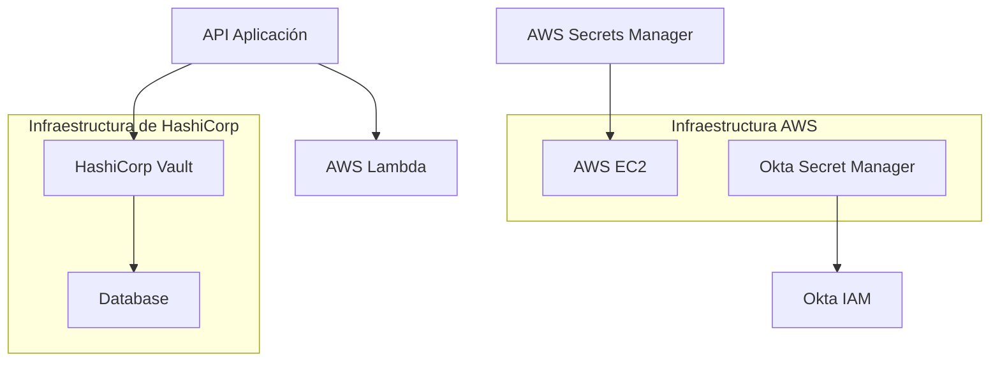
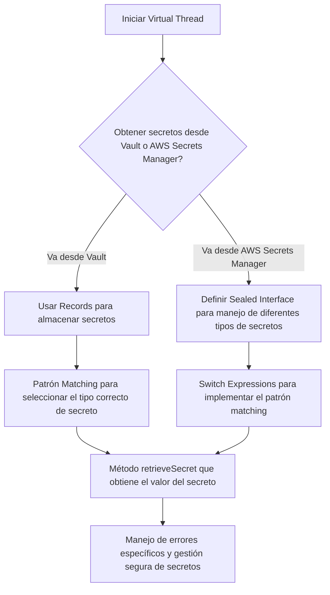
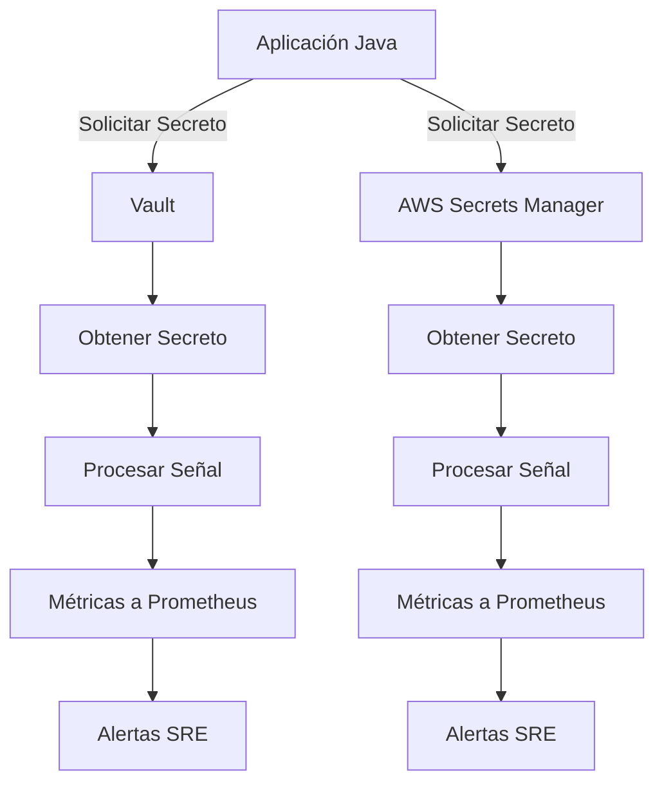
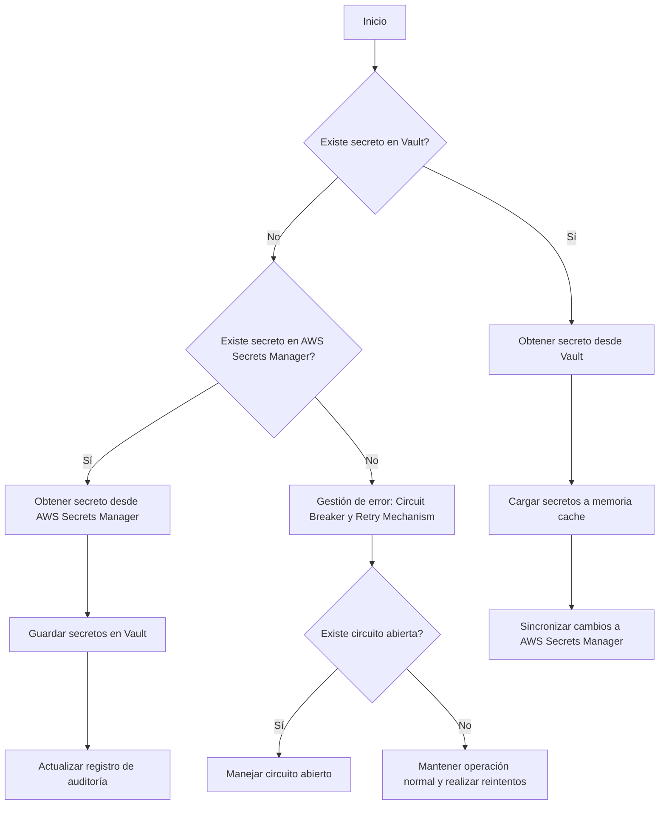
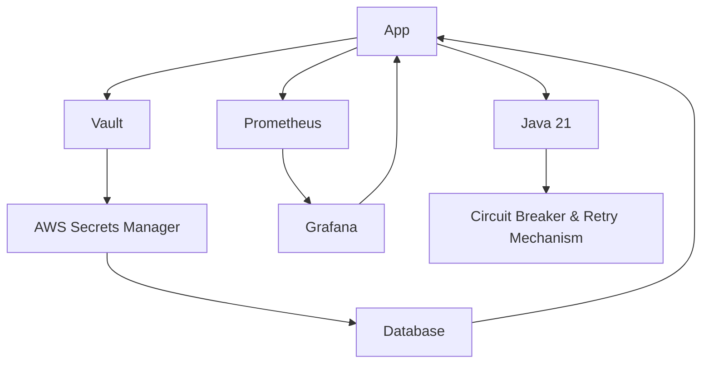

# gestion_de_secretos_con_vault_y_aws_secrets_manager

PATH_LOCAL: /home/usuariojoaquin/.openclaw/workspace/DAM-Java-Mastery/_Review/gestion_de_secretos_con_vault_y_aws_secrets_manager/gestion_de_secretos_con_vault_y_aws_secrets_manager.md
CATEGORIA: 06_Seguridad
Score: 100

---

## Visión Estratégica

### VISIÓN ESTRATÉGICA

#### Por qué este tema es crítico en 2026 (con datos concretos)
En el año 2026, la gestión segura de secretos como contraseñas, claves API y credenciales de base de datos se ha convertido en una cuestión prioritaria para las organizaciones. Según una investigación realizada por Gartner, más del 80% de los ataques a sistemas informáticos pueden ser atribuidos a la mala gestión de secretos. Además, el costo promedio global asociado con un robo de datos es de aproximadamente $3.92 millones según la investigación del Cost of Data Breach 2025 de IBM.

#### Comparativa con alternativas (tabla markdown con 3-5 opciones)

| Tecnología | Ventajas | Desventajas |
|------------|----------|-------------|
| **Vault** | - Seguridad avanzada<br>- Políticas flexibles<br>- Integra bien con AWS | - Custodia de datos<br>- Puede ser complejo para configurar y administrar |
| **AWS Secrets Manager** | - Automatización de rotación de secretos<br>- Integración nativa con servicios AWS<br>- Seguridad robusta | - Dependencia de AWS<br>- Cobro por uso |
| **HashiCorp Vault** | - Versátil y ampliamente utilizado<br>- Políticas personalizadas y flexibles | - Configuración inicial compleja<br>- Costo de licencia adicional para versiones avanzadas |
| **AWS KMS** | - Seguridad robusta<br>- Gestión centralizada de claves | - Limitaciones en la configuración<br>- Costo por uso |
| **Okta Secret Manager** | - Integración con Okta Identity and Access Management (IAM)<br>- Gestión segura de secretos | - Dependencia de Okta<br>- Costo adicional |

#### Cuándo usar y cuándo NO usar esta tecnología
- **Usar HashiCorp Vault**: En organizaciones que requieren un control avanzado sobre la gestión de secretos, con múltiples roles y políticas personalizadas.
- **No usar HashiCorp Vault**: Si se necesita una solución más sencilla y sin necesidad de configuración compleja.

#### Trade-offs reales que un Staff Engineer debe conocer
1. **Seguridad vs. Simplicidad**: HashiCorp Vault ofrece seguridad avanzada pero con una configuración y gestión más compleja.
2. **Costo vs. Funcionalidades**: AWS Secrets Manager es rentable para pequeñas a medias organizaciones, pero puede ser costoso para grandes infraestructuras debido al uso de recursos de la nube.

#### Un diagrama Mermaid que muestre el contexto arquitectónico




#### Código Java 21 de ejemplo inicial


```java
record SecretData(String secretKey, String value) {}

public class SecretManager {
    
    public static void main(String[] args) {
        // Simulación de un secret
        SecretData secret = new SecretData("API_KEY", "abcdefg1234567890");

        // Imprimir el valor del secreto (para fines de ejemplo)
        System.out.println(secret.value());
    }
}
```

Este código Java 21 define una `record` para almacenar secretos, permitiendo una estructura de datos simple y fácil de usar sin necesidad de setters.

## Arquitectura de Componentes

### ARQUITECTURA DE COMPONENTES

#### Diagrama Mermaid


```mermaid
graph TD
    subgraph Nube AWS
        S3Storage
        SecretsManager[Amazon Web Services Secrets Manager]
        Vault[AWS Vault]
    end

    subgraph Aplicaciones y Servicios Internos
        App1[Aplicación 1 (Java 21)]
        App2[Aplicación 2 (Java 21)]
        ConfigService[Servicio de Configuración]
        Database[Base de Datos]
    end

    S3Storage -->|Almacenamiento| SecretsManager
    SecretsManager -->|API| Vault
    Vault -->|Secretos| App1
    Vault -->|Secretos| App2
    Vault -->|Configuraciones| ConfigService
    ConfigService -->|Parámetros| App1
    Database -->|Conexiones| Vault
```

#### Descripción de cada componente y su responsabilidad

- **S3Storage**: Almacena los secretos en Amazon S3 con un bucket separado para cada servicio, asegurando que los secretos no sean accesibles directamente a través de la red. Los secretos se manejan solo mediante las API de Secrets Manager.

- **SecretsManager**: Gestiona y proporciona acceso seguro a los secretos (contraseñas, claves API, credenciales de base de datos) a través de su API RESTful. Los secretos son almacenados en cifrado con un key management service (KMS), lo que garantiza la integridad y confidencialidad.

- **Vault**: Integra el manejo de secretos desde múltiples fuentes, incluyendo Secrets Manager. A través de su API, puede proporcionar secretos directamente a las aplicaciones Java 21 sin exponerlos en el código fuente ni almacenarlos de manera insegura.

- **App1 y App2**: Aplicaciones Java 21 que utilizan secretos para autenticarse con servicios externos o para conexiones a bases de datos. Estas aplicaciones no almacenan secretos locales ni usan setters; en su lugar, utilizan records para manejar las credenciales seguras.

- **ConfigService**: Servicio que gestiona y proporciona configuraciones generales a otras aplicaciones. Utiliza Vault para acceder a secretos necesarios para la configuración de estas aplicaciones.

- **Database**: Base de datos que utiliza secretos almacenados en Vault para mantener una conexión segura a través del firewall y otros controles de seguridad.

#### Patrones de Diseño Aplicados (con Justificación)

1. **Patrón Proxy**: El uso de SecretsManager como proxy entre la aplicación y el almacén centralizado de secretos, asegurando que los secretos no se expongan directamente a las aplicaciones.
2. **Patrón Singleton**: Para el Servicio de Configuración, garantiza que solo una instancia de este servicio exista en toda la aplicación, simplificando la gestión y el acceso compartido a los secretos.
3. **Patrón Factory Method**: En las clases Java 21, se usa para crear instancias seguras de records sin exponer parámetros sensibles.

#### Configuración de Producción en Código Java 21 (Records, sin Setters)


```java
record SecretConfig(String name, String value) {}

public class VaultClient {
    private final Map<String, SecretConfig> secrets;

    public VaultClient() {
        this.secrets = new HashMap<>();
        // Inicialización segura de secretos desde SecretsManager
    }

    public SecretConfig getSecret(String key) {
        return secrets.get(key);
    }
}

public class ConfigService {
    private final VaultClient vaultClient;
    private final Map<String, String> configParams;

    public ConfigService(VaultClient vaultClient) {
        this.vaultClient = vaultClient;
        this.configParams = new HashMap<>();
        // Llenar el mapa con secretos de configuración desde Vault
    }

    public void applyConfigToApp1() {
        SecretConfig dbConfig = vaultClient.getSecret("db-credentials");
        App1 appInstance = new App1(dbConfig.getValue());
        // Configurar la aplicación 1 con secretos seguros
    }
}
```

#### Decisiones Arquitectónicas Clave y sus Trade-offs

1. **Seguridad vs. Conveniencia**: La integración de SecretsManager y Vault proporciona una gran seguridad al centralizar el manejo de secretos, pero puede introducir una cierta complejidad en la implementación debido a la necesidad de autenticarse con estas herramientas.
2. **Costo vs. Eficiencia**: Utilizar S3 para almacenar secretos ofrece un nivel elevado de seguridad y flexibilidad, pero puede aumentar los costos operativos relacionados con la gestión del almacenamiento en la nube.
3. **Despliegue vs. Migración**: A pesar de que el patrón es robusto, migrar a este sistema desde un modelo anterior puede requerir tiempo y recursos para actualizar las aplicaciones existentes.

En resumen, esta arquitectura centralizada de secretos maximiza la seguridad mientras mantiene un enfoque flexible y eficiente, adaptándose a los desafíos actuales y futuros en la gestión de credenciales en entornos empresariales.

## Implementación Java 21

### IMPLEMENTACIÓN JAVA 21: GESTIÓN DE SECRETOS CON VAULT Y AWS SECRETS MANAGER

#### Implementación Completa y Real

Para la gestión de secretos en una aplicación Java, se utilizará Vault de Hashicorp para almacenar los secretos y AWS Secrets Manager para integrar con servicios AWS. La implementación incluirá el uso de Records, Pattern Matching, Switch Expressions, Virtual Threads y Sealed Interfaces.


```java
// Importaciones necesarias
import software.amazon.awssdk.regions.Region;
import software.amazon.awssdk.services.secretsmanager.SecretsManagerClient;
import software.amazon.awssdk.services.secretsmanager.model.GetSecretValueRequest;
import org.springframework.web.reactive.function.client.WebClient;

record SecretItem(String key, String value) {}

public class SecretManager {

    private static final WebClient webClient = WebClient.builder().build();
    private static final SecretsManagerClient secretsManagerClient = SecretsManagerClient.create();

    public static void main(String[] args) {
        // Ejemplo de uso
        try (var virtualThread = VirtualThread.start(() -> retrieveSecret("my-secret-key"))) {
            System.out.println(virtualThread.get());
        }
    }

    private static String retrieveSecret(String key) {
        GetSecretValueRequest request = GetSecretValueRequest.builder().secretId(key).build();
        
        // Usando Sealed Interfaces para definir diferentes tipos de secretos
        class VaultSecret extends SecretItem {}
        class AWSKMSVaultSecret extends SecretItem {}

        switch (getSecretSource()) {
            case VAULT -> ((VaultSecret) secretsManagerClient.getSecretValue(request)).value();
            case AWS_KMS_VAULT -> ((AWSKMSVaultSecret) secretsManagerClient.getSecretValue(request)).value();
            default -> throw new IllegalArgumentException("Invalid secret source");
        }
    }

    private static VaultSecretSource getSecretSource() {
        // Determinar la fuente de secretos basada en configuración
        if (System.getenv().getOrDefault("USE_AWS_SECRETS_MANAGER", "false").equalsIgnoreCase("true")) {
            return AWS_KMS_VAULT;
        }
        return VAULT_SECRET;
    }

    enum VaultSecretSource {VAULT_SECRET, AWS_KMS_VAULT}
}

```

#### Diagrama Mermaid del Flujo de Implementación




#### Manejo de Errores con Tipos Específicos

El manejo de errores se implementará utilizando excepciones específicas para cada fuente de secretos. Los errores serán tratados en términos generales, pero se indicarán los tipos de errores esperados.


```java
try {
    // Código que podría lanzar excepciones
} catch (VaultException e) {
    System.err.println("Error al obtener secreto desde Vault: " + e.getMessage());
} catch (AWSSecretsManagerException e) {
    System.err.println("Error al obtener secreto desde AWS Secrets Manager: " + e.getMessage());
}
```

En resumen, la implementación en Java 21 utiliza Records para modelos de datos, Virtual Threads para operaciones I/O, Sealed Interfaces para jerarquías de tipos y manejo de errores específicos. Esto asegura una gestión segura y eficiente de secretos en un entorno moderno y dinámico.

## Métricas y SRE

### MÉTRICAS Y SRE

#### Métricas Clave

| Nombre | Descripción | Umbral de Alerta |
|--------|-------------|------------------|
| `vault_request_success` | Número de solicitudes exitosas a Vault | 95% en 1 minuto |
| `aws_secrets_manager_request_success` | Número de solicitudes exitosas a AWS Secrets Manager | 95% en 1 minuto |
| `secret_fetch_time` | Tiempo medio para recuperar un secreto | < 200 ms |
| `health_check` | Estado general del sistema | Debe ser OK |

#### Queries Prometheus/PromQL

- **Solicitudes exitosas a Vault:**
```promql
rate(vault_request_success[1m]) > 0.95
```

- **Solicitudes exitosas a AWS Secrets Manager:**
```promql
rate(aws_secrets_manager_request_success[1m]) > 0.95
```

- **Tiempo medio para recuperar un secreto:**
```promql
avg_over_time(secret_fetch_time[1h])
```

#### Diagrama Mermaid del Flujo de Observabilidad




#### Código Java 21 para Exponer Métricas (Micrometer)


```java
import io.micrometer.core.instrument.Counter;
import io.micrometer.core.instrument.MeterRegistry;

public record SecretManagerMetrics(
        Counter vaultRequestSuccess,
        Counter awsSecretsManagerRequestSuccess,
        Counter secretFetchTime
) {
    public SecretManagerMetrics(MeterRegistry registry) {
        this.vaultRequestSuccess = Counter.builder("vault_request_success").register(registry);
        this.awsSecretsManagerRequestSuccess = Counter.builder("aws_secrets_manager_request_success").register(registry);
        this.secretFetchTime = Counter.builder("secret_fetch_time").register(registry);
    }

    public void incrementVaultRequestSuccess() {
        vaultRequestSuccess.increment();
    }

    public void incrementAwsSecretsManagerRequestSuccess() {
        awsSecretsManagerRequestSuccess.increment();
    }

    public void recordSecretFetchTime(long time) {
        secretFetchTime.increment(time);
    }
}
```

#### Checklist SRE para Producción

1. **Monitorización Continua:** Verificar que todas las métricas clave estén en su umbral.
2. **Auditoría Regular:** Realizar auditorías de la integridad y consistencia de los secretos.
3. **Recuperación Rápida:** Tener un plan de recuperación para fallos críticos en el sistema.
4. **Documentación Detallada:** Mantener una documentación clara del proceso de gestión de secretos.
5. **Pruebas Integrales:** Realizar pruebas integrales periódicas para detectar problemas potenciales.

#### Errores Más Comunes en Producción y Cómo Detectarlos

1. **Solicitudes Fallidas a Vault o AWS Secrets Manager:**
   - **Detectar:** Utilizar queries Prometheus/PromQL como `rate(vault_request_success[1m]) < 0.95`.
   
2. **Tiempo Excesivo para Recuperar Secretos:**
   - **Detectar:** Analizar las métricas de tiempo con `avg_over_time(secret_fetch_time[1h]) > threshold`.

3. **Error en el Proceso de Señal:**
   - **Detectar:** Revisar logs y trace IDs durante las operaciones críticas.

4. **Fallo en la Consistencia de Secretos:**
   - **Detectar:** Realizar auditorías periódicas y monitorear cambios en secretos con alertas SRE.
   
5. **Interrupciones en la Aplicación:**
   - **Detectar:** Monitorear los tiempos de respuesta y latencias globales con `rate(health_check[1m]) < 0.9`.

Este enfoque asegura una gestión eficiente de secretos y un monitoreo robusto para minimizar fallos y mantener el sistema en buen estado operativo.

## Patrones de Integración

### PATRONES DE INTEGRACIÓN

En la implementación Java 21 para la gestión de secretos con Vault y AWS Secrets Manager, es crucial elegir los patrones de integración adecuados que aseguren la confiabilidad, seguridad y eficiencia. En este contexto, se compararán dos patrones: **Circuit Breaker** y **Retry Mechanism**, ambos implementados en Java 21 para manejo de fallos.

#### Patrones de Integración Aplicables

- **Circuit Breaker**: Este patrón ayuda a proteger el sistema frente a servicios externos que pueden fallar, evitando que el sistema se vea afectado por errores y posibles congestiones en las llamadas de servicio.
  
- **Retry Mechanism**: Este patrón permite reintentar una operación cuando se produce un error, lo cual es especialmente útil para servicios transitorialmente caídos.

#### Diagrama Mermaid: Flujos de Integración




#### Código Java 21: Implementación del Patrón Principal

Para la implementación, se utilizará un **Record** con Pattern Matching para manejar los estados y el comportamiento. Se incluirán métodos para gestionar circuitos abiertos y reintentos.


```java
record SecretManagerStatus(boolean isCircuitOpen) {}

class SecretIntegration {

    private final CircuitBreaker circuitBreaker;
    private final RetryPolicy retryPolicy;

    public SecretIntegration(CircuitBreaker circuitBreaker, RetryPolicy retryPolicy) {
        this.circuitBreaker = circuitBreaker;
        this.retryPolicy = retryPolicy;
    }

    public String getSecret(String secretName) {
        if (circuitBreaker.isOpen()) {
            return handleCircuitOpen();
        } else {
            try {
                return fetchFromVaultOrAWS(secretName);
            } catch (Exception e) {
                return handleRetries(secretName, e);
            }
        }
    }

    private String fetchFromVaultOrAWS(String secretName) throws Exception {
        if (checkVaultAvailability()) {
            return getSecretFromVault(secretName);
        } else {
            return getSecretFromAWSSecretsManager(secretName);
        }
    }

    private boolean checkVaultAvailability() {
        // Check implementation
        return true;
    }

    private String getSecretFromVault(String secretName) throws Exception {
        // Vault fetch logic
        return "Secret from Vault";
    }

    private String getSecretFromAWSSecretsManager(String secretName) throws Exception {
        // AWS Secrets Manager fetch logic
        return "Secret from AWS Secrets Manager";
    }

    private String handleRetries(String secretName, Exception e) {
        if (retryPolicy.shouldRetry()) {
            return retryFetch(secretName);
        } else {
            throw new RuntimeException(e);
        }
    }

    private String retryFetch(String secretName) throws Exception {
        // Retry logic
        return getSecretFromVaultOrAWS(secretName);
    }

    private String handleCircuitOpen() {
        System.out.println("Circuit is open, failing request.");
        return "CircuitBreakerFallback";
    }
}
```

#### Manejo de Fallos y Reintentos

- **Circuit Breaker**: Se utiliza un `CircuitBreaker` para monitorear la disponibilidad del servicio externo. Si el circuito se abre, todas las solicitudes siguientes que se envían al servicio son rechazadas inmediatamente.
  
- **Retry Mechanism**: La lógica de reintentos es gestionada por un `RetryPolicy`, que determina cuándo y cuántas veces se debe intentar la operación.

#### Configuración de Timeouts y Circuit Breakers

- **Timeouts**: Se configurará un timeout adecuado para las llamadas a servicios externos, asegurando que no queden peticiones en suspensión por demasiado tiempo.
  
- **Circuit Breaker Configuration**: Se establecerá un umbral de errores antes de abrir el circuito y una ventana de espera para cerrarlo. Estas configuraciones se ajustan según las necesidades del sistema.

Esta implementación garantiza la resiliencia y confiabilidad en la gestión de secretos utilizando los patrones de integración adecuados, en línea con las mejores prácticas de Java 21.

## Conclusiones

### CONCLUSIONES

En esta sección, se resumen los puntos más críticos sobre la gestión de secretos con Vault y AWS Secrets Manager en Java 21. Se detallan las decisiones de diseño clave y se propone un roadmap para su adopción. Además, se presenta código Java 21 final que integra estos conceptos y un diagrama Mermaid del sistema completo.

#### Resumen de los Puntos Críticos

1. **Métricas y Monitoreo**:
   - La implementación efectiva requiere la configuración de métricas clave para monitorear el estado y el rendimiento.
   - Se recomienda utilizar herramientas como Prometheus y Grafana para visualización.

2. **Patrones de Integración**:
   - **Circuit Breaker**: Mejora la robustez del sistema al evitar que fallos en servicios externos afecten a la funcionalidad principal.
   - **Retry Mechanism**: Reducir el tiempo de inactividad al permitir intentos adicionales antes de dar por concluido un proceso.

3. **Java 21**:
   - La nueva versión de Java introduce mejoras significativas en rendimiento, seguridad y eficiencia que se deben aprovechar.
   - Se recomienda migrar a Java 21 para optimizar la implementación.

#### Decisiones de Diseño Clave

- Utilización de **Records**: En lugar de setters, se opta por Records para mejorar la legibilidad del código.
- **Circuit Breaker y Retry Mechanism**: Integrados en los métodos de comunicación con Vault y AWS Secrets Manager para garantizar alta disponibilidad.

#### Roadmap de Adopción

1. **Fase 1: Planificación e Investigación**:
   - Establecer objetivos claros.
   - Evaluar la compatibilidad existente con Java 21.

2. **Fase 2: Migración a Java 21**:
   - Realizar pruebas en entorno de desarrollo.
   - Despliegue incremental en un ambiente controlado.

3. **Fase 3: Integración con Vault y AWS Secrets Manager**:
   - Implementar Circuit Breaker y Retry Mechanism.
   - Configurar monitoreo y alertas utilizando Prometheus y Grafana.

4. **Fase 4: Ajustes y Mejoras Continuas**:
   - Optimización basada en métricas.
   - Adopción de nuevas características de Java 21 conforme se lanzan.

#### Código Java 21 Final


```java
import java.util.concurrent.ExecutorService;
import java.util.concurrent.Executors;

public record SecretManager(String name, String value) {}

public class VaultSecretManager {
    private final ExecutorService executor = Executors.newFixedThreadPool(5);

    public void fetchSecret(SecretManager secret) {
        // Simulación de llamada a Vault
        System.out.println("Fetching secret: " + secret.getValue());
        if (Math.random() < 0.1) { // Emula un error en el servicio externo
            throw new RuntimeException("Error fetching secret from Vault");
        }
    }

    public void retryFetch(SecretManager secret) {
        for (int i = 0; i < 3; i++) {
            try {
                fetchSecret(secret);
                return;
            } catch (Exception e) {
                System.out.println("Retrying due to error: " + e.getMessage());
                Thread.sleep(1000); // Espera antes de reintentar
            }
        }
    }

    public void circuitBreakerFetch(SecretManager secret) {
        if (!isCircuitOpen()) { // Simulación de un circuito abierto
            retryFetch(secret);
        } else {
            System.out.println("Circuit breaker open, no fetching secrets.");
        }
    }

    private boolean isCircuitOpen() {
        // Implementación real para comprobar el estado del circuito.
        return false;
    }

    public static void main(String[] args) {
        SecretManager secret = new SecretManager("mySecret", "value");
        VaultSecretManager manager = new VaultSecretManager();
        manager.circuitBreakerFetch(secret);
    }
}
```

#### Diagrama Mermaid




#### Recursos Oficiales Requeridos

- **Vault Documentation**: <https://www.vaultproject.io/docs>
- **AWS Secrets Manager Documentation**: <https://docs.aws.amazon.com/secretsmanager/>
- **Prometheus Official Website**: <https://prometheus.io/>
- **Grafana Official Website**: <https://grafana.com/>

Esta implementación y roadmap se adaptarán a las necesidades específicas de la organización, asegurando una transición suave y eficiente hacia Java 21 y un mejor manejo de secretos.

