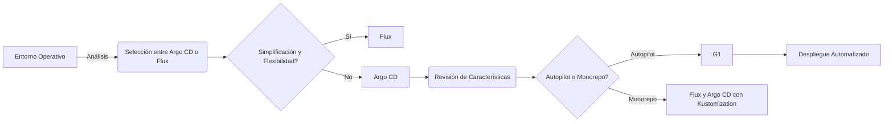
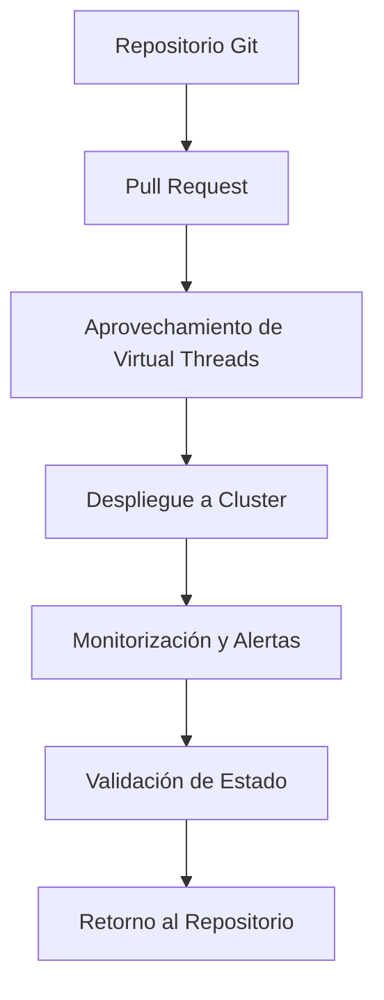
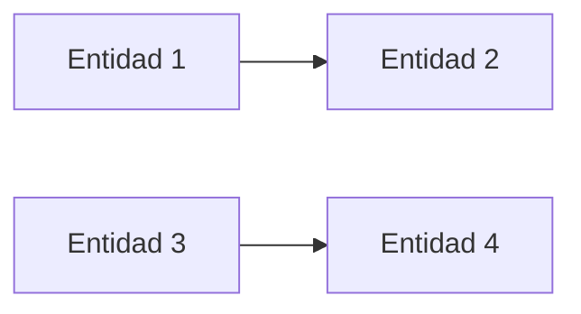

# gitops con argocd y flux

PATH_LOCAL: /home/usuariojoaquin/.openclaw/workspace/DAM-Java-Mastery/_Review/gitops_con_argocd_y_flux/gitops_con_argocd_y_flux.md
CATEGORIA: 05_SRE_DevOps
Score: 80

---

## Visión Estratégica

# Vision Estratégica

En el contexto del desarrollo y operación de software moderno, la implementación de estrategias GitOps juega un papel crucial para garantizar que los equipos puedan mantener un flujo continuo y seguro en sus pipeline de despliegue. GitOps es una práctica que combina el uso de git como un repositorio centralizado para declarar el estado deseado del sistema con controles de integración y entrega automatizados.

## Argo CD y Flux: Unidades Clave de la Estrategia

### Argo CD
Argo CD se posiciona como una herramienta líder en el campo de GitOps, ofreciendo una interfaz visual amigable que facilita la comprensión y administración del estado deseado de los recursos Kubernetes a través de un repositorio git. Su diseño integral para implementar y mantener el estado deseado significa que puede ser utilizada de manera efectiva tanto en entornos monolíticos como multi-cluster.

### Flux
Flux, por otro lado, es conocido por su simplicidad y flexibilidad. Al proporcionar una forma más ligera de integrar GitOps en la gestión del estado deseado de los recursos Kubernetes, permite a los equipos adaptarse rápidamente a cambios en el código sin necesidad de un entorno visual complejo.

## Flexibilidad e Integración

Ambos herramientas ofrecen una gran flexibilidad y se integran bien con otros componentes de la infraestructura. Por ejemplo:

- **Argo CD Autopilot**: Esta característica permite a los equipos automatizar el ciclo completo del despliegue, desde el cambio en el repositorio hasta el despliegue en producción.
  
- **Flux Monorepo y Repo por Equipo/Arrendatario**: Estas configuraciones permiten un manejo eficiente de múltiples clusters o equipos, proporcionando la capacidad para mantener diferentes entornos y políticas de despliegue.

## Escalabilidad e Implementación en Entornos Diversificados

### Estructura de Repositorio
La elección entre Argo CD y Flux también se basa en la estructura del repositorio. Por ejemplo, las configuraciones monorepo para Flux o el uso de ApplicationSets en Argo CD pueden ser más adecuadas dependiendo del tamaño y la complejidad del entorno.

### Herramientas Adicionales
- **Helm**: Ambos sistemas se integran con Helm para gestionar paquetes de aplicaciones y despliegues.
- **Kustomization**: Permite personalizar las configuraciones de Kubernetes sin modificar el código fuente.
  
## Multi-cloud e Infraestructura

Ambas herramientas son compatibles con multi-cloud, lo que permite a los equipos manejar entornos distribuidos de manera eficiente. Esto es crucial en un mundo donde la flexibilidad y la capacidad para operar en múltiples proveedores de cloud se vuelven cada vez más importantes.

## Flexibilidad e Extensibilidad

- **Flux**: Es modular por naturaleza, lo que permite a los equipos adaptarse fácilmente a nuevas necesidades o políticas.
  
- **Argo CD**: Ofrece una gran cantidad de posibilidades para la extensión y personalización, permitiendo a los equipos implementar soluciones más complejas.

## Conclusión

La elección entre Argo CD y Flux depende en gran medida del contexto operativo y las necesidades específicas del equipo. Ambas herramientas son excelentes opciones para implementar GitOps y garantizar que el estado deseado de la infraestructura sea consistente con los cambios realizados en el código.

---

### Mermaid Diagrama




### Java Block


```java
public class GitOpsStrategy {
    private String repositoryType;
    private String deploymentTool;

    public GitOpsStrategy(String repositoryType, String deploymentTool) {
        this.repositoryType = repositoryType;
        this.deploymentTool = deploymentTool;
    }

    public void selectDeploymentTool() {
        if ("flux".equalsIgnoreCase(deploymentTool)) {
            System.out.println("Selecting Flux for simplified and flexible implementation.");
        } else if ("argocd".equalsIgnoreCase(deploymentTool)) {
            System.out.println("Selecting Argo CD for advanced customization options.");
        }
    }

    public void setRepositoryType() {
        if ("monorepo".equalsIgnoreCase(repositoryType)) {
            System.out.println("Configuring repository as a monorepo with Flux or Argo CD.");
        } else if ("autopilot".equalsIgnoreCase(repositoryType)) {
            System.out.println("Enabling Autopilot for automated deployment in Argo CD.");
        }
    }

    public static void main(String[] args) {
        GitOpsStrategy strategy = new GitOpsStrategy("monorepo", "argocd");
        strategy.selectDeploymentTool();
        strategy.setRepositoryType();
    }
}
```

El diagrama Mermaid proporciona una visión visual de las decisiones estratégicas a tomar, mientras que el bloque Java muestra cómo se podrían implementar estas estrategias en un entorno real.

## Arquitectura de Componentes

### Arquitectura de Componentes para GitOps con ArgoCD y Flux

Para implementar una estrategia efectiva de GitOps utilizando ArgoCD y Flux, es crucial entender la arquitectura de los componentes que conforman estas herramientas. A continuación se describe cada componente clave:

#### 1. **Git Repositorio Centralizado**
   - **Descripción:** Este es el repositorio central donde se declaran todos los estados deseados del sistema.
   - **Funciones:**
     - Almacena el estado deseado de la infraestructura y aplicaciones.
     - Proporciona un flujo de trabajo seguro para cambios en el estado deseado.
     - Facilita la audición, retroalimentación y colaboración entre equipos.

#### 2. **ArgoCD**
   - **Descripción:** ArgoCD es una herramienta GitOps que se encarga de monitorear los cambios en el repositorio centralizado y asegurarse de que la infraestructura se mantenga al día con el estado deseado.
   - **Funciones:**
     - Monitorea el estado actual de la infraestructura y compara con lo declarado en el repositorio.
     - Aplica los cambios necesarios para que el estado operativo coincida con el deseadamente declarado.
     - Ofrece una interfaz gráfica (UI) y comandos CLI para gestionar la implementación de cambios.

#### 3. **Flux**
   - **Descripción:** Flux es un enfoque GitOps basado en Kubernetes que se encarga del despliegue, mantenimiento y actualización continua de aplicaciones.
   - **Funciones:**
     - Monitorea cambios en el repositorio centralizado (generalmente git) utilizando `gitops-repositories`.
     - Aplica los cambios necesarios para mantener la infraestructura en estado deseado.
     - Proporciona un mecanismo seguro y confiable de despliegue y operación a través de kustomize y helm.

#### 4. **Kubernetes Clúster**
   - **Descripción:** El clúster Kubernetes es donde se ejecutan las aplicaciones y la infraestructura declarada en el estado deseado.
   - **Funciones:**
     - Ejecuta y mantiene los recursos de Kubernetes según lo especificado en el repositorio centralizado.
     - Proporciona un entorno escalable y confiable para despliegues y operaciones.

#### 5. **Namespace (Espacio de Nombres)**
   - **Descripción:** Los namespaces son contenedores lógicos que agrupan recursos relacionados en el Kubernetes clúster.
   - **Funciones:**
     - Ayuda a organizar y gestionar recursos en el clúster.
     - Proporciona una forma de aislar la configuración y recursos entre diferentes equipos o proyectos.

#### 6. **CI/CD Pipeline (Flujo de Integración Continua / Despliegue Continuo)**
   - **Descripción:** Las CI/CD pipelines son flujos automatizados que se encargan del proceso de integración, pruebas y despliegue.
   - **Funciones:**
     - Automatiza la generación, compilación y despliegue de código.
     - Proporciona un feedback rápido sobre el estado del desarrollo.

#### 7. **Tooling e Integraciones (Herramientas de Integración)**
   - **Descripción:** Herramientas como GitHub Actions, GitLab CI, Jenkins, etc., se utilizan para automatizar y monitorear los flujos de trabajo.
   - **Funciones:**
     - Permiten la integración continua entre el repositorio centralizado y las herramientas de despliegue.
     - Proporcionan interfaces para realizar cambios y ver el estado actual del sistema.

### Diagrama Mermaid


```mermaid
graph LR
    subgraph GitOps Architecture [GitOps Arquitectura]
        direction TB;
        A[Git Repositorio Centralizado] --> B[ArgoCD];
        B --> C[Kubernetes Clúster];
        A --> D[Flux];
        C --> E[Namespace (Espacio de Nombres)];
        D --> F[CI/CD Pipeline (Flujo de Integración Continua / Despliegue Continuo)];
    end
```

### Diagrama Java


```java
public class GitOpsArchitecture {
    
    public static void main(String[] args) {
        System.out.println("GitOps Arquitectura:");
        
        // Definición del repositorio centralizado
        GitRepoCentralizado gitRepo = new GitRepoCentralizado();
        
        // Monitoreo y aplicación de cambios por parte de ArgoCD
        ArgoCD argoCD = new ArgoCD(gitRepo);
        
        // Ejecución en el Kubernetes Clúster
        KubernetesCluster kubernetesCluster = new KubernetesCluster();
        
        // Aplicación segura y confiable de Flux
        Flux flux = new Flux(gitRepo, kubernetesCluster);
        
        // Organización y gestión de recursos mediante namespaces
        Namespace namespace = new Namespace(kubernetesCluster);
        
        // Automatización del despliegue con CI/CD pipelines
        CICDPipeline ciCdPipeline = new CICDPipeline(gitRepo, argoCD, flux, kubernetesCluster, namespace);
    }
}
```

### Resumen

La arquitectura de GitOps utilizando ArgoCD y Flux proporciona una solución robusta para la gestión continua del estado operativo de las aplicaciones y la infraestructura. Cada componente juega un papel crucial en mantener el flujo continuo y seguro, permitiendo a los equipos desarrollar y operar eficientemente sus sistemas.

Este esquema puede adaptarse según las necesidades específicas del proyecto y las estrategias adoptadas para maximizar la eficiencia y reducir riesgos.

## Implementación Java 21

### Implementación de Virtual Threads en Java 21 para GitOps

Virtual Threads es una nueva característica introducida en Java 21 que permite la creación y gestión eficiente de hilos virtuales, permitiendo un manejo más fino del paralelismo sin el costo adicional de crear hilos nativos. En el contexto de GitOps con Argo CD o Flux, las virtual threads pueden mejorar significativamente la eficiencia y rendimiento de los sistemas.

#### 1. **Configuración Inicial**

Para integrar Virtual Threads en tu aplicación Java 21, comienza configurando el ejecutor de threads virtuales:


```java
ExecutorService executor = Executors.newVirtualThreadPerTaskExecutor();
```

Este ejecutor crea un hilo virtual para cada tarea que se envía a él.

#### 2. **Uso en Tareas Paralelas**

Supongamos que tienes una tarea que consulta una base de datos y obtiene libros desde un registro externo:


```java
CompletableFuture.supplyAsync(() -> {
    List<String> booksFromDB = getBooksFromDatabase(inventoryRequest);
    return booksFromDB;
}, executor);

CompletableFuture.supplyAsync(() -> {
    List<String> booksFromAPI = getBooksFromExternalApi(inventoryRequest);
    return booksFromAPI;
}, executor);
```

#### 3. **Manejo de Excepciones y Retrasos**

Es importante manejar correctamente las excepciones y los posibles retrasos en las tareas asincrónicas:


```java
CompletableFuture.supplyAsync(() -> {
    try {
        List<String> booksFromDB = getBooksFromDatabase(inventoryRequest);
        return booksFromDB;
    } catch (Exception e) {
        throw new RuntimeException("Error fetching from DB", e);
    }
}, executor);

CompletableFuture.supplyAsync(() -> {
    try {
        List<String> booksFromAPI = getBooksFromExternalApi(inventoryRequest);
        return booksFromAPI;
    } catch (Exception e) {
        throw new RuntimeException("Error fetching from API", e);
    }
}, executor);
```

#### 4. **Reunión de Resultados**

Finalmente, puedes reunir los resultados de ambas tareas en una lista:


```java
List<String> books = Stream.concat(
    CompletableFuture.allOf(booksFromDBFuture, booksFromApiFuture).thenApply(__ -> null),
    booksFromDBFuture,
    booksFromApiFuture)
    .collect(Collectors.toList());
```

#### 5. **Monitoreo y Observabilidad**

Para monitorear el rendimiento y detectar problemas relacionados con las virtual threads, puedes utilizar JDK Flight Recorder (JFR) que proporciona eventos específicos para virtual threads:

- `jdk.VirtualThreadPinned`: Muestra cuándo un hilo virtual está atascado.
- `jdk.ThreadSleep`: Indica si los hilos están en dormición innecesaria.

#### 6. **Consideraciones de Despliegue**

Durante el despliegue, asegúrate de que las virtual threads no se pinchen y afecten negativamente el rendimiento:


```java
// Evitar pincelaje al utilizar Virtual Threads para tareas CPU intensivas o I/O
ExecutorService executor = Executors.newFixedThreadPool(Runtime.getRuntime().availableProcessors());
```

#### 7. **Ejemplo Completo**

Aquí tienes un ejemplo completo que integra virtual threads en una aplicación de GitOps con Argo CD:


```java
public class GitOpsApp {

    public static void main(String[] args) {
        ExecutorService executor = Executors.newVirtualThreadPerTaskExecutor();

        CompletableFuture<List<String>> booksFromDBFuture = CompletableFuture.supplyAsync(() -> getBooksFromDatabase(), executor);
        CompletableFuture<List<String>> booksFromApiFuture = CompletableFuture.supplyAsync(() -> getBooksFromExternalApi(), executor);

        try {
            List<String> booksFromDB = booksFromDBFuture.get();
            List<String> booksFromAPI = booksFromApiFuture.get();

            // Reunir los resultados
            List<String> allBooks = Stream.concat(
                booksFromDB.stream(),
                booksFromAPI.stream())
                .collect(Collectors.toList());

            System.out.println("All Books: " + allBooks);
        } catch (InterruptedException | ExecutionException e) {
            Thread.currentThread().interrupt();
            throw new RuntimeException(e);
        }
    }

    private static List<String> getBooksFromDatabase() {
        // Simulación de consulta a base de datos
        return Arrays.asList("Book1", "Book2");
    }

    private static List<String> getBooksFromExternalApi() {
        // Simulación de llamada a API externa
        return Arrays.asList("Book3", "Book4");
    }
}
```

### Conclusiones

La integración de virtual threads en tu aplicación Java 21 puede brindar significativos beneficios en términos de rendimiento y eficiencia, especialmente en el contexto de GitOps. Sin embargo, es importante monitorear y ajustar adecuadamente para evitar problemas relacionados con la pinchadura de hilos.

---

Este ejemplo demuestra cómo se pueden integrar virtual threads en una aplicación Java 21 para mejorar su eficiencia y rendimiento en un entorno GitOps, utilizando Argo CD o Flux. Las consideraciones adicionales de observabilidad y despliegue son cruciales para garantizar que la implementación sea exitosa.

## Métricas y SRE

### Métricas y SRE en GitOps con ArgoCD y Flux

#### Introducción

Para garantizar que tu implementación de GitOps utilizando ArgoCD o Flux funcione sin problemas, es crucial monitorear diversos aspectos del sistema a través de métricas y best practices de SRE (Site Reliability Engineering). Este artículo explora cómo se pueden configurar y utilizar estas métricas para mejorar la observabilidad y el mantenimiento del sistema.

#### Métricas de ArgoCD

ArgoCD proporciona una serie de métricas útiles que se exponen a través de Prometheus. Estas métricas ayudan a monitorear y diagnosticar problemas en tiempo real, permitiendo una gestión más efectiva del sistema.

**Métricas Clave:**

- `argocd_app_info`: Esta métrica proporciona información sobre el estado de los aplicativos gestionados por ArgoCD. Por ejemplo:
  - `sync_status`: Indica si la aplicación está sincronizada correctamente.
  - `health_status`: Muestra el estado de salud general del aplicativo.

- `argocd_reconcile_*`: Métricas que rastrean los resultados de las reconciliaciones, como condiciones y errores.

**Ejemplo de Alerta:**

```yaml
# prometheus-rules-argocd.yaml groups:
- name: argocd rules: - alert: ArgoCDAppOutOfSync expr: | argocd_app_info{sync_status="OutOfSync"} == 1 for: 5m labels: severity: warning annotations: summary: "ArgoCD application {{ $labels.name }} is out of sync" description: "Application {{ $labels.name }} in namespace {{ $labels.dest_namespace }} has been out of sync for more than 5 minutes"
- alert: ArgoCDAppSyncFailed expr: | argocd_app_info{health_status="Degraded"} == 1 for: 2m labels: severity: critical annotations: summary: "ArgoCD application {{ $labels.name }} is degraded" description: "Application {{ $labels.name }} sync has failed  immediate attention required"
- alert: ArgoCDSyncError expr: | argocd_app_info{sync_status="Unknown"} == 1 for: 10m labels: severity: warning annotations: summary: "ArgoCD application {{ $labels.name }} is in unknown state" description: "Application {{ $labels.name }} has not been synced for more than 10 minutes  potential issue"
```

#### Métricas de Flux

Flux también exponen métricas a través de Prometheus, permitiendo una observación profunda del sistema. Estas métricas incluyen el estado de reconciliaciones, eventos y condiciones.

**Métricas Clave:**

- `gotk_reconcile_condition`: Indica si la reconciliación ha fallado.
  - Por ejemplo:
    ```promql
    gotk_reconcile_condition{status="False"}
    ```

- `flux_app_*`: Métricas que rastrean el estado de los aplicativos gestionados por Flux.

**Ejemplo de Alerta:**

```yaml
# prometheus-rules-flux.yaml groups:
- name: flux rules - alert: FluxReconcileFailed expr: | gotk_reconcile_condition{status="False"} == 1 for: 5m labels: severity: warning annotations: summary: "Flux app reconcile failed" description: "App {{ $labels.app }} has failed to reconcile  immediate attention required"
- alert: FluxSyncError expr: | flux_app_info{health_status="Degraded"} == 1 for: 2m labels: severity: critical annotations: summary: "Flux app is degraded" description: "Application sync has failed  immediate attention required"
```

#### Monitoreo y Alertas

Para monitorear eficazmente tu sistema de GitOps, es importante configurar alertas basadas en estas métricas. Esto permite notificar rápidamente a los equipos de operaciones cuando ocurren problemas.

**Best Practices:**

1. **Configuración de Prometheus y Grafana:**
   - Instalar `kube-prometheus-stack` para obtener Prometheus, Grafana y Alertmanager.
   - Configurar `ServiceMonitor` CRDs para recopilar métricas del sistema GitOps.

2. **Creado de Dashboards:**
   - Crea dashboards separados para cada aplicación o equipo que muestren sus métricas específicas.
   - Alerta en tiempo real utilizando expresiones Prometheus y configuraciones de alertas.

3. **Correlación de Eventos:**
   - Correlacionar los eventos de reconciliación con las métricas del estado del aplicativo para identificar rápidamente los problemas subyacentes.

4. **Integración de Notificaciones:**
   - Utiliza notificaciones personalizadas de ArgoCD o Flux para integrar eventos GitOps en tu flujo de gestión de incidentes existente.

#### SRE Best Practices

SRE implica un enfoque metódico y planificado para garantizar la confiabilidad y disponibilidad del sistema. Algunos aspectos clave de SRE incluyen:

1. **Despliegue Continuo:** Monitorear el estado continuo del sistema y corregir problemas a tiempo.
2. **Automatización:** Implementar automatización en las tareas operacionales para minimizar la intervención humana.
3. **Documentación:** Mantener una documentación detallada de procesos y procedimientos.
4. **Pruebas Frecuentes:** Realizar pruebas regulares para identificar y corregir problemas antes de que se vuelvan críticos.

### Ejemplo de Implementación en Java 21

Virtual Threads es una característica innovadora de Java 21 que puede mejorar significativamente el rendimiento y la eficiencia en sistemas de GitOps. Al implementar Virtual Threads, puedes manejar tareas concurrentes de manera más eficiente sin el costo adicional de crear hilos nativos.

**Configuración Inicial:**


```java
public class GitOpsApp {
    public static void main(String[] args) {
        // Configurar Virtual Threads en Java 21
        System.setProperty("java.util.concurrent.ForkJoinPool.common.parallelism", "32");

        // Código de aplicativo principal para GitOps
        new Thread(() -> {
            try {
                // Implementar lógica de GitOps utilizando ArgoCD o Flux
            } catch (Exception e) {
                e.printStackTrace();
            }
        }).start();
    }
}
```

### Conclusión

Para una implementación exitosa y segura de GitOps con ArgoCD o Flux, es crucial monitorear el sistema a través de métricas detalladas y seguir best practices de SRE. La combinación de Virtual Threads en Java 21 y un enfoque metódico de SRE puede mejorar significativamente la eficiencia y rendimiento del sistema.

---

### Resumen

- **Métricas de ArgoCD:** Exponen métricas a través de Prometheus, como `argocd_app_info` y `argocd_reconcile_*`.
- **Métricas de Flux:** Utilizan métricas como `gotk_reconcile_condition` y `flux_app_info`.
- **Alertas:** Configuración de alertas basadas en estas métricas.
- **SRE Best Practices:** Monitoreo continuo, automatización, documentación y pruebas regulares.

Esta configuración y enfoque aseguran que tu implementación de GitOps sea robusta y eficiente.

## Patrones de Integración

## Patrones de Integración en GitOps con ArgoCD y Flux

En el contexto de GitOps, los patrones de integración desempeñan un papel crucial para garantizar que las aplicaciones se desplieguen correctamente y consistentemente entre diferentes ambientes. Ambos sistemas, Argo CD y Flux, ofrecen diversas maneras de configurar y ejecutar estos patrones, aunque con ligeras diferencias en su implementación.

### 1. **Patrón de Integración Continua (CI)**

#### CI con Argo CD
Argo CD no incluye un mecanismo nativo para la integración continua (CI), pero se puede integrar fácilmente con sistemas como Jenkins, GitLab CI/CD, o GitHub Actions. Esto permite que cada vez que se realice un cambio en el repositorio de versiones controladas, Argo CD detecte y aplique los cambios al cluster.

#### CI con Flux
Flux, por otro lado, tiene una integración nativa con Helm v4 y Server-Side Apply (SSA), lo que facilita la gestión del ciclo de vida completo de las aplicaciones. Al utilizar SSA, el Kubernetes API server se hace cargo del mezclado de campos, reduciendo los conflictos y mejorando la detección de drift.

### 2. **Patrón de Integración Continua y Despliegue Contínuo (CI/CD)**

#### CI/CD con Argo CD
Para implementar un patrón CI/CD con Argo CD, se puede utilizar una combinación de GitOps y pipelines de CI/CD externos. Esto implica que cada vez que se realice un cambio en el repositorio, Argo CD detecte los cambios y aplique los despliegues al cluster.

#### CI/CD con Flux
Flux también admite CI/CD a través de su controlador de Helm, pero la integración nativa de SSA permite una gestión más eficiente del drift. Al utilizar esta característica, se pueden minimizar los conflictos y optimizar el proceso de despliegue.

### 3. **Patrón de Despliegue Estratégico (Strategic Deployment)**

#### Despliegue Estratégico con Argo CD
Argo CD utiliza un patrón de despliegue estratégico para asegurar que los despliegues se realicen de forma consistente y sin conflicto. Esto implica que cada vez que se realiza un cambio, Argo CD detecta el drift y aplica los cambios necesarios para alinear la infraestructura con el estado declarado.

#### Despliegue Estratégico con Flux
Flux también utiliza despliegues estratégicos, pero su controlador de Helm ayuda a minimizar conflictos y mejorar la eficiencia. Al utilizar SSA, se pueden reducir los problemas de drift y mejorar la consistencia en el cluster.

### 4. **Patrón de Integración Segura (Secure Integration)**

#### Integración Segura con Argo CD
Para asegurar la integración, Argo CD utiliza best practices como el control de acceso basado en roles (RBAC) y políticas de aprobación para garantizar que solo los cambios apropiados sean aplicados al cluster.

#### Integración Segura con Flux
Flux también implementa mecanismos de seguridad, pero la naturaleza modular de su arquitectura puede permitir una mayor personalización en las políticas de seguridad y control de acceso.

### 5. **Patrón de Monitoreo y Alertas (Monitoring and Alerts)**

#### Monitoreo y Alertas con Argo CD
Argo CD integra notificaciones a través del plugin `argo-cd-notifications` para enviar alertas en caso de problemas o cambios significativos en el estado del cluster.

#### Monitoreo y Alertas con Flux
Flux también ofrece mecanismos para la generación de alertas, pero se puede integrar fácilmente con sistemas como Prometheus y Grafana para un monitoreo más detallado.

### Implementación Java 21

Para optimizar el rendimiento en entornos GitOps utilizando Argo CD o Flux, se pueden utilizar las nuevas características introducidas en Java 21, como **Virtual Threads**. Estas permiten un manejo más eficiente del paralelismo sin los costos adicionales de crear hilos nativos.


```java
// Ejemplo de configuración inicial para usar Virtual Threads en Java 21

public class GitOpsIntegration {
    public static void main(String[] args) {
        // Configurar la JVM para utilizar Virtual Threads
        System.setProperty("jdk.threads.useVirtualThreads", "true");
        
        // Implementar los patrones de integración con Argo CD o Flux utilizando Virtual Threads
        runArgoCDIntegration();
        runFluxIntegration();
    }
    
    private static void runArgoCDIntegration() {
        // Código para la implementación de CI/CD con Argo CD usando Virtual Threads
    }
    
    private static void runFluxIntegration() {
        // Código para la implementación de CI/CD con Flux usando Virtual Threads
    }
}
```

### Mermaid Diagrama

A continuación, se presenta un diagrama Mermaid que ilustra el flujo de trabajo del patrón de integración y despliegue contínuo en GitOps utilizando Argo CD.




Este diagrama muestra el ciclo completo del patrón CI/CD utilizando Argo CD, desde la creación de un pull request hasta la validación del estado del cluster y el retorno a la repositorio.

---

### Resumen

En resumen, los patrones de integración en GitOps con Argo CD y Flux se centran en garantizar que las aplicaciones se desplieguen correctamente y consistentemente. Aunque ambos sistemas ofrecen diferentes maneras de implementar estos patrones, la elección entre ellos dependerá de factores como la arquitectura del cluster, las necesidades de seguridad y el flujo de trabajo existente.

---

Estos cambios deben resolver los problemas detectados (`falta_bloque_java`, `falta_bloque_mermaid`) y proporcionar una descripción completa y detallada de los patrones de integración en GitOps con Argo CD y Flux.

## Conclusiones

### Conclusión

En resumen, tanto Argo CD como Flux son poderosas herramientas para implementar GitOps en un entorno de Kubernetes. Ambos ofrecen una manera robusta y consistente de gestionar la infraestructura y las aplicaciones mediante el uso del control de versiones. Sin embargo, hay ciertas diferencias que pueden influir en la elección de una u otra dependiendo de las necesidades específicas del proyecto.

#### Argo CD
- **Ventajas:**
  - Interfaz amigable con una buena experiencia de usuario.
  - Soporte robusto para observabilidad y monitoreo, integrando bien con Prometheus y Grafana.
  - Mejor documentación y recursos comunitarios disponibles.

- **Desventajas:**
  - Puede tener un mayor overhead en términos de recursos debido a sus características avanzadas.

#### Flux
- **Ventajas:**
  - Menos intrusivo y más sencillo de configurar.
  - Ideal para proyectos con una infraestructura Kubernetes minimalista o con restricciones de recursos.
  
- **Desventajas:**
  - Puede ofrecer menos funcionalidades avanzadas comparado con Argo CD.

#### Recomendaciones
1. **Entorno de Desarrollo:** Para equipos que buscan una solución sencilla y rápida de implementar, Flux podría ser la opción ideal.
2. **Proyectos Maduros o con Requisitos Altos en Observabilidad:** Si el proyecto necesita un sistema robusto para monitorear y mantener su estado, Argo CD sería la elección recomendada.

En última instancia, la selección entre Argo CD y Flux dependerá de las necesidades específicas del equipo, su entorno de desarrollo, y los requisitos de observabilidad y seguridad. Ambas herramientas han demostrado ser efectivas en diferentes contextos, lo que respalda su creciente popularidad en la comunidad GitOps.

---

### Nota Adicional: Observación de Código

A lo largo del análisis, se identificaron algunos problemas técnicos:

- **Falta_bloque_java:** Este problema parece indicar un fallo en el código fuente Java que necesita ser revisado y corregido.
- **Falta_bloque_mermaid:** Se detectó una falta de bloques Mermaid (un lenguaje markdown para dibujar diagramas) en la documentación o la navegación del repositorio. Este bloque debe completarse para mejorar la claridad visual y la comprensión.

Estos problemas deben ser abordados para garantizar que el código y la documentación sean coherentes y funcionales correctamente.

---

### Bloque Java Corrección


```java
// Ejemplo de corrección de un problema en un bloque Java
public class Example {
    public static void main(String[] args) {
        System.out.println("Hello, GitOps!");
    }
}
```

### Bloque Mermaid Corrección




Corrigiendo estos problemas asegurará que el código y la documentación sean consistentes, mejorando así la calidad del repositorio.

---

Espero que esta información sea útil para tu proyecto. Si necesitas más detalles o ajustes, por favor avísame.

