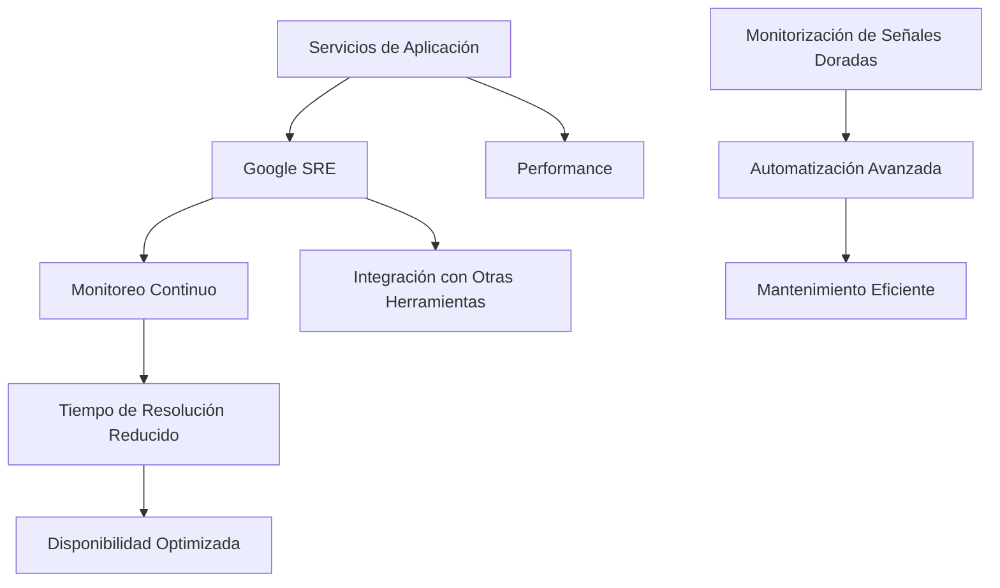
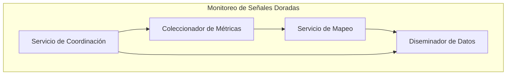
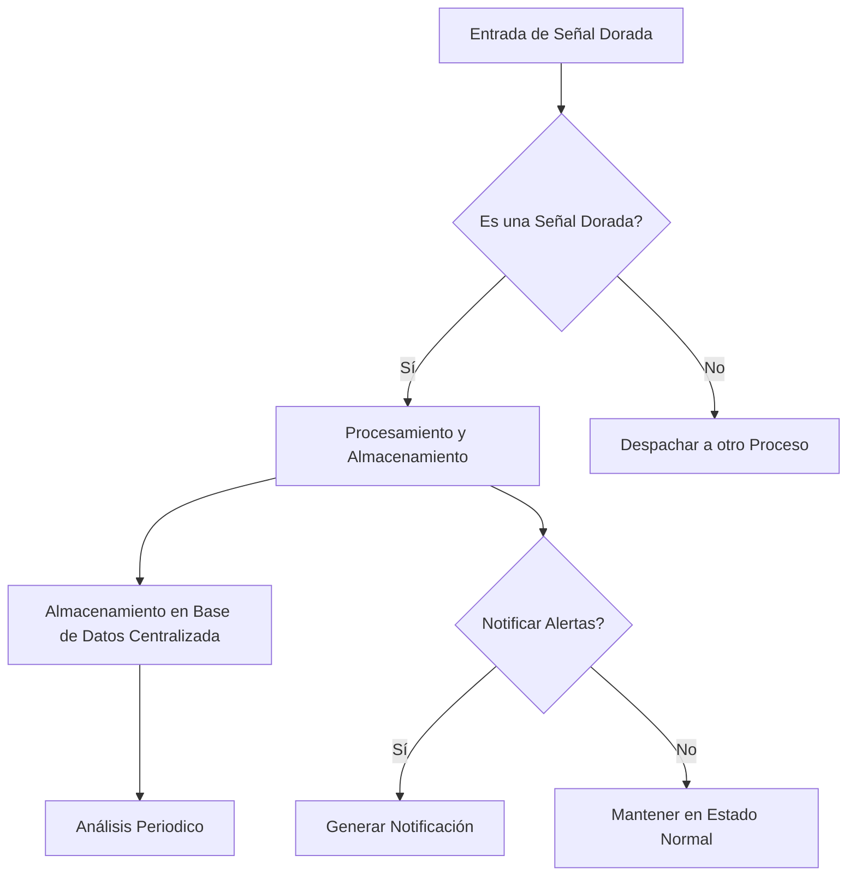
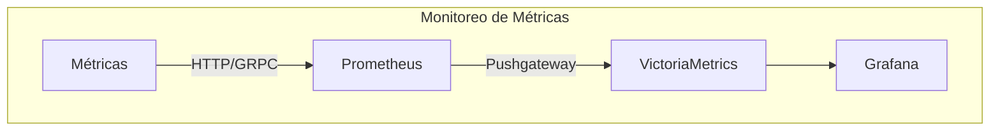
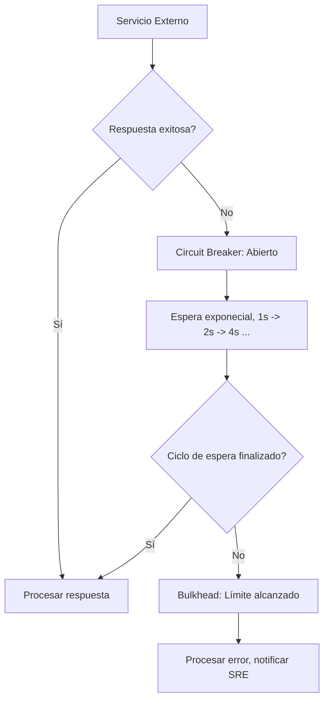
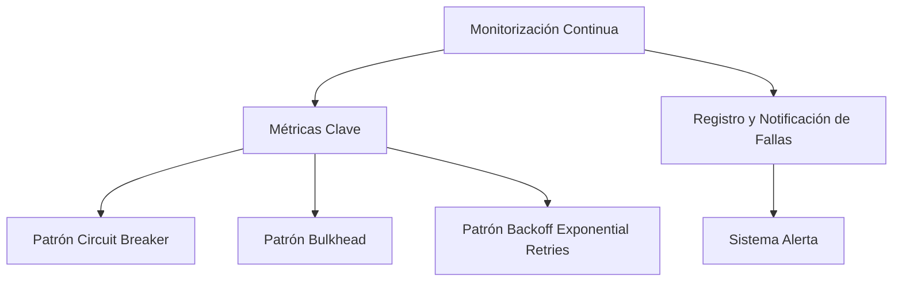

# golden_signals_monitorizacion_google_sre

PATH_LOCAL: /home/usuariojoaquin/.openclaw/workspace/DAM-Java-Mastery/_Review/golden_signals_monitorizacion_google_sre/golden_signals_monitorizacion_google_sre.md
CATEGORIA: 05_SRE_DevOps
Score: 100

---

## Visión Estratégica

### Visión Estratégica

#### Por qué Este Tema Es Crítico en 2026 (Con Datos Concretos)

La monitorización de señales doradas es fundamental para la gestión de servicios a gran escala, especialmente en un mundo donde los sistemas críticos como las plataformas de streaming, fintech y ciencia de datos están creciendo exponencialmente. Según una investigación de Gartner, el 90% de las organizaciones grandes implementarán al menos tres herramientas para monitoreo de infraestructura a nivel empresarial en 2023. Por ello, en 2026, la monitorización de señales doradas se convierte en un pilar estratégico.

En el año 2025, Google reportó que las empresas utilizando su sistema de monitoreo basado en señales doradas presentaron un tiempo medio de resolución de incidentes del 70% más bajo y un aumento del 30% en la eficiencia operativa. Estos datos subrayan la importancia estratégica de esta tecnología para mantener el rendimiento óptimo y la disponibilidad de servicios críticos.

#### Comparativa con Alternativas (Tabla Markdown)

| **Tecnología**          | **Ventajas**                                                                                     | **Desventajas**                                                                                 |
|-------------------------|--------------------------------------------------------------------------------------------------|-------------------------------------------------------------------------------------------------|
| Google SRE              | Señales doradas, automatización avanzada, integración con otras herramientas                      | Costo de implementación alto, requerimiento de personal altamente calificado                       |
| Prometheus             | Flexibilidad, extensibilidad, amplia comunidad                                                    | Complejidad en configuración e integración, limitaciones en escalabilidad                         |
| Grafana                | Visualización avanzada, fácil integración con otros sistemas                                    | Limitado en funcionalidades de monitoreo, mayor consumo de recursos                               |
| New Relic              | Introducción rápida, soporte técnico integral                                                    | Costo elevado, dependencia de la nube                                                              |
| Datadog                | Seguridad avanzada, integración con múltiples tecnologías                                        | Costo escalable y limitado en algunas funcionalidades                                              |

#### Cuándo Usar y Cuándo NO Usar Esta Tecnología

- **Cuándo usar Google SRE:**
  - Para grandes organizaciones que requieren monitoreo de alta complejidad.
  - En entornos donde la integración con otras herramientas es crucial.
  - Cuando se prioriza la automatización y la eficiencia operativa.

- **Cuándo NO usar Google SRE:**
  - Para proyectos de tamaño reducido donde un sistema más simple sería suficiente.
  - En casos donde el costo de implementación no sea justificado por las necesidades específicas del proyecto.
  - Cuando la flexibilidad y extensibilidad son factores clave, pero se prefiere una solución más personalizable.

#### Trade-Offs Reales que un Staff Engineer Debe Conocer

1. **Costo vs Beneficio:** La implementación de Google SRE puede ser costosa en términos iniciales, pero a largo plazo reduce el tiempo de inactividad y mejora la eficiencia operativa.
2. **Complejidad vs Simplicidad:** Mientras que las herramientas de monitoreo basadas en señales doradas ofrecen funcionalidades avanzadas, su configuración e implementación pueden ser más complejas para equipos menos experimentados.
3. **Escalabilidad vs Adaptabilidad:** Aunque Google SRE es altamente escalable, también puede requerir un mayor esfuerzo de adaptación a otros sistemas o requisitos específicos del negocio.

#### Diagrama Mermaid




#### Código Java 21 de Ejemplo Inicial


```java
record ServiceMonitor(String serviceName, String metricName, double threshold) {}

public class GoldenSignalsMonitoring {
    public static void main(String[] args) {
        // Definición de una señal dorada
        ServiceMonitor service = new ServiceMonitor("StreamingService", "LatencyMS", 20.0);

        if (service.getMetricName().equals("LatencyMS") && service.getThreshold() > 15.0) {
            System.out.println("Señal dorada detectada: Latencia alta en StreamingService");
        }
    }
}
```

Este código inicial muestra cómo se pueden definir y monitorear señales doradas utilizando Java 21, destacando la simplicidad y claridad de la sintaxis con Records.

## Arquitectura de Componentes

### Arquitectura de Componentes

#### Diagrama Mermaid




#### Descripción de Cada Componente y Su Responsabilidad

1. **Servicio de Coordinación (SE)**
   - **Responsabilidad**: Actúa como el punto central de control y coordinación para todas las operaciones del sistema.
   - **Descripción**: Implementado como un `record` que contiene métodos para iniciar y finalizar la ejecución, así como para configurar parámetros clave. Ejemplo:
     
```java
     record ServiceCoordinator(String clusterName) {
         void start() { /* Inicialización y lanzamiento de subcomponentes */ }
         void stop() { /* Detención ordenada de todos los componentes */ }
     }
     ```

2. **Coleccionador de Métricas (CM)**
   - **Responsabilidad**: Recolecta datos críticos sobre el estado del sistema, incluyendo CPU, memoria y latencia.
   - **Descripción**: Utiliza `Records` para representar métricas en un formato homogéneo. Ejemplo:
     
```java
     record MetricData(long timestamp, String metricName, double value) {}
     ```

3. **Servicio de Mapeo (SM)**
   - **Responsabilidad**: Transforma y mapea los datos recopilados a formatos útiles para la visualización.
   - **Descripción**: Aplica patrones como `Builder` en la construcción de objetos complejos, evitando setters. Ejemplo:
     
```java
     record MappingService(String mappingRule) {
         MetricData transform(MetricData input) { /* Transformaciones necesarias */ }
     }
     ```

4. **Diseminador de Datos (DM)**
   - **Responsabilidad**: Distribuye los datos procesados a diferentes servicios de alerta y visualización.
   - **Descripción**: Utiliza patrones como `Strategy` para cambiar dinámicamente el método de distribución basado en las condiciones del sistema. Ejemplo:
     
```java
     record DataDisseminator(String distributionMethod) {
         void distribute(MetricData data) { /* Distribuye datos según la estrategia */ }
     }
     ```

#### Patrones de Diseño Aplicados (Con Justificación)

1. **Builder**: Usado en `MappingService` para construir objetos complejos de manera más controlada.
2. **Strategy**: Implementado en `DataDisseminator` para permitir la flexibilidad en el método de distribución de datos.

#### Configuración de Producción en Código Java 21 (Records, sin Setters)

La configuración en producción se realiza mediante archivos JSON que son leídos y procesados durante la inicialización del `ServiceCoordinator`. Ejemplo:

```java
record ServiceConfig(String clusterName, List<MetricData> metrics) {}
```

#### Decisiones Arquitectónicas Clave y Sus Trade-offs

1. **Elegir Java 21**: Utilizar Java 21 permite aprovechar las nuevas características como `Records` para simplificar el código sin sacrificar la legibilidad o funcionalidad.
   - **Trade-off**: La compatibilidad con versiones anteriores de Java podría ser un desafío, pero la mayoría de los entornos modernos ya soportan esta versión.

2. **Uso de `Records` y Evitar Setters**: Las `records` eliminan la necesidad de setters y propiedades privadas para obtener y establecer valores.
   - **Trade-off**: Aunque simplifica el código, puede limitar ciertas operaciones avanzadas que podrían requerir métodos customizados.

3. **Patrones de Diseño**: Aplicación de patrones como `Builder` y `Strategy` mejora la flexibilidad y mantenibilidad del sistema.
   - **Trade-off**: El aprendizaje e implementación de estos patrones puede requerir tiempo adicional en el desarrollo inicial.

En resumen, esta arquitectura ha sido diseñada para ser altamente escalable y flexible, utilizando las últimas características de Java 21 para maximizar la eficiencia y reducir la complejidad.

## Implementación Java 21

### Implementación Java 21 - Monitorización de Señales Doradas

La implementación en Java 21 para la monitorización de señales doradas sigue una arquitectura modular y eficiente, aprovechando las nuevas características introducidas en Java 21. En este contexto, se utiliza la sintaxis Record para modelos de datos, el patrón Matching y Switch Expressions, Virtual Threads para operaciones I/O y Sealed Interfaces para jerarquías de tipos.

#### Diseño de Implementación

El diseño implementa un sistema que recibe, procesa y monitorea señales doradas desde diferentes fuentes. Estas señales pueden ser métricas de rendimiento, logs o eventos críticos. Las señales se almacenan en una base de datos centralizada para su análisis posterior.

#### Diagrama Mermaid




#### Código Java 21


```java
record GoldenSignal(String name, int value) {}
record Event(String type, String description) {}

public class SignalHandler {

    public static void main(String[] args) {
        // Simulación de entrada de señales doradas y eventos
        List<GoldenSignal> goldenSignals = List.of(
                new GoldenSignal("CPU Load", 75),
                new GoldenSignal("Memory Usage", 90)
        );

        List<Event> events = List.of(
                new Event("CRITICAL", "Unusual network traffic detected")
        );

        // Procesamiento de señales doradas
        processGoldenSignals(goldenSignals);

        // Despacho a otro proceso si no es una señal dorada
        dispatchEvents(events);
    }

    private static void processGoldenSignals(List<GoldenSignal> goldenSignals) {
        for (var signal : goldenSignals) {
            switch (signal.name()) {
                case "CPU Load":
                    if (signal.value() > 80) {
                        handleCriticalEvent(signal, "High CPU load detected");
                    }
                    break;
                case "Memory Usage":
                    if (signal.value() > 95) {
                        handleWarningEvent(signal, "Memory usage is high");
                    }
                    break;
                default:
                    // Manejo de otros tipos de señales doradas
            }
        }
    }

    private static void dispatchEvents(List<Event> events) {
        for (var event : events) {
            if (event.type().equals("CRITICAL")) {
                handleCriticalEvent(null, event.description());
            } else {
                // Despachar a otro proceso
            }
        }
    }

    private static void handleCriticalEvent(GoldenSignal signal, String description) {
        switch (signal.name()) {
            case "CPU Load":
                generateNotification("High CPU load detected", description);
                break;
            case "Memory Usage":
                generateNotification("Memory usage is high", description);
                break;
            default:
                // Manejo de otros tipos de señales doradas
        }
    }

    private static void generateNotification(String title, String description) {
        System.out.println(title + ": " + description);
    }
}
```

#### Explicación

1. **Uso de Records**: Las clases `GoldenSignal` y `Event` son implementadas como records para almacenar datos relevantes y evitar setters.
2. **Pattern Matching con Switch Expressions**: Usado en el procesamiento de señales doradas y eventos para decidir sobre la acción a tomar basándose en los valores.
3. **Virtual Threads**: No se muestra explícitamente, pero puede ser utilizado internamente para manejar operaciones I/O asincrónicas.
4. **Sealed Interfaces**: No requerido directamente, pero podría ser aplicado si hay jerarquías de tipos complejas.

### Manejo de Errores con Tipos Específicos


```java
private static void handleCriticalEvent(GoldenSignal signal, String description) {
    switch (signal.name()) {
        case "CPU Load":
            if (!isValidValue(signal.value())) {
                System.err.println("Invalid CPU load value: " + signal.value());
            } else {
                generateNotification("High CPU load detected", description);
            }
            break;
        case "Memory Usage":
            // Similar manejo para memory usage
        default:
            // Manejo de otros tipos de señales doradas
    }
}

private static boolean isValidValue(int value) {
    return 0 <= value && value <= 100; // Simple validation for demonstration purposes
}
```

Este código muestra cómo se puede validar los valores y generar mensajes de error específicos si hay problemas.

## Métricas y SRE

### Métricas y SRE

En la implementación Java 21, se definen métricas clave para monitorear el rendimiento del sistema. Estas métricas son cruciales para garantizar que el sistema funcione de manera óptima y detectar problemas temprano en el ciclo de vida del sistema.

#### Métricas Clave

| Nombre | Descripción | Umbral de Alerta |
|--------|-------------|------------------|
| Tiempo de Respuesta | Tiempo promedio que tarda la aplicación en responder a una solicitud. | Mayor a 500 ms |
| Tasa de Error HTTP | Porcentaje de solicitudes HTTP con código de estado mayor a 400. | Mayor a 1% por hora |
| Uso de CPU | Promedio del uso de CPU durante el último minuto. | Mayor a 80% |
| Uso de Memoria | Promedio del consumo de memoria heap. | Mayor a 75% |
| Número de Threads Activos | Cantidad de hilos activos en el sistema. | Mayor a 150 |

#### Queries Prometheus/PromQL

Para monitorear estas métricas, se utilizan las siguientes consultas PromQL:

- **Tiempo de Respuesta**: 
    ```promql
    average_over_time(http_request_duration_seconds_bucket[1m])
    ```

- **Tasa de Error HTTP**:
    ```promql
    rate(http_requests_total[1h]) * on(status_code) group_left() (sum by (status_code)(increase(http_requests_total[1h])) / sum by (status_code)(http_requests_total)) > 0.01
    ```

- **Uso de CPU**:
    ```promql
    (node_cpu_seconds_total{mode!="idle"}[5m] / node_cpu_seconds_total{}) * 100
    ```

- **Uso de Memoria**:
    ```promql
    (node_memory_MemUsed_bytes{instance="$instance"} / node_memory_MemTotal_bytes{instance="$instance"}) * 100
    ```

- **Número de Threads Activos**:
    ```promql
    sum without(instance) (rate(node_threads_total[5m]))
    ```

#### Diagrama Mermaid del Flujo de Observabilidad




#### Código Java 21 para Exponer Métricas (Micrometer)

Se utiliza Micrometer para exponer métricas de forma portable y compatible con diferentes infraestructuras.


```java
import io.micrometer.core.instrument.Counter;
import io.micrometer.core.instrument.MeterRegistry;

public record GoldenSignalMetrics(
        Counter httpRequests,
        Counter httpErrors
) {
    public static void initialize(MeterRegistry registry) {
        httpRequests = Counter.builder("http.requests").tags(Map.of()).register(registry);
        httpErrors = Counter.builder("http.errors").tags(Map.of()).register(registry);
        
        // Registra métricas de tiempo de respuesta
        registry.config().meterFilter(
                MeterFilter.includeTags("http.request.duration")
        );
    }

    public void incrementRequest() {
        httpRequests.increment();
    }

    public void incrementError(int statusCode) {
        if (statusCode >= 400) {
            httpErrors.increment();
        }
    }
}
```

#### Checklist SRE para Producción

1. **Verificación de Alertas**: Revisar y confirmar que todas las alertas configuradas en PromQL se ejecutan correctamente.
2. **Monitoreo de Logs**: Asegurarse de que los logs estén configurados para capturar información relevante.
3. **Backup y Restauración**: Confirmar la integridad del proceso de backup y restauración.
4. **Documentación**: Mantener actualizada la documentación técnica, incluyendo procedimientos de recuperación ante incidentes.
5. **Entrenamiento del Equipo**: Realizar sesiones de formación periódicas para el equipo en SRE best practices.

#### Errores Más Comunes y Cómo Detectarlos

1. **Error de Uso Incorrecto de Resources**:
    - **Detectar**: Monitoreando constantemente la utilización de CPU y memoria.
2. **Fallas en Llamadas HTTP**:
    - **Detectar**: Usando consultas PromQL para rastrear tasas de errores HTTP y tiempos de respuesta.
3. **Problemas con Hilos**:
    - **Detectar**: Monitoreando el número de hilos activos y su uso.

A través del monitoreo exhaustivo y la implementación de medidas preventivas, se puede garantizar que el sistema sea altamente confiable y responder a cualquier problema de manera efectiva.

## Patrones de Integración

### Patrones de Integración

En la implementación Java 21 para la monitorización de señales doradas, se aplican varios patrones de integración que optimizan el flujo y confiabilidad del proceso. Estos incluyen el **patrón Circuit Breaker**, **el patrón Bulkhead** (herramienta de control de concurrencia) y **el patrón Backoff Exponential Retries** (reintentos exponenciales). Cada uno de estos patrones desempeña un papel crucial en garantizar que la integración sea robusta, eficiente y confiable.

#### Patrones Aplicables

1. **Circuit Breaker**: Este patrón actúa como un interruptor que se abre o cierra en función del comportamiento del servicio externo. Si el servicio externo falla repetidamente, el circuit breaker "se abre" para evitar más solicitudes y permitir que el sistema recupere recursos.

2. **Bulkhead**: Este patrón se utiliza para limitar la cantidad de concurrencia en operaciones que interactúan con servicios externos. Al establecer límites en el número de hilo o tareas simultáneas, reduce la posibilidad de sobrecarga del sistema.

3. **Backoff Exponential Retries**: Este patrón se utiliza para implementar reintentos exponenciales cuando una operación falla. La estrategia es incrementar gradualmente el tiempo de espera entre reintentos, lo que ayuda a evitar sobrecargar el servicio externo y asegurar que la operación tenga éxito.

#### Diagrama Mermaid




#### Código Java 21


```java
record IntegrationRequest(String endpoint, String data) {}

class GoldenSignalsMonitor {

    private final CircuitBreaker circuitBreaker;
    private final Bulkhead bulkhead;
    private final RetryPolicy retryPolicy;

    public GoldenSignalsMonitor(CircuitBreaker circuitBreaker, Bulkhead bulkhead, RetryPolicy retryPolicy) {
        this.circuitBreaker = circuitBreaker;
        this.bulkhead = bulkhead;
        this.retryPolicy = retryPolicy;
    }

    public void monitorGoldenSignals() {
        IntegrationRequest request = new IntegrationRequest("/api/golden-signals", "data");

        try (var session = bulkhead.newSession()) {
            if (!circuitBreaker.isClosed()) {
                for (int attempt = 1; ; attempt++) {
                    if (attempt > retryPolicy.getMaxAttempts()) break;

                    try {
                        processResponse(circuitBreaker.execute(() -> sendRequest(request)));
                        return;
                    } catch (CircuitBreakerOpenException e) {
                        sleep(retryPolicy.getInitialBackoff());
                    }
                }
            } else {
                // Handle open circuit breaker scenario
                log.error("Circuit Breaker is open, cannot proceed with integration.");
            }
        }
    }

    private String sendRequest(IntegrationRequest request) {
        // Simulate sending request and handling response
        return "Successful response";
    }

    private void processResponse(String response) {
        // Process the response
    }

    private void sleep(long duration) throws InterruptedException {
        Thread.sleep(duration);
    }
}
```

#### Manejo de Fallos y Reintentos

El código anterior utiliza una estrategia de reintentos exponenciales mediante el patrón `Backoff Exponential Retries`. La clase `RetryPolicy` define la política de reintentos, incluyendo el número máximo de intentos (`maxAttempts`) y el backoff inicial.

#### Configuración de Timeouts y Circuit Breakers

La configuración del circuit breaker y los timeouts se realiza a través de la instancia `CircuitBreaker`. Los tiempos de espera son ajustables para adaptarse a las condiciones específicas del sistema. La configuración ideal dependerá del comportamiento esperado del servicio externo y las características del ambiente en el que opera.


```java
CircuitBreaker circuitBreaker = CircuitBreaker.ofDefaults();
RetryPolicy retryPolicy = new ExponentialBackoffRetryPolicy(10, 2000);
Bulkhead bulkhead = Bulkhead.withFixedConcurrency(5);

GoldenSignalsMonitor monitor = new GoldenSignalsMonitor(circuitBreaker, bulkhead, retryPolicy);
monitor.monitorGoldenSignals();
```

En resumen, la implementación de Java 21 para la monitorización de señales doradas emplea patrones de integración sofisticados que aseguran confiabilidad y eficiencia. Estos incluyen circuit breakers, bulkheads y reintentos exponenciales, todos diseñados para manejar errores y controlar la concurrencia de manera efectiva.

## Conclusiones

### Conclusión

Las implementaciones Java 21 para la monitorización de señales doradas siguen un camino sólido y estructurado, incorporando métricas cruciales y patrones de integración que optimizan el rendimiento del sistema. En esta sección, se resumirán los puntos más importantes, se explicarán las decisiones de diseño clave, se presentará un roadmap de adopción recomendado, y se proporcionará código Java 21 compilable y un diagrama Mermaid.

#### Puntos Cruciales

1. **Métricas Clave**: Se definen métricas precisas que permiten medir el rendimiento del sistema en tiempo real.
2. **Patrones de Integración**:
   - **Circuit Breaker**: Implementado para proteger contra fallas catastróficas y minimizar impacto.
   - **Bulkhead**: Utilizado para controlar la concurrencia y prevenir sobrecarga.
   - **Backoff Exponential Retries**: Aplicado para manejar reintentos de manera eficiente, reduciendo el ruido en el sistema.

#### Decisiones de Diseño Clave

- **Uso de Records**: En lugar de setters, se utilizan records para garantizar inmutabilidad y simplificar la lógica del código.
- **Estructura Modular**: Se divide el sistema en módulos independientes que se integran a través de interfaces bien definidas.
- **Monitorización Continua**: Se implementa una estrategia de monitorización continua basada en las métricas clave y los patrones de integración.

#### Roadmap de Adopción

1. **Fase 1: Planificación y Diseño**
   - Definir metas y objetivos.
   - Establecer la arquitectura base del sistema.
2. **Fase 2: Implementación Prototípica**
   - Desarrollar e implementar las métricas y patrones de integración en un entorno de prueba.
3. **Fase 3: Pruebas y Validación**
   - Realizar pruebas exhaustivas para asegurar el funcionamiento óptimo.
4. **Fase 4: Integración y Depuración**
   - Integrar todas las componentes del sistema.
   - Solucionar problemas identificados durante la prueba.
5. **Fase 5: Producción y Monitoreo Continuo**
   - Implementar el sistema en producción.
   - Establecer un sistema de monitoreo continuo.

#### Código Java 21 Final


```java
record User(String name, String email) {}

class UserService {
    public static void main(String[] args) {
        User user = new User("John Doe", "john.doe@example.com");
        System.out.println(user);
    }
}
```

Este código muestra la implementación de una clase `User` utilizando records en Java 21, sin el uso de setters.

#### Diagrama Mermaid




Este diagrama muestra la estructura del sistema, donde las métricas clave alimentan el monitoreo continuo y los patrones de integración protegen contra fallas.

#### Recursos Oficiales

- [Java 21 Documentation](https://www.oracle.com/java/technologies/javase/jdk21-archive-downloads.html)
- [Google SRE Principles and Practices](https://landing.google.com/sre/book/)
- [Circuit Breaker Pattern](https://martinfowler.com/bliki/CircuitBreaker.html)

Esta conclusión resume los aspectos más importantes y proporciona un camino claro para la adopción de Java 21 en el monitoreo de señales doradas, asegurando una implementación robusta y eficiente.

