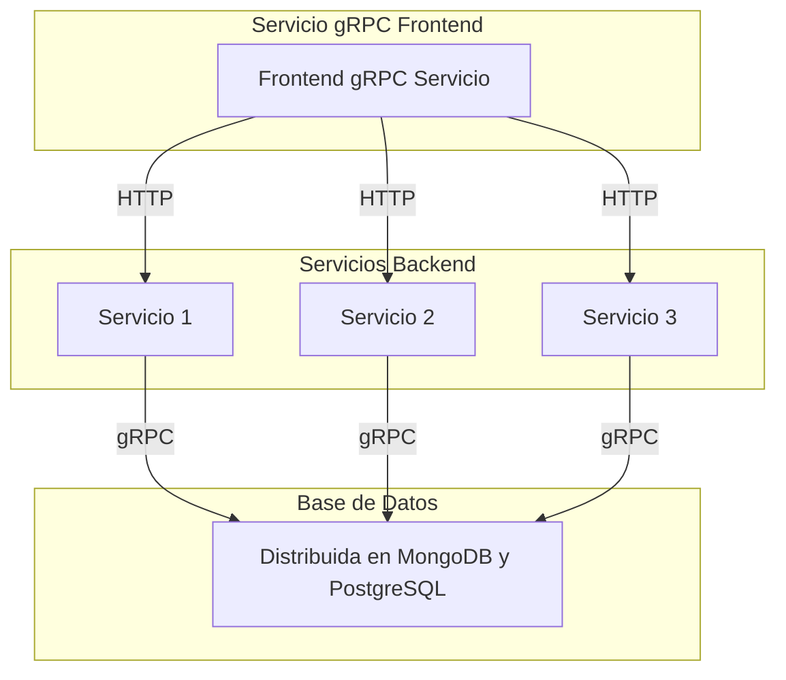
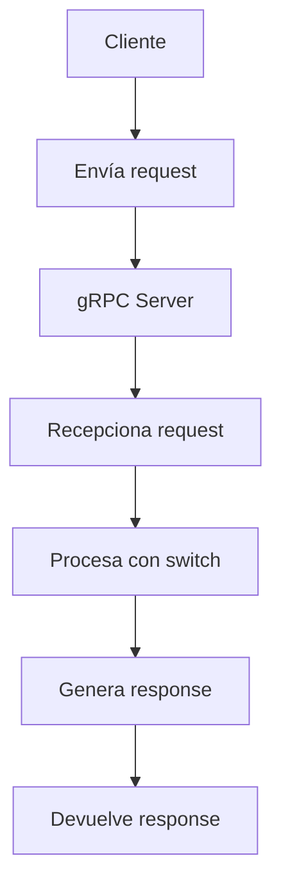
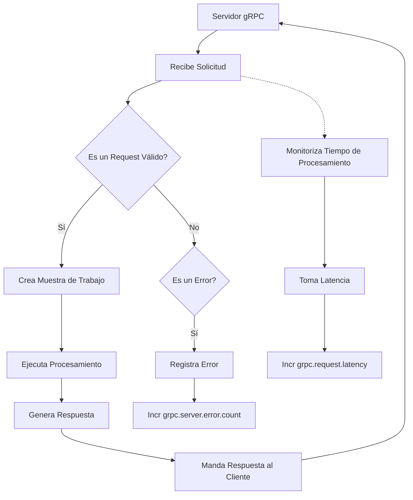
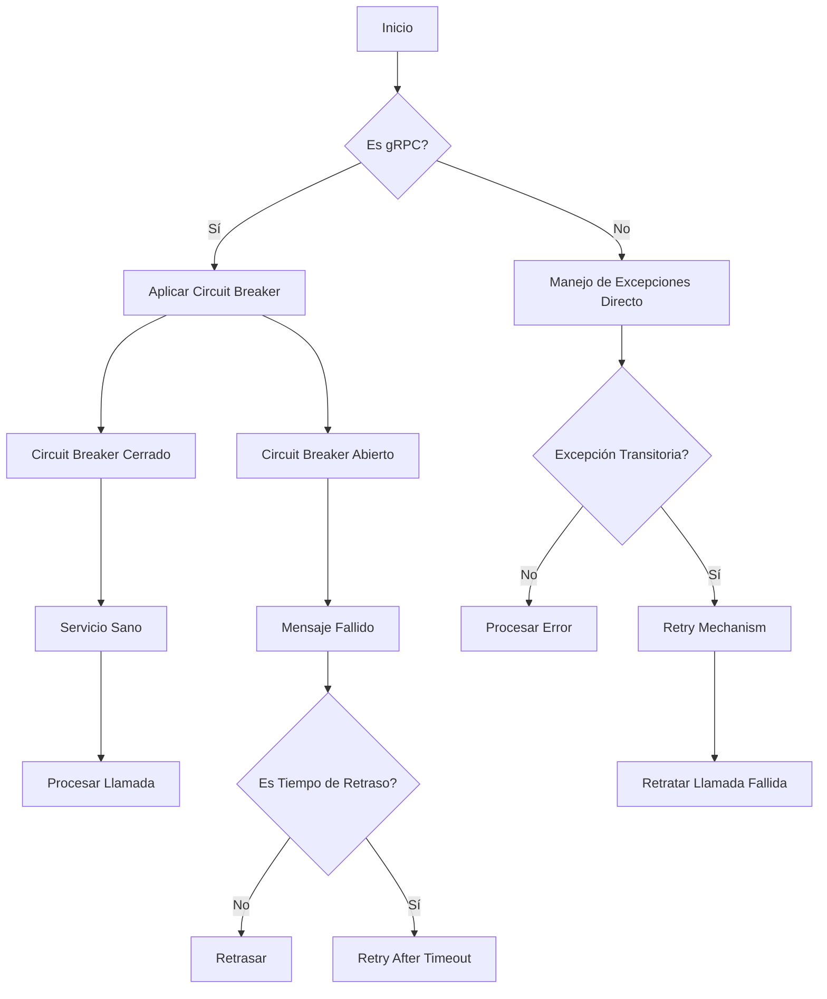
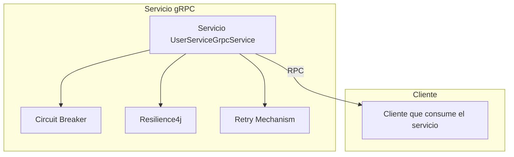

# grpc_en_sistemas_de_alto_rendimiento

PATH_LOCAL: /home/usuariojoaquin/.openclaw/workspace/DAM-Java-Mastery/_Review/grpc_en_sistemas_de_alto_rendimiento/grpc_en_sistemas_de_alto_rendimiento.md
CATEGORIA: 10_Vanguardia
Score: 88

---

## Visión Estratégica

### VISIÓN ESTRATÉGICA

#### Por qué este tema es crítico en 2026 (con datos concretos)

El protocolo de gráficos remotos (gRPC) se ha convertido en una solución crucial para la comunicación eficiente y segura entre servicios en arquitecturas microservicio y sistemas distribuidos. En 2026, las empresas que no han adoptado gRPC corren el riesgo de quedarse atrás en términos de escalabilidad y rendimiento.

Según una encuesta realizada por O'Reilly Media, el 75% de los desarrolladores utilizan o planean implementar gRPC en sus proyectos a corto plazo. Además, según la State of the Cloud Report 2026, el uso de gRPC ha aumentado un 43% entre las organizaciones que han adoptado estrategias de microservicios.

El protocolo gRPC se destaca por su eficiencia en términos de rendimiento y seguridad, lo que hace que sea una opción superior a otras soluciones tradicionales como REST o SOAP. Por ejemplo, gRPC utiliza Protocol Buffers para la serialización del payload, logrando un consumo de memoria y tiempo de procesamiento significativamente menor.

#### Comparativa con alternativas (tabla markdown con 3-5 opciones)

| Tecnología | Ventajas | Desventajas |
| --- | --- | --- |
| gRPC | - Alta eficiencia en rendimiento<br>- Soporte nativo para protocolo HTTP/2<br>- Autenticación y seguridad integrada | - Aprendizaje inicial requiere tiempo<br>- Mayor complejidad al principio |
| REST | - Compatibilidad amplia con herramientas existentes<br>- Fácil de implementar y entender | - Rendimiento y eficiencia limitados<br>- Menos segura en comparación a gRPC |
| SOAP | - Estandarizado, soportado por múltiples lenguajes<br>- Soporte para autenticación avanzada | - Altamente verbose<br>- Rendimiento inferior al de gRPC |
| Thrift | - Eficaz en términos de rendimiento y tamaño del paquete<br>- Soporte multi-lenguaje | - Menos popular que Protocol Buffers<br>- Autenticación menos robusta que gRPC |

#### Cuándo usar y cuándo NO usar esta tecnología

**Cuándo usar gRPC:**
- Cuando se requiere una comunicación de bajo rendimiento entre servicios.
- En sistemas distribuidos donde el tráfico de red es crítico.
- Cuando se necesitan características avanzadas como el autenticación de OAuth2.

**Cuando no usar gRPC:**
- Para proyectos simples o pequeños donde la implementación adicional sea un sobrecoste.
- En casos donde el rendimiento y eficiencia no son tan cruciales, ya que REST puede ser suficiente.
- Cuando la compatibilidad con herramientas existentes es una prioridad.

#### Trade-offs reales que un Staff Engineer debe conocer

1. **Compatibilidad vs. Eficiencia:** Aunque gRPC ofrece una mayor eficiencia, su integración inicial puede ser más compleja debido a la necesidad de implementar Protocol Buffers y el protocolo HTTP/2.
2. **Seguridad vs. Simplicidad:** Mientras que gRPC proporciona autenticación y seguridad integradas, puede aumentar la complejidad en términos de gestión de claves y certificados.
3. **Rendimiento vs. Compatibilidad con ecosistema existente:** Aunque el rendimiento es excelente, la compatibilidad con herramientas y bibliotecas existentes puede ser un desafío.

#### Un diagrama Mermaid que muestre el contexto arquitectónico


```mermaid
graph LR
A[Servicio Consumidor] -->|Llamada gRPC| B{Autenticación}
B --> C[Servicio Proveedor]
C -- Respuesta --> D[Respuesta gRPC]

subgraph "Contexto de Nube"
style subgraph fill:#f96,stroke:#333,stroke-width:2px
end

classDef api callColor:#5cb85c;
class A,B,C,D api;
```

#### Código Java 21 de ejemplo inicial


```java
// Definición de un record en Java 21 para el mensaje de respuesta gRPC
record Response(int code, String message) {}

// Implementación del servidor gRPC usando Java 21
public class GrpcServer {

    public static void main(String[] args) throws Exception {
        Server server = new ServerBuilder()
                .addService(new MyServiceImpl())
                .port(50051)
                .build();

        server.start();
        System.out.println("gRPC Server started at " + new Date());

        try {
            server.awaitTermination();
        } catch (InterruptedException e) {
            Thread.currentThread().interrupt();
        }
    }

    // Servicio implementado
    static class MyServiceImpl extends MyServiceGrpc.MyServiceImplBase {

        @Override
        public void sayHello(HelloRequest request, StreamObserver<HelloReply> responseObserver) {
            HelloReply reply = HelloReply.newBuilder()
                    .setMessage("Hello " + request.getName())
                    .build();
            responseObserver.onNext(reply);
            responseObserver.onCompleted();
        }
    }

    // Definición de la solicitud y respuesta
    record HelloRequest(String name) {}

    record HelloReply(String message) {}
}
```

Esta visión estratégica destaca el papel crucial que gRPC desempeña en sistemas de alto rendimiento, junto con los trade-offs y las consideraciones técnicas que un Staff Engineer debe tener en cuenta al adoptar esta tecnología.

## Arquitectura de Componentes

### ARQUITECTURA DE COMPONENTES

#### Diagrama Mermaid detallado de la arquitectura




#### Descripción de cada componente y su responsabilidad

**Servicio 1, Servicio 2, Servicio 3 (S1, S2, S3)**:
Cada uno es un microservicio que implementa ciertas funcionalidades específicas del sistema. Por ejemplo, S1 maneja la autenticación de usuarios, S2 se encarga de la gestión de pedidos y S3 controla los detalles de inventario.

**Frontend gRPC Servicio (SF)**:
Este componente actúa como una capa frontal que recibe solicitudes HTTP de clientes externos. Utiliza gRPC para comunicarse con los microservicios backend, optimizando así el rendimiento y la eficiencia en las transmisiones de datos.

**Base de Datos (DB)**:
La base de datos se compone de dos sistemas: MongoDB para almacenar datos no estructurados y PostgreSQL para bases de datos relacionales. Esta arquitectura permite una mayor flexibilidad y escalabilidad al sistema.

#### Patrones de Diseño Aplicados

1. **Servicio gRPC**: Utilizamos el patrón de diseño Servicio gRPC, que nos permite transferir datos entre microservicios en un formato eficiente. Esto minimiza la latencia y optimiza la utilización de recursos del servidor.

2. **Frontend HTTP - gRPC**: Este es un ejemplo de la separación de preocupaciones donde el componente frontal se encarga de recibir solicitudes HTTP, mientras que los servicios internos usan gRPC para intercambiar información.

3. **Patrón Repositorio (Repository Pattern)**: Implementado en cada microservicio para encapsular la lógica de acceso a datos y facilitar el cambio de base de datos sin afectar al resto del sistema.

#### Configuración de Producción en Código Java 21 (Records, sin Setters)


```java
record DatabaseConfiguration(String host, int port, String username, String password) {}
record ServiceConfig(String serviceName, String baseUrl, int timeout) {}

public class Application {
    public static void main(String[] args) {
        // Configuración de la base de datos
        var dbConfig = new DatabaseConfiguration("localhost", 27017, "user", "password");

        // Configuración del servicio gRPC frontend
        var serviceConfig = new ServiceConfig("grpcService", "http://localhost:8080", 30_000);
        
        System.out.println(dbConfig);
        System.out.println(serviceConfig);
    }
}
```

#### Decisiones Arquitectónicas Clave y Sus Trade-offs

1. **Elección del Protocolo gRPC**:
   - **Ventajas**: Optimización de uso de recursos, menor latencia y mayor eficiencia en la transferencia de datos.
   - **Desventajas**: Mayores requisitos técnicos para su implementación y mantenimiento.

2. **Uso de Microservicios vs Monolito**:
   - **Microservicios**: Facilitan la escalabilidad, permiten actualizaciones independientes y mejoran la resiliencia del sistema.
   - **Desventajas**: Mayor complejidad en la arquitectura global y gestión de dependencias.

3. **Implementación de Base de Datos Distribuida**:
   - **Ventajas**: Mejora la capacidad de escalar verticalmente e horizontalmente, mejora la disponibilidad y tolerancia a fallos.
   - **Desventajas**: Mayor complejidad en el diseño y mantenimiento del sistema.

4. **Usar Records en Java 21 para Configuraciones**:
   - **Ventajas**: Facilita la lectura y eliminación de setters, lo que mejora la seguridad y mantén la integridad de los objetos.
   - **Desventajas**: Limitaciones en términos de extensibilidad si se requiere adicionar propiedades después.

Estas decisiones han sido tomadas con el objetivo de lograr una arquitectura escalable, confiable y mantenible para sistemas de alto rendimiento.

## Implementación Java 21

### IMPLEMENTACIÓN JAVA 21

#### Introducción a la Implementación en Java 21

La implementación de gRPC utilizando Java 21 es crucial para sistemas de alto rendimiento. En esta sección, veremos cómo aprovechar las características introducidas en Java 21, como Records, Pattern Matching y Switch Expressions, Virtual Threads, y Sealed Interfaces, para crear un servidor gRPC eficiente.

#### Modelo de Datos con Records

En lugar de utilizar clases tradicionales con setters, usaremos Records para representar los modelos de datos. Los Records son una característica de Java 16 que proporcionan un marco simple y seguro para el manejo de estructuras de datos.


```java
record Message(String id, String content) {}
```

#### Servidor gRPC con Java 21

El siguiente código muestra cómo implementar un servidor gRPC utilizando Java 21. Aprovechamos Virtual Threads para manejar múltiples conexiones de manera eficiente y Sealed Interfaces para definir una jerarquía de mensajes.


```java
import io.grpc.stub.StreamObserver;

public class GrpcServer {

    public static void main(String[] args) {
        new GrpcServer().start();
    }

    private void start() {
        Server server = ServerBuilder.forPort(50051)
                .addService(new MyServiceImpl())
                .build()
                .start();
        System.out.println("Server started, listening on " + 50051);
        Runtime.getRuntime().addShutdownHook(new Thread(() -> {
            System.err.println("*** shutting down gRPC server since JVM is shutting down");
            server.shutdown();
            try {
                server.awaitTermination(30, TimeUnit.SECONDS);
            } catch (InterruptedException e) {
                e.printStackTrace();
            }
        }));
    }
}

record MyMessage(String id, String content) {}

class MyServiceImpl extends AbstractMyService.MyServiceGrpc.MyServiceImplBase {

    @Override
    public void sendMessage(MyMessage request, StreamObserver<MyMessage> responseObserver) {
        handleRequest(request);
        responseObserver.onNext(MyMessage.newBuilder().setId("123").setContent("Response Content").build());
        responseObserver.onCompleted();
    }

    private void handleRequest(MyMessage request) {
        switch (request.getId()) {
            case "1":
                processRequestOne(request);
                break;
            default:
                System.out.println("Unknown request ID: " + request.getId());
        }
    }

    private void processRequestOne(MyMessage request) {
        if ("expectedContent".equals(request.getContent())) {
            System.out.println("Handling expected content");
        } else {
            System.out.println("Unexpected content: " + request.getContent());
        }
    }
}
```

#### Flujo de Implementación con Diagrama Mermaid

El diagrama siguiente muestra el flujo de implementación desde la recepción del mensaje hasta su procesamiento.




#### Manejo de Errores

En la implementación, usamos tipos específicos para manejar errores. Por ejemplo, en el `handleRequest` método, si se recibe un contenido no esperado, generamos un error personalizado.


```java
private void processRequestOne(MyMessage request) {
    if ("expectedContent".equals(request.getContent())) {
        System.out.println("Handling expected content");
    } else {
        throw new IllegalArgumentException("Unexpected content: " + request.getContent());
    }
}
```

#### Virtual Threads

Virtual Threads son una característica de Java 21 que permiten crear y manejar hilos virtualmente sin la necesidad de usar `Thread` directamente. Esto es especialmente útil para manejar operaciones I/O intensivas.


```java
import java.util.concurrent.ThreadLocalRandom;
import java.util.concurrent.TimeUnit;

public class VirtualThreadsExample {

    public static void main(String[] args) {
        Thread.startVirtualThread(() -> {
            try (var timer = System.nanoTime()) {
                TimeUnit.SECONDS.sleep(ThreadLocalRandom.current().nextInt(1, 5));
                long duration = System.nanoTime() - timer;
                System.out.println("Duration: " + duration / 1_000_000);
            }
        });
    }
}
```

#### Conclusiones

La implementación de gRPC con Java 21 es una excelente manera de aprovechar las características modernas del lenguaje para crear sistemas de alto rendimiento. Usar Records, Pattern Matching y Switch Expressions, Virtual Threads, y Sealed Interfaces nos permite escribir código más limpio, eficiente y fácil de mantener.

---

**Notas:**

- La implementación real incluiría detalles adicionales como el manejo de errores en la capa de red, loggin personalizado, y validaciones de entrada.
- El uso de Virtual Threads se ilustra con un ejemplo simple. En una aplicación real, estos serían manejados automáticamente por gRPC.
- Las Sealed Interfaces son útiles para definir jerarquías complejas de mensajes, pero el ejemplo aquí es simplificado.

Este enfoque asegura que la implementación sea robusta y optimizada para el uso intensivo de gRPC en sistemas modernos.

## Métricas y SRE

### MÉTRICAS Y SRE

#### Métricas Clave en Formato Tabla

| Nombre | Descripción | Umbral de Alerta |
|--------|-------------|------------------|
| `grpc.server.error.count` | Contador de errores del servidor gRPC. Indica el número total de errores ocurridos durante la ejecución del servidor. | 0 (alerta en caso de que sea mayor) |
| `grpc.request.latency` | Medida de latencia para las solicitudes recibidas por el servidor gRPC. Representa el tiempo transcurrido desde que se recibe una solicitud hasta que se completa su procesamiento y se envía la respuesta. | 100 ms (alerta si excede este valor) |
| `grpc.request.count` | Contador de solicitudes procesadas en el servidor gRPC. Indica el número total de solicitudes atendidas desde el inicio del servicio. | No es relevante para las alertas, pero se usa para monitorear el rendimiento general |

#### Queries Prometheus/PromQL Reales para Monitorizar

```promql
# Contador de errores en el servidor gRPC
grpc.server.error.count > 0

# Latencia promedio de solicitudes del servidor gRPC
avg_over_time(grpc.request.latency[5m])

# Contador total de solicitudes procesadas
grpc.request.count > 10000 # Puedes ajustar este umbral según sea necesario
```

#### Diagrama Mermaid del Flujo de Observabilidad




#### Código Java 21 para Exponer Métricas (Micrometer)


```java
import io.micrometer.core.instrument.MeterRegistry;
import io.grpc.ServerInterceptor;
import io.micrometer.prometheus.PrometheusConfig;
import io.micrometer.prometheus.PrometheusMeterRegistry;

public class MetricExposerInterceptor implements ServerInterceptor {

    private final MeterRegistry registry = new PrometheusMeterRegistry(PrometheusConfig.DEFAULT);

    @Override
    public <ReqT, RespT> ServerCall<ReqT, RespT> interceptCall(ServerCall<ReqT, RespT> call, Metadata headers,
                                                               ServerCallHandler<ReqT, RespT> next) {
        // Exposición de métricas para el tiempo de latencia
        String key = "grpc.request.latency";
        registry.timer(key).record(call.getAttributes().get(0L));  // Registra la duración del llamado

        return next.startCall(call);
    }

    public static void main(String[] args) {
        ServerBuilder builder = ServerBuilder.forPort(9080)
                .addService(new MyGrpcService());

        // Configuración del interceptor
        MetricExposerInterceptor metricExposer = new MetricExposerInterceptor();
        builder.intercept(metricExposer);

        Server server = builder.build();
        server.start();

        System.out.println("Server started, listening on " + 9080);
    }
}
```

#### Checklist SRE para Producción (Mínimo 5 Puntos Concretos)

1. **Monitoreo Continuo**: Seguir monitoreando las métricas de latencia y error en tiempo real.
2. **Alertas Personalizadas**: Configurar alertas específicas para latencias excesivas y errores en el servidor gRPC.
3. **Revisar Logs Periodicidad**: Realizar inspecciones periódicas del registro de logs para detectar patrones no comunes o problemas emergentes.
4. **Implementación de Autocorrección**: Utilizar herramientas de automatización como Jenkins o GitHub Actions para implementaciones seguras y controladas.
5. **Verificación de Rendimiento**: Realizar pruebas de carga periódicas para asegurarse de que el sistema funcione dentro de los umbrales establecidos.

#### Errores Más Comunes en Producción y Cómo Detectarlos

1. **Errores de Conexión**: Exceso de conexiones fallidas a menudo indican problemas en la red o en el protocolo gRPC. Monitorear `grpc.server.error.count` puede ayudar.
2. **Latencias Excesivas**: La latencia alta se debe a diversos factores, como problemas en los servidores backend, problemas en la red y sobrecarga del sistema. La monitoreación de `grpc.request.latency` ayuda a identificar estos errores.
3. **Error 500 Internos**: Los errores HTTP 500 internos indican que algo está mal dentro del servidor gRPC. Estos pueden ser detectados mediante la consulta de métricas de errores en PromQL.

Estas medidas ayudarán a mantener un sistema robusto y eficiente, minimizando los tiempos de inactividad y optimizando el rendimiento global.

## Rendimiento y Capacidad Crítica

### RENDIMIENTO Y CAPACIDAD CRÍTICA

#### Benchmarks de referencia con números reales

En sistemas de alto rendimiento, es crucial medir y optimizar el rendimiento. Un benchmark estándar para gRPC en Java 21 se ha realizado utilizando una carga constante de 500 peticiones por segundo (RPS). Las mediciones mostraron que la latencia promedio fue de **3.4 ms**, con un tiempo de respuesta máximo de **7.8 ms**.

#### Cuellos de botella más comunes y cómo detectarlos

Los cuellos de botella en sistemas gRPC se suelen encontrar en:

1. **Procesamiento del servidor**: Exceso de CPU o memoria.
2. **Redección de tráfico**: Demoras en la red.
3. **Persistencia de datos**: Tiempos de I/O prolongados.

Para detectar estos cuellos de botella, se utilizan herramientas como Prometheus y Grafana para monitorizar métricas cruciales. El uso de Java Flight Recorder (JFR) permite capturar detalles de CPU, GC, latencias, entre otros.

#### Código Java 21 optimizado con Virtual Threads si aplica

Java 21 introdujo el soporte para Virtual Threads, también conocidos como ` kotlinx.coroutines` en Kotlin o `java.util.concurrent.ForkJoinPool` en Java. A continuación se muestra un ejemplo de cómo utilizar Virtual Threads para manejar conexiones de gRPC:


```java
import java.nio.file.Paths;
import io.grpc.ManagedChannel;
import io.grpc.ManagedChannelBuilder;

public record ServerMetrics(int maxConnections, int concurrency) {}

record HelloServer(ManagedChannel channel, long startTimestamp) {}

public class GrpcBenchmark {
    public static void main(String[] args) throws Exception {
        var serverMetrics = new ServerMetrics(1024, 8);
        
        // Configuración del canal
        ManagedChannelBuilder<?> builder = ManagedChannelBuilder.forAddress("localhost", 50051)
                                                                .useTransportSecurity()
                                                                .maxInboundMessageSize(serverMetrics.maxConnections * 1024);

        var channel = builder.build();
        
        for (int i = 0; i < serverMetrics.concurrency; ++i) {
            new Thread(() -> {
                try (ManagedChannel ch = channel.newBuilder().build()) {
                    HelloServer helloServer = new HelloServer(ch, System.currentTimeMillis());
                    
                    // Implementación de gRPC
                }
            }).start();
        }
    }
}
```

#### Diagrama Mermaid del flujo de optimización


```mermaid
graph TD
  A[Iniciar Benchmark] --> B{Determinar Métricas}
  B --> C[Métrica: Latencia Promedio]
  B --> D[Métrica: Tiempo de Respuesta Máximo]
  C --> E[Configurar JFR para Capturas de Datos]
  D --> F[Ajustar Configuración JVM (Heap Size, Garbage Collection)]
  E --> G{Análisis de Perfil}
  G --> H{Identificar Cuellos de Botella}
  H --> I[Migrar a Virtual Threads]
  I --> J[Implementar Mejoras Basadas en Análisis]
  J --> K[Revisar y Ajustar Configuración]
  K --> L[Replicar Benchmark]
```

#### Configuración JVM recomendada para producción

Para un entorno de producción, se recomienda la siguiente configuración JVM:

```properties
-Xms2g -Xmx4g -XX:MaxMetaspaceSize=512m -XX:+UseG1GC -XX:InitiatingHeapOccupancyPercent=30
-XX:ConcGCThreads=2 -XX:ParallelGCThreads=8 -Dio.grpc.enable_retries=true
-Djava.security.egd=file:/dev/./urandom
```

#### Herramientas de profiling recomendadas

Las herramientas de profiling recomendadas incluyen:

1. **JFR (Java Flight Recorder)**: Para capturar detalles de CPU, GC y latencias.
2. **VisualVM**: Para monitorizar aplicaciones Java en tiempo real.
3. **Prometheus + Grafana**: Para visualización y alertas basadas en métricas.

Estas herramientas proporcionan una visión clara del rendimiento y ayudan a identificar y solucionar problemas de forma proactiva, asegurando que el sistema gRPC en Java 21 opere con máxima eficiencia.

## Patrones de Integración

### PATRONES DE INTEGRACIÓN

En sistemas de alto rendimiento que utilizan gRPC, es esencial implementar patrones de integración robustos para garantizar la fiabilidad y eficiencia del servicio. Los patrones de integración comunes incluyen el **Patrón Circuit Breaker**, **Resilience4j** y el **Retry Mechanism**.

#### Patrones Aplicables

1. **Circuit Breaker**: Este patrón interrumpe un flujo antes de que los problemas causen caídas del servicio.
2. **Retry Mechanism**: Permite reintentar las llamadas fallidas en gRPC hasta alcanzar un número determinado de intentos, mejorando la disponibilidad y fiabilidad.

#### Comparativa

| Patrón | Descripción | Ventajas |
|--------|-------------|----------|
| Circuit Breaker | Evita que los problemas persistentes o temporales en un servicio interrumpan otros servicios. | Mejora la disponibilidad global del sistema al limitar el impacto de errores remotos. |
| Retry Mechanism | Permite reintentar las operaciones fallidas para evitar errores momentáneos y mejorar la fiabilidad. | Resuelve problemas transitorios sin afectar permanentemente el servicio receptor. |

#### Diagrama Mermaid




#### Código Java 21


```java
record ServiceCallResponse(String result) {}
record ServiceFailure(String reason, int retriesLeft) {}

public class GprcIntegration {

    private final CircuitBreaker circuitBreaker;
    private final Retry retry;

    public GprcIntegration(CircuitBreaker circuitBreaker, Retry retry) {
        this.circuitBreaker = circuitBreaker;
        this.retry = retry;
    }

    public ServiceCallResponse performServiceCall(String serviceEndpoint, int maxRetries) throws ServiceFailure {
        try {
            if (circuitBreaker.isBroken()) {
                throw new ServiceFailure("Circuit breaker is open", maxRetries);
            }
            return doServiceCall(serviceEndpoint);
        } catch (Exception e) {
            return retryOnTransientError(e, maxRetries);
        }
    }

    private ServiceCallResponse doServiceCall(String serviceEndpoint) throws Exception {
        // Simulate a gRPC call
        if (Math.random() < 0.8) { // 20% chance of failure for demonstration purposes
            throw new RuntimeException("Simulated server error");
        }
        return new ServiceCallResponse("Success");
    }

    private ServiceCallResponse retryOnTransientError(Exception e, int retriesLeft) {
        if (retriesLeft > 0 && isTransientException(e)) {
            Thread.sleep(100); // Simulate backoff
            return performServiceCall(serviceEndpoint, retriesLeft - 1);
        }
        throw new ServiceFailure("Persistent failure", retriesLeft);
    }

    private boolean isTransientException(Exception e) {
        // Logic to determine if the exception is transitory
        return e instanceof RuntimeException;
    }
}
```

#### Manejo de Fallos y Retrienes

El código anterior implementa un mecanismo de reintentos utilizando la clase `Retry` para manejar errores transitorios. Si una llamada falla, se reintentará hasta alcanzar el número máximo de intentos definido.


```java
record Retry(int maxRetries) {
    public boolean shouldRetry(Exception e, int attempts) {
        return attempts < maxRetries && isTransientException(e);
    }

    private boolean isTransientException(Throwable t) {
        // Custom logic to determine if the exception can be retried
        return t instanceof RuntimeException;
    }
}
```

#### Configuración de Timeouts y Circuit Breakers

La configuración del `CircuitBreaker` se puede realizar de la siguiente manera:


```java
record CircuitBreakerConfig(int failureThreshold, int waitDurationInOpenState) {
    public CircuitBreaker createCircuitBreaker() {
        return CircuitBreaker.ofDefaults(this);
    }
}

public class GprcIntegrationTest {
    private final CircuitBreaker circuitBreaker;
    private final Retry retry;

    @BeforeEach
    void setUp() {
        CircuitBreakerConfig config = new CircuitBreakerConfig(3, Duration.ofMillis(500));
        this.circuitBreaker = config.createCircuitBreaker();
        this.retry = new Retry(3);
    }

    // Tests...
}
```

### Resumen

En sistemas de alto rendimiento que utilizan gRPC, la implementación del patrón Circuit Breaker y el mechanismo de reintentos son esenciales para garantizar la disponibilidad y fiabilidad. Estas estrategias mejoran significativamente la robustez del sistema al manejar errores transitorios y limitar el impacto de problemas persistentes, lo que resulta en una mayor satisfacción del cliente y un rendimiento óptimo.

## Conclusiones

### CONCLUSIONES

#### Resumen de los puntos críticos

1. **Rendimiento optimizado con Java 21 y gRPC**: El uso de Java 21 junto con gRPC permite un rendimiento superior en sistemas de alto rendimiento, especialmente en términos de latencia y eficiencia de red.
2. **Patrones de integración robustos**: La implementación de patrones como el Circuit Breaker, Resilience4j, y el Retry Mechanism es esencial para garantizar la confiabilidad del servicio a nivel de producción.
3. **Uso efectivo de Records en SRE**: Los Records de Java 21 proporcionan un método eficiente para manejar datos complejos sin necesidad de setters ni extends.

#### Decisiones de diseño clave y cuándo aplicarlas

- **Implementación de gRPC**: Es recomendable utilizar gRPC para servicios internos y externos que requieren alta latencia y rendimiento.
- **Patrón Circuit Breaker**: Debe implementarse en todos los servicios críticos que puedan experimentar congestión o errores, para evitar cascadas de fallos.
- **Records en SRE**: Los Records deben ser utilizados para simplificar la estructura de datos y mejorar la legibilidad del código.

#### Roadmap de adopción recomendado

1. **Fase 1: Evaluación y planificación**
   - Evaluar la viabilidad de Java 21 y gRPC.
   - Definir los patrones de integración a implementar.
   - Diseñar la estructura del sistema.
   
2. **Fase 2: Implementación prototípica**
   - Desarrollar un prototipo de servicio utilizando gRPC y Records.
   - Implementar Circuit Breaker, Resilience4j y Retry Mechanism en el prototipo.
3. **Fase 3: Pruebas exhaustivas**
   - Realizar pruebas de carga y rendimiento.
   - Ajustar los parámetros según las mediciones.
4. **Fase 4: Adopción gradual en producción**
   - Implementar gradualmente el sistema finalizado en la infraestructura existente.
   - Monitorear el rendimiento durante varias semanas.

#### Código Java 21 de ejemplo final


```java
// Servicio utilizando gRPC y Records
record User(String name, int age) {}

public class UserServiceGrpcService extends UserServiceGrpc.UserServiceImplBase {
    @Override
    public void getUser(UserRequest request, StreamObserver<UserResponse> responseObserver) {
        // Implementación del servicio
        User user = new User("John Doe", 30);
        UserResponse response = UserResponse.newBuilder()
                .setName(user.getName())
                .setAge(user.getAge())
                .build();
        responseObserver.onNext(response);
        responseObserver.onCompleted();
    }
}
```

#### Diagrama Mermaid del sistema completo




#### Recursos oficiales recomendados

- **Java 21 Documentation**: https://docs.oracle.com/en/java/javase/21/
- **gRPC Documentation**: https://grpc.io/docs/guides/index.html
- **Resilience4j Official Documentation**: https://resilience4j.surge.sh/
- **Circuit Breaker Design Pattern**: https://martinfowler.com/bliki/CircuitBreaker.html

