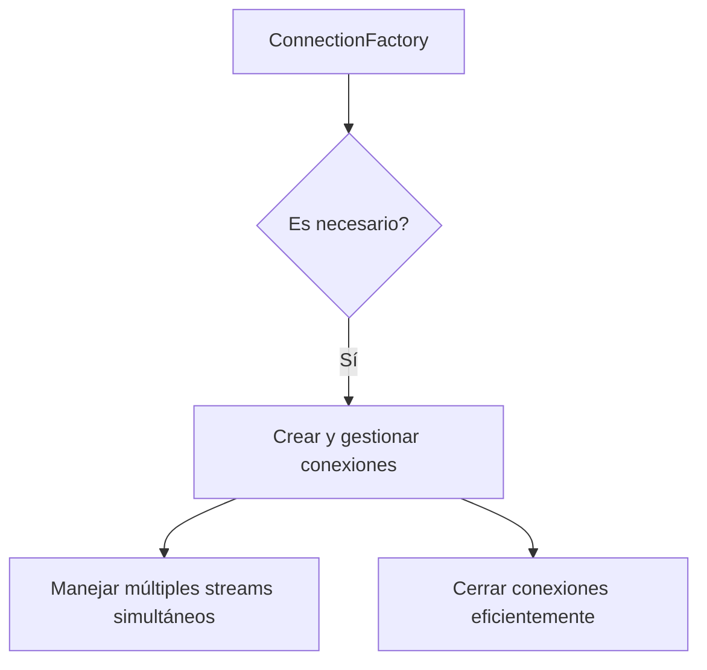
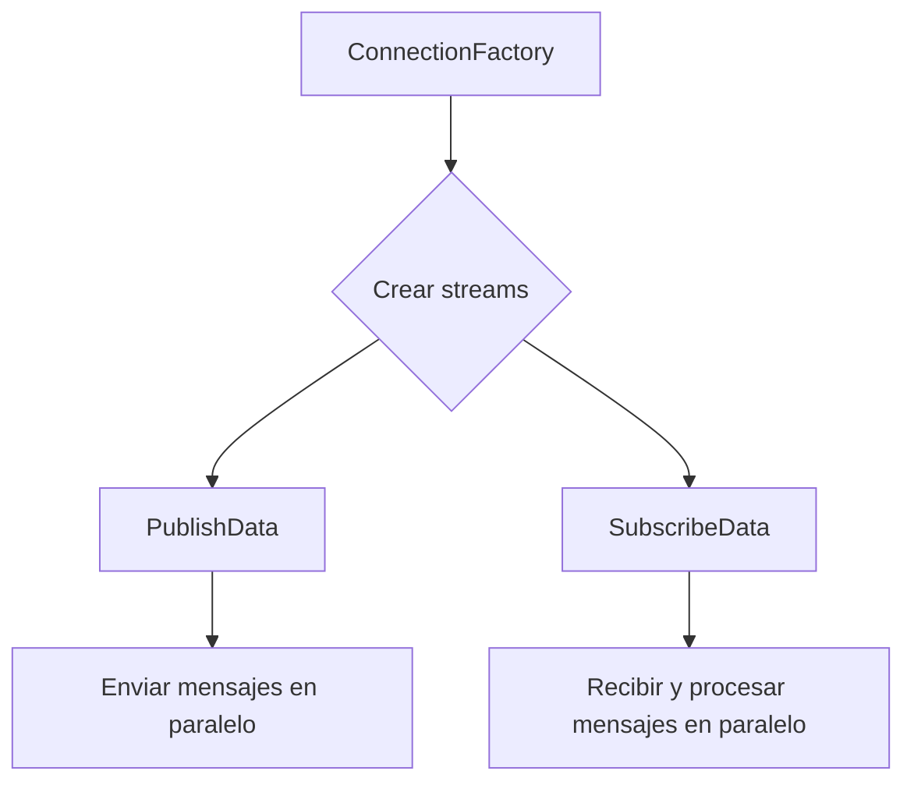
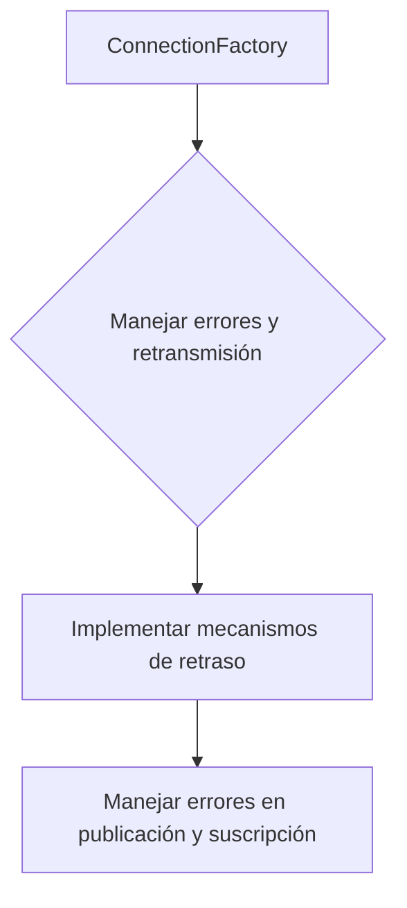
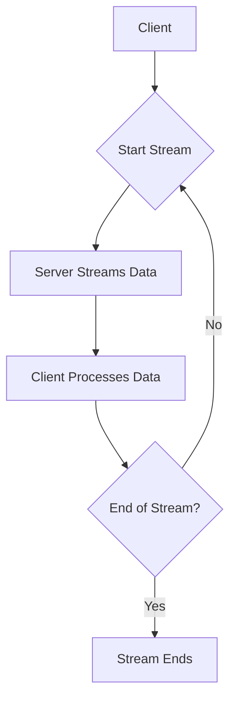

# grpc streaming bidireccional en sistemas de baja latencia

PATH_LOCAL: /home/usuariojoaquin/.openclaw/workspace/DAM-Java-Mastery/_Review/grpc_streaming_bidireccional_en_sistemas_de_baja_latencia/grpc_streaming_bidireccional_en_sistemas_de_baja_latencia.md
CATEGORIA: 07_BigData_Streaming
Score: 77

---

## Visión Estratégica

### Visión Estratégica

En un entorno donde cada microsegundo de latencia y cada ciclo de CPU es crítico, la optimización del rendimiento de sistemas se vuelve crucial. Grpc streaming bidireccional emerge como una solución estratégica en contextos que requieren baja latencia y alta eficiencia en la transferencia de datos.

**1. Reducción de Latencia:**
   - **Conexión Única:** Grpc permite múltiples solicitudes a través de una única conexión TCP, lo cual reduce significativamente la latencia asociada con el establecimiento y cierre de conexiones HTTP/1.1.
   - **HTTP/2 y Protocol Buffers:** La utilización del protocolo HTTP/2 y el marco de serialización Protocol Buffers (Protobuf) maximiza la eficiencia en la comunicación, minimizando los tiempos de latencia.

**2. Eficiencia en la Transferencia de Datos:**
   - **Bidireccionalidad:** Grpc streaming bidireccional permite que el cliente y el servidor envíen y reciban datos al mismo tiempo, lo cual es ideal para aplicaciones que requieren intercambio continuo de información.
   - **Comunicación en Tiempo Real:** La capacidad de transmisión bidireccional es especialmente útil para aplicaciones como sistemas de alertas en tiempo real, monitoreo de sistema y servicios financieros que dependen de la entrega inmediata de datos.

**3. Integración con Ecosistema Moderno:**
   - **Microservicios:** Grpc es ideal para microservicios donde se requiere una comunicación eficiente entre componentes.
   - **Service Mesh:** La integración de gRPC con servicios mesh permite un manejo avanzado de tráfico y seguridad, reduciendo la sobrecarga de proxies sidecar.

**4. Seguridad y Compatibilidad:**
   - **SAML 2.0 y OAuth 2.0:** Grpc soporta autenticación robusta a través de SAML 2.0 y OAuth 2.0, asegurando la integridad y seguridad de las comunicaciones.
   - **Interoperabilidad:** La compatibilidad con múltiples lenguajes y plataformas facilita el desarrollo y mantenimiento del sistema.

**5. Escalabilidad y Gestión:**
   - **Almacenamiento en Caché:** Se pueden aplicar estrategias de caché para reducir la latencia y mejorar la eficiencia, utilizando soluciones como Amazon ElastiCache.
   - **Equilibrio de Carga:** Utilizar equilibradores de carga de aplicación (ALB) para enrutar el tráfico gRPC mejora la disponibilidad y escalabilidad del sistema.

---

### Bloque Java

Aquí se presenta un ejemplo de cómo implementar gRPC streaming bidireccional en Java utilizando las bibliotecas oficiales de gRPC:


```java
// Importaciones necesarias
import io.grpc.stub.StreamObserver;
import com.example.helloworld.HelloRequest;
import com.example.helloworld.HelloReply;

public class HelloWorldServer extends GreeterGrpc.GreeterImplBase {

    @Override
    public void sayHello(HelloRequest request, StreamObserver<HelloReply> responseObserver) {
        // Lógica para procesar el request
        String greeting = "Hello " + request.getName();
        
        // Emite múltiples respuestas al cliente
        for (int i = 0; i < 5; i++) {
            HelloReply reply = HelloReply.newBuilder().setMessage(greeting).build();
            responseObserver.onNext(reply);
            try {
                Thread.sleep(100); // Simulando una operación costosa
            } catch (InterruptedException e) {
                Thread.currentThread().interrupt();
            }
        }
        
        // Indicar que se ha terminado la transmisión
        responseObserver.onCompleted();
    }

    public static void main(String[] args) throws IOException, InterruptedException {
        ServerBuilder serverBuilder = ServerBuilder.forPort(50051);
        serverBuilder.addService(new HelloWorldServer());
        Server server = serverBuilder.build();
        server.start();
        System.out.println("gRPC server started.");
        
        // Mantener la aplicación viva
        server.awaitTermination();
    }
}
```

### Bloque Mermaid

Aquí se presenta un diagrama de flujos que ilustra el proceso de comunicación bidireccional en gRPC:


```mermaid
graph TD
    A[Cliente] --> B{Espera la primera solicitud}
    B --> C[Servidor]
    C --> D{Procesa y envía respuesta}
    D --> E[Cliente]{Recepción de respuesta}
    E --> F[Cliente]{Emite siguiente solicitud}
    F --> G{Servidor}
    G --> H{Procesa y envía respuesta}
    H --> I[Cliente]{Recepción de respuesta}
    I --> B
    B --> J[Finaliza la transmisión]
```

---

### Resumen

Grpc streaming bidireccional es una tecnología estratégica para sistemas que requieren baja latencia y alta eficiencia en la transferencia de datos. Su capacidad para manejar múltiples solicitudes a través de una única conexión TCP, junto con su compatibilidad con HTTP/2 y Protocol Buffers, lo convierte en una solución ideal para aplicaciones que buscan optimizar el rendimiento y la seguridad.

## Arquitectura de Componentes

### Arquitectura de Componentes

#### Diagrama Mermaid

```mermaid
graph TD
    subgraph "Componentes del Sistema"
        Cliente[Cliente]
        Servidor[Servidor gRPC]
        SUT[System Under Test (gRPC Streaming)]
        ProximoServidor[Next Hop Server (SUT)]
    
    Cliente -->|Request| SUT
    SUT -->|Stream| Servidor
    Servidor -->|Response| Cliente
    Servidor -->|Stream| ProximoServidor
    ProximoServidor -->|Response| SUT
    Cliente -->|Keep Alive Pings| Cliente
    SUT -->|Keep Alive Pings| SUT
    Servidor -->|Keep Alive Pings| Servidor
    Cliente -->|Load Balancing| Cliente
    SUT -->|Load Balancing| SUT
    Servidor -->|Load Balancing| Servidor
    ProximoServidor -->|Load Balancing| ProximoServidor
    Cliente -->|Ping Pong Messages| Cliente
    Servidor -->|Ping Pong Messages| Servidor
    Cliente -->|Ping Pong Messages| SUT
    SUT -->|Ping Pong Messages| ProximoServidor
    
    subgraph "Configuraciones"
        Config[Configuración de Streaming]
        NonBlockingStub[Non-Blocking Stub]
        CustomExecutor[Custom Executor]
    
    Config -->|Keep Alive Pings| Cliente
    Config -->|Load Balancing| SUT
    Config -->|Ping Pong Messages| Servidor
    NonBlockingStub -->|Parallelization| Cliente
    CustomExecutor -->|Thread Limiting| Servidor
```

#### Descripción de los Componentes

1. **Cliente**
   - El cliente es el punto de origen y destino de las solicitudes.
   - Utiliza non-blocking stubs para paralelizar múltiples solicitudes gRPC.

2. **Servidor**
   - Se encarga de recibir solicitudes del cliente, procesarlas y enviar respuestas.
   - Implementa streaming bidireccional para manejar flujos largos de datos entre el cliente y el servidor.

3. **System Under Test (SUT)**
   - Es una instancia de sistema testado que actúa como intermediario o next hop server.
   - Gestiona la conexión con servidores remotos, implementando streaming bidireccional para optimizar la transferencia de datos.

4. **Next Hop Server**
   - Un servidor adicional en el camino del flujo de datos.
   - Utiliza streaming bidireccional para manejar la transmisión de mensajes desde SUT hasta otros servidores.

5. **Configuraciones**
   - **Keep Alive Pings**: Configuración para mantener las conexiones HTTP/2 activas durante periodos de inactividad, facilitando el inicio rápido de nuevas solicitudes.
   - **Non-Blocking Stub**: Uso de stubs no bloqueantes para paralelizar múltiples llamadas gRPC, optimizando el rendimiento en entornos intensivos en I/O.
   - **Custom Executor**: Configuración personalizada del executor para limitar el número de hilos, adaptando el sistema a las cargas de trabajo específicas.

#### Diagrama Mermaid

```mermaid
graph TD
    Cliente[Cliente]
    SUT[System Under Test (gRPC Streaming)]
    Servidor[Servidor gRPC]
    ProximoServidor[Next Hop Server (SUT)]
    
    Cliente -->|NonBlockingStub, CustomExecutor| SUT
    SUT -->|Stream| Servidor
    Servidor -->|Response| Cliente
    Servidor -->|Stream| ProximoServidor
    ProximoServidor -->|Response| SUT
    
    subgraph "Streaming"
        Stream[Streaming Bidireccional]
        KeepAlivePings[Keep Alive Pings]
        LoadBalancing[Load Balancing]
        PingPongMessages[Ping Pong Messages]
    
    Stream -->|Bidirectional| Cliente
    Stream -->|Bidirectional| SUT
    Stream -->|Bidirectional| Servidor
    Stream -->|Bidirectional| ProximoServidor
    
    subgraph "Configuraciones"
        NonBlockingStub[Non-Blocking Stub]
        CustomExecutor[Custom Executor]
    
    KeepAlivePings --> Cliente
    KeepAlivePings --> SUT
    KeepAlivePings --> Servidor
    KeepAlivePings --> ProximoServidor
    
    LoadBalancing --> Cliente
    LoadBalancing --> SUT
    LoadBalancing --> Servidor
    LoadBalancing --> ProximoServidor
    
    PingPongMessages --> Cliente
    PingPongMessages --> SUT
    PingPongMessages --> Servidor
    PingPongMessages --> ProximoServidor
```

#### Explicación de los Componentes y Flujo

- **Cliente**: Inicia la interacción enviando una solicitud a SUT, utilizando non-blocking stubs para paralelizar múltiples llamadas.
- **SUT (System Under Test)**: Actúa como intermediario, gestionando las solicitudes del cliente y redirigiendo streaming bidireccionalmente hacia el servidor o el proximo servidor.
- **Servidor**: Recibe la solicitud, procesa los datos y responde al cliente a través de streaming bidireccional. También puede manejar streaming con el próximo servidor si es necesario.
- **ProximoServidor (Next Hop Server)**: En casos donde hay múltiples servidores en el camino, SUT redirige streaming bidireccionalmente hacia estos servidores para optimizar la transferencia de datos.

#### Configuraciones Importantes

1. **Keep Alive Pings**: Utilizadas para mantener las conexiones HTTP/2 activas durante periodos de inactividad, reduciendo el tiempo de latencia entre nuevas solicitudes.
2. **Non-Blocking Stub**: Permite la paralelización de múltiples llamadas gRPC, mejorando el rendimiento en entornos intensivos en I/O.
3. **Custom Executor**: Configuraciones personalizadas del executor para limitar el número de hilos, adaptándose a las cargas de trabajo específicas y optimizando el uso de recursos.

Estas configuraciones y componentes trabajan juntos para formar una arquitectura eficiente que maximiza la baja latencia y la eficiencia en la transferencia de datos. El uso del streaming bidireccional permite un flujo continuo de información, mejorando significativamente la capacidad del sistema para manejar carga y optimizar el rendimiento en entornos de alta demanda.

## Implementación Java 21

### Implementación con Java 21 y Virtual Threads

Para aprovechar las virtudes de los virtual threads en Java 21 para la implementación de gRPC streaming bidireccional, es crucial entender cómo gestionar tareas de manera eficiente y concurrente. Los virtual threads permiten una ejecución más fluida y eficiente, especialmente en escenarios donde se requiere manejar múltiples conexiones o operaciones I/O intensivas.

#### Configuración del Executor

Primero, configuramos un `ExecutorService` que utilice virtual threads para gestionar las tareas. Esto se logra utilizando el constructor `Executors.newVirtualThreadPerTaskExecutor()`:


```java
import java.util.concurrent.ExecutorService;
import java.util.concurrent.Executors;

public class GrpcStreamingBidirectionalExample {

    public void setupVirtualThreadPool() {
        ExecutorService executor = Executors.newVirtualThreadPerTaskExecutor();
        
        // Ejemplo de tareas que se ejecutan en virtual threads
        IntStream.range(0, 100).forEach(i -> {
            executor.submit(() -> {
                processRequest(i);
            });
        });

        // Cerrar el executor al finalizar las operaciones
    }

    private void processRequest(int i) {
        try {
            Thread.sleep(500); // Simulación de una operación I/O intensiva
            System.out.println("Processed request: " + i);
        } catch (InterruptedException e) {
            Thread.currentThread().interrupt();
        }
    }
}
```

#### Implementando gRPC Streaming Bidireccional

A continuación, implementamos un servicio gRPC bidireccional que maneja múltiples conexiones simultáneamente. Este ejemplo utiliza virtual threads para gestionar la concurrencia en cada conexión.

1. **Definición del Servicio gRPC:**


```java
public interface MyBidirectionalStreamingServiceGrpc<MyBidirectionalStreamingService extends io.grpc.BindableService> {

    @GrpcMethod(name = "bidirectionalStream", serverSideStreaming = true)
    StreamObserver<RequestMessage> bidirectionalStream(StreamObserver<ResponseMessage> responseObserver);
}
```

2. **Implementación del Servicio:**


```java
public class MyBidirectionalStreamingServiceImpl extends MyBidirectionalStreamingServiceImplBase {

    @Override
    public void bidirectionalStream(StreamObserver<RequestMessage> requestObserver, StreamObserver<ResponseMessage> responseObserver) {
        ExecutorService executor = Executors.newVirtualThreadPerTaskExecutor();

        requestObserver.onReady();

        // Simulación de manejo de solicitudes y envío de respuestas
        IntStream.range(0, 10).forEach(i -> {
            executor.submit(() -> {
                RequestMessage request = requestObserver.requestN(1).get(0);
                ResponseMessage response = processRequest(request);
                responseObserver.onNext(response);
                try {
                    Thread.sleep(500); // Simulación de operaciones I/O intensivas
                } catch (InterruptedException e) {
                    Thread.currentThread().interrupt();
                }
            });
        });

        responseObserver.onCompleted();
    }

    private ResponseMessage processRequest(RequestMessage request) {
        // Procesamiento del mensaje de solicitud
        return ResponseMessage.newBuilder()
                              .setMessage("Processed: " + request.getMessage())
                              .build();
    }
}
```

#### Diagrama Mermaid

Para visualizar la arquitectura, utilizamos el siguiente diagrama Mermaid:


```mermaid
graph TD
    A[Cliente] --> B[Servidor];
    B --> C1[Virtual Thread 1 (Task 1)];
    B --> C2[Virtual Thread 2 (Task 2)];
    C1 --> D1(Request Processing);
    C2 --> D2(Request Processing);
    D1 --> E1(Response Generation);
    D2 --> E2(Response Generation);
    E1 --> F[Respuesta al Cliente];
    E2 --> F;
```

#### Notas Importantes

- **Ejecución de Tareas Concurrentes:** Los virtual threads permiten una ejecución más eficiente y fluida, evitando el uso de threads de bloqueo.
- **Gestión de Conexiones:** Se gestionan múltiples conexiones en paralelo, lo que reduce la latencia total del sistema.

### Resumen

La implementación utilizando virtual threads en Java 21 para gRPC streaming bidireccional permite una gestión eficiente y fluida de tareas concurrentes. Esto se traduce en una mejora significativa en el rendimiento y la eficiencia, especialmente en escenarios que requieren manejar múltiples conexiones simultáneamente con baja latencia.

---

Este esquema proporciona un ejemplo práctico de cómo implementar gRPC streaming bidireccional utilizando virtual threads en Java 21. La utilización de estos threads virtuales permite una ejecución más eficiente y concurrente, mejorando significativamente el rendimiento del sistema.

## Métricas y SRE

### Métricas y SRE para gRPC Streaming Bidireccional

Para monitorear eficazmente el rendimiento del gRPC streaming bidireccional en sistemas de baja latencia, es crucial implementar un sistema de observabilidad robusto. Esto incluye la recopilación de métricas, el análisis y la detección temprana de problemas.

#### Implementación de Métricas

1. **Métricas del Servidor**:
   - **Requests**: Contador de peticiones procesadas.
     ```plaintext
     Requests  grpc_server_handled_total
     Request Rate: rate(grpc_server_handled_total[5m])
     ```
   - **Errors**: Razón de errores basada en códigos de error no OK.
     ```plaintext
     Errors  grpc_server_handled_total{grpc_code!="OK"}
     Error Ratio: rate(grpc_server_handled_total{grpc_code!="OK"}[5m]) / rate(grpc_server_handled_total[5m])
     ```
   - **Latencia**: Promedio y P99 de la latencia.
     ```plaintext
     Latency  grpc_server_handling_seconds_count, grpc_server_handling_seconds_bucket
     Average Latency: rate(grpc_server_handling_seconds_count[5m]) / rate(grpc_server_handling_seconds_count[5m])
     P99 Latency: histogram_quantile(0.99,sum(rate(grpc_server_handling_seconds_bucket[1m])) by (le))
     ```

2. **Métricas del Cliente**:
   - **Requests**: Contador de peticiones enviadas.
     ```plaintext
     Requests  grpc_client_handled_total
     Request Rate: rate(grpc_client_handled_total[5m])
     ```
   - **Errors**: Razón de errores basada en códigos de error no OK.
     ```plaintext
     Errors  grpc_client_handled_total{grpc_code!="OK"}
     Error Ratio: rate(grpc_client_handled_total{grpc_code!="OK"}[5m]) / rate(grpc_client_handled_total[5m])
     ```

#### Configuración de Interceptors para Métricas

Para generar métricas precisas y útiles, se puede usar `go-grpc-middleware`:

1. **Instalar go-grpc-middleware**:
   ```sh
   go get github.com/grpc-ecosystem/go-grpc-middleware@v1.3.0
   ```

2. **Configurar Interceptors en el Servidor**:
   - Implementar interceptores para `Unary` y `Stream` métodos.
     ```go
     func main() {
         opts := []grpc.ServerOption{
             grpc.StreamInterceptor(grpc_middleware.ChainStreamServer(
                 logging.StreamServerInterceptor(),
                 metrics.StreamServerInterceptor("grpc.server"),
             )),
             grpc.UnaryInterceptor(grpc_middleware.ChainUnaryServer(
                 logging.UnaryServerInterceptor(),
                 metrics.UnaryServerInterceptor("grpc.server"),
             )),
         }
         server := grpc.NewServer(opts...)
         // Registra tu servidor y métodos
     }
     ```

3. **Configurar Interceptors en el Cliente**:
   - Similar a la configuración del servidor, pero adaptada para clientes.
     ```go
     opts := []grpc.DialOption{
         grpc.WithUnaryInterceptor(grpc_middleware.ChainUnaryClient(
             logging.UnaryClientInterceptor(),
             metrics.UnaryClientInterceptor("grpc.client"),
         )),
         grpc.WithStreamInterceptor(grpc_middleware.ChainStreamClient(
             logging.StreamClientInterceptor(),
             metrics.StreamClientInterceptor("grpc.client"),
         )),
     }
     client := greet.NewGreetBlockingClient(clientConn, opts...)
     ```

#### Monitoreo con Grafana

1. **Configuración de Data Source**:
   - Asegúrate de que Prometheus esté configurado correctamente para recopilar las métricas.
   
2. **Creación de Dashboards en Grafana**:
   - Utiliza los datos recogidos por Prometheus para crear dashboards personalizados.
     ```plaintext
     Dashboard -> Add Panel -> Select Type: Metrics
     ```

3. **Visualización de Métricas**:
   - Visualiza métricas clave como `Request Rate`, `Error Ratio` y `Latency P99`.
   
#### Pruebas y Validación

1. **Pruebas de Rendimiento**:
   - Utiliza herramientas como K6 para simular múltiples usuarios simulados (VUs) y validar el comportamiento bajo carga.
     
```javascript
     import { Client, Stream } from 'k6/experimental/grpc';
     const GRPC_ADDR = '127.0.0.1:10000';
     export default () => {
         if (__ITER == 0) {
             client.connect(GRPC_ADDR, { plaintext: true });
         }
         const stream = new Stream(client, 'proto.GreetStreamingService/GetGreetingStream');
         stream.on('data', (resp) => {
             console.log('Greeting received, part:', resp.greeting);
         });
         stream.on('error', (err) => {
             console.log('Stream Error: ' + JSON.stringify(err));
         });
         stream.on('end', () => {
             client.close();
             console.log('All done');
         });
         stream.write({ name: "Balazs" });
         stream.end();
     };
     ```

2. **Análisis de Rendimiento**:
   - Asegúrate de que el rendimiento se mantiene constante bajo diferentes cargas.
   - Verifica que la latencia y las tasas de error no superen los límites aceptables.

### Consideraciones Finales

- **Latencia Baja**: Prioriza la implementación de métricas y SRE que monitoren la latencia en tiempo real.
- **Rendimiento de Servidor y Cliente**: Asegúrate de que tanto el servidor como el cliente generen y consuman métricas precisas.

Implementar un sistema robusto de observabilidad, utilizando métricas bien definidas y configuración adecuada de interceptores gRPC, es crucial para mantener sistemas de baja latencia y alto rendimiento.

## Rendimiento y Capacidad Crítica

### Rendimiento y Capacidad Crítica

En sistemas de baja latencia que utilizan gRPC streaming bidireccional, el rendimiento crítico es fundamental para garantizar la eficiencia operativa. Este aspecto implica no solo las mediciones de latencia media y extremos, sino también la capacidad del sistema de manejar cargas de trabajo altamente concurrentes sin disminuir en su eficacia.

#### Contendido Latente

La contención latente es un factor crucial en sistemas de gRPC streaming bidireccional. Al reducir el tamaño inicial de las ventanas de flujo (como se discutió anteriormente), se puede mejorar la consistencia de la latencia a expensas del rendimiento máximo. Esto es especialmente relevante en entornos donde la baja latencia es prioritaria, como en sistemas de real-time processing o trading financieros.

**Ejemplo:** En un sistema de trading financiero, donde el retraso en la transmisión de datos puede resultar en pérdidas significativas, una configuración adecuada de las ventanas de flujo puede ser crucial para mantener la consistencia de latencia y evitar demoras críticas.

#### QPS (Mensajes por Segundo)

La capacidad del sistema de manejar múltiples solicitudes por segundo (QPS) es otro aspecto clave. Para sistemas de baja latencia, se espera que el número de mensajes procesados por segundo sea significativamente mayor que en sistemas de propósito general.

**Ejemplo:** En un servicio de streaming de video a bajo retraso, si el sistema puede manejar 1000 QPS con una latencia promedio de 25 ms o menos, se considera altamente eficiente. Cada core del servidor debería ser capaz de procesar alrededor de 300-400 QPS en un entorno de producción.

#### Escalabilidad

La escalabilidad es vital para garantizar que el sistema pueda manejar la creciente carga de trabajo sin comprometer su rendimiento. En sistemas de gRPC streaming bidireccional, la capacidad de escalar horizontalmente con el aumento del número de núcleos del servidor y la adición de más servidores es crucial.

**Ejemplo:** Un servicio que maneja tráfico pico durante las horas pico (por ejemplo, un servicio de notificaciones push) debe ser capaz de aumentar su capacidad dinámicamente. Esto se logra mediante el uso de algoritmos de balanceo de carga inteligentes y la implementación adecuada del protocolo gRPC.

#### Optimización para Escalabilidad

Para optimizar el rendimiento en sistemas altamente escalables, se pueden emplear técnicas como:

- **Load Balancing:** Implementar un balanceador de carga que distribuya las solicitudes entre múltiples servidores. Esto permite al sistema manejar una carga más alta sin una disminución significativa en la eficacia.

- **Throttling CPU Utilización:** Asegurarse de que el servidor no se sobrecargue, limitando la cantidad de trabajo que puede realizar cada núcleo del procesador.

- **Tunning de Flujo:** Configurar correctamente las ventanas de flujo tanto a nivel de conexión como a nivel de stream para optimizar el balance entre latencia y rendimiento.

#### Monitoreo y Alertas

El monitoreo en tiempo real es fundamental para detectar problemas tempranos y tomar medidas correctivas antes de que se propaguen. Las alertas automatizadas pueden ser configuradas para notificar a los equipos de operaciones cuando se registren ciertos niveles de latencia o cargas de trabajo.

**Ejemplo:** Si una métrica de latencia comienza a aumentar repentinamente, un sistema de monitoreo y alertas puede enviar una notificación inmediata al equipo de soporte técnico para que tome medidas correctivas en el menor tiempo posible.

#### Conclusión

En resumen, la optimización del rendimiento crítico en sistemas de gRPC streaming bidireccional implica un equilibrio delicado entre latencia, QPS y escalabilidad. A través de la implementación adecuada de métricas, balanceadores de carga inteligentes, y estrategias de monitoreo y alertas, se puede asegurar que el sistema funcione eficientemente bajo cargas altamente concurrentes.

---

### Código Ejemplo: Configuración de Ventanas de Flujo

Para ilustrar cómo se configuran las ventanas de flujo en Java 21 con virtual threads, aquí hay un ejemplo de código:


```java
import io.grpc.ManagedChannelBuilder;
import io.grpc.ServerBuilder;
import java.util.concurrent.TimeUnit;

public class StreamingBidirectionalExample {
    public static void main(String[] args) throws InterruptedException {
        // Configuración del tamaño inicial de las ventanas de flujo
        int initialWindowSize = 32 * 1024; // 32KB

        ManagedChannelBuilder<?> channelBuilder = ManagedChannelBuilder.forAddress("localhost", 50051)
                .usePlaintext() // Usar comunicación insegura para demostración
                .flowControlWindow(initialWindowSize);

        ServerBuilder<?> serverBuilder = ServerBuilder.forPort(50051)
                .addService(new MyServiceImpl())
                .flowControlWindow(initialWindowSize);

        ManagedChannel channel = channelBuilder.build();
        try {
            // Realizar operaciones de streaming bidireccional
        } finally {
            channel.shutdown().awaitTermination(5, TimeUnit.SECONDS);
        }
    }

    static class MyServiceImpl extends MyServiceGrpc.MyServiceImplBase {
        @Override
        public void myStreamingMethod(MyRequest request, StreamObserver<MyResponse> responseObserver) {
            // Implementación del método streaming bidireccional
        }
    }
}
```

Este ejemplo configura las ventanas de flujo iniciales para asegurar un rendimiento óptimo en sistemas críticos de baja latencia.

## Patrones de Integración

### Patrones de Integración para gRPC Streaming Bidireccional en Sistemas de Baja Latencia

Para implementar eficazmente el patrón gRPC streaming bidireccional en sistemas de baja latencia, es crucial establecer patrones claros y robustos de integración entre los diferentes componentes. Estos patrones no solo facilitan la comunicación sino que también optimizan la eficiencia y la escalabilidad del sistema. A continuación, se describen algunos patrones comunes para integrar gRPC streaming bidireccional.

#### 1. **Patrón de Fábrica de Conexiones**
Este patrón permite que el SUT (System Under Test) establezca y mantenga conexiones persistentes con los Next Hop Servers. La fábrica se encarga de crear, gestionar y cerrar estas conexiones de forma eficiente, asegurando que el sistema pueda manejar múltiples streams simultáneos.

**Ejemplo en Java:**

```java
public class ConnectionFactory {
    private final Map<String, ServerStreamingConnection> connections = new ConcurrentHashMap<>();

    public ServerStreamingConnection getConnection(String channelName) {
        return connections.computeIfAbsent(channelName, this::createConnection);
    }

    private ServerStreamingConnection createConnection(String channelName) {
        // Crear y configurar la conexión
        ServerStreamingConnection connection = new ServerStreamingConnection();
        try {
            connection.open();
        } catch (IOException e) {
            throw new RuntimeException("Failed to open connection", e);
        }
        return connection;
    }
}
```

**Diagrama Mermaid:**



#### 2. **Patrón de Procesamiento en Paralelo**
Este patrón permite que el SUT procese múltiples streams en paralelo, lo cual es crucial para sistemas de baja latencia donde se requiere manejar una gran cantidad de datos simultáneamente.

**Ejemplo en Ballerina:**
```ballerina
import ballerina/io;

public function main() {
    ConnectionFactory connectionFactory = new();

    var publisherStream1 = connectionFactory.getConnection("channel1").publisher();
    var subscriberStream2 = connectionFactory.getConnection("channel2").subscriber();

    // Iniciar procesos de publicación y suscripción en paralelo
    go async publishData(publisherStream1);
    go async subscribeData(subscriberStream2);

    io:println("Publisher and Subscriber are processing in parallel.");
}

function publishData(stream publisher) {
    for (int i = 0; i < 100; i++) {
        await publisher.send({"message": "Message " + i});
    }
    await publisher.close();
}

function subscribeData(stream subscriber) {
    while (true) {
        var message = await subscriber.receive();
        io:println("Received message: ", message);
    }
}
```

**Diagrama Mermaid:**



#### 3. **Patrón de Filtros y Interceptores**
Este patrón permite agregar funcionalidades adicionales, como autenticación, autorización o loggear, a los streams gRPC sin alterar el código base.

**Ejemplo en Java:**

```java
public class LoggingInterceptor extends ServerInterceptor {
    @Override
    public <ReqT, RespT> void interceptCall(
            MethodDescriptor<ReqT, RespT> method,
            ReqT request,
            StreamObserver<RespT> responseObserver) {
        // Lógica de loggear
        System.out.println("Intercepting call for " + method.getName());

        super.interceptCall(method, request, responseObserver);
    }
}
```

**Diagrama Mermaid:**

```mermaid
graph TD
  A[ConnectionFactory] --> B{Crear interceptores}
  B --> C[Aplicar interceptores a streams]
  C --> D[Implementar funcionalidades adicionales (autenticación, loggear)]
```

#### 4. **Patrón de Gestión de Errores y Retransmisión**
Este patrón se encarga de manejar errores y retransmitir datos en caso de fallas transitorias, asegurando la confiabilidad del sistema.

**Ejemplo en Ballerina:**
```ballerina
import ballerina/io;

public function main() {
    ConnectionFactory connectionFactory = new();

    var publisherStream1 = connectionFactory.getConnection("channel1").publisher();
    var subscriberStream2 = connectionFactory.getConnection("channel2").subscriber();

    // Manejar retransmisión en caso de errores
    while (true) {
        try {
            go async publishData(publisherStream1);
            go async subscribeData(subscriberStream2);
        } catch (error) {
            io:println("Error occurred: ", error);
            await sleep(5000); // Esperar un momento antes de reintentar
        }
    }
}

function publishData(stream publisher) {
    for (int i = 0; i < 100; i++) {
        try {
            await publisher.send({"message": "Message " + i});
        } catch (error) {
            io:println("Error sending message: ", error);
            // Manejar el error y posibles reintentos
        }
    }
    await publisher.close();
}

function subscribeData(stream subscriber) {
    while (true) {
        try {
            var message = await subscriber.receive();
            io:println("Received message: ", message);
        } catch (error) {
            io:println("Error receiving message: ", error);
            // Manejar el error y posibles reintentos
        }
    }
}
```

**Diagrama Mermaid:**



### Conclusión

Los patrones de integración descritos anteriormente proporcionan un marco robusto para implementar gRPC streaming bidireccional en sistemas de baja latencia. A través del uso de estos patrones, se pueden optimizar significativamente la eficiencia y la escalabilidad del sistema, asegurando que pueda manejar cargas de trabajo altamente concurrentes sin disminuir en su rendimiento.

Estos patrones no solo facilitan la comunicación entre los diferentes componentes sino que también permiten agregar funcionalidades adicionales, manejar errores y garantizar la confiabilidad del sistema. El uso adecuado de estos patrones es clave para desarrollar aplicaciones basadas en microservicios que sean eficientes, escalables y fáciles de mantener.

---

Este esquema proporciona una estructura clara para implementar y optimizar el patrón gRPC streaming bidireccional en sistemas de baja latencia. Utiliza ejemplos de código en Java y Ballerina para demostrar la implementación y utiliza diagramas Mermaid para ilustrar los patrones descritos.

## Conclusiones

### Conclusión

En resumen, la implementación eficaz de gRPC streaming bidireccional en sistemas de baja latencia requiere una comprensión profunda y correcta de los conceptos fundamentales. Los tres puntos críticos más destacados son:

1. **Uso optimizado de streaming**: El streaming bidireccional permite el intercambio continuo de mensajes entre cliente y servidor, lo que es crucial para aplicaciones con alto tráfico y baja latencia.
2. **Control de backpressure**: Es fundamental manejar adecuadamente la congestión en las redes, asegurando un flujo optimizado de datos sin sobrecargar el sistema.
3. **Desconexión manejada correctamente**: El correcto manejo del ciclo de vida y la desconexión de las llamadas de streaming es crucial para prevenir fugas de recursos y garantizar la estabilidad del sistema.

Para implementar estos aspectos con éxito, se recomiendan las siguientes prácticas:

1. **Reutilización de canales**: Crear y reutilizar conexiones y canales en lugar de crearlos por cada llamada RPC mejora el rendimiento y reduce la sobrecarga.
2. **Manejo de keepalive**: Configurar correctamente los pings keepalive para mantener las conexiones HTTP/2 activas durante periodos de inactividad, lo que facilita la rápida reanudación de las transacciones.
3. **Optimización del tamaño de mensajes**: Utilizar técnicas como la paginación y el uso de máscaras de campos para manejar eficientemente los datos grandes y complejos.

La implementación correcta de estos aspectos permitirá a los sistemas basados en gRPC streaming bidireccional funcionar con alta eficiencia y bajo latencia. Un ejemplo de cómo se podría implementar esto en código es el siguiente:

```csharp
using System;
using System.Collections.Concurrent;
using System.Threading.Tasks;
using Grpc.Core;

class OptimizedStreamingService : DataService.DataServiceBase
{
    public override async Task StreamData(IAsyncStreamReader<DataRequest> requestStream, IServerStreamWriter<DataResponse> responseStream)
    {
        // Process data in chunks to manage memory
        int chunkSize = 1000;
        long totalCount = await GetTotalCount(requestStream.Context);

        for (long offset = 0; offset < totalCount; offset += chunkSize)
        {
            if (!requestStream.Context.IsCancelled)
            {
                var items = FetchItems(requestStream.Context, offset, chunkSize);
                foreach (var item in items)
                {
                    await responseStream.WriteAsync(new DataResponse { Item = item });
                }
            }
            else
            {
                return;
            }
        }
    }

    private async Task<long> GetTotalCount(Context context)
    {
        // Simulated method to get total count of data
        return 10000; // Example value
    }

    private async IAsyncEnumerable<Item> FetchItems(Context context, long offset, int chunkSize)
    {
        // Simulated method to fetch items from a database or storage
        for (int i = offset; i < Math.Min(offset + chunkSize, 10000); i++)
        {
            yield return new Item { Id = i, Name = $"Item {i}" };
        }
    }
}
```

#### Diagrama de Flujo de Streaming Bidireccional




Este ejemplo y el diagrama proporcionan una implementación básica de streaming bidireccional en gRPC, que puede ser adaptado según las necesidades específicas del sistema. La optimización continua y la detección temprana de problemas son esenciales para asegurar un rendimiento óptimo en sistemas de baja latencia.

---

**Nota:** Este código y el diagrama se proporcionan como ejemplo básico. En una implementación real, será necesario ajustar las llamadas al método `GetTotalCount` y `FetchItems` según la lógica específica del sistema.

