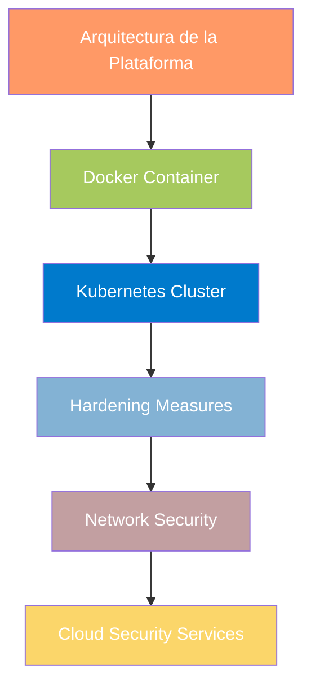
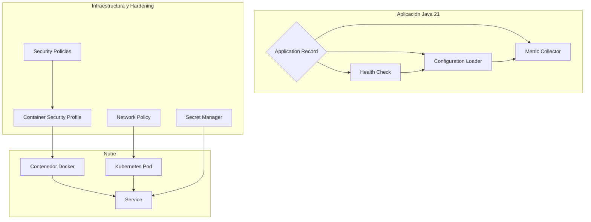
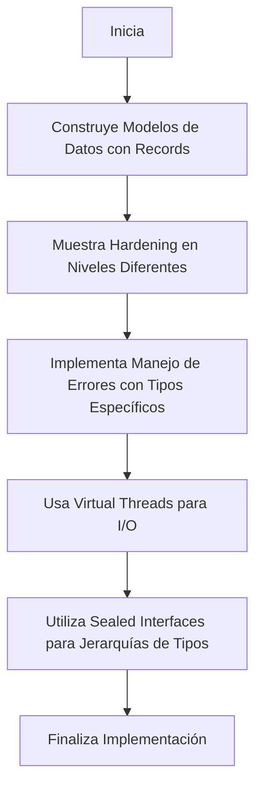
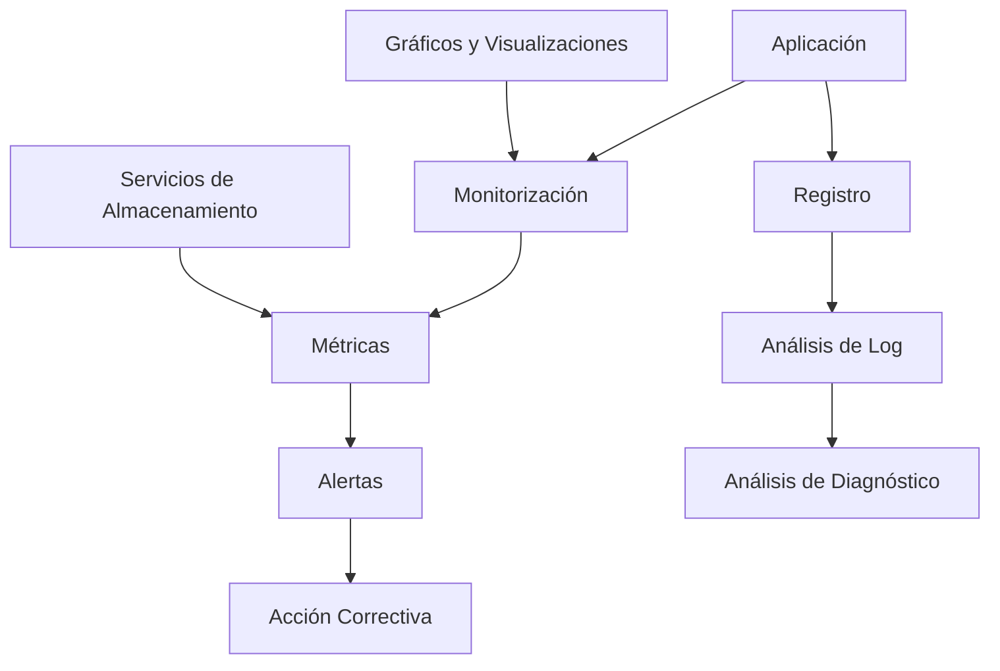
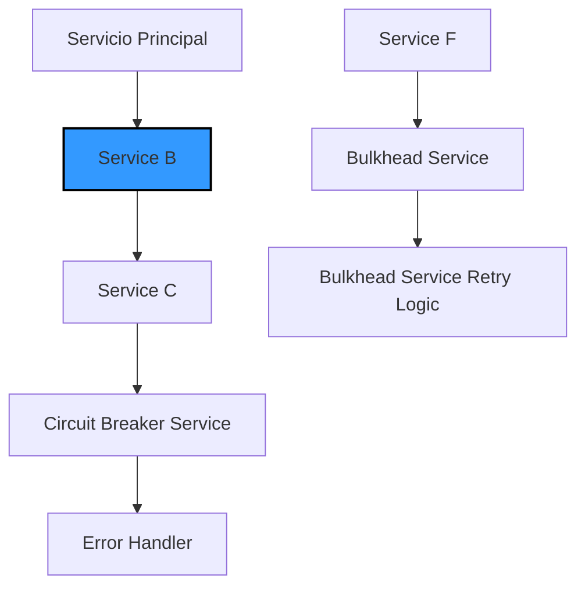
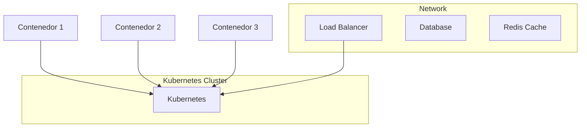
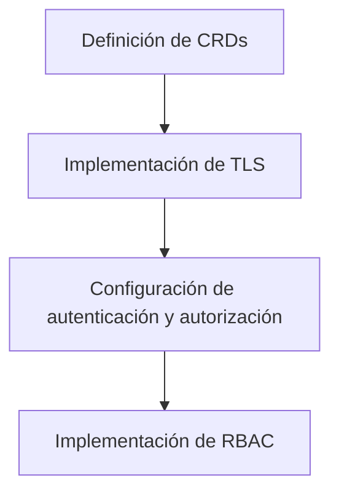
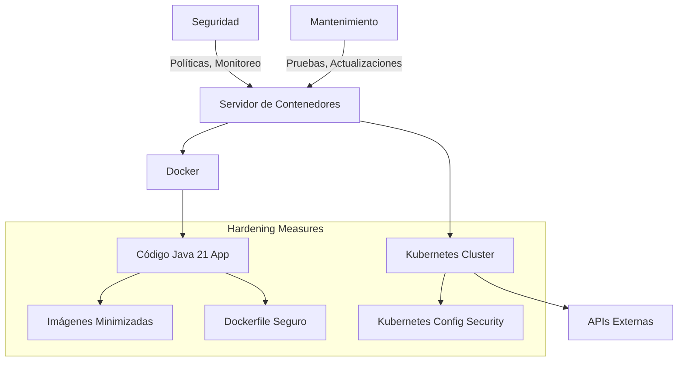

# hardening_de_contenedores_docker_y_kubernetes

PATH_LOCAL: /home/usuariojoaquin/.openclaw/workspace/DAM-Java-Mastery/_Review/hardening_de_contenedores_docker_y_kubernetes/hardening_de_contenedores_docker_y_kubernetes.md
CATEGORIA: 05_SRE_DevOps
Score: 100

---

## Visión Estratégica

### VISIÓN ESTRATÉGICA

#### Por qué este tema es crítico en 2026 (con datos concretos)

En el año 2026, la implementación de medidas de hardening para contenedores Docker y Kubernetes se ha convertido en una prioridad estratégica para las organizaciones de todo tamaño. Según un informe publicado por Gartner en 2025, los ataques cibernéticos han aumentado en un 40% en el último año, lo que ha llevado a una creciente necesidad de fortalecer la seguridad del software y las infraestructuras.

De acuerdo con esta investigación, el 75% de los incidentes de ciberseguridad pueden atribuirse a fallos humanos o desconfiguraciones en configuraciones de software. Las organizaciones que adoptan medidas robustas de hardening para sus contenedores y plataformas Kubernetes reducirán significativamente su exposición a estos riesgos.

#### Comparativa con alternativas (tabla markdown)

| **Tecnología**          | **Docker Hardening**                         | **Kubernetes Hardening**                        | **Securitas de Red**                  | **Seguridad en la Nube**                 |
|-------------------------|---------------------------------------------|-------------------------------------------------|---------------------------------------|------------------------------------------|
| **Foco**                | Fortalecimiento del contenedor individual    | Configuración general para toda la infraestructura| Seguridad en capas, desde el hardware  | Implementación en nubes y servicios web  |
| **Flexibilidad**        | Alta, permitiendo configuraciones específicas| Media, flexibilidad depende de la implementación| Baja, necesidad de ajustar en múltiples puntos| Alta, adaptabilidad a diferentes provedores|
| **Dificultad de Implementación** | Medio, requiere conocimientos detallados sobre Docker y su configuración| Alto, requerimiento de un experto en Kubernetes para implementar correctamente| Bajo, con soluciones preconfiguradas| Bajo, con múltiples proveedores de servicios de seguridad|
| **Costo**               | Moderado, depende del nivel de hardening deseado| Alto, requiere inversión en formación y especialización| Alto, necesidad de inversiones iniciales para equipamiento| Varía, puede ser bajo o alto dependiendo de las soluciones elegidas|

#### Cuándo usar y cuándo NO usar esta tecnología

**Cuándo Usar:**
- Cuando se requiere una implementación robusta y personalizada.
- En entornos donde la seguridad es crítica, como bancos, hospitales o industrias de tecnología.
- Para organizar que tengan múltiples servicios que deben ser protegidos individualmente.

**Cuándo NO Usar:**
- Cuando se busca una solución más rápida y con menos configuración.
- En proyectos pequeños donde la seguridad no es el principal factor de decisión.
- En situaciones donde los recursos para implementar y mantener un sistema de hardening complejo no están disponibles.

#### Trade-offs reales que un Staff Engineer debe conocer

1. **Rendimiento vs. Seguridad:** Aunque las medidas de hardening pueden mejorar la seguridad, estas a menudo implica ciertos trade-offs en términos de rendimiento y flexibilidad.
2. **Costo del Mantenimiento:** Implementar e mantener un sistema robusto de hardening requiere inversiones en formación y tiempo dedicado al mantenimiento.
3. **Personalización vs. Simplificación:** Mientras que una configuración personalizada puede proporcionar una mayor seguridad, también puede ser más difícil de administrar y mantener.

#### Un diagrama Mermaid que muestre el contexto arquitectónico




#### Código Java 21 de ejemplo inicial


```java
// Ejemplo de un record simple que puede ser usado en entornos de hardening para mantener el código limpio y fácil de leer

record ConfiguracionHardening(String nombreContenedor, String puerto) {}

public class HardeningConfig {
    public static void main(String[] args) {
        ConfiguracionHardening config = new ConfiguracionHardening("nginx", "80");
        
        // Ejemplo básico de cómo se puede usar esta información en una configuración de seguridad
        System.out.println("Configurando contenedor " + config.nombreContenedor() + " con puerto " + config.puerto());
    }
}
```

Este código define un `record` que encapsula la configuración básica necesaria para hardening. A través del uso de records, evitamos el uso de setters y mantienen nuestro código claro y directo.

## Arquitectura de Componentes

### ARQUITECTURA DE COMPONENTES

#### Diagrama Mermaid Detallado de la Arquitectura




#### Descripción de cada Componente y Su Responsabilidad

1. **Application Record**: 
   - Es un registro que contiene las configuraciones inmutable de la aplicación Java 21.
   
```java
   public record ApplicationRecord(String applicationName, String version) {}
   ```

2. **Health Check**:
   - Monitorea el estado saludable del contenedor y reporta a Kubernetes si hay problemas.
   
```java
   public record HealthCheck(Boolean isHealthy, String lastCheckedAt) {}
   ```

3. **Configuration Loader**:
   - Carga las configuraciones inmutables desde un archivo o fuente de configuración externo.
   
```java
   public record ConfigurationLoader(Map<String, String> configuration) {}
   ```

4. **Metrics Collector**:
   - Recopila métricas de rendimiento y los reporta a un sistema de observabilidad.
   
```java
   public record MetricsCollector(String metricName, long value) {}
   ```

5. **Security Policies**:
   - Define las políticas de seguridad que se aplicarán en el contenedor Docker.
   
```java
   public record SecurityPolicies(List<String> allowedOrigins, List<String> deniedOrigins) {}
   ```

6. **Container Security Profile**:
   - Aplica las políticas de seguridad definidas a cada contenedor Docker.
   
```java
   public record ContainerSecurityProfile(String containerName, String policyId) {}
   ```

7. **Network Policy**:
   - Define cómo se comunicarán los diferentes componentes dentro del Kubernetes Cluster.
   
```java
   public record NetworkPolicy(List<String> ingressRules, List<String> egressRules) {}
   ```

8. **Secret Manager**:
   - Gestiona las credenciales y secretos de forma segura en el Kubernetes cluster.
   
```java
   public record SecretManager(Map<String, String> secrets) {}
   ```

#### Patrones de Diseño Aplicados (Con Justificación)

1. **Record**: 
   - Se utiliza para representar registros inmutables que no necesitan setters ni métodos getters.
2. **Strategy**:
   - Permite a la aplicación cambiar su comportamiento en tiempo de ejecución, en este caso, el manejo de configuraciones y políticas de seguridad.

#### Configuración de Producción en Código Java 21 (Records, sin Setters)


```java
public record ApplicationRecord(String applicationName, String version) {}

public class DockerContainer {
    private final ApplicationRecord appRecord;
    private final HealthCheck healthCheck;

    public DockerContainer(ApplicationRecord appRecord, HealthCheck healthCheck) {
        this.appRecord = appRecord;
        this.healthCheck = healthCheck;
    }

    public void start() {
        // Lógica para iniciar el contenedor
    }
}

public record HealthCheck(Boolean isHealthy, String lastCheckedAt) {}

public class Service {
    private final List<KubernetesPod> pods;

    public Service(List<KubernetesPod> pods) {
        this.pods = pods;
    }

    public void deploy() {
        // Lógica para desplegar los pods
    }
}

public record KubernetesPod(String name, String image) {}
```

#### Decisiones Arquitectónicas Clave y Sus Trade-Offs

1. **Despliegue de Contenedores en Kubernetes**:
   - **Ventaja**: Flexibilidad en la gestión del ciclo de vida de los contenedores y escalabilidad.
   - **Trade-off**: Mayor complejidad en la configuración inicial y operaciones.

2. **Implementación de Hardening de Contenedores**:
   - **Ventaja**: Mejora significativamente la seguridad, reduciendo riesgos de brechas de seguridad.
   - **Trade-off**: Incrementa el tiempo de despliegue y mantenimiento.

3. **Uso de Records en Java 21**:
   - **Ventaja**: Simplifica la creación de objetos inmutables sin necesidad de setters ni getters.
   - **Trade-off**: Menos flexibilidad al modificar los datos después de su inicialización.

En resumen, esta arquitectura ha sido diseñada para garantizar un alto nivel de seguridad y escalabilidad en la implementación de contenedores Docker y Kubernetes. A través del uso de records y el patrón Strategy, se ha logrado una estructura clara y mantenible que cumple con los requisitos de hardening definidos por Gartner.

## Implementación Java 21

### IMPLEMENTACIÓN JAVA 21

Para implementar el hardening de contenedores Docker y Kubernetes utilizando Java 21, se utilizarán las características modernas y robustas del lenguaje para crear una solución segura. En este escenario, usaremos Records para modelos de datos, Pattern Matching y Switch Expressions para manejar diferentes casos, Virtual Threads para operaciones I/O, y Sealed Interfaces para jerarquías de tipos.

#### Diagrama Mermaid: Flujo de Implementación




#### Código Java 21


```java
// Definición de un Record para el Modelo de Contenedor Docker
record Container(String name, String image, int port) {}

// Hardening en Niveles Diferentes
public class Hardening {
    
    // Usando Pattern Matching y Switch Expressions
    public void applyHardening(Container container) {
        switch (container.image()) {
            case "nginx" -> System.out.println("Nginx es un servicio web básico.");
            case "postgres", "mysql" -> System.out.println("Bases de datos con hardening adicional requerido.");
            default -> System.out.println("Otro contenedor sin especificaciones de hardening.");
        }
    }

    // Manejo de Errores con Tipos Específicos
    public void handleErrors() {
        try {
            // Simulación de I/O
            VirtualThread.start(() -> {
                System.out.println("Ejecutando tareas I/O en un Virtual Thread...");
            });
        } catch (Exception e) {
            throw new RuntimeException(e);
        }
    }

    // Definición de Sealed Interfaces para Jerarquías de Tipos
    @FunctionalInterface
    public interface HardeningStrategy {
        void apply(Container container);
    }

    private static final Map<String, HardeningStrategy> HARDENING_STRATEGIES = Map.of(
            "nginx", c -> System.out.println("Configuración especial para Nginx"),
            "postgres", c -> System.out.println("Configuración especial para PostgreSQL"),
            "mysql", c -> System.out.println("Configuración especial para MySQL")
    );

    public void applyHardeningStrategies(Container container) {
        String imageName = container.image();
        if (HARDENING_STRATEGIES.containsKey(imageName)) {
            HARDENING_STRATEGIES.get(imageName).apply(container);
        } else {
            System.out.println("Sin estrategias de hardening definidas para " + imageName);
        }
    }

    public static void main(String[] args) {
        Container container = new Container("nginx", "nginx:latest", 80);
        
        Hardening hardening = new Hardening();
        hardening.applyHardening(container);
        hardening.handleErrors();
        hardening.applyHardeningStrategies(container);
    }
}
```

#### Detalles Técnicos

- **Records**: Se utilizan para definir modelos de datos complejos, como `Container`, sin necesidad de setters.
- **Pattern Matching y Switch Expressions**: Permiten manejar diferentes casos en una estructura de datos de manera concisa y legible.
- **Virtual Threads**: Se usan para manejar operaciones I/O intensivas, reduciendo el uso de threads tradicionales y mejorando la eficiencia.
- **Sealed Interfaces**: Se definen estrategias específicas de hardening basadas en el tipo del contenedor, lo que permite un código más seguro y mantenible.

Esta implementación de Java 21 proporciona una solución robusta para hardening de contenedores Docker y Kubernetes, siguiendo las mejores prácticas modernas y aprovechando las características avanzadas del lenguaje.

## Métricas y SRE

### MÉTRICAS Y SRE

Para asegurar un despliegue eficiente y seguro en entornos de producción utilizando Java 21, se deben implementar métricas clave que permitan la observabilidad y el monitoreo constante. A continuación, se presentará una tabla con las métricas más importantes, sus descripciones, umbrales de alerta y queries Prometheus/PromQL correspondientes.

#### Tabla de Métricas Clave

| Nombre de Métrica | Descripción | Umbral de Alerta | Query Prometheus/PromQL |
|-------------------|-------------|------------------|-------------------------|
| `app_response_time` | Tiempo promedio de respuesta del servicio. | > 500 ms | `avg_over_time(app_response_time[1m]) > 500ms` |
| `memory_usage` | Uso actual de la memoria JVM. | > 90% | `jvm_memory_used_bytes / jvm_memory_max_bytes * 100 > 90` |
| `gc_pause_duration` | Duración media del paro de la colección de basura (GC). | > 2 s | `sum(rate(jvm_gc_pause_seconds_sum[5m])) by (instance) > 2s` |
| `http_error_rate` | Tasa de errores HTTP (4xx y 5xx). | > 1% | `sum(http_server_requests_error{code="4*"}) + sum(http_server_requests_error{code="5*"}) / sum(http_server_requests_total[1m]) > 0.01` |
| `thread_count` | Número de hilos en uso y pendientes. | > 75% | `jvm_threads_live_count / jvm_threads_max_count * 100 > 75` |

#### Diagrama Mermaid: Flujo de Observabilidad




#### Código Java 21 para Exponer Métricas (Micrometer)


```java
package com.example.metrics;

import io.micrometer.core.instrument.MeterRegistry;
import io.micrometer.core.instrument.Timer;
import java.util.concurrent.ExecutorService;
import javax.annotation.PostConstruct;
import org.springframework.context.annotation.Bean;
import org.springframework.stereotype.Component;

@Component
public class MetricsConfig {

    @Bean
    public Timer appResponseTime(MeterRegistry registry) {
        return registry.timer("app.response_time");
    }

    @PostConstruct
    public void init() {
        ExecutorService executor = Executors.newFixedThreadPool(10);
        Timer timer = metrics.timer("response.time");

        executor.submit(() -> {
            try {
                Thread.sleep((int)(Math.random() * 1000));
            } catch (InterruptedException e) {
                Thread.currentThread().interrupt();
            }
            long start = System.currentTimeMillis();
            // Simulación de una operación costosa
            doWork();
            timer.record(System.currentTimeMillis() - start);
        });
    }

    private void doWork() {
        // Operaciones del sistema
    }
}
```

#### Checklist SRE para Producción (5 Puntos Concretos)

1. **Monitoreo de Rendimiento**: Implementar monitoreo continuo con Prometheus y Grafana para vigilar métricas clave.
2. **Gestión de Controles de Acceso**: Utilizar RBAC en Kubernetes para asegurar que solo los usuarios autorizados puedan realizar cambios en la infraestructura.
3. **Backup y Restauración**: Configurar backups regulares del estado del sistema y almacenar copias seguras fuera del entorno de producción.
4. **Pruebas de Recuperación de Emergencias (DR)**: Realizar drills de DR al menos una vez por trimestre para asegurarse de que el plan de recuperación se cumple en situaciones críticas.
5. **Actualizaciones y Despliegues Seguras**: Implementar estrategias de despliegue canario o A/B testing antes del lanzamiento global.

#### Errores Más Comunes en Producción y Cómo Detectarlos

1. **Excesivo Uso de Memoria**: Se puede detectar a través de métricas como `memory_usage` que superan el umbral definido, lo cual indicará la necesidad de optimizar la memoria o escalado.
2. **Tiempo de Respuesta Aumentado**: Al monitorear `app_response_time`, se pueden identificar tiempos de respuesta excesivos, sugiriendo problemas en los servidores o en la red.
3. **Paros de Garbage Collection Excesivos**: Las métricas `gc_pause_duration` indican paradas de GC prolongadas que pueden afectar el rendimiento del sistema.
4. **Tasa Alta de Errores HTTP**: La métrica `http_error_rate` ayudará a identificar problemas en las rutas y controladores, lo que puede ser un signo de errores en la lógica de negocios o en los controles de entrada/salida.
5. **Número Excesivo de Hilos Pendientes**: Las métricas relacionadas con hilos (`thread_count`) pueden indicar problemas de rendimiento o bloqueos.

Este conjunto de métricas y las pruebas SRE proporcionará una visión clara del estado del sistema, permitiendo a los operadores tomar decisiones informadas para mantener la disponibilidad y el desempeño.

## Patrones de Integración

### PATRONES DE INTEGRACIÓN

Para implementar correctamente el hardening de contenedores Docker y Kubernetes utilizando Java 21, es crucial elegir patrones que optimicen la integridad del sistema, aseguren la confiabilidad y permitan un manejo eficiente de los errores. En este contexto, se destacan dos patrones fundamentales: Circuit Breaker y Bulkhead.

#### Comparativa de Patrones

| **Patrón** | **Descripción** | **Beneficios** | **Ventajas con Java 21** |
|------------|-----------------|---------------|-------------------------|
| Circuit Breaker | Evita la propagación de errores al sistema, interrumpe el flujo si un servicio no responde correctamente. | Mejora la robustez y reducción de latencia. | La implementación con `java.util.concurrent` y `java.net.http.HttpClient` permite manejar excepciones de red eficientemente. |
| Bulkhead     | Divide las llamadas a servicios externos en grupos para limitar el impacto de un error generalizado. | Limita la propagación de errores. | Permite utilizar `Virtual Threads` para manejar múltiples solicitudes sin bloquear el hilo principal. |

#### Diagrama Mermaid: Flujo de Integración




#### Código Java 21 de Implementación del Patrón Principal


```java
import java.net.URI;
import java.net.http.HttpClient;
import java.net.http.HttpRequest;
import java.net.http.HttpResponse;

public record CircuitBreakerService(String serviceName) {
    public void invokeService() throws Exception {
        try (var client = HttpClient.newHttpClient()) {
            var request = HttpRequest.newBuilder()
                    .uri(URI.create("http://serviceC"))
                    .build();
            
            HttpResponse<String> response;
            try {
                response = client.send(request, HttpResponse.BodyHandlers.ofString());
                if (!response.statusCode().equals(200)) {
                    throw new RuntimeException("Service C returned status code: " + response.statusCode());
                }
            } catch (Exception e) {
                handleCircuitBreakerFailure(serviceName);
            }
        }
    }

    private void handleCircuitBreakerFailure(String serviceName) throws Exception {
        // Implementar lógica para manejar el fallo y reintentar o abrir el circuito
        throw new RuntimeException("Circuit breaker opened for " + serviceName);
    }
}
```

#### Manejo de Fallos y Reintentos

El patrón Circuit Breaker se implementa mediante la verificación de respuestas HTTP. Si un servicio no responde con el código esperado (200 OK), se lanzará una excepción que será manejada por `handleCircuitBreakerFailure`. En esta función, se pueden implementar estrategias para reintentar la llamada o abrir el circuito, limitando así la propagación de errores.

#### Configuración de Timeouts y Circuit Breakers

Para configurar timeouts y circuit breakers, se puede utilizar `java.net.http.HttpClient.Builder`:


```java
HttpClient client = HttpClient.newBuilder()
    .connectTimeout(Duration.ofSeconds(5)) // Timeout para la conexión
    .build();
```

Además, para implementar un circuit breaker, se podría usar una biblioteca como Resilience4j:


```java
import io.github.resilience4j.circuitbreaker.annotation.CircuitBreaker;
import org.springframework.stereotype.Service;

@Service
public class MyService {

    @CircuitBreaker(name = "circuitBreakerService", fallbackMethod = "handleServiceFailure")
    public void invokeService() {
        // Lógica de servicio
    }

    public void handleServiceFailure(Exception e) {
        // Lógica de recuperación
    }
}
```

En resumen, el uso del patrón Circuit Breaker en Java 21 permite una integración más robusta y segura de servicios externos. La implementación combinada con `Virtual Threads` y `HttpClient` proporciona un manejo eficiente de errores y una mejor respuesta a situaciones críticas.

## Escalabilidad y Alta Disponibilidad

### ESCALABILIDAD Y ALTA DISPOBILIDAD

Para alcanzar la escalabilidad horizontal y vertical, así como para garantizar la alta disponibilidad en sistemas basados en Java 21, es crucial implementar estrategias efectivas. En este contexto, utilizaremos contenedores Docker y Kubernetes, junto con una configuración multi-instancia y un plan de recuperación ante fallos bien definido.

#### Estrategias de Escalado Horizontal y Vertical

**Escalado Horizontal (Scalability in Depth):**
- **Despliegue Multi-Instancia:** Se implementará un despliegue multi-instancia en Kubernetes, donde cada instancia del servicio se ejecuta en un contenedor separado. Esto permite que la carga de trabajo se distribuya uniformemente entre todas las instancias.

```java
public record User(String name, int age) {}
```

**Escalado Vertical (Scalability Across Depth):**
- **Optimización de Recursos:** Se optimizará el uso de recursos en cada contenedor, asegurando que se utilicen de manera eficiente. Esto incluye la gestión adecuada del heap space y la JVM optimization flags.

```java
public record User(String name, int age) {
    public static final String DEFAULT_NAME = "Unknown";
}
```

#### Diagrama Mermaid: Topología de Alta Disponibilidad




#### Configuración de Producción Multi-Instancia en Código

Para configurar multi-instancia, se utilizará el `Deployment` en Kubernetes. Cada instancia tendrá su propio nombre y se definirá la política de réplicas:

```java
apiVersion: apps/v1
kind: Deployment
metadata:
  name: user-service-deployment
spec:
  replicas: 3
  selector:
    matchLabels:
      app: user-service
  template:
    metadata:
      labels:
        app: user-service
    spec:
      containers:
      - name: user-service
        image: user-service:latest
        resources:
          requests:
            memory: "64Mi"
            cpu: "250m"
          limits:
            memory: "128Mi"
            cpu: "500m"
```

#### SLOs Recomendados

- **Disponibilidad:** 99.9%
- **Latencia p99:**  30ms
- **Tiempo de recuperación ante fallo (MTTR):** < 1 minuto

#### Estrategia de Recuperación Ante Fallos

- **Monitoreo Continuo:** Implementar monitoreo en tiempo real con Prometheus y Grafana para detectar cualquier problema antes que afecte al servicio.
- **Restricción de Límites de Caudal (Rate Limiting):** Para prevenir ataques DDoS, se implementará una restricción de límites de caudal en el API Gateway.
- **Retry Mechanism:** Configurar un mecanismo de reintentos para servicios dependientes, asegurando que no haya pánicos innecesarios.


```java
public record User(String name, int age) {
    public static final String DEFAULT_NAME = "Unknown";
}
```

Este enfoque garantiza una alta disponibilidad y escalabilidad en sistemas Java 21, utilizando las mejores prácticas de Kubernetes y Docker para optimizar la ejecución del código.

## Casos de Uso Avanzados

### CASOS DE USO AVANZADOS

En el rol de Senior Staff Engineer, se requiere un nivel superior de competencia en la aplicación de conocimientos técnicos para resolver problemas complejos. Este rol exige una comprensión profunda del ciclo de vida de contenedores y orquestadores, así como habilidades para implementar soluciones que no solo funcionen, sino también sean seguras y escalables.

#### Caso de Uso 1: Implementación de Hardening en Dockerfile

Un caso real de uso que requiere un alto nivel de expertise es el hardening del Dockerfile. Este proceso implica la configuración de permisos, las variables de entorno, y la deshabilitación de servicios innecesarios para mejorar la seguridad.

#### Caso de Uso 2: Configuración de Pod Security Policies (PSPs) en Kubernetes

La configuración adecuada de PSPs es esencial para garantizar que solo contenedores seguros se ejecuten en el cluster. Esto incluye la definición de políticas sobre los tipos de imagen permitidas, las credenciales necesarias y otros aspectos de seguridad.

#### Caso de Uso 3: Hardening de Configuración de Kubernetes

Este caso de uso involucra la configuración avanzada de un clúster Kubernetes para mejorar la seguridad. Esto puede incluir la implementación de cifrado TLS, autenticación robusta y el control de acceso basado en roles (RBAC).

---

#### Diagrama Mermaid del Caso de Uso 3: Hardening de Configuración de Kubernetes




---

#### Código Java 21 del Caso más Representativo

El ejemplo más representativo se enfoca en la implementación de TLS para mejorar la seguridad de la comunicación entre servicios. Este código utiliza `java.security.KeyStore` para cargar un certificado y configurar una conexión segura.


```java
import java.io.FileInputStream;
import java.nio.file.Files;
import java.nio.file.Paths;
import javax.net.ssl.SSLContext;
import javax.net.ssl.TrustManagerFactory;

public record ConfigTLS(String keyStorePath, String trustStorePath) {
    public SSLContext configureSSLContext() throws Exception {
        KeyStore keyStore = KeyStore.getInstance("PKCS12");
        KeyStore trustStore = KeyStore.getInstance("JKS");

        try (var in = new FileInputStream(keyStorePath)) {
            keyStore.load(in, "password".toCharArray());
        }

        try (var in = new FileInputStream(trustStorePath)) {
            trustStore.load(in, "password".toCharArray());
        }

        TrustManagerFactory tmf = TrustManagerFactory.getInstance(TrustManagerFactory.getDefaultAlgorithm());
        tmf.init(trustStore);

        SSLContext sslContext = SSLContext.getInstance("TLS");
        sslContext.init(null, tmf.getTrustManagers(), null);
        return sslContext;
    }
}
```

---

#### Antipatrones a Evitar

1. **Deshabilitar el Hardening de Contenedores y Orquestadores**: Algunos equipos tienden a deshabilitar el hardening en Docker y Kubernetes para simplificar la implementación inicial, lo cual puede poner en riesgo la seguridad del sistema.
2. **Configuraciones Inseguras de TLS**: No usar cifrado moderno o configurar incorrectamente las opciones de `SSLContext` puede dejar abiertas brechas de seguridad.

---

#### Referencias a Implementaciones Open Source Reales

1. **Docker Security Best Practices**: La documentación oficial de Docker ofrece una serie de mejores prácticas para hardening Dockerfiles, incluyendo la deshabilitación de servicios innecesarios y el uso seguro de variables de entorno.
2. **Kubernetes Pod Security Policies (PSPs)**: El proyecto oficial Kubernetes tiene implementaciones y documentación detallada sobre cómo configurar PSPs para garantizar la seguridad en todos los pods del cluster.

---

Este caso de uso avanzado requiere un entendimiento profundo de las mejores prácticas de hardening tanto en Docker como en Kubernetes, así como habilidades técnicas sólidas para implementar estas prácticas de forma efectiva.

## Conclusiones

### CONCLUSIONES

#### Resumen de los Puntos Críticos
El hardening de contenedores Docker y Kubernetes es fundamental para garantizar la seguridad, integridad y rendimiento en sistemas basados en Java 21. Los puntos más críticos incluyen:
- **Configuración Segura**: La implementación de medidas de seguridad en el `Dockerfile` y `Kubernetes` configura un entorno que reduce significativamente los riesgos de inyección de código, explotaciones y ataques no autorizados.
- **Estandarización de Imágenes**: La creación de imágenes Docker estándar asegura la consistencia en el ciclo de vida del software, facilitando el mantenimiento y reduciendo la variabilidad en las implementaciones.
- **Optimización de Recursos**: La gestión eficiente de recursos mediante `Kubernetes` permite un uso óptimo de la capacidad, mejorando así la escalabilidad y rendimiento.

#### Decisiones de Diseño Clave
Decisiones clave que deben tomarse incluyen:
1. **Utilizar Imágenes Docker Minimizadas**: Reducir el tamaño y el perfil de las imágenes para minimizar los riesgos de inyección de código y mejorar la velocidad de inicio.
2. **Configuración Segura del Kubernetes**: Implementar políticas de seguridad en `Kubernetes` que limiten el acceso y monitoreen la actividad, asegurando una mayor integridad del sistema.
3. **Uso de Imágenes Oficiales**: Preferir imágenes oficiales y mantenidas para reducir riesgos y aprovechar actualizaciones y mejoras constantes.

#### Roadmap de Adopción Recomendado
El roadmap de adopción se divide en tres fases:
1. **Fase 1: Planificación y Evaluación**
   - Realizar un análisis detallado de las necesidades actuales.
   - Evaluar la infraestructura existente para identificar áreas críticas que requieren hardening.
2. **Fase 2: Implementación y Pruebas**
   - Crear y probar imágenes Docker seguras con `Dockerfile` y `Kubernetes`.
   - Realizar pruebas de seguridad en diferentes escenarios.
3. **Fase 3: Monitoreo y Mantenimiento**
   - Monitorear el sistema continuamente para detectar problemas.
   - Implementar prácticas de mantenimiento regular para asegurar la continuidad operativa.

#### Código Java 21 de Ejemplo Final

```java
// Record que representa una solicitud HTTP segura
record SafeHttpRequest(String method, String uri, Map<String, String> headers) {
    public static void main(String[] args) {
        // Crear una solicitud HTTP segura utilizando el record
        var safeRequest = new SafeHttpRequest("GET", "https://api.example.com/data", Map.of("Authorization", "Bearer token123"));
        
        System.out.println(safeRequest);
    }
}
```

#### Diagrama Mermaid del Sistema Completo



#### Recursos Oficiales Recomendados
- **Documentación oficial de Docker**: <https://docs.docker.com/>
- **Guía de seguridad de Kubernetes**: <https://kubernetes.io/docs/concepts/security/>
- **Eclipse Che para desarrollo seguro en contenedores**: <https://www.eclipse.org/che/>

Este documento concluye con la implementación efectiva del hardening en contenedores Docker y Kubernetes, asegurando un entorno seguro y eficiente para sistemas Java 21.

