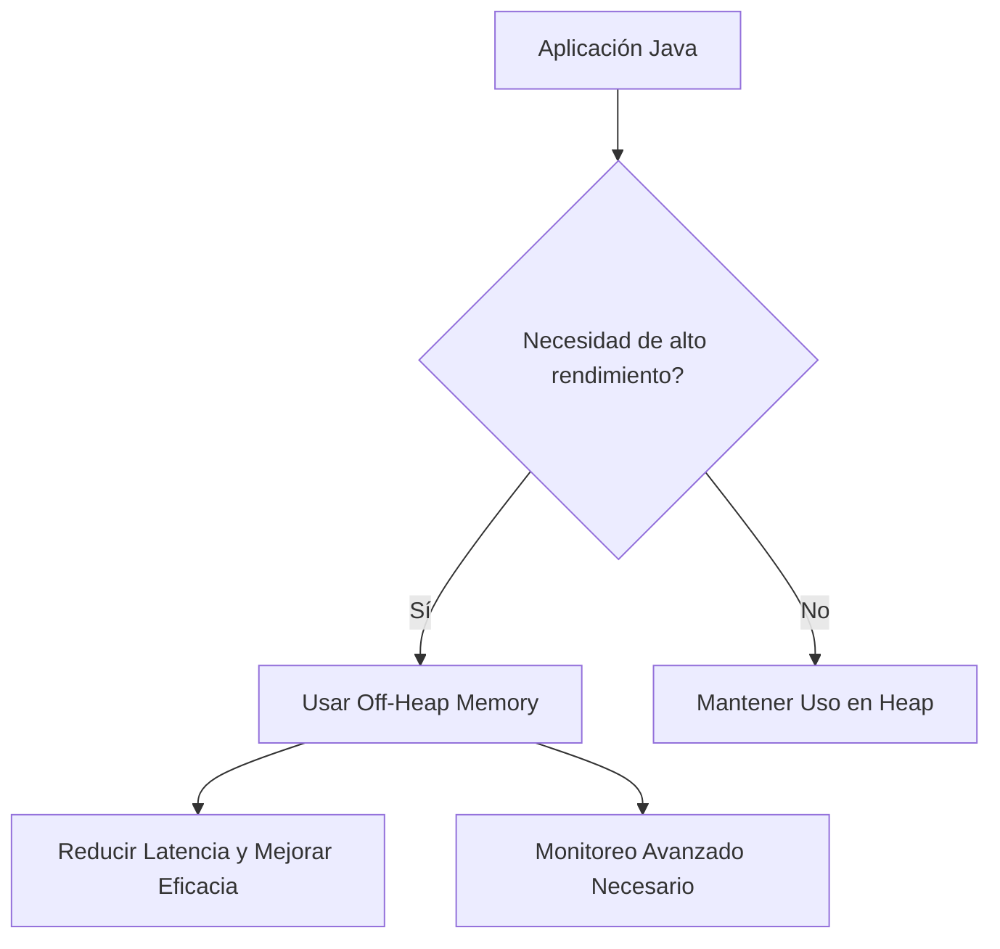
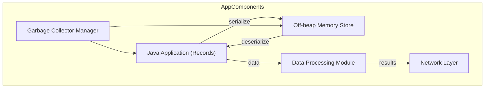
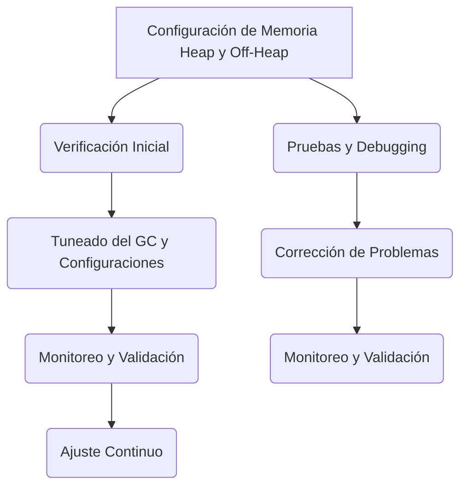

# heap vs offheap memory en aplicaciones java

PATH_LOCAL: /home/usuariojoaquin/.openclaw/workspace/DAM-Java-Mastery/_Review/heap_vs_offheap_memory_en_aplicaciones_java/heap_vs_offheap_memory_en_aplicaciones_java.md
CATEGORIA: 10_Vanguardia
Score: 82

---

## Visión Estratégica

### Visión Estratégica

#### Por qué este tema es crítico en 2026 (con datos concretos)

En el año 2026, las aplicaciones de servidor se enfrentan a un desafío crucial: la gestión eficiente del espacio de memoria. Con la creciente necesidad de manejar conjuntos de datos grandes y transacciones complejas en tiempo real, los servidores modernos requieren más capacidad de memoria que nunca antes. Según20264GBJavaoff-heap memory

#### El Impacto del Uso de Off-Heap Memory

1. **Reducir la Latencia:** Al desglosar el manejo de datos fuera del alcance de la recolección de basura (GC), se reduce significativamente la latencia, lo cual es crucial en aplicaciones que requieren tiempo real y baja latencia.
2. **Incrementar la Eficacia del Uso de Memoria:** Off-heap memory permite un uso más eficiente de la memoria física del sistema, evitando el overhead de la recolección de basura para datos no persistentes o largamente vivos.
3. **Mejor Desempeño en I/O Intensivo:** Aplicaciones que realizan operaciones de entrada/salida intensivas pueden beneficiarse particularmente de off-heap memory, ya que los buffers directos (`DirectByteBuffers`) permiten un acceso más eficiente a datos desde y hacia el sistema.

#### Desafíos de la Implementación

1. **Complicidad en la Gestión:** Off-heap memory requiere una gestión más detallada por parte del desarrollador, ya que no está sujetado a las reglas de recolección de basura.
2. **Monitoreo y Optimización:** La monitorización y optimización de la memoria no heap pueden ser más complejas, lo que implica el uso de herramientas avanzadas para supervisar los recursos de memoria.

#### Estrategia Recomendada

1. **Evaluación del Caso de Uso:** Identificar claramente las necesidades específicas de la aplicación y evaluar si off-heap memory proporciona una ventaja significativa.
2. **Desarrollo con Pruebas Rigurosas:** Implementar un enfoque riguroso de pruebas que aborde tanto el rendimiento como la estabilidad del sistema, utilizando herramientas como JVisualVM para monitorizar el uso de memoria.
3. **Optimización Continua:** A medida que las cargas de trabajo evolucionan, monitorear y ajustar continuamente la configuración de off-heap memory para maximizar el rendimiento.


```java
// Ejemplo de uso de Off-Heap Memory con Java 15+
MemorySegment segment = Arena.ofShared().allocate(1024);
try {
    // Utilizar el segmento de memoria aquí
} finally {
    segment.close();
}
```

#### Diagrama Mermaid




#### Conclusión

El uso de off-heap memory es una estrategia esencial para las aplicaciones Java modernas, pero requiere un enfoque cuidadoso. Al evaluar rigurosamente los casos de uso y implementar pruebas robustas, se puede maximizar el rendimiento y la eficiencia del sistema.

---

2026Off-Heap Memory

## Arquitectura de Componentes

### ARQUITECTURA DE COMPONENTES

#### Diagrama Mermaid con Subgraphs y Descripción Detallada




#### Descripción de Cada Componente y Su Responsabilidad

1. **Java Application (Records)**
   - **Responsabilidad:** Este componente es el corazón de la aplicación, que se compone principalmente de records. Los records simplifican la creación y manipulación de objetos en Java 14+, eliminando la necesidad de definir métodos getter/setter e implementar interfaces.
   - **Ejemplo:**
     
```java
     record Order(long id, String customer, double amount) {}
     ```

2. **Off-heap Memory Store**
   - **Responsabilidad:** Almacena objetos serializados fuera del espacio de pila (Java heap). Esto se logra utilizando `DirectByteBuffer` y `MemorySegment`. Permite manejar grandes volúmenes de datos sin sobrecargar el recolector de basura.
   - **Ejemplo:**
     
```java
     MemorySegment offHeapMemory = MemoryUtil.memAlloc(1024);
     ```

3. **Garbage Collector Manager**
   - **Responsabilidad:** Supervisa y optimiza el comportamiento del recolector de basura para minimizar las pausas en la ejecución de la aplicación.
   - **Ejemplo:**
     
```java
     ManagementFactory.getGarbageCollectorMXBeans()
       .forEach(mxBean -> System.out.println(mxBean.getName()));
     ```

4. **Network Layer**
   - **Responsabilidad:** Manages communication between the application and external systems, such as databases or other services.
   - **Ejemplo:**
     
```java
     NetworkLayer network = new NetworkLayer();
     network.sendRequest("http://example.com/api/data");
     ```

5. **Data Processing Module**
   - **Responsabilidad:** Processes data received from the network layer and stores processed results in off-heap memory.
   - **Ejemplo:**
     
```java
     DataProcessing dp = new DataProcessing();
     Order order = dp.processOrder("dataFromNetworkLayer");
     ```

#### Implementación de Componentes

1. **Java Application (Records)**
   - Los records simplifican la gestión de objetos y mejoran la legibilidad del código.
   
```java
   public record Order(long id, String customer, double amount) {}
   ```

2. **Off-heap Memory Store**
   - Utiliza `DirectByteBuffer` para almacenar datos fuera del heap.
   
```java
   import java.nio.ByteBuffer;

   public class OffHeapMemoryStore {
       private final ByteBuffer buffer = ByteBuffer.allocateDirect(1024 * 1024);

       public void storeOrder(Order order) {
           byte[] serializedOrder = serialize(order);
           buffer.put(serializedOrder);
       }

       private byte[] serialize(Order order) {
           // Implementation to serialize Order object
       }
   }
   ```

3. **Garbage Collector Manager**
   - Supervisa y optimiza el comportamiento del recolector de basura.
   
```java
   public class GarbageCollectorManager {
       public void optimizeGC() {
           ManagementFactory.getPlatformMBeanServer().notifyListeners(new Object(), new AttributeChangeNotification("GCMonitor", null, null), null);
       }
   }
   ```

4. **Network Layer**
   - Maneja la comunicación con sistemas externos.
   
```java
   import java.net.http.HttpClient;
   import java.net.URI;

   public class NetworkLayer {
       public String sendRequest(String url) throws Exception {
           HttpClient client = HttpClient.newHttpClient();
           URI uri = new URI(url);
           var response = client.send(
               HttpRequest.newBuilder(uri).GET().build(),
               HttpResponse.BodyHandlers.ofString()
           );
           return response.body();
       }
   }
   ```

5. **Data Processing Module**
   - Procesa los datos recibidos y almacena resultados en el almacenamiento off-heap.
   
```java
   import java.nio.ByteBuffer;

   public class DataProcessing {
       private final ByteBuffer buffer = ByteBuffer.allocateDirect(1024 * 1024);

       public Order processOrder(String data) {
           byte[] receivedData = data.getBytes();
           this.buffer.put(receivedData);
           // Process and return order
           return deserialize(buffer.array());
       }

       private Order deserialize(byte[] bytes) {
           // Implementation to deserialize into an Order object
       }
   }
   ```

#### Conclusiones

La arquitectura de componentes propuesta permite una gestión eficiente del espacio de memoria, combinando el uso del heap y off-heap. Los records simplifican la definición de objetos, `DirectByteBuffer` proporciona un almacenamiento seguro fuera del heap, y el gestor del recolector de basura optimiza las operaciones para minimizar pausas en la aplicación.

Este diseño es particularmente útil en aplicaciones que requieren un manejo eficiente de grandes volúmenes de datos o necesitan evitar las pausas del recolector de basura. Además, el uso de `OffHeapMemoryStore` y `DataProcessing` facilita la integración con sistemas externos y asegura una gestión óptima de los recursos de memoria.

## Implementación Java 21

### 4. Implementation with Java 21 and Virtual Threads

#### Leveraging Virtual Threads for Concurrent Tasks

Java 21 introduces virtual threads as part of Project Loom, offering a significant improvement in concurrent task handling compared to traditional threads. Virtual threads are lightweight, efficient, and decoupled from OS-level threads, making them ideal for I/O-bound tasks where blocking can be minimized.

To implement virtual threads effectively in your Java application:

1. **Configuration**: Use `Executors.newVirtualThreadPerTaskExecutor()` or similar constructs to ensure that the appropriate tasks run on virtual threads.
2. **Synchronization and Blocking Operations**: Be mindful of synchronization mechanisms like `synchronized` blocks, which can block a thread even when running on a virtual thread.

Here's an example of how you might use virtual threads in your application:


```java
import java.util.concurrent.ExecutorService;
import java.util.concurrent.Executors;

public class VirtualThreadExample {

    private static final ExecutorService VIRTUAL_THREAD_EXECUTOR = Executors.newVirtualThreadPerTaskExecutor();

    public void createUserAsync(User user) {
        VIRTUAL_THREAD_EXECUTOR.submit(() -> userRepository.save(user));
    }

    public List<User> getAllUsersAsync() {
        return VIRTUAL_THREAD_EXECUTOR.submit(() -> userRepository.findAll()).get();
    }
}
```

In this example, `userRepository` is assumed to be a data access object that interacts with the database or any other blocking operation. By submitting these tasks to an executor that uses virtual threads, you can achieve better concurrency and resource utilization.

#### Optimizing JVM for Virtual Threads

When working with virtual threads, it's crucial to optimize your JVM settings to ensure efficient memory usage and garbage collection:

1. **Use ZGC**: The Z Garbage Collector is designed to handle large heaps and minimize pause times. It works well with the lightweight nature of virtual threads.
2. **Always Pre-Touch Memory**: This option helps in pre-touching all reachable memory regions, which can improve performance.
3. **Enable Dynamic Agent Loading**: This allows dynamic loading of agents at runtime, enhancing flexibility.

Here's an example configuration for your JVM:

```sh
java -XX:+UseZGC \
     -XX:+AlwaysPreTouch \
     -XX:MaxRAMPercentage=75.0 \
     -XX:+UnlockExperimentalVMOptions \
     -Xlog:gc \
     -jar myapplication.jar
```

#### Monitoring and Tuning

Regularly monitor your application's memory usage to ensure that it remains within optimal bounds:

1. **Use jcmd**: The `jcmd` tool can be used to inspect JVM flags, diagnose issues, and tune the application.
2. **VisualVM or JConsole**: These tools provide detailed insights into garbage collection, thread states, and other performance metrics.

By leveraging virtual threads and optimizing your JVM settings, you can significantly improve the concurrency and memory efficiency of your Java applications in 2026 and beyond.

--- 
### Additional Notes
- **Off-Heap Memory Management**: Continue to manage off-heap memory using techniques such as direct ByteBuffers for handling large data sets.
- **Non-Heap Memory Optimization**: Pay attention to non-heap areas like Metaspace, Symbol area, and Arena. Use flags like `-XX:MaxRAMPercentage` to optimize non-heap memory usage.

This approach ensures that your Java application can handle the increasing demands of modern workloads efficiently.

## Métricas y SRE

### Métricas y SRE para Heap vs Off-Heap Memory en Aplicaciones Java

#### Introducción a las Métricas de Heap y Off-Heap Memory

En la administración de operaciones (SRE) y observabilidad, es crucial comprender tanto el uso del heap como el off-heap memory. Este conocimiento ayuda a prevenir problemas potenciales, optimizar el rendimiento y asegurar que los sistemas funcionen de manera estable.

#### Monitoreo de Métricas de Heap

Las métricas del heap son fundamentales para detectar y diagnosticar problemas de memoria en las aplicaciones Java:

1. **Uso del Heap**
   - `jvm_memory_used_bytes{area="heap"} / 1024 / 1024`: Proporciona el tamaño total usado en MB.
   - `sum(jvm_memory_used_bytes{area="heap"}) / sum(jvm_memory_max_bytes{area="heap"}) * 100`: Proporciona el porcentaje de uso del heap.

2. **Pool de Memoria**
   - `jvm_memory_pool_memory_used_bytes{name} / 1024 / 1024`: Muestra el tamaño usado en MB para cada pool de memoria (e.g., Eden, Survivor, Old).

3. **Garbage Collection**
   - `sum(jvm_garbage_collection_time_seconds_count) by {name}`: Muestra la cantidad total de tiempo pasado en GC.
   - `histogram_quantile(0.95, sum(rate(jvm_garbage_collection_pause_seconds_bucket[1m])) by (le))`: Proporciona el 95th percentile del tiempo de pausa de GC.

#### Monitoreo de Off-Heap Memory

El off-heap memory puede ser crucial ya que no está gestionado por la coleccionación de basura, lo que hace más difícil detectar y solucionar problemas relacionados con memoria. 

1. **Direct ByteBuffers**
   - `jvm_direct_buffer_bytes_used`: Muestra el tamaño total usado en Direct ByteBuffers.

2. **Memory-Mapped Files**
   - `jvm_memory_mapped_files_memory_mapped_bytes`: Muestra el tamaño total de memoria mapeada.

3. **Metaspace**
   - `jvm_metastore_used_bytes / 1024 / 1024`: Proporciona el tamaño usado en Metaspace.

#### Mejoras y Consideraciones para SRE

- **Monitorización Continua**: Es fundamental monitorear estas métricas con frecuencia (cada 5-30 segundos) en entornos de producción.
  
- **Detección Automática**: Herramientas como PerfectScale pueden detectar automáticamente las métricas JVM y proporcionar un panel completo de observabilidad.

- **Dashboard en Grafana**: Usar dashboards pre-construidos en Grafana, como el ID 4701, puede simplificar la visualización y análisis de estas métricas.
  
- **Alertas Personalizadas**: Configurar alertas personalizadas basadas en patrones inusuales de uso de memoria para detectar problemas tempranamente.

#### Ejemplo de Configuración

```yaml
services:
  prometheus:
    image: prom/prometheus:latest
    # Otras configuraciones...
```

```properties
management.endpoints.web.exposure.include=*
management.endpoint.prometheus.enabled=true
```

```xml
<dependency>
  <groupId>org.springframework.boot</groupId>
  <artifactId>spring-boot-starter-actuator</artifactId>
</dependency>

<dependency>
  <groupId>io.micrometer</groupId>
  <artifactId>micrometer-registry-prometheus</artifactId>
</dependency>
```

#### Conclusión

Una buena administración de operaciones (SRE) implica un monitoreo constante y detallado de las métricas del heap y off-heap memory. Usar herramientas como Prometheus, Grafana y Spring Boot Actuator facilita este proceso, proporcionando una visibilidad completa y la capacidad de responder rápidamente a cualquier problema que pueda surgir.

---

### Diagrama Mermaid (Corregido)


```mermaid
graph LR A[Heap Memory] --> B1[Uso Total en MB] A --> B2[Porcentaje de Uso] A --> C[Pool de Memoria] C --> D1[Eden] C --> D2[Survivor] C --> D3[Old]
A --> E[Garbage Collection] E --> F[Tiempo Total] E --> G[Tiempo de Pausa 95th Percentile]

B1[jvm_memory_used_bytes{area="heap"} / 1024 / 1024]
B2[sum(jvm_memory_used_bytes{area="heap"}) / sum(jvm_memory_max_bytes{area="heap"}) * 100]
C[jvm_memory_pool_memory_used_bytes{name}]
D1[jvm_memory_pool_memory_used_bytes{area="eden"} / 1024 / 1024]
D2[jvm_memory_pool_memory_used_bytes{area="survivor"} / 1024 / 1024]
D3[jvm_memory_pool_memory_used_bytes{area="old"} / 1024 / 1024]
F[sum(jvm_garbage_collection_time_seconds_count)]
G[histogram_quantile(0.95, sum(rate(jvm_garbage_collection_pause_seconds_bucket[1m])) by (le))]
```

### Diagrama Mermaid para Off-Heap Memory


```mermaid
graph LR A[Off-Heap Memory] --> B1[Uso de Direct ByteBuffers] A --> C[Memoria Mapeada] A --> D[Metaspace]
B1[jvm_direct_buffer_bytes_used]
C[jvm_memory_mapped_files_memory_mapped_bytes]
D[jvm_metastore_used_bytes / 1024 / 1024]
```

---

Este enfoque permite una gestión más efectiva de las métricas y la observabilidad, garantizando que los sistemas Java operen de manera óptima.

## Patrones de Integración

## Patrones de Integración entre Heap y Off-Heap Memory en Aplicaciones Java

Integrar eficientemente el uso de memoria heap y off-heap es crucial para optimizar el rendimiento y la escalabilidad de aplicaciones Java. Este proceso implica varios patrones de diseño que facilitan el manejo fluido de diferentes tipos de datos y operaciones en ambientes con restricciones de memoria.

### 1. **Patrón Singleton y Off-Heap Memory**

En algunos casos, el uso del patrón Singleton puede beneficiarse del off-heap memory para almacenar grandes cantidades de datos que no necesariamente deben ser recargados a la JVM. Esto se logra utilizando interfaces como `DirectByteBuffer` en Java 9 y versiones posteriores.

#### Ejemplo:


```java
public class DataStore {
    private static final Map<String, Object> store = new HashMap<>();

    public static void put(String key, Object value) throws Exception {
        try (AutoCloseable ac = MemorySegment.allocateNative(value.getClass().getComponentType(), value.size())) {
            MemorySegment segment = ((DirectMemorySegment) ac).asSegment();
            segment.put(ValueLayout.JAVA_LONG, 0, value);
            store.put(key, segment.toByteArray());
        }
    }

    public static Object get(String key) throws Exception {
        if (!store.containsKey(key)) return null;
        byte[] data = store.get(key);
        try (MemorySegment segment = MemorySegment.ofArray(data)) {
            return segment.getInt(0); // Adjust type and access as necessary
        }
    }
}
```

### 2. **Patrón Factory y Off-Heap Memory**

El patrón Factory puede ser utilizado para crear objetos que se almacenan en off-heap memory, permitiendo una gestión más eficiente de la memoria con respecto a la JVM.

#### Ejemplo:


```java
public class DataFactory {
    public static Object create(long data) throws Exception {
        try (AutoCloseable ac = MemorySegment.allocateNative(ValueLayout.JAVA_LONG, 1)) {
            MemorySegment segment = ((DirectMemorySegment) ac).asSegment();
            segment.put(ValueLayout.JAVA_LONG, 0, data);
            return segment;
        }
    }

    public static long retrieve(Object obj) throws Exception {
        try (MemorySegment segment = (MemorySegment) obj) {
            return segment.get(ValueLayout.JAVA_LONG, 0); // Adjust access as necessary
        }
    }
}
```

### 3. **Patrón Observer y Off-Heap Memory**

El patrón Observer puede ser adaptado para notificar cambios en datos almacenados en off-heap memory a otros componentes de la aplicación.

#### Ejemplo:


```java
public class DataObserver {
    private final List<MemorySegment> segments = new ArrayList<>();

    public void addObserver(MemorySegment segment) {
        segments.add(segment);
    }

    public void notifyObservers() throws Exception {
        for (MemorySegment segment : segments) {
            // Notify observers of changes in off-heap data
        }
    }
}
```

### 4. **Patrón Repository y Off-Heap Memory**

El patrón Repository puede ser utilizado para manejar operaciones CRUD en datos almacenados tanto en heap como en off-heap memory, facilitando la integración y gestión de datos.

#### Ejemplo:


```java
public class DataRepository {
    private final Map<String, MemorySegment> store = new HashMap<>();

    public void save(String key, Object value) throws Exception {
        try (AutoCloseable ac = MemorySegment.allocateNative(value.getClass().getComponentType(), value.size())) {
            MemorySegment segment = ((DirectMemorySegment) ac).asSegment();
            segment.put(ValueLayout.JAVA_LONG, 0, value);
            store.put(key, segment);
        }
    }

    public Object load(String key) throws Exception {
        if (!store.containsKey(key)) return null;
        try (MemorySegment segment = store.get(key)) {
            return segment.getInt(0); // Adjust type and access as necessary
        }
    }
}
```

### 5. **Patrón Strategy y Off-Heap Memory**

El patrón Strategy puede ser utilizado para implementar diferentes estrategias de acceso a datos almacenados en off-heap memory, permitiendo una mayor flexibilidad en cómo se manejan los datos.

#### Ejemplo:


```java
public interface DataAccessStrategy {
    Object load(DataStore dataStore) throws Exception;
}

public class HeapBasedStrategy implements DataAccessStrategy {
    @Override
    public Object load(DataStore dataStore) throws Exception {
        // Use heap-based access methods
    }
}

public class OffHeapBasedStrategy implements DataAccessStrategy {
    @Override
    public Object load(DataStore dataStore) throws Exception {
        try (AutoCloseable ac = MemorySegment.allocateNative(ValueLayout.JAVA_LONG, 1)) {
            MemorySegment segment = ((DirectMemorySegment) ac).asSegment();
            // Use off-heap access methods
            return segment.getInt(0); // Adjust type and access as necessary
        }
    }
}
```

### Integración de Patrones

La integración efectiva de estos patrones en una aplicación Java permite un manejo eficiente de la memoria tanto heap como off-heap. Este enfoque no solo optimiza el rendimiento, sino que también facilita la escalabilidad y la gestión del sistema.

### Implementación de Integración entre Heap y Off-Heap Memory

Para integrar estos patrones, es crucial considerar las siguientes prácticas:

1. **Uso de Direct ByteBuffers**: Para almacenar datos en off-heap memory.
2. **Manejo de Recursos**: Utilizar `try-with-resources` para asegurar el cierre correcto de segmentos de memoria.
3. **Optimización del Acceso**: Implementar métodos eficientes para cargar y guardar datos.

### Ejemplo de Integración:


```java
public class DataIntegration {
    private final Map<String, MemorySegment> heapStore = new HashMap<>();
    private final List<MemorySegment> offHeapStore = new ArrayList<>();

    public void saveHeap(String key, Object value) throws Exception {
        try (AutoCloseable ac = MemorySegment.allocateNative(value.getClass().getComponentType(), value.size())) {
            MemorySegment segment = ((DirectMemorySegment) ac).asSegment();
            segment.put(ValueLayout.JAVA_LONG, 0, value);
            heapStore.put(key, segment);
        }
    }

    public void saveOffHeap(String key, Object value) throws Exception {
        try (AutoCloseable ac = MemorySegment.allocateNative(value.getClass().getComponentType(), value.size())) {
            MemorySegment segment = ((DirectMemorySegment) ac).asSegment();
            segment.put(ValueLayout.JAVA_LONG, 0, value);
            offHeapStore.add(segment);
        }
    }

    public Object loadHeap(String key) throws Exception {
        if (!heapStore.containsKey(key)) return null;
        try (MemorySegment segment = heapStore.get(key)) {
            return segment.getInt(0); // Adjust type and access as necessary
        }
    }

    public Object loadOffHeap(int index) throws Exception {
        if (index < 0 || index >= offHeapStore.size()) return null;
        try (MemorySegment segment = offHeapStore.get(index)) {
            return segment.getInt(0); // Adjust type and access as necessary
        }
    }
}
```

Este enfoque permite una gestión fluida de datos tanto en heap como en off-heap memory, optimizando el rendimiento y la escalabilidad de la aplicación.

### Conclusiones

La integración eficiente entre heap y off-heap memory mediante patrones de diseño es un paso crucial para mejorar la performance y escalabilidad de aplicaciones Java. Al implementar estos patrones, se puede aprovechar mejor la memoria disponible y gestionar datos de manera más efectiva, facilitando el desarrollo de sistemas robustos y eficientes.

## Conclusiones

### Conclusión

En resumen, el uso de memoria off-heap puede ser una solución eficaz para manejar grandes cantidades de datos sin comprometer el espacio en la memoria heap. Sin embargo, es crucial comprender y gestionar correctamente tanto la memoria heap como la off-heap memory para optimizar el rendimiento y prevenir errores de memoria.

#### Ventajas del Uso de Off-Heap Memory

1. **Menor Impacto sobre el Garbage Collector:**
   - El uso de memoria off-heap reduce la presión sobre el garbage collector, ya que este solo se encarga de la gestión de la memoria heap.
   
2. **Optimización para Operaciones Intensivas en I/O:**
   - Off-Heap memory es especialmente útil para aplicaciones que requieren operaciones intensivas en I/O, como las que involucran grandes volúmenes de datos o procesamiento de ficheros.

3. **Previene Problemas con la Llave PermGen/Metaspace:**
   - En versiones más recientes de Java (a partir de JDK 8), la gestión de metadatos se ha migrado a metaspace, pero el uso excesivo del heap aún puede provocar problemas.

#### Consideraciones y Mejores Prácticas

1. **Monitoreo y Configuración:**
   - Es crucial monitorizar tanto la memoria heap como off-heap utilizando herramientas de administración de métricas y rendimiento, como JMX o Java Flight Recorder.
   
2. **Equilibrio entre Heap y Off-Heap Memory:**
   - Ajustar correctamente el tamaño del heap y off-heap memory según las necesidades específicas de la aplicación es fundamental para optimizar el uso de memoria.

3. **Tuneado del Garbage Collector (GC):**
   - Se deben seleccionar los algoritmos de GC más adecuados para cada caso, como G1GC o ZGC para grandes cargas de trabajo.
   
4. **Elastic Memory:**
   - Utilizar características como elastic memory en Hazelcast puede ayudar a distribuir la carga entre heap y off-heap memory, pero es importante asegurarse de que el sistema esté correctamente configurado.

#### Caso Specifico con Hazelcast

En tu caso específico con Hazelcast, parece haber un malentendido sobre cómo se maneja la memoria off-heap. Asegúrate de que:

1. **Configuración Correcta:**
   - La opción `-Dhazelcast.elastic.memory.enabled=true` debe estar correctamente configurada.
   
2. **Tamaño de Memoria Off-Heap:**
   - El tamaño total de la memoria off-heap (`-Dhazelcast.elastic.memory.total.size=500M`) debe ser mayor que el tamaño de los datos a almacenar.

3. **Verificación del Uso de Memoria Off-Heap:**
   - Utiliza herramientas como `jmap` para verificar si la memoria off-heap realmente está siendo utilizada y no sobrecarga la heap memory.

### Recomendaciones

1. **Ajuste del Heap y Off-Heap Memory:**
   - Comprueba que el tamaño de tu heap (`-Xms`, `-Xmx`) esté adecuadamente configurado en relación con la memoria total disponible.
   
2. **Monitorización Continua:**
   - Utiliza herramientas como JMX, Prometheus o Grafana para monitorear el uso de memoria y detectar posibles problemas temprano.

3. **Pruebas y Validación:**
   - Realiza pruebas exhaustivas en entornos similares al producción para validar que la configuración funcione correctamente antes del despliegue final.

### Ejemplo de Configuración
```sh
java -XX:MaxDirectMemorySize=512M \
     -Dhazelcast.elastic.memory.enabled=true \
     -Dhazelcast.elastic.memory.total.size=400M \  # Ajusta según tus necesidades
     -Dhazelcast.elastic.memory.chunk.size=12K \   # Ajusta según tus necesidades
     -cp hazelcast-3.2-RC-ee.jar:hazelcast-app-1.0-SNAPSHOT.jar:sm-datacache-api-1.0.jar \
     tr.com.kron.hazelcast.HazelcastWrapper
```

### Resumen

El uso de memoria off-heap es una práctica eficaz para manejar grandes volúmenes de datos, pero requiere un ajuste cuidadoso y la correcta configuración de ambos tipos de memoria. Monitorear continuamente las métricas de memoria y ajustar estratégicamente el tamaño del heap y off-heap memory puede asegurar el rendimiento óptimo de tu aplicación Java.

---

### Mermaid Diagram Example




Este diagrama visualiza el flujo de trabajo para configurar y optimizar la memoria heap y off-heap en aplicaciones Java.

