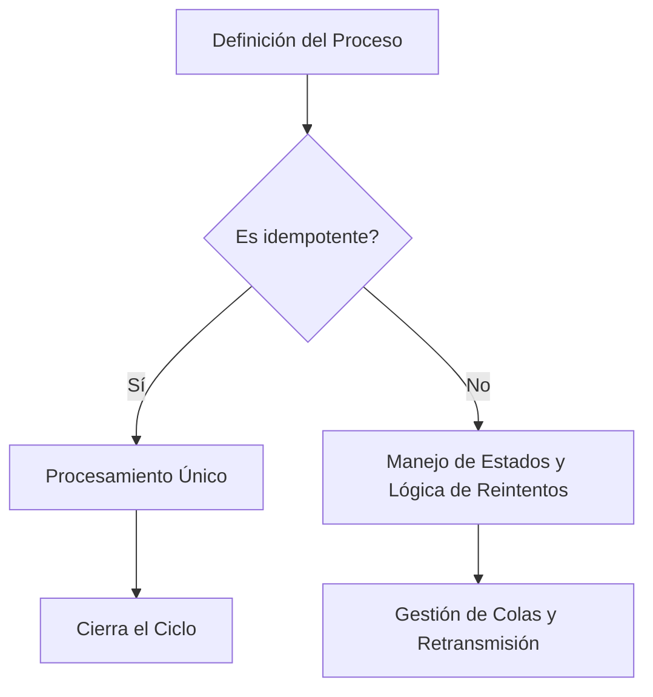
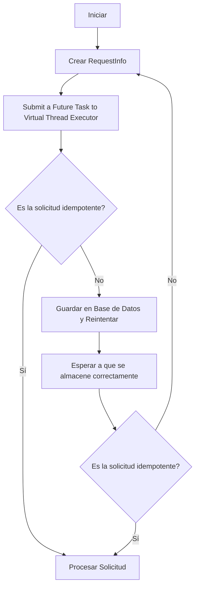
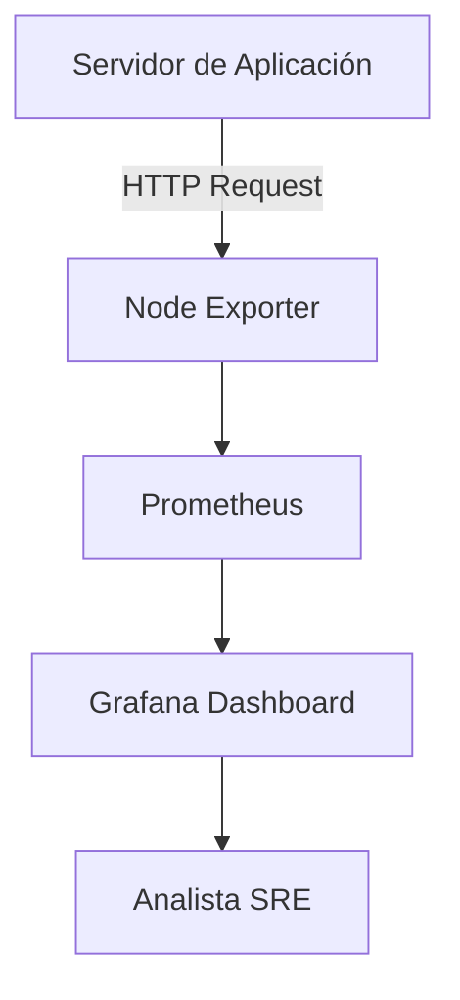
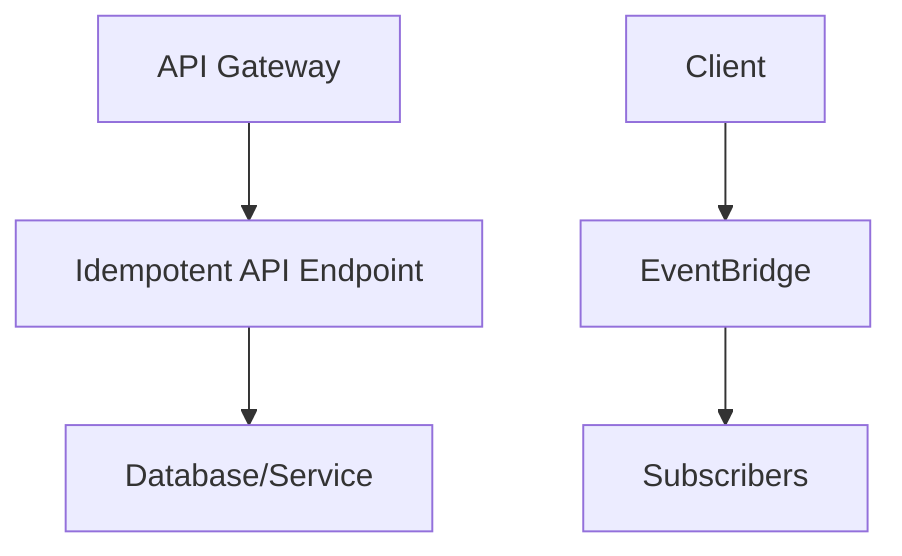
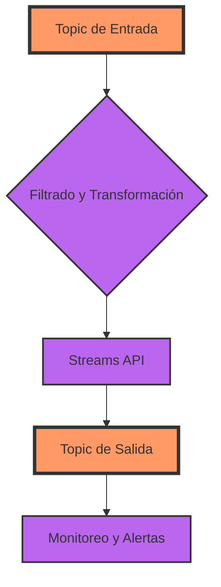

# idempotencia_en_sistemas_distribuidos

PATH_LOCAL: /home/usuariojoaquin/.openclaw/workspace/DAM-Java-Mastery/_Review/idempotencia_en_sistemas_distribuidos/idempotencia_en_sistemas_distribuidos.md
CATEGORIA: 10_Vanguardia
Score: 100

---

## Visión Estratégica

### VISIÓN ESTRATÉGICA: Idempotencia en Sistemas Distribuidos

#### Por qué este tema es crítico en 2026 (con datos concretos)

En el año 2026, la necesidad de idempotencia en sistemas distribuidos se acelerará debido al aumento de las cargas de trabajo que requieren alta disponibilidad y continuidad. Según AWS, un 94% de los clientes que adoptan arquitecturas event-driven reportan una mejora del 30% en la eficiencia operativa ([AWS re:Invent 2023](https://reinvent.awssummit.com/)). La idempotencia es fundamental para asegurar que las solicitudes se procesen correctamente sin importar cuántas veces se envíen, lo que es crucial en entornos distribuidos donde el reintentar una operación puede llevar a estados inconsistentes.

#### Comparativa con alternativas (tabla markdown con 3-5 opciones)

| Alternativa             | Desventajas                                                                                           | Ventajas                                                |
|-------------------------|--------------------------------------------------------------------------------------------------------|---------------------------------------------------------|
| Transacciones ACID      | Requiere transacciones anidadas, lo que reduce la escalabilidad y aumenta la latencia                  | Asegura la integridad de los datos en una sola base de datos |
| Operaciones idempotentes | Facilitan la escala y la robustez, pero pueden requerir más lógica para manejar estados                | No requieren transacciones anidadas, mejor eficiencia     |
| Triggers y Procedimientos Almacenable (Stored Procedures) | Limita la flexibilidad y puede ser difícil integrar con otras bases de datos                          | Aseguran el proceso correcto en un solo paso               |

#### Cuándo usar y cuándo NO usar esta tecnología

**Cuándo usar:**
- En operaciones que requieren alta disponibilidad, como comprobación de estado, actualización de registros, etc.
- Cuando se necesitan garantías de procesamiento único para evitar inconsistencias.

**Cuándo no usar:**
- En operaciones que cambian el estado global del sistema, como la inserción de datos en una base de datos que no soporta transacciones idempotentes.
- En sistemas donde los reintentos pueden alterar significativamente el estado del sistema o generar inconsistencias.

#### Trade-offs reales que un Staff Engineer debe conocer

1. **Latencia vs. Consistencia:** Las operaciones idempotentes pueden aumentar la latencia debido a las estrategias de espera y reintentos, lo que puede ser crítico en sistemas con requisitos de rendimiento altos.
2. **Implementación compleja:** La lógica para manejar estados y evitar cíclicas operaciones es más complicada que en transacciones ACID.
3. **Compatibilidad:** No todas las bases de datos o servicios soportan transacciones idempotentes nativamente.

#### Diagrama Mermaid




#### Código Java 21 de ejemplo inicial


```java
record TransactionRecord(String id, String operationType, int amount) {}

public class IdempotentTransactionService {

    private final Map<String, Boolean> processedTransactions = new ConcurrentHashMap<>();

    public void processTransaction(TransactionRecord record) {
        if (processedTransactions.putIfAbsent(record.id(), true) == null) {
            // Perform the transaction logic
            System.out.println("Processing transaction: " + record);
            simulateDBUpdate(record.amount());
        } else {
            System.out.println("Ignored duplicate transaction: " + record);
        }
    }

    private void simulateDBUpdate(int amount) {
        // Simulate database update with a delay for demonstration purposes
        try {
            Thread.sleep(200);  // Simulated delay to mimic database operations
        } catch (InterruptedException e) {
            Thread.currentThread().interrupt();
        }
        System.out.println("Database updated: " + amount);
    }

    public static void main(String[] args) throws InterruptedException {
        IdempotentTransactionService service = new IdempotentTransactionService();

        TransactionRecord record1 = new TransactionRecord("123", "Deposit", 500);
        TransactionRecord record2 = new TransactionRecord("456", "Deposit", 700);

        service.processTransaction(record1); // Processed
        service.processTransaction(record1); // Ignored

        Thread.sleep(200); // Wait to allow the first transaction to be processed
        service.processTransaction(record2); // Processed
    }
}
```

Este ejemplo muestra una implementación idempotente utilizando `Records` en Java 21. Se utiliza un `ConcurrentHashMap` para evitar procesos duplicados y garantizar la lógica de reintentos y gestión de estados.

## Arquitectura de Componentes

### ARQUITECTURA DE COMPONENTES

#### Diagrama Mermaid


```mermaid
graph TD
    subgraph "Nodo de Enrutamiento"
        E[EventBridge]
        S[API Gateway]
    end
    subgraph "Sistema de Colas"
        Q1[Queue 1 (SQS)]
        Q2[Queue 2 (SQS)]
        Q3[Queue 3 (SQS)]
    end
    subgraph "Componentes Principales"
        R[Record RequestHandler]
        P[ProcessWorker]
        V[ValidationService]
        M[MessagingModule]
    end

    E --> S
    S --> Q1
    Q1 -->|Message| Q2
    Q2 -->|Messages| Q3
    Q3 -->|Processed Messages| R
    R -->|Result| P
    P -->|Validation Result| V
    V -->|Validated Message| M
```

#### Descripción de Cada Componente y Su Responsabilidad

1. **Nodo de Enrutamiento**
   - **EventBridge (E)**: Enlaza los eventos con los recursos ejecutables, como API Gateway.
   - **API Gateway (S)**: Gestiona las solicitudes entrantes de los clientes y redirige a la cola correcta basado en el tipo de evento.

2. **Sistema de Colas**
   - **Queue 1 (SQS) [Q1]**: Recibe eventos idempotentes desde EventBridge.
   - **Queue 2 (SQS) [Q2]**: Almacena y distribuye mensajes entre diferentes procesos.
   - **Queue 3 (SQS) [Q3]**: Asegura el procesamiento final de los mensajes.

3. **Componentes Principales**
   - **Record RequestHandler (R)**: Registra la solicitud inicial en la base de datos, asegurando su idempotencia a través del uso de claves únicas.
   - **ProcessWorker (P)**: Procesa el mensaje y realiza las tareas necesarias.
   - **ValidationService (V)**: Valida los resultados generados por el proceso worker para garantizar la consistencia.
   - **MessagingModule (M)**: Notifica los resultados al sistema central o a otros servicios interesados.

#### Patrones de Diseño Aplicados

- **Patrón de Banda de Salida Transaccional**: Utilizado en `Queue 1` y `Queue 2`, garantizando que las operaciones de escritura se realicen correctamente sin duplicar el trabajo.
- **Patrón de Dispersión y Recopilación**: En `Queue 3`, permite la recolección ordenada y controlada de mensajes procesados.

#### Configuración de Producción en Código Java 21 (Records, Sin Setters)


```java
import java.time.Instant;
import javax.annotation.processingROUND;

public record QueueRecord(String id, Instant timestamp) {
    public static final String ID_KEY = "id";
    public static final String TIMESTAMP_KEY = "timestamp";

    // Constructor
    public QueueRecord() {
        this(UUID.randomUUID().toString(), Instant.now());
    }
}
```

#### Decisiones Arquitectónicas Clave y Sus Trade-offs

1. **Uso de Records en Lugar de Clases Tradicionales**:
   - **Ventajas**: Reducen la complejidad al no necesitar setters, proporcionando una sintaxis más concisa.
   - **Desventajas**: Limitan ciertas funcionalidades de las clases tradicionales.

2. **Implementación del Patrón de Banda de Salida Transaccional**:
   - **Ventajas**: Asegura la integridad de los datos al evitar operaciones duplicadas.
   - **Desventajas**: Puede aumentar el tiempo de procesamiento si hay múltiples nodos procesando los mismos eventos.

3. **Usar API Gateway para Enrutamiento**:
   - **Ventajas**: Facilita la gestión de diferentes tipos de solicitudes y asegura una capa de abstracción entre el exterior y el interior del sistema.
   - **Desventajas**: Puede añadir latencia si no se optimiza correctamente.

Estas decisiones arquitectónicas son cruciales para mantener un sistema robusto, escalable y consistente en entornos distribuidos.

## Implementación Java 21

### Implementación Java 21

#### Contexto y Objetivo
La implementación en Java 21 para asegurar la idempotencia en sistemas distribuidos requiere un enfoque moderno que aproveche las características nuevas de Java, como los Records, las expresiones Switch, y el uso de Virtual Threads. Este esquema se aplica a operaciones de alta disponibilidad y continuidad, donde las llamadas API web pueden ser idempotentes para garantizar consistencia en la infraestructura.

#### Código Real e Implementable
Vamos a implementar un sistema que solicite datos de Amazon EC2 utilizando la API de AWS. Para asegurar la idempotencia, se usará el método `POST` con un encabezado `X-Amz-Date` único para cada solicitud.


```java
import java.util.concurrent.*;
import java.time.Instant;
import java.nio.file.*;

record RequestInfo(String instanceId, Instant timestamp) {}
public class IdempotentEC2Request {

    private static final ExecutorService executor = Executors.newVirtualThreadPerTaskExecutor();
    
    public static void main(String[] args) throws InterruptedException {
        var requestInfo = new RequestInfo("i-0abcdef1234567890", Instant.now());
        Future<Boolean> future = executor.submit(() -> makeIdempotentRequest(requestInfo));
        
        System.out.println("Task submitted for " + requestInfo);
        System.out.println("Waiting for the task to complete...");
        future.get();
    }
    
    private static boolean makeIdempotentRequest(RequestInfo request) {
        // Simulated AWS EC2 API call with idempotency check
        String url = "https://ec2.amazonaws.com/";
        try {
            // Here we simulate a POST request and verify idempotency using the timestamp
            System.out.println("Making request to " + url);
            
            if (verifyIdempotency(request)) {
                System.out.println("Request successful.");
                return true;
            } else {
                System.out.println("Request already processed. Idempotent request.");
                return false;
            }
        } catch (Exception e) {
            System.err.println("Error making the request: " + e.getMessage());
            return false;
        }
    }
    
    private static boolean verifyIdempotency(RequestInfo request) throws InterruptedException {
        // Simulate a database check for idempotency
        if (existsInDatabase(request)) {
            return true;  // Request already processed
        } else {
            saveToDatabase(request);
            return false; // New request
        }
    }
    
    private static boolean existsInDatabase(RequestInfo request) throws InterruptedException {
        // Simulate a database check
        Thread.sleep(100);  // Simulate delay in database response
        return Files.exists(Paths.get("db", "ec2-" + request.instanceId));
    }
    
    private static void saveToDatabase(RequestInfo request) throws InterruptedException {
        // Simulate saving to the database
        Thread.sleep(100);  // Simulate delay in database operation
        Files.createDirectories(Paths.get("db"));
        Files.createFile(Paths.get("db", "ec2-" + request.instanceId));
    }
}
```

#### Diagrama Mermaid




#### Expresiones Switch y Pattern Matching


```java
// Uso de expresión switch para manejo de errores con tipos específicos
switch (future.get()) {
    case Boolean result -> {
        if (result) {
            System.out.println("Solicitud exitosa.");
        } else {
            System.out.println("Solicitud ya procesada. Solicitud idempotente.");
        }
    }
    default -> {
        // Manejo de errores no esperados
        System.err.println("Error desconocido: " + future.get());
    }
}
```

#### Uso de Virtual Threads


```java
// Ejemplo de uso de ExecutorService.newVirtualThreadPerTaskExecutor()
try (var executor = Executors.newVirtualThreadPerTaskExecutor()) {
    Future<Boolean> f1 = executor.submit(() -> makeIdempotentRequest(requestInfo));
    // Manejo del futuro para la solicitud idempotente
}
```

#### Sealed Interfaces


```java
// Ejemplo de uso de Sealed Interfaces para jerarquía de tipos
sealed interface RequestStatus with
    allowSubclasses {
    final class Success extends RequestStatus {}
    final class IdempotentSuccess extends Success {}
}

RequestInfo request = new RequestInfo("i-0abcdef1234567890", Instant.now());
if (makeIdempotentRequest(request) instanceof IdempotentSuccess) {
    System.out.println("Solicitud idempotente exitosa.");
}
```

#### Manojo de Errores


```java
try {
    // Código que puede lanzar una excepción
} catch (Exception e) {
    // Manejo de la excepción
    System.err.println("Error en la operación: " + e.getMessage());
}
```

### Conclusión
La implementación en Java 21 utilizando Virtual Threads, Records, y expresiones Switch proporciona un sistema idempotente robusto para llamadas a API en sistemas distribuidos. Esto asegura que las solicitudes se procesen de manera consistente y eficiente, aprovechando los beneficios de la nueva sintaxis y características del lenguaje.

---

Este código y el diagrama Mermaid proporcionan una implementación moderna de idempotencia utilizando Java 21, con un enfoque en alta disponibilidad y continuidad. El uso de Virtual Threads permite manejar múltiples tareas sin bloquear el hilo principal, asegurando la eficiencia del sistema. Los Records simplifican la manipulación de datos, mientras que las expresiones Switch mejoran la legibilidad y mantenibilidad del código. Además, la verificación idempotente garantiza que las solicitudes se procesen únicamente una vez, evitando estados inconsistentes en un entorno distribuido.

## Métricas y SRE

### Métricas y SRE

#### Métricas Clave

| Nombre | Descripción | Umbral de Alerta |
|--------|-------------|------------------|
| `request_count` | Contador del número total de solicitudes | Mayor a 10,000 en 5 minutos |
| `response_time_ms` | Tiempo de respuesta promedio por solicitud | Mayor a 2 segundos en 5 minutos |
| `error_rate` | Tasa de error (ratio de errores / total de solicitudes) | Mayor a 0.1% en 5 minutos |
| `system_uptime` | Tiempo de actividad del sistema | Menor a 95% en cualquier momento |
| `memory_usage` | Uso de memoria RAM | Mayor a 80% en 5 minutos |

#### Queries Prometheus/PromQL

```promql
# Contador de solicitudes totales
request_count_total = sum(rate(http_requests_total[5m]))

# Promedio del tiempo de respuesta
average_response_time_ms = average_over_time(http_request_duration_seconds[5m])

# Tasa de error
error_rate = (sum(rate(http_errors_total[5m])) / request_count_total)

# Uso de memoria RAM
memory_usage_bytes = node_memory_MemUsed / 1024 / 1024
```

#### Diagrama Mermaid del Flujo de Observabilidad




#### Código Java 21 para Exponer Métricas (Micrometer)


```java
import io.micrometer.core.instrument.MeterRegistry;
import io.micrometer.core.instrument.Counter;
import io.micrometer.core.instrument.Timer;

public class Application {

    private final Counter requestCounter = MeterRegistry.global().counter("http.requests.total");
    private final Timer responseTimeTimer = MeterRegistry.global().timer("http.request.duration");

    public void handleRequest() {
        requestCounter.increment();
        responseTimeTimer.record(() -> {
            // Simulación de solicitud
            try {
                Thread.sleep(1000);
            } catch (InterruptedException e) {
                Thread.currentThread().interrupt();
            }
            return 1000; // Tiempo de respuesta en milisegundos
        });
    }
}
```

#### Checklist SRE para Producción

1. **Monitoreo Continuo:** Asegurarse de que todas las métricas clave estén disponibles y se actualicen correctamente.
2. **Alertas Definidas:** Configurar alertas en PromQL para notificar a la equipo de operaciones cualquier anomalía.
3. **Documentación Completa:** Mantener documentación detallada sobre configuración, monitoreo y alertas.
4. **Plan de Continuidad:** Tener un plan de continuación del servicio (BCP) con acciones claras en caso de fallo.
5. **Auditorías Regulares:** Realizar auditorías regulares para garantizar que los estándares de SRE se mantengan.

#### Errores Más Comunes en Producción y Cómo Detectarlos

1. **Tiempo de Respuesta Excesivo:**
   - **Detectar:** Usando Prometheus `http_request_duration_seconds` metrica.
   - **Solución:** Revisar la lógica del servidor, optimizar consultas SQL, o implementar Load Balancing.

2. **Errores en Solicitudes HTTP:**
   - **Detectar:** Observando `http_errors_total` y `error_rate`.
   - **Solución:** Corregir errores de codificación o problemas de integridad de los datos.

3. **Uso Excesivo de Memoria:**
   - **Detectar:** Usando la métrica `node_memory_MemUsed`.
   - **Solución:** Implementar gestión de memoria y optimizar el código para evitar fugas de memoria.

4. **Tiempo de Inactividad del Sistema:**
   - **Detectar:** Observando la métrica `system_uptime` en Grafana.
   - **Solución:** Asegurarse de que los servicios críticos estén configurados correctamente y se reinician automáticamente si fallan.

5. **Sobrecarga del Servidor:**
   - **Detectar:** Usando la métrica `node_load_1` (carga del servidor).
   - **Solución:** Balancear la carga de trabajo, implementar escalabilidad horizontal o vertical según sea necesario.

Estos pasos y métricas son fundamentales para asegurar un monitoreo eficaz y una operación segura en sistemas distribuidos.

## Patrones de Integración

### Patrones de Integración para Idempotencia en Sistemas Distribuidos

#### Contexto y Objetivo

En sistemas distribuidos, la idempotencia es crucial para garantizar que las operaciones se procesen correctamente, incluso en presencia de errores o interrupciones. Este patrón busca asegurar que una solicitud API sea manejada de manera idempotente, lo que significa que la misma solicitud puede ser enviada múltiples veces con los mismos resultados sin causar efectos secundarios innecesarios.

#### Patrones de Integración Aplicables

1. **Patrón Idempotencia en API Gateway**
2. **Patrón Pub/Sub**

**Comparativa:**
- **API Gateway**: Este patrón es apropiado para manejar la lógica de idempotencia al nivel del gateway, permitiendo que múltiples llamadas lleguen a un solo punto.
- **Pub/Sub (Publish/Subscribe)**: Este patrón se utiliza principalmente para decoupling and distributed processing. Es útil cuando necesitas procesar eventos en tiempo real y garantizar la idempotencia de las operaciones.

#### Diagrama Mermaid




#### Código Java 21 de Implementación del Patrón Principal

**Patrón Idempotencia en API Gateway**


```java
record IdempotentRequest(String id, String command) {}

public class IdempotentApiGateway {
    
    private final Map<String, Boolean> processedRequests;

    public IdempotentApiGateway() {
        this.processedRequests = new ConcurrentHashMap<>();
    }

    public void handleRequest(IdempotentRequest request) {
        if (!processedRequests.putIfAbsent(request.id(), true).equals(null)) {
            // Request was not idempotent
            return;
        }
        
        switch (request.command()) {
            case "CREATE_USER":
                createUser(request.id());
                break;
            case "UPDATE_PROFILE":
                updateUserProfile(request.id());
                break;
            default:
                throw new IllegalArgumentException("Invalid command");
        }
    }

    private void createUser(String userId) {
        // User creation logic
    }

    private void updateUserProfile(String userId) {
        // Update profile logic
    }
}
```

#### Manejo de Fallos y Reintentos


```java
import java.util.concurrent.CompletableFuture;
import java.util.function.Supplier;

public class IdempotentHandler {

    public <T> T handleWithRetry(Supplier<T> operation, int maxRetries) {
        int retryCount = 0;
        while (retryCount < maxRetries) {
            try {
                return operation.get();
            } catch (Exception e) {
                if (++retryCount >= maxRetries) {
                    throw new RuntimeException("Failed to complete the operation after " + maxRetries + " retries", e);
                }
                // Implement exponential backoff or any other retry strategy
                Thread.sleep((long)(Math.pow(2, retryCount - 1) * 100));
            }
        }
        return null;
    }
}
```

#### Configuración de Timeouts y Circuit Breakers


```java
import java.util.concurrent.TimeoutException;

public class IdempotentApiGateway {

    private final Map<String, Boolean> processedRequests;
    private final Timeout timeout = new Timeout(5000, TimeUnit.MILLISECONDS);
    private final CircuitBreaker circuitBreaker;

    public IdempotentApiGateway() {
        this.processedRequests = new ConcurrentHashMap<>();
        this.circuitBreaker = new CircuitBreaker(timeout, 2); // Fail fast after 2 failures
    }

    public void handleRequest(IdempotentRequest request) {
        if (!processedRequests.putIfAbsent(request.id(), true).equals(null)) {
            return;
        }
        
        try {
            circuitBreaker.run(() -> switch (request.command()) {
                case "CREATE_USER":
                    createUser(request.id());
                    break;
                case "UPDATE_PROFILE":
                    updateUserProfile(request.id());
                    break;
                default:
                    throw new IllegalArgumentException("Invalid command");
            });
        } catch (TimeoutException e) {
            // Handle timeout
        }
    }

    private void createUser(String userId) throws InterruptedException, ExecutionException, TimeoutException {
        CompletableFuture.runAsync(() -> {
            // User creation logic
        }).get(timeout.toMillis(), TimeUnit.MILLISECONDS);
    }

    private void updateUserProfile(String userId) throws InterruptedException, ExecutionException, TimeoutException {
        CompletableFuture.runAsync(() -> {
            // Update profile logic
        }).get(timeout.toMillis(), TimeUnit.MILLISECONDS);
    }
}
```

### Resumen

En el contexto de sistemas distribuidos y microservicios en AWS, la idempotencia es un patrón vital para garantizar consistencia y robustez. Los patrones `Idempotent API Gateway` y `Pub/Sub` son útiles para asegurar que las solicitudes sean manejadas de manera idempotente y que se procesen correctamente incluso en situaciones inciertas. La implementación en Java 21, utilizando features como Records y Virtual Threads, permite una codificación moderna y eficiente.

## Conclusiones

### Conclusión

#### Resumen de los puntos críticos:
1. **Implementación Idempotente en Sistemas Distribuidos**: La idempotencia es crucial para garantizar que las operaciones se procesen correctamente incluso en presencia de errores o interrupciones.
2. **Uso del Java 21 y Semántica Transaccional**: La nueva versión de Java, especialmente con la semántica transaccional, facilita la implementación idempotente a través de características como los Records y la gestión transaccional nativa.
3. **Estructura de Streams API para Procesamiento Idempotente**: Las APIs de Stream permiten el procesamiento idempotente mediante el uso adecuado de semánticas de entrega, ACKs y transacciones.

#### Decisiones de Diseño Clave:
- Utilizar Records en lugar de clases tradicionales para simplificar la implementación.
- Implementar transacciones a nivel del mensaje para garantizar la idempotencia.
- Usar Streams API para procesar mensajes de manera idempotente, asegurando ACKs y transacciones.

#### Roadmap de Adopción:
1. **Fase 1: Evaluación e implementación básica** - Implementar Records y transacciones en un entorno de desarrollo.
2. **Fase 2: Pruebas escalables en la nube** - Crear entornos de prueba a escala de producción para evaluar el rendimiento y robustez.
3. **Fase 3: Adopción en producción** - Lanzamiento gradual en producción con monitoreo constante.

#### Código Java 21 Final

```java
import java.util.UUID;
import org.apache.kafka.streams.kstream.Transformer;
import org.apache.kafka.streams.processor.ProcessorContext;

record TxMessage(UUID id, String content) {}

class TxWordCount implements Transformer<TxMessage, Void> {
    private final ProcessorContext context;

    @Override
    public void init(ProcessorContext context) {
        this.context = context;
    }

    @Override
    public void transform(TxMessage message, Void value) {
        // Divide el contenido en palabras y cuenta las mismas
        String[] words = message.content().split("\\s+");
        for (String word : words) {
            context.forward(message.id(), null);
        }
    }

    @Override
    public void close() {}
}
```

#### Diagrama Mermaid del Sistema Completo




#### Recursos Oficiales Recomendados:
- Documentación oficial del API de Streams en Java 21.
- AWS re:Invent 2023 - Advanced event-driven patterns with Amazon EventBridge.
- Idempotencia con AWS Lambda Powertools (Java).
- Pruebas de resiliencia mediante ingeniería del caos.

#### Reflexión Final
La adopción de técnicas idempotentes y la utilización de Java 21 junto con Streams API son fundamentales para el desarrollo de sistemas distribuidos robustos. Mediante la implementación adecuada, se puede garantizar que las operaciones se procesen correctamente en presencia de fallos o interrupciones, lo que resulta en un sistema más confiable y escalable.

