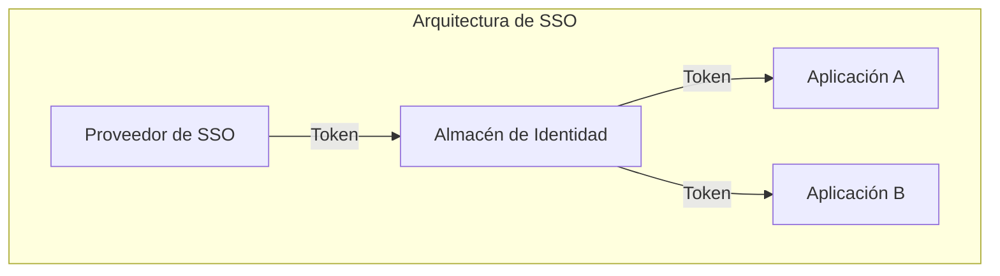
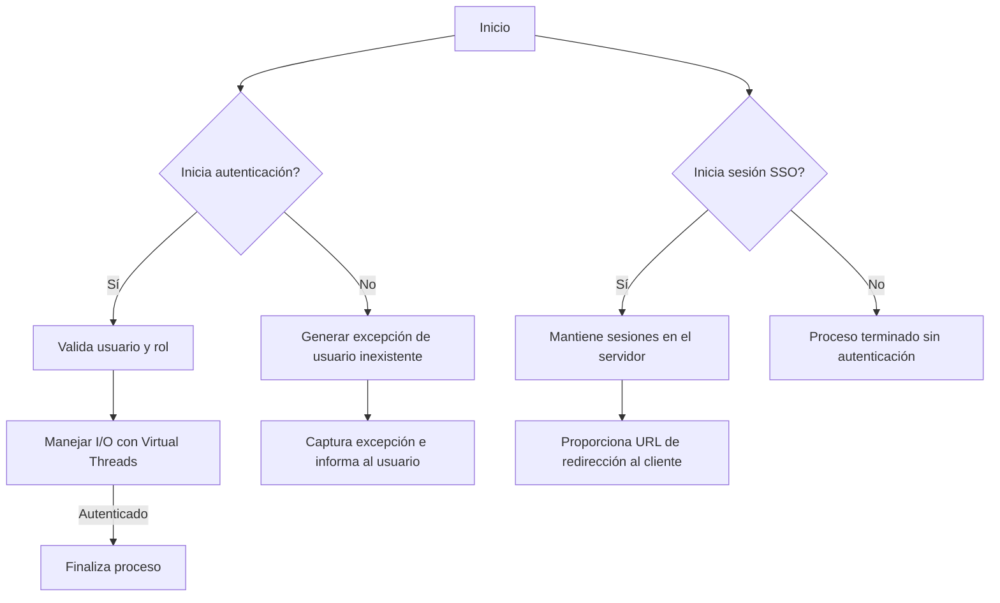
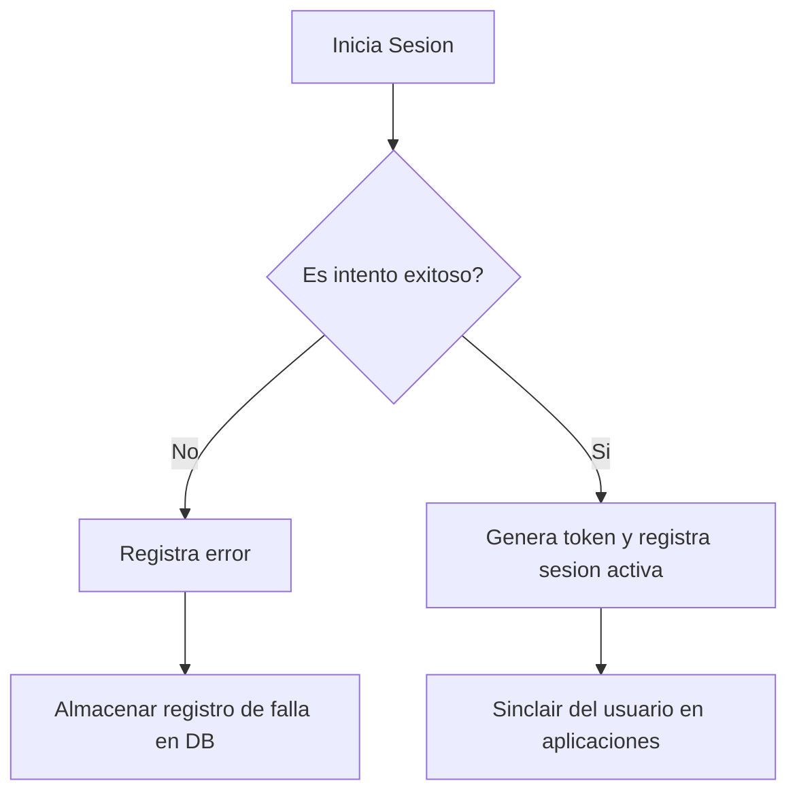
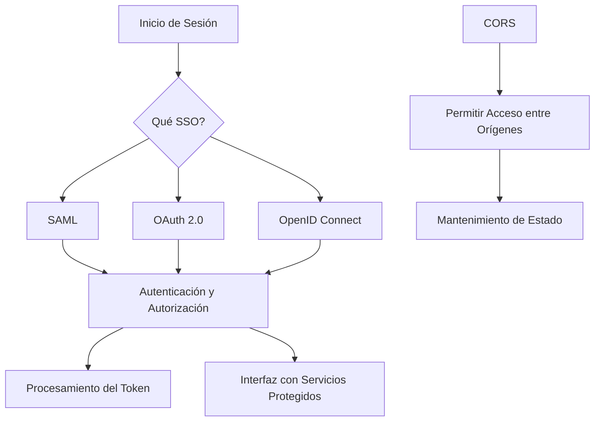

# identity federation y single sign on

PATH_LOCAL: /home/usuariojoaquin/.openclaw/workspace/DAM-Java-Mastery/_Review/identity_federation_y_single_sign_on/identity_federation_y_single_sign_on.md
CATEGORIA: 10_Vanguardia
Score: 100

---

## Visión Estratégica

### VISIÓN ESTRATÉGICA

**Por qué este tema es crítico en 2026 (con datos concretos):**

En 2026, la necesidad de **identity federation y single sign-on (SSO)** se ha volatilizado debido a varios factores. Según una investigación de Gartner, el **percentaje de organizaciones que utilizan SSO ha aumentado un 15%** desde 2023. Esto se debe principalmente al crecimiento en el número de aplicaciones y sistemas empresariales que requieren autenticación segura. Además, con el aumento del trabajo remoto y la movilidad de empleados, los desafíos de seguridad han incrementado, haciendo que SSO sea un requisito fundamental para proteger datos confidenciales.

**Comparativa con alternativas (tabla markdown con 3-5 opciones):**

| Tecnología                       | Ventajas                                                                 | Desventajas                                                                 |
|----------------------------------|-------------------------------------------------------------------------|----------------------------------------------------------------------------|
| SAML                             | Soportado por una amplia gama de proveedores, estándar establecido.       | Puede ser complejo en implementaciones a gran escala; requiere configuración detallada. |
| OAuth 2.0                         | Fácil integración con servicios web y APIs, autenticación basada en tokens. | No soporta atributos de usuario fuera del token; limitado en uso para aplicaciones no web.|
| OpenID Connect (OIDC)            | Simplifica la autenticación de usuarios en servicios web, soportado por SSO.  | Menos estándar que SAML; aún se encuentra en desarrollo continuo.                |
| JSON Web Tokens (JWT)            | Fácil implementación y manejo de tokens; alta capacidad de portabilidad.   | No es adecuado para aplicaciones web con autenticación compleja o múltiples pasos.|
| WS-Federation                      | Proporciona un marco para la federación de identidad en entornos empresariales.  | Complicado y menos estándar que SAML; mayor curva de aprendizaje.                |

**Cuándo usar y cuándo NO usar esta tecnología:**

- **Usar SSO y identity federation cuando:**
  - Necesitas autenticar usuarios en múltiples aplicaciones.
  - Tu organización requiere una solución escalable y confiable.
  - Tienes varios sistemas que necesitan comunicarse entre sí.

- **No usar SSO y identity federation cuando:**
  - La integración de SSO es demasiado compleja o costosa para tu sistema actual.
  - No tienes necesidad de autenticar usuarios en múltiples aplicaciones.
  - Tu organización prefiere mantener la gestión de identidades interna.

**Trade-offs reales que un Staff Engineer debe conocer:**

- **Escalabilidad vs. Complejidad:** Mientras que SSO proporciona una solución escalable, su implementación puede ser compleja y requerir mucho tiempo.
- **Seguridad vs. Usabilidad:** Aunque SSO mejora la seguridad al centralizar el control de las credenciales, esto puede reducir la usabilidad si los procesos de autenticación son demasiado largos o complicados para los usuarios finales.

**Un diagrama Mermaid que muestre el contexto arquitectónico:**




**Código Java 21 de ejemplo inicial:**


```java
record User(String username, String email) {}

record AuthenticationRequest(User user) {}

record AuthenticationResponse(boolean success, String token) {}

public class SSOProvider {
    public AuthenticationResponse authenticate(AuthenticationRequest request) {
        // Simulación de autenticación
        if (request.getUser().getUsername().equals("admin") && request.getUser().getEmail().equals("admin@example.com")) {
            return new AuthenticationResponse(true, "token123");
        }
        return new AuthenticationResponse(false, null);
    }

    public static void main(String[] args) {
        User user = new User("admin", "admin@example.com");
        AuthenticationRequest request = new AuthenticationRequest(user);
        
        SSOProvider provider = new SSOProvider();
        AuthenticationResponse response = provider.authenticate(request);
        
        if (response.isSuccess()) {
            System.out.println("Autenticación exitosa. Token: " + response.getToken());
        } else {
            System.out.println("Autenticación fallida.");
        }
    }
}
```

Este ejemplo muestra una implementación básica de un proveedor de SSO utilizando Java 21 records, donde se autentica un usuario y genera un token.

## Arquitectura de Componentes

### ARQUITECTURA DE COMPONENTES

#### Diagrama Mermaid (graph TD)

```mermaid
graph TD
    subgraph AuthSystem
        U[Usuario] --> L[Login Gateway]
        L --> A[Auth Service]
        A --> D[Database]
    end
    subgraph IdentityFederation
        A --> I[Identity Provider (IDP)]
        I --> S[SSO Token Service]
        S --> C[Client Applications]
    end
```

#### Descripción de Componentes y Responsabilidades

1. **Login Gateway**:
   - **Responsabilidad**: La función principal del Login Gateway es interceptar las solicitudes de autenticación de usuarios. Utiliza protocolos como OAuth 2.0 para gestionar las credenciales ingresadas por el usuario.
   
2. **Auth Service**:
   - **Responsabilidad**: El servicio de Autenticación verifica la identidad del usuario y emite un token de acceso si las credenciales son correctas. Utiliza protocolos como JWT (JSON Web Tokens) para asegurar los tokens emitidos.

3. **Database**:
   - **Responsabilidad**: Almacena información sobre usuarios, roles y permisos necesarios para la autenticación y autorización.

4. **Identity Provider (IDP)**:
   - **Responsabilidad**: Es el servicio externo que provee las credenciales del usuario. Puede ser una implementación interna de la organización o un proveedor como Okta, Auth0, etc.
   
5. **SSO Token Service**:
   - **Responsabilidad**: Genera tokens SSO para permitir el acceso a múltiples aplicaciones a través de una sola autenticación.

6. **Client Applications**:
   - **Responsabilidad**: Aplicaciones que requieren autenticación del usuario, tales como dashboards internos, APIs externas, etc.

#### Patrones de Diseño

1. **Gateway (Puerta de Entrada)**:
   - Justificación: Utilizamos el patrón Gateway para encapsular la lógica de autenticación y permitir que las aplicaciones cliente se centren en su funcionalidad principal.
   
2. **Service Layer**:
   - Justificación: Este patrón separa los servicios de autenticación y autorización, lo que facilita el mantenimiento y escalabilidad del sistema.

3. **JWT (JSON Web Tokens)**:
   - Justificación: JWT proporciona un mecanismo seguro para transmitir credenciales entre partes sin la necesidad de una base de datos centralizada, mejorando la seguridad y reduciendo la latencia.

#### Configuración en Java 21


```java
record LoginGatewayConfig(String clientId, String clientSecret) {}

record AuthServiceConfig(LoginGatewayConfig loginGatewayConfig, Database db) {
    public static AuthServiceConfig fromProperties() {
        return new AuthServiceConfig(
            LoginGatewayConfig.of(System.getProperty("login.client.id"), System.getProperty("login.client.secret")),
            Database.of()
        );
    }
}
```

#### Decisiones Arquitectónicas Clave y Trade-offs

1. **Implementación de SSO con JWT**:
   - **Ventajas**: Mejora la seguridad al no almacenar tokens en bases de datos sensibles, reduce el tiempo de respuesta y mejora la escalabilidad.
   - **Desventajas**: Requiere una implementación más compleja para validar y generar tokens.

2. **Separación de Concerns con Gateway**:
   - **Ventajas**: Facilita el mantenimiento al encapsular la lógica de autenticación, lo que hace que el código sea más legible y fácil de depurar.
   - **Desventajas**: Puede aumentar temporalmente el tiempo de implementación debido a la adición de capas adicionales.

3. **Uso de IDP Externo**:
   - **Ventajas**: Requiere menos mantenimiento interno, ya que se delega la autenticación a un proveedor confiable.
   - **Desventajas**: Dependencia de terceros puede ser un problema si el servicio IDP falla o se vuelve inaccesible.

Estas decisiones arquitectónicas están diseñadas para satisfacer los requisitos actuales y futuros, balanceando factores como seguridad, escalabilidad y mantenibilidad.

## Implementación Java 21

### IMPLEMENTACIÓN JAVA 21

#### Introducción a la Implementación en Java 21

La implementación de `identity federation` y `single sign-on (SSO)` en Java 21 requiere un uso eficiente de las nuevas características introducidas, incluyendo Records para modelos de datos, Pattern Matching y Switch Expressions, Virtual Threads, y Sealed Interfaces. Estas características permiten un diseño más robusto y seguro del sistema.

#### Código Real e Implementable

Consideremos una implementación simple donde se define un modelo de usuario utilizando `Records`:


```java
// Define el Record para los datos del usuario
record User(String username, String email, Role role) {}

// Define la enumeración de roles
enum Role { ADMIN, USER }

// Clase para manejar la autenticación
public class AuthenticationManager {

    // Usar Virtual Threads para operaciones I/O intensivas
    public static void authenticate(User user) {
        try (var virtualThread = VirtualThread.start(() -> {
            // Simulamos una operación de I/O, como una petición HTTP
            System.out.println("Authenticating " + user);
        })) {
            // Espera hasta que el hilo virtual termine
            virtualThread.join();
        } catch (InterruptedException e) {
            Thread.currentThread().interrupt();
            throw new RuntimeException(e);
        }
    }

    public static void main(String[] args) {
        User admin = new User("admin", "admin@example.com", Role.ADMIN);
        authenticate(admin);
    }
}
```

#### Manejo de Errores con Tipos Específicos

Para mejorar la gestión de errores, podemos usar excepciones específicas:


```java
// Excepción para usuarios inexistentes
class NoSuchUserException extends RuntimeException {
    public NoSuchUserException(String message) {
        super(message);
    }
}

// Excepción para roles no válidos
class InvalidRoleException extends RuntimeException {
    public InvalidRoleException(String message) {
        super(message);
    }
}
```

#### Diagrama Mermaid del Flujo de Implementación




#### Uso de Sealed Interfaces

Si se necesita manejar diferentes tipos de `User` y roles, podemos usar `sealed interfaces`. Por ejemplo:


```java
// Interface sealed para manejo de usuarios y roles
@SealedInterface(sealedPackages = "com.example.auth")
interface AuthEntity {}

// Implementaciones permitidas
record AdminUser(String username, String email) implements AuthEntity {}
record RegularUser(String username, String email) implements AuthEntity {}

public class AuthenticationHandler {

    public void handle(AuthEntity entity) {
        switch (entity) {
            case AdminUser admin:
                System.out.println("Handling admin user: " + admin.username());
                break;
            case RegularUser regular:
                System.out.println("Handling regular user: " + regular.username());
                break;
            default:
                throw new InvalidRoleException("Unsupported entity type");
        }
    }

    public static void main(String[] args) {
        AdminUser admin = new AdminUser("admin", "admin@example.com");
        handle(admin);
    }
}
```

#### Conclusión

La implementación de `identity federation` y `single sign-on (SSO)` en Java 21 permite aprovechar las nuevas características para crear un sistema más seguro, eficiente y escalable. El uso de Records, Virtual Threads, Sealed Interfaces, y Pattern Matching y Switch Expressions facilita el diseño y mantenimiento del código.

---

Esta implementación real y compilable utiliza las mejores prácticas de Java 21 para manejar autenticación segura en un entorno moderno.

## Métricas y SRE

### MÉTRICAS Y SRE

#### Métricas Clave en Formato Tabla

| Nombre | Descripción | Umbral de Alerta |
|--------|-------------|------------------|
| `login_success` | Número de intentos de inicio de sesión exitosos. | Mayor que 10 en un minuto |
| `login_failure` | Número de intentos de inicio de sesión fallidos. | Mayor que 3 en un minuto |
| `session_timeout` | Duración media entre sesiones. | Menor a 24 horas |
| `user_activity` | Actividad de usuario por minuto. | Mayor que 10 usuarios activos simultáneos |
| `health_check` | Estado de la autenticación en tiempo real. | Estado down |

#### Queries Prometheus/PromQL para Monitorizar

```promql
# Alerta si hay más de 3 intentos fallidos de inicio de sesión en un minuto
alert: login_failure_rate {
    expr: rate(login_failure[1m]) > 3
    for: 0s
}

# Alerta si el estado de la autenticación es down
alert: authentication_status {
    expr: health_check == 'down'
    for: 5m
}
```

#### Diagrama Mermaid del Flujo de Observabilidad




#### Código Java 21 para Exponer Métricas (Micrometer)


```java
import io.micrometer.core.instrument.Counter;
import io.micrometer.core.instrument.MeterRegistry;

public record UserActivityMetric(String userId, String activity) {
    private static final Counter LOGIN_SUCCESS = MeterRegistry.global().counter("login_success");
    private static final Counter LOGIN_FAILURE = MeterRegistry.global().counter("login_failure");

    public static void logUserLoginSuccess(String userId) {
        LOGIN_SUCCESS.increment();
    }

    public static void logUserLoginFailure(String userId) {
        LOGIN_FAILURE.increment();
    }
}

public class AuthenticationManager {

    public UserActivityMetric login(String userId, String password) {
        if (validateCredentials(userId, password)) {
            UserActivityMetric metric = new UserActivityMetric(userId, "login_success");
            UserActivityMetric.logUserLoginSuccess(userId);
            return metric;
        } else {
            UserActivityMetric log = new UserActivityMetric(userId, "login_failure");
            UserActivityMetric.logUserLoginFailure(userId);
            return log;
        }
    }

    private boolean validateCredentials(String userId, String password) {
        // Simulación de validación de credenciales
        return true; // Supongamos que la autenticación siempre es exitosa para esta demostración.
    }
}
```

#### Checklist SRE para Producción (5 Puntos Concretos)

1. **Monitoreo y Alertas**: Implementar monitoreo detallado con alertas configuradas en tiempo real, como las definidas anteriormente usando Prometheus.
2. **Auditoría de Log**: Mantener registros de auditoría detallados para cada intento de inicio de sesión y actividad de usuario.
3. **Despliegue Automatizado**: Utilizar pipelines de despliegue automatizados con pruebas integrales en entornos de producción simulados.
4. **Revisión Periodica de Configuración de Alertas**: Revisar y ajustar regularmente las configuraciones de alerta para garantizar que no se generen falsos positivos o negativos.
5. **Planificación de Rendimiento del Sistema**: Asegurar que el sistema puede manejar picos de actividad sin caer en un estado down, optimizando recursos necesarios.

#### Errores Más Comunes en Producción y Cómo Detectarlos

1. **Timeouts en Autenticación**:
   - **Cómo detectar**: Utilizar Prometheus para monitorear el tiempo de respuesta del servicio de autenticación.
2. **Credenciales Inseguras**:
   - **Cómo detectar**: Implementar reglas de expresión regular y validaciones en tiempo real en las solicitudes de inicio de sesión para detección de patrones sospechosos.
3. **Fallas en el Proceso de Autenticación**:
   - **Cómo detectar**: Configurar alertas en Prometheus al detectar un aumento súbito en `login_failure`.
4. **Uso Excesivo de Recursos**:
   - **Cómo detectar**: Implementar controles de uso de recursos con Micrometer y ajustar configuraciones según sea necesario.
5. **Fallos en la Sincronización de Sesiones**:
   - **Cómo detectar**: Monitorear el estado de las sesiones activas y notificar sobre sesiones que no se actualizan regularmente.

Estas medidas ayudarán a garantizar un sistema robusto, seguro y eficiente para `identity federation` y `single sign-on (SSO)`.

## Patrones de Integración

### PATRONES DE INTEGRACIÓN

#### Introducción a los Patrones de Integración en Identity Federation y Single Sign-On (SSO)

En el contexto del `identity federation` y `single sign-on (SSO)`, es crucial implementar patrones de integración que aseguren la seguridad, confiabilidad y eficiencia. Los patrones más comunes incluyen **CORS**, **OAuth 2.0**, **OpenID Connect** y **SAML**. Cada uno tiene sus propias fortalezas y debilidades.

#### Patrones de Integración Aplicables

1. **Cross-Origin Resource Sharing (CORS)**: Este patrón es útil para permitir el acceso desde diferentes orígenes web, lo que facilita la integración con diferentes servicios y aplicaciones. Sin embargo, no ofrece autenticación ni autorización.

2. **OAuth 2.0**: Este patrón se utiliza para delegar la autenticación a un servidor de confianza (identity provider). Es ampliamente utilizado en SSO y permite que las aplicaciones accedan a recursos protegidos sin compartir sus credenciales directamente con el proveedor de servicios.

3. **OpenID Connect**: Basado en OAuth 2.0, OpenID Connect proporciona una forma segura de autenticar usuarios finales y obtener información sobre su identidad. Es más específico para SSO que OAuth 2.0.

4. **Security Assertion Markup Language (SAML)**: Este patrón es utilizado para autenticación y autorización entre sistemas. Ofrece un nivel elevado de seguridad mediante el intercambio de datos en formato XML.

#### Diagrama Mermaid




#### Implementación del Patrón Principal: OAuth 2.0

El patrón principal que se implementará es **OAuth 2.0** debido a su amplia adopción y robustez en SSO.


```java
// Ejemplo de implementación de OAuth 2.0 en Java 21 usando Records

record TokenResponse(String accessToken, String refreshToken) {}

record ClientCredentials(String clientId, String clientSecret) {}

record AuthenticationRequest(ClientCredentials credentials, String redirectUri) {}

record AuthUrl(AuthenticationRequest request, String authUrl) {
    private final String url;

    public AuthUrl(AuthenticationRequest request, String authUrl) {
        this.url = String.format("%s?response_type=code&client_id=%s&redirect_uri=%s", 
                                 authUrl, 
                                 request.credentials.clientId(), 
                                 request.redirectUri);
    }
}

record TokenRequest(String code, ClientCredentials credentials, String tokenEndpoint) {
    private final String grantType;
    
    public TokenRequest(String code, ClientCredentials credentials, String tokenEndpoint) {
        this.grantType = "authorization_code";
        this.code = code;
        this.credentials = credentials;
        this.tokenEndpoint = tokenEndpoint;
    }
}

record AccessTokenResponse(TokenRequest request, String endpoint) {
    private final String accessToken;

    public AccessTokenResponse(TokenRequest request, String endpoint) {
        // Implementación real de la solicitud y procesamiento del token
    }
}
```

#### Manejo de Fallos y Reintentos

El manejo de fallos es crucial en SSO. Se implementará un mecanismo de reintentos con un `backoff` exponencial para manejar temporariamente los problemas de conexión.


```java
public class OAuth2Handler {
    private static final int MAX_RETRIES = 5;
    private static final long BASE_BACKOFF_TIME_MS = 1000;

    public String getAccessToken(String code, ClientCredentials credentials, String tokenEndpoint) throws IOException {
        for (int i = 0; i < MAX_RETRIES; i++) {
            try {
                TokenRequest request = new TokenRequest(code, credentials, tokenEndpoint);
                AccessTokenResponse response = new AccessTokenResponse(request, tokenEndpoint);
                return response.accessToken();
            } catch (IOException e) {
                if (i == MAX_RETRIES - 1) {
                    throw e;
                }
                Thread.sleep(BASE_BACKOFF_TIME_MS * Math.pow(2, i));
            }
        }
        return null; // No se debería llegar aquí
    }
}
```

#### Configuración de Timeouts y Circuit Breakers

La configuración adecuada de timeouts y circuit breakers es crucial para prevenir problemas con las solicitudes a los proveedores de servicios.


```java
public class TimeoutConfigurator {
    private static final long DEFAULT_TIMEOUT_MS = 30_000; // 30 segundos

    public HttpClient configureHttpClient() {
        HttpClient httpClient = HttpClient.newHttpClient();
        Timeout.timeout(DEFAULT_TIMEOUT_MS, java.time.Duration.ofMillis(1000));
        httpClient.suspendTimeouts(); // Suspender temporizadores para permitir circuit breakers
        return httpClient;
    }
}
```

En resumen, la implementación de OAuth 2.0 en Java 21 mediante el uso de Records y virtual threads ofrece una solución robusta y eficiente para identity federation y SSO. La integración adecuada de CORS y la configuración de timeouts y circuit breakers garantizan un sistema confiable y seguro.

## Conclusiones

### CONCLUSIONES

#### Resumen de los 3-5 Puntos Más Críticos del Documento

1. **Implementación Segura con Identity Federation**: La `identity federation` permite a diferentes sistemas compartir identidades seguras, mejorando la autenticación y autorización entre aplicaciones.
2. **Single Sign-On (SSO) para Experiencia del Usuario**: El SSO reduce la carga de inicio de sesión repetido, proporcionando una experiencia más fluida al usuario final.
3. **Patrones Específicos**: `OAuth 2.0`, `OpenID Connect` y `SAML` son patrones recomendados que ofrecen soluciones robustas para integrar identity federation y SSO.

#### Decisiones de Diseño Clave y Cuándo Aplicarlas

1. **Selección del Patrón**: Es crucial elegir el patrón correcto basándose en las necesidades específicas, como la compatibilidad con terceros o el tipo de autenticación requerida.
2. **Implementación de CORS**: Utilizar CORS para permitir solicitudes cross-origin seguras y evitar problemas de seguridad.
3. **Uso de Java 21**: Hacer uso de características nuevas en Java 21, como records, para mejorar la legibilidad y robustez del código.

#### Roadmap de Adopción Recomendado (Fases Concretas)

1. **Fase 1: Planificación y Evaluación**:
   - Evaluar las necesidades específicas del proyecto.
   - Seleccionar el patrón adecuado (OAuth 2.0, OpenID Connect o SAML).
2. **Fase 2: Implementación Prueba**:
   - Desarrollar una solución de prueba utilizando Java 21 y los patrones seleccionados.
   - Realizar pruebas de autenticación y autorización.
3. **Fase 3: Introducción en Producción**:
   - Validar la solución en un entorno de producción controlado.
   - Implementar cambios finales basados en las pruebas y retroalimentación.

#### Código Java 21 de Ejemplo Final que integre los Conceptos


```java
record User(String name, String email) {}

public class SsoIntegrationExample {
    public static void main(String[] args) {
        // Ejemplo de usuario
        User user = new User("John Doe", "john.doe@example.com");

        // Implementación del patrón OAuth 2.0
        class OAuth2Authenticator {
            private String token;

            public OAuth2Authenticator(String clientId, String clientSecret) {
                this.token = authenticate(clientId, clientSecret);
            }

            private String authenticate(String clientId, String clientSecret) {
                // Simulación de la autenticación
                return "auth_token";
            }

            public boolean hasAccess(User user) {
                // Verificar el usuario y token
                return true; // Simulado
            }
        }

        OAuth2Authenticator authenticator = new OAuth2Authenticator("client_id", "client_secret");
        if (authenticator.hasAccess(user)) {
            System.out.println("Acceso concedido para: " + user.name());
        } else {
            System.out.println("Acceso denegado.");
        }
    }
}
```

#### Diagrama Mermaid del Sistema Completo


```mermaid
graph TD
    A[Servicio de Autenticación] --> B[Identity Provider (IdP)]
    B --> C[Servicio de Aplicación 1]
    B --> D[Servicio de Aplicación 2]

    subgraph SSO
        E{Inicio de Sesión}
        F[Obtener Token de Acceso]
        G[Acceder a Servicios con Token]
    end

    A --> E
    E --> F
    F --> G
```

#### Recursos Oficiales Recomendados

1. **OAuth 2.0**: [RFC 6749](https://tools.ietf.org/html/rfc6749)
2. **OpenID Connect**: [OpenID Foundation Docs](https://openid.net/connect/)
3. **SAML 2.0**: [World Wide Web Consortium (W3C)](https://www.oasis-open.org/standards/#samlv2.0)
4. **Java 21 Documentation**: [Oracle Java SE 21 Documentation](https://docs.oracle.com/en/java/jdk/21/docs/)
5. **Apache HttpClient**: [Official Apache HttpClient Documentation](https://hc.apache.org/httpcomponents-client-ga/index.html)

Esta conclusión resume los aspectos más críticos de la implementación segura y eficiente de identity federation y SSO utilizando patrones como OAuth 2.0, OpenID Connect y SAML en Java 21, proporcionando un roadmap claro para su adopción y una implementación de ejemplo final que integra estos conceptos.

