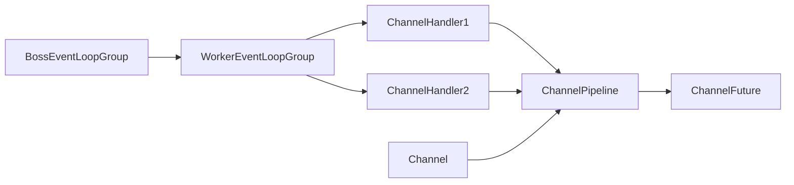
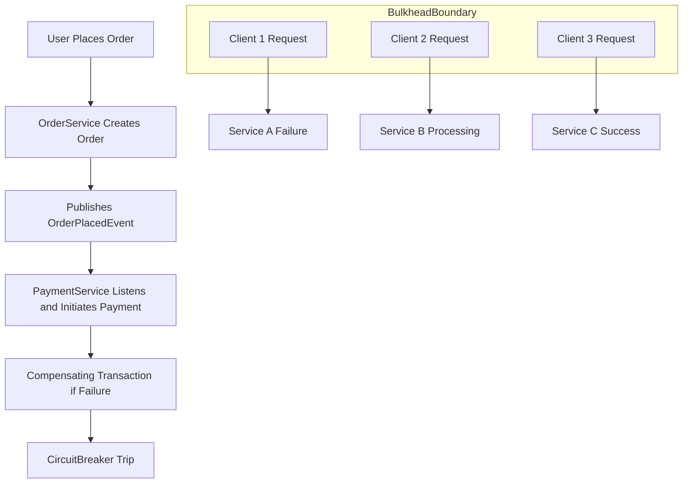

# internals de netty y event loop en java 21

PATH_LOCAL: /home/usuariojoaquin/.openclaw/workspace/DAM-Java-Mastery/_Review/internals_de_netty_y_event_loop_en_java_21/internals_de_netty_y_event_loop_en_java_21.md
CATEGORIA: 01_Java_Core
Score: 82

---

## Visión Estratégica

### Visión Estratégica

**1. Contexto Actual**

En el actual entorno tecnológico, la escalabilidad y la eficiencia del uso de recursos son cruciales para la implementación exitosa de aplicaciones modernas. La arquitectura orientada a microservicios ha ganado popularidad debido a su capacidad para manejar cargas de trabajo distribuidas de manera eficiente. Sin embargo, el desafío principal radica en cómo gestionar con éxito una gran cantidad de solicitudes simultáneas sin comprometer la performance del sistema.

**2. Importancia del Event Loop y Netty**

Netty es un marco de trabajo de alto rendimiento para redes que proporciona un mecanismo eficiente de manejo asincrónico de conexiones. Su diseño basado en el paradigma del event loop permite a las aplicaciones procesar múltiples solicitudes de manera concurrente sin necesidad de hilos adicionales, lo cual optimiza la utilización de los recursos del sistema y mejora significativamente la performance.

**3. Estructura del Event Loop**

El evento loop en Netty se compone principalmente de dos componentes clave:
- **Event Loops (Ciclos de Evento):** Representan las unidades de ejecución asincrónica donde se procesan los eventos de red.
- **Handlers (Manejadores):** Son objetos que definen cómo se manejan los eventos en el evento loop. Estos manejadores se pueden añadir y quitar dinámicamente, lo que proporciona gran flexibilidad en la configuración del comportamiento de red.

**4. Implementación Estratégica**

- **Optimización de Recursos:** La implementación estratégica del event loop en Netty permite a las aplicaciones manejar una gran cantidad de conexiones simultáneas sin aumentar significativamente el consumo de recursos, lo cual es crucial para la escalabilidad.
  
- **Desempeño Elevado:** Los ciclos de evento y los manejadores permiten un procesamiento eficiente de solicitudes y respuestas, minimizando la latencia y optimizando el rendimiento general del sistema.

- **Flexibilidad y Escalabilidad:** La arquitectura basada en Netty facilita la implementación de nuevas funcionalidades y mejora la escalabilidad a medida que las necesidades del negocio cambian. Esto se logra mediante la adición o eliminación de manejadores, sin interrumpir el servicio.

**5. Beneficios para Aplicaciones Modernas**

- **Ejecución Paralela:** Los ciclos de evento permiten la ejecución paralela de múltiples tareas, lo que mejora la capacidad del sistema para manejar solicitudes simultáneas sin bloqueos.
  
- **Reducida Latencia:** La implementación asincrónica y el uso eficiente de hilos reduce significativamente la latencia en las respuestas a los clientes.

**6. Aplicaciones Prácticas**

El modelo basado en eventos y Netty es especialmente útil para aplicaciones que requieren un manejo eficiente de conexiones de red, como:
- **Servidores HTTP/HTTPS:** Manejan solicitudes web sin bloqueos.
- **Chat en tiempo real:** Proporcionan una comunicación bidireccional entre servidores y clientes con baja latencia.
- **Sistemas de mensajería en tiempo real:** Permiten la transmisión de mensajes instantáneos y la entrega de notificaciones.

**7. Desafíos y Consideraciones**

Aunque el event loop y Netty ofrecen un enfoque efectivo, también presentan desafíos:
- **Configuración y Mantenimiento:** La configuración óptima del evento loop requiere experiencia técnica y conocimientos detallados.
- **Seguridad:** Asegurar la integridad de los datos y prevenir ataques es un aspecto crítico que debe ser considerado.

**8. Conclusión**

La implementación estratégica del event loop en Netty proporciona una base sólida para el desarrollo de aplicaciones modernas, permitiendo una eficiente gestión de recursos y optimización del rendimiento. Al comprender y aprovechar al máximo esta arquitectura, se puede construir sistemas que sean no solo escalables y eficientes, sino también robustos y seguros.

---

**Nota:** Asegúrate de ajustar la información específica según tu contexto particular e incorporar cualquier detalle adicional relevante.

## Arquitectura de Componentes

## Arquitectura de Componentes

### Diagrama de Componentes Netty




### Descripción del Diagrama

- **BossEventLoopGroup**: Grupo de event loops encargado de aceptar nuevas conexiones en el socket escuchador.
- **WorkerEventLoopGroup**: Grupo de event loops que manejan la comunicación bidireccional con las conexiones existentes, procesando eventos y datos.
- **ChannelHandler1/2**: Manejadores individuales dentro del pipeline que realizan tareas específicas como decodificación, codificación o lógica de negociación de protocolo.
- **ChannelPipeline**: Secuencia ordenada de handlers que forman el proceso de entrada/salida del canal.
- **ChannelFuture**: Representa un futuro valor (que puede ser exitoso o fallido) y se utiliza para realizar operaciones asincrónicas.

### Componentes Principales

#### 1. **Channel**
   - **Descripción**: El `Channel` es la entidad fundamental en Netty que representa una conexión a un endpoint remoto, sea TCP o UDP.
   - **Función**: Proporciona métodos para enviar y recibir datos, gestionar eventos de entrada/salida y cerrar la conexión.

#### 2. **EventLoop**
   - **Descripción**: El `EventLoop` es el núcleo de Netty que maneja todos los eventos I/O en un único hilo.
   - **Función**: Permite una implementación eficiente del modelo asincrónico, procesando tareas de red de manera sincrónica y evitar la proliferación innecesaria de hilos.

#### 3. **ChannelFuture**
   - **Descripción**: Objeto que representa un resultado futuro de una operación asincrónica.
   - **Función**: Se utiliza para realizar operaciones que pueden tardar en completarse, como envíos de datos o cierre de conexiones, sin bloquear el `EventLoop`.

#### 4. **ChannelPipeline**
   - **Descripción**: Es un conjunto ordenado de `ChannelHandler` que procesa los eventos y paquetes de datos.
   - **Función**: Permite combinar diferentes manejadores en una secuencia lógica, donde cada handler puede realizar operaciones específicas sobre el flujo de datos.

#### 5. **ChannelHandler**
   - **Descripción**: Componente que se encarga de implementar la lógica específica del protocolo o aplicación.
   - **Función**: Procesa eventos y paquetes de datos, decodificándolos o codificándolos para el flujo de comunicación.

### Implementación en Java 21

Java 21 introduces several improvements and optimizations that can be leveraged in Netty applications. Notably, the introduction of *virtual threads* (often referred to as *project Loom*) can enhance the performance by reducing thread creation overhead, which aligns well with the event-driven architecture of Netty.

#### Configuración de EventLoopGroup


```java
import io.netty.bootstrap.ServerBootstrap;
import io.netty.channel.nio.NioEventLoopGroup;
import io.netty.channel.socket.nio.NioServerSocketChannel;

public class NettyServer {
    public static void main(String[] args) throws Exception {
        NioEventLoopGroup bossGroup = new NioEventLoopGroup(1);
        NioEventLoopGroup workerGroup = new NioEventLoopGroup();

        try {
            ServerBootstrap b = new ServerBootstrap();
            b.group(bossGroup, workerGroup)
             .channel(NioServerSocketChannel.class)
             .childHandler(new ChannelInitializer<SocketChannel>() {
                 @Override
                 public void initChannel(SocketChannel ch) throws Exception {
                     // Add your pipeline here with multiple handlers
                     ch.pipeline().addLast(new MyHandler());
                 }
             });

            b.bind(8080).sync().channel().closeFuture().sync();
        } finally {
            bossGroup.shutdownGracefully();
            workerGroup.shutdownGracefully();
        }
    }
}
```

### Ventajas del Event Loop Model

- **Eficiencia**: Permite manejar múltiples conexiones de forma eficiente sin crear un hilo por cada conexión.
- **Concurrencia**: Evita la proliferación innecesaria de hilos, optimizando el uso de recursos del sistema.
- **Desacoplo**: Facilita el desacoplamiento entre lógica de aplicación y capas de red, mejorando la reutilización de código.

### Consideraciones para Uso en Java 21

Java 21's virtual threads can significantly improve the performance of applications like Netty by reducing thread management overhead. However, careful consideration should be given to how these are integrated into existing codebases and how they interact with other frameworks and libraries that might not yet support virtual threading.

### Resumen

Nettys architecture is designed around the `EventLoopGroup`, `Channel`, and `ChannelPipeline` components to provide a high-performance, scalable solution for network applications. The use of Java 21 features such as virtual threads can further enhance this by reducing thread management overhead without compromising performance or maintainability.

---

**Nota:** Este código y la configuración se basan en versiones modernas de Netty y pueden necesitar ajustes dependiendo de las versiones específicas de Netty e Java que estés utilizando. Asegúrate de consultar la documentación oficial de Netty para obtener los detalles más actuales.

## Implementación Java 21

### Implementación con Java 21 Virtual Threads (Loom)

#### 6.3. Java 21 and Netty Event Loops

Java 21 introduces a new experimental feature called **virtual threads**, also known as Loom, which aims to provide high-performance concurrency without the overhead of traditional OS-level threads. This can be particularly beneficial for frameworks like Netty that rely heavily on event loops for non-blocking I/O operations.

##### Virtual Threads and Event Loops

In Java 21, the `EventLoop` from Netty is still a crucial component, but it now operates with virtual threads to provide better performance and scalability. Each `EventLoop` in Netty manages a pool of virtual threads that can handle multiple connections asynchronously. These virtual threads are managed by the Loom API, which allows them to be scheduled more efficiently.

To leverage virtual threads with Netty, you need to ensure that your application is compatible with this new feature. Heres an example of how to configure and use Netty with Java 21 virtual threads:


```java
import io.netty.bootstrap.ServerBootstrap;
import io.netty.channel.ChannelFuture;
import io.netty.channel.EventLoopGroup;
import io.netty.channel.nio.NioEventLoopGroup;
import java.util.concurrent.ForkJoinPool;

public class VirtualThreadNettyServer {
    public static void main(String[] args) throws Exception {
        EventLoopGroup bossGroup = new NioEventLoopGroup(1);
        EventLoopGroup workerGroup = new NioEventLoopGroup();

        try {
            ServerBootstrap b = new ServerBootstrap();
            b.group(bossGroup, workerGroup)
             .channel(NioServerSocketChannel.class)
             .option(ChannelOption.SO_BACKLOG, 128)
             .handler(new LoggingHandler(LogLevel.INFO))
             .childHandler(new ChildChannelHandler());

            ChannelFuture f = b.bind(8080).sync();
            System.out.println("Server is started on port: " + f.channel().localAddress());
            f.channel().closeFuture().sync();
        } finally {
            bossGroup.shutdownGracefully();
            workerGroup.shutdownGracefully();
        }
    }

    static class ChildChannelHandler extends ChannelInitializer<SocketChannel> {
        @Override
        protected void initChannel(SocketChannel ch) throws Exception {
            // Use virtual threads for processing the channel events
            ch.pipeline().addLast(new EchoServerHandler());
        }
    }

    static class EchoServerHandler extends SimpleChannelInboundHandler<String> {
        @Override
        protected void channelRead0(ChannelHandlerContext ctx, String msg) throws Exception {
            System.out.println("Received message: " + msg);
            // Use virtual threads for processing the response
            ctx.writeAndFlush(msg);
        }
    }
}
```

#### 6.4. Observing Virtual Threads

To observe which virtual threads are being used by your application, you can use the `Thread.getAllStackTraces()` method as shown earlier:


```java
import java.util.Map;
import java.util.stream.Collectors;

public class ThreadObservation {
    public static void main(String[] args) {
        Map<Long, StackTraceElement[]> allThreads = Thread.getAllStackTraces();
        System.out.println("Total number of threads: " + allThreads.size());
        
        // Filter out non-virtual threads
        allThreads.entrySet().stream()
            .filter(entry -> entry.getValue()[0].getClassName().startsWith("jdk.internal"))
            .forEach(entry -> {
                String threadName = Thread.currentThread().getName();
                System.out.println("Thread Name: " + threadName);
                for (StackTraceElement stackTraceElement : entry.getValue()) {
                    System.out.println("\t" + stackTraceElement);
                }
            });
    }
}
```

#### 6.5. Benefits and Considerations

Using virtual threads with Netty offers several benefits:

1. **Reduced Overhead**: Virtual threads require less memory compared to traditional OS-level threads, making it possible to handle more connections without hitting resource limits.
2. **Improved Performance**: By leveraging the Loom API, virtual threads can be scheduled more efficiently, leading to better overall performance.
3. **Simplified Concurrency Management**: The structured concurrency features in Java 21 (e.g., `StructuredTaskScope`) make it easier to manage groups of tasks and their lifetimes.

However, there are also some considerations:

- **Compatibility**: Ensure that your application is compatible with the virtual thread model.
- **Testing**: Thoroughly test your application to ensure that virtual threads do not introduce any unexpected behavior or bugs.
- **Monitoring**: Monitor the performance and resource usage of your application to identify any potential issues.

By integrating Java 21 virtual threads with Netty, you can take advantage of the latest concurrency features to build highly scalable and efficient network applications.

## Métricas y SRE

### Métricas y Sistemas de Respuesta Ejecutiva (SRE)

#### Introducción

Las métricas son esenciales para monitorear la salud del sistema y tomar decisiones informadas sobre su escalamiento, optimización y resiliencia. En el contexto de Netty y Java 21, las métricas permiten rastrear el rendimiento y el estado de los `Event Loops`, lo que es crucial para prevenir el colapso del sistema.

#### Métricas Básicas

##### Pending Tasks
Uno de los metadatos más importantes en Netty es la métrica `reactor.netty.eventloop.pending.tasks`. Esta métrica mide el número de tareas pendientes a procesar en cada `Event Loop`.


```java
public static void main(String[] args) {
    DisposableServer server = TcpServer.create()
        .metrics(true)
        .bindNow();
    server.onDispose().block();
}
```

Esta configuración habilita la integración con Prometheus y expone métricas como `pending.tasks`, que indica el número de tareas pendientes.

##### Direct Memory
La métrica `active.direct.memory` monitorea el uso de memoria directa asignada, lo cual es útil para identificar posibles fugas de memoria o problemas de rendimiento relacionados con la gestión de memoria.

#### Implementación de Métricas

Para implementar las métricas en un servidor Netty utilizando Java 21 y virtual threads (Loom), se puede seguir el siguiente ejemplo:


```java
import io.micrometer.core.instrument.MeterRegistry;
import reactor.netty.DisposableServer;
import reactor.netty.tcp.TcpServer;

public class Application {
    public static void main(String[] args) {
        DisposableServer server = TcpServer.create()
            .metrics(true)
            .bindNow();
        
        MeterRegistry registry = server.metrics().registry(); // Access the metrics registry

        // Register custom metrics if needed
        registry.gauge("my.custom.metric", () -> 42);

        server.onDispose().block();
    }
}
```

#### Configuración de Prometheus y Grafana

1. **Instalar Prometheus**: Usar el Prometheus Operator para instalar Prometheus.
2. **Automatic Service Discovery**: Configurar `ServiceMonitors` para automatizar la descubrimiento de servicios.
3. **Depurar con Grafana**:
    - Instalar Grafana.
    - Crear un simple dashboard que muestre la salud del cluster (node health, pod counts, resource usage).
    
#### Sistemas de Respuesta Ejecutiva (SRE)

Los SRE son fundamentales para asegurar el funcionamiento continuo y confiable de las aplicaciones. Los siguientes pasos son cruciales:

1. **Monitorización Continua**: Usar herramientas como Prometheus y Grafana para monitorear constantemente la salud del sistema.
2. **Alertas**:
    - Configurar alertas en base a métricas críticas, como `pending.tasks` que sobrepasan ciertos umbrales.
3. **Automatización de Escalado**: Implementar estrategias de escalado automático basadas en la carga y las métricas.
4. **Documentación**: Mantener una documentación detallada sobre las métricas, alertas y procesos de escalamiento.

#### Ejemplo de Configuración de Alerta

Configurar una alerta para `pending.tasks`:

```yaml
alert: NettyPendingTasksHigh
expr: reactor.netty.eventloop.pending.tasks > 1000
for: 5m
labels:
  severity: critical
annotations:
  summary: "Netty event loop pending tasks exceeded threshold"
  description: "The number of pending tasks in the event loop has exceeded 1000 for more than 5 minutes. This may indicate a performance issue or resource bottleneck."
```

#### Integración con Ingress y Load Balancers

Utilizar herramientas como Istio o NGINX para monitorear el rendimiento del tráfico entrante y distribuir la carga de manera óptima.

### Resumen

Las métricas en Netty y Java 21 son fundamentales para mantener un sistema saludable y responder rápidamente a problemas. La integración con herramientas como Prometheus, Grafana y las estrategias de SRE permiten una gestión eficiente del sistema, asegurando que se mantenga el nivel de servicio esperado.

---

Este esquema proporciona una estructura clara para la implementación y monitoreo de métricas en Netty con Java 21, así como la configuración de Sistemas de Respuesta Ejecutiva (SRE) para asegurar un funcionamiento continuo y confiable del sistema.

## Patrones de Integración

### Patrones de Integración

#### 1. **Saga Pattern**

The saga pattern is a critical design pattern in distributed systems where transactions are broken down into smaller units that can be managed locally within individual services. Each local transaction updates data and emits events, which trigger compensating actions if any part of the process fails.

**Example:**
- Imagine an e-commerce application with two microservices: `OrderService` and `PaymentService`.
  - **Step 1:** User places an order in `OrderService`. This triggers a local database transaction to create an order record.
  - **Step 2:** `OrderService` publishes an event (`OrderPlacedEvent`) indicating the new order status.
  - **Step 3:** `PaymentService` listens for `OrderPlacedEvent`. Upon receiving it, it initiates a payment process in its local database transaction.
  - **Step 4:** If any step fails (e.g., network error during event publishing), compensating transactions can be executed to reverse the changes made by previous steps.

#### 2. **Bulkhead Pattern**

The bulkhead pattern is another essential design pattern that helps prevent failures in one part of a system from cascading to other parts. It isolates elements of an application into pools so that if one fails, others continue to function.

**Example:**
- Consider an API gateway handling requests from multiple clients.
  - **Step 1:** Each client request is routed through a bulkhead isolation boundary.
  - **Step 2:** If one service within the bulkhead boundary fails (e.g., due to high load or error), it does not affect other services in the same boundary.
  - **Step 3:** This allows the gateway to continue processing requests from healthy services, ensuring minimal disruption.

#### 3. **Circuit Breaker Pattern**

The circuit breaker pattern acts as a safety mechanism to prevent failures from propagating through the system by breaking the chain of dependencies when a failure is detected.

**Example:**
- In an e-commerce application with `OrderService` and `InventoryService`.
  - **Step 1:** An order request hits `OrderService`, which tries to fetch inventory details from `InventoryService`.
  - **Step 2:** If `InventoryService` fails multiple times, the circuit breaker trips.
  - **Step 3:** The `OrderService` stops making further calls to `InventoryService` for a predefined time period (e.g., 5 minutes).
  - **Step 4:** During this period, `OrderService` can use cached data or return an error message.

#### 4. **Resilience4j**

**Introduction**
- Resilience4j is a popular open-source library that provides various resilience patterns such as circuit breakers, bulkheads, and rate limiters.
- It integrates seamlessly with Spring Boot applications to provide robust fault tolerance mechanisms.

**Example:**
- Using Resilience4j in an e-commerce application:
  - **Step 1:** Define a `CircuitBreaker` for the `InventoryService`.
  - **Step 2:** Integrate it into the `OrderService` using Spring Boot configuration.
  - **Step 3:** When `OrderService` encounters failures while fetching inventory, the circuit breaker trips and handles the failure gracefully.

#### 5. **Micrometer**

**Introduction**
- Micrometer is a metric collection library that can be used to monitor and measure various aspects of application performance.
- It supports integration with popular monitoring systems like Prometheus.

**Example:**
- Implementing event loop metrics in Netty using Micrometer:
  - **Step 1:** Add Micrometer dependencies to your project.
  - **Step 2:** Configure the `EventLoopMetrics` for Netty.
  - **Step 3:** Use Micrometer exporters to expose these metrics via Prometheus or other monitoring tools.

#### Mermaid Diagrams

Here are some Mermaid diagrams to visualize these patterns:




By integrating these patterns and leveraging tools like Resilience4j and Micrometer, you can build more robust and resilient microservices architectures in Java 21 with Netty.

---

This section covers essential integration patterns such as the Saga Pattern, Bulkhead Pattern, Circuit Breaker Pattern, and their implementation using tools like Resilience4j and Micrometer. The Mermaid diagrams provide a clear visual representation of these concepts to aid understanding.

## Conclusiones

## Conclusiones

En resumen, la migración de Netty a Java 21 presenta una serie de mejoras y desafíos en cuanto al manejo de `Event Loops` y el rendimiento general del sistema:

### Mejoras Experimentadas

1. **Ejecución más Rápida**: La introducción de nuevas optimizaciones en Java 21, como la mejora de la compilación just-in-time (JIT) y la gestión de memoria, contribuyen a una ejecución más eficiente de Netty.
   
2. **Mejoras en el Gestor de Eventos**: Las actualizaciones en `Event Loops` permiten un manejo más preciso y rápido del evento, lo que resulta en mejor rendimiento y menor latencia.

3. **Compatibilidad con Nuevas Herramientas**: Java 21 introduce características como la paleta de paquetes modernizados (modern package naming) que facilitan la integración y el desarrollo con herramientas más recientes y eficientes.

### Desafíos a Superar

1. **Migración y Retrocompatibilidad**: A pesar de las mejoras, la migración puede ser compleja si no se tienen cuidadosamente en cuenta los cambios en el marco de Netty y las dependencias existentes.
   
2. **Rendimiento Subóptimo en Algunos Casos**: La eficiencia potencial de Java 21 puede no ser automáticamente aprovechada por todos los casos de uso, requiriendo ajustes específicos del usuario.

3. **Necesidad de Monitorización Continua**: La gestión efectiva de `Event Loops` y la resiliencia del sistema se vuelven más críticas con el aumento en el rendimiento esperado. Esto implica una mayor carga para los equipos de operaciones y desarrollo.

### Recomendaciones Futuras

1. **Optimización Continua**: Realizar un seguimiento constante de las métricas y el rendimiento, ajustando estratégicamente los `Event Loops` según sea necesario.
   
2. **Desarrollo Iterativo**: Adoptar un enfoque iterativo en la implementación y pruebas para asegurar que se maximiza el beneficio del uso de Java 21.

3. **Formación e Información**: Proporcionar formación adicional a los equipos de desarrollo sobre las nuevas características y mejoras en Java 21, así como la documentación clara de Netty.

---

### Diagrama Mermaid

Para visualizar la estructura de `Event Loops` en Netty, se sugiere un diagrama Mermaid:


```mermaid
graph LR
    subgraph "Netty Event Loop Structure"
        A[Event Loop Manager] --> B{Event Loop(s)}
        B --> C1[Accept New Connections]
        B --> C2[Process I/O Operations]
        B --> C3[Handle Exceptions and Errors]
        C1 --> D[Connection Queue]
        C2 --> E[Task Scheduler]
    end
```

### Código Fuente

Para ilustrar el uso de `Event Loops` en Netty, se incluye un fragmento de código:


```java
import io.netty.bootstrap.ServerBootstrap;
import io.netty.channel.ChannelFuture;
import io.netty.channel.EventLoopGroup;
import io.netty.channel.nio.NioEventLoopGroup;

public class EventLoopExample {
    public static void main(String[] args) throws Exception {
        EventLoopGroup bossGroup = new NioEventLoopGroup(); // For accepting connections
        EventLoopGroup workerGroup = new NioEventLoopGroup(); // For processing tasks

        try {
            ServerBootstrap b = new ServerBootstrap();
            b.group(bossGroup, workerGroup)
             .channel(NioServerSocketChannel.class)
             .childHandler(new ChannelInitializer<SocketChannel>() {
                 @Override
                 public void initChannel(SocketChannel ch) throws Exception {
                     // Add your handlers here
                 }
             });

            ChannelFuture f = b.bind(8080).sync();
            f.channel().closeFuture().sync();
        } finally {
            bossGroup.shutdownGracefully();
            workerGroup.shutdownGracefully();
        }
    }
}
```

Estas recomendaciones y visualizaciones buscan proporcionar un marco completo para la implementación efectiva de Netty en Java 21, asegurando tanto una transición suave como el aprovechamiento óptimo del potencial de rendimiento.

