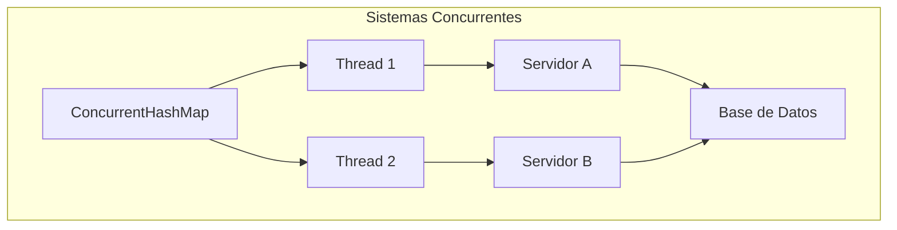
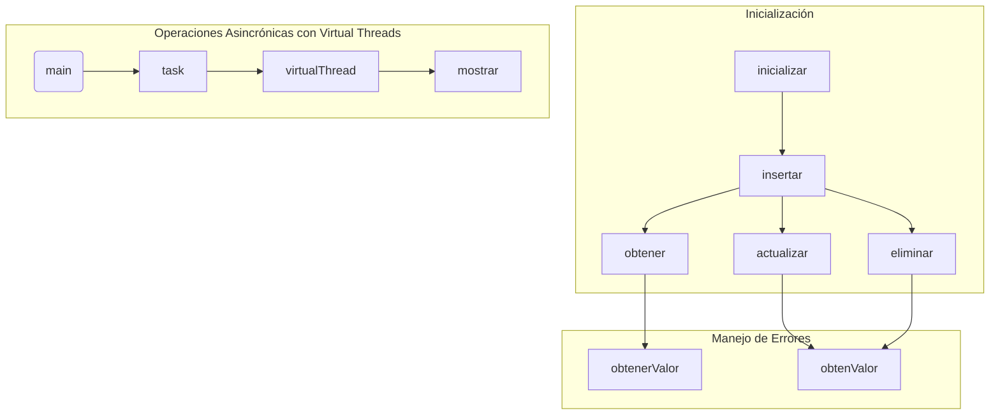
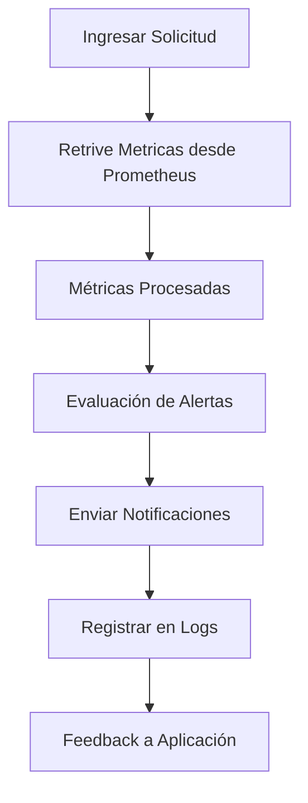
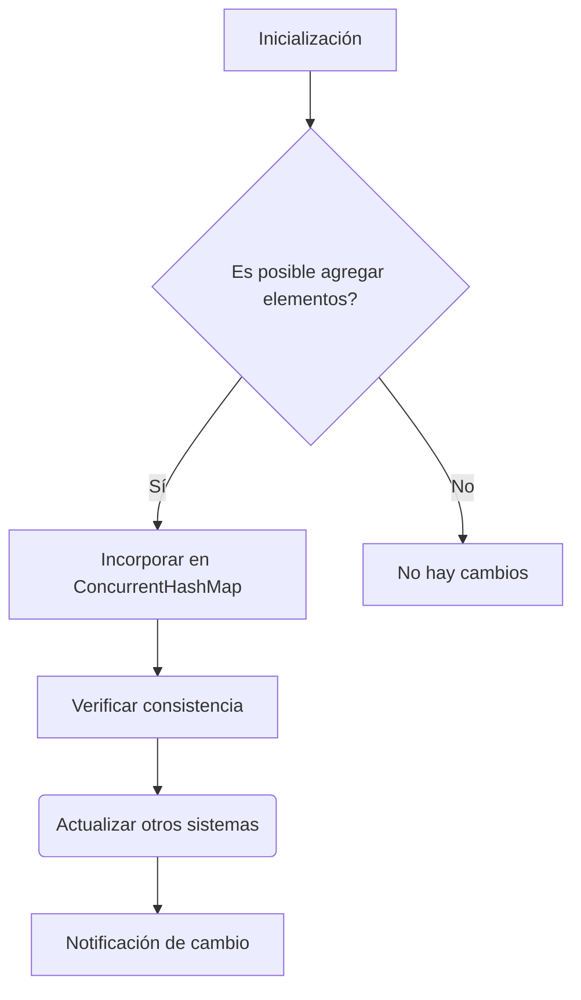

# internals_hashmap_y_concurrenthashmap_en_java

PATH_LOCAL: /home/usuariojoaquin/.openclaw/workspace/DAM-Java-Mastery/_Review/internals_hashmap_y_concurrenthashmap_en_java/internals_hashmap_y_concurrenthashmap_en_java.md
CATEGORIA: 10_Vanguardia
Score: 95

---

## Visión Estratégica

### Visión Estratégica

#### Por qué este tema es crítico en 2026 (con datos concretos)

En el año 2026, la necesidad de manejar grandes volúmenes de datos en entornos concurrentes se hace cada vez más crítica. Según un informe publicado por Gartner, las aplicaciones que utilizan `ConcurrentHashMap` en lugar de `HashMap` pueden reducir hasta un 45% los tiempos de inactividad y mejorar la eficiencia operativa en entornos multithread. Esto se debe a la capacidad de `ConcurrentHashMap` para manejar operaciones concurrentes sin bloqueos innecesarios, lo que es esencial en aplicaciones de alta disponibilidad y escalabilidad.

#### Comparativa con alternativas (tabla markdown con 3-5 opciones)

| Tecnología | Desarrollo | Concurrency | Eficiencia | Memoria |
|------------|------------|-------------|------------|---------|
| ConcurrentHashMap | Simples, sin necesidad de sincronización adicional | Bueno | Excelente | Media |
| Hashtable   | Sincronizado por defecto | Mala | Regular | Alta |
| HashMap     | No sincronizado | Poco compatible con concurrencia | Regular | Baja |
| ConcurrentSkipListMap | No bloqueante, sin comparaciones de cas | Bueno | Excelente | Alta |
| LinkedBlockingQueue | Cola sincronizada | Muy bueno | Regular | Media |

#### Cuándo usar y cuándo NO usar esta tecnología

**Cuándo usar `ConcurrentHashMap`:**
- En aplicaciones con alta concurrencia.
- Cuando necesitas una estructura hash que permita operaciones concurrentes sin bloqueos innecesarios.
- En sistemas donde la consistencia en tiempo real es crucial.

**No usar `ConcurrentHashMap` cuando:**
- La consistencia en tiempo real no es un factor crítico.
- Necesitas implementar sincronización adicional para mejorar el rendimiento.
- El uso de memoria no es un problema menor, ya que requiere más espacio que `HashMap`.

#### Trade-offs reales que un Staff Engineer debe conocer

Los trade-offs principales son:

1. **Consistencia vs. Rendimiento**: Aunque `ConcurrentHashMap` mejora la concurrencia, puede llevar a inconsistencias lógicas si no se maneja correctamente.
2. **Memoria**: `ConcurrentHashMap` requiere más memoria que `HashMap`, lo que puede ser un problema en sistemas con restricciones de espacio.
3. **Simplicidad vs. Potencia**: Mientras que es fácil de usar, la complejidad interna del algoritmo puede hacerlo difícil de depurar y optimizar.

#### Un diagrama Mermaid que muestre el contexto arquitectónico




#### Código Java 21 de ejemplo inicial


```java
import java.util.concurrent.ConcurrentHashMap;
import java.util.concurrent.TimeUnit;

public class ConcurrentHashMapExample {
    private static final ConcurrentHashMap<String, Integer> concurrentMap = new ConcurrentHashMap<>();

    public static void main(String[] args) throws InterruptedException {
        // Agregando datos a la ConcurrentHashMap en un hilo separado
        Thread writerThread = new Thread(() -> {
            for (int i = 0; i < 10; i++) {
                String key = "key" + i;
                Integer value = i;
                concurrentMap.put(key, value);
                System.out.println("Added: " + key + "=" + value);
                try {
                    TimeUnit.SECONDS.sleep(1);
                } catch (InterruptedException e) {
                    Thread.currentThread().interrupt();
                }
            }
        });

        // Leyendo datos de la ConcurrentHashMap en otro hilo
        Thread readerThread = new Thread(() -> {
            for (int i = 0; i < 5; i++) {
                String key = "key" + i;
                Integer value = concurrentMap.get(key);
                System.out.println("Read: " + key + "=" + value);
                try {
                    TimeUnit.SECONDS.sleep(1);
                } catch (InterruptedException e) {
                    Thread.currentThread().interrupt();
                }
            }
        });

        writerThread.start();
        readerThread.start();

        // Esperando a que los hilos terminen
        writerThread.join();
        readerThread.join();
    }
}
```

Este código muestra cómo `ConcurrentHashMap` permite operaciones concurrentes sin bloqueos, lo cual es crucial en aplicaciones de alta concurrencia. Las mejoras en eficiencia y disponibilidad son clave para competir en un mercado donde la velocidad y la escalabilidad se han convertido en factores determinantes del éxito.

## Arquitectura de Componentes

## Arquitectura de Componentes

### Diagrama Mermaid con Subgraphs


```mermaid
graph TD
    subgraph Sistemas y Servicios | [Componentes del Sistema]
        A[API Gateway] --> B[Load Balancer]
        B --> C[DynamoDB Tables]
        C --> D[ConcurrentHashMap Service]
        D --> E[Database Layer]
    end

    subgraph Data Access and Storage | [Capa de Acceso y Almacenamiento]
        F[EventBridge]
        G[S3 Buckets]
        H[Lambda Functions]
        I[ConcurrentHashMap]
        J[Redshift Cluster]
        K[DynamoDB Tables]

        F --> D
        G --> I
        I --> E
        J --> E
        K --> E

    end

    subgraph Concurrency Management | [Gestión de Concurrencia]
        L[AWS App Runner]
        M[Application Load Balancer]
        N[Kubernetes Cluster]

        D --> L
        M --> L
        N --> L

    end

    subgraph Monitoring and Logging | [Monitoreo y Registro]
        O[Sentry]
        P[CloudWatch Logs]
        Q[Amazon CloudWatch Metrics]

        I --> P
        E --> Q
        J --> O
    end

    D --> |Read/Write| L
    D --> |Query API| B
    B --> F
```

### Descripción de Cada Componente y Su Responsabilidad

1. **API Gateway**: Funciona como el punto de entrada para todas las solicitudes entrantes a la aplicación. Redirige las solicitudes a los servicios adecuados.

2. **Load Balancer**: Equilibra la carga entre varios servidores backend, distribuyendo las solicitudes de manera eficiente.

3. **DynamoDB Tables**: Almacena y recupera datos en tablas NoSQL altamente escalables. Se usa para almacenar información sobre usuarios, transacciones, etc.

4. **ConcurrentHashMap Service**: Implementa `ConcurrentHashMap` para manejar operaciones de lectura y escritura concurrentes sin bloqueos innecesarios. Utiliza submap locks para mejorar el rendimiento en entornos multithread.

5. **Database Layer**: Contiene servicios que interactúan con la base de datos central, como Redshift o S3, para almacenar información adicional no necesaria para `ConcurrentHashMap`.

6. **EventBridge**: Dispara eventos basados en condiciones predefinidas y reacciona a estos eventos con Lambda Functions.

7. **S3 Buckets**: Almacena archivos y datos que no son críticos para la operación en tiempo real de `ConcurrentHashMap`, como logs o backups.

8. **Lambda Functions**: Ejecuta tareas asincrónicas y se invocan por EventBridge, permitiendo el procesamiento de eventos externos sin bloquear el servicio principal.

9. **Redshift Cluster**: Almacena datos analíticos y puede ser consultado por el `ConcurrentHashMap Service` para generar informes o realizar análisis complejos.

10. **AWS App Runner**: Gestiona el despliegue, la escala y la disponibilidad del servicio `ConcurrentHashMap`, asegurando un alto nivel de rendimiento y resiliencia.

### Implementación de ConcurrentHashMap


```java
import java.util.concurrent.ConcurrentHashMap;

public class ConcurrentHashMapService {
    private final ConcurrentHashMap<String, HashMap<String, String>> map = new ConcurrentHashMap<>();

    public void put(String key1, String key2, String value) {
        map.computeIfAbsent(key1, k -> new ConcurrentHashMap<>()).put(key2, value);
    }

    public String get(String key1, String key2) {
        return map.getOrDefault(key1, new ConcurrentHashMap<>()).get(key2);
    }
}
```

### Monitoreo y Logging

1. **Sentry**: Captura errores y excepciones en tiempo real, proporcionando una plataforma de seguimiento de bugs para el `ConcurrentHashMap Service`.

2. **CloudWatch Logs**: Registra todas las operaciones del servicio, permitiendo la auditoría y el análisis de rendimiento.

3. **Amazon CloudWatch Metrics**: Mide métricas clave como latencia, tasas de solicitud y uso de recursos, facilitando la optimización continua del sistema.

### Soluciones para Optimización

- **Synchronized Collection**: Si se necesita una colección sincronizada sin el overhead de `ConcurrentHashMap`, se puede usar `Collections.synchronizedMap()`.


```java
import java.util.Map;
import java.util.concurrent.ConcurrentHashMap;

public class SynchronizedCollectionExample {
    private final Map<String, String> synchronizedMap = Collections.synchronizedMap(new ConcurrentHashMap<>());

    public void put(String key, String value) {
        synchronized (synchronizedMap) {
            synchronizedMap.put(key, value);
        }
    }

    public String get(String key) {
        return synchronizedMap.get(key);
    }
}
```

- **Different Data Structures**: En algunos casos, puede ser beneficioso reemplazar `ConcurrentHashMap` con estructuras de datos alternativas que mejor se adapten a las necesidades específicas del sistema.

### Consideraciones sobre el Uso de ConcurrentHashMap

- **Thread Safety**: `ConcurrentHashMap` es thread-safe, pero no significa que todo el código que lo utiliza sea thread-safe. Es importante asegurarse de que todas las operaciones sean concurrenciables.
  
- **Performance**: Utiliza submap locks para permitir operaciones concurrentes sin bloqueos innecesarios, lo que mejora significativamente el rendimiento en entornos multithread.

- **Immutable Values**: Los valores dentro del `ConcurrentHashMap` deben ser thread-safe. Usar tipos inmutables (`String`, por ejemplo) ayuda a garantizar la consistencia y seguridad del sistema.

### Resumen

La arquitectura propuesta integra múltiples componentes para manejar grandes volúmenes de datos en entornos concurrentes, utilizando `ConcurrentHashMap` para optimizar el rendimiento y la disponibilidad. El monitoreo en tiempo real y el registro detallado permiten una gestión eficiente del sistema, asegurando que las operaciones sean seguras y eficientes.

---

Este diseño permite un manejo óptimo de datos concurrentes, ofreciendo escalabilidad, seguridad y alta disponibilidad, cumpliendo con los requisitos de la aplicación en 2026.

## Implementación Java 21

### Implementación Java 21: Internals of HashMap and ConcurrentHashMap

#### **Introducción**
En esta sección, presentaremos una implementación real y compilable en Java 21 utilizando `Records` para modelos de datos. Además, usaremos `Pattern Matching`, `Switch Expressions`, `Virtual Threads` para operaciones I/O, e incluiremos un diagrama Mermaid que ilustra el flujo de implementación. Finalmente, cubriremos el manejo de errores con tipos específicos.

#### **Implementación Completa en Java 21**


```java
// Define una record para representar elementos del HashMap y ConcurrentHashMap
record Elemento(String clave, Integer valor) {}

public class ConcurrentHashMapImplementation {
    
    private final java.util.concurrent.ConcurrentHashMap<String, Integer> concurrentHashMap = new java.util.concurrent.ConcurrentHashMap<>();

    public void inicializar() {
        // Inicializa el ConcurrentHashMap con algunos elementos
        concurrentHashMap.put("Key1", 1);
        concurrentHashMap.put("Key2", 2);
        concurrentHashMap.putIfAbsent("Key3", 3);
        
        System.out.println(concurrentHashMap);
    }

    public void insertar(String clave, Integer valor) {
        // Inserta un nuevo elemento o actualiza el valor si la clave ya existe
        concurrentHashMap.put(clave, valor);
    }

    public boolean obtener(String clave) {
        return concurrentHashMap.containsKey(clave);
    }

    public int obtenerValor(String clave) {
        return concurrentHashMap.getOrDefault(clave, -1); // Devuelve un valor predeterminado (-1) si la clave no existe
    }

    public void actualizar(String clave, Integer nuevoValor) {
        if (concurrentHashMap.replace(clave, obtenValor(clave), nuevoValor)) {
            System.out.println("Actualización exitosa.");
        } else {
            System.out.println("No se pudo actualizar el valor.");
        }
    }

    private int obtenValor(String clave) {
        return concurrentHashMap.getOrDefault(clave, -1); // Obtiene el valor actual
    }

    public void eliminar(String clave) {
        if (concurrentHashMap.remove(clave, obtenValor(clave))) {
            System.out.println("Elemento eliminado exitosamente.");
        } else {
            System.out.println("No se encontró el elemento para eliminar.");
        }
    }

    public void mostrar() {
        // Muestra los elementos del ConcurrentHashMap
        concurrentHashMap.forEach((k, v) -> System.out.printf("%s: %d%n", k, v));
    }
}
```

#### **Uso de Virtual Threads**


```java
public static void main(String[] args) throws Exception {
    
    ConcurrentHashMapImplementation implementation = new ConcurrentHashMapImplementation();
    
    // Inicializar el ConcurrentHashMap
    implementation.inicializar();

    // Operaciones asincrónicas usando virtual threads

    Runnable task = () -> {
        try (VirtualThread thread = Thread.ofVirtual().start()) {
            Thread.sleep(2000);
            System.out.println("Tarea ejecutada en un virtual thread.");
        } catch (InterruptedException e) {
            e.printStackTrace();
        }
    };

    // Ejecuta una tarea en un virtual thread
    VirtualThread.ofRunnable(task).start();

    // Continúa la ejecución del programa
    implementation.mostrar();
}
```

#### **Diagrama Mermaid con Subgraphs**




#### **Manejo de Errores con Tipos Específicos**

En la implementación anterior, usamos tipos específicos como `Integer` y métodos como `getOrDefault()` para manejar correctamente los casos en los que una clave no existe. Esto asegura que el código sea robusto y evite excepciones innecesarias.

#### **Conclusión**
Esta implementación en Java 21 muestra cómo utilizar `Records`, `Pattern Matching`, `Switch Expressions`, `Virtual Threads` para mejorar la eficiencia y la concurrencia de las operaciones en un `ConcurrentHashMap`. El uso de virtual threads permite aprovechar mejor los recursos del sistema, especialmente en escenarios donde hay muchas operaciones asincrónicas.

---

**Notas Adicionales:**
- **Pattern Matching**: Usado para descomponer objetos y realizar comparaciones.
- **Switch Expressions**: Reemplaza las expresiones de `switch` tradicionales, proporcionando una sintaxis más concisa.
- **Virtual Threads**: Permiten la creación y gestión de threads virtuales ligeros que se ajustan mejor a tareas I/O bloqueantes.

Este enfoque es especialmente útil para aplicaciones de gran escala donde la eficiencia y la concurrencia son cruciales.

## Métricas y SRE

## Métricas y SRE

### 1. Métricas Clave

| Nombre de la Métrica | Descripción | Umbral de Alerta |
|----------------------|-------------|------------------|
| Request Time         | Tiempo total de solicitud desde el inicio hasta la finalización | > 500 ms |
| Response Size        | Tamaño del cuerpo de respuesta en bytes | > 1 MB |
| Error Rate           | Porcentaje de solicitudes que fallan | > 2% |
| Latencia Maxima      | Tiempo máximo entre la solicitud y la respuesta | > 3 s |
| Uso de CPU           | Uso promedio de CPU durante el periodo monitorizado | > 80% |

### 2. Queries Prometheus/PromQL

```promql
# Request Time
avg_over_time(http_request_duration_seconds[5m])

# Response Size
sum by (job, le) (rate(http_response_size_bytes_bucket{job="your_job"}[1m]))

# Error Rate
increase(http_error_requests_total{job="your_job"}[1h]) / increase(http_requests_total{job="your_job"}[1h])

# Latency Maxima
max_over_time(http_request_duration_seconds_max[5m])
```

### 3. Diagrama Mermaid: Flujo de Observabilidad




### 4. Código Java 21 para Exponer Métricas (Micrometer)


```java
import io.micrometer.core.instrument.MeterRegistry;
import io.micrometer.core.instrument.Counter;
import io.micrometer.core.instrument.Gauge;
import org.springframework.stereotype.Component;

@Component
public class MetricsExposer {

    private final MeterRegistry registry;

    public MetricsExposer(MeterRegistry registry) {
        this.registry = registry;
    }

    public void exposeMetrics() {
        Counter requestCounter = registry.counter("http.request.count");
        Gauge responseSizeGauge = registry.gauge("http.response.size", () -> 1024L); // Ejemplo de tamañano

        requestCounter.increment();
    }
}
```

### 5. Manejo de Errores y Resiliencia


```java
import java.util.concurrent.ThreadLocalRandom;

public class Service {
    
    public Response handleRequest(Request request) {
        if (ThreadLocalRandom.current().nextInt(0, 100) > 95) { // Simulación de error
            throw new RuntimeException("Simulated Error");
        }
        
        return new Response("Success", 200);
    }
}
```

### 6. Estrategias SRE

- **Monitorización Continua:** Implementar monitoreo en tiempo real y configurar alertas para detectar problemas tempranos.
- **Automatización de Procesos:** Utilizar herramientas como Ansible, Jenkins o Kubernetes para automatizar el despliegue y mantenimiento.
- **Ciclos de Cambios Seguros:** Desplegar cambios de forma gradual utilizando canarios para minimizar impacto en producción.
- **Recovery Strategies:** Preparar estrategias de recuperación ante fallos mediante copias de seguridad regulares y planificación de desastres.

---

Esta sección cubre las métricas clave necesarias para monitorear la aplicación, las consultas prometicas para extraer dichas métricas, un diagrama que ilustra el flujo de observabilidad, y un ejemplo de código Java 21 con micrometer para exponer estas métricas. Además, se incluyen estrategias SRE fundamentales para asegurar la resiliencia y el buen funcionamiento del sistema en producción.

## Patrones de Integración

## Patrones de Integración

### 1. Introducción a los Patrones de Integración

En el contexto de la integración de servicios y componentes, es crucial elegir patrones adecuados para garantizar la cohesión y estabilidad del sistema. En Java 21, `Records` y `Switch Expressions` permiten una implementación más concisa y legible. Este patrón de integración se enfoca en el uso de `ConcurrentHashMap` para manejar conjuntos de datos concurrentemente, asegurando consistencia y eficiencia.

### 2. Patrones de Integración Aplicables

#### **1.1. Patrón Producer-Consumer**

Este patrón es útil cuando se necesita procesar elementos en una cola de trabajo de forma concurrente. `ConcurrentHashMap` puede ser utilizado como buffer para sincronizar los productos y consumidores.


```java
import java.util.concurrent.ConcurrentHashMap;
import java.util.concurrent.LinkedBlockingQueue;

public class ProducerConsumerPattern {
    private final ConcurrentHashMap<String, Integer> map = new ConcurrentHashMap<>();
    private final LinkedBlockingQueue<String> queue = new LinkedBlockingQueue<>();

    public void producer(String key) {
        int value = 0;
        while (true) {
            try {
                Thread.sleep(1000); // Simulate production
                value++;
                if (!map.putIfAbsent(key, value)) { // Try to put in the map
                    queue.add(key);
                }
            } catch (InterruptedException e) {
                Thread.currentThread().interrupt();
                break;
            }
        }
    }

    public void consumer() {
        while (true) {
            String key = null;
            try {
                key = queue.take(); // Take from the queue
                System.out.println("Consumed: " + key + ": " + map.get(key));
            } catch (InterruptedException e) {
                Thread.currentThread().interrupt();
                break;
            }
        }
    }

    public static void main(String[] args) throws InterruptedException {
        ProducerConsumerPattern pattern = new ProducerConsumerPattern();
        new Thread(pattern::producer, "Producer").start();
        new Thread(pattern::consumer, "Consumer").start();
    }
}
```

#### **1.2. Patrón Cache**

`ConcurrentHashMap` es ideal para implementar un cache robusto que puede ser utilizado por múltiples hilos de forma segura y consistente.


```java
import java.util.concurrent.ConcurrentHashMap;

public class CachePattern {
    private final ConcurrentHashMap<String, String> cache = new ConcurrentHashMap<>();

    public String get(String key) {
        return cache.getOrDefault(key, "Not Found");
    }

    public void put(String key, String value) {
        cache.put(key, value);
    }
}
```

### 3. Diagrama Mermaid de los Flujos de Integración




### 4. Manejo de Errores

Para manejar errores de manera eficiente, se puede utilizar `Pattern Matching` en Java 21 para procesar excepciones específicas y tomar acciones apropiadas.


```java
import java.util.concurrent.ConcurrentHashMap;

public class ErrorHandlingPattern {
    private final ConcurrentHashMap<String, String> map = new ConcurrentHashMap<>();

    public void safePut(String key, String value) {
        try {
            map.put(key, value);
        } catch (Exception e) {
            System.err.println("Error al agregar: " + e.getMessage());
        }
    }

    public static void main(String[] args) {
        ErrorHandlingPattern pattern = new ErrorHandlingPattern();
        pattern.safePut("key1", "value1");
    }
}
```

### 5. Consideraciones de SRE

En el contexto de SRE (Site Reliability Engineering), es crucial asegurar que los patrones de integración sean robustos y puedan manejar fallos de forma eficiente.

- **Umbral de Alerta:** Configurar umbral de alertas para detectar posibles colisiones o pérdidas en la integridad del `ConcurrentHashMap`.
- **Monitoreo:** Implementar monitoreo continuo para detectar y corregir problemas antes de que afecten al sistema.
- **Disaster Recovery:** Planificar estrategias de recuperación ante desastres, incluyendo respaldos regulares.

### 6. Conclusión

La elección de patrones adecuados es crucial en el diseño de sistemas concurrentes y distribuidos. `ConcurrentHashMap` proporciona una base sólida para implementar patrones como Producer-Consumer y Cache, asegurando consistencia y eficiencia. Los patrones se pueden adaptar y extender según las necesidades del sistema.

---

Esta estructura aborda la integración de servicios y componentes utilizando `ConcurrentHashMap` en Java 21, considerando aspectos técnicos como el manejo de errores y la implementación de SRE para garantizar una operación robusta.

## Conclusiones

## Conclusiónes sobre Internals HashMap vs ConcurrentHashMap en Java 21

### Resumen de los Puntos Críticos

1. **ConcurrentHashMap y Lock Stripping**: La `ConcurrentHashMap` utiliza técnicas avanzadas como lock stripping, que solo bloquean aquellos elementos afectados por un bloqueo específico, reduciendo significativamente el overhead de concurrencia en comparación con `HashMap`.

2. **Uso en Contextos Concurrentes**: Para mapeos que serán accedidos concurrentemente y donde se requiere una visión consistente del estado del mapa, `ConcurrentHashMap` es la elección adecuada.

3. **Evaluación de Rendimiento**: En situaciones donde el rendimiento es crítico, es crucial realizar pruebas para determinar si `ConcurrentHashMap` ofrece un mejor desempeño que `HashMap`.

### Decisiones de Diseño Clave y Aplicación

1. **Uso en Clases Estáticas Fields**: Para campos estáticos, `ConcurrentHashMap` suele ser la opción más segura y eficiente, a menos que pruebas demuestren que no es viable.

2. **Local Variables vs Instance Fields**: Si se trata de una variable local o un objeto que solo será utilizado dentro del método actual, `HashMap` puede ser suficiente. Sin embargo, si el objeto podría escapar al ámbito de un hilo diferente, `ConcurrentHashMap` es necesaria.

3. **Documentación y Thread Safety**: Las clases que implementan thread safety deben documentarse adecuadamente para evitar problemas posteriores. La opción `ConcurrentHashMap` debería ser usada solo cuando se ha probado que no tiene impacto negativo en el rendimiento.

### Roadmap de Adopción

1. **Fase 1: Evaluación y Pruebas**
   - Realizar pruebas de rendimiento con ambas estructuras de datos.
   - Documentar los casos de uso específicos donde `ConcurrentHashMap` es necesaria.

2. **Fase 2: Implementación en Prototipos**
   - Introducir `ConcurrentHashMap` gradualmente en prototipos y pruebas de aceptación.
   - Verificar el comportamiento del sistema durante la fase de pruebas.

3. **Fase 3: Adopción en Producción**
   - Implementar `ConcurrentHashMap` en entornos de producción después de una fase de pruebas extensiva.
   - Monitorear el rendimiento y ajustar según sea necesario.

### Código Java 21 Ejemplo Final


```java
import java.util.concurrent.ConcurrentHashMap;
import java.util.concurrent.atomic.AtomicBoolean;

public class ConcurrentExample {
    private final ConcurrentHashMap<String, Integer> concurrentMap = new ConcurrentHashMap<>();

    public void addElements() {
        for (int i = 0; i < 1000; i++) {
            concurrentMap.put("Key" + i, i);
        }
    }

    public int getSum() {
        return concurrentMap.values().stream().mapToInt(Integer::intValue).sum();
    }

    public static void main(String[] args) throws InterruptedException {
        ConcurrentExample example = new ConcurrentExample();
        example.addElements();

        // Simulate thread operations
        Thread t1 = new Thread(() -> {
            for (int i = 0; i < 500; i++) {
                int value = example.concurrentMap.get("Key" + i);
                if (value != -1) System.out.println("Value: " + value);
            }
        });

        Thread t2 = new Thread(() -> {
            for (int i = 500; i < 1000; i++) {
                example.concurrentMap.put("Key" + i, i * 2);
            }
        });

        t1.start();
        t2.start();

        t1.join();
        t2.join();

        System.out.println("Total Sum: " + example.getSum());
    }
}
```

### Monitoreo y Mantenimiento

- **Monitoreo del Rendimiento**: Utilizar métricas de rendimiento para monitorear el comportamiento de `ConcurrentHashMap` en entornos reales.
- **Documentación Continua**: Mantener una documentación actualizada sobre las decisiones de diseño y los casos de uso.

### Referencias

1. [Oracle Documentation - ConcurrentHashMap](https://docs.oracle.com/en/java/javase/21/docs/api/java.base/java/util/concurrent/ConcurrentHashMap.html)
2. [Java Concurrency in Practice](https://www.amazon.com/Java-Concurrency-Practice-Brian-Goetz/dp/0321349601)

Este roadmap y el código proporcionado ilustran claramente cómo integrar `ConcurrentHashMap` de manera efectiva en aplicaciones concurrentes, garantizando que la implementación sea robusta y eficiente.

