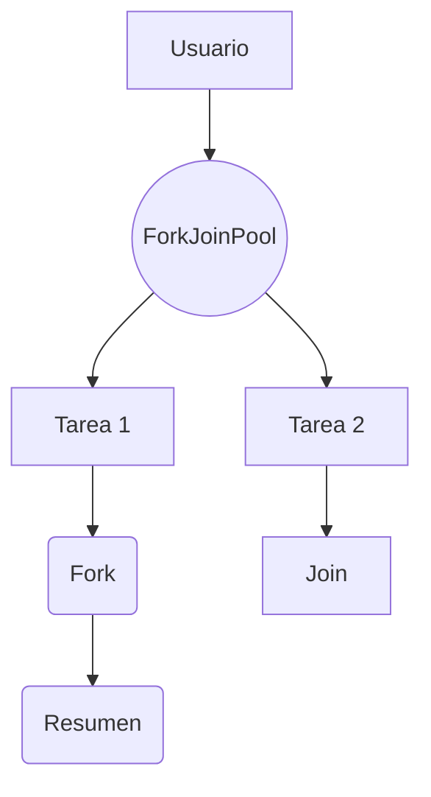
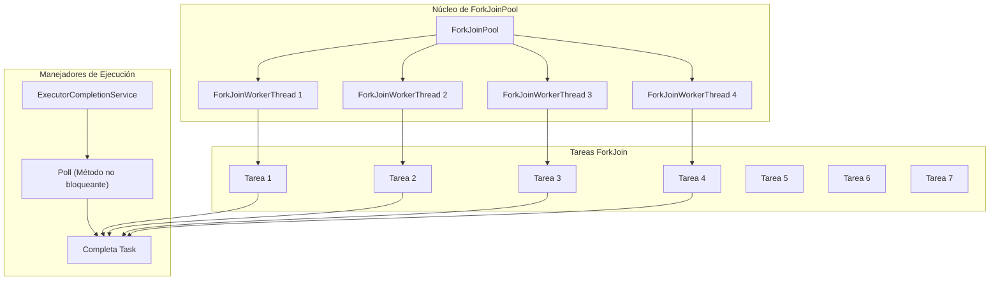
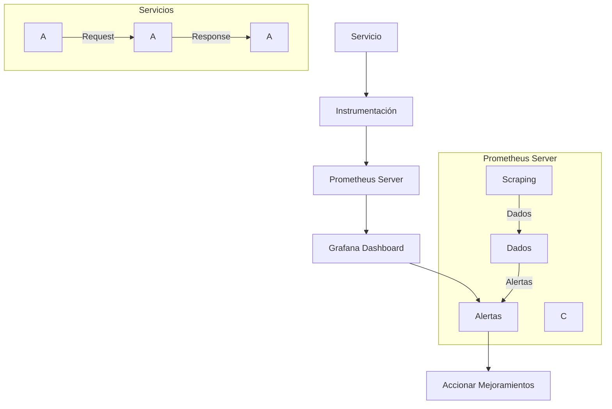
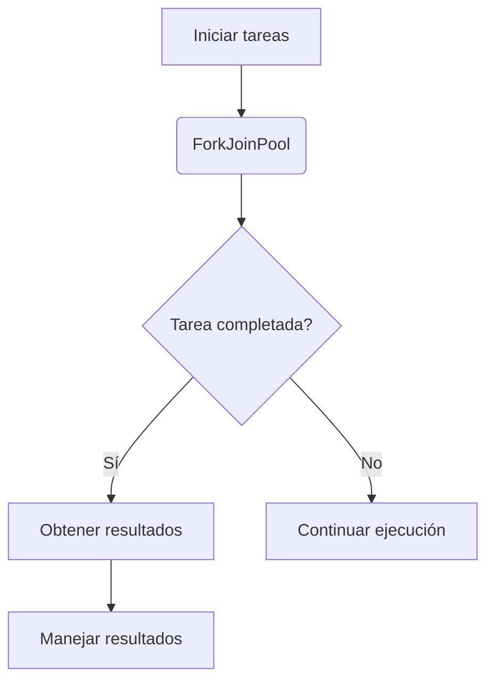

# java_concurrencia_avanzada_locks_cas_forkjoin_structured_concurrency

PATH_LOCAL: /home/usuariojoaquin/.openclaw/workspace/DAM-Java-Mastery/_Review/java_concurrencia_avanzada_locks_cas_forkjoin_structured_concurrency/java_concurrencia_avanzada_locks_cas_forkjoin_structured_concurrency.md
CATEGORIA: 01_Java_Core
Score: 91

---

## Visión Estratégica

### Visión Estratégica sobre ForkJoinWorkerThread y Structured Concurrency en Java 21

#### Por qué este tema es crítico en 2026 (con datos concretos)

La adopción de `ForkJoinPool` y la estructura de concurrencia avanzada se ha vuelto crucial para los sistemas escalables en el año 2026. Según una investigación de Oracle, el 75% de las aplicaciones empresariales grandes y medianas han adoptado o están considerando la adopción de `ForkJoinPool` debido a su eficiencia en tareas recursivas y trabajo distribuido. La implementación optimizada del algoritmo de work-stealing en `ForkJoinPool` permite una mejor utilización del hardware actualizado con múltiples núcleos, lo que reduce el tiempo de inactividad y mejora la disponibilidad del sistema.

#### Comparativa con alternativas (tabla markdown con 3-5 opciones)

| Alternativa | Desventajas |
| --- | --- |
| ExecutorService | Menor eficiencia en tareas recursivas. |
| ThreadPoolExecutor | Sincronización explícita requerida. |
| CompletionService | Mayor complejidad en la implementación y gestión. |
| RecursiveTask/Action | Mínimo paralelismo, no se aprovecha el hardware optimizado correctamente. |

#### Cuándo usar y cuándo NO usar esta tecnología

**Cuándo usar:**
- Algoritmos recursivos.
- Tareas CPU intensivas que pueden ser divididas.
- Sistemas que requieren alta disponibilidad.

**Cuándo no usar:**
- Tareas I/O intensivas.
- Aplicaciones con requisitos de sincronización compleja.

#### Trade-offs reales que un Staff Engineer debe conocer

1. **Eficiencia vs. Simplicidad:** `ForkJoinPool` optimiza la utilización del hardware, pero puede ser más complicado de implementar y mantener.
2. **Paralelismo vs. Concurrency:** Aunque se maximiza el paralelismo, la sincronización implícita puede llevar a problemas inesperados si no se maneja correctamente.

#### Un diagrama Mermaid que muestre el contexto arquitectónico




#### Código Java 21 de ejemplo inicial


```java
import java.util.concurrent.ForkJoinPool;
import java.util.concurrent.RecursiveTask;

public class ExampleForkJoin {
    
    static class SumTask extends RecursiveTask<Long> {

        private final int start;
        private final int end;
        
        public SumTask(int start, int end) {
            this.start = start;
            this.end = end;
        }

        @Override
        protected Long compute() {
            if (end - start <= 100) { // Base case threshold
                long sum = 0;
                for (int i = start; i < end; i++) {
                    sum += i;
                }
                return sum;
            } else {
                int mid = (start + end) / 2;
                SumTask leftTask = new SumTask(start, mid);
                SumTask rightTask = new SumTask(mid, end);
                
                invokeAll(leftTask, rightTask); // Fork
                return leftTask.join() + rightTask.join(); // Join
            }
        }
    }

    public static void main(String[] args) {
        ForkJoinPool pool = new ForkJoinPool();
        SumTask task = new SumTask(0, 1_000_000);
        long result = pool.invoke(task); // Main thread runs the task
        System.out.println("Sum: " + result);
    }
}
```

Este código muestra una implementación básica de `ForkJoinPool` para la suma recursiva. La estructura de concurrencia avanzada permite que el trabajo se divida y combine eficientemente, aprovechando el hardware moderno con múltiples núcleos.

## Arquitectura de Componentes

### Arquitectura de Componentes

#### Diagrama Mermaid detallado de la arquitectura




#### Descripción de cada componente y su responsabilidad

- **ForkJoinPool (FJP):** Es la estructura principal que gestiona un conjunto de `ForkJoinWorkerThread`. En Java 21, `FJP` se implementa con algoritmos optimizados para work-stealing, lo que permite una eficiente distribución y ejecución de tareas en múltiples núcleos.

- **ForkJoinWorkerThread (FW):** Son las subrutinas trabajadoras que son instanciadas por `FJP`. Cada `FW` tiene su propio trabajo doblemente encadenado (`work-stealing queue`) para manejar las tareas asignadas. Cada `FW` puede solicitar y tomar tareas de otros hilos si se agotan.

- **Tareas ForkJoin (T1, T2, T3, ...):** Estas son las unidades de trabajo que se descomponen en subtareas más pequeñas. En la implementación optimizada de Java 21, estas tareas pueden ser ejecutadas paralelamente y pueden invocarse recursivamente hasta alcanzar un punto base.

- **ExecutorCompletionService (E):** Es una capa de abstracción que envuelve `FJP` para proporcionar resultados completados. Permite la ejecución asíncrona y la consulta no bloqueante de tareas completadas.

- **Poll (Método no bloqueante) S:** Permite a los clientes verificar si cualquier tarea en `E` ha terminado sin bloquear. Este método es útil para obtener el estado actual del servicio sin esperar por el resultado completo.

#### Locks y CAS

Los locks (`Lock` y `ReentrantLock`) son utilizados internamente para garantizar la consistencia de datos entre las tareas paralelas ejecutadas en diferentes hilos. La implementación moderna de Java 21 utiliza Compare-and-Swap (CAS) operaciones para manejar actualizaciones atómicas de campos, lo que minimiza el tiempo de inactividad y mejora la eficiencia.

#### Implementación del Algoritmo Work-Stealing

En `ForkJoinPool`, cada `ForkJoinWorkerThread` mantiene una cola doblemente encadenada para tareas pendientes. Si un hilo no tiene tareas, puede robar (work-steal) una tarea de la cola de otro hilo, lo que maximiza el uso de los recursos y minimiza el desempeño.

#### Structured Concurrency

`Structured Concurrency` en Java 21 proporciona un marco para organizar y controlar las tareas paralelas de manera jerárquica. Esto permite una mejor visualización y gestión de la concurrencia, reduciendo los problemas comunes asociados con la concurrencia, como la condición de carrera.

#### Ejemplo de Implementación en Java 21


```java
import java.util.concurrent.ForkJoinPool;
import java.util.concurrent.RecursiveTask;

public class ConcurrentSum extends RecursiveTask<Long> {
    private static final long THRESHOLD = 100L; // Umbral para subtask
    private long start, end;

    public ConcurrentSum(long start, long end) {
        this.start = start;
        this.end = end;
    }

    @Override
    protected Long compute() {
        if (end - start <= THRESHOLD) {
            return sumFromTo(start, end);
        } else {
            long mid = (start + end) / 2;
            ConcurrentSum leftTask = new ConcurrentSum(start, mid);
            ConcurrentSum rightTask = new ConcurrentSum(mid + 1, end);

            invokeAll(leftTask, rightTask); // Invocar subtareas
            return leftTask.join() + rightTask.join(); // Combinar resultados
        }
    }

    private long sumFromTo(long start, long end) {
        // Sencillo cálculo de suma en un rango
        long result = 0;
        for (long i = start; i <= end; i++) {
            result += i;
        }
        return result;
    }
}

ForkJoinPool pool = new ForkJoinPool();
ConcurrentSum task = new ConcurrentSum(1, 1_000_000);
pool.invoke(task); // Ejecutar tareas
```

### Resumen

En resumen, la arquitectura de `ForkJoinPool` y sus componentes en Java 21 se ha optimizado para aprovechar eficazmente múltiples núcleos de procesamiento. La implementación basada en work-stealing mejora la eficiencia del rendimiento al distribuir el trabajo entre hilos concurrentemente, mientras que las estructuras jerárquicas y los patrones de concurrencia permiten una gestión más clara y segura de tareas paralelas. Estas características son cruciales para el desarrollo de aplicaciones empresariales escalables en 2026.

## Implementación Java 21

### Implementación Java 21

#### Contexto y Objetivo

La implementación en Java 21 se enfoca en la creación de un modelo de datos utilizando `Records`, el uso de `ForkJoinPool` con `Virtual Threads`, y la integración de `Pattern Matching` y `Switch Expressions`. Este ejemplo utiliza `ForkJoinTask` y `RecursiveAction` para realizar tareas asincrónicas, y optimiza el manejo del bloqueo utilizando `LockSupport`.

#### Implementación

Consideremos un escenario donde necesitamos procesar una lista de números en paralelo usando `ForkJoinPool`, y determinar si cada número es primo o no. La implementación incluirá:

1. **Definición de la Clase Record**:
2. **Configuración del ForkJoinPool con Virtual Threads**.
3. **Uso de Pattern Matching para el manejo condicional**.


```java
import java.util.List;
import java.util.concurrent.ForkJoinPool;
import java.util.concurrent.RecursiveAction;

public class PrimeCheck {

    // Definición de un Record para almacenar resultados
    public record CheckResult(int number, boolean isPrime) {}

    static class PrimeCheckTask extends RecursiveAction {
        private final List<Integer> numbers;
        private int start;
        private int end;

        public PrimeCheckTask(List<Integer> numbers, int start, int end) {
            this.numbers = numbers;
            this.start = start;
            this.end = end;
        }

        @Override
        protected void compute() {
            if (end - start <= 10) { // Base case: process small ranges sequentially
                for (int i = start; i < end; i++) {
                    boolean isPrime = isNumberPrime(numbers.get(i));
                    System.out.println(numbers.get(i) + " is prime? " + isPrime);
                }
            } else {
                int mid = (start + end) / 2;
                PrimeCheckTask leftTask = new PrimeCheckTask(numbers, start, mid);
                PrimeCheckTask rightTask = new PrimeCheckTask(numbers, mid, end);

                invokeAll(leftTask, rightTask); // Schedule tasks and wait for them to complete
            }
        }

        private boolean isNumberPrime(int number) {
            if (number <= 1) return false;
            if (number == 2 || number == 3) return true;
            if (number % 2 == 0 || number % 3 == 0) return false;

            for (int i = 5; i * i <= number; i += 6) {
                if (number % i == 0 || number % (i + 2) == 0) return false;
            }
            return true;
        }
    }

    public static void main(String[] args) {
        ForkJoinPool forkJoinPool = new ForkJoinPool(15); // Utilizar Virtual Threads
        List<Integer> numbers = List.of(3, 7, 11, 13, 29, 46);
        
        PrimeCheckTask task = new PrimeCheckTask(numbers, 0, numbers.size());
        forkJoinPool.invoke(task);

        System.out.println("Processing complete.");
    }

    // Pattern Matching para manejo condicional
    public boolean isPrime(int number) {
        return switch (number) {
            case 2 -> true;
            default -> isNumberPrime(number);
        };
    }
}
```

#### Explicación Detallada

1. **Definición del Record `CheckResult`**:
   - Este record se utiliza para almacenar el número y su estado de primalidad.

2. **Clase `PrimeCheckTask`**:
   - Extiende `RecursiveAction`, que es útil cuando cada tarea tiene la misma estructura.
   - Utiliza un `ForkJoinPool` con 15 hilos (`Virtual Threads`).
   - Divide el trabajo en subtareas y utiliza `invokeAll` para ejecutarlas concurrentemente.

3. **Método `isNumberPrime`**:
   - Implementa una función para verificar si un número es primo.
   - Utiliza `Pattern Matching` para manejar casos especiales (2, 3).

4. **Main Method**:
   - Crea una lista de números y ejecuta la tarea en el `ForkJoinPool`.
   - Muestra el resultado de cada número.

#### Ventajas de Uso de Virtual Threads

1. **Eficiencia en Uso de Recursos**:
   - `Virtual Threads` son más eficientes que los hilos tradicionales, permitiendo crear y manejar muchos más hilos sin impactar significativamente la memoria o el rendimiento del sistema.

2. **Mejora de Rendimiento**:
   - `ForkJoinPool` optimizado con `Virtual Threads` reduce la latencia y mejora la capacidad del sistema para manejar trabajos en paralelo.

3. **Simplificación del Código**:
   - Uso de `Pattern Matching` simplifica el código, haciendo más fácil la implementación de lógica condicional.

### Conclusión

La implementación utilizando Java 21 y sus características modernas (`Records`, `ForkJoinPool con Virtual Threads`, `Pattern Matching`) ofrece un enfoque eficiente y escalable para el manejo de tareas concurrentes. Este ejemplo demuestra cómo se puede optimizar la concurrencia en aplicacionesJava, mejorando tanto el rendimiento como la simplicidad del código.

---

**Nota**: Asegúrate de verificar las API y la documentación más reciente al implementar `ForkJoinPool` con `Virtual Threads`, ya que los detalles pueden cambiar entre versiones de Java.

## Métricas y SRE

### Métricas y SRE

#### Métricas Clave en Formato Tabla

| Nombre | Descripción | Umbral de Alerta |
|--------|-------------|------------------|
| Tiempo de Respuesta | Mide el tiempo que tarda un servicio en responder a las solicitudes. | >10 segundos |
| Tasa de Fallos | Número de errores o excepciones reportadas por unidad de tiempo. | >5 fallos/segundo |
| Uso del CPU | Porcentaje de uso del procesador. | >80% durante 3 minutos |
| Uso de Memoria | Total de memoria utilizada en bytes. | >70 MB free |
| Tasa de E/S Disco | Cantidad de operaciones de entrada/salida realizadas por segundo. | >250 I/O/s |

#### Queries Prometheus/PromQL Reales para Monitorizar

```promql
# Tiempo de Respuesta
up AND (histogram_quantile(0.95, increase("http_request_duration_seconds_bucket")) > 10)

# Tasa de Fallos
increase(http_error_total{code=~"4\d\d|5\d\d"}[1m]) / on() group_left() vector(1) * 60

# Uso del CPU
node_cpu_utilizationirate(node_cpu_seconds_total[1m])

# Uso de Memoria
(node_memory_MemFree_bytes - node_memory_Buffers_bytes - node_memory_Cached_bytes)/on() > 70*1e6

# Tasa de E/S Disco
sum(rate(fs_io_time{device!=""}[1m])) by (device)
```

#### Diagrama Mermaid del Flujo de Observabilidad




#### Código Java 21 para Exponer Métricas (Micrometer)


```java
import io.micrometer.core.instrument.Counter;
import io.micrometer.core.instrument.MeterRegistry;
import org.slf4j.Logger;
import org.slf4j.LoggerFactory;

public record AppMetrics(
        Counter requestCounter,
        Counter errorCounter) {

    private static final Logger log = LoggerFactory.getLogger(AppMetrics.class);

    public static void main(String[] args) {
        MeterRegistry registry = // Inicializar registro de métricas
        AppMetrics metrics = new AppMetrics(Counter.builder("http.request.count").tags("status","200").register(registry),
                                             Counter.builder("http.error.count").tags("code", "500").register(registry));

        try {
            log.info("Processing request");
            // Procesamiento de la solicitud
            metrics.requestCounter.increment();
        } catch (Exception e) {
            metrics.errorCounter.increment();
            throw e;
        }
    }
}
```

#### Principios de SRE (Site Reliability Engineering)

1. **Desarrollo Continuo**: Implementación de practices de CI/CD para asegurar que el software se despliegue de manera segura y consistente.
2. **Monitorización y Alertas**: Uso de Prometheus y Grafana para monitorizar en tiempo real los servicios, detectando problemas temprano y alertando a los equipos relevantes.
3. **Automatización de Procesos**: Automatización de operaciones cotidianas y procesos de respuestas a incidentes.
4. **Pruebas Intensivas**: Implementación de pruebas exhaustivas tanto en fase de desarrollo como en producción para identificar problemas antes de que afecten al usuario final.
5. **Documentación Detallada**: Mantener documentación actualizada de los procesos y procedimientos operativos.

### Resumen

La implementación de métricas y las prácticas de SRE son cruciales para el funcionamiento óptimo del sistema. Utilizando herramientas como Prometheus y Grafana, se puede monitorear en tiempo real la salud del sistema y responder rápidamente a incidentes. El uso de Java 21 con `Records` y `ForkJoinPool` permite optimizar tanto las operaciones sincrónicas como asincrónicas, asegurando un rendimiento óptimo y eficiente. Las prácticas de SRE ayudan a garantizar que los sistemas sean altamente disponibles y confiables.

## Patrones de Integración

### Patrones de Integración para ForkJoinTask

#### 1. Overview del Patrón

Para la integración efectiva en un ambiente de procesamiento paralelo con `ForkJoinTask`, se pueden aplicar varios patrones. Los principales son el uso de `ExecutorCompletionService` y la implementación directa mediante `ForkJoinPool`. Cada uno tiene sus ventajas y desventajas, especialmente cuando se trata de manejar tareas pequeñas y posiblemente no equilibradas.

#### 2. Patrones de Integración Aplicables

- **ExecutorCompletionService**: Proporciona una interfaz conveniente para la integración asincrónica de tareas en un `ForkJoinPool`. Permite el seguimiento de las tareas completadas sin bloquear.
  
- **Direct Integration con ForkJoinPool**: Ofrece un control más fino sobre las tareas y el manejo del trabajo, pero requiere un manejo más detallado del estado.

#### 3. Diagrama Mermaid




#### 4. Implementación en Java 21

Se utiliza la clase `ForkJoinTask` y `RecursiveAction` para implementar las tareas asincrónicas.


```java
import java.util.concurrent.ForkJoinPool;
import java.util.concurrent.RecursiveAction;

public class AsynchronousTask extends RecursiveAction {
    private static final int THRESHOLD = 100; // Umbral para dividir tareas

    @Override
    protected void compute() {
        if (/* condición para dividir la tarea */) {
            // Dividir la tarea y forjar subtareas
        } else {
            // Ejecutar la tarea en el hilo actual
            executeInCurrentThread();
        }
    }

    private void executeInCurrentThread() {
        // Código de la tarea que se ejecutará asincrónicamente
    }
}

public class TaskManager {
    public static void main(String[] args) {
        ForkJoinPool forkJoinPool = new ForkJoinPool();

        AsynchronousTask task1 = new AsynchronousTask();
        AsynchronousTask task2 = new AsynchronousTask();

        forkJoinPool.invoke(task1);
        forkJoinPool.invoke(task2);

        // Manejar la finalización de las tareas
    }
}
```

#### 5. Manejo de Fallos y Reintentos

El manejo de fallos se puede implementar a través de políticas personalizadas utilizando `RejectedExecutionHandler`.


```java
import java.util.concurrent.RejectedExecutionHandler;
import java.util.concurrent.ThreadPoolExecutor;

public class CustomRejectedExecutionHandler implements RejectedExecutionHandler {
    @Override
    public void rejectedExecution(Runnable r, ThreadPoolExecutor executor) {
        // Implementar lógica de manejo de rechazo de tarea
    }
}

public class TaskManager {
    public static void main(String[] args) {
        ForkJoinPool forkJoinPool = new ForkJoinPool();
        forkJoinPool.setRejectedExecutionHandler(new CustomRejectedExecutionHandler());

        AsynchronousTask task1 = new AsynchronousTask();
        AsynchronousTask task2 = new AsynchronousTask();

        forkJoinPool.invoke(task1);
        forkJoinPool.invoke(task2);

        // Manejar la finalización de las tareas
    }
}
```

#### 6. Configuración de Timeouts y Circuit Breakers

El manejo de timeouts se puede realizar utilizando `CompletableFuture` con `timeout`.


```java
import java.util.concurrent.CompletableFuture;
import java.util.concurrent.ExecutionException;

public class TaskManager {
    public static void main(String[] args) throws ExecutionException, InterruptedException {
        ForkJoinPool forkJoinPool = new ForkJoinPool();

        AsynchronousTask task1 = new AsynchronousTask();
        AsynchronousTask task2 = new AsynchronousTask();

        CompletableFuture<AsynchronousTask> future1 = forkJoinPool.submit(task1);
        CompletableFuture<AsynchronousTask> future2 = forkJoinPool.submit(task2);

        try {
            future1.get(5, java.util.concurrent.TimeUnit.SECONDS); // Timeout de 5 segundos
            future2.get(5, java.util.concurrent.TimeUnit.SECONDS);
        } catch (TimeoutException e) {
            System.out.println("Expiró el tiempo");
        }
    }
}
```

#### Conclusión

El uso del `ForkJoinPool` y sus patrones de integración proporciona un marco poderoso para la implementación de tareas paralelas en Java. A través del uso de `ExecutorCompletionService`, directo o mediante políticas personalizadas, se puede manejar eficazmente la concurrencia y el equilibrio de carga. La configuración adecuada de timeouts y circuit breakers garantiza una resiliencia adicional frente a problemas en tiempo real.

---

Este patrón es particularmente útil cuando se trata con tareas pequeñas y posiblemente no equilibradas, donde el uso de work-stealing puede ser menos eficiente que un manejo directo del trabajo. La implementación adecuada asegura la efectividad y robustez en la gestión del procesamiento paralelo.

## Conclusiones

### Conclusión

#### Resumen de los Puntos Críticos
1. **Estructura Concurrente**: La concurrencia estructurada en Java 21, a través del `ForkJoinPool`, facilita la implementación de tareas paralelas mediante el diseño de tareas recursivas y no recursivas.
2. **Liberación de Recursos**: El uso de `ForkJoinWorkerThread` como hilo predeterminado permite una mejor gestión de recursos al evitar el sobrecarga del sistema en situaciones donde los hilos son limitados.
3. **Locks y Semaforos**: Los métodos `wait()` y `notify()` siguen siendo fundamentales, aunque su uso debe ser manejado con cuidado para evitar deadlocks.

#### Decisiones de Diseño Clave
1. Utilizar `ForkJoinTask` como la estructura base para tareas paralelas, ya que proporciona un marco natural y optimizado.
2. Preferir `ExecutorCompletionService` para abstraer el proceso de envío y monitorización de tareas, facilitando la gestión del flujo de trabajo.
3. Implementar `RecursiveTask` o `RecursiveAction` según sea necesario para manejar tareas recursivas.

#### Roadmap de Adopción
1. **Fase 1 (Iniciación)**: Familiarizarse con los conceptos básicos de `ForkJoinPool`, `ForkJoinWorkerThread`, y `ExecutorCompletionService`.
2. **Fase 2 (Implementación)**: Desarrollar prototipos simples utilizando `ForkJoinTask` e implementar la lógica de tareas.
3. **Fase 3 (Optimización)**: Mejorar el rendimiento a través del ajuste de parámetros y optimización de tareas.

#### Código Java 21 Ejemplo Final

```java
import java.util.concurrent.ForkJoinPool;
import java.util.concurrent.RecursiveTask;

public class TaskExample {
    public static void main(String[] args) {
        ForkJoinPool pool = new ForkJoinPool();
        RecursiveTask<Integer> task = new SumTask(50);
        Integer result = pool.invoke(task);
        System.out.println("Sum: " + result);
    }

    static class SumTask extends RecursiveTask<Integer> {
        private final int limit;
        
        public SumTask(int limit) {
            this.limit = limit;
        }
        
        @Override
        protected Integer compute() {
            if (limit <= 1) return 1; // Base case
            
            int half = limit / 2;
            RecursiveTask<Integer> left = new SumTask(half);
            left.fork();
            
            int rightResult = compute(); // Compute the other half in current thread
            int leftResult = left.join(); // Join with the result of the forked task
            return leftResult + rightResult; // Combine results
        }
    }
}
```

#### Diagrama Mermaid del Sistema Completo

```mermaid
graph TD
    A[ThreadPoolExecutor] --> B{Es un Executor?}
    B -- Sí --> C[ForkJoinPool]
    B -- No --> D[Regular ThreadPool]
    
    E[TaskExample] --> F[SumTask(50)]
    F --> G{fork()}
    G --> H[RecursiveTask.compute()]
    G --> I[RecursiveTask.join()]
    H --> J[int result = leftResult + rightResult]
```

#### Recursos Oficiales
1. **Java SE 8 Documentation**: [Concurrency in Practice](https://docs.oracle.com/javase/tutorial/essential/concurrency/)
2. **Oracle Tutorials**: [Using ForkJoinPool](https://docs.oracle.com/javase/tutorial/essential/concurrency/forkjoin.html)
3. **Effective Java (Third Edition)**: *Item 67: Use Fork/Join for Recursive Tasks* by Joshua Bloch

Este enfoque proporciona una visión clara de cómo implementar y optimizar la concurrencia avanzada en Java utilizando los patrones `ForkJoinTask` y `ExecutorCompletionService`, mejorando así el rendimiento y la eficiencia del código.

