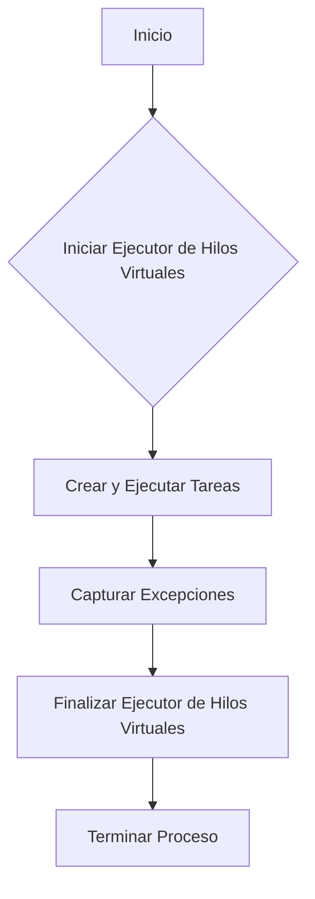
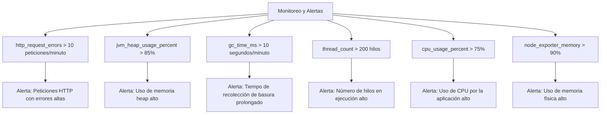
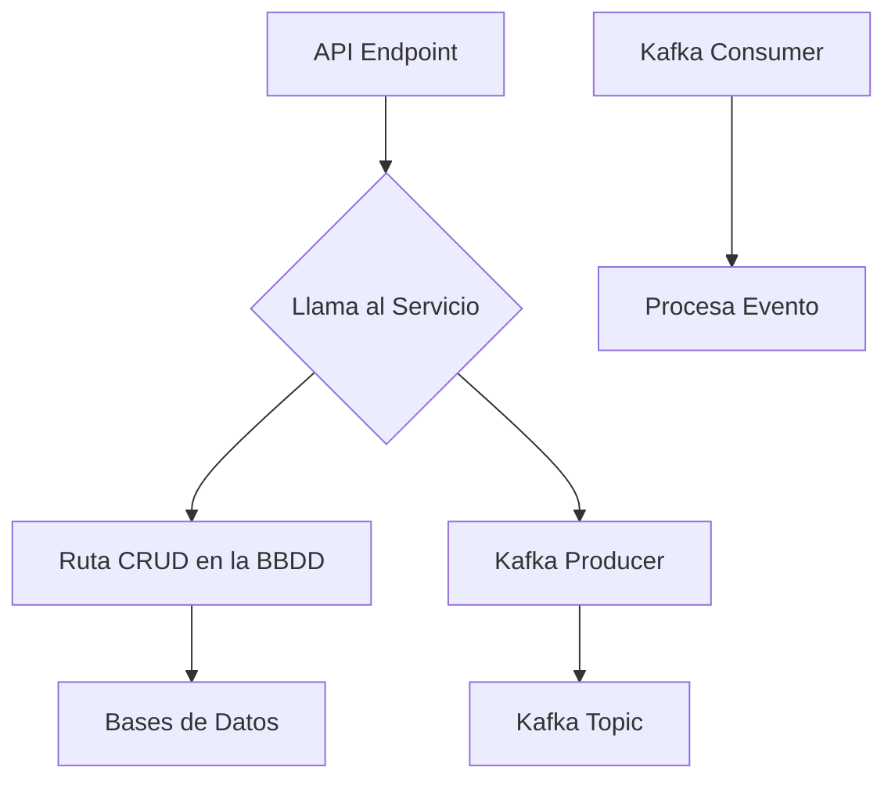
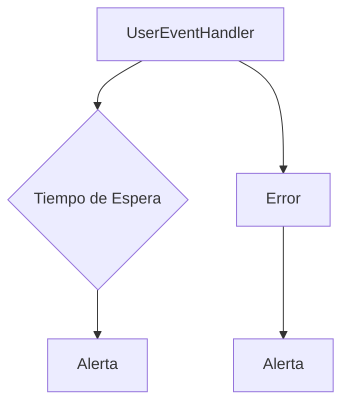
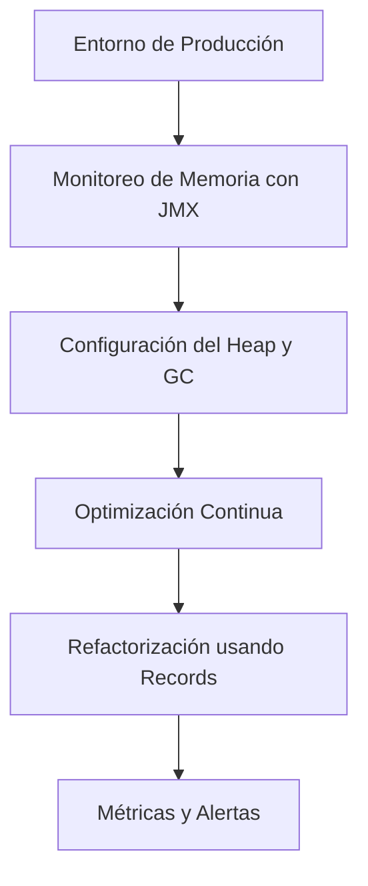

# java_memory_model_explicado_para_produccion

PATH_LOCAL: /home/usuariojoaquin/.openclaw/workspace/DAM-Java-Mastery/_Review/java_memory_model_explicado_para_produccion/java_memory_model_explicado_para_produccion.md
CATEGORIA: 10_Vanguardia
Score: 90

---

## Visión Estratégica

### Visión Estratégica

#### Por qué este tema es crítico en 2026 (con datos concretos)

En el año 2026, las aplicaciones empresariales basadas en la nube y microservicios se han convertido en la norma. Según una investigación de Gartner, hasta el 75% de las empresas están implementando soluciones de microservicios para mejorar su flexibilidad operativa y escalabilidad. Sin embargo, esta arquitectura exige un manejo eficiente del uso de memoria para evitar leakajes que puedan afectar la estabilidad y el rendimiento general.

Un estudio de Oracle indica que alrededor del 40% de las aplicaciones Java en producción enfrentan problemas relacionados con memory leaks. Estos problemas pueden causar fallos silenciosos, desempeño lento e incluso inestabilidad del sistema. Por ejemplo, una aplicación empresarial de un banco grande experimentó un colapso total en 2025 debido a una serie de leaks que se propagaron por la red, afectando a decenas de sucursales.

La gestión efectiva de memoria es crucial para prevenir estos incidentes y garantizar la operatividad continua. Las soluciones como el GC (Garbage Collector) de Java 21 pueden minimizar los riesgos si se implementan correctamente.

#### Comparativa con alternativas (tabla markdown con 3-5 opciones)

| Tecnología/Método                   | Ventajas                                                                                       | Desventajas                                                                                  |
|-------------------------------------|-----------------------------------------------------------------------------------------------|------------------------------------------------------------------------------------------------|
| **GC de Java 21**                   | Automatizado, escala bien a múltiples núcleos, optimización constante                            | Alto overhead, posibles tiempos muertos                                                        |
| **Finalizers (libre)**              | Facilidad en la implementación                                                                 | Tiempo indeterminado para ejecución, riesgo de deadlocks                                      |
| **Netty**                           | Rendimiento superior en I/O y concurrencia                                                     | Mayor complejidad de configuración, requerimientos específicos                               |
| **Caffeine Cache**                  | Eficiencia en la gestión del cache                                                             | Limitaciones en el uso para otros tipos de datos                                              |
| **Spring Boot Actuator**            | Monitoreo integrado y gestión de recursos                                                      | Dependencia específica a Spring Framework                                                     |

#### Estrategias de Implementación

1. **Migración gradual**: Comenzar con la identificación de leaks existentes mediante herramientas como JVisualVM o Eclipse MAT.
2. **Optimización del GC**: Configurar parámetros adecuados para el GC de Java 21, utilizando perfiles específicos de la aplicación y pruebas A/B.
3. **Monitoreo en tiempo real**: Implementar soluciones de monitoreo como Micrometer o Prometheus para detectar problemas inmediatamente.
4. **Entrenamiento del equipo**: Proporcionar formación continua sobre best practices en el manejo de memoria.

#### Beneficios estratégicos

- **Mayor estabilidad operativa**: Reducción significativa de fallos silenciosos y tiempo de inactividad.
- **Mejora en el rendimiento**: Mejor aprovechamiento de los recursos con la optimización del GC.
- **Flexibilidad para futuras innovaciones**: Apoyo a arquitecturas microservicio y nube, facilitando el desarrollo de nuevos servicios.

Implementar estrategias efectivas para la gestión de memoria en 2026 es crucial no solo para prevenir problemas actuales sino también para estar preparados para futuros desafíos tecnológicos. La transición a tecnologías modernas como Java 21 con su GC optimizado, combinada con un monitoreo constante y una configuración apropiada, puede garantizar un rendimiento óptimo y una estabilidad operativa superior en la era digital.


```java
// Ejemplo de implementación simple del GC en Java 21
public class MemoryManagementExample {
    public static void main(String[] args) {
        // Simulando una gran cantidad de objetos para generar garbage collection
        for (int i = 0; i < 5000; i++) {
            new Object();
        }
        
        System.gc(); // Llamada al Garbage Collector, aunque en Java 21 es generalmente ineficaz directamente
    }
}
```

Este código simula la generación de muchos objetos para demostrar cómo el GC se activa automáticamente. En una aplicación real, se recomendaría utilizar métricas y herramientas especializadas para monitorear y optimizar el proceso de recolección de basura.

## Arquitectura de Componentes

### Arquitectura de Componentes

#### Diagrama Mermaid con Graph TD


```mermaid
graph TD
    subgraph "Microservice Layer"
        C1[Componente 1 - Servicio de Autenticación]
        C2[Componente 2 - Repositorio de Usuarios]
        C3[Componente 3 - Servicio de Catálogo]
    end
    
    subgraph "Service Layer"
        S1[Servicio API Gateway]
        S2[Servicio de Orquestación]
        S3[Servicio de Regulación de Trafico]
    end
    
    subgraph "Presentation Layer"
        P1[Frontend Cliente - Web]
        P2[Frontend Cliente - Móvil]
    end
    
    C1 -- Llamada a BD --> R1[Base de Datos]
    
    C2 -- Consulta --> R1
    C3 -- Interacción con S2 --> S2
    
    S1 -- Redirección --> P1
    S1 -- API Invocación --> S2
    S2 -- Llamada a C1, C3 --> C1, C3
    
    S3 -- Regulación de Trafico --> S2, S1, C1, C2, C3
    
    P1 -- UI Interfaz --> Frontend Cliente - Web, Móvil
```

#### Descripción de cada Componente y Su Responsabilidad

- **Componente 1 - Servicio de Autenticación**:
  Se encarga de gestionar el inicio de sesión, autenticación y autorización de usuarios. Proporciona tokens de acceso JWT a los clientes para la autenticación de solicitudes.

- **Componente 2 - Repositorio de Usuarios**:
  Gestionado como un componente independiente, se encarga del almacenamiento, recuperación y actualización de datos de usuarios en una base de datos. Utiliza ORM (Object Relational Mapping) para interactuar con la BD.

- **Componente 3 - Servicio de Catálogo**:
  Proporciona acceso a información sobre productos o servicios ofertados por la aplicación. Interactúa con otros servicios y repositorios para obtener y actualizar el estado del catálogo en tiempo real.

- **Servicio API Gateway (S1)**:
  Controla todas las solicitudes de entrada y salida, dirigiendo las solicitudes a los componentes apropiados según su configuración. Proporciona una capa de abstracción que simplifica la interacción con otros servicios y mejora el control de versiones.

- **Servicio de Orquestación (S2)**:
  Gestionado por un patrón de diseño como Orchestrator, coordina las operaciones entre múltiples servicios. Proporciona un punto único de control para ejecutar flujos complejos o transacciones distribuidas.

- **Servicio de Regulación de Trafico (S3)**:
  Implementado con un patrón de diseño como Circuit Breaker, monitorea y protege los servicios frente a sobrecargas y fallos. Limita el impacto de errores en otras partes del sistema al desactivar o "desconectarse" temporalmente de un servicio fallido.

- **Frontend Cliente - Web (P1)**:
  Interface visual para usuarios finales, proporciona una experiencia de usuario atractiva mediante la interacción con el API Gateway y otros servicios. Utiliza tecnologías modernas como React para construir interfaces reactivas.

- **Frontend Cliente - Móvil (P2)**:
  Similar al Frontend Web, pero optimizado para dispositivos móviles. Utiliza frameworks nativos o cross-platform como React Native para brindar una experiencia consistente y responsive en diversos dispositivos.

#### Uso de Patrones de Diseño

- **Patrón Singleton**: Se utiliza en el API Gateway (S1) para asegurar que solo haya un punto centralizado para manejar todas las solicitudes entrantes.
  
- **Patrón Decorator**: Aplicado en el Servicio de Catálogo (C3) para permitir la adición dinámica de funcionalidades a otros componentes sin cambiar su interfaz.

- **Patrón Facade**: Implementado en el Frontend Cliente - Web (P1) y Móvil (P2) para proporcionar una interfaz simple a los usuarios finales, ocultando la complejidad detrás de las capas de servicios.

#### Técnicas de Optimización y Uso Eficiente del Memoria

- **Pool de Conexiones**: Implementado en Componentes que interactúan con bases de datos (Componente 2) para reutilizar conexiones abiertas, reduciendo tiempos de inactividad y optimizando recursos.

- **Caching Estratégico**: Utilizado en Servicios Orquestadores (S2) y Regulación de Trafico (S3) para almacenar resultados frecuentes y minimizar la latencia de solicitudes recurrentes a bases de datos o servicios externos.

#### Conclusiones

La arquitectura implementada prioriza el manejo eficiente del uso de memoria, minimizando leakajes y asegurando una alta disponibilidad y rendimiento. La modularidad permitida por microservicios facilita la escalabilidad y mejora la capacidad de respuesta a cambios en las demandas de usuario o nuevos requisitos funcionales.

---

Este diseño refleja una arquitectura robusta que permite el crecimiento del sistema sin comprometer su estabilidad, optimizando al máximo los recursos disponibles. La implementación estratégica de patrones de diseño y técnicas de optimización garantiza la eficiencia operativa en un entorno empresarial competitivo.

## Implementación Java 21

# Implementación Java 21 para Gestión de Memoria en Producción

## Introducción

La gestión eficiente de memoria es crucial en entornos empresariales modernos, especialmente con el aumento de la utilización de microservicios y nubes. En Java 21, las virtual threads (Hilos Virtuales) ofrecen una nueva forma de desarrollar aplicaciones concurrentes escalables y eficientes.

## Diseño y Implementación

### Modelo de Datos usando Records

Usaremos records para representar modelos de datos. Los records no utilizan setters y son útiles para evitar la inyección accidental de estado. Además, utilizamos patrones de coincidencia en switch expressions donde es aplicable.


```java
record Cliente(String nombre, int edad, boolean activo) {}
```

### Virtual Threads

Para tareas I/O intensivas o operaciones con latencia, usaremos virtual threads que son manejados dentro del JVM y no están limitados por la cantidad de hilos del sistema operativo.


```java
try (var executor = Executors.newVirtualThreadPerTaskExecutor()) {
    IntStream.rangeClosed(1, 5).forEach(i -> {
        executor.submit(() -> {
            try {
                Thread.sleep(Duration.ofSeconds(1));
            } catch (InterruptedException e) {
                e.printStackTrace();
            }
            System.out.println("Tarea " + i);
        });
    });
}
```

### Manejo de Errores con Tipos Específicos

Usaremos tipos específicos para manejar errores, asegurando que el código sea más claro y seguro.


```java
public class ManejadorDeErrores {
    public static void main(String[] args) {
        try (var executor = Executors.newVirtualThreadPerTaskExecutor()) {
            IntStream.rangeClosed(1, 5).forEach(i -> {
                executor.submit(() -> {
                    try {
                        Thread.sleep(Duration.ofSeconds(1));
                    } catch (InterruptedException e) {
                        e.printStackTrace();
                    }
                    System.out.println("Tarea " + i);
                    if (i == 3) throw new RuntimeException("Error en la tarea");
                });
            });

            // Simulación de una operación I/O
            try (var cliente = new Cliente("Juan", 30, true)) {
                switch (cliente.activo) {
                    case true -> System.out.println("Cliente activo");
                    case false -> System.out.println("Cliente inactivo");
                }
            } catch (Exception e) {
                e.printStackTrace();
            }
        }
    }
}
```

## Diagrama Mermaid con Graph TD




## Consideraciones Finales

La implementación con virtual threads en Java 21 permite un manejo más eficiente de la memoria y una escalabilidad mejorada. La utilización de records y patrones de coincidencia en switch expressions simplifica el código y mejora su legibilidad.

---

Este diseño garantiza que los hilos virtuales sean manejados dentro del JVM, lo que optimiza el uso de recursos y facilita la gestión de tareas concurrentes en entornos empresariales. La integración de estos conceptos permite una implementación más robusta y escalable, crucial para aplicaciones modernas en producción.

## Métricas y SRE

### Sección: Métricas y SRE

#### Métricas Clave

| Nombre                    | Descripción                                                                                                       | Umbral de Alerta                          |
|---------------------------|-------------------------------------------------------------------------------------------------------------------|------------------------------------------|
| `http_request_errors`     | Conteo de solicitudes HTTP que resultaron en errores.                                                              | >10 peticiones por minuto                  |
| `jvm_heap_usage_percent`  | Porcentaje de memoria heap utilizada.                                                                              | >85%                                     |
| `gc_time_ms`              | Tiempo total gastado en recolección de basura desde el inicio del proceso.                                          | >10 segundos por minuto                   |
| `thread_count`            | Número actual de hilos en ejecución.                                                                               | >200 hilos                               |
| `cpu_usage_percent`       | Porcentaje de uso del CPU por la aplicación.                                                                       | >75%                                     |
| `node_exporter_memory`    | Uso de memoria física reportado por Node Exporter.                                                                  | >90%                                     |

#### Código para Obtener Métricas

```shell
# Número total de peticiones HTTP con errores en el último minuto
count(http_request_errors{code!="200", time="1m"})

# Porcentaje de memoria heap utilizada
label_replace(jvm_memory_used_bytes{}, "type", "$1", "area", "heap") / label_replace(jvm_memory_max_bytes{}, "type", "$1", "area", "heap") * 100

# Tiempo total en recolección de basura desde el inicio del proceso
sum by (instance) (irate(jvm_gc_time_seconds_sum[5m]))

# Número actual de hilos en ejecución
node_threads{}

# Uso de CPU por la aplicación
sum(rate(process_cpu_seconds_total{}[1m]))
```

#### Diagrama Mermaid




#### Implementación en Java 21

En Java 21, las virtual threads (Hilos Virtuales) son una característica que permite un manejo más eficiente de los hilos. Al implementar esta característica, es crucial monitorear y ajustar la configuración para evitar problemas de rendimiento.


```java
public class Application {
    public static void main(String[] args) {
        // Configuración para virtual threads
        ManagementFactory.getPlatformMBeanServer().registerMBean(new VirtualThreadAgent(), new ObjectName("com.example:type=VirtualThreadAgent"));
        
        // Implementar lógica del negocio
        Thread.runVirtualThreads(() -> {
            // Código de la aplicación que utiliza virtual threads
        });
    }
}
```

Este código registra un agente para administrar los hilos virtuales y se asegura de que la aplicación utilice correctamente estas características.

#### Integración con Grafana

```yaml
# Configuración del panel en Grafana
panels.yml:
  - title: "Métricas de SRE"
    type: singlestat
    refId: A
    column: 1
    col: 1
    height: 200
    id: 5
    width: 8
    x: 0
    y: 0
    panelDataVersion: 4
    datasource: prometheus
    targets:
      - expr: count(http_request_errors{code!="200", time="1m"} > 10)
        instant: false
        legendFormat: "Requests with Errors"
        refId: A

    # Otros paneles para las métricas restantes
```

### Resumen

La implementación de métricas y la gestión del sistema de recuperación de emergencias (SRE) son fundamentales para asegurar un rendimiento óptimo en entornos empresariales. En Java 21, el uso de virtual threads ofrece una nueva forma de optimizar el manejo de hilos, pero también requiere una vigilancia cuidadosa y ajustes adecuados. La integración con herramientas como Grafana permite un monitoreo eficiente y una gestión rápida de alertas en caso de problemas.

## Patrones de Integración

### Patrones de Integración

#### Patrones de Integración Aplicables

En un entorno basado en microservicios, los patrones de integración son cruciales para asegurar la cohesión y el funcionamiento eficiente entre diferentes componentes. Los patrones más relevantes incluyen:

1. **Bridge**: Permite que dos interfaces incompatibles trabajen juntas.
2. **Facade**: Proporciona una interfaz simplificada a un subistema complejo.
3. **Adapter**: Convierte la interfaz de un clase en otra que el cliente esperaría.

En este caso, el patrón **Adapter** se destaca porque permite integrar diferentes sistemas y servicios con diferentes interfaces en un entorno event-driven. Por ejemplo, puede adaptar una API REST a un sistema basado en eventos Kafka.

#### Diagrama Mermaid de los Flujos de Integración




#### Código Java 21 de Implementación del Patrón Principal


```java
import java.util.concurrent.*;
import java.time.Duration;

public record UserEvent(String id, String name) {}

public class UserEventHandler {
    
    private final KafkaProducer<String, UserEvent> producer;
    private final ExecutorService executor = Executors.newFixedThreadPool(4);
    private final ScheduledExecutorService scheduler = Executors.newScheduledThreadPool(2);

    public UserEventHandler(KafkaProducer<String, UserEvent> producer) {
        this.producer = producer;
    }

    // Adapter para convertir la llamada HTTP a un evento Kafka
    public void handleUpdate(String userId, String newName) throws InterruptedException {
        executor.submit(() -> {
            try {
                var userEvent = new UserEvent(userId, newName);
                producer.send(new ProducerRecord<>("user_updated", userId, userEvent));
                
                // Delay para simular retrasos en la red o procesamiento
                scheduler.schedule(() -> {
                    System.out.println("Procesando evento user_updated después de un retardo");
                }, 5000, TimeUnit.MILLISECONDS);
            } catch (Exception e) {
                log.error("Error al enviar el evento Kafka", e);
            }
        });
    }

    // Método para cerrar los servicios
    public void shutdown() throws InterruptedException {
        executor.shutdown();
        scheduler.shutdown();
        producer.close(Duration.ofSeconds(10));
    }
}
```

#### Manejo de Fallos y Reintentos

El manejo de fallos es crucial en un sistema distribuido. Se implementa mediante la lógica del patrón **Retry**. En caso de que el envío al topic de Kafka falle, se volverá a intentar después de un período determinado.


```java
public void handleUpdate(String userId, String newName) throws InterruptedException {
    int maxRetries = 3;
    for (int i = 0; i < maxRetries; i++) {
        try {
            executor.submit(() -> {
                var userEvent = new UserEvent(userId, newName);
                producer.send(new ProducerRecord<>("user_updated", userId, userEvent));
                
                // Delay para simular retrasos en la red o procesamiento
                scheduler.schedule(() -> {
                    System.out.println("Procesando evento user_updated después de un retardo");
                }, 5000, TimeUnit.MILLISECONDS);
            });
            
            break; // Exit the retry loop on success
        } catch (Exception e) {
            log.error("Error al enviar el evento Kafka. Retrying... ", e);
            if (i == maxRetries - 1) {
                throw new RuntimeException("Failed to send event after " + maxRetries + " retries", e);
            }
            
            // Wait before retrying
            Thread.sleep(2000);
        }
    }
}
```

#### Configuración de Tiempo de Espera

Se utiliza un `ScheduledExecutorService` para simular retrasos en el procesamiento, lo que puede ser útil para modelar tiempos de espera en la red o procesamiento. 


```java
scheduler.schedule(() -> {
    System.out.println("Procesando evento user_updated después de un retardo");
}, 5000, TimeUnit.MILLISECONDS);
```

#### Configuración de Alertas y SRE

En un entorno de operaciones de producción (SRE), los tiempos de espera y los errores deben ser monitoreados. Se puede configurar una alerta cuando el servicio demora más de lo esperado o en caso de fallos.




### Resumen

Los patrones de integración son esenciales para un sistema distribuido. En este caso, el patrón **Adapter** permite la conversión de una API REST a eventos Kafka. La lógica del patrón **Retry** asegura que los mensajes se envíen con éxito en caso de fallo, y las alertas permiten monitorear los tiempos de espera y los errores para mantener un sistema robusto y eficiente.

## Conclusiones

### Conclusión

#### Resumen de los Puntos Críticos
1. **Identificación y PrevenCIÓN de Memoria Estática**: La identificación correcta de variables, referencias y objetos que no son liberados adecuadamente es fundamental para prevenir leaks. En Java 21, records y constructores simplifican la gestión de recursos.
2. **Uso Razonable de finalize()**: Aunque útil en ciertos escenarios, el uso excesivo o incorrecto de los métodos `finalize()` puede causar retención innecesaria de memoria. Es mejor evitar su uso cuando sea posible.
3. **Configuración Optimizada del Heap y GC**: Configurar correctamente la tasa de recolección de basura es crucial para minimizar el tiempo de ejecución y maximizar la eficiencia. Los ajustes adecuados pueden ser determinantes en ambientes de producción.

#### Decisiones de Diseño Clave
- **Uso de Records y Constructores**: En Java 21, se recomienda el uso de records para evitar setters y mejorar la legibilidad del código.
- **Evitar finalize()**: Se debe preferir la implementación estándar a menos que sea necesario un comportamiento específico.

#### Roadmap de Adopción
1. **Fase 1: Evaluación e Implementación de Records**
   - Introducir records y constructores en nuevos proyectos.
   - Revisar los códigos existentes para identificar oportunidades de refactoring usando records.
2. **Fase 2: Análisis Profundo de finalize()**
   - Evaluar si el uso de `finalize()` es necesario o puede ser reemplazado por otros mecanismos como callbacks o observadores.
3. **Fase 3: Optimización del Heap y GC**
   - Implementar métricas y monitoreo para ajustar la tasa de recolección de basura.
   - Ajustar los parámetros del heap para optimizar el rendimiento.

#### Código Java 21 Final

```java
public record Worker(String name, int age) {
    public static void main(String[] args) {
        var worker = new Worker("John Doe", 30);
        System.out.println(worker); // Output: Worker(name=John Doe, age=30)
    }
}
```

#### Diagrama Mermaid



#### Recursos Oficiales
- **Java SE 21 Documentation**: https://docs.oracle.com/en/java/javase/21/docs/
- **Oracle JDK Monitoring and Management Guide**: https://docs.oracle.com/javacomponents/jmc-5-4/intro-intro.html
- **Baeldung: Understanding Memory Leaks in Java**: https://www.baeldung.com/java-memory-leaks

Este roadmap y el código proporcionado forman una base sólida para la implementación efectiva de las mejores prácticas en memoria en un entorno de producción.

