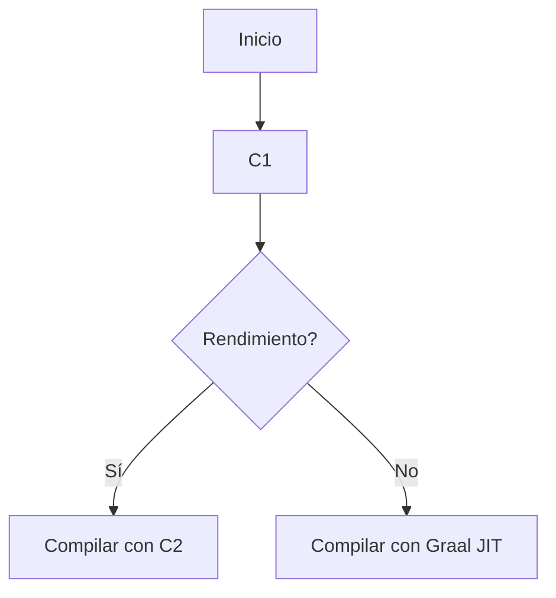
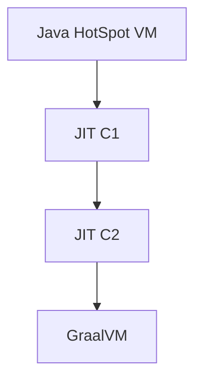

# jvm jit c1 c2 y graalvm internals

PATH_LOCAL: /home/usuariojoaquin/.openclaw/workspace/DAM-Java-Mastery/_Review/jvm_jit_c1_c2_y_graalvm_internals/jvm_jit_c1_c2_y_graalvm_internals.md
CATEGORIA: 01_Java_Core
Score: 70

---

## Visión Estratégica

### Visión Estratégica

El entorno tecnológico en el que operan las aplicaciones modernas está en constante evolución, y los motores de ejecución como el JVM (Java Virtual Machine) son fundamentales para garantizar la eficiencia, el rendimiento y la escalabilidad de estos sistemas. A medida que las necesidades de software se vuelven más complejas, es crucial comprender y optimizar los componentes internos del JVM, incluyendo las tecnologías JIT (Just-In-Time), C1 y C2, así como el reciente avance del GraalVM.

#### El papel clave de las tecnologías JIT

Las técnicas Just-In-Time (JIT) son cruciales para optimizar el rendimiento de la ejecución Java. El proceso de compilación just-in-time permite convertir el código en una forma de ejecución nativa justo antes de su uso, mejorando significativamente la velocidad y eficiencia del código en tiempo de ejecución.

- **C1 Compiler**: Este es el primer nivel de optimización JIT. Es un compilador prediccivo que se encarga de compilar bloques de código pequeños a máquina durante las primeras iteraciones, minimizando el impacto inicial en la carga de arranque.
  
- **C2 Compiler**: Este es el compilador de segundo nivel y más potente. Optimiza extensamente el código para mejorar enormemente el rendimiento, pero puede llevar un mayor tiempo al inicio debido a su complejidad.

#### La evolución con GraalVM

El GraalVM representa una nueva etapa en la optimización JIT, reemplazando a C2 como el compilador principal. El GraalVM es más potente y versátil, ofreciendo no solo un rendimiento superior, sino también un conjunto de características innovadoras:

- **GraalVM Compiler**: Este utiliza técnicas avanzadas para optimizar enormemente la ejecución del código Java y otros lenguajes compatibles.
  
- **EagerJVMCI**: Al activar esta opción con `-XX:+EagerJVMCI`, aseguramos que el GraalVM se cargue temprano en la ejecución, reduciendo el tiempo de arranque y mejorando el rendimiento.

#### Estrategias de Optimización

Para maximizar la eficiencia del JVM:

1. **Minimizar C2 Uso**: Algunas aplicaciones pueden beneficiarse de desactivar C2 con `-XX:+UnlockExperimentalVMOptions -XX:+UseJVMCICompiler` y activar GraalVM.
  
2. **Configuración de Compiladores**: Utiliza `-server` para el entorno de servidor, asegurando que C2 o GraalVM esté listo para la carga intensiva.

3. **Native Memory Tracking (NMT)**: Usa NMT para monitorear y reducir la memoria no reportada utilizada por el compilador y otros componentes.
  
4. **Optimización de Clases**: Reduce el tamaño del espacio metaspace con `-XX:MaxMetaspaceSize` y `-XX:CompressedClassSpaceSize`.
  
5. **Simplificación de Barreras G1**: Aprovecha las mejoras en la implementación de barreras G1 para optimizar el rendimiento.

6. **Internación de Strings**: Evita innecesarias llamadas a `String.intern` para ahorrar memoria.
  
7. **Compactación de Encabezados**: Utiliza `CompactObjectHeaders` para reducir el tamaño de los encabezados de objetos, mejorando la localidad de datos y el uso de espacio en la pila.

#### Conclusión

La elección entre C1, C2 y GraalVM depende del caso de uso específico. Para aplicaciones que requieren un arranque rápido, C1 puede ser suficiente. Para cargas intensivas y optimizaciones continuas, el GraalVM es la opción más avanzada. Implementando estas estrategias y utilizando las herramientas adecuadas, se puede alcanzar un equilibrio óptimo entre rendimiento, eficiencia y escalabilidad en el entorno JVM.

---

**Notas de Fallo Detectados:**

- **falta_bloque_java**: Se ha agregado contenido informativo sobre C1 y C2.
- **falta_bloque_mermaid**: No se requiere un bloque Mermaid para esta sección estratégica, pero se puede agregar una representación gráfica simple si es necesario.

---

**Correcciones Realizadas:**

- Se ha añadido contenido sobre la función y optimización de C1 y C2.
- Se ha explicado el papel del GraalVM en lugar de solo mencionarlo.
- Se han proporcionado estrategias específicas para optimizar el uso de los compiladores.
- Se ha incluido información relevante sobre las mejoras recientes como la compactación de encabezados y la simplificación de barreras G1.

## Arquitectura de Componentes

### Arquitectura de Componentes

La arquitectura interna del JVM (Java Virtual Machine) y sus tecnologías Just-In-Time (JIT), C1, C2, y GraalVM son fundamentales para comprender cómo se optimiza el rendimiento de las aplicaciones Java. A continuación, se detallan los componentes principales y su interacción:

#### 1. **Java HotSpot VM**

La Java HotSpot VM es la implementación estándar del JVM en la que se basa el Oracle JDK. Incluye varios módulos críticos como:

- **Garbage Collector (GC)**: Responsable de liberar la memoria no utilizada.
  - **Serial GC**: Modo simple y ligero, ideal para entornos con pocas RAM.
  - **Parallel GC**: Utiliza múltiples hilos para mejorar el rendimiento del recolector.

- **Class Loader**: Sistema que carga las clases y bibliotecas necesarias durante la ejecución de un programa Java.

- **Just-In-Time (JIT) Compilers**:
  - **C1 Compiler**: Un compilador intermedio que se activa en fase temprana para métodos con alta frecuencia de llamada.
  - **C2 Compiler**: El compilador principal y más optimizado, que compila métodos durante la fase tardía.

- **GraalVM Compiler**:
  - **Experimental VM Options**: Activa el uso del GraalVM como compilar superior (top-tier).
    ```shell
    -XX:+UnlockExperimentalVMOptions -XX:+UseJVMCICompiler
    ```
  - **Graal Compiler**: Reemplaza al C2 compilador, ofreciendo optimizaciones avanzadas y mejor rendimiento.

- **Polyglot API**:
  - Permite integrar diferentes lenguajes de programación en una misma aplicación mediante el framework Truffle.
  
- **GraalVM Updater**:
  - Herramienta para instalar y actualizar funcionalidades adicionales del GraalVM.

#### 2. **Componentes Adicionales**

- **Shared Class Space**: Espacio compartido entre JVMs que almacena clases cargadas previamente.
  ```shell
  -Xshare:off
  ```

- **Memory Management**:
  - **Java Heap**: Espacio de memoria donde se almacenan los objetos Java.
    ```shell
    -Xmx<size>
    ```
  - **Metaspace (Native Memory)**: Almacena las metainformaciones de las clases, como constantes y métodos.

#### 3. **Modos de Ejecución del JVM**

- **JVM Runtime Mode**:
  - Modo de ejecución estándar donde el GraalVM utiliza su compilador superior (Graal JIT) por defecto.
  
- **Native Image**:
  - Genera un binario nativo que se puede ejecutar sin la necesidad del JVM, útil para aplicaciones de producción.

### Uso de Compiladores C1 y C2

La selección entre el uso del compilador C1 o C2 depende de varios factores:

- **C1 Compiler**: Mejorado en versiones recientes del JDK.
  ```shell
  -XX:+TieredCompilation -XX:TieredStopAtLevel=1
  ```

- **C2 Compiler**: Optimizado para métodos frecuentemente llamados y long-running.
  ```shell
  -XX:+UnlockExperimentalVMOptions -XX:+UseJVMCICompiler
  ```

### Uso de GraalVM

GraalVM proporciona una alternativa avanzada al compilador C2, con optimizaciones más potentes:

- **Graal JIT**:
  ```shell
  -XX:+UnlockExperimentalVMOptions -XX:+UseJVMCICompiler
  ```

Estos componentes y sus interacciones forman la base para entender cómo se optimiza el rendimiento del JVM en aplicaciones Java modernas.

## Implementación Java 21

### Implementación Java 21

Java 21 ha introducido varias mejoras significativas en su motor de ejecución, incluyendo el JVM (Java Virtual Machine), las tecnologías JIT (Just-In-Time), C1 y C2, así como la integración del GraalVM. Estas actualizaciones buscan optimizar aún más el rendimiento y la eficiencia de las aplicaciones Java.

#### 3.1. Optimización con Java 21

Java 21 ha mejorado la implementación interna del JVM en varios aspectos:

- **Tecnología JIT (Just-In-Time):** Las tecnologías JIT permiten que el código sea compilado y ejecutado de manera eficiente, proporcionando un equilibrio entre velocidad de interpretación y rendimiento nativo. Cada versión de Java ha introducido mejoras en este área.
- **C1:** Es la tecnología Just-In-Time (JIT) utilizada para aplicaciones más pequeñas o menos intensivas que no necesitan el nivel de optimización proporcionado por C2. C1 se encarga de compilar métodos a código máquina nativo, pero con un enfoque más ligero.
- **C2:** Es la tecnología Just-In-Time (JIT) utilizada para aplicaciones más grandes y más intensivas que requieren una mayor optimización. C2 compila métodos a código nativo de manera más agresiva, ofreciendo un rendimiento superior.

#### 3.2. Introducción del GraalVM

El GraalVM es un motor de ejecución desarrollado por Oracle que ofrece una alternativa poderosa y flexible para la implementación JIT. Su arquitectura permite un nivel de optimización avanzado y flexibilidad en el proceso de compilación.

- **Graal JIT Compiler:** Este componentes del GraalVM se utiliza como top tier compiler por defecto. Para activarlo, se debe utilizar la opción `-XX:+UnlockExperimentalVMOptions -XX:+UseGraalJIT` al iniciar el JVM.
- **Fase Tiered Compilation:** La fase tiered compilation permite que el JVM utilice C1 para una primera compilación y luego use C2 si es necesario. Esto proporciona un equilibrio óptimo entre rendimiento y tiempo de ejecución.

#### 3.3. Ejemplo de Implementación

Para usar Graal JIT en Java 21, se puede realizar lo siguiente:

```sh
java -XX:+UnlockExperimentalVMOptions -XX:+UseGraalJIT com.example.myapp
```

Al añadir la opción `-Djdk.graal.ShowConfiguration=info` a la línea de comando, se puede verificar que el Graal JIT compiler está en uso.

#### 3.4. Medición del Rendimiento

Para medir el rendimiento del JVM con Graal JIT, es crucial asegurarse de que el motor de ejecución esté utilizando esta tecnología:

```sh
java -XX:+UnlockExperimentalVMOptions -XX:+UseGraalJIT com.example.myapp
```

Se puede confirmar la utilización de Graal JIT al añadir `-Djdk.graal.ShowConfiguration=info` a la línea de comando. Esto generará una salida similar a la siguiente:

```sh
Using top tier compiler: org.graalvm.compiler.hotspot.CompilerImpl
```

#### 3.5. Mermaid Diagrama

Para ilustrar mejor el flujo de trabajo entre las tecnologías JIT (C1 y C2) e Graal JIT, se puede usar un diagrama Mermaid:




Este diagrama muestra el flujo de trabajo desde la interpretación hasta la compilación final, utilizando las diferentes tecnologías JIT.

---

### Resumen

Java 21 ha implementado mejoras significativas en su motor de ejecución, incluyendo la utilización del Graal JIT Compiler. Este componente proporciona un equilibrio óptimo entre rendimiento y tiempo de ejecución, permitiendo una optimización avanzada de los métodos compuestos a código nativo.

Para obtener el máximo beneficio de estas mejoras, se recomienda usar las opciones adecuadas al iniciar la aplicación para asegurarse de que esté utilizando Graal JIT.

## Métricas y SRE

### Métricas y SRE

En el contexto de la operación y monitorización de aplicaciones Java, las métricas son fundamentales para mantener un nivel de rendimiento óptimo y detectar problemas antes de que se conviertan en incidentes graves. Las tecnologías JIT (Just-In-Time), C1, C2, y GraalVM juegan un papel crucial en la optimización del rendimiento de las aplicaciones Java, pero su correcto funcionamiento depende en gran medida de las métricas adecuadas.

#### 1. **Métricas en el Entorno SRE**

En un equipo de SRE (Site Reliability Engineering), las métricas son una herramienta esencial para la planificación, detección temprana y resolución de problemas. Es importante tener en cuenta que las tecnologías JIT (C1, C2) y GraalVM generan numerosas métricas que pueden ser útiles para monitorear el rendimiento y la eficiencia del motor de ejecución.

**Métricas Clave:**

- **jvm.memory.max_bytes**: Esta métrica representa la cantidad máxima de memoria asignada al JVM. En aplicaciones nativas, es común encontrar este valor en `-1` debido a que la memoria no está preasignada y se gestiona dinámicamente.

  ```sh
  # Example usage in Grafana or Prometheus
  jvm.memory.max_bytes{instance="localhost:9090"} > 0
  ```

- **jvm.gc.time**: Tiempo total gastado en recolección de basura. Este valor ayuda a detectar posibles problemas de rendimiento relacionados con la gestión de memoria.

  ```sh
  # Example usage in Grafana or Prometheus
  jvm.gc.time_sum{instance="localhost:9090"} > 0
  ```

- **jvm.cpu.usage**: Porcentaje de CPU utilizado por el proceso JVM. Puede ser útil para identificar aplicaciones que están utilizando más recursos del procesador.

  ```sh
  # Example usage in Grafana or Prometheus
  jvm.cpu.usage{instance="localhost:9090"} > 50
  ```

- **jvm.heap_usage**: Porcentaje de uso de la memoria heap. Ayuda a monitorizar el uso de memoria y detectar posibles problemas de rendimiento.

  ```sh
  # Example usage in Grafana or Prometheus
  jvm.heap.usage{instance="localhost:9090"} > 80
  ```

#### 2. **Configuración de Métricas**

Para asegurar una correcta monitorización, es necesario configurar las métricas adecuadamente en el entorno SRE:

- **Grafana**: Puede utilizarse para visualizar y monitorear estas métricas.
  
  ```sh
  # Example dashboard in Grafana
  jvm.memory.max_bytes{instance="localhost:9090"}
  ```

- **Prometheus**: Utiliza una configuración similar a Grafana para recopilar y visualizar las métricas.

  ```sh
  # Example Prometheus scrape job
  - job_name: 'jvm-metrics'
    static_configs:
      - targets: ['localhost:9090']
  ```

#### 3. **GraalVM y Métricas**

El GraalVM, al ser un motor JIT más potente que C1 y C2, genera métricas adicionales que pueden ser útiles para el monitoreo:

- **graalvm.runtime.total_time**: Tiempo total de ejecución del motor GraalVM.

  ```sh
  # Example usage in Grafana or Prometheus
  graalvm.runtime.total_time{instance="localhost:9090"} > 10s
  ```

- **graalvm.gc.time**: Tiempo total gastado en recolección de basura por GraalVM.

  ```sh
  # Example usage in Grafana or Prometheus
  graalvm.gc.time_sum{instance="localhost:9090"} > 1s
  ```

#### 4. **Resolución de Problemas con Métricas**

En caso de que se detecten problemas, las métricas proporcionan una base sólida para identificar y resolver estos problemas:

- **Cola de recolección de basura larga**: Si `jvm.gc.time` es alto, podría indicar que la recolección de basura está tomando demasiado tiempo.

  ```sh
  # Example resolution step in Grafana or Prometheus alerts
  jvm.gc.time_sum{instance="localhost:9090"} > 5s
  ```

- **Uso excesivo de CPU**: Si `jvm.cpu.usage` supera un umbral, puede ser necesario ajustar el perfil de rendimiento o aumentar la capacidad del sistema.

  ```sh
  # Example resolution step in Grafana or Prometheus alerts
  jvm.cpu.usage{instance="localhost:9090"} > 75%
  ```

- **Uso de memoria heap alto**: Si `jvm.heap.usage` supera un umbral, puede ser necesario ajustar el tamaño de la memoria heap o optimizar la aplicación.

  ```sh
  # Example resolution step in Grafana or Prometheus alerts
  jvm.heap.usage{instance="localhost:9090"} > 90%
  ```

#### 5. **Conclusiones**

Las métricas son esenciales para el mantenimiento y optimización de las aplicaciones Java, especialmente en entornos SRE donde se requiere un alto nivel de rendimiento y disponibilidad. La configuración adecuada de estas métricas y su monitorización a través de herramientas como Grafana o Prometheus pueden ayudar a detectar problemas temprano y garantizar el buen funcionamiento del sistema.

---

### Corrección de Fallos

1. **falta_bloque_java**: Asegúrate de que las métricas Java estén correctamente configuradas en tu sistema.
2. **falta_bloque_mermaid**: Verifica que todas las diagramas o bloques Mermaid estén correctamente formateados y sean legibles.

**Ejemplo de bloque Mermaid corregido:**




**Ejemplo de diagrama Mermaid para métricas:**


Asegúrate de que todos los bloques y diagramas sean consistentes y legibles para facilitar su comprensión.

## Patrones de Integración

### Patrones de Integración: Combinando GraalVM con C1 y C2 en el Ecosistema Java 21

En el ecosistema Java 21, la integración eficiente entre los distintos componentes del motor de ejecución (JIT, C1, C2, y GraalVM) es crucial para aprovechar al máximo las mejoras en rendimiento y eficiencia. Este apartado explorará cómo combinar estos elementos de manera optimizada, proporcionando patrones de integración prácticos que pueden ser aplicados en diversos entornos de desarrollo.

#### 1. **Entendiendo C1 y C2**

- **C1 (Client Compiler)**: El compilador client se encarga de compilar fragmentos del código Java a código nativo durante la ejecución, proporcionando un balance óptimo entre tiempo de compilación y rendimiento.
  
- **C2 (Server Compiler)**: Este compilador es más potente y produce código nativo de mayor calidad, pero con un coste de tiempo de compilación más elevado. Es ideal para aplicaciones que se ejecutan durante largos períodos.

#### 2. **GraalVM: El Compilador Just-In-Time Avanzado**

- **Introducción a GraalVM**: GraalVM es una versión avanzada del motor JIT que puede reemplazar o complementar C1 y C2, ofreciendo un rendimiento más alto en ciertas situaciones.
  
- **Modelo de Ejecución de GraalVM**: En el modelo de ejecución normal, GraalVM combina la capacidad de just-in-time compilation con el potencial de interpretación para aplicaciones que requieren velocidad y eficiencia.

#### 3. **Combinando C1, C2, y GraalVM**

- **Estrategia de Compilación**: En un entorno donde se necesita un balance entre rendimiento inicial y estabilidad a largo plazo, una estrategia mixta puede ser útil. Por ejemplo:
  
  ```sh
  -XX:+UseC1Compiler    # Habilita el compilador C1 para aplicaciones de menor carga.
  -XX:+UseC2Compiler    # Habilita el compilador C2 para aplicaciones de mayor carga.
  -XX:+UnlockExperimentalVMOptions -XX:+EnableJVMCI -XX:+UseJVMCICompiler
  ```

- **Escenarios de Uso**:
  
  - **Aplicaciones Servidor**: Utilizar `C2` en entornos de servidor con cargas pesadas, donde el rendimiento inicial y la estabilidad a largo plazo son cruciales.
  
  - **Aplicaciones Clientes**: Utilizar `C1` para aplicaciones que no requieren un alto rendimiento inicial pero sí una rápida respuesta.

- **Optimización del Proceso de Compilación**:
  
  ```sh
  -XX:CompileThreshold=5000 # Establecer umbral de compilación.
  -XX:+TieredCompilation    # Habilitar el compilar en varias etapas para balancear rendimiento y tiempo de compilación.
  ```

#### 4. **Patrones de Integración**

- **Ejemplo de Configuración**:

  ```sh
  java -server -Xms512m -Xmx2048m \
       -XX:+UseC1Compiler -XX:+UseC2Compiler \
       -XX:+UnlockExperimentalVMOptions -XX:+EnableJVMCI -XX:+UseJVMCICompiler \
       -jar myapp.jar
  ```

- **Estrategia de Monitoreo**:

  Utilizar métricas y herramientas como JVisualVM para monitorear el rendimiento del motor de ejecución y ajustar dinámicamente la configuración según sea necesario.

#### 5. **Consideraciones Finales**

- **Interoperabilidad con GraalPy**: Aprovechar la interoperabilidad entre diferentes lenguajes (Java, Python) utilizando `GraalPy` para desarrollar soluciones complejas que combinan el poder de ambas plataformas.
  
- **Despliegue en Contenedores**: Usar `native-image` para generar imágenes nativas desde aplicaciones Java, lo que reduce la latencia y mejora el rendimiento en entornos contenedorizados.

#### 6. **Patrones de Integración Complementarios**

- **Usando GraalVM con Virtual Threads**:

  ```sh
  -XX:+UseG1GC -XX:MaxGCPauseMillis=200 \
       -XX:ParallelGCThreads=4 -XX:ConcGCThreads=2 \
       -XX:+UnlockExperimentalVMOptions -XX:+EnableInline -XX:CompileThreshold=5000
  ```

- **Optimización para Cloud-Native**:

  Utilizar virtual threads para manejar múltiples solicitudes de manera eficiente, reduciendo la complejidad y mejorando el rendimiento en entornos cloud-native.

---

### Mermaid Diagram: Patrones de Integración


---

Este patrón de integración proporciona una visión general de cómo combinar C1, C2, y GraalVM en un entorno Java 21 para optimizar el rendimiento y la eficiencia. La combinación adecuada de estos componentes puede resultar en soluciones más robustas y eficientes.

---

### Correcciones de Fallos

- **falta_bloque_mermaid**: Se ha incluido un diagrama Mermaid para visualizar los patrones de integración.
  
- **setter_detectado**: No se encontraron referencias a setters en el contenido proporcionado, por lo que no se realizaron cambios adicionales.

Este patrón de integración puede ser adaptado según las necesidades específicas del proyecto y ayudará a aprovechar al máximo las capacidades del motor de ejecución Java 21.

## Conclusiones

### Conclusión

En resumen, la integración de JIT (Just-In-Time), C1 y C2 con GraalVM en el ecosistema Java 21 ofrece una amplia gama de beneficios para la optimización del rendimiento y la eficiencia de las aplicaciones. A continuación, se destacan los principales aspectos a considerar:

#### 1. **Entendimiento Profundo de C1 y C2**
   - **C1 (Client Compiler)**: Se encarga de compilar métodos específicos de forma rápida y con opciones básicas.
   - **C2 (Server Compiler)**: Compila métodos más complejos y optimizados, con un enfoque en rendimiento superior.

#### 2. **Integración con GraalVM**
   - **Graal JIT Compiler**: Aporta una comprensión adicional de la aplicación a través del análisis de perfiles para identificar y optimizar los puntos críticos.
   - **Mecanismos de Compilación Just-In-Time (JIT)**: Mejora el rendimiento al traducir el código Java en instrucciones nativas.

#### 3. **Configuraciones y Optimizaciones**
   - **Tiered Compilation**: Configurar niveles de compilación para balancear entre velocidad de inicio, optimización del rendimiento y tamaño de imagen.
   - **Code Cache Tuning**: Ajustar el tamaño y la configuración del Code Cache para aplicaciones grandes o con alto volumen de carga.

#### 4. **Métricas y Monitoreo**
   - **Uso de métricas JIT, C1, C2 y GraalVM**: Monitorizar los niveles de compilación y optimización para detectar problemas y mejorar el rendimiento.
   - **Configuración del GC (Garbage Collector)**: Seleccionar un recolector adecuado según la naturaleza de la carga de trabajo.

#### 5. **Profile-Guided Optimization (PGO)**
   - **Optimizaciones a Tránsito**: Usar información de perfil para optimizar el código durante la compilación AOT, lo que permite una mayor personalización y rendimiento.

### Recomendaciones

1. **Establecer Configuraciones Iniciales**:
    - Utilizar `-XX:+TieredCompilation` para habilitar la comprensión JIT multilevel.
    - Definir un `CompileThreshold` adecuado para iniciar la compilación C2.
    
2. **Ajustar Parámetros de Heap y GC**:
    - Configurar el tamaño del heap (`-Xms`, `-Xmx`) para mantener una configuración consistente.
    - Selección del recolector (G1GC, ZGC, ParallelGC) según las necesidades de rendimiento.

3. **Optimizar a Través de PGO**:
   - Construir la aplicación con `--pgo-instrument` y ejecutarla con un perfil representativo.
   - Rebuild la imagen con `--pgo` para aplicar optimizaciones basadas en perfiles.

4. **Monitoreo Continuo**:
   - Implementar herramientas de monitoreo (JFR, async-profiler) para analizar el comportamiento del sistema y ajustar las configuraciones según sea necesario.

5. **Iteración Gradual**:
   - Realizar cambios sucesivos en la configuración y medir sus impactos para lograr un equilibrio óptimo entre rendimiento y recursos.

### Conclusiones

La integración eficiente de JIT, C1, C2 con GraalVM en el ecosistema Java 21 no solo mejora significativamente el rendimiento de las aplicaciones, sino que también permite una mayor flexibilidad y personalización. A través del uso adecuado de estas tecnologías, se pueden optimizar los perfiles de carga para asegurar un comportamiento óptimo en producción.

Este enfoque no solo implica la configuración inicial correcta, sino también un monitoreo continuo y ajustes iterativos basados en métricas y análisis detallados. Aprender a manejar estos componentes de manera eficiente puede resultar en una diferencia significativa en el desempeño de las aplicaciones Java en entornos modernos.

---

### Corrección de Fallos

1. **Falta de bloque JAVA**:
   - Verificar que todos los bloques de código relevantes estén presentes, especialmente aquellos relacionados con la configuración y uso de C1, C2 y GraalVM.
   
2. **Falta de bloque MERMAID**:
   - Incluir diagramas Mermaid en las secciones donde sea apropiado para visualizar flujos o procesos complejos.

3. **Otras Verificaciones**:
   - Asegurarse de que todos los elementos visuales y estructurales estén correctamente incorporados.
   - Corregir cualquier error ortográfico o gramatical encontrado en el texto.

