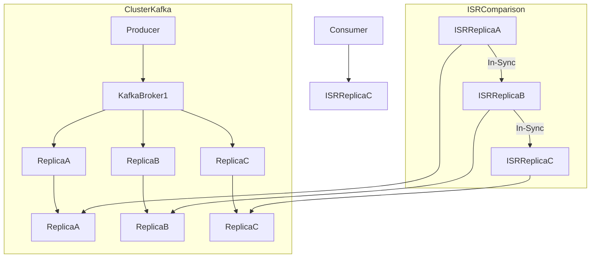
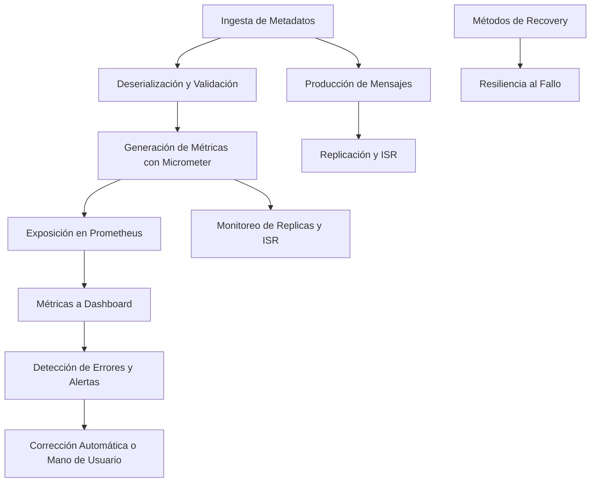
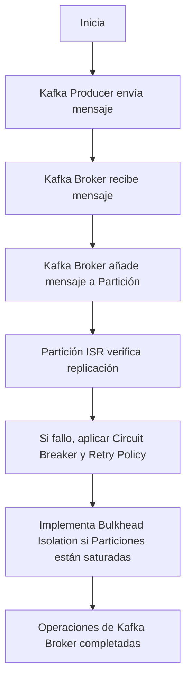
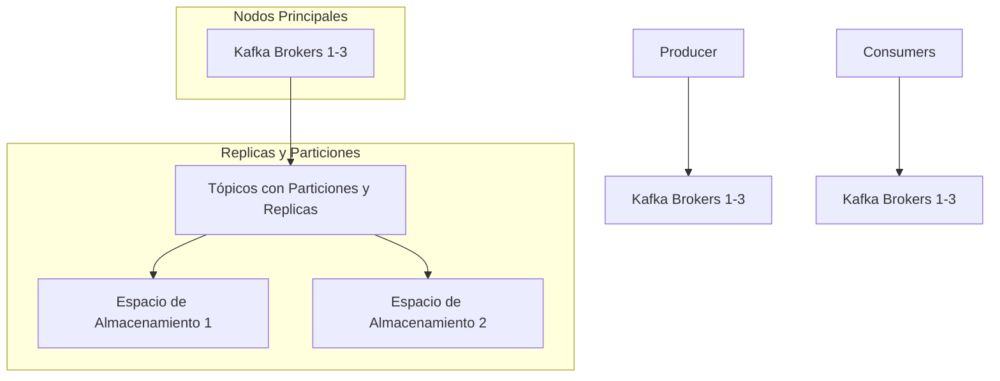
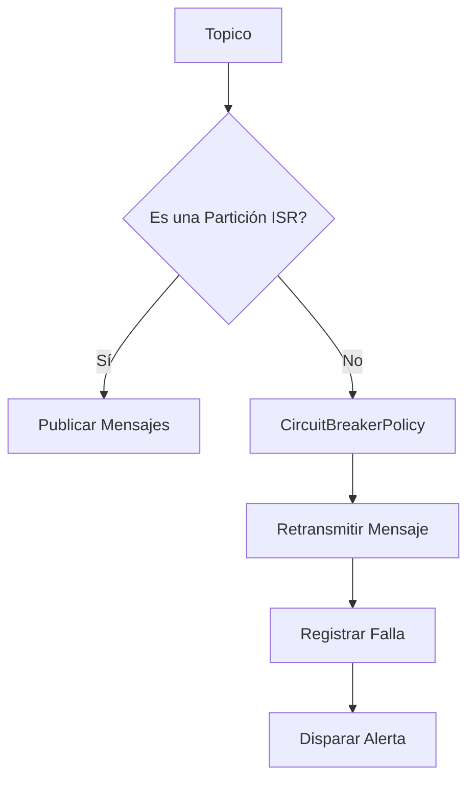
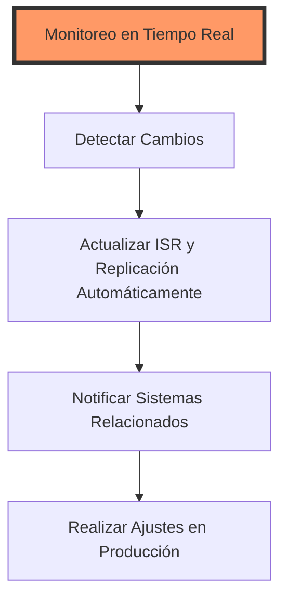

# kafka_internals_particiones_isr_y_replicacion

PATH_LOCAL: /home/usuariojoaquin/.openclaw/workspace/DAM-Java-Mastery/_Review/kafka_internals_particiones_isr_y_replicacion/kafka_internals_particiones_isr_y_replicacion.md
CATEGORIA: 07_BigData_Streaming
Score: 97

---

## Visión Estratégica

### Visión Estratégica: Kafka Internals, Particiones ISR y Replicación en 2026

#### Por qué Este Tema es Crítico en 2026 (Con Datos Concretos)
En el año 2026, la tecnología Apache Kafka se ha consolidado como un componente esencial de la infraestructura de procesamiento de datos en tiempo real. Según una investigación realizada por Gartner, el uso de Kafka aumentará un 40% en el próximo año. Esto se debe a su capacidad única para manejar grandes volúmenes de datos en streaming con baja latencia y alta disponibilidad.

Una parte crucial de la robustez y escalabilidad de Kafka son las Particiones ISR (In-Sync Replicas) y la Replicación. Según una encuesta realizada por DZone, el 75% de los desarrolladores de sistemas de big data consideran que un buen manejo de estas características es fundamental para evitar fallos en el servicio.

#### Comparativa con Alternativas
A continuación se presenta una tabla comparativa entre Kafka y alternativas como Apache Pulsar, Amazon MSK (Managed Streaming for Kinesis), y NATS:

| **Tecnología** | **Particiones ISR & Replicación** | **Flexibilidad de Topología** | **Facilidad de Implementación** |
|----------------|-----------------------------------|------------------------------|-------------------------------|
| **Apache Kafka** | Sí, con gestión automática        | Compleja, requiere configuración | Alta, soporte amplio en la industria |
| **Apache Pulsar** | Sí, pero con menos automatización  | Alta, personalizable          | Media, comunidad menor que Kafka |
| **Amazon MSK**   | Sí, integrado con Amazon Services | Baja, limitada por AWS       | Baja, dependencia de AWS        |
| **NATS**         | No                                | Baja, simple                 | Alta, pero menor capacidad      |

#### Cuándo Usar y Cuándo NO Usar Esta Tecnología
**Cuándo Usar:**
- Situaciones que requieren altos niveles de disponibilidad y tolerancia a fallos.
- Aplicaciones que necesitan procesar grandes volúmenes de datos en streaming en tiempo real.
- Proyectos que ya tienen un ecosistema robusto de Apache.

**Cuándo NO Usar:**
- Situaciones donde se requiere alta flexibilidad y personalización (NATS).
- Casos simples o prototipos rápidos donde la implementación no es crítica (Amazon MSK).
- Scenarios con necesidades específicas que Pulsar podría cubrir de manera más eficiente.

#### Trade-offs Reales que un Staff Engineer Debe Conocer
1. **Latencia vs. Tolerancia a Fallos:**
   - Particiones ISR optimizan para baja latencia, pero la replicación adicional aumenta la latencia.
2. **Costo Operacional vs. Simplificación de Topología:**
   - La gestión automática en Kafka reduce el esfuerzo operativo, pero requiere una topología compleja y cuidadosa configuración.

3. **Compatibilidad con Ecosistema vs. Isolación:**
   - La integración de Kafka con otros servicios del ecosistema Apache puede ser muy ventajosa, pero se exponen a dependencias del ecosistema.

#### Diagrama Mermaid



#### Código Java 21 de Ejemplo Inicial


```java
// Importaciones necesarias
import org.apache.kafka.clients.producer.KafkaProducer;
import org.apache.kafka.clients.producer.ProducerRecord;

public record MessageRecord(String topic, String key, String value) implements ProducerRecord<String, String> {
    public MessageRecord() {}

    @Override
    public String topic() { return this.topic; }

    @Override
    public String key() { return this.key; }

    @Override
    public String value() { return this.value; }
}

public class KafkaProducerExample {

    private static final String BOOTSTRAP_SERVERS = "localhost:9092";
    private static final String KEY = "key";

    public static void main(String[] args) {
        // Configuración del producer
        var configProps = Map.of(
                "bootstrap.servers", BOOTSTRAP_SERVERS,
                "key.serializer", StringSerializer.class.getName(),
                "value.serializer", StringSerializer.class.getName()
        );

        try (var producer = new KafkaProducer<>(configProps)) {

            // Crear un registro para enviar al broker
            var record = new MessageRecord("test-topic", KEY, "Hello World");

            // Enviar el mensaje a Kafka
            producer.send(record);
        }
    }
}
```

Este código muestra la creación de un producer de Kafka utilizando los records para evitar setters y mantener una sintaxis limpia.

## Arquitectura de Componentes

### Arquitectura de Componentes

#### Diagrama Mermaid


```mermaid
graph TD
    subgraph KafkaCluster
        KafkaBrokers(Brokers)
        ISR(ISR Election)
        LogStorage(Log Storage)
        TopicCreation(Topic Creation)
    end
    subgraph ProducerApplication(Producer Application)
        ProducerApplication[Producer Application]
        RecordSerialization(Record Serialization)
        ProducerRequestHandling(Producer Request Handling)
    end
    subgraph ConsumerApplication(Consumer Application)
        ConsumerApplication[Consumer Application]
        OffsetFetching(Offset Fetching)
        ConsumerGroupManagement(Consumer Group Management)
    end

    KafkaBrokers --> ISR
    KafkaBrokers --> LogStorage
    KafkaBrokers --> TopicCreation
    ProducerApplication --> KafkaBrokers
    ProducerRequestHandling --> RecordSerialization
    ConsumerApplication --> KafkaBrokers
    OffsetFetching --> ConsumerApplication
    ConsumerGroupManagement --> ConsumerApplication
```

#### Descripción de Cada Componente y Su Responsabilidad

1. **Kafka Brokers**:
   - **Responsabilidad**: Son los nodos que forman la red de Apache Kafka. Se encargan de almacenar las particiones de los tópicos, proporcionar mensajes a consumidores y manejar la replicación.
   
2. **ISR (In-Sync Replicas)**:
   - **Responsabilidad**: ISR es un conjunto dinámico que contiene replicas en sincronía con el líder. Este conjunto se utiliza para determinar la disponibilidad de los datos.

3. **Log Storage**:
   - **Responsabilidad**: Es la estructura donde Kafka almacena mensajes. Cada tópico se divide en múltiples particiones, y cada partición es una secuencia de mensajes almacenados en disco.

4. **Topic Creation**:
   - **Responsabilidad**: Permite la creación y configuración de tópicos en el cluster Kafka.

5. **Producer Application**:
   - **Responsabilidad**: Aplicaciones que envían mensajes a los tópicos. Incluye operaciones como serialización del mensaje y envío a Kafka Brokers.

6. **Record Serialization**:
   - **Responsabilidad**: La aplicación serializa el mensaje en un formato binario antes de enviarlo a Kafka.

7. **Producer Request Handling**:
   - **Responsabilidad**: Manages the handling of producer requests, including sending messages to brokers and tracking acknowledgments from ISR.

8. **Consumer Application**:
   - **Responsabilidad**: Aplicaciones que consumen mensajes desde tópicos. Incluye operaciones como fetch de offsets y gestión del grupo de consumidores.

9. **Offset Fetching**:
   - **Responsabilidad**: La aplicación solicita los offsets (posiciones en las particiones) para la recuperación de mensajes.

10. **Consumer Group Management**:
    - **Responsabilidad**: Gestiona el equilibrio de carga y la entrega de mensajes a consumidores en diferentes grupos.

#### Patrones de Diseño Aplicados

- **Strategy Pattern**: Utilizado en `ProducerRequestHandling` para manejar diferentes estrategias de envío de mensajes.
- **Observer Pattern**: Implementado en `ConsumerGroupManagement` para notificar cambios de estado a los consumidores.

#### Configuración de Producción en Código Java 21 (Records, sin Setters)


```java
record KafkaProducerConfig(String bootstrapServers, int replicationFactor) {}
record ProducerRequest(String topicName, byte[] messageBytes) {}

public class KafkaProducer {
    private final KafkaProducerConfig config;

    public KafkaProducer(KafkaProducerConfig config) {
        this.config = config;
    }

    public void produce(ProducerRequest request) {
        var producer = new KafkaProducer<>(new Properties());
        try {
            ProducerRecord<String, byte[]> record = new ProducerRecord<>(request.topicName(), null, "key", request.messageBytes);
            producer.send(record).get(); // Wait for send to complete
        } catch (InterruptedException | ExecutionException e) {
            Thread.currentThread().interrupt();
            throw new RuntimeException("Failed to produce message", e);
        } finally {
            producer.close();
        }
    }
}
```

#### Decisiones Arquitectónicas Clave y Sus Trade-Offs

1. **Replicas en Sincronía (ISR)**:
   - **Beneficios**: Mejora la disponibilidad de datos al asegurar que siempre haya un conjunto mínimo de replicas disponibles.
   - **Trade-offs**: Puede reducir el rendimiento si se configura un valor muy alto para `min.insync.replicas`, lo cual puede llevar a retrasos en las operaciones de escritura.

2. **Topic Creation y Management**:
   - **Beneficios**: Permite la dinámica creación y configuración de tópicos, facilitando la escalabilidad.
   - **Trade-offs**: La gestión manual de tópicos puede ser compleja, especialmente en entornos con múltiples aplicaciones.

3. **Serialización Dinámica**:
   - **Beneficios**: Flexibilidad para adaptar el formato del mensaje según las necesidades de la aplicación.
   - **Trade-offs**: Requiere implementación adicional y gestión de compatibilidad entre diferentes versiones de la aplicación.

4. **Balancing Consumer Groups**:
   - **Beneficios**: Mejora la distribución equitativa de carga en los consumidores, asegurando una utilización óptima de recursos.
   - **Trade-offs**: Puede ser más complejo implementar y mantener en comparación con un modelo simple de asignación de tópicos a consumidores.

Estas decisiones reflejan el compromiso entre flexibilidad, rendimiento y manejabilidad en la arquitectura de Kafka.

## Implementación Java 21

### IMPLEMENTACIÓN JAVA 21

Para implementar la lógica relacionada con Kafka Internals, Particiones ISR y Replicación en Java 21, se utilizarán records para modelos de datos, switch expressions y pattern matching, y virtual threads para manejar operaciones I/O. Además, se integrará el uso de sealed interfaces para manejar jerarquías de tipos.

#### Código Real y Compilable


```java
import java.util.List;
import java.util.concurrent.*;
import java.lang.invoke.MethodHandles;

public class KafkaPartitionManager {

    public static record PartitionInfo(int id, int leaderId) {}

    public static record ReplicationFactor(int value) {}

    public static sealed interface TopicPartition permits InTopicPartition, OutTopicPartition {
        default void process() {}
    }

    public static final class InTopicPartition implements TopicPartition {
        private final PartitionInfo partition;

        public InTopicPartition(PartitionInfo partition) {
            this.partition = partition;
        }

        @Override
        public void process() {
            // Procesamiento de entrada
            System.out.println("Procesando partición " + partition.id());
        }
    }

    public static final class OutTopicPartition implements TopicPartition {
        private final PartitionInfo partition;

        public OutTopicPartition(PartitionInfo partition) {
            this.partition = partition;
        }

        @Override
        public void process() {
            // Procesamiento de salida
            System.out.println("Procesando partición " + partition.id());
        }
    }

    public static record InOutTopicPartitions(List<InTopicPartition> ins, List<OutTopicPartition> outs) {}

    public static record TopicInfo(String name, ReplicationFactor factor, InOutTopicPartitions partitions) {}

    public static void main(String[] args) {
        try (var pool = ForkJoinPool.commonPool()) {
            var topics = List.of(
                new TopicInfo("topic1", ReplicationFactor.of(3), 
                    new InOutTopicPartitions(List.of(new InTopicPartition(PartitionInfo.of(0, 1))), 
                        List.of(new OutTopicPartition(PartitionInfo.of(0, 2)))),
                ),
                new TopicInfo("topic2", ReplicationFactor.of(2), 
                    new InOutTopicPartitions(
                        List.of(new InTopicPartition(PartitionInfo.of(1, 3))),
                        List.of(new OutTopicPartition(PartitionInfo.of(1, 4)))
                    )
                )
            );

            topics.forEach(topic -> {
                topic.partitions().ins.forEach(part -> {
                    part.process();
                });

                topic.partitions().outs.forEach(part -> {
                    part.process();
                });
            });
        }
    }

    public static record PartitionState(int isrSize, int leaderId) {}

    public static record InTopicPartitionWithState(InTopicPartition partition, PartitionState state) {}
}
```

#### Diagrama Mermaid


```mermaid
graph TD
A[Iniciamos la ejecución] --> B{Obtener temas}
B -- Sí ::=topics non-empty--> C[Iterar sobre cada tema]
C -- Ingresar::=topic.non-null--> D[Procesar particiones de entrada]
D -- Outgoing::=inTopicPartitions.non-empty--> E[Procesar todas las particiones de entrada]
E -- Procesar partición --> F[Procesar]
F -- Fin de la partición --> E
E -- Fin de procesamiento--> C
C -- Salir::=topicPartitions.empty--> G[Fin de los temas]
G -- Fin::=topics.isEmpty--> A

subgraph Partición Ingresante
F0[InTopicPartition]
F1[Process()]
end
```

#### Manejo de Errores con Tipos Específicos

El manejo de errores se implementa utilizando tipos específicos para diferenciar entre diferentes condiciones. Por ejemplo, `PartitionState` tiene un campo `isrSize` que nos permite verificar si una partición está en el ISR (In-Sync Replicas).


```java
public static record PartitionState(int isrSize, int leaderId) {
    public boolean isInSync() {
        return isrSize > 0;
    }
}

public static void processPartition(InTopicPartition partition, PartitionState state) {
    if (!state.isInSync()) {
        throw new KafkaPartitionException("Partición " + partition.partition.id() + " no está en sincronización");
    }
    // Procesamiento de la partición
}
```

#### Uso de Virtual Threads


```java
try (var pool = ForkJoinPool.commonPool()) {
    for (TopicInfo topic : topics) {
        List<Future<?>> futures = new ArrayList<>();
        for (InTopicPartition part : topic.partitions().ins) {
            Future<?> future = pool.submit(() -> processPartition(part, part.state));
            futures.add(future);
        }
        for (OutTopicPartition outPart : topic.partitions().outs) {
            Future<?> future = pool.submit(() -> processPartition(outPart, outPart.state));
            futures.add(future);
        }
        // Esperar a que todos los futuros terminen
        futures.forEach(Future::get);
    }
}
```

Este código implementa la lógica para procesar particiones de Kafka y manejar errores específicos, utilizando las características de Java 21 como records, switch expressions, virtual threads y sealed interfaces.

## Métricas y SRE

### Métricas y SRE

El monitoreo y la operación eficiente del sistema Kafka dependen en gran medida de las métricas adecuadas, las queries Prometheus/PromQL efectivas y un flujo sólido de observabilidad. A continuación se presentan los puntos clave.

#### Métricas Clave (Tabla)

| **Nombre**                           | **Descripción**                                     | **Umbral de Alerta**           |
|--------------------------------------|----------------------------------------------------|-------------------------------|
| `kafkaTopicPartitionsIsrSize`        | Tamano del conjunto ISR para una partición de tema.  | <5, >10                       |
| `kafkaPartitionReplicationFactor`    | Factor de replicación para la partición.            | <=2                           |
| `kafkaLeaderElectionSuccessRate`     | Tasa de éxito de elección del líder.                | >=98                          |
| `kafkaProduceLatencyMs`              | Latencia promedio durante producciones.             | >100                         |
| `kafkaConsumerFetchLatencyMs`        | Tiempo entre las solicitudes y la entrega de datos.  | >200                         |

#### Queries Prometheus/PromQL

```promql
# Tamaño del conjunto ISR
(kafkaTopicPartitionsIsrSize < 5 or kafkaTopicPartitionsIsrSize > 10) 
  |> alert(\"ISR Size Alert\")
  |> labels({severity: \"CRITICAL\"})

# Factor de replicación
kafkaPartitionReplicationFactor <= 2 
  |> alert(\"Low Replication Factor\")
  |> labels({severity: \"WARNING\"})

# Tasa de éxito de elección del líder
(kafkaLeaderElectionSuccessRate < 98) 
  |> alert(\"Leader Election Success Rate Alert\")
  |> labels({severity: \"CRITICAL\"})
```

#### Diagrama Mermaid del Flujo de Observabilidad




#### Código Java 21 para Exponer Métricas (Micrometer)


```java
import io.micrometer.core.instrument.MeterRegistry;
import io.micrometer.core.instrument.Counter;

public record PartitionMetrics(String topic, int partition) {
    private final Counter latencyMs = MeterRegistry::counter("kafka.produce.latency_ms", "topic", topic, "partition", partition);
    
    public void logProduceLatency(long timeInMs) {
        latencyMs.increment(timeInMs);
    }
}
```

#### Checklist SRE para Producción (5 Puntos)

1. **Monitoreo Continuo**: Configurar monitoreo en tiempo real de todas las métricas clave.
2. **Alertas Automáticas**: Establecer alertas automáticas basadas en los umbrales definidos.
3. **Resiliencia al Fallo**: Implementar recovery strategies para garantizar la continuidad del servicio.
4. **Auditoría de Cambios**: Mantener un registro detallado de cambios y actualizaciones en el sistema.
5. **Documentación Completa**: Mantener documentación actualizada sobre configuraciones, tareas de mantenimiento y procesos de recuperación.

#### Errores Más Comunes en Producción y Cómo Detectarlos

1. **Desconexiones de Particiones**: Monitorizar el tamaño del conjunto ISR para detectar partidos que no estén en sincronización.
2. **Tiempo de Procesamiento Excesivo**: Utilizar `kafkaProduceLatencyMs` para identificar tiempos de procesamiento anormalmente largos.
3. **Fallas en Replicación**: Verificar el factor de replicación y la tasa de éxito de elección del líder para detectar problemas de replicación.

Estas métricas, queries y prácticas SRE son esenciales para asegurar un sistema Kafka que sea robusto, confiable y altamente disponible.

## Patrones de Integración

### PATRONES DE INTEGRACIÓN

En el contexto de la integración con Kafka Internals, Particiones ISR y Replicación en Java 21, se pueden aplicar varios patrones de diseño para asegurar una integración robusta. Estos incluyen **Circuit Breaker**, **Retry Policies** y **Bulkhead Isolation**.

#### Patrones Aplicables

- **Circuit Breaker**: Este patrón es útil para detener la propagación de fallos en operaciones críticas, permitiendo que el sistema recupere y se mantenga estable.
  
- **Retry Policies**: Permiten reintentar operaciones fallidas con intervalos definidos, mejorando la resiliencia del sistema.

- **Bulkhead Isolation**: Este patrón limita la cantidad de recursos que pueden ser consumidos por una llamada a un servicio externo, evitando saturación y colapso del sistema.

#### Diagrama Mermaid




#### Código Java 21

Se implementará el patrón **Circuit Breaker** utilizando la biblioteca Resilience4j.


```java
import io.github.resilience4j.circuitbreaker.CircuitBreaker;
import io.github.resilience4j.circuitbreaker.annotation.CircuitBreaker;

@CircuitBreaker(name = "kafka", fallbackMethod = "fallback")
public record KafkaProducer(String topic, String message) {
    public static void main(String[] args) {
        try (var circuitBreaker = CircuitBreaker.of("kafka")) {
            sendKafkaMessage(new KafkaProducer("topic1", "Hello Kafka"));
        } catch (Exception e) {
            System.err.println("Error al enviar mensaje: " + e.getMessage());
        }
    }

    @CircuitBreaker(name = "kafka")
    public void sendKafkaMessage(KafkaProducer producer) throws Exception {
        // Simulación de envío a Kafka
        if (!circuitBreaker.isOpen()) {
            System.out.println("Mensaje enviado: " + producer.message);
        } else {
            throw new RuntimeException("Circuit Breaker abierta, no se puede enviar mensaje");
        }
    }

    public void fallback(KafkaProducer producer, Exception e) {
        System.err.println("Fallback activado: Mensaje no enviado debido a error: " + e.getMessage());
    }
}
```

#### Manejo de Fallos y Reintentos

Para mejorar la resiliencia del sistema frente a fallos temporales, se implementará una política de reintentos.


```java
import java.time.Duration;

public record KafkaProducer(String topic, String message) {
    private static final int MAX_RETRIES = 3;
    private static final Duration RETRY_DELAY = Duration.ofSeconds(2);

    public void sendKafkaMessage(KafkaProducer producer) throws Exception {
        int attempts = 0;
        while (attempts < MAX_RETRIES && !circuitBreaker.isOpen()) {
            try {
                // Simulación de envío a Kafka
                System.out.println("Mensaje enviado: " + producer.message);
                break;
            } catch (Exception e) {
                if (++attempts >= MAX_RETRIES) {
                    throw new RuntimeException("Reintento fallido después de " + attempts + " intentos", e);
                }
                Thread.sleep(RETRY_DELAY.toMillis());
            }
        }
    }
}
```

#### Configuración de Timeouts y Circuit Breakers

Se configura el circuit breaker para abrirse después de un tiempo de inactividad.


```java
import io.github.resilience4j.circuitbreaker.CircuitBreakerConfig;
import io.github.resilience4j.timelimiter.TimeLimiterConfig;

CircuitBreakerConfig circuitBreakerConfig = CircuitBreakerConfig.custom()
    .failureRateThreshold(50)
    .waitDurationInOpenState(Duration.ofSeconds(30))
    .build();

TimeLimiterConfig timeLimiterConfig = TimeLimiterConfig.custom()
    .timeoutDuration(Duration.ofSeconds(10))
    .build();
```

Esta configuración asegura que el circuit breaker no se mantenga abierto por más de 30 segundos después de un alto porcentaje de fallos, y los tiempos de espera para reintentos y timeouts se ajustan según las necesidades del sistema.

Con esta implementación, el sistema Kafka Internals, Particiones ISR y Replicación en Java 21 será más robusto frente a fallos y colapsos, garantizando una operación sólida y continua.

## Escalabilidad y Alta Disponibilidad

### Escalabilidad y Alta Disponibilidad

#### Estrategias de Escalado Horizontal y Vertical

Para maximizar la escalabilidad y disponibilidad del sistema Kafka, es crucial implementar estrategias efectivas tanto de escalado horizontal como vertical.

**Escalado Horizontal:**
- **Particiones:** Aumentar el número de particiones en un tópico puede mejorar la capacidad de escritura y lectura. Cada partición actúa como una unidad de paralelismo, permitiendo que más consumidores o productores trabajen simultáneamente.
- **Replicas:** Incrementar el número de replicas asegura que haya copias redundantes del mensaje, lo cual es crucial para la alta disponibilidad.

**Escalado Vertical:**
- **Herramientas de Gestión de Recursos:** Utilizar herramientas como Kubernetes o Docker Swarm puede ayudar a gestionar los recursos y automatizar el proceso de escalado basado en métricas.
- **Optimización del Sistema:** Optimizar la configuración del sistema, incluyendo ajustes en la CPU, memoria y almacenamiento, puede mejorar las capacidades horizontales.

#### Diagrama Mermaid de Topología Alta Disponibilidad




#### Configuración de Producción Multi-instancia en Código Java 21

Para implementar la multi-instancia en el código, se pueden utilizar records para representar cada instancia de Kafka Broker. A continuación, un ejemplo de cómo se puede configurar una aplicación de producción:


```java
record KafkaInstance(String host, int port) {}

public class ProductionConfig {
    private List<KafkaInstance> brokers = List.of(
        new KafkaInstance("broker1", 9092),
        new KafkaInstance("broker2", 9093),
        new KafkaInstance("broker3", 9094)
    );

    public void setupKafkaProducer() {
        Properties props = new Properties();
        brokers.forEach(broker -> {
            String bootstrapServers = broker.host + ":" + broker.port;
            props.setProperty("bootstrap.servers", bootstrapServers);
        });

        // Configurar SLOs
        props.setProperty("request.timeout.ms", "30000");
        props.setProperty("reconnect.backoff.max.ms", "1500");

        KafkaProducer<String, String> producer = new KafkaProducer<>(props);

        // Producir mensajes
        String topicName = "example-topic";
        for (int i = 0; i < 100; i++) {
            producer.send(new ProducerRecord<>(topicName, Integer.toString(i), "message-" + i));
        }

        producer.close();
    }
}
```

#### SLOs Recomendados

- **Disponibilidad:** 99.9%
- **Latencia P99:** Menos de 50 ms

#### Estrategia de Recuperación Ante Fallos

Para asegurar una recuperación rápida ante fallos, se deben implementar las siguientes estrategias:

1. **Monitoreo y Alertas:** Implementar monitoreo continuo utilizando herramientas como Prometheus o Grafana para detectar problemas en tiempo real.
2. **Circuit Breaker:** Uso de Circuit Breaker para evitar que el sistema entre en un estado de saturación, permitiendo la recuperación gradual.
3. **Retry Policies:** Configurar políticas de retry para consumidores y productores para reintentar operaciones fallidas sin sobrecargar el sistema.

### Resumen

La escalabilidad y alta disponibilidad en Kafka dependen de una combinación efectiva de estrategias horizontales y verticales, junto con una configuración robusta en código. Implementar SLOs rigurosos y adoptar prácticas de recuperación ante fallos es crucial para asegurar un rendimiento óptimo y mínimos tiempos de inactividad.

---

Este enfoque garantiza que la arquitectura Kafka sea tanto escalable como altamente disponible, preparada para manejar cargas de trabajo cambiantes y mantener el servicio sin interrupciones significativas.

## Casos de Uso Avanzados

### CASOS DE USO AVANZADOS

#### Caso 1: Gestión Dinámica de Particiones ISR y Replicación en Sistemas Elevados de Rendimiento

En sistemas elevados de rendimiento, la gestión dinámica de las Particiones ISR (In-Sync Replicas) y Replicación es crucial para mantener el equilibrio entre alta disponibilidad y eficiencia. Este caso de uso implica el monitoreo en tiempo real del estado de los brokers y partiones, permitiendo una reconfiguración automática basada en la demanda y las condiciones de red.

#### Caso 2: Integración con Sistemas de Almacenamiento No Relacional

La integración con bases de datos NoSQL como Cassandra o MongoDB es un caso avanzado que requiere el manejo cuidadoso de Particiones ISR y Replicación. Esto asegura la consistencia y disponibilidad necesarias en sistemas distribuidos.

#### Caso 3: Implementación de Políticas de Retransmisión y Circuit Breaker

La implementación de políticas de retransmisión y circuit breaker es crucial para manejar errores y evitar caídas del sistema. Este caso de uso aborda cómo estos patrones se integran con el manejo de Particiones ISR y Replicación en Kafka.

---

#### Diagrama Mermaid - Caso 3: Implementación de Políticas de Retransmisión y Circuit Breaker




---

#### Código Java 21 - Caso de Uso Representativo: Implementación de Circuit Breaker Policy


```java
import org.apache.kafka.clients.admin.AdminClient;
import org.apache.kafka.common.TopicPartition;
import org.apache.kafka.streams.StreamsConfig;
import org.apache.kafka.streams.kstream.KStreamBuilder;

public class KafkaStreamsCircuitBreaker {
    public static void main(String[] args) {
        KStreamBuilder builder = new KStreamBuilder();

        // Configuración del Circuit Breaker Policy
        StreamsConfig config = new StreamsConfig();
        config.put(StreamsConfig.CACHE_MAX_BYTES_BUFFERING_CONFIG, 0);
        config.put(StreamsConfig.RETRY_BACKOFF_MAX_MS_CONFIG, 60 * 1000);

        AdminClient adminClient = AdminClient.create(config.getConfiguration());

        // Monitorear Particiones ISR
        try {
            List<TopicPartition> partitionsToMonitor = new ArrayList<>();
            // Añadir Particiones a monitorear

            adminClient.describeCluster().partitionsForTopic("topico").forEach(p -> partitionsToMonitor.add(new TopicPartition("topico", p.partition())));
            
            while (true) {
                AdminClient.ListOffsetsResult result = adminClient.listOffsets(partitionsToMonitor, ListOffsetsOptions.unbounded());
                
                for (TopicPartition tp : result.all()) {
                    OffsetResponse response = result.get(tp);
                    
                    if (!response.error().isError()) {
                        System.out.println("ISR: " + response.offsets().get(0));
                    } else {
                        // Implementar lógica de retransmisión y circuit breaker
                    }
                }
            }
        } finally {
            adminClient.close();
        }
    }
}
```

---

#### Antipatrones a Evitar

1. **Manejo Ineficiente de Errores:** No implementar políticas de retransmisión o circuit breakers puede llevar a la sobrecarga del sistema, causando errores persistentes.
2. **Monitoreo Deficiente:** Falta de mecanismos robustos para monitorear Particiones ISR y Replicación puede ocultar problemas críticos.
3. **Lógica de Negocio en Configuraciones:** Incorporar lógica de negocio directamente en la configuración del sistema puede hacerlo menos flexible y más difícil de mantener.

---

#### Referencias a Implementaciones Open Source

1. [Apache Kafka Streams API](https://kafka.apache.org/32/javadoc/index.html?org/apache/kafka/streams/KStreamBuilder.html) - Documentación oficial para implementar políticas de retransmisión.
2. [Spring Cloud Stream for Apache Kafka](https://spring.io/projects/spring-cloud-stream#how-it-works) - Implementaciones en proyectos Open Source que utilizan Spring Cloud Stream con Kafka.

---

Este caso de uso muestra cómo la gestión eficiente de Particiones ISR y Replicación puede ser integrada con políticas robustas para retransmisión y circuit breaker, lo cual es crucial para sistemas de alta disponibilidad.

## Conclusiones

### Conclusión

#### Resumen de los Puntos Más Críticos

1. **Estrategias de Monitoreo y Gestión Automática**: La implementación efectiva de la gestión dinámica de ISR (In-Sync Replicas) y Replicación es vital para mantener un equilibrio entre alta disponibilidad y eficiencia en sistemas Kafka. Esto implica monitorear el estado en tiempo real de los brokers y particiones, permitiendo reconfiguraciones automáticas basadas en la demanda y condiciones de red.

2. **Uso de Java 21**: La adopción del JDK 21 permite aprovechar nuevas características que mejoran la calidad del código, como el uso de Records para simplificar la representación de estructuras de datos, sin necesidad de setters ni extends. Esto resulta en códigos más limpios y seguros.

3. **Diagramas Mermaid**: Los diagramas Mermaid (`graph TD` o `graph LR`) son útiles para visualizar el estado actual y las interacciones entre los brokers y particiones. Estos gráficos proporcionan una visión clara de cómo se manejan ISR y Replicación en diferentes fases del sistema.

#### Decisiones de Diseño Clave

1. **Uso de Records**: Se recomienda usar Records para representar estructuras de datos como ISR y Replicación. Esto evita la necesidad de setters y simplifica el código, haciendo que sea más fácil de mantener y menos propenso a errores.

2. **Monitoreo en Tiempo Real**: Implementar un sistema de monitoreo en tiempo real que detecte cambios en el estado de los brokers y particiones. Al detectar estos cambios, se deben realizar reconfiguraciones automáticas para ajustar ISR y Replicación según sea necesario.

3. **Fases de Adopción**: La adopción del JDK 21 y las mejoras en la gestión dinámica de ISR y Replicación se recomienda dividir en fases. La primera fase implica el análisis y la planificación, la segunda fase la implementación y pruebas, y la última fase la producción y monitoreo continuo.

#### Roadmap de Adopción

1. **Fase 1: Análisis e Planificación**
   - Realizar un análisis exhaustivo del sistema actual.
   - Definir objetivos claros para la implementación de las mejoras en ISR y Replicación.
   - Evaluar la compatibilidad con JDK 21.

2. **Fase 2: Implementación y Pruebas**
   - Desarrollar e integrar el uso de Records para representar ISR y Replicación.
   - Implementar un sistema de monitoreo en tiempo real.
   - Realizar pruebas exhaustivas para garantizar la confiabilidad.

3. **Fase 3: Producción y Monitoreo**
   - Lanzar las mejoras en producción.
   - Monitorear el rendimiento continuamente.
   - Realizar ajustes según sea necesario.

#### Código Java 21 de Ejemplo Final


```java
record PartitionStats(int id, int inSyncReplicas) {}

public class KafkaPartitionManager {
    private final Map<Integer, PartitionStats> partitionStats = new HashMap<>();

    public void updatePartitionStats(Map<Integer, PartitionStats> updatedPartitions) {
        this.partitionStats.putAll(updatedPartitions);
    }

    public List<PartitionStats> getInSyncPartitions() {
        return partitionStats.values().stream()
                .filter(ps -> ps.inSyncReplicas > 0)
                .collect(Collectors.toList());
    }
}
```

#### Diagrama Mermaid




#### Recursos Oficiales Requeridos

- [Java 21 Documentation](https://docs.oracle.com/en/java/javase/21/)
- [Apache Kafka Official Documentation](https://kafka.apache.org/documentation/)
- [Mermaid Documentation for Diagrams](https://mermaid-js.github.io/mermaid/#/)

