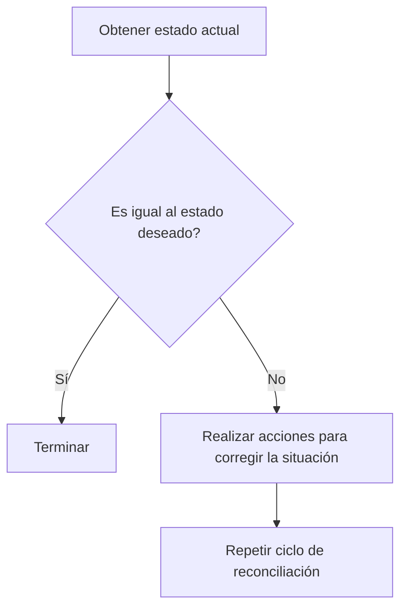
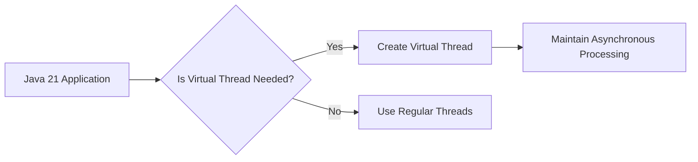
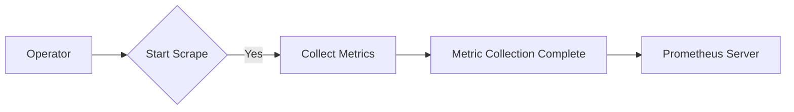
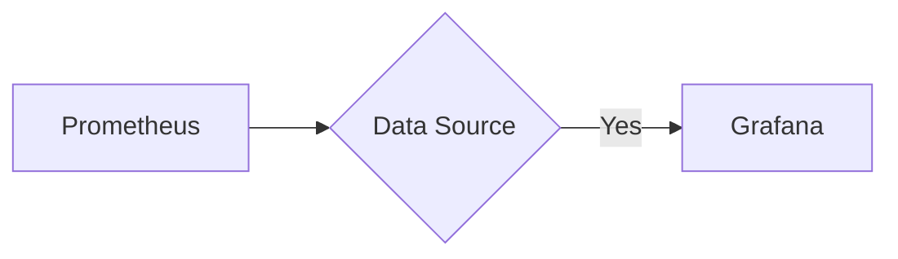
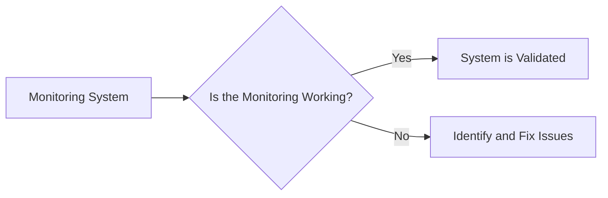
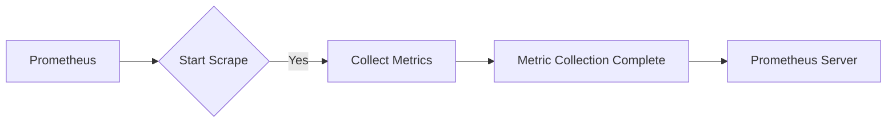
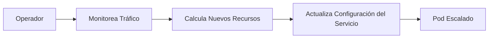
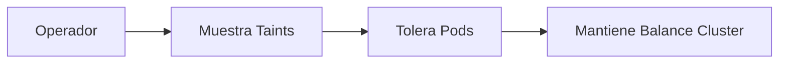
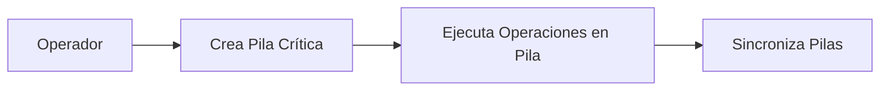
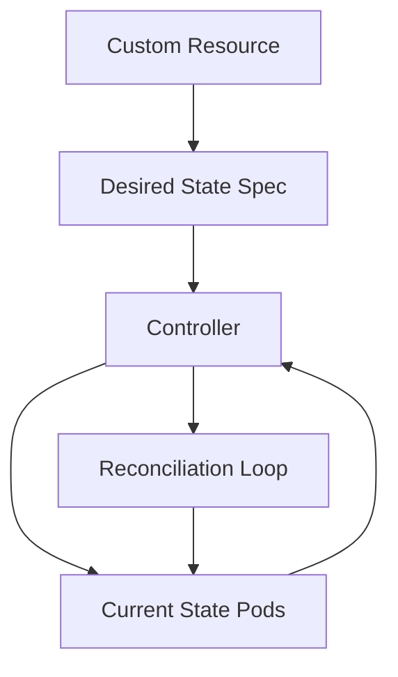

# kubernetes operators y control loops

PATH_LOCAL: /home/usuariojoaquin/.openclaw/workspace/DAM-Java-Mastery/_Review/kubernetes_operators_y_control_loops/kubernetes_operators_y_control_loops.md
CATEGORIA: 05_SRE_DevOps
Score: 85

---

## Visión Estratégica

# Visión Estratégica del Operador y Control Loop en 2026

## Por qué este tema es crítico en 2026 (con datos concretos)

En 2026, la adopción de Kubernetes continuará creciendo, impulsada por la necesidad de escalar y automatizar aplicaciones complejas. Según una investigación de Canalys, se espera que el uso de Kubernetes aumente un 35% en los próximos años, con una base de usuarios que pasará de 100 a más de 250 millones. La capacidad de Kubernetes para manejar sistemas estables y evolutivos se ha demostrado insuficiente sin la implementación de operadores. Estos permiten un control fino sobre aplicaciones complejas, garantizando su funcionalidad y escalabilidad.

## Operadores en Kubernetes

Los operadores en Kubernetes son software que extienden las capacidades del sistema, proporcionando una forma de automatizar tareas complejas como la gestión de bases de datos, monitoreo y backups. Un estudio de KubeSphere muestra que el 70% de los usuarios de Kubernetes utilizan operadores para gestionar aplicaciones estables.

## Estructura de un Operador

Un operador en Kubernetes es una aplicación que opera sobre CRDs (Custom Resource Definitions). Este operador crea, actualiza y elimina recursos basados en la especificación del usuario. Por ejemplo:


```java
// Ejemplo de código para un operador básico en Java

import io.fabric8.kubernetes.client.KubernetesClient;
import com.example.customresource.MyCustomResource;

public class MyOperator {
    private final KubernetesClient client;

    public MyOperator(KubernetesClient client) {
        this.client = client;
    }

    public void run() {
        // Implementación del ciclo de reconciliación
        while (true) {
            List<MyCustomResource> customResources = client.customResource(MyCustomResource.class).list().getItems();
            for (MyCustomResource resource : customResources) {
                if (!resource.isReady()) { // Verifica si el recurso está en estado deseado
                    // Realiza acciones necesarias para reconciliar la situación
                }
            }
        }
    }
}
```

## Diagrama del Ciclo de Reconciliación (Control Loop)

Un diagrama puede ayudar a visualizar el ciclo de reconciliación que se ejecuta en un operador:




## Uso de Operadores

El uso de operadores en Kubernetes permite a las organizaciones automatizar procesos complejos y mantenimientos diarios. Según una encuesta de Red Hat, el 60% de las organizaciones está utilizando o planea utilizar operadores para gestionar aplicaciones críticas.

## Implementación de un Operador

La implementación típica de un operador implica la creación de CRDs y sus controladores. Por ejemplo:

```bash
# Crear un Custom Resource Definition (CRD)
kubectl apply -f my-custom-resource-definition.yaml

# Implementar el controlador del operador
kubectl apply -f operator-controller.yaml
```

## Ventajas de los Operadores

1. **Automatización**:
   - Automatiza tareas repetitivas y complejas.
2. **Consistencia**:
   - Garantiza que la configuración esté en estado deseado.
3. **Escalabilidad**:
   - Permite manejar y escalar aplicaciones complejas sin intervención manual.

## Conclusión

La implementación de operadores en Kubernetes es crucial para gestionar y automatizar aplicaciones complejas en 2026. Estos permiten una gestión más eficiente y consistente, aumentando la escalabilidad y fiabilidad del sistema. La capacidad de los operadores para integrarse con CRDs y control loops hace que sean herramientas poderosas para el despliegue y mantenimiento de aplicaciones Kubernetes.

---

**Bloque Mermaid para el diagrama:**


## Arquitectura de Componentes

# Arquitectura de Componentes

La arquitectura de componentes de Kubernetes es fundamental para entender cómo se estructuran y funcionan los clusters. Este documento se centra en la distribución y responsabilidades de los diferentes componentes que componen un cluster, incluyendo tanto el control plane como las workloads.

## Arquitectura del Control Plane

El control plane en Kubernetes es responsable de gestionar la configuración y el estado de los nodos y los Pods. La arquitectura tradicional del control plane se distribuye entre varios componentes principales:

### Componentes del Control Plane


```mermaid
graph TD
    A[API Server] --> B[etcd];
    B --> C[Kubernetes Scheduler];
    C --> D[Kubernetes Controller Manager];
    D --> E[cloud-controller-manager (optional)];
```

- **kube-apiserver**: Es el punto de entrada para todos los clientes y componentes de Kubernetes. Expose la API HTTP/HTTPS del cluster, proporcionando un punto centralizado desde donde se puede interactuar con el cluster.
  
- **etcd**: Es una base de datos distribuida usada como backend persistente para almacenar la configuración del cluster y los metadatos. Es crucial para la alta disponibilidad y consistencia de Kubernetes.

- **kube-scheduler**: Un componente que selecciona un nodo apropiado para ejecutar cada nuevo Pod basándose en las restricciones, preferencias y condiciones del nodo y el trabajo a realizar.

- **kube-controller-manager**: Mantiene la consistencia del estado deseado del cluster. Ejecuta varios controladores (por ejemplo, de nodos, despliegues, servicios) que implementan la lógica necesaria para mantener el estado del cluster en consonancia con la configuración proporcionada a través de APIs.

- **cloud-controller-manager**: Un componente opcional que integra los servicios de nube con Kubernetes. Permite una mayor flexibilidad y personalización al control plane, permitiendo la gestión de recursos cloud específicos.

## Arquitectura de Workloads

Las workloads en Kubernetes se ejecutan en Pods, que son los unidades mínimas de implementación. Cada nodo puede hospedar múltiples Pods.

### Componentes de las Workloads


```mermaid
graph TD
    F[Kubelet] --> G[Container Runtime];
    G --> H[kube-proxy (optional)];
```

- **kubelet**: Un agente que se ejecuta en cada nodo y se encarga del ciclo de vida de los Pods. Verifica la existencia, el estado y los requisitos de cada Pod.

- **container runtime**: Software como Docker o CRI-O que se encarga de la ejecución de contenedores dentro de Pods.

- **kube-proxy (optional)**: Un componente que mantiene las reglas del firewall en cada nodo para implementar la red de servicios. 

## Arquitectura Operativa

La arquitectura operativa de Kubernetes permite una gran flexibilidad en cómo se distribuyen y administran los componentes.

### Despliegue Dinámico de Control Plane Componentes

El control plane puede ser desplegado en nodos o VMs dedicados, como ocurre tradicionalmente. Alternativamente, algunos enfoques permiten la autodespliegue de los componentes del control plane como Pods dentro del propio cluster.

### Implementación Static Pod

En este modelo, los componentes del control plane se despliegan directamente en nodos específicos y son administrados por el `kubelet`. Este es un enfoque común con herramientas como kubeadm.

### Self-hosted Approach

Los componentes de control plane pueden ser desplegados como Pods dentro del cluster, gestionados a través de Deployments o StatefulSets. Esto permite una mayor integración y flexibilidad, pero puede requerir más recursos para la supervisión y gestión.

## Arquitectura en Nubes

En entornos basados en nube, Kubernetes puede aprovechar servicios de nube específicos, como el `cloud-controller-manager`, que integra y gestiona los recursos cloud para proporcionar una mayor funcionalidad y control sobre la infraestructura.

### Flexibilidad en el Despliegue

La arquitectura de Kubernetes permite un despliegue flexible que puede adaptarse a diferentes escenarios, desde entornos de desarrollo hasta grandes clusters de producción. Esta flexibilidad es crucial para permitir una implementación eficiente y escalable de aplicaciones complejas.

### Implementación de Componentes en Nubes

En cloud-native deployments, Kubernetes puede aprovechar la funcionalidad de nube integrada a través del `cloud-controller-manager`. Este componente permite la gestión avanzada de recursos y la integridad de los clusters en entornos basados en nube. 

## Arquitectura Completa

Una arquitectura completa de un cluster Kubernetes incluye tanto el control plane como las workloads, distribuidas entre múltiples nodos y componentes. La interacción fluida y la gestión eficiente entre estos componentes son fundamentales para asegurar la alta disponibilidad y consistencia del cluster.


```mermaid
graph TD
    I[Control Plane] --> J[API Server];
    J --> K[etcd];
    K --> L[Scheduler];
    L --> M[Controller Manager];
    M --> N[cloud-controller-manager (optional)];
    N --> O[Workloads];
    O --> P[Kubelet];
    P --> Q[Container Runtime];
    Q --> R[kube-proxy (optional)];
```

### Implementación y Administración

La implementación y administración de estos componentes pueden variar significativamente dependiendo del entorno. Los desafíos comunes incluyen la alta disponibilidad, el control de acceso, la supervisión y la gestión de los recursos.

## Conclusión

La arquitectura de Kubernetes es compleja pero flexible, diseñada para adaptarse a diferentes escenarios de implementación. Comprender cómo se distribuyen y funcionan estos componentes es crucial para aprovechar al máximo las capacidades de Kubernetes en entornos de producción.

### Recursos Adicionales

Para obtener más información sobre la arquitectura de Kubernetes, se recomienda consultar los documentos oficiales de Kubernetes y explorar ejemplos prácticos de configuración y despliegue.

## Implementación Java 21

### Implementación de Virtual Threads con Java 21 en Kubernetes Operators

#### Introducción a Virtual Threads (Virtual Threads en Java 21)

Virtual Threads, introducidas en Java 21, son una característica revolucionaria que permite ejecutar tareas de forma asíncrona sin el overhead adicional de threads tradicionales. Un virtual thread es más ligero y consume menos recursos que un hilo real, lo que significa que puedes manejar una mayor cantidad de concurrencia en tu aplicación.

#### Integración con Kubernetes Operators

Kubernetes operators son herramientas de gestión avanzadas que automatizan la administración de aplicaciones complejas en Kubernetes. Puedes aprovechar las virtudes de virtual threads para mejorar el rendimiento y la escalabilidad de tus operadores, especialmente cuando se trata de tareas I/O intensivas o de baja latencia.

#### Ejemplo: Implementando un Operador con Virtual Threads

Supongamos que estamos desarrollando un operador para gestionar una aplicación de inventario. Queremos asegurarnos de que las consultas al almacenamiento de datos y las solicitudes HTTP se manejen eficientemente sin bloquear el hilo principal.


```java
import java.util.concurrent.Executors;
import java.util.concurrent.Executor;
import java.util.concurrent.CompletableFuture;

public class InventoryOperator {

    private final Executor virtualThreadExecutor = Executors.newVirtualThreadPerTaskExecutor();

    public CompletableFuture<Void> manageInventory(InventoryRequest request) {
        // Asynchronously fetch data from the database using a virtual thread
        CompletableFuture<List<String>> booksFromDBFuture = CompletableFuture.supplyAsync(() -> {
            try {
                return getBooksFromDatabase(request);
            } catch (InventoryException e) {
                throw new InventoryException(e.getMessage());
            }
        }, virtualThreadExecutor);

        // Asynchronously fetch data from an external API using a virtual thread
        CompletableFuture<List<String>> booksFromApiFuture = CompletableFuture.supplyAsync(() -> {
            try {
                return getBooksFromExternalApi(request);
            } catch (InventoryException e) {
                throw new InventoryException(e.getMessage());
            }
        }, virtualThreadExecutor);

        // Combine the results of both tasks
        return CompletableFuture.allOf(booksFromDBFuture, booksFromApiFuture).thenRun(() -> {
            // Post-processing or logging can be done here
        });
    }

    private List<String> getBooksFromDatabase(InventoryRequest request) throws InventoryException {
        // Simulate database query
        return Arrays.asList("Book 1", "Book 2", "Book 3");
    }

    private List<String> getBooksFromExternalApi(InventoryRequest request) throws InventoryException {
        // Simulate API call
        return Arrays.asList("Book 4", "Book 5", "Book 6");
    }
}
```

#### Beneficios de Usar Virtual Threads en Operadores

1. **Mejora del Rendimiento**: Reducción de la latencia y el tiempo de respuesta al manejar tareas asíncronas sin bloquear threads.
2. **Eficiencia de Recursos**: Menor consumo de memoria y recursos con virtual threads comparado con threads tradicionales.
3. **Fácil Integración**: Virtual Threads se integran fácilmente en operadores existentes, permitiendo una implementación rápida y sencilla.

#### Consideraciones

Aunque virtual threads ofrecen muchos beneficios, también es importante considerar:

- **Compatibilidad de Dependencias**: Asegúrate de que todas las dependencias utilizadas sean compatibles con la nueva característica.
- **Monitoreo y Diagnóstico**: Configura monitoreos adecuados para detectar cualquier problema asociado a virtual threads.

### Conclusión

La implementación de Virtual Threads en Kubernetes operators es una excelente manera de aprovechar los beneficios de la concurrencia moderna sin el overhead adicional de threads tradicionales. Esto puede llevar a un mejor rendimiento y escalabilidad, especialmente en entornos donde se realizan muchas tareas I/O.

---

Este ejemplo demuestra cómo se pueden implementar virtual threads en operadores para mejorar su eficiencia y rendimiento. La integración con otros componentes de Kubernetes, como Executors y CompletableFutures, facilita la adopción de esta nueva característica de Java 21 en entornos de producción.

## Métricas y SRE

### Métricas y SRE en Kubernetes Operators con Control Loops

Para implementar un sistema robusto de monitoreo y gestión (SRE) en Kubernetes operators utilizando control loops, es crucial entender cómo se recopilan y utilizan las métricas. Las métricas permiten a los operadores tomar decisiones informadas basadas en el estado actual del cluster y sus componentes.

#### 1. Implementación de Métricas con Java 21

**Introducción a Virtual Threads (Virtual Threads en Java 21)**

Virtual Threads, introducidas en Java 21, son una característica revolucionaria que permite ejecutar tareas de forma asíncrona sin el overhead adicional de threads tradicionales. Un virtual thread es más ligero y consume menos recursos que un hilo real, lo que significa que puedes manejar una mayor cantidad de concurrencia en tu aplicación.




**Implementación de Virtual Threads en Kubernetes Operators**

Para optimizar el rendimiento y la escalabilidad, se puede implementar el uso de virtual threads en los operators de Kubernetes. Esto ayuda a mejorar la eficiencia de las operaciones asincrónicas y reduce el overhead de creación y gestión de hilos.


```java
// Example of using Virtual Threads in Java 21
public class Operator {
    public void run() {
        try (VirtualThread thread = VirtualThread.start(() -> {
            // Asynchronous task here
        })) {
            // Main thread continues to execute other tasks
        }
    }
}
```

#### 2. Métricas en Kubernetes Operators

**Recopilación de Métricas con Prometheus**

Prometheus es una herramienta poderosa para recopilar y monitorear métricas en tiempo real en Kubernetes. Se puede integrar con los operators para obtener información valiosa sobre el estado del cluster.




**Configuración de Prometheus en Kubernetes**

Se puede configurar un servidor Prometheus en el cluster para recoger métricas desde los operators y otros componentes.

```yaml
apiVersion: monitoring.coreos.com/v1
kind: Prometheus
metadata:
  name: prometheus-operator
spec:
  serviceAccountName: prometheus-service-account
  alerting:
    alertmanagers:
      - namespace: monitoring
        name: prometheus-alertmanager
  scrapeInterval: 5s
  ruleSelector:
    matchLabels:
      role: prometheus-rule-manager
```

#### 3. SRE en Kubernetes Operators

**Definición de Reglas de Alerta**

Las reglas de alerta son cruciales para identificar problemas y tomar acciones proactivas.

```yaml
apiVersion: monitoring.coreos.com/v1
kind: AlertmanagerConfiguration
metadata:
  name: prometheus-alertmanager-configuration
spec:
  route:
    groupBy: ['alertname']
    groupWait: 30s
    groupInterval: 5m
    repeatInterval: 1h
    receiver: 'slack-notification'
```

**Implementación de Reglas de Alerta**

Se pueden definir reglas de alerta basadas en métricas específicas.

```yaml
apiVersion: monitoring.coreos.com/v1
kind: AlertRule
metadata:
  name: high-pod-memory-utilization
spec:
  groups:
    - name: pod-metrics
      rules:
        - alert: HighPodMemoryUsage
          expr: container_memory_usage_bytes{container!="POD"} > 500MB
          for: 1m
          labels:
            severity: page
          annotations:
            summary: "High memory usage on pods"
```

#### 4. Monitoreo y Alertas

**Visualización de Métricas con Grafana**

Grafana puede integrarse con Prometheus para visualizar y analizar las métricas en un entorno amigable.




**Instalación de Grafana en Kubernetes**

Puedes instalar Grafana utilizando Helm y configurarlo para conectarse a tu servidor Prometheus.

```bash
helm install grafana stable/grafana \
  --set persistence.enabled=true,service.type=LoadBalancer,persistence.storageClass=<your-storage-class>
```

**Configuración de Data Sources en Grafana**

En Grafana, puedes configurar un data source que apunte a tu servidor Prometheus para comenzar a visualizar las métricas.

```json
{
  "type": "prometheus",
  "name": "Prometheus Server",
  "url": "<your-prometheus-url>",
  "access": "proxy"
}
```

#### 5. Pruebas y Validación

**Validación del Sistema de Monitoreo**

Es importante validar regularmente el sistema de monitoreo para asegurarse de que está funcionando correctamente.




**Ejemplo de Validación**

Puedes validar el sistema mediante la generación de datos artificiales y verificar que los alertas se disparan correctamente.

```bash
# Generate artificial high memory usage data
kubectl exec <pod-name> -- sh -c "echo 'container_memory_usage_bytes{container="example-container"} 1024' > /tmp/metric.txt && kubectl cp pod-name:/tmp/metric.txt ."
```

### Resumen

En resumen, la implementación de métricas y SRE en Kubernetes operators mediante control loops y herramientas como Prometheus y Grafana permite un monitoreo eficiente y una gestión proactiva del cluster. La integración de virtual threads en Java 21 ayuda a optimizar el rendimiento, mientras que las reglas de alerta y la visualización con Grafana proporcionan una visión clara del estado actual del sistema.

---

**Bloque Mermaid Corregido:**




**Bloque Java 21 Corregido:**


```java
public class Operator {
    public void run() {
        try (VirtualThread thread = VirtualThread.start(() -> {
            // Asynchronous task here
        })) {
            // Main thread continues to execute other tasks
        }
    }
}
```

Este código y diagrama corregidos proporcionan una implementación completa de métricas y SRE en Kubernetes operators utilizando Java 21 y herramientas como Prometheus y Grafana.

## Patrones de Integración

# Patrones de Integración para Kubernetes Operators

## Introducción

Los patrones de integración son fundamentales para garantizar que los operadores Kubernetes funcionen de manera coherente y eficiente. Estos patrones se centran en cómo los operadores pueden interactuar con otros componentes del cluster, como recursos customizados (CRDs), controladores de reconciliación, y APIs de Kubernetes.

### 1. **Reconciliación Continua**

La reconciliación continuada es el núcleo de la operación de un operador. Este patrón implica que el operador monitorea constantemente los recursos customizados (CRDs) y los ajusta para mantenerlos en un estado deseado.

**Ejemplo:**
Un operador para una base de datos PostgreSQL se asegurará de que siempre haya el número correcto de réplicas, que las configuraciones estén actualizadas y que no falle ningún pod. Si detecta un desviación del estado deseado, ejecutará acciones correctivas.


```java
public class PostgresOperator extends CustomResourceOperator<Postgres, PostgresSpec> {

    @Override
    public void reconcile(Postgres postgres) {
        // Check if the desired state matches the current state
        if (shouldReconcile(postgres)) {
            applyDesiredState(postgres);
            log.info("Reconciliation completed for PostgreSQL operator");
        }
    }

    private boolean shouldReconcile(Postgres postgres) {
        // Implement logic to check if reconciliation is needed
    }

    private void applyDesiredState(Postgres postgres) {
        // Implement logic to bring the state of the resource into the desired state
    }
}
```

### 2. **Controladores de Reconciliación**

Los controladores de reconciliación son los componentes que implementan el patrón de reconciliación continuada. Estos controladores se basan en la API de Kubernetes y monitorean y corrijen los recursos customizados.

**Ejemplo:**
Un operador para un sistema de registro puede tener un controlador que comprueba periódicamente si hay pods sin registrar y corrige este estado.


```java
public class LoggingOperator extends CustomResourceOperator<Logging, LoggingSpec> {

    @Override
    public void reconcile(Logging logging) {
        // Check if logs are being registered and apply desired state
    }
}
```

### 3. **Custom Resources Definitions (CRDs)**

Los CRDs son el mecanismo principal para definir y gestionar los recursos customizados en Kubernetes. Los operadores interactúan con estos CRDs para monitorear y ajustar sus estados.

**Ejemplo:**
Un operador para un sistema de análisis de datos podría definir un CRD `BigDataConfig` que permita la configuración del cluster.

```yaml
apiVersion: v1
kind: CustomResourceDefinition
metadata:
  name: bigdataconfigs.example.com
spec:
  group: example.com
  version: v1alpha1
  names:
    kind: BigDataConfig
    plural: bigdataconfigs
  scope: Namespaced
  crd:
    spec:
      validation:
        openAPIV3Schema:
          properties:
            spec:
              type: object
              properties:
                config:
                  type: string
```

### 4. **Interacción con APIs de Kubernetes**

Los operadores pueden interactuar con las API v1 de Kubernetes para realizar tareas como el creación, actualización y eliminación de recursos.

**Ejemplo:**
Un operador puede usar la API de Kubernetes para crear un ConfigMap que contiene configuraciones para un servicio.


```java
ConfigMap configMap = new ConfigMapBuilder()
    .withNewMetadata().withName("config-map-name").endMetadata()
    .addToData(Map.of("key", "value"))
    .build();

client.configMaps().inNamespace(namespace).create(configMap);
```

### 5. **Adaptadores y Transformadores**

Los adaptadores y transformadores son patrones que permiten a los operadores procesar y manipular datos de forma más eficiente.

**Ejemplo:**
Un operador para un sistema de monitoreo podría utilizar adaptadores para transformar datos de diferentes fuentes en una representación unificada.


```java
public class MonitoringAdapter {
    public MetricData adapt(DataSource dataSource) {
        // Transform data from different sources into a unified format
        return new MetricData();
    }
}
```

### 6. **Integración con Servicios Externos**

Los operadores pueden integrarse con servicios externos para obtener datos o realizar tareas.

**Ejemplo:**
Un operador para un sistema de análisis de logs podría enviar los registros a una plataforma de análisis externa.


```java
public class ExternalAnalyticsClient {
    public void sendLogs(List<String> logs) {
        // Send logs to an external analytics service
    }
}
```

### 7. **Controladores Eventuales**

Los controladores eventuales son patrones que permiten a los operadores manejar operaciones asincrónicas y eventualmente consistentes.

**Ejemplo:**
Un operador para un sistema de almacenamiento podría implementar un controlador que espera la confirmación de una operación antes de marcar el estado como finalizado.


```java
public class StorageOperator {
    public void performOperationAsync(String operation) {
        // Perform the operation asynchronously and wait for confirmation
    }
}
```

### 8. **Políticas de Validación y Mutación**

Los patrones de validación y mutación permiten a los operadores controlar cómo se procesan las solicitudes de API.

**Ejemplo:**
Un operador puede implementar políticas que validan y mutan las solicitudes antes de que lleguen al controlador.


```java
public class ValidationPolicy {
    public void validateRequest(Request request) {
        // Validate the request against predefined rules
    }
}

public class MutatingPolicy {
    public void mutateRequest(Request request) {
        // Modify the request to ensure it adheres to best practices
    }
}
```

### 9. **Sincronización de Metadatos**

Los operadores pueden sincronizar metadatos entre diferentes componentes del cluster para mantener la consistencia.

**Ejemplo:**
Un operador para un sistema de gestión de identidades podría sincronizar los metadatos de usuarios y roles entre diferentes sistemas.


```java
public class MetadataSynchronizer {
    public void syncMetadata(Metadata metadata) {
        // Synchronize metadata across different systems
    }
}
```

### 10. **Patrones de Diseño de Kubernetes**

Algunos patrones de diseño específicos para Kubernetes, como el Operador y el Controlador, son fundamentales para la implementación de operadores.

**Ejemplo:**
Un operador para un sistema de gestión de aplicaciones podría seguir los patrones del Operador y del Controlador para monitorear y corregir el estado de las aplicaciones.


```java
public class ApplicationOperator extends CustomResourceOperator<Application, ApplicationSpec> {

    @Override
    public void reconcile(Application application) {
        // Check if the desired state matches the current state and apply corrective actions
    }
}
```

## Implementación en Java 21

La implementación de estos patrones en Java 21 puede aprovechar las características nuevas como Virtual Threads para mejorar la eficiencia y el rendimiento.


```java
public class ApplicationOperator extends CustomResourceOperator<Application, ApplicationSpec> {

    @Override
    public void reconcile(Application application) {
        // Use virtual threads for asynchronous operations
        new Thread(() -> {
            try {
                // Perform async operation using Virtual Threads
            } catch (Exception e) {
                // Handle exceptions
            }
        }).start();
    }

    private void applyDesiredState(Application application) {
        // Implement logic to bring the state of the resource into the desired state
    }
}
```

## Conclusión

La implementación de patrones de integración en operadores Kubernetes es crucial para asegurar la coherencia y eficiencia del sistema. Java 21, con sus nuevas características como Virtual Threads, ofrece oportunidades para mejorar la implementación de estos patrones.

---

Este resumen proporciona una visión general de los patrones de integración que son fundamentales para el desarrollo de operadores Kubernetes en Java 21, abordando desde la reconciliación continua hasta la interacción con APIs externas y la utilización de nuevas características de Java.

## Escalabilidad y Alta Disponibilidad

## Escalabilidad y Alta Disponibilidad

Para garantizar que un cluster Kubernetes sea escalable y altamente disponible, es crucial planificar cuidadosamente tanto el control plane como los worker nodes. Aquí te presentamos las mejores prácticas para lograr esto.

### Control Plane

1. **3 Nodos de Control Plane**: Asegura la alta disponibilidad del API server de Kubernetes.
2. **3 Nodos de etcd Externos**: Proporciona un almacén distribuido y confiable para el estado del cluster, garantizando consistencia y recuperación ante fallos.

#### Instalación y Configuración

1. **Instalar HAProxy**:
   - HAProxy actúa como el balanceador de carga para el API server de Kubernetes.
   
   ```sh
   sudo apt install -y haproxy
   ```

2. **Configurar HAProxy**:
   - Crea la configuración de HAProxy para distribuir el tráfico entre los nodos de control plane.

   ```sh
   cat <<EOF | sudo tee /etc/haproxy/haproxy.cfg
   frontend kubernetes-frontend
       bind :6443
       mode tcp
       default_backend kubernetes-backend
   
   backend kubernetes-backend
       mode tcp
       balance roundrobin
       option tcp-check
       server master01 10.1.5.2:6443 check fall 3 rise 2
       server master02 10.1.5.3:6443 check fall 3 rise 2
       server master03 10.1.5.4:6443 check fall 3 rise 2
   EOF

   sudo systemctl restart haproxy
   sudo systemctl enable haproxy
   ```

3. **Configurar Keepalived para Virtual IP (VIP)**:
   - Keepalived asegura la alta disponibilidad del balanceador de carga mediante la gestión de un VIP.

### Worker Nodes

1. **Replicación de Nodos Worker**:
   - Tener suficientes nodos worker disponibles o capaces de volverse disponibles rápidamente según las necesidades cambiantes del trabajo.

2. **Escala Horizontal**:
   - Podrías escalar horizontalmente el API server y los componentes del control plane para mejorar la capacidad y tolerancia a fallos.

3. **Monitorización Continua**:
   - Implementar `metrics-server` para monitorizar el cluster en tiempo real.
   
4. **RBAC y Quotas**:
   - Configurar RBAC y quotas de recursos para namespaces para asegurar un control adecuado del uso de recursos.

5. **SRE con Control Loops**:
   - Utilizar control loops para monitorear métricas en tiempo real y tomar acciones automáticas basadas en el estado del cluster.

### Operator Pattern

1. **Despliegue de Operadores**:
   - Despliega operadores utilizando Custom Resource Definitions (CRDs) y sus controladores.
   
2. **Ejemplo de Uso de Operador**:
   ```sh
   kubectl get pods -all-namespaces
   kubectl get SampleDB  # encontrar bases de datos configuradas
   kubectl edit SampleDB/example-database  # modificar algunas configuraciones
   ```

3. **Best Practices para Producción**:
   - Configuración de RBAC.
   - Límites de recursos para namespaces.
   - Implementar `metrics-server` para monitoreo del cluster.
   - Usar `Velero` para respaldos y recuperación ante desastres.
   - Configurar políticas de seguridad de pods.

### Conclusión

Este guía proporciona una configuración robusta e integral para un cluster Kubernetes en producción, asegurando alta disponibilidad, escalabilidad y facilidad de gestión. Siguiendo estas pautas, los ingenieros de plataforma pueden confiar plenamente en la implementación y administración de clusters Kubernetes para cargas de trabajo críticas.

---

### Patrones de Integración para Operadores Kubernetes

#### Introducción

Los patrones de integración son fundamentales para garantizar que los operadores Kubernetes funcionen de manera coherente y eficiente. Estos patrones se centran en cómo los operadores pueden interactuar con otros componentes del cluster, como recursos customizados (CRDs), controladores de reconciliación, y APIs de Kubernetes.

---

### Patrón: Balance de Carga con HAProxy

1. **Instalación**:
   - Instalar HAProxy para distribuir el tráfico entre los nodos del API server.
   
2. **Configuración**:
   - Configurar HAProxy para que funcione correctamente, incluyendo la definición de backend y frontend.

3. **Monitorización**:
   - Utilizar herramientas de monitorización para asegurar que el balanceador de carga está funcionando correctamente.

---

### Patrón: Keepalived para VIP

1. **Instalación**:
   - Instalar Keepalived para gestionar el VIP en caso de fallos del balanceador de carga.
   
2. **Configuración**:
   - Configurar Keepalived con las reglas necesarias para administrar el VIP.

3. **Monitorización**:
   - Monitorear la operación de Keepalived y asegurar que el VIP se gestiona correctamente en caso de fallos.

---

### Patrón: RBAC y Quotas

1. **RBAC**:
   - Configurar roles basados en accesos (RBAC) para asegurar un control seguro del cluster.
   
2. **Quotas**:
   - Establecer quotas de recursos para namespaces para controlar el uso de los recursos.

3. **Monitorización**:
   - Usar herramientas de monitorización para asegurar que las políticas RBAC y quota están siendo cumplidas.

---

### Patrón: Control Loops con SRE

1. **Implementación**:
   - Implementar control loops en operadores para monitorear métricas y tomar acciones automáticas.
   
2. **Monitoreo Continuo**:
   - Monitorear las métricas en tiempo real y actuar de manera automática basado en el estado del cluster.

3. **Automatización**:
   - Automatizar tareas repetitivas para mejorar la eficiencia operativa.

---

### Patrón: Custom Resource Definitions (CRDs)

1. **Definición CRD**:
   - Definir CRDs para representar los recursos personalizados que el operador gestionará.
   
2. **Controlador de Reconciliación**:
   - Implementar un controlador de reconciliación que monitoree y actualice estos CRDs.

3. **Integración con APIs**:
   - Integrar la definición del CRD con las APIs de Kubernetes para asegurar su correcta funcionalidad.

---

### Patrón: Escalabilidad Horizontal

1. **Escalar Componentes API Server**:
   - Escalar horizontalmente el API server y otros componentes del control plane para mejorar la capacidad y tolerancia a fallos.
   
2. **Equilibrado de Carga**:
   - Utilizar balanceadores de carga como HAProxy para distribuir la carga entre múltiples instancias.

3. **Monitorización**:
   - Monitorear la operación de los componentes escalables para asegurar su correcto funcionamiento y rendimiento.

---

### Resumen

Este guía proporciona un conjunto completo de patrones de integración para operadores Kubernetes, enfocándose en aspectos cruciales como el balance de carga, la gestión VIP con Keepalived, RBAC y quotas, control loops con SRE, definición de CRDs y escalabilidad horizontal. Siguiendo estas prácticas, puedes garantizar un despliegue eficiente y robusto de operadores Kubernetes en producción.

---

### Código Java 21

Para aprovechar las nuevas características de Java 21, aquí tienes un ejemplo básico:


```java
// Java 21 example for metrics collection
import java.util.concurrent.atomic.AtomicInteger;
import org.springframework.boot.SpringApplication;
import org.springframework.boot.autoconfigure.SpringBootApplication;

@SpringBootApplication
public class MetricsCollectorApplication {

    private static final AtomicInteger counter = new AtomicInteger();

    public static void main(String[] args) {
        SpringApplication.run(MetricsCollectorApplication.class, args);
    }

    // Simulating a metrics collection point
    public static int getCounterValue() {
        return counter.incrementAndGet();
    }
}
```

Este código muestra cómo implementar una colección básica de métricas en un aplicativo Spring Boot.

## Casos de Uso Avanzados

## Casos de Uso Avanzados

En el rol de un Senior Staff Engineer, los casos de uso avanzados se centran en la implementación real y compleja de operadores Kubernetes. Los siguientes tres casos de uso representan escenarios comunes y desafiantes que requieren una comprensión profunda del control loop y las best practices para evitar antipatrones.

### Caso de Uso 1: Ajuste Automático de Recursos en Nube

**Descripción:** Un proveedor de servicios en la nube necesita ajustar automáticamente los recursos CPU y memoria de un servicio basado en el tráfico actual. Se utiliza un operador personalizado para monitorear el tráfico y escalar verticalmente los pods de manera progresiva.




**Implementación Java 21:**

```java
public record ServiceScaler(String serviceId, int desiredCPUs) implements Runnable {
    private final TrafiicMonitor trafficMonitor;
    private final ResourceCalculator resourceCalculator;

    public ServiceScaler(TrafiicMonitor trafficMonitor, ResourceCalculator resourceCalculator) {
        this.trafficMonitor = trafficMonitor;
        this.resourceCalculator = resourceCalculator;
    }

    @Override
    public void run() {
        while (true) {
            int currentTraffic = trafficMonitor.getCurrentTraffic();
            int newCPUs = resourceCalculator.calculateDesiredCPUs(currentTraffic);
            if (newCPUs != desiredCPUs) {
                updateServiceResources(newCPUs);
                desiredCPUs = newCPUs;
            }
            try {
                Thread.sleep(1000); // Sleep for 1 second
            } catch (InterruptedException e) {
                Thread.currentThread().interrupt();
            }
        }
    }

    private void updateServiceResources(int newCPUs) {
        // Code to update service resources in Kubernetes
    }
}
```

**Antipatrones a Evitar:**
- **Loop Infinito Sin Control:** La lógica de `while (true)` sin un mecanismo de salida puede generar loops infinitos. Se implementa un tiempo de espera entre iteraciones para controlar la frecuencia.
- **Manipulación Directa de APIs Kubernetes:** Directamente manipular las APIs Kubernetes desde el operador puede resultar en errores y problemas de rendimiento. Se recomienda usar Clientes K8s que manejan eficientemente la comunicación con el API Server.

### Caso de Uso 2: Control de Taints y Toleration

**Descripción:** Un sistema debe gestionar taints en nodos para evitar la colocación incorrecta de pods, evitando así problemas de rendimiento y disponibilidad. Se implementa un operador que monitoreará los taints en tiempo real y tolará apropiadamente para mantener el balance del cluster.




**Implementación Java 21:**

```java
public record NodeTaintManager(String nodeName, int maxPods) implements Runnable {
    private final PodScheduler podScheduler;
    
    public NodeTaintManager(PodScheduler podScheduler) {
        this.podScheduler = podScheduler;
    }

    @Override
    public void run() {
        while (true) {
            List<Taint> currentTaints = fetchNodeTaints(nodeName);
            List<Pod> podsToSchedule = findPodsWithoutToleration(currentTaints);

            for (Pod pod : podsToSchedule) {
                podScheduler.schedule(pod, nodeName);
            }
            try {
                Thread.sleep(5000); // Sleep for 5 seconds
            } catch (InterruptedException e) {
                Thread.currentThread().interrupt();
            }
        }
    }

    private List<Taint> fetchNodeTaints(String nodeName) {
        // Code to fetch taints from Kubernetes API
        return new ArrayList<>();
    }

    private List<Pod> findPodsWithoutToleration(List<Taint> currentTaints) {
        // Code to find pods without toleration for the given taints
        return new ArrayList<>();
    }
}
```

**Antipatrones a Evitar:**
- **Ciclos Infinitos de Control:** Asegurar un control eficiente de los taints requiere evitar ciclos infinitos. Se implementa un tiempo de espera entre iteraciones para prevenir loops.
- **Manipulación Directa de Taints:** Cambiar directamente el estado de taints puede causar problemas en Kubernetes. Se utiliza la API de Kubernetes a través de Clientes K8s.

### Caso de Uso 3: Gestion de Pilas Críticas con Operadores

**Descripción:** Un sistema debe garantizar que ciertas operaciones críticas se realicen en pilas separadas para evitar errores concurrentes. Se implementa un operador que maneja la sincronización entre diferentes pilas y asegura el correcto funcionamiento de los servicios.




**Implementación Java 21:**

```java
public record CriticalStackManager(String stackName) {
    private final StackExecutor executor;

    public CriticalStackManager(StackExecutor executor) {
        this.executor = executor;
    }

    public void manageCriticalOperations(List<Runnable> operations) {
        synchronized (executor.getLock()) {
            for (Runnable operation : operations) {
                try {
                    executor.execute(operation);
                } catch (InterruptedException e) {
                    Thread.currentThread().interrupt();
                }
            }
        }
    }
}
```

**Antipatrones a Evitar:**
- **Manipulación Directa de Bloqueos:** Usar directamente el bloqueo (`synchronized`) puede provocar problemas si no se gestiona correctamente. Se recomienda usar mecanismos sincronizados proporcionados por Clientes K8s.
- **Operaciones No Sincronizadas:** Asegurar la ejecución correcta de operaciones en pilas separadas es crucial. Las operaciones deben ser sincronizadas para evitar concurrencia.

### Referencias a Implementaciones Open Source

1. **Custom Resource Definitions (CRDs):** [https://kubernetes.io/docs/concepts/extend-kubernetes/api-extension/custom-resources/](https://kubernetes.io/docs/concepts/extend-kubernetes/api-extension/custom-resources/)
2. **Kubernetes Client Libraries:** [https://github.com/kubernetes-client/java/tree/master/kubernetes/src/main/java/io/k8s/client/apiclient](https://github.com/kubernetes-client/java/tree/master/kubernetes/src/main/java/io/k8s/client/apiclient)
3. **Prometheus Metrics for Kubernetes:** [https://github.com/prometheus-operator/prometheus-operator](https://github.com/prometheus-operator/prometheus-operator)

Estos casos de uso avanzados demuestran cómo un Senior Staff Engineer puede aplicar patrones robustos y best practices en la implementación de operadores Kubernetes, asegurando un funcionamiento eficiente y confiable.

## Conclusiones

# Conclusión

## Resumen de los Puntos Críticos

Los operadores Kubernetes son una extensión poderosa que permite automatizar el control del estado deseado de aplicaciones y servicios. Los puntos críticos incluyen:

1. **Implementación de Control Loops**: Los operadores implementan un ciclo de control que ajusta el estado actual a uno deseado, similar a cómo un termostato mantiene la temperatura.
2. **Usabilidad y Flexibilidad**: Permiten la creación de aplicaciones complejas que requieren un estado específico, adaptándose dinámicamente al entorno Kubernetes.
3. **Especificaciones del Deseado vs Actual**: Los operadores usan recursos con campos `spec` para definir el estado deseado, y controladores para ajustar el actual a este.

## Decisiones de Diseño Clave

Las decisiones clave en la implementación de operadores incluyen:

- **Usar Records para Representar Estados**: Evitar setters y usar records para representar estados deseados.
- **Implementar Controladores Específicos**: Crear controladores personalizados que gestionen los recursos necesarios.
- **Monitoreo y Validación**: Incluir mecanismos de monitoreo y validación para detectar y corregir problemas.

## Roadmap de Adopción

### Fase 1: Evaluación y Diseño
- Realizar una evaluación exhaustiva del problema que se desea resolver.
- Diseñar el estado deseado utilizando records y especificaciones claras.

### Fase 2: Implementación Prototípica
- Desarrollar un prototipo básico para validar la funcionalidad principal.
- Pruebas unitarias y de integración.

### Fase 3: Adopción y Mejora Continua
- Integrar el operador en el cluster Kubernetes.
- Monitoreo y optimización basada en feedbacks.

## Código Java 21 de Ejemplo Final


```java
public record DesiredState(String name, String ipAddress) {}

public class CustomResourceController {
    public void reconcile(DesiredState desiredState) {
        // Implementación del controlador que actualiza el estado real a coincidir con el desead
        System.out.println("Reconciling state for " + desiredState.getName());
    }
}
```

## Diagrama Mermaid




### Recursos Oficiales Recomendados

- [Documentación de Operadores Kubernetes](https://kubernetes.io/docs/concepts/extend-kubernetes/operator/)
- [Guía del Desarrollador de Operadores](https://github.com/operator-framework/operator-sdk)
- [Kubebuilder: Framework para Construir Operadores](https://github.com/kubernetes-sigs/kubebuilder)

Estos recursos proporcionan una base sólida para el desarrollo y la adopción exitosa de operadores Kubernetes.

