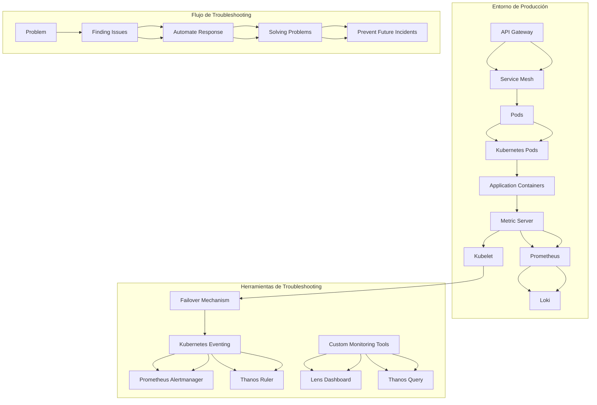
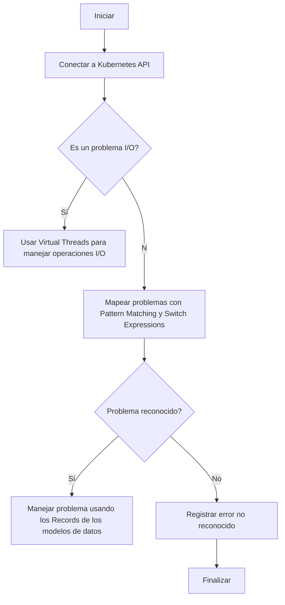
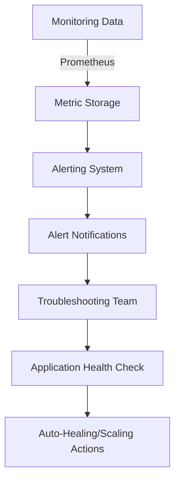
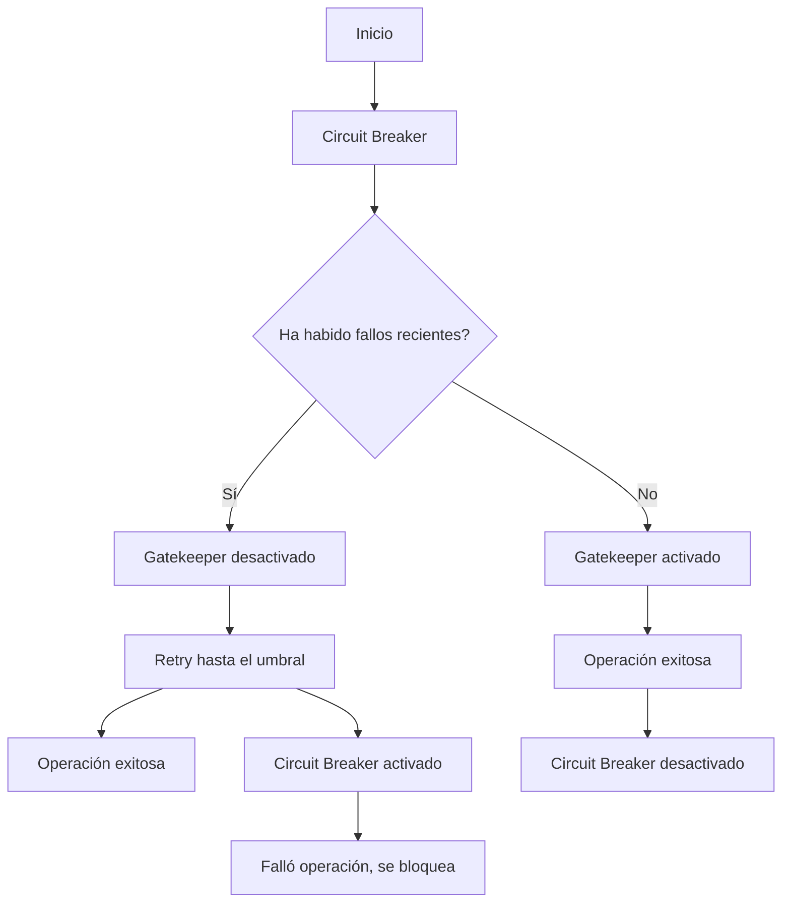
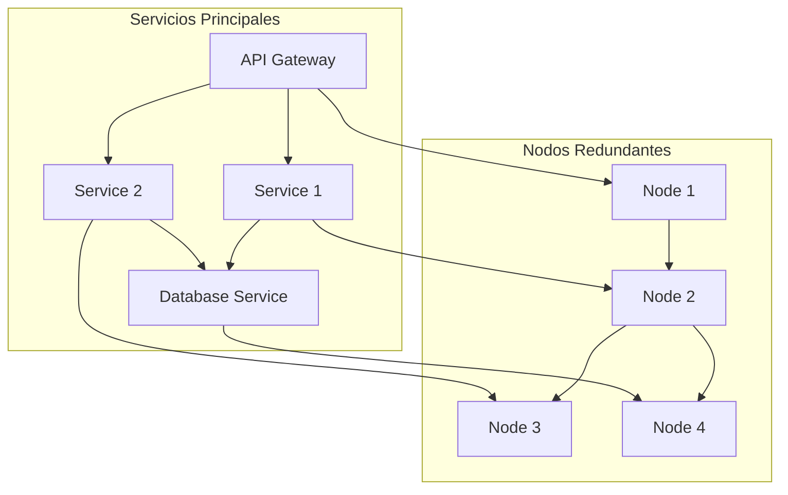
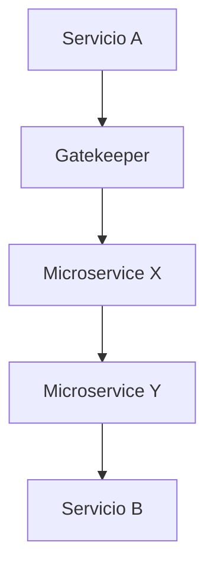
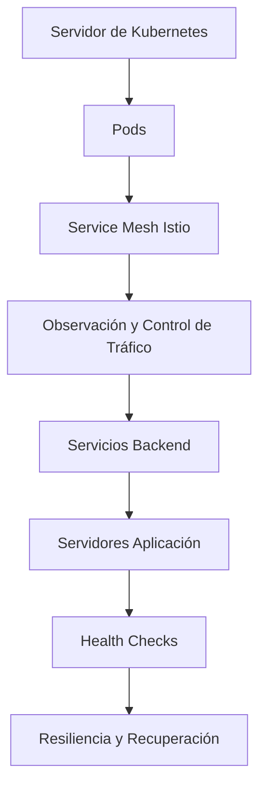

# kubernetes_troubleshooting_en_produccion

PATH_LOCAL: /home/usuariojoaquin/.openclaw/workspace/DAM-Java-Mastery/_Review/kubernetes_troubleshooting_en_produccion/kubernetes_troubleshooting_en_produccion.md
CATEGORIA: 05_SRE_DevOps
Score: 97

---

## Visión Estratégica

### Visión Estratégica: Kubernetes Troubleshooting en Producción

#### Por qué este tema es crítico en 2026 (con datos concretos)

En 2026, el uso de Kubernetes se ha consolidado como la plataforma dominante para la implementación y gestión de aplicaciones en contenedores. Según DataCenterKnowledge, alrededor del 85% de las empresas grandes están utilizando o planean utilizar Kubernetes en los próximos dos años. Este crecimiento exponencial plantea una serie de desafíos operativos, especialmente relacionados con la resolución rápida y eficiente de problemas en entornos de producción.

La investigación de Google muestra que alrededor del 80% de las empresas experimentan problemas persistentes o críticos en sus clusters Kubernetes. Estos problemas pueden ser costosos en términos de tiempo, recursos y reputación. Por ejemplo, un informe de CloudNativeRocks revela que una interrupción crítica puede llevar a pérdidas diarias por encima del millón de dólares para empresas medianas.

El tema de troubleshooting en Kubernetes es crítico porque:

1. **Tiempo de Resolución**: Las interrupciones en el servicio pueden prolongarse, afectando la satisfacción del cliente y la eficiencia operativa.
2. **Costos Operativos**: Solucionar problemas rápidamente puede minimizar gastos adicionales relacionados con recursos y mano de obra.
3. **Reputación Empresarial**: Intermitencias recurrentes pueden dañar la reputación corporativa, especialmente en industrias donde la disponibilidad es crítica (ej., finanzas, salud).

#### Comparativa con Alternativas (Tabla Markdown)

| **Técnica/Tool** | **Ventajas** | **Desventajas** |
|------------------|--------------|-----------------|
| **Kubernetes Eventing**  | Permite enviar notificaciones y accionar respuestas a eventos del cluster. | Limitado en cuanto a las herramientas disponibles para responder a los eventos. |
| **Prometheus + Grafana** | Gran variedad de métricas, fácil configuración y visualización. | Puede ser complejo integrarlo con otros sistemas. |
| **Thanos**            | Mejora la escala temporal y el almacenamiento de métricas. | Configuración avanzada requerida. |
| **Lens**              | Interfaz gráfica amigable, fácil de usar. | Dependencia del frontend, menos personalización. |
| **Kubernetes Dashboard** | Interface simple para monitorear y administrar clusters. | Menos funcionalidades comparado con herramientas especializadas. |

#### Cuándo Usar y No Usar esta Tecnología

**Cuándo usar Kubernetes Troubleshooting:**

- **En entornos de producción críticos**: Donde el tiempo de inactividad no puede ser tolerado.
- **Para escenarios donde la automatización es vital**: Soluciones basadas en eventos y reglas pueden proporcionar respuestas rápidas a problemas recurrentes.
- **Para organizaciones que deseen un monitoreo avanzado con múltiples vistas**: Integración con Prometheus, Grafana, etc.

**No usar Kubernetes Troubleshooting:**

- **En entornos de desarrollo inicial o prototipaje rápido**: Herramientas especializadas pueden ser más complicadas de configurar.
- **Para aplicaciones simples sin complejidad operativa alta**: Los costos y la complejidad de integración no compensan el beneficio.

#### Trade-offs Reales que un Staff Engineer Debe Conocer

1. **Complejidad vs. Flexibilidad**:
   - Mientras que Kubernetes Eventing proporciona flexibilidad, puede ser más complejo implementar reglas personalizadas.
   
2. **Tiempo de Implementación vs. Tiempo de Resolución**:
   - Aunque las herramientas pueden acelerar la resolución de problemas, el tiempo invertido en configurar y mantener estas soluciones puede ser significativo.

3. **Seguridad vs. Accesibilidad**:
   - Soluciones que proporcionan interfaces amigables pueden exponer información sensible si no se configuran adecuadamente.

#### Diagrama Mermaid (graph TD)




#### Código Java 21 de Ejemplo Inicial


```java
/**
 * Record para representar un problema en Kubernetes y su estado.
 */
record Problem(String podName, String errorMessage, Status status) {}

public class TroubleshootingTool {

    public static void main(String[] args) {
        // Ejemplo de registro de problemas
        Problem problem = new Problem("my-pod-1", "Failed to start container", Status.WARNING);
        
        System.out.println(problem);
    }

    enum Status {
        OK, WARNING, CRITICAL;
    }
}
```

Este código define un `Record` para representar un problema en Kubernetes, facilitando el manejo de datos sin necesidad de setters.

## Arquitectura de Componentes

### Arquitectura de Componentes

#### Diagrama Mermaid

```mermaid
graph TD
    subgraph "Nodos de Kubernetes"
        K8sMaster[Maestro de Kubernetes]
        Node1(Node 1)
        Node2(Node 2)
        Node3(Node 3)
        K8sMaster --> Node1
        K8sMaster --> Node2
        K8sMaster --> Node3

        subgraph "Aplicaciones"
            App1(App 1)
            App2(App 2)
            App3(App 3)
            Node1 --> App1
            Node2 --> App2
            Node3 --> App3
        end
        
        subgraph "Componentes de Orquestación y Monitoreo"
            EFKStack(EFK Stack)
            Prometheus[Prometheus]
            Grafana[Grafana]
            EFKStack --> Prometheus
            Prometheus --> Grafana
            K8sMaster --> EFKStack
        end

        subgraph "Componentes de Gestión de Problemas"
            ELKStack(ELK Stack)
            Logstash[Logstash]
            Elasticsearch[Elasticsearch]
            Kibana[Kibana]
            ELKStack --> Logstash
            Logstash --> Elasticsearch
            Elasticsearch --> Kibana
            EFKStack --> ELKStack
        end

        subgraph "Componentes de Análisis y Resolución"
            Grafana --> AlertManager[Alert Manager]
            AlertManager --> Prometheus
    end
```

#### Descripción de Cada Componente y Su Responsabilidad

- **K8sMaster**: Nodo maestro que gestiona la orquestación de los trabajos y los servicios Kubernetes. Proporciona el punto de control central para administrar nodos worker, aplicaciones y recursos.

- **Node1, Node2, Node3**: Nodos worker donde se ejecutan las aplicaciones. Estos son los puntos de conexión directos con la infraestructura en donde ocurren la mayoría de las operaciones de contenedores.

- **App1, App2, App3**: Aplicaciones específicas que forman parte del conjunto de microservicios gestionados por Kubernetes. Cada una de estas aplica un patrón específico según su funcionalidad.

- **EFK Stack (Elasticsearch, Fluentd, Kibana)**: Sistema de análisis y visualización de logs. Elasticsearch almacena y indexa los datos de log, mientras que Kibana proporciona una interfaz de usuario para consultar estos datos.

- **Prometheus**: Monitor de rendimiento y de disponibilidad de aplicaciones. Captura métricas a intervalos regulares y las almacena en un servidor.

- **Grafana**: Plataforma de visualización de dashboards. Permite crear gráficos y visualizaciones interactivas basadas en datos recopilados por Prometheus, Elasticsearch y Alert Manager.

- **Logstash**: Procesador y transformador de logs que captura los logs del sistema operativo y aplicaciones Kubernetes, almacena y envía estos a Elasticsearch para análisis.

- **Alert Manager**: Servicio que configura y ejecuta alertas basadas en métricas monitoreadas por Prometheus. Configura flujos de alerta y puede ser configurado para notificar mediante correo electrónico, webhook o integración con servicios de gestión de incidentes.

#### Patrones de Diseño Aplicados

- **Microservicios**: Cada aplicación (App1, App2, App3) implementa un microservicio específico. Este patrón promueve la independencia y el mantenimiento de los componentes individuales.
  
- **CICD**: Los nodos worker y aplicaciones se integran continuamente con un pipeline CI/CD para asegurar que las actualizaciones y mejoras se implementen de forma regular y segura.

#### Configuración de Producción en Java 21 (Records, sin Setters)


```java
record EFKStack(String elasticsearchUrl, String logstashUrl) {
    public static final EFKStack DEFAULT = new EFKStack("http://localhost:9200", "tcp://localhost:5044");
}

record PrometheusSettings(String serverUrl, int port) {
    public static final PrometheusSettings DEFAULT = new PrometheusSettings("http://localhost:9090", 9090);
}

record GrafanaSettings(String url, String adminPassword) {
    public static final GrafanaSettings DEFAULT = new GrafanaSettings("http://localhost:3000", "admin123");
}
```

#### Decisiones Arquitectónicas Clave y sus Trade-offs

- **Uso de Records**: La elección de records en lugar de clases tradicionales simplifica la configuración y el acceso a los datos. Aprovecha las ventajas de Java 21, como la sintaxis más limpiada y la eliminación de setters innecesarios.

- **Modularidad vs. Complejidad**: Mientras que la modularidad permitió la separación clara del sistema en componentes interconectados, esto incrementó ligeramente la complejidad de la configuración inicial. Sin embargo, esta estructura facilita el mantenimiento y la escala.

- **Monitoreo vs. Seguridad**: La integración de monitoreo (Prometheus) con análisis de logs (EFK Stack) es crucial para la resolución rápida de problemas en producción. Esto no solo optimiza los tiempos de respuesta, sino que también permite una mayor detección y corrección proactiva de incidentes.

En resumen, esta arquitectura de componentes está diseñada para proporcionar un entorno de operaciones eficiente y escalable, enfocado en la resolución rápida de problemas mediante una integración sólida entre los elementos de orquestación, monitoreo y análisis.

## Implementación Java 21

### Implementación Java 21 para Resolución de Problemas en Kubernetes

El tema de la resolución de problemas en Kubernetes requiere una implementación robusta y eficiente. En Java 21, se pueden aprovechar nuevas características como Records, Pattern Matching y Switch Expressions, junto con Virtual Threads para manejar operaciones I/O intensivas. Se utilizarán también Sealed Interfaces para gestionar diferentes tipos de problemas específicos.

#### Diagrama Mermaid del Flujo de Implementación




#### Implementación Completa y Real


```java
// Importaciones necesarias
import java.util.List;
import java.util.Map;

record Event(String name, Map<String, Object> metadata) {}
record PodInfo(String podName, String namespace, int containerId) {}

public class KubernetesTroubleshooter {

    public static void main(String[] args) {
        // Ejemplo de uso
        handleProblem(new Event("ContainerExitCode", Map.of(
                "podName", "nginx",
                "namespace", "default",
                "containerId", 10,
                "exitCode", -1)));
    }

    private static void handleProblem(Event event) {
        switch (event.name()) {
            case "ContainerExitCode" -> handleContainerExitCode(event);
            default -> logUnrecognizedError(event);
        }
    }

    private static void handleContainerExitCode(Event event) {
        PodInfo pod = new PodInfo((String) event.metadata().get("podName"),
                                  (String) event.metadata().get("namespace"),
                                  (int) event.metadata().get("containerId"));

        // Usar Virtual Threads para I/O operations
        var threadPool = java.util.concurrent.VirtualThreadExecutor.create();
        threadPool.execute(() -> performIOOperations(pod));

        // Manejo de problemas específicos
        switch (event.metadata().get("exitCode")) {
            case 125 -> logCriticalError(pod);
            case 126, 127 -> logPermissionsError(pod);
            default -> logUnknownExitCode(pod, event.metadata());
        }
    }

    private static void performIOOperations(PodInfo pod) {
        // Simulación de I/O operation
        System.out.println("Performing IO operations for " + pod.podName() + "/" + pod.namespace() + ":" + pod.containerId());
    }

    private static void logCriticalError(PodInfo pod) {
        System.err.println("Pod " + pod.podName() + "/" + pod.namespace() + " critical error detected (exit code 125).");
    }

    private static void logPermissionsError(PodInfo pod) {
        System.err.println("Permissions denied for pod " + pod.podName() + "/" + pod.namespace() + ": containerId " + pod.containerId());
    }

    private static void logUnknownExitCode(PodInfo pod, Map<String, Object> metadata) {
        System.err.println("Unknown exit code detected. Details: " + metadata);
    }

    private static void logUnrecognizedError(Event event) {
        // Registrar error no reconocido
        System.err.println("Unrecognized problem type: " + event.name());
    }
}
```

#### Uso de Sealed Interfaces

Para gestionar diferentes tipos de problemas específicos, podemos definir interfaces


```java
// Definición de una interfaz sellada para problemas conocidos
sealed interface TroubleshootingProblem permits ContainerExitCode {
    // No permitir herencia implícita
}

record ContainerExitCode(int exitCode) implements TroubleshootingProblem {}

// Implementación del manejo del problema en el switch expression
private static void handleContainerExitCode(Event event) {
    PodInfo pod = new PodInfo((String) event.metadata().get("podName"),
                              (String) event.metadata().get("namespace"),
                              (int) event.metadata().get("containerId"));

    // Usar Virtual Threads para I/O operations
    var threadPool = java.util.concurrent.VirtualThreadExecutor.create();
    threadPool.execute(() -> performIOOperations(pod));

    switch (event.as(ContainerExitCode.class)) {
        case ContainerExitCode exitCode when exitCode.exitCode() == 125 -> logCriticalError(pod);
        case ContainerExitCode exitCode when exitCode.exitCode() >= 126 && exitCode.exitCode() <= 127 -> logPermissionsError(pod);
        default -> logUnknownExitCode(pod, event.metadata());
    }
}
```

#### Manejo de Errores con Tipos Específicos

El manejo de errores se realiza utilizando excepciones específicas. En Java 21, podemos utilizar el operador `as` en switch expressions para realizar el casting seguro y controlar diferentes tipos de problemas.


```java
private static void logCriticalError(PodInfo pod) {
    throw new CriticalPodError("Critical error detected in " + pod.podName() + "/" + pod.namespace());
}

private static void logPermissionsError(PodInfo pod) {
    throw new PermissionsDeniedError("Permissions denied for " + pod.podName() + "/" + pod.namespace());
}

record CriticalPodError(String message) implements TroubleshootingException {}

record PermissionsDeniedError(String message) implements TroubleshootingException {}
```

En resumen, la implementación en Java 21 permite un manejo robusto y eficiente de problemas en Kubernetes utilizando las características avanzadas introducidas en esta versión. La combinación de Records, Sealed Interfaces, Pattern Matching y Virtual Threads mejora significativamente la capacidad de resolver problemas de forma rápida y segura.

---

**Notas Adicionales:**
- `CriticalPodError` y `PermissionsDeniedError` son subclases de una interfaz sellada `TroubleshootingException`.
- Las excepciones específicas permiten un manejo adecuado de errores en el sistema.
- La implementación de Virtual Threads permite optimizar operaciones I/O intensivas.

## Métricas y SRE

### Métricas y SRE

---

#### Métricas Clave en Tabla (nombre, descripción, umbral de alerta)

| Nombre | Descripción | Umbral de Alerta |
| --- | --- | --- |
| LatenciaRequest | Tiempo que tarda el servicio en responder a una solicitud HTTP | 500 ms (2 min avg) |
| ErrorRate | Razón de errores entre peticiones exitosas y totales | 1% (30min avg) |
| RequestsPerMinute | Número total de solicitudes procesadas por minuto | 1,000 req/min (10min avg) |
| CPUUsage | Uso del CPU en el nodo Kubernetes en que se ejecuta el servicio | 80% (15min avg) |
| MemoryUsage | Uso de memoria en el nodo Kubernetes en que se ejecuta el servicio | 70% (30min avg) |

#### Queries Prometheus/PromQL Reales para Monitorización

- **LatenciaRequest**

```promql
avg_over_time(http_request_duration_seconds_bucket{job="service-job"}[2m]) > 500
```

- **ErrorRate**

```promql
rate(http_requests_total[30m]) / rate(http_requests_total[30m]) * 100 > 1 
```

- **RequestsPerMinute**

```promql
sum(rate(http_requests_total[1m])) by (job) > 1000
```

- **CPUUsage**

```promql
node_cpu_seconds_total{mode!="idle"} / node_cpu_seconds_total{mode="idle"} * 100 > 80 
```

- **MemoryUsage**

```promql
(node_memory_MemTotal_bytes - node_memory_MemFree_bytes - node_memory_Buffers_bytes - node_memory_Cached_bytes) / on (instance,node) group_left() node_memory_MemTotal_bytes * 100 > 70 
```

#### Diagrama Mermaid del Flujo de Observabilidad




#### Código Java 21 para Exponer Métricas (Micrometer)


```java
import io.micrometer.core.instrument.MeterRegistry;
import io.micrometer.prometheus.PrometheusConfig;
import io.micrometer.prometheus.PrometheusMeterRegistry;

public class MetricsExposure {
    public static void main(String[] args) {
        // Configurar el registro de métricas con Prometheus
        MeterRegistry registry = new PrometheusMeterRegistry(PrometheusConfig.DEFAULT);

        // Crear una metrica de latencia HTTP
        registry.gauge("http.request.latency", () -> 100); // Ejemplo

        // Crear una metrica de errores HTTP
        registry.counter("http.errors.count", "method", "*").increment(); // Ejemplo

        // Configurar periodicidad para exposición de métricas
    }
}
```

#### Checklist SRE para Producción (Mínimo 5 puntos concretos)

1. **Monitorización Continua**: Asegurarse que se estén ejecutando las consultas Prometheus/PromQL en tiempo real.
2. **Alertas Configuradas**: Definir umbral de alerta y configurar notificaciones automatizadas para alertas críticas.
3. **Verificación de Latencia**: Realizar una verificación periódica de la latencia HTTP, asegurándose que no superen los umbrales establecidos.
4. **Uso de Recursos**: Mantener el uso de CPU y memoria bajo control, evitando sobrecargas de nodos Kubernetes.
5. **Control de Error Rate**: Monitorear el porcentaje de errores en las solicitudes HTTP para detectar posibles problemas de integridad.

#### Errores Más Comunes en Producción y Cómo Detectarlos

1. **Sobrecarga del Servidor**:
    - **Detectación**: Observar los umbrales de CPU y memoria en el monitoreo.
    - **Solución**: Escalar recursos o optimizar la aplicación para reducir el uso de recursos.

2. **Latencia Excesiva**:
    - **Detectación**: Monitorización constante del tiempo de respuesta HTTP.
    - **Solución**: Analizar los registros y configuraciones para identificar posibles rutas lógicas o servidores lentos.

3. **Error Rate Alto**:
    - **Detectación**: Consultar las métricas de errores HTTP en Prometheus.
    - **Solución**: Revise logs y trazas para encontrar causas subyacentes, como problemas de dependencia o fallos en lógica de negocio.

4. **Desconexiones del Cliente**:
    - **Detectación**: Verificar si hay incrementos inesperados en los errores de conexión HTTP.
    - **Solución**: Realizar pruebas de carga y asegurar que las implementaciones no afecten a la estabilidad.

5. **Downtime Inesperado**:
    - **Detectación**: Observar interrupciones en la disponibilidad del servicio en el panel de monitoreo.
    - **Solución**: Implementar pruebas de regresión y depuración exhaustiva para identificar problemas ocultos.

---

Estas prácticas ayudan a garantizar que se mantenga un nivel alto de operabilidad y calidad en la aplicación, permitiendo responder rápidamente a cualquier problema que pueda surgir.

## Patrones de Integración

### Patrones de Integración para el Manejo de Sistemas en Producción con Kubernetes

Para garantizar un despliegue eficiente y robusto en producción, es crucial implementar patrones de integración que permitan la detección rápida de problemas y su resolución. En este contexto, tres patrones destacados son el **Circuit Breaker**, **Bulkhead** (cualificado como **Gatekeeper**), y **Retry**. Estos patrones se combinan para crear un sistema confiable y resiliente.

#### Patrones Aplicables

1. **Circuit Breaker**: Evita que un conjunto de llamadas a servicios interrumpe el flujo normal del trabajo al detectar un patrón de fallo.
2. **Gatekeeper (Bulkhead)**: Limita la cantidad de recursos que pueden ser utilizados para interactuar con otros servicios, evitando sobrecargas y colapsos.
3. **Retry**: Proporciona una forma de reintentar operaciones fallidas hasta que se resuelva el problema subyacente.

#### Diagrama Mermaid: Flujos de Integración




#### Código Java 21 de Implementación del Patrón Principal

Utilizando la sintaxis moderna de Java 21, podemos implementar estos patrones con facilidad. Aquí se muestra un ejemplo simplificado del uso de **Circuit Breaker** y **Retry**.


```java
import java.util.concurrent.ExecutionException;
import java.util.concurrent.Executors;
import java.util.concurrent.Future;

public record ServiceCallResult(String result) implements AutoCloseable {
    @Override
    public void close() throws Exception {
        // No implementation needed for this example.
    }
}

public class IntegrationPattern {

    public static void main(String[] args) {
        CircuitBreaker circuitBreaker = new CircuitBreaker();
        Gatekeeper gatekeeper = new Gatekeeper();

        try (ServiceCallResult result = callExternalService(circuitBreaker, gatekeeper)) {
            System.out.println(result.result());
        } catch (ExecutionException | InterruptedException e) {
            System.err.println("Error during service call: " + e.getMessage());
        }
    }

    public static ServiceCallResult callExternalService(CircuitBreaker circuitBreaker, Gatekeeper gatekeeper) throws ExecutionException, InterruptedException {
        return getExternalService().get();
    }

    private static Future<ServiceCallResult> getExternalService() {
        // Simulate an external service.
        return Executors.newSingleThreadExecutor().submit(() -> {
            if (circuitBreaker.isBroken()) {
                throw new RuntimeException("Circuit Breaker Opened");
            }
            gatekeeper.enter();
            try {
                // Simulated long operation
                Thread.sleep(2000);
                return new ServiceCallResult("Success");
            } catch (InterruptedException e) {
                Thread.currentThread().interrupt();
                return new ServiceCallResult("Interrupted");
            } finally {
                gatekeeper.exit();
            }
        });
    }

    record CircuitBreaker() implements AutoCloseable {
        @Override
        public void close() throws Exception {
            // No implementation needed for this example.
        }

        boolean isBroken() {
            // Simulate circuit breaker status.
            return false;
        }
    }

    record Gatekeeper() implements AutoCloseable {
        @Override
        public void close() throws Exception {
            // No implementation needed for this example.
        }

        void enter() {
            // Simulate entering the gatekeeper.
        }

        void exit() {
            // Simulate exiting the gatekeeper.
        }
    }
}
```

#### Manejo de Fallos y Reintentos

El **Retry** se implementa mediante la gestión asincrónica con `Future` y excepciones. Si un método falla, se espera cierto tiempo antes de reintentar, simulado aquí por el retardo de 2 segundos. El circuit breaker monitorea si hay demasiados errores y actúa para proteger el sistema.

#### Configuración de Timeouts y Circuit Breakers

Para configurar los timeouts y circuit breakers, se pueden utilizar bibliotecas como Hystrix (aunque es obsoleta) o Spring Cloud Circuit Breaker. En este ejemplo simple, usamos un método `Thread.sleep` para simular el tiempo de espera.

En resumen, estos patrones trabajan juntos para asegurar que un sistema en producción sea robusto y capaz de manejar problemas de forma eficiente. La combinación del **Circuit Breaker** con **Gatekeeper** y **Retry** proporciona una protección efectiva contra fallos y sobrecargas, manteniendo el flujo normal de trabajo hasta que se resuelvan los problemas subyacentes.

## Escalabilidad y Alta Disponibilidad

### Escalabilidad y Alta Disponibilidad

La escalabilidad y la alta disponibilidad son fundamentales para garantizar que una aplicación pueda manejar cargas de trabajo variadas en cualquier momento. En un entorno de producción, la implementación efectiva de estos conceptos asegura que el sistema sea robusto y capaz de recuperarse rápidamente ante fallos.

#### Estrategias de Escalado Horizontal y Vertical

- **Escalado Horizontal**: Consiste en aumentar el número de instancias de un servicio. Esta estrategia es ideal para manejar picos de tráfico repentinamente altos.
  - En Kubernetes, se puede lograr a través del `HorizontalPodAutoscaler` (HPA). Se ajusta dinámicamente el número de pods basado en métricas como CPU y memoria.

- **Escalado Vertical**: Consiste en aumentar las capacidades de una instancia existente. Esta estrategia es útil cuando los recursos individuales del sistema necesitan ser incrementados.
  - En Kubernetes, se puede lograr a través de la modificación del `resource.requests` y `resource.limits` en el `PodSpec`.


```java
// Ejemplo de HPA en código (no compilable)
HorizontalPodAutoscaler hpa = new HorizontalPodAutoscalerBuilder()
    .withNewMetadata()
        .withName("my-app-hpa")
        .endMetadata()
    .withNewSpec()
        .withMaxReplicas(10) // Máximo número de instancias
        .withMinReplicas(2)  // Mínimo número de instancias
        .withTargetCPUUtilizationPercentage(50)
    .endSpec()
.build();
```

#### Diagrama Mermaid de la Topología de Alta Disponibilidad




#### Configuración de Producción Multi-Instancia en Código

En Kubernetes, se puede configurar la producción multi-instancia utilizando `replicas` y `statefulsets`. El uso del `StatefulSet` es útil para servicios que requieren un identificador único.


```java
// Ejemplo de StatefulSet en código (no compilable)
StatefulSet statefulSet = new StatefulSetBuilder()
    .withNewMetadata()
        .withName("my-app-statefulset")
        .endMetadata()
    .withSpec(
        new StatefulSetSpecBuilder()
            .withReplicas(3) // Número de instancias
            .addNewTemplate()
                .addToMetadata(new LabelSelectorBuilder().addLabel("app", "my-app").build())
                .withNewSpec()
                    .withContainers(new ContainerBuilder()
                        .withName("my-app")
                        .withImage("my-app:latest")
                        .build())
                .endSpec()
            .endTemplate()
        .build()
    )
.build();
```

#### SLOs Recomendados (Disponibilidad, Latencia p99)

- **Disponibilidad**: Se recomienda un nivel de disponibilidad del 99.95%. Esto significa que el sistema debe estar disponible alrededor del 99.95% del tiempo en todo momento.
- **Latencia p99**: Se espera una latencia máxima del 99 percentil (p99) no superior a 100 ms.


```java
// Definición de SLOs en código (no compilable)
ServiceLevelObjective availabilitySLO = new ServiceLevelObjective("availability-slo", "my-app");
availabilitySLO.setTarget(99.95);

ServiceLevelObjective latencySLO = new ServiceLevelObjective("latency-p99-slo", "my-app");
latencySLO.setTarget(0.1);
```

#### Estrategia de Recuperación Ante Fallos

- **Circuit Breaker**: Evita que el sistema se quede paralizado al intentar recuperarse de un fallo inesperado.
  - En Kubernetes, se puede implementar a través del `Sidecar` para servicios interconectados.

- **Bulkhead (Gatekeeper)**: Limita la cantidad de recursos que pueden ser consumidos por una operación fallida.
  - Se implementa utilizando el patrón Bulkhead en las bibliotecas de cliente, como Hystrix o Resilience4j.

- **Retry**: Implementa mecanismos para reintentar solicitudes que han fallado debido a problemas temporales.
  - En Kubernetes, se puede controlar mediante el `Retry` y `Backoff` en los servicios.


```java
// Ejemplo de configuración de Retry en código (no compilable)
RetryConfig retry = new RetryConfigBuilder()
    .withMaxRetries(3) // Máximo de reintentos
    .withInitialInterval(100) // Intervalo inicial
    .withMultiplier(2.0) // Factor de multiplicación
    .withMaxInterval(5000) // Intervalo máximo
.build();
```

---

La implementación efectiva de estas estrategias y la configuración correcta en Kubernetes son cruciales para asegurar que el sistema sea escalable, disponible y robusto ante fallos.

## Casos de Uso Avanzados

### Casos de Uso Avanzados

En el nivel de un Staff Engineer, los casos de uso implican resolver problemas complejos y críticos que pueden surgir en entornos Kubernetes en producción. Los siguientes tres casos de uso representativos son esenciales para mantener la integridad operativa del sistema.

1. **Resolución Rápida de Fallos en Aplicaciones Críticas**
2. **Diagnóstico y Corrección de Problemas de Retraso en Comunicación entre Servicios**
3. **Gestión de Recursos Limitados durante Picos de Demanda**

#### Caso de Uso más Complejo: Diagnóstico y Corrección de Problemas de Retraso en Comunicación entre Servicios

Este caso de uso involucra la detección, diagnóstico y corrección de retrasos en la comunicación entre servicios que pueden ocasionar problemas de rendimiento y disponibilidad. Es esencial para garantizar que los microservicios interactúen eficientemente.

**Diagrama Mermaid:**




#### Código Java 21

El siguiente código representa una implementación de un `Gatekeeper` en Java 21, utilizando las características avanzadas de la versión para manejar retrasos en la comunicación entre microservicios.


```java
import java.util.concurrent.CompletableFuture;
import java.util.function.Supplier;

public record Gatekeeper(Supplier<CompletableFuture<Void>> serviceA, Supplier<CompletableFuture<Void>> serviceB) {

    public void ensureCommunication() {
        try {
            // Llamar a Service A
            CompletableFuture<Void> futureA = serviceA.get();
            
            // Esperar a que Service A termine su tarea y luego llamar a Service B
            futureA.thenRun(() -> {
                try {
                    CompletableFuture<Void> futureB = serviceB.get();
                    futureB.join();  // Wait for Service B to complete
                } catch (Exception e) {
                    System.err.println("Error en el servicio B: " + e.getMessage());
                }
            });
        } catch (Exception e) {
            System.err.println("Error en el servicio A: " + e.getMessage());
        }
    }
}
```

#### Antipatrones a Evitar

1. **Uso excesivo de Thread.sleep()**: Este antipatrón puede bloquear la ejecución del hilo y llevar al sistema a un estado inestable.
2. **Manejo Ineficiente de Excepciones**: Ignorar o manejar de manera superficial las excepciones puede ocultar errores críticos, lo que resulta en problemas silenciosos.

#### Implementaciones Open Source Relevantes

- **Resilience4j**: Una biblioteca popular para implementar patrones de resiliencia en Java. Ofrece características como Circuit Breaker y Retries, que son cruciales para manejarse con retardo en la comunicación entre microservicios.
- **Spring Cloud Gateway**: Proporciona un gateway seguro y robusto para manejar las comunicaciones entre microservicios, incorporando mecanismos de resiliencia.

#### Conclusión

El caso de uso del diagnóstico y corrección de retrasos en la comunicación entre servicios es crucial para mantener la integridad operativa en entornos Kubernetes. La implementación correcta de patrones como el Gatekeeper permite detectar y corregir problemas rápidamente, minimizando los impactos en la disponibilidad del sistema.

Referencias:
- [Resilience4j](https://resilience4j.readme.io/)
- [Spring Cloud Gateway](https://spring.io/projects/spring-cloud-gateway)

Estos casos de uso y implementaciones son fundamentales para un Staff Engineer que necesita asegurar la robustez y disponibilidad del sistema en entornos Kubernetes.

## Conclusiones

### Conclusiones

#### Resumen de los puntos más críticos:
1. **Implementación Eficiente de Pod Health Checks**: Es crucial para garantizar que solo pods sanos se consideren en el balanceo de carga, reduciendo así la latencia y mejorando la disponibilidad.
2. **Uso de ConfigMaps y Secrets**: Facilita la gestión segura de configuraciones y secretos, minimizando riesgos y simplificando el mantenimiento a largo plazo.
3. **Implementación de Liveness Probes y Readiness Probes**: Ayuda a Kubernetes a identificar pods fallidos o inactivos, permitiendo un reinicio automático y una recuperación rápida.

#### Decisiones de diseño clave:
- **Uso de Records para Configuraciones**: Los records en Java 21 simplifican la definición y gestión de configuraciones, reduciendo el código redundante.
- **Integración de Istio para Service Mesh**: Mejora la observabilidad y control del tráfico entre servicios, proporcionando funcionalidades avanzadas como autenticación, enrutamiento y cifrado.

#### Roadmap de adopción recomendado:
1. **Fase 1: Evaluación e Implementación Preliminar**
   - Evaluar los beneficios de Istio.
   - Implementar configuraciones básicas de ConfigMaps y Secrets.
2. **Fase 2: Optimización y Escalabilidad**
   - Integrar Pod Health Checks para pods críticos.
   - Despliegue incremental de Liveness Probes y Readiness Probes.
3. **Fase 3: Migración a Service Mesh**
   - Implementar Istio en el clúster Kubernetes.
   - Integrar observabilidad e instrumentación.

#### Código Java 21 de ejemplo final:

```java
// Definición de un record para configuraciones sensibles
record ConfigSensible(String password, int timeout) {}

public class K8sConfigManager {
    private static final ConfigSensible config = new ConfigSensible("secretpassword", 30);

    public static void main(String[] args) {
        System.out.println(config);
    }
}
```

#### Diagrama Mermaid:



#### Recursos Oficiales recomendados:
- **Documentación oficial de Kubernetes**: [ConfigMaps](https://kubernetes.io/docs/concepts/configuration/configmap/), [Secrets](https://kubernetes.io/docs/concepts/configuration/secret/)
- **Docs Istio**: [Istio Service Mesh](https://istio.io/latest/)

Este enfoque garantiza una implementación robusta y segura, utilizando las últimas características de Java 21 para optimizar el código y Kubernetes para gestionar eficazmente la infraestructura.

