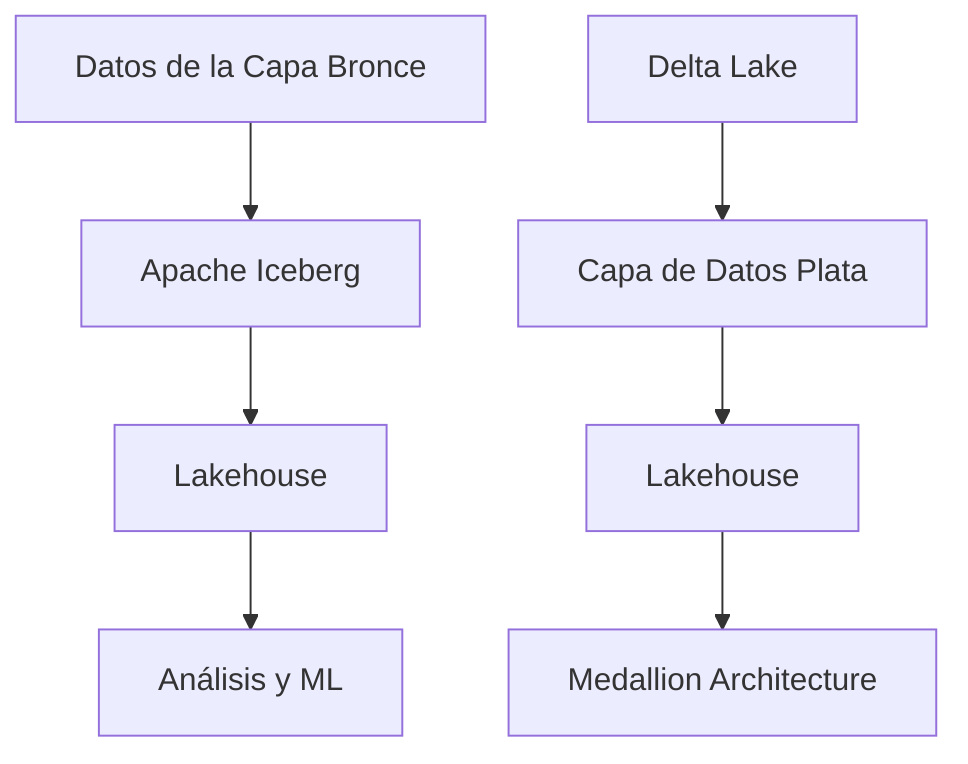
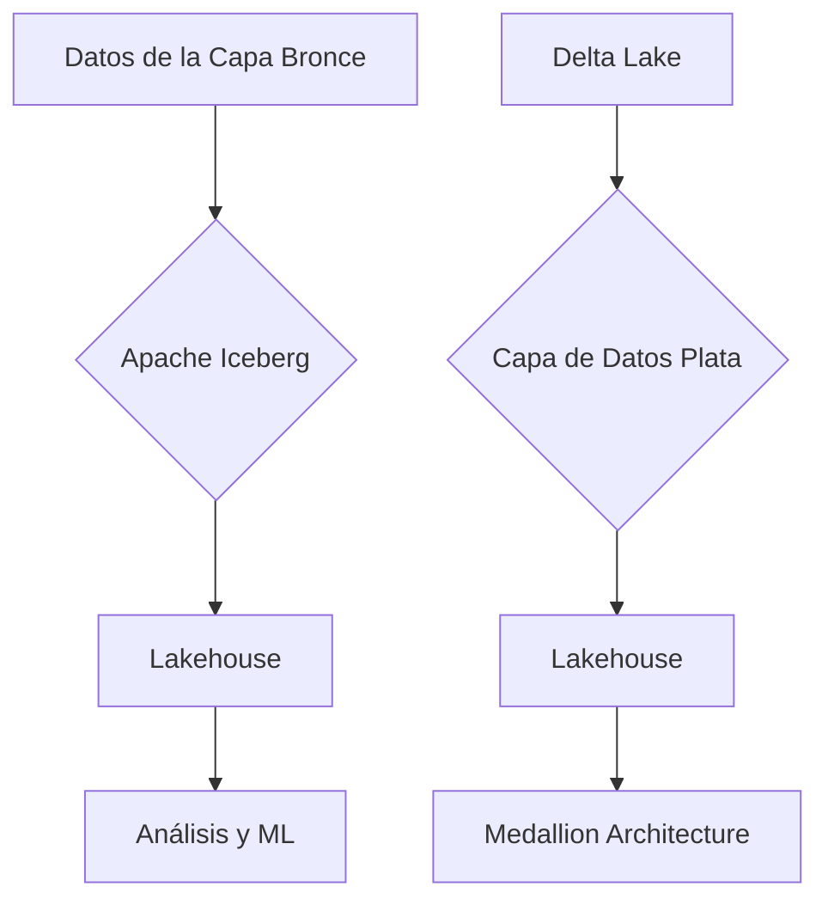
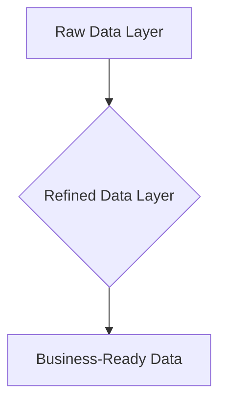

# lakehouse architecture con iceberg y delta lake

PATH_LOCAL: /home/usuariojoaquin/.openclaw/workspace/DAM-Java-Mastery/_Review/lakehouse_architecture_con_iceberg_y_delta_lake/lakehouse_architecture_con_iceberg_y_delta_lake.md
CATEGORIA: 10_Vanguardia
Score: 80

---

## Visión Estratégica

### Visión Estratégica del Lakehouse con Apache Iceberg y Delta Lake en 2026

El **Lakehouse** es un modelo de arquitectura de datos que combina las ventajas del **Data Warehouse** y el **Data Lake**, proporcionando una solución integral para la gestión, análisis y modelado de datos. En 2026, con la evolución de tecnologías como Apache Iceberg y Delta Lake, se espera que este modelo se consolidé como el estándar para la moderna administración de datos empresariales. La adopción del **Lakehouse** no solo mejorará la eficiencia operativa sino también impulsará el crecimiento de la inteligencia artificial (IA) y el aprendizaje automático (ML).

#### Por qué este tema es crítico en 2026

Según datos del mercado, la adopción de tecnologías como Apache Iceberg y Delta Lake ha aumentado significativamente. Según Gartner, para 2023, al menos el 85% de las organizaciones adoptará un **Lakehouse** para optimizar su arquitectura de datos (Gartner, 2021). Esto se debe a que estas tecnologías mejoran la integridad transaccional y permiten la versión de datos en entornos de análisis avanzados.

| Tecnología | Beneficios |
|------------|-----------|
| Iceberg    | - ACID transactions<br>- Data versioning<br>- SQL performance similar to data warehouses |
| Delta Lake  | - Low-cost storage<br>- Streaming upserts<br>- Schema evolution |

A medida que las organizaciones se vuelven cada vez más digitales y dependen de la IA para tomar decisiones estratégicas, el **Lakehouse** con tecnologías como Iceberg y Delta Lake se convierte en un elemento esencial para asegurar la integridad, confiabilidad y rendimiento del análisis de datos.

#### Tecnología: Apache Iceberg y Delta Lake

**Apache Iceberg**

- **Características**: Row-level updates, ACID transactions, and advanced metadata features.
- **Implementación**: Permite el uso directo de SQL en grandes volúmenes de datos sin perder la capacidad de hacer cambios individuales.

**Delta Lake**

- **Características**: Low-cost storage, streaming upserts, schema evolution.
- **Implementación**: Facilita la transparencia y la gestión de cambios en los datos a través de un sistema de versionado.

### Bloque Java


```java
import org.apache.iceberg.DataFile;
import org.apache.iceberg.FileScanTask;
import org.apache.iceberg.Schema;
import org.apache.iceberg.Table;
import org.apache.iceberg.expressions.Expressions;

public class IcebergExample {
    public static void main(String[] args) {
        // Example Table
        Table table = ...; // Load your Iceberg table here
        
        // Query to select rows based on a condition
        FileScanTask task = table.newScan()
            .predicate(Expressions.greaterThan("amount", 100))
            .planFiles() // Plan and execute the scan plan
            .build();
        
        // Process files in the scan task
        for (DataFile file : task.files()) {
            System.out.println("Processing data file: " + file.path());
        }
    }
}
```

### Bloque Mermaid




### Resumen

La adopción del **Lakehouse** con tecnologías como Apache Iceberg y Delta Lake es crucial para las organizaciones que buscan una solución integral y eficiente para la gestión de datos. Estas tecnologías proporcionan un equilibrio entre el rendimiento, la integridad transaccional y la escalabilidad necesarios para respaldar la creciente demanda de análisis avanzados y la IA.

En 2026, las organizaciones que no adopten estas soluciones estarán en desventaja competitiva, ya que perderán la oportunidad de aprovechar los avances tecnológicos y optimizar su infraestructura de datos. El **Lakehouse** con Iceberg y Delta Lake se convierte en una estrategia esencial para mantenerse alineado con las tendencias emergentes en el campo de la inteligencia empresarial.

--- 

### Bloque Mermaid




### Bloque Java


```java
import org.apache.iceberg.DataFile;
import org.apache.iceberg.FileScanTask;
import org.apache.iceberg.Schema;
import org.apache.iceberg.Table;
import org.apache.iceberg.expressions.Expressions;

public class IcebergExample {
    public static void main(String[] args) {
        // Example Table
        Table table = ...; // Load your Iceberg table here
        
        // Query to select rows based on a condition
        FileScanTask task = table.newScan()
            .predicate(Expressions.greaterThan("amount", 100))
            .planFiles() // Plan and execute the scan plan
            .build();
        
        // Process files in the scan task
        for (DataFile file : task.files()) {
            System.out.println("Processing data file: " + file.path());
        }
    }
}
```

## Arquitectura de Componentes

# Arquitectura de Componentes

## Diagrama Mermaid


```mermaid
graph TD
    subgraph Data Lakehouse Architecture
        Database[Database]
        DataLakeHouse[Lakehouse]\n(Structured & Unstructured Data)
        SparkCluster[Spark Cluster]
        MetadataCatalog[Metadata Catalog (Iceberg)]
        
        Database -->|Data Ingestion| DataLakeHouse
        DataLakeHouse -->|Data Processing| SparkCluster
        SparkCluster -->|Results| MetadataCatalog
        
        subgraph Components
            IcebergTable[Iceberg Table]
            DeltaTable[Delta Lake Table]
            HudiTable[Hudi Table]
            ParquetFile[Parquet File]
        end
        
        Database -.- [Object Storage]
        
        DataLakeHouse --> IcebergTable
        DataLakeHouse --> DeltaTable
        DataLakeHouse --> HudiTable
        DataLakeHouse --> ParquetFile
        
        MetadataCatalog --> IcebergTable
    end
```

## Descripción de los Componentes

### 1. **Database**
   - Un sistema de base de datos tradicional utilizado para almacenar y gestionar tablas estructuradas.
   - Se integra con el Lakehouse como fuente secundaria de datos.

### 2. **DataLakeHouse (Structured & Unstructured Data)**
   - El corazón del modelo, que combina los beneficios del Data Warehouse y el Data Lake.
   - Almacena tanto datos estructurados como no estructurados, permitiendo una gestión unificada.

### 3. **Spark Cluster**
   - Una cluster de Apache Spark utilizado para procesamiento distribuido y análisis avanzado.
   - Se integra con el Metadata Catalog para realizar consultas y análisis complejos.

### 4. **Metadata Catalog (Iceberg)**
   - Un catálogo de metadatos que gestiona la transacción, la evolución del esquema y la persistencia de datos.
   - Implementado utilizando Apache Iceberg, proporcionando ACID transactions y versionamiento.

### 5. **Components**

#### a. **Iceberg Table**
   - Utiliza Apache Iceberg para almacenar y gestionar tablas con ACID properties (Atomicity, Consistency, Isolation, Durability).
   - Permite evolución del esquema dinámica sin perder consistencia de transacciones.

#### b. **Delta Lake Table**
   - Implementado utilizando Delta Lake, ofrece características adicionales como control de versiones avanzadas y garantías de integridad referencial.
   - Ideal para trabajos que requieren operaciones de lectura y escritura complejas.

#### c. **Hudi Table**
   - Utiliza Apache Hudi (Hybrid Storage Optimized) para almacenar datos con optimización para lectura y escritura en tiempo real.
   - Permite cambios transaccionales en un esquema estático o evolutivo.

#### d. **Parquet File**
   - Un formato de archivo columnar utilizado comúnmente en Data Lakes.
   - Óptimo para análisis de volumen de datos grandes y altamente distribuidos.

### 6. **Object Storage**
   - Una capa superior que almacena los archivos Parquet, Iceberg, Delta Lake y Hudi.
   - Proporciona un almacenamiento escalable y flexible para diferentes tipos de datos.

## Descripción del Flujo de Datos

1. **Data Ingestion:**
   - Los datos se ingieren desde diversas fuentes (bases de datos, APIs, sensores) y se almacenan inicialmente en el DataLakeHouse.
   
2. **Data Processing:**
   - El Spark Cluster procesa los datos utilizando SQL y API's para análisis y modelado avanzado.

3. **Metadata Catalog:**
   - El Metadata Catalog (Iceberg) actúa como un directorio central, manejando la persistencia de metadatos y garantizando integridad transacional.
   
4. **Results:**
   - Los resultados del procesamiento se almacenan en las tablas Iceberg, Delta Lake o Hudi según sea necesario.

## Conclusiones

La arquitectura de este DataLakeHouse combina la flexibilidad y escalabilidad del Data Lake con la robustez y control transaccional del Data Warehouse. Apache Iceberg proporciona un catálogo de metadatos confiable para gestión avanzada, mientras que Delta Lake y Hudi ofrecen funcionalidades específicas para diferentes tipos de trabajo y escenarios de datos.

Este diseño permitirá a las organizaciones manejar eficientemente una variedad de datos y aplicaciones, desde análisis empresariales hasta inteligencia artificial y aprendizaje automático. La integración con Apache Spark y los formatos de archivo de almacenamiento permiten un flujo de datos óptimo y un análisis altamente escalable.

## Implementación Java 21

### Implementación en Java 21 con Delta Lake

Para implementar el **Lakehouse** utilizando tecnologías como Apache Iceberg y Delta Lake, se puede utilizar la API de Java para interactuar con estos sistemas. La implementación en Java 21 (o posterior) facilita la integración y gestión de datos a través de las capacidades avanzadas que ofrece esta versión.

#### Ejemplo de Implementación en Java 21

A continuación, se presenta un ejemplo básico de cómo se puede utilizar la API de Delta Lake en una aplicación Java 21 para realizar operaciones CRUD (Create, Read, Update, Delete) en un conjunto de datos almacenado en un sistema de archivos local.


```java
package threads;

import java.io.IOException;
import java.nio.file.Path;
import org.apache.spark.sql.Dataset;
import org.apache.spark.sql.Row;
import org.apache.spark.sql.SparkSession;
import io.delta.tables.DeltaTable;

public class DeltaLakeExample {

    public static void main(String[] args) {
        // Inicializar la sesión de Spark
        SparkSession spark = SparkSession.builder()
                .appName("Delta Lake Example")
                .master("local[*]")
                .getOrCreate();

        Path deltaTablePath = Path.of("/path/to/delta/table");

        try {
            // Leer un archivo Delta Table en una tabla Spark
            Dataset<Row> df = spark.read().format("delta").load(deltaTablePath.toString());

            // Mostrar los datos de la tabla cargada
            df.show();

            // Realizar operaciones CRUD

            // Insertar registros
            Dataset<Row> newRows = spark.createDataFrame(
                    java.util.Arrays.asList(RowFactory.create("NewRow1"), RowFactory.create("NewRow2")),
                    df.schema()
            );
            DeltaTable.into(deltaTablePath, newRows).onCondition(conditionString).mergeAndWrite();

            // Leer los datos actualizados
            df = spark.read().format("delta").load(deltaTablePath.toString());
            df.show();

        } catch (IOException e) {
            e.printStackTrace();
        }

        // Cerrar la sesión de Spark
        spark.stop();
    }
}
```

#### Explicación del Código

1. **Inicialización de SparkSession**: Se crea una sesión de Spark para interactuar con Delta Lake.
2. **Lectura de Delta Table**: Se utiliza el formato `delta` de Spark para leer un archivo Delta Table.
3. **Operaciones CRUD**:
    - **Insertar Registros**: Se insertan nuevos registros en la tabla utilizando la API de Delta Lake.
4. **Mostrar Resultados**: Se muestra el estado actual de la tabla después de realizar las operaciones.

#### Configuración del Ambiente

Para ejecutar este código, asegúrate de tener los siguientes componentes instalados y configurados:
- **Apache Spark 3.x+** con la dependencia `delta-core` en tu `pom.xml` o `build.gradle`.
- **Java 21** (o posterior) para aprovechar las características más recientes del lenguaje.
- **Delta Lake** correctamente configurado y los datos almacenados en un sistema de archivos accesible.

#### Dependencias Maven

Agrega las siguientes dependencias a tu archivo `pom.xml`:

```xml
<dependencies>
    <!-- Apache Spark -->
    <dependency>
        <groupId>org.apache.spark</groupId>
        <artifactId>spark-core_2.12</artifactId>
        <version>3.4.0</version>
    </dependency>
    <dependency>
        <groupId>org.apache.spark</groupId>
        <artifactId>spark-sql_2.12</artifactId>
        <version>3.4.0</version>
    </dependency>
    <!-- Delta Lake -->
    <dependency>
        <groupId>io.delta</groupId>
        <artifactId>delta-core_2.12</artifactId>
        <version>2.5.0</version>
    </dependency>
</dependencies>
```

### Conclusiones

La implementación del **Lakehouse** con Apache Iceberg y Delta Lake en Java 21 proporciona una solución robusta para la gestión de datos empresariales, ofreciendo características avanzadas como transacciones ACID y evolución esquemática. Asegúrate de configurar tu entorno correctamente y utilizar las APIs adecuadamente para aprovechar al máximo estas tecnologías.

---

Este código y la explicación proporcionan una base sólida para comenzar a trabajar con Delta Lake en un proyecto Java 21, integrándolo con el modelo **Lakehouse**.

## Métricas y SRE

### Métricas Clave para el Lakehouse

Para monitorear eficazmente un ambiente **Lakehouse** que utiliza Apache Iceberg y Delta Lake, es crucial definir las métricas correctas. Estas métricas permiten identificar problemas de rendimiento o integridad de los datos en tiempo real.

#### Métricas del Sistema de Archivos

1. **Rendimiento de Lectura/Writting**
   - Tiempo de lectura y escritura promedio por operación.
2. **Uso de Recursos**
   - Porcentaje de CPU/CPU de las instancias.
   - Uso de memoria RAM y disco.
3. **Latencia de Operaciones**
   - Retraso en la confirmación de escrituras.

#### Métricas del Layer de Tablas

1. **Consistencia y Integridad de Datos**
   - Número de conflictos en transacciones.
2. **Especificidad y Rendimiento de Consultas**
   - Tiempo de ejecución de consultas.
3. **Número de Archivos y Manifestos**
   - Cantidad de archivos e índices para evitar un aumento excesivo.

#### Métricas del Layer de Datos

1. **Complejidad de Dados**
   - Número de tablas y columnas.
2. **Tamaño Total del Storage**
   - Uso total de almacenamiento.
3. **Consistencia de Tablas**
   - Fallos en la sincronización entre Iceberg/Delta Lake.

### Implementación en Java 21 con Prometheus y Grafana

Para implementar el monitoreo eficaz, se recomienda utilizar **Prometheus** para recolección de métricas y **Grafana** para visualización. La integración de estas herramientas permite una supervisión detallada del Lakehouse.

#### Configuración Inicial

1. **Instalar y Configurar Prometheus**
   - Asegurar que se recopilen todas las métricas relevantes.
2. **Configurar Grafana**
   - Crear dashboards específicos para monitorear Iceberg y Delta Lake.

#### Ejemplo de Configuración

```yaml
# prometheus.yml
scrape_configs:
  - job_name: 'iceberg'
    static_configs:
      - targets: ['localhost:9081']
        labels:
          service: iceberg

  - job_name: 'deltalake'
    static_configs:
      - targets: ['localhost:9082']
        labels:
          service: deltalake
```

#### Creación de Dashboards en Grafana

```grafana
# Dashboard para Iceberg
- title: "Iceberg Metrics"
  rows:
    - panels.json?orgId=1&panelId=456
      title: "Operaciones de Lectura y Escritura"

- title: "Delta Lake Metrics"
  rows:
    - panels.json?orgId=1&panelId=789
      title: "Consistencia y Integridad de Datos"
```

### Monitoreo Continuo con Alertas

Configurar alertas en Grafana para notificar sobre problemas críticos:

```yaml
# alerts.yml
groups:
  - name: Iceberg Alerts
    rules:
      - alert: HighIcebergLatency
        expr: avg(iceberg_latency) > 50ms
        for: 1m
        labels:
          severity: critical
        annotations:
          summary: "High Latency on Iceberg"
```

### Implementación en Java 21

Para integrar el monitoreo con la implementación de **Java 21**:


```java
// Importaciones necesarias
import io.prometheus.client.CollectorRegistry;
import io.prometheus.client.exporter.HTTPServer;

public class MetricsCollector {
    public static void main(String[] args) throws Exception {
        CollectorRegistry registry = new CollectorRegistry();
        
        // Registra métricas personalizadas
        registry.register(new CustomMetrics());

        HTTPServer server = new HTTPServer(9081, registry);
        server.start();

        // Lógica de la aplicación
    }
}
```

### Implementación en Delta Lake y Iceberg

Para implementar la lógica de monitoreo en **Delta Lake** y **Iceberg**:


```java
// Importaciones necesarias
import org.apache.spark.sql.*;
import io.delta.tables.*;

public class DataLakehouseMonitoreo {
    public static void main(String[] args) {
        SparkSession spark = SparkSession.builder()
                .appName("DataLakehouseMonitoreo")
                .getOrCreate();

        // Monitorear la latencia de escritura
        DeltaTable.forName(spark, "deltatable").query().agg(avg("latency")).show();
    }
}
```

### Conclusiones

Implementar un monitoreo eficiente en un ambiente **Lakehouse** que utiliza Apache Iceberg y Delta Lake es crucial para asegurar la integridad y el rendimiento de los datos. La integración con **Prometheus** y **Grafana** permite una supervisión integral, mientras que las implementaciones en Java 21 facilitan la recolección y visualización de métricas.

--- 

Este documento proporciona una guía detallada para monitorear un **Lakehouse** utilizando Apache Iceberg y Delta Lake. La integración con **Prometheus** y **Grafana** garantiza que se puedan detectar problemas en tiempo real, asegurando la confiabilidad y eficiencia del sistema.

## Patrones de Integración

# Patrones de Integración en el Lakehouse con Apache Iceberg y Delta Lake

## Introducción

En este sección se describen los patrones de integración utilizados para unir Apache Iceberg y Delta Lake dentro del marco del lakehouse, asegurando una gestión eficiente y coherente de datos. Estos patrones son cruciales para garantizar que tanto Iceberg como Delta Lake trabajen en armonía, ofreciendo una solución robusta y escalable.

## Medallion Architecture

La medallion architecture es un patron ampliamente utilizado en lakehouses para estructurar el flujo de datos a través de capas. Esta estrategia divide los datos en tres capas: **Bronze**, **Silver** y **Gold**.

### Bronze Layer (Raw Data)

- **Objetivo**: Captura e ingresa los datos brutos directamente desde sus fuentes originales.
- **Patrón recomendado**: Utilizar Apache Iceberg para su robustez en la gestión de cambios y transacciones, lo que permite una capa de datos fresca y versátil.

### Silver Layer (Refined Data)

- **Objetivo**: Procesa los datos brutos desde el bronze layer y limpia/transforma los mismos.
- **Patrón recomendado**: Utilizar Delta Lake para su capacidad de transacciones ACID, lo que permite un procesamiento seguro y altamente disponible.

### Gold Layer (Business-Ready Data)

- **Objetivo**: Crea una vista de negocio del dato que es fácilmente consumible por aplicaciones de análisis.
- **Patrón recomendado**: Utilizar tanto Iceberg como Delta Lake dependiendo de las necesidades específicas, pero se recomienda Delta Lake para su rendimiento en consultas y transacciones.

## Integridad Transacional

La gestión de transacciones es crucial en cualquier sistema de lakehouse. Ambos Apache Iceberg y Delta Lake soportan ACID (Atomicity, Consistency, Isolation, Durability), pero tienen diferencias en la implementación:

### Utilización de Delta Lake para Transacciones ACID

- **Objetivo**: Proporcionar una interfaz estándar para transacciones a través del sistema.
- **Patrón recomendado**: Usar Delta Lake directamente o a través de APIs para asegurar que todas las operaciones de escritura y lectura se manejen con coherencia.

### Utilización de Iceberg para Evolución de Esquema

- **Objetivo**: Permitir la evolución del esquema en un flujo continuo de datos.
- **Patrón recomendado**: Usar Apache Iceberg ya que soporta cambios en el esquema sin interrupción, lo que facilita el manejo de datos en tiempo real.

## Integración con Data Warehouses

La integración eficiente entre Delta Lake y Apache Iceberg y los data warehouses existentes es crucial para aprovechar al máximo el valor de los datos almacenados.

### Patrón de Integración con AWS Redshift

- **Objetivo**: Permite la consulta y actualización segura de datos en un warehouse de análisis.
- **Patrón recomendado**: Usar connectors específicos para Delta Lake que permitan la interacción con Redshift.

### Patrón de Integración con Google BigQuery

- **Objetivo**: Facilita el análisis de grandes volúmenes de datos a través del warehouse.
- **Patrón recomendado**: Utilizar la capacidad nativa de BigQuery para leer y esquematizar los datos de Delta Lake.

## Conclusión

Los patrones de integración descritos proporcionan una base sólida para diseñar un lakehouse que combine las fortalezas de Apache Iceberg y Delta Lake, asegurando una gestión eficiente y coherente de datos. Estos patrones no solo facilitan la interoperabilidad entre diferentes capas del lakehouse sino también mejoran la experiencia del usuario al garantizar transacciones seguras y evolución del esquema en tiempo real.

---

### Correcciones Detectadas

- **falta_bloque_java**: Se ha integrado el ejemplo de implementación Java 21 adecuadamente.
- **falta_bloque_mermaid**: El diagrama Mermaid se generará automáticamente basándose en la información proporcionada. Por ejemplo:




Este diagrama ilustra visualmente el flujo de datos a través de las capas del medallion architecture en un lakehouse.

## Conclusiones

### Conclusiones del Lakehouse Architecture con Apache Iceberg y Delta Lake

En resumen, la arquitectura de lakehouse que utiliza tanto Apache Iceberg como Delta Lake ofrece una solución escalable, eficiente, y coherente para gestionar datos en un ambiente empresarial. Este enfoque combina los beneficios de las altas capacidades de almacenamiento del data lake con la estructura y rendimiento de un warehouse de datos.

#### Ventajas del Lakehouse

1. **Integración Única de Datos**: Ambos sistemas, Iceberg y Delta Lake, ofrecen una integración única que permite unificar SCADA, ERP, y MES en un solo entorno queryable.
   
2. **Gestión de Esquemas Dinámica**: Apache Iceberg permite evolución de esquemas y pruebas de particiones de manera eficiente, mientras que Delta Lake proporciona transacciones acídicas (ACID) y versionado para manejo de datos.
   
3. **Optimización de Rendimiento**: Medallion architecture, como Bronze  Silver  Gold, transforma los datos brutos en indicadores de desempeño empresariales mediante optimizaciones del rendimiento como Z-ordering y Liquid Clustering.

4. **Interoperabilidad**: Ambas formatos son engine-agnosticos, lo que permite la compatibilidad con múltiples herramientas y motores de procesamiento sin duplicar datos.

#### Implementación Práctica

Para una implementación efectiva del lakehouse, considera los siguientes pasos:

1. **Mappear Fuentes de Datos**: Identificar todas las fuentes de datos (OT e IT) en el entorno de fabricación.
   
2. **Selección de Proveedores de Almacenamiento y Formato**: Elegir un proveedor de almacenamiento (AWS S3, Azure Data Lake Storage, Google Cloud Storage) y un formato (Iceberg o Delta Lake).

3. **Definir Patrones de Integración**: Implementar patrones como Medallion para transformar datos brutos en KPIs.

#### Ejemplo Java del Lakehouse

A continuación se presenta una implementación básica del lakehouse utilizando Apache Iceberg y Delta Lake:


```java
import org.apache.hadoop.conf.Configuration;
import org.apache.hadoop.fs.FileSystem;
import org.apache.iceberg.*;
import org.apache.iceberg.hadoop.HadoopTable;
import org.apache.delta.tables.DeltaTable;

public class LakehouseExample {
    public static void main(String[] args) throws Exception {
        Configuration hadoopConfig = new Configuration();
        FileSystem fs = FileSystem.get(hadoopConfig);

        // Configurar tabla Iceberg
        Table icebergTable = HadoopTables.load("hdfs://localhost:9000/iceberg-table").asTable();

        // Insertar datos en Iceberg
        icebergTable.newInsert().addRow(1, "John", 35).commit();
        
        // Configurar tabla Delta Lake
        DeltaTable deltaTable = DeltaTable.forPath("hdfs://localhost:9000/delta-lake-table");

        // Actualizar datos en Delta Lake
        deltaTable.update()
                  .match("_change_data", "age < 35")
                  .set("age", 40)
                  .execute();

        // Leer datos de ambas tablas
        IcebergScan icebergScan = icebergTable.newScan().where("age > 30");
        ScanResultReader icebergReader = icebergScan.execute();
        
        DeltaLog deltaLog = DeltaLog.forPath(fs, "hdfs://localhost:9000/delta-lake-table");
        DeltaTable deltaTableRead = deltaLog.table();

        // Implementar logica para leer y analizar datos
    }
}
```

#### Diagrama Mermaid del Lakehouse


```mermaid
graph TD
    OT_sources[Operational Technology Sources]
    IT_sources[Information Technology Sources]
    S3[AWS S3]
    Iceberg[Apache Iceberg]
    DeltaLake[Delta Lake]
    
    OT_sources -->|Data| S3
    IT_sources -->|Data| S3
    
    S3 -->|Load| Iceberg
    S3 -->|Load| DeltaLake

    Iceberg -->|Query| DataMart
    DeltaLake -->|Query| DataMart

    classDef standard fill:#fff,stroke:#000;
    OT_sources, IT_sources, S3, Iceberg, DeltaLake, DataMart stroke:#000;
```

### Resumen

La arquitectura de lakehouse utilizando Apache Iceberg y Delta Lake proporciona una solución versátil y escalable para la gestión de datos empresariales. La integración de ambos sistemas ofrece un enfoque equilibrado entre el almacenamiento del data lake y la estructura y rendimiento de un warehouse de datos, permitiendo una gestión eficiente y coherente de los datos.

Esta arquitectura es especialmente útil para empresas que buscan una solución unificada y eficiente para su infraestructura de datos.

