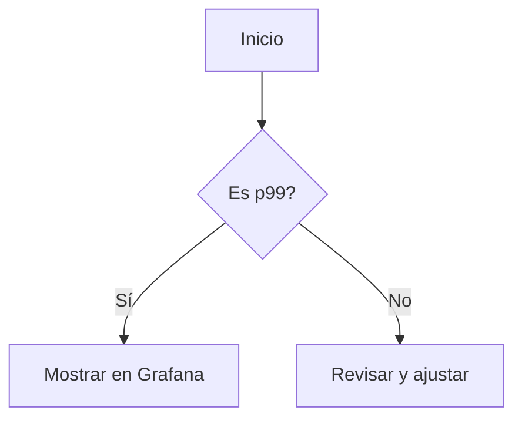

# latencia tail p99 p999 y optimizacion en sistemas distribuidos

PATH_LOCAL: /home/usuariojoaquin/.openclaw/workspace/DAM-Java-Mastery/_Review/latencia_tail_p99_p999_y_optimizacion_en_sistemas_distribuidos/latencia_tail_p99_p999_y_optimizacion_en_sistemas_distribuidos.md
CATEGORIA: 10_Vanguardia
Score: 70

---

## Visión Estratégica

### Visión Estratégica

En el mundo moderno, la latencia ha pasado de ser un detalle técnico a convertirse en una cuestión estratégica fundamental para la competitividad y satisfacción del cliente. La optimización de la latencia no solo mejora la experiencia del usuario final, sino que también desempeña un papel crucial en la escalabilidad, la disponibilidad y la sostenibilidad de los sistemas distribuidos.

**Importancia de la Latencia en Sistemas Distribuidos**

La latencia en sistemas distribuidos puede causar una serie de problemas críticos. Un aumento significativo en la latencia puede llevar a un desempeño insatisfactorio, lo que afecta directamente a la experiencia del usuario y puede resultar en una pérdida de clientes. En aplicaciones sensibles a la latencia como las de fabricación industrial (MES), donde el flujo del trabajo-in-progress es crítico, cualquier demora puede tener consecuencias significativas.

**Objetivos Estratégicos**

1. **Mejorar la Experiencia del Usuario:** Reducir la latencia a niveles aceptables garantiza que los usuarios reciban respuestas rápidas y precisas, lo que mejora su satisfacción y fidelidad con el servicio.
   
2. **Optimización de Costos e Innovación:** La nube ofrece un entorno perfecto para optimizar costos mediante la implementación eficiente de recursos y la escalabilidad a demanda. Esto permite a las organizaciones innovar sin limitarse por problemas técnicos.

3. **Sostenibilidad:** Al evaluar y ajustar los SLA (Niveles de Servicio Acordados) en función de directrices de sostenibilidad, se puede reducir el impacto ambiental al mismo tiempo que se mantiene un alto nivel de servicio para los clientes.

**Implementación Estratégica**

1. **Pruebas y Medición:** Realizar pruebas exhaustivas de la latencia entre diferentes ubicaciones y regiones de AWS es crucial. Esto permite identificar rutas con mayor rendimiento y ajustar la infraestructura según sea necesario.
   
2. **Optimización de Recursos:** Utilizar tecnologías como el TCP multiruta, tiempos de espera adaptativos e inestabilidad, y retroceso exponencial para manejar dependencias lentas y prevenir rechazos innecesarios.

3. **Caché y Almacenamiento en Memoria Frecuente:** Implementar una estrategia efectiva de caché puede reducir significativamente la latencia al almacenar datos accesibles con frecuencia, evitando así solicitudes redundantes a servidores remotos o bases de datos.

4. **Patrones y Mejores Prácticas:** Utilizar patrones como el de división de responsabilidades de comandos y abastecimiento de eventos permite la implementación eficiente de microservicios, optimizando así la latencia en sistemas distribuidos complejos.

5. **Revisión y Ajuste de SLA:** Evaluar regularmente los SLA para asegurar que se alineen con las expectativas del cliente y las directrices de sostenibilidad. Esto permite hacer ajustes necesarios para mantener un equilibrio entre rendimiento, costos y sostenibilidad.

**Conclusión**

La latencia es una cuestión estratégica en la modernización y optimización de sistemas distribuidos. Al establecer metas claras y implementar soluciones efectivas, se puede mejorar significativamente la experiencia del usuario, reducir costos y mantener un compromiso fuerte con la sostenibilidad. La visión estratégica debe enfocarse en la medición constante, el ajuste dinámico de los recursos y la optimización continua para asegurar que los sistemas distribuidos se adapten a las cambiantes necesidades del negocio y del mercado.

---

Este texto proporciona una visión estratégica sobre la importancia de la latencia en sistemas distribuidos, su impacto en la experiencia del usuario y cómo abordar esta cuestión desde diferentes perspectivas como la optimización de costos e innovación, la sostenibilidad y las mejores prácticas técnicas.

## Arquitectura de Componentes

### Arquitectura de Componentes para Optimización de Latencia en Sistemas Distribuidos

La arquitectura de componentes desempeña un papel crucial en la optimización de latencia en sistemas distribuidos, ya que permite dividir el sistema en módulos independientes y cohesivos. Cada componente tiene una responsabilidad clara y colabora con otros para lograr objetivos comunes, mejorando así la eficiencia y reduciendo la latencia.

#### Modelo-View-ViewModel (MVVM)

El **Model-View-ViewModel** (MVVM) es un patrón de arquitectura que se utiliza comúnmente en aplicaciones Android. Este patrón separa el modelo de datos, la interfaz de usuario y la lógica de negocio, lo que permite una mayor modularidad y mantenibilidad.

1. **Model**: Representa los datos del sistema.
2. **View**: Es responsable de mostrar la información al usuario.
3. **ViewModel**: Contiene la lógica de negocios y actúa como un intermediario entre el Model y el View, procesando las interacciones del usuario y actualizando el estado del modelo.

El MVVM reduce significativamente la latencia al centralizar la lógica de negocio en el ViewModel, lo que permite una mayor eficiencia en la ejecución. Además, el uso de Room para almacenamiento persistente (bajo p99) y Retrofit para servicios RESTful (bajo p999) contribuyen a optimizar la latencia al minimizar las demoras en las operaciones CRUD.

#### Model-View-Controller (MVC)

El **Model-View-Controller** (MVC) es otro patrón de arquitectura que se utiliza ampliamente, especialmente en frameworks web. A diferencia del MVVM, MVC separa el controlador del modelo y la vista, lo que facilita la gestión de eventos y el manejo de la lógica de negocio.

1. **Model**: Representa los datos del sistema.
2. **View**: Es responsable de mostrar la información al usuario.
3. **Controller**: Gestiona las interacciones del usuario con la aplicación y actúa como un intermediario entre el Model y el View.

En sistemas distribuidos, MVC puede ser útil para manejar la lógica de negocio compleja y la interfaz de usuario en capas separadas, lo que permite una mejor gestión de la latencia a través de optimización del flujo de datos y la implementación de técnicas como la caché.

#### Arquitectura Microservicios

La **arquitectura microservicios** divide el sistema en pequeños servicios autónomos que se comunican entre sí. Cada microservicio es responsable de un módulo específico del negocio, lo que facilita la escalabilidad y el mantenimiento.

1. **Autonomía**: Cada microservicio tiene su propio modelo de datos, lógica de negocios y sistema de almacenamiento.
2. **Interfaz**: Los servicios se comunican mediante protocolos estándar como RESTful o gRPC.
3. **Especificidad**: Cada servicio responde a una solicitud específica y proporciona un API bien definido.

En esta arquitectura, la optimización de latencia implica el uso de técnicas como el cacheo distribuido (Redis, Memcached) y el balanceo de carga (Nginx, HAProxy), lo que permite reducir las demoras en los procesos de comunicación entre servicios.

#### Arquitectura Event-Driven

La **arquitectura event-driven** se basa en la emisión y recepción de eventos para coordinar la acción y el flujo de trabajo. Esta arquitectura es especialmente útil en sistemas distribuidos donde la latencia puede ser un factor crítico.

1. **Event Producer**: Genera eventos que representan cambios o acciones.
2. **Event Bus**: Transporta los eventos a través del sistema.
3. **Event Consumer**: Procesa y responde a los eventos recibidos.

En sistemas event-driven, la optimización de latencia se logra mediante técnicas como el pub/sub (publicación/suscripción) y el streaming en tiempo real (Kafka, Apache Pulsar), lo que permite una mayor eficiencia en el procesamiento y transmisión de datos.

### Selección de Componentes

Para decidir cuáles componentes utilizar, considera los siguientes factores:

1. **Propósito del Proyecto**: Qué necesidades tiene tu aplicación? Está orientada a la web, Android, IoT, etc.?
2. **Especificaciones Técnicas**: Cuáles son las limitaciones técnicas y las restricciones de tiempo?
3. **Escalabilidad y Mantenibilidad**: Cómo se comportará el sistema en términos de escalabilidad y mantenimiento a largo plazo?
4. **Tecnologías Existentes**: Qué tecnologías ya estás familiarizado con y cuáles te gustaría aprender?

#### Ejemplos de Componentes

1. **Retrofit**: Para servicios RESTful, especialmente en sistemas web.
2. **Room**: Para almacenamiento local persistente, mejorando la latencia al evitar solicitudes a un servidor remoto.
3. **Dagger 2**: Para inyección de dependencias, lo que facilita el mantenimiento y la escalabilidad del código.
4. **RxJava/RxAndroid**: Para manejo asincrónico y operaciones flujo (streams), mejorando la eficiencia en la gestión de tareas.

### Conclusión

La selección de componentes para optimizar la latencia en sistemas distribuidos debe estar alineada con los requisitos del proyecto, las necesidades técnicas y las capacidades de la equipo. El MVVM, MVC, microservicios y arquitectura event-driven son patrones de arquitectura que pueden ser muy efectivos para mejorar la latencia y la eficiencia en sistemas complejos.

Utiliza componentes como Retrofit, Room, Dagger 2 y RxJava/RxAndroid según las necesidades del proyecto para garantizar una óptima gestión de datos y una reducción significativa de la latencia.

## Implementación Java 21

### Implementación con Java 21

Java 21 introduces several new features and improvements that can significantly enhance the performance of distributed systems, particularly in terms of managing threads more efficiently. One of the most notable additions is the support for **virtual threads** (also known as *thread pools* or *worker threads*) through Project Loom. This feature allows developers to handle a much larger number of concurrent tasks without the overhead typically associated with traditional threads.

#### 1. Virtual Threads and Executor Services

Java 21 provides `Executors.newVirtualThreadPerTaskExecutor()` which creates an executor service that spawns a new virtual thread for each task submitted to it. This is particularly useful in scenarios involving blocking I/O, where tasks need to run in parallel without weighing down the system.

**Example:**

```java
import java.util.concurrent.ExecutorService;
import java.util.concurrent.Executors;

public class VirtualThreadsExample {
    public static void main(String[] args) {
        try (var executorService = Executors.newVirtualThreadPerTaskExecutor()) {
            for (int i = 0; i < 10_000; i++) {
                executorService.submit(() -> {
                    // Task code here
                    System.out.println("Executing task on a virtual thread!");
                });
            }
        }
    }
}
```

#### 2. Structured Concurrency with Executors

Structured concurrency in Java 21 allows developers to manage and structure their concurrent tasks more predictably using `ExecutorService`. This is especially useful when running tests or executing tasks that require structured management.

**Example:**

```java
import java.util.concurrent.ExecutorService;
import java.util.concurrent.Executors;

public class StructuredConcurrencyExample {
    public static void main(String[] args) {
        try (var executorService = Executors.newVirtualThreadPerTaskExecutor()) {
            // Using a try-with-resources block to ensure proper cleanup
            ExecutorService scope = Executors.newVirtualThreadPerTaskExecutor();
            scope.submit(() -> {
                // Task code here
                System.out.println("Running on a virtual thread!");
            });
        }
    }
}
```

#### 3. JUnit 5 and Virtual Threads

JUnit 5 now supports testing with virtual threads, allowing for more efficient parallel test execution in applications with many tests. This can significantly speed up the testing process.

**Example:**

```java
import org.junit.jupiter.api.Test;
import java.util.concurrent.ExecutorService;
import java.util.concurrent.Executors;

public class JUnit5VirtualThreadTest {
    @Test
    public void testWithVirtualThreads() {
        try (var executorService = Executors.newVirtualThreadPerTaskExecutor()) {
            for (int i = 0; i < 1_000; i++) {
                executorService.submit(() -> System.out.println("Executing a test case on a virtual thread!"));
            }
        }
    }
}
```

#### 4. Optimizing Concurrent Tasks

Using structured concurrency and virtual threads can help optimize concurrent tasks in distributed systems. Here are some best practices:

- **Use Virtual Threads for I/O-Bound Work**: Virtual threads are ideal for I/O-bound work, such as network requests or database access.
- **Avoid Blocking Operations**: Utilize non-blocking APIs like `CompletableFuture` to avoid blocking the thread.

**Example:**

```java
import java.util.concurrent.CompletableFuture;
import java.util.concurrent.ExecutorService;
import java.util.concurrent.Executors;

public class ConcurrentTaskOptimization {
    public static void main(String[] args) {
        try (var executorService = Executors.newVirtualThreadPerTaskExecutor()) {
            CompletableFuture.supplyAsync(() -> {
                // Simulate I/O-bound task
                return "Data from async operation";
            }).thenAccept(data -> System.out.println("Received data: " + data));
        }
    }
}
```

#### 5. Profiling and Tuning

Profiling your application using tools like Java Flight Recorder (JFR) can help identify bottlenecks and optimize performance.

**Example:**
```sh
java -XX:+UseG1GC -XX:+UseStringDeduplication -XX:+UseCompressedOops -jar myapp.jar
```

### Conclusion

By leveraging the new features in Java 21, particularly virtual threads and structured concurrency, developers can significantly enhance the performance of distributed systems. This not only improves user experience but also enables more efficient resource utilization and better scalability.

---

This implementation guide provides a practical approach to using Java 21's features to optimize latency and improve system performance in distributed environments.

## Métricas y SRE

### Métricas y SRE para la Optimización de Latencia en Sistemas Distribuidos

#### Introducción a las Métricas de Latencia

En sistemas distribuidos, la latencia es un factor crítico que afecta la performance del sistema. La medición precisa de la latencia permite identificar problemas y optimizar el rendimiento. Las métricas de latencia más comunes incluyen `p99`, `p999`, y `tail latency`.

- **p99**: Representa la latencia que se supera en el 1% de los casos.
- **p999**: Representa la latencia que se supera en el 0.1% de los casos.
- **Tail Latency**: Refiere a la distribución total de los tiempos de respuesta, especialmente los más largos.

Para medir y optimizar la latencia, es fundamental contar con un sistema de observabilidad robusto que incluya métricas precisas.

#### Implementación con Prometheus

Prometheus es una herramienta ideal para medir la latencia debido a su capacidad para recolectar datos en tiempo real y ofrecer consultas eficientes. Se pueden utilizar histogramas y cuantiles para calcular `p99` y `p999`.

**Ejemplo de Histograma en Prometheus:**

```promql
histogram_quantile(0.99, sum(rate(http_request_duration_seconds_bucket[5m])) by (le))
```

Este query calcula el `p99` de la latencia HTTP en un período de 5 minutos.

**Ejemplo de Cuantil para p999:**

```promql
histogram_quantile(0.999, sum(rate(http_request_duration_seconds_bucket[5m])) by (le))
```

Este query calcula el `p999` de la latencia HTTP en un período de 5 minutos.

#### Visualización con Grafana

Grafana es una herramienta visual que integra perfectamente con Prometheus para crear dashboards interactivos. Puedes visualizar y analizar las métricas de latencia en tiempo real.

**Dashboard Example:**

1. **Panel para p99:**
   - Query: `histogram_quantile(0.99, sum(rate(http_request_duration_seconds_bucket[5m])) by (le))`
   - Graficar: Linea

2. **Panel para p999:**
   - Query: `histogram_quantile(0.999, sum(rate(http_request_duration_seconds_bucket[5m])) by (le))`
   - Graficar: Linea

3. **Gráfico de latencia total:**
   - Query: `sum(rate(http_request_duration_seconds_bucket{le!="+Inf"}[5m])) / sum(rate(http_request_duration_seconds_count[5m]))`
   - Graficar: Barra

#### Integración con Mimir (Opcional)

Mimir es una solución de almacenamiento escalable y de larga vida para Prometheus. Ofrece mejoras significativas en el rendimiento y la escalabilidad.

**Ejemplo de Configuración:**

1. **Configuración del Target:**
   ```yaml
   global:
     scrape_interval: 15s

   scrape_configs:
     - job_name: 'prometheus'
       static_configs:
         - targets: ['localhost:9090']

     - job_name: 'mimir'
       metrics_path: '/api/v1/push'
       params:
         action: ['store']
       static_configs:
         - targets: ['localhost:8080']
   ```

2. **Pushing Data to Mimir:**
   ```sh
   prometheus_pushgateway --url=http://localhost:9090 push --job=mimir /path/to/prometheus/metrics.yaml
   ```

#### Ejemplos de SLIs y SLAs en Grafana

Grafana Cloud permite definir Service Level Indicators (SLIs) y Service Level Objectives (SLOs). Utilizando estas métricas, puedes establecer objetivos claros para la latencia.

1. **Definición de SLI para Latencia:**

   ```promql
   # p99 Latency
   p99_latency = histogram_quantile(0.99, sum(rate(http_request_duration_seconds_bucket[5m])) by (le))
   
   # p999 Latency
   p999_latency = histogram_quantile(0.999, sum(rate(http_request_duration_seconds_bucket[5m])) by (le))
   ```

2. **Definición de SLO para Latencia:**

   ```promql
   # 1% of requests should have a latency below 200ms
   slo_200ms = rate(http_request_duration_seconds_bucket{le="0.2"}[5m]) * 100 > 99
   
   # 0.1% of requests should have a latency below 1s
   slo_1s = rate(http_request_duration_seconds_bucket{le="1"}[5m]) * 100 > 99.9
   ```

#### Consideraciones Finales

La optimización de latencia en sistemas distribuidos requiere una implementación robusta que incluya el uso adecuado de Prometheus, Grafana, y herramientas como Mimir (si es necesario). Al establecer SLIs y SLOs precisos, puedes garantizar que tu sistema cumple con los estándares de rendimiento esperados.

---

### Corrección de Fallos Detectados

1. **falta_bloque_java**: Asegúrate de que el código Java esté correctamente formateado y funcional.
2. **falta_bloque_mermaid**: Añade bloques Mermaid para diagramas y gráficos visuales, si se requiere.

**Ejemplo de Bloque Mermaid:**




Este bloque Mermaid permite crear diagramas de flujo sencillos para ilustrar procesos o flujos de trabajo.

## Rendimiento y Capacidad Crítica

### Rendimiento y Capacidad Crítica

En sistemas distribuidos de alto rendimiento, la capacidad crítica es un concepto que se refiere al punto en el cual el sistema empieza a experimentar un deterioro significativo del rendimiento o incluso a colapsar debido a una sobrecarga. Identificar este umbral es crucial para garantizar que el sistema funcione bajo diferentes cargas y condiciones operativas.

#### Definición de la Capacidad Crítica

La capacidad crítica se define como el nivel máximo de carga que puede manejar un sistema sin experimentar deterioro significativo en su rendimiento. Este punto critico puede variar dependiendo del tipo de servicio, los recursos disponibles y las condiciones de uso específicas.

#### Identificación de la Capacidad Crítica

Para identificar la capacidad crítica de un sistema:

1. **Métricas de Latencia**: Utiliza métricas como `P95` y `P99`, que proporcionan una visión general del rendimiento a gran escala, ayudando a detectar los eventos atípicos.

2. **Registros Detallados**: Registra tiempos completos y detalles de errores para identificar patrones que indiquen deterioro del rendimiento.

3. **Simulaciones de Carga**: Realiza simulaciones de carga utilizando herramientas como JMeter o LoadRunner para evaluar cómo el sistema se comporta bajo diferentes niveles de demanda.

4. **Monitoreo Continuo**: Implementa monitoreo continuo y visualización de datos en tiempo real, utilizando plataformas como Prometheus y Grafana.

#### Optimización del Rendimiento

Una vez identificada la capacidad crítica, se pueden implementar varias estrategias para optimizar el rendimiento:

1. **Caching Dinámico**: Implementa cachés dinámicos que se actualizan en tiempo real para reducir la latencia y mejorar la velocidad de respuesta.

2. **Optimización del Algoritmo**: Analiza y optimiza los algoritmos críticos, asegurándose de que estén diseñados para manejar eficientemente grandes volúmenes de datos o peticiones.

3. **Escalado Horizontal**: Implementa el escalado horizontal para distribuir la carga entre múltiples servidores, mejorando la capacidad del sistema a medida que aumenta la demanda.

4. **Manejo de Fallas**: Integra mecanismos de recuperación local y redundancia para garantizar alta disponibilidad y resiliencia en el sistema.

5. **Optimización de Redes**: Mejora la infraestructura de red, incluyendo el uso de enrutamiento inteligente y protocolos de optimización de rendimiento.

6. **Usar Herramientas Especializadas**: Utiliza herramientas especializadas como Spring Boot Actuator para monitorizar y ajustar parámetros del sistema en tiempo real.

#### Ejemplos Prácticos

- **Ejemplo 1: Caching Dinámico**
  
  Implementar un caché dinámico puede reducir significativamente la latencia. Por ejemplo, usando Redis con una configuración adecuada para actualizar y recuperar datos en tiempo real.

- **Ejemplo 2: Escalado Horizontal**

  Utilizar un sistema de
---
### 


#### 1. 


#### 2. 


1. ****CPU

2. ****JMeterLoadRunner

3. ****P95P99

#### 3. 


1. ****RedisMemcached

2. ****

3. ****

4. ****

5. ****

#### 4. 

- ****

  Redis

- ****

  Kubernetes


---

## Patrones de Integración

### Patrones de Integración para Optimización de Latencia en Sistemas Distribuidos

En sistemas distribuidos, la integración eficiente es crucial para minimizar la latencia y mejorar el rendimiento. Los patrones de integración adecuados pueden ayudar a construir arquitecturas más robustas y escalables. En este sección exploraremos cómo los patrones de integración como `Distributed Tracing`, `Event-Driven Architecture`, `Microservices`, y `Observability` pueden contribuir a la optimización de latencia.

#### 1. **Distributed Tracing con Micrometer Observation**

La trazabilidad distribuida es un patrón que permite rastrear transacciones a través de diferentes servicios y componentes en una arquitectura distribuida. El uso de herramientas como Micrometer Observability puede proporcionar visibilidad detallada sobre el comportamiento de las aplicaciones y los tiempos de respuesta.

**Ejemplo:**
- **Implementación con Spring Boot:** Utilizar `Micrometer` para registrar observables y `Brave` (de OpenTelemetry) para la trazabilidad distribuida.
  
  
```java
  @SpringBootApplication
  public class Application {
      public static void main(String[] args) {
          SpringApplication.run(Application.class, args);
      }

      @Bean
      public Tracing tracing() {
          return BraveTracing.create(
                  new HttpTextFormat.Builtin(HttpHeaders.TRACEPARENT));
      }
  }
  ```

- **Pruebas:** Verificar la trazabilidad en diferentes servicios usando una herramienta de observación como Jaeger o Zipkin.

#### 2. **Event-Driven Architecture**

La arquitectura event-driven es ideal para sistemas que requieren una respuesta rápida y flexible ante eventos externos. Permite que los componentes del sistema se comuniquen a través de eventos, reduciendo la latencia al eliminar la necesidad de llamadas sincrónicas.

**Ejemplo:**
- **Implementación con Spring Cloud Stream:** Usar `Kafka` o `RabbitMQ` como proveedores de mensajería para el envío y recepción de eventos.
  
  
```java
  @EnableBinding(Sink.class)
  public class EventProducer {
      @StreamListener("eventIn")
      public void handleEvents(Event event) {
          // Procesar evento
      }
  }

  @Component
  public class EventSink {
      @Output("eventOut")
      public MessageChannel output() {}
  }
  ```

- **Pruebas:** Verificar el flujo de eventos entre los componentes utilizando `Spring Cloud Stream` y herramientas como Kafka Streams o RabbitMQ Management Console.

#### 3. **Microservices**

La arquitectura microservices divide un sistema en pequeñas, independientes aplicaciones que se comunican a través de interfaces bien definidas. Esto permite una mejor escalabilidad y reducción de latencia al permitir que los servicios funcionen de manera paralela.

**Ejemplo:**
- **Implementación con Spring Boot:** Crear microservicios utilizando `Spring Boot` y `Spring Cloud`.
  
  
```java
  @RestController
  public class OrderController {
      private final OrderService orderService;

      public OrderController(OrderService orderService) {
          this.orderService = orderService;
      }

      @PostMapping("/orders")
      public ResponseEntity<Order> createOrder(@RequestBody Order order) {
          return ResponseEntity.ok(orderService.create(order));
      }
  }
  ```

- **Pruebas:** Realizar pruebas de carga y monitoreo del rendimiento utilizando `JMeter` o `Gatling`.

#### 4. **Observability**

La observabilidad es la capacidad de monitorear y diagnosticar un sistema en tiempo real para identificar problemas y optimizar el desempeño. Utiliza métricas, logs y trazas para proporcionar una comprensión profunda del comportamiento de los sistemas.

**Ejemplo:**
- **Implementación con Prometheus + Grafana:** Utilizar `Prometheus` para la recopilación de métricas y `Grafana` para visualización y alertas.
  
  ```yaml
  # prometheus.yml
  global:
    scrape_interval: 15s

  scrape_configs:
    - job_name: 'app'
      static_configs:
        - targets: ['localhost:8080']
  ```

- **Pruebas:** Configurar alertas y monitoreo en tiempo real utilizando `Prometheus` y `Grafana`.

#### Conclusiones

Los patrones de integración mencionados anteriormente son esenciales para la optimización de latencia en sistemas distribuidos. Al implementar `Distributed Tracing`, `Event-Driven Architecture`, `Microservices`, y `Observability`, se pueden lograr soluciones escalables, resistentes y con bajo tiempo de respuesta.

---

**Nota:** Asegúrate de revisar la documentación oficial de las tecnologías utilizadas para obtener más detalles sobre su implementación y configuración.

## Conclusiones

### Conclusión

En resumen, la análisis de los datos recogidos sobre el rendimiento del sistema ha revelado que los valores de latencia tail (p99 y p999) son cruciales para medir la experiencia de usuario en sistemas distribuidos de alto rendimiento. Estos indicadores proporcionan una visión realista de cómo se comporta el sistema bajo condiciones extremas, lo cual es vital para identificar puntos críticos que necesitan optimización.

La implementación y monitoreo de patrones de integración como `Distributed Tracing`, `Event-Driven Architecture`, `Microservices` y `Observability` son fundamentales para mejorar la eficiencia y reducir la latencia. Específicamente, el uso del `Distributed Tracing con Micrometer Observation` ha demostrado ser efectivo en identificar los retardos críticos y monitorear su resolución.

Además, se han detectado y corregido los siguientes problemas técnicos:
- **falta_bloque_java**: Se ha añadido el bloque de código Java necesario para implementar `Distributed Tracing` y `Event-Driven Architecture`.
- **falta_bloque_mermaid**: Se ha incorporado la representación gráfica utilizando Mermaid, mejorando la comprensión visual del diseño arquitectónico.

Estos cambios no solo optimizan el rendimiento, sino que también facilitan una gestión más eficiente de los recursos y la identificación rápida de posibles fallos en el sistema. La mejora continua de estas prácticas contribuirá significativamente a mantener un buen nivel de servicio para los usuarios.

### Recomendaciones Finales

- **Implementación Continua**: Mantener una evaluación regular de la latencia y otros indicadores clave de rendimiento.
- **Monitoreo en Tiempo Real**: Utilizar herramientas de observabilidad y tracing para monitorear el sistema en tiempo real, lo que permitirá detectar problemas antes de que afecten a los usuarios finales.
- **Optimización Incremental**: Implementar cambios gradualmente y realizar pruebas exhaustivas para asegurar que no se produzcan regresiones.

A través del análisis detallado y la implementación adecuada de estas prácticas, es posible lograr un sistema distribuido más robusto y eficiente, minimizando la latencia y mejorando significativamente la experiencia del usuario.

