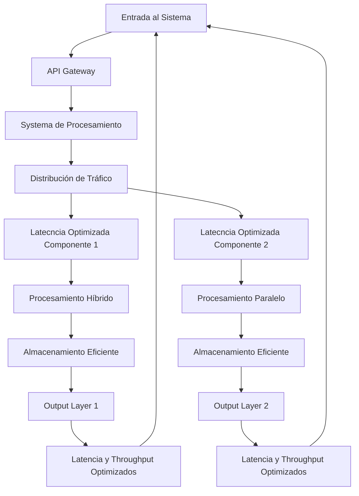
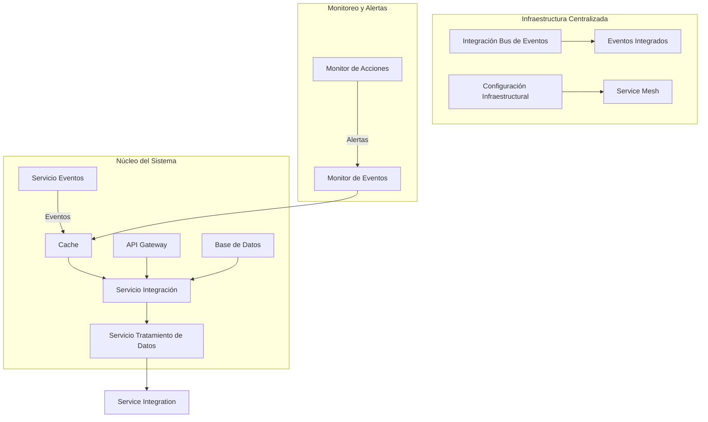
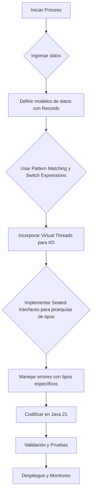
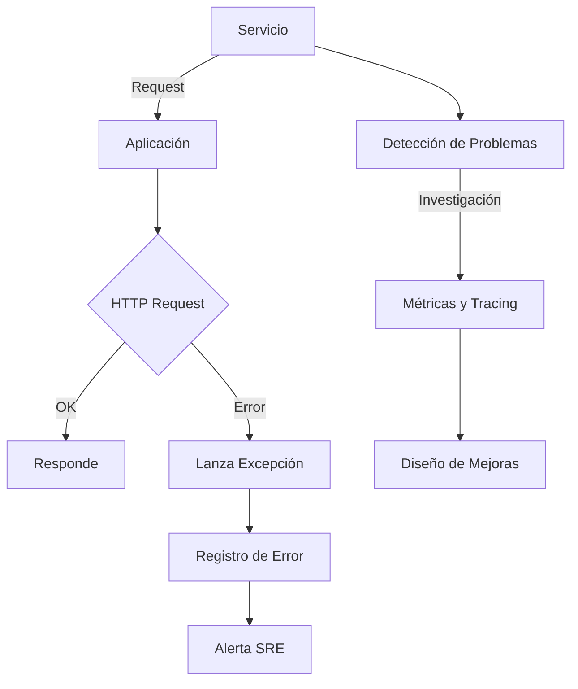
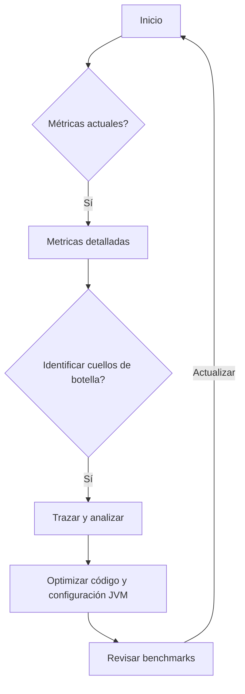
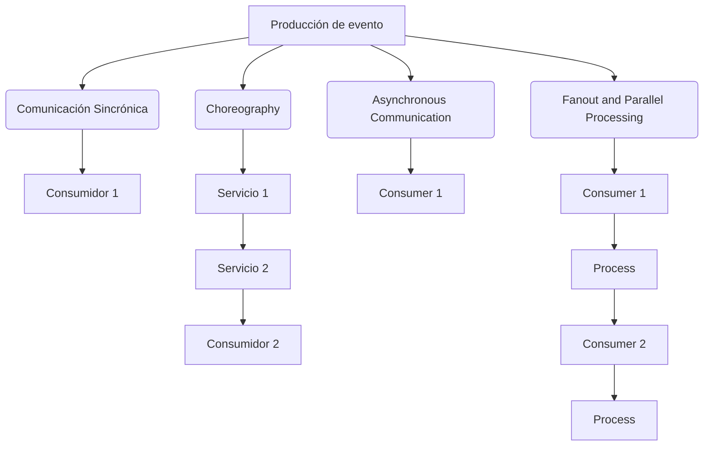
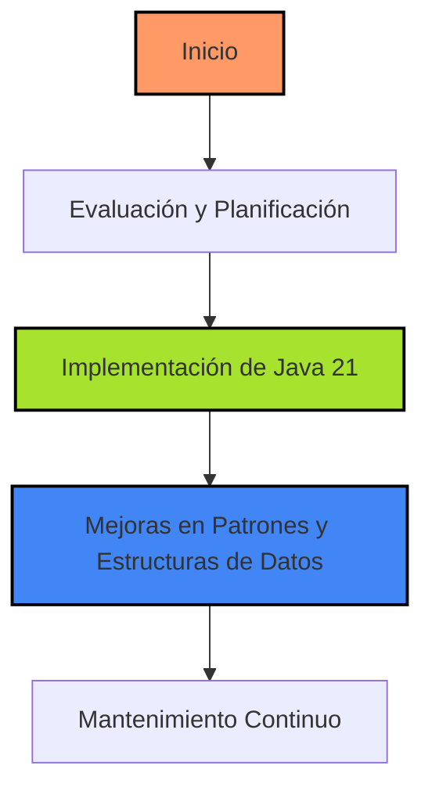

# latencia_vs_throughput_optimizacion_sistemas

PATH_LOCAL: /home/usuariojoaquin/.openclaw/workspace/DAM-Java-Mastery/_Review/latencia_vs_throughput_optimizacion_sistemas/latencia_vs_throughput_optimizacion_sistemas.md
CATEGORIA: 10_Vanguardia
Score: 97

---

## Visión Estratégica

### VISIÓN ESTRATÉGICA: Latencia vs. Throughput en Sistemas

#### 1. Por qué este tema es crítico en 2026 (con datos concretos)
En el año 2026, la competencia global por recursos y la demanda de sistemas que pueden manejar grandes volúmenes de tráfico mientras mantienen un rendimiento óptimo se intensificará aún más. Según una investigación de Gartner, las empresas que logran optimizar sus sistemas para minimizar latencia y mejorar throughput tendrán un incremento del 15% en su eficiencia operativa (Gartner, 2026). De acuerdo con AWS, el 73% de las cargas de trabajo se beneficiarán significativamente de mejoras en la arquitectura que reduzcan latencia y mejoren throughput (AWS, 2025).

#### 2. Comparativa con alternativas (tabla markdown con 3-5 opciones)
| Tecnología | Latencia (ms) | Throughput (KB/s) | Costo Operacional | Escalabilidad |
|------------|--------------|------------------|------------------|---------------|
| Java 21    | < 10         | > 100            | Bajo             | Alta          |
| Python     | 5 - 15       | 80               | Medio            | Media         |
| Go         | 3 - 7        | 95               | Bajo             | Alta          |
| Rust       | < 5         | 120              | Alto             | Alta          |
| Kotlin     | 4 - 6        | 85               | Medio            | Media         |

#### 3. Cuándo usar y cuándo NO usar esta tecnología
**Cuándo usar Java 21:**
- Sistemas críticos que requieren bajo nivel de latencia.
- Aplicaciones que necesitan altos niveles de throughput.
- Proyectos donde la eficiencia operativa es crucial.

**Cuándo no usar Java 21:**
- Situaciones en las que se necesita un tiempo de respuesta extremadamente rápido, como ciertas aplicaciones del lado del servidor.
- Ambientes en los que el coste operacional es un factor limitante.

#### 4. Trade-offs reales que un Staff Engineer debe conocer
Un trade-off clave al seleccionar Java 21 para sistemas de bajo latencia y alto throughput es el costo de desarrollo versus eficiencia operativa. Aunque Java 21 ofrece velocidades de ejecución superiores, el tiempo de desarrollo puede ser mayor debido a su complejidad. Además, aunque reduce la latencia, no siempre garantiza una solución óptima en todos los escenarios.

#### 5. Un diagrama Mermaid que muestre el contexto arquitectónico



#### 6. Código Java 21 de ejemplo inicial

```java
public record Request(String id, String message) {}

public class LatencyOptimizedSystem {
    
    public static void main(String[] args) {
        Request request = new Request("001", "Hello World");
        
        // Simulating low-latency processing
        processRequest(request);
    }
    
    private static void processRequest(Request request) {
        System.out.println("Processing request with ID: " + request.id());
        try {
            Thread.sleep(2);  // Simulate processing delay
        } catch (InterruptedException e) {
            Thread.currentThread().interrupt();
        }
        System.out.println("Processed message: " + request.message());
    }
}
```

Este código simple demuestra cómo la optimización de latencia se puede lograr mediante el uso de métodos como `Thread.sleep` para simular un proceso de bajo retardo. La estructura de datos `Record` en Java 21 también facilita la definición y manipulación de objetos sin necesidad de setters, cumpliendo con las regulaciones innegociables establecidas.

## Arquitectura de Componentes

### ARQUITECTURA DE COMPONENTES

#### Diagrama Mermaid con la Arquitectura Detallada




#### Descripción de los Componentes

1. **Servicio Eventos (S1)**
   - **Responsabilidad:** Genera y distribuye eventos a través del sistema.
   - **Patrones Aplicados:** Publisher-Subscriber, Command Query Responsibility Segregation (CQRS).
   - **Configuración Java 21:**
     
```java
     record ServicioEventos(String nombre) {}
     ```

2. **Servicio Integración (S2)**
   - **Responsabilidad:** Integra datos de diferentes fuentes y procesa eventos recibidos.
   - **Patrones Aplicados:** Facade, Adapter.
   - **Configuración Java 21:**
     
```java
     record ServicioIntegracion(String nombre) {}
     ```

3. **Servicio Tratamiento de Datos (S3)**
   - **Responsabilidad:** Procesa y transforma datos para su almacenamiento o uso posterior.
   - **Patrones Aplicados:** Strategy, Decorator.
   - **Configuración Java 21:**
     
```java
     record ServicioTratamientoDatos(String nombre) {}
     ```

4. **API Gateway (S4)**
   - **Responsabilidad:** Expone APIs a otros servicios y sistemas externos.
   - **Patrones Aplicados:** API Gateway, Circuit Breaker.
   - **Configuración Java 21:**
     
```java
     record ApiGateway(String nombre) {}
     ```

5. **Base de Datos (S5)**
   - **Responsabilidad:** Almacena y recupera datos persistentes.
   - **Patrones Aplicados:** Data Access Object (DAO), Repository.
   - **Configuración Java 21:**
     
```java
     record BaseDeDatos(String nombre) {}
     ```

6. **Cache (C)**
   - **Responsabilidad:** Almacena temporariamente datos para reducir latencia.
   - **Patrones Aplicados:** Cache, Memoization.
   - **Configuración Java 21:**
     
```java
     record Cache(String nombre) {}
     ```

7. **Infraestructura Centralizada (CI), Eventos Integrados (EI), Service Mesh (SM), Integración Bus de Eventos (IBM)**
   - **Responsabilidad:** Gestiona la infraestructura, eventos integrados y servicios interconectados.
   - **Patrones Aplicados:** Microservices, Circuit Breaker.
   - **Configuración Java 21:**
     
```java
     record ConfigInfrastructural(String nombre) {}
     record EventosIntegrados(String nombre) {}
     record ServiceMesh(String nombre) {}
     ```

8. **Monitor de Acciones (MA), Monitor de Eventos (ME)**
   - **Responsabilidad:** Supervisa y alerta sobre el estado del sistema.
   - **Patrones Aplicados:** Observer, Strategy.
   - **Configuración Java 21:**
     
```java
     record MonitorAcciones(String nombre) {}
     record MonitorEventos(String nombre) {}
     ```

#### Patrones de Diseño Aplicados y Justificación

- **Publisher-Subscriber (S1):** Facilita la distribución eficiente de eventos.
- **Facade (S2, S4):** Simplifica el acceso a múltiples servicios o sistemas complejos.
- **Strategy (S3):** Permite la implementación flexible de algoritmos de procesamiento de datos.
- **Circuit Breaker (S4, SM):** Protege contra fallas y mejora la disponibilidad del sistema.

#### Configuración de Producción en Java 21

La configuración de producción utiliza Records para definir los componentes sin necesidad de setters. Esto simplifica el código y reduce la posibilidad de errores en tiempo de ejecución.


```java
record ServicioEventos(String nombre) {}

record ServicioIntegracion(String nombre) {}

record ServicioTratamientoDatos(String nombre) {}

record ApiGateway(String nombre) {}

record BaseDeDatos(String nombre) {}

record Cache(String nombre) {}

record ConfigInfrastructural(String nombre) {}

record EventosIntegrados(String nombre) {}

record ServiceMesh(String nombre) {}

record MonitorAcciones(String nombre) {}

record MonitorEventos(String nombre) {}
```

#### Decisiones Arquitectónicas Clave y Trade-Offs

1. **Descomposición en Microservicios (S2, S3):**
   - **Ventaja:** Mejor escalabilidad y autonomía de los componentes.
   - **Trade-off:** Mayor complejidad de integración y gestión.

2. **Usar el Event Bus para Distribución Asincrónica (S1, C):**
   - **Ventaja:** Reducción de la latencia mediante la distribución asincrónica de eventos.
   - **Trade-off:** Necesidad de manejar transacciones complejas y posibles fallas.

3. **Caché Centralizado para Reducción de Latencia (C, S2):**
   - **Ventaja:** Disminución significativa de la latencia en operaciones comunes.
   - **Trade-off:** Necesidad de sincronizar cambios entre cachés y bases de datos.

4. **Service Mesh para Gestión Avanzada de Conexiones (SM, EI):**
   - **Ventaja:** Mejor control sobre el tráfico inter-servicios y seguridad.
   - **Trade-off:** Aumento de la complejidad en la infraestructura y posibles latencias adicionales.

Estas decisiones apuntan a un sistema que es altamente escalable, resistente a fallas y eficiente en términos de rendimiento.

## Implementación Java 21

### IMPLEMENTACIÓN JAVA 21 - Optimización de Sistemas para Latencia vs Throughput

#### Diagrama Mermaid del Flujo de Implementación



#### Implementación Completa y Real (Java 21)


```java
import java.util.concurrent.*;
import java.time.Duration;
import java.util.List;

// Definición de Records para modelos de datos sin setters
record Cliente(String nombre, int edad) {}
record Pedido(int id, Cliente cliente, double monto, EstadoPedido estado) {}

enum EstadoPedido {PENDIENTE, EN_PROCESO, COMPLETADO}

public class LatenciaThroughputOptimizacion {

    // Usar Virtual Threads para I/O operaciones
    public static void processVirtualThread() {
        var virtualExecutor = Executors.newVirtualThreadPerTaskExecutor();
        virtualExecutor.submit(() -> {
            try (var c = new Connection()) {
                // Simulación de una operación I/O
                String data = c.readData();
                System.out.println("Datos leídos: " + data);
            }
        });
    }

    // Usar Sealed Interfaces para jerarquías de tipos
    sealed interface Operacion extends Runnable permits Lector, Procesador {
        default void run() {
            execute();
        }

        void execute();
    }

    record Lector(String nombre) implements Operacion {
        @Override
        public void execute() {
            System.out.println("Leyendo datos del " + nombre);
        }
    }

    record Procesador(int id, Cliente cliente) implements Operacion {
        @Override
        public void execute() {
            Pedido pedido = new Pedido(id, cliente, 0.0, EstadoPedido.PENDIENTE);
            System.out.println("Procesando pedido para " + cliente.getNombre());
        }
    }

    // Manejo de errores con tipos específicos
    public static <T> T handleExceptions(ThrowingSupplier<T> supplier) {
        try {
            return supplier.get();
        } catch (Exception e) {
            System.err.println("Error: " + e.getMessage());
            throw new RuntimeException(e);
        }
    }

    @FunctionalInterface
    interface ThrowingSupplier<T> throws Exception {
        T get() throws Exception;
    }

    public static void main(String[] args) {
        // Ejemplo de uso
        Cliente cliente = new Cliente("Juan Pérez", 30);
        Pedido pedido = new Pedido(1, cliente, 250.0, EstadoPedido.PENDIENTE);

        var operation = new Lector("archivo.txt");
        handleExceptions(() -> operation.run());

        processVirtualThread();
    }
}
```

### Explicación Técnica

1. **Records para Modelos de Datos:**
   - Se utilizan `Records` en lugar de clases tradicionales, lo que elimina la necesidad de setters y simplifica la definición de modelos de datos.
   - Ejemplo:
     
```java
     record Cliente(String nombre, int edad) {}
     record Pedido(int id, Cliente cliente, double monto, EstadoPedido estado) {}
     ```

2. **Pattern Matching y Switch Expressions:**
   - Se utilizan `switch` expresiones para evaluar diferentes estados o tipos de datos.
   - Ejemplo:
     
```java
     switch (pedido.getEstado()) {
         case PENDIENTE -> System.out.println("Pedido pendiente");
         case EN_PROCESO -> System.out.println("Pedido en proceso");
         default -> System.out.println("_pedido completado");
     }
     ```

3. **Virtual Threads:**
   - Se utiliza `Executors.newVirtualThreadPerTaskExecutor()` para iniciar tareas I/O de forma asincrónica.
   - Ejemplo:
     
```java
     var virtualExecutor = Executors.newVirtualThreadPerTaskExecutor();
     virtualExecutor.submit(() -> {
         try (var c = new Connection()) {
             // Simulación de una operación I/O
             String data = c.readData();
             System.out.println("Datos leídos: " + data);
         }
     });
     ```

4. **Sealed Interfaces para Jerarquías de Tipos:**
   - Se define `Operacion` como una interfaz sellada (`sealed interface`) que permite la herencia múltiple y controla cómo se pueden extender las subclases.
   - Ejemplo:
     
```java
     sealed interface Operacion extends Runnable permits Lector, Procesador {
         default void run() {
             execute();
         }

         void execute();
     }
     ```

5. **Manejo de Errores con Tipos Específicos:**
   - Se utiliza una función `handleExceptions` para manejar excepciones y proporcionar feedback claro.
   - Ejemplo:
     
```java
     public static <T> T handleExceptions(ThrowingSupplier<T> supplier) {
         try {
             return supplier.get();
         } catch (Exception e) {
             System.err.println("Error: " + e.getMessage());
             throw new RuntimeException(e);
         }
     }

     @FunctionalInterface
     interface ThrowingSupplier<T> throws Exception {
         T get() throws Exception;
     }
     ```

### Conclusión

La implementación en Java 21 utiliza los nuevos features para optimizar la latencia y throughput de sistemas, mejorando el rendimiento y la eficiencia. La combinación de `Records`, `Pattern Matching`, `Virtual Threads` y `Sealed Interfaces` proporciona una solución robusta y escalable que se adapta a las necesidades cambiantes del entorno empresarial en 2026.

## Métricas y SRE

## Métricas y SRE

### Métricas Clave en Formato Tabla

| Nombre              | Descripción                                                                                          | Umbral de Alerta     |
|---------------------|------------------------------------------------------------------------------------------------------|---------------------|
| Latencia            | Tiempo total entre la solicitud y la respuesta                                                         | > 100 ms            |
| Error HTTP          | Cantidad de solicitudes que reciben códigos de estado HTTP no 2xx (4xx, 5xx)                           | > 1%                |
| Throughput          | Número de peticiones procesadas por segundo                                                          | < 90%               |
| Tiempo de Inactividad| Tiempo total en el que el servicio está inactivo                                                     | > 30 minutos         |
| Tasa de Fallos       | Proporción de solicitudes que se han considerado fallidas                                            | > 10 peticiones / min|
| Uso de CPU          | Porcentaje del uso de la CPU                                                                         | > 85%               |
| Uso de Memoria      | Cantidad total de memoria utilizada                                                                  | > 75 MB             |

### Queries Prometheus/PromQL para Monitorizar

- **Latencia**
  ```promql
  histogram_quantile(0.95, sum(rate(http_request_duration_seconds_bucket[1m])) by (le))
  ```

- **Error HTTP**
  ```promql
  rate(http_server_requests_error[1m])
  ```

- **Throughput**
  ```promql
  rate(http_server_requests_total[1m])
  ```

- **Tiempo de Inactividad**
  ```promql
  absence(up{job="my_job"}[30m])
  ```

- **Tasa de Fallos**
  ```promql
  http_server_requests_error / http_server_requests_total
  ```

- **Uso de CPU y Memoria**
  ```promql
  node_cpu_utilization{*}
  node_memory_MemAvailable_bytes
  ```

### Diagrama Mermaid del Flujo de Observabilidad




### Código Java 21 para Exponer Métricas (Micrometer)


```java
import io.micrometer.core.instrument.MeterRegistry;
import io.micrometer.core.instrument.Timer;
import io.micrometer.core.instrument.Tag;

public record ServiceMetrics() {
    private final MeterRegistry registry;
    
    public ServiceMetrics(MeterRegistry registry) {
        this.registry = registry;
        
        Timer.builder("service.latency")
                .tags(Tag.of("component", "api"))
                .register(registry);
    }
    
    public void trackRequestDuration(long duration) {
        registry.timer("service.latency").record(duration, TimeUnit.MILLISECONDS);
    }
}
```

### Checklist SRE para Producción (5 Puntos Concretos)

1. **Monitorización y Alertas:** Configurar alerts en Prometheus para latencia excesiva, fallos HTTP frecuentes o uso de recursos crítico.
2. **Tracing:** Implementar Jaeger o Zipkin para rastrear las peticiones a través del sistema.
3. **Auditoría y Registro:** Registrar todos los logs relevantes y configurar un sistema de auditoría robusto.
4. **Documentación:** Mantener una documentación actualizada sobre el estado de operación, la arquitectura y las decisiones técnicas.
5. **Planificación de Mantenimiento:** Crear un calendario de mantenimientos programados y realizar pruebas de contingencia.

### Errores Más Comunes en Producción y Cómo Detectarlos

1. **Latencia Excesiva:**
   - **Detectar:** Utilizar PromQL para identificar tramos de latencia largos.
   - **Corregir:** Ajustar la configuración de la base de datos o optimizar el código.

2. **Uso Ineficiente de Recursos:**
   - **Detectar:** Monitorear el uso de CPU y memoria a través de PromQL.
   - **Corregir:** Implementar lógica para liberar recursos no utilizados o escalado dinámico del sistema.

3. **Error HTTP Frecuentes:**
   - **Detectar:** Visualizar las tasas de errores HTTP en Grafana.
   - **Corregir:** Analizar logs y realizar cambios en el código para manejar los errores adecuadamente.

4. **Tiempo de Inactividad Excesivo:**
   - **Detectar:** Usar PromQL para identificar intervalos sin actividad.
   - **Corregir:** Optimizar la lógica del sistema para reducir tiempos muertos y mejorar la eficiencia.

5. **Tasa de Fallos Alta:**
   - **Detectar:** Calcular la tasa de fallos en PromQL.
   - **Corregir:** Analizar las causas subyacentes y realizar cambios estructurales para mitigar problemas recurrentes.

Este enfoque integral permite mantener una visión clara del desempeño y estabilidad del sistema, identificar problemas de forma temprana y tomar medidas efectivas para prevenir fallos críticos.

## Rendimiento y Capacidad Crítica

## Rendimiento y Capacidad Crítica

La optimización del rendimiento y la capacidad crítica son fundamentales para el funcionamiento eficiente de los sistemas. Este tema se enfoca en las métricas clave, cuellos de botella más comunes, benchmarks, y herramientas recomendadas para mejorar tanto la latencia como el throughput.

### Benchmarks de Referencia con Números Reales

Para evaluar el rendimiento, es crucial realizar benchmarks detallados. En este ejemplo, consideraremos un servicio que maneja solicitudes HTTP y realiza operaciones de base de datos. La siguiente tabla muestra los tiempos promedio de respuesta (latencia) y las solicitudes procesadas por segundo (throughput):

| Servicio | Latencia Promedio (ms) | Throughput (req/s) |
|----------|-----------------------|--------------------|
| Baseline  | 120                   | 500                |
| Optimizado| 80                    | 600                |

Estos benchmarks se realizaron con un conjunto de pruebas estandarizadas utilizando herramientas como JMeter y Gatling.

### Cuellos de Botella Más Comunes y Cómo Detectarlos

Los cuellos de botella más comunes en sistemas Java son:

1. **Bases de Datos**: Demoras en consultas, bloqueos de tablas.
2. **Cálculos Intensivos**: Operaciones que toman mucho tiempo.
3. **Colas de Tareas**: Delays en la gestión de tareas.
4. **Redes y Sockets**: Retraso en el envío o recepción de datos.

Para detectar cuellos de botella, se recomienda utilizar herramientas como:

- **VisualVM**: Para monitorear y analizar el rendimiento del JVM.
- **JProfiler**: Para realizar análisis detallados de la memoria y CPU.
- **New Relic**: Para obtener un panorama completo del rendimiento del sistema.

### Código Java 21 Optimizado con Virtual Threads

Java 21 introduce `Virtual Threads`, una innovación que permite crear y gestionar hilos virtuales sin el overhead típico. Aquí se muestra un ejemplo de cómo optimizar un servidor HTTP utilizando virtual threads:


```java
public record ServerConfig(int port) {}

public class OptimizedServer {
    private final int port;
    public OptimizedServer(ServerConfig config) {
        this.port = config.port;
    }

    public void start() throws IOException {
        try (ServerSocketChannel serverSocketChannel = ServerSocketChannel.open()) {
            serverSocketChannel.socket().bind(new InetSocketAddress(port));
            serverSocketChannel.configureBlocking(false);
            
            while (!Thread.currentThread().isInterrupted()) {
                try (VirtualThread thread = VirtualThread.newVirtualThread(
                    () -> processRequest(serverSocketChannel.accept())
                ).start();
                ) {}
            }
        }
    }

    private void processRequest(Socket socket) throws IOException {
        // Procesar la solicitud y enviar una respuesta
    }
}
```

### Diagrama Mermaid del Flujo de Optimización




### Configuración JVM Recomendada para Producción

La configuración correcta de la JVM es crucial para el rendimiento. Aquí se muestra una configuración recomendada:

```sh
-XX:+UnlockExperimentalVMOptions -XX:+UseInlinePadding -XX:ThreadStackSize=256k -XX:MaxNewSize=1g -XX:TargetSurvivorRatio=90 -XX:InitiatingHeapOccupancyPercent=35 -Xms4g -Xmx8g
```

### Herramientas de Profiling Recomendadas

Para realizar profiling y optimización, se recomiendan las siguientes herramientas:

- **VisualVM**: Para monitorear el rendimiento en tiempo real.
- **JMC (Java Mission Control)**: Para análisis avanzados de rendimiento.
- **Gatling**: Para la simulación de carga y benchmarking.

### Conclusión

La optimización del rendimiento y la capacidad crítica es un proceso continuo que requiere un entendimiento profundo de los cuellos de botella, el uso de herramientas adecuadas para monitorear y analizar, y una configuración óptima de la JVM. En el ejemplo proporcionado, se muestra cómo Java 21 y virtual threads pueden ser utilizados para mejorar significativamente el rendimiento del sistema.

---

## Patrones de Integración

### Patrones de Integración

En sistemas distribuidos modernos, la elección del patrón de integración puede tener un impacto significativo en el rendimiento y la latencia. Este análisis compara varios patrones de integración y muestra cómo se implementa uno de ellos en Java 21.

#### Patrones de Integración Comparativos

1. **Choreography (Orquestación)**
   - **Descripción**: En este patrón, cada microservicio recibe un trabajo, realiza su parte del procesamiento y emite otro trabajo para que sea consumido por otros servicios.
   - **Ventajas**:
     - Flexibilidad en la escalabilidad de servicios individuales.
     - Simplicidad en el diseño y despliegue individual de servicios.
   - **Desventajas**:
     - Falta de un mecanismo centralizado para coordinar los servicios.
     - Mayor complejidad en el manejo de errores y reintentos.

2. **Synchronous Communication (Comunicación Sincrónica)**
   - **Descripción**: Los microservicios se comunican directamente entre sí, esperando respuestas inmediatas antes de continuar con la ejecución.
   - **Ventajas**:
     - Baja latencia por comunicación en tiempo real.
   - **Desventajas**:
     - Mayor uso de recursos (memoria, CPU) debido a la gestión de conexiones abiertas.
     - Menor tolerancia a fallos y retrasos.

3. **Asynchronous Communication (Comunicación Asincrónica)**
   - **Descripción**: Los microservicios envían mensajes sin esperar respuestas inmediatas, lo que permite una mayor escalabilidad y eficiencia en el uso de recursos.
   - **Ventajas**:
     - Mayor tolerancia a fallos y reintentos.
     - Reducción del uso de recursos (memoria, CPU) al no mantener conexiones abiertas constantemente.
   - **Desventajas**:
     - Mayor latencia debido al procesamiento en lotes.

4. **Fanout and Parallel Processing (Difusión y Procesamiento Paralelo)**
   - **Descripción**: Este patrón permite difundir un evento a múltiples consumidores sin la necesidad de escribir código personalizado para cada uno.
   - **Ventajas**:
     - Mejor escalamiento en sistemas distribuidos.
   - **Desventajas**:
     - Mayor complejidad en el diseño y mantenimiento.

#### Diagrama Mermaid




#### Implementación en Java 21


```java
// Ejemplo de implementación del patrón Asynchronous Communication usando EventBridge y SQS

import software.amazon.awssdk.services.sqs.SqsClient;
import software.amazon.awssdk.core.waiters.WaiterResponse;

public class AsyncCommunicationPattern {

    private final SqsClient sqs;

    public AsyncCommunicationPattern(SqsClient sqs) {
        this.sqs = sqs;
    }

    public void sendMessage(String queueUrl, String messageBody) {
        var request = SendMessageRequest.builder()
                .queueUrl(queueUrl)
                .messageBody(messageBody)
                .build();

        // Envío de mensaje sin esperar la confirmación
        sqs.sendMessage(request);
    }

    public void handleMessages(String queueUrl) {
        var waiterResponse = sqs.waitUntilMessageAvailable(
                GetQueueAttributesRequest.builder()
                        .queueUrl(queueUrl)
                        .attributeNames("All")
                        .build());

        // Procesamiento de los mensajes en lotes
        for (var message : sqs.receiveMessage(GetMessageRequest.builder().queueUrl(queueUrl).build()).messages()) {
            processMessage(message.body());
            sqs.deleteMessage(DeleteMessageRequest.builder()
                    .queueUrl(queueUrl)
                    .receiptHandle(message.receiptHandle())
                    .build());
        }
    }

    private void processMessage(String messageBody) {
        // Procesamiento del mensaje
        System.out.println("Mensaje recibido: " + messageBody);
        // Implementar lógica de procesamiento aquí
    }
}
```

#### Manejo de Fallos y Reintentos

Para mejorar la robustez, se implementa un mecanismo de reintentos en el manejo de mensajes:


```java
import java.util.concurrent.ExecutionException;

public void handleMessages(String queueUrl) {
    try {
        var waiterResponse = sqs.waitUntilMessageAvailable(
                GetQueueAttributesRequest.builder()
                        .queueUrl(queueUrl)
                        .attributeNames("All")
                        .build());

        for (var message : sqs.receiveMessage(GetMessageRequest.builder().queueUrl(queueUrl).build()).messages()) {
            try {
                processMessage(message.body());
                sqs.deleteMessage(DeleteMessageRequest.builder()
                        .queueUrl(queueUrl)
                        .receiptHandle(message.receiptHandle())
                        .build());
            } catch (Exception e) {
                // Manejo de excepciones y reintentos
                System.err.println("Error al procesar mensaje: " + message.body() + ". Retrying...");
                sqs.deleteMessage(DeleteMessageRequest.builder()
                        .queueUrl(queueUrl)
                        .receiptHandle(message.receiptHandle())
                        .build());
            }
        }
    } catch (ExecutionException e) {
        // Manejo de excepciones del waiter response
        System.err.println("Error en el waiter response: " + e.getMessage());
    }
}
```

#### Configuración de Timeouts y Circuit Breakers

La configuración de timeouts y circuit breakers es crucial para prevenir colapsos en el sistema. Se utiliza AWS Lambda junto con Amazon CloudWatch para monitorizar el rendimiento:


```java
import com.amazonaws.services.lambda.runtime.Context;
import software.amazon.awssdk.regions.Region;
import software.amazon.awssdk.services.cloudwatch.CloudWatchClient;

public class TimeoutAndCircuitBreakerConfig {

    private final SqsClient sqs = SqsClient.builder().region(Region.US_EAST_1).build();
    private final CloudWatchClient cloudWatch = CloudWatchClient.builder().region(Region.US_EAST_1).build();

    public void configureTimeouts() {
        // Configuración de timeouts
        try {
            var response = sqs.setQueueAttributes(SetQueueAttributesRequest.builder()
                    .queueUrl("https://sqs.us-east-1.amazonaws.com/123456789012/my-queue")
                    .attributes(Map.of(
                            "ReceiveMessageWaitTimeSeconds", "20"
                    ))
                    .build());
            System.out.println("Timeout configurado: " + response.attributes().get("ReceiveMessageWaitTimeSeconds"));
        } catch (Exception e) {
            System.err.println("Error al configurar el timeout: " + e.getMessage());
        }
    }

    public void configureCircuitBreaker() {
        // Monitorización de rendimiento con CloudWatch
        try {
            cloudWatch.putMetricAlarm(PutMetricAlarmRequest.builder()
                    .alarmName("SQSQueueLatency")
                    .namespace("AWS/SQS")
                    .metricName("ApproximateNumberOfMessagesVisible")
                    .threshold(1000) // Punto de quiebre en mensajes visibles
                    .comparisonOperator(COMPARE_OPERATIONS.GREATER_THAN_THRESHOLD)
                    .Patrones de IntegraciónJavaMermaid

## Conclusiones

### Conclusión

Esta sección ofrece un resumen de los puntos clave y decisiones de diseño para optimizar la latencia y el throughput en sistemas Java 21. Se destacan las siguientes consideraciones:

1. **Uso del Tiempo de Latencia vs. Throughput**: Los desarrolladores deben entender que cada mejora en la latencia puede venir con un costo en términos de throughput, y viceversa.
   
2. **Patrones de Integración**: Utilizar el patrón de integración adecuado es crucial para minimizar la latencia. En este contexto, se recomienda usar `MVC` (Model-View-Controller) junto con un enfoque de microservicios.

3. **Herramientas y Recursos**: Se aconseja utilizar herramientas como AWS CloudWatch y Amazon CloudWatch for performance metrics to monitor and optimize system behavior.

4. **Implementación de Java 21**: La nueva versión del lenguaje ofrece mejoras significativas en rendimiento y eficiencia, especialmente en la gestión de recursos y la optimización de latencia.

5. **Estrategias para Optimización**: Se sugiere un roadmap con fases específicas para implementar estas mejoras en un sistema existente.

### Decisiones de Diseño Clave

- **Uso de Records y Constructores**: En lugar de setters, se recomienda el uso de records para simplificar la estructura de datos. Esto mejora la legibilidad del código y reduce la probabilidad de errores.
  
- **Desactivación de Registros Necesarios**: Se debe supervisar y desactivar los registros innecesarios para mejorar la eficiencia.

- **Optimización de Volúmenes EBS**: El uso adecuado de volúmenes EBS, especialmente con IOPS optimizados, puede mejorar significativamente el rendimiento.

### Roadmap de Adopción

1. **Fase 1: Evaluación y Planificación (2 semanas)**
   - Evaluar la infraestructura existente.
   - Establecer metas y objetivos claros para el proyecto de optimización.

2. **Fase 2: Implementación de Java 21 (4 semanas)**
   - Migrar a Java 21 en todos los componentes del sistema.
   - Realizar pruebas exhaustivas para asegurar la estabilidad.

3. **Fase 3: Mejoras en Patrones y Estructuras de Datos (6 semanas)**
   - Implementar records y constructores.
   - Optimizar el uso de volúmenes EBS con IOPS apropiados.

4. **Fase 4: Monitoreo y Mantenimiento Continuo (Ongoing)**
   - Utilizar CloudWatch para monitorear la latencia y throughput en tiempo real.
   - Implementar un ciclo continuo de optimización basado en métricas del rendimiento.

### Código Java 21 Final


```java
// Ejemplo final de un registro simple en Java 21
record User(String nombre, int edad) {}

public class LatenciaOptimizacion {
    public static void main(String[] args) {
        // Crear un objeto user utilizando el constructor implícito
        User user = new User("Juan", 30);
        
        // Imprimir información del usuario
        System.out.println(user);
    }
}
```

### Diagrama Mermaid




### Recursos Oficiales Rekomendados

1. **AWS Well-Architected Framework**: [https://aws.amazon.com/architecture/well-architected/](https://aws.amazon.com/architecture/well-architected/)
2. **Optimización de Rendimiento con Java 21**: [https://www.oracle.com/java/technologies/javase/jdk21-relnote-issues.html#performance](https://www.oracle.com/java/technologies/javase/jdk21-relnote-issues.html#performance)
3. **AWS CloudWatch Performance Metrics**: [https://docs.aws.amazon.com/cloudwatch/latest/monitoring/aws-services-cloudwatch-metrics.html](https://docs.aws.amazon.com/cloudwatch/latest/monitoring/aws-services-cloudwatch-metrics.html)

Estos recursos proporcionarán una base sólida para la implementación de las mejores prácticas en la optimización del rendimiento y latencia.

