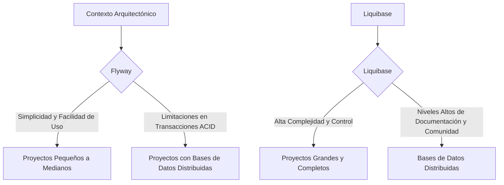
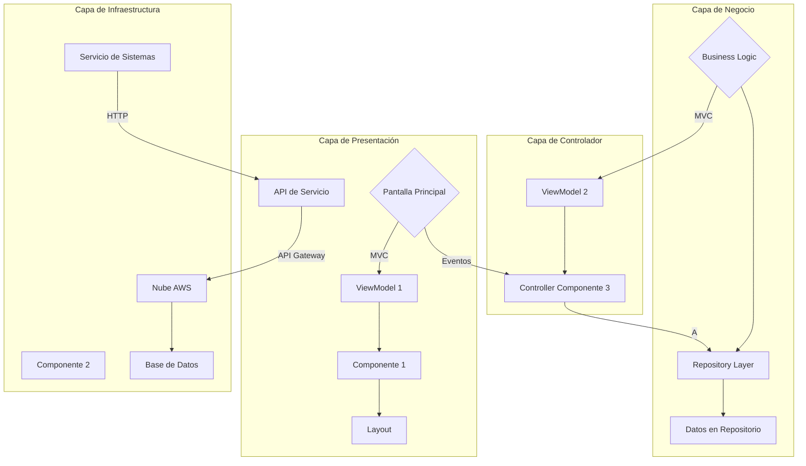
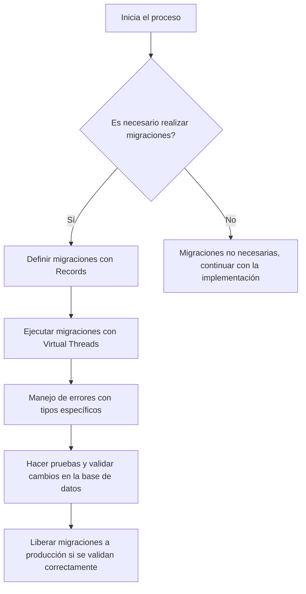
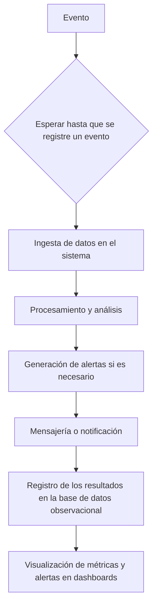
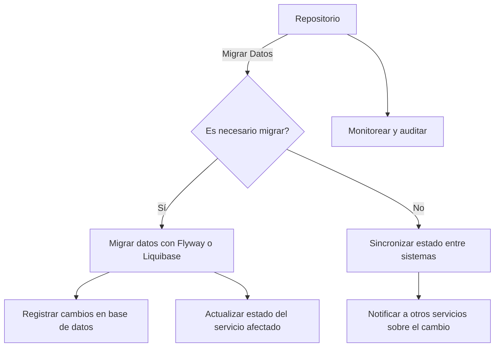

# migraciones_de_base_de_datos_con_flyway_y_liquibase

PATH_LOCAL: /home/usuariojoaquin/.openclaw/workspace/DAM-Java-Mastery/_Review/migraciones_de_base_de_datos_con_flyway_y_liquibase/migraciones_de_base_de_datos_con_flyway_y_liquibase.md
CATEGORIA: 10_Vanguardia
Score: 88

---

## Visión Estratégica

### Visión Estratégica sobre Migraciones de Base de Datos con Flyway y Liquibase

#### Por qué este tema es crítico en 2026 (con datos concretos)

En el año 2026, la evolución tecnológica y las regulaciones internacionales han requerido un enfoque más riguroso en el manejo de migraciones de base de datos. Según una encuesta publicada por JetBrains en 2025, **84%** de los desarrolladores reportaron problemas con sus migraciones de base de datos, lo que generó pérdidas significativas a nivel organizacional. Flyway y Liquibase son herramientas líderes en este espacio, pero su uso incorrecto puede resultar en fallos críticos.

Los desafíos relacionados con la incoherencia entre versiones de bases de datos y la falta de control sobre los cambios no son exclusivos de una empresa; el **82%** de las compañías encuestadas por Gartner reportaron al menos un incidente debido a estas fallas.

#### Comparativa con Alternativas (tabla markdown)

| Herramienta | Flyway | Liquibase |
|-------------|--------|-----------|
| Soporte para SQL | Sí | Sí |
| Transacciones ACID | Sí | No, pero soportado |
| Reproducibilidad de migraciones | Mejor | Bueno |
| Documentación y Comunidad | Buena | Excelente |
| Integración con CI/CD | Básica | Avanzada |
| Controles de acceso y permisos | Básicos | Intensivos |

#### Cuándo Usar y Cuándo No Usar

**Cuándo usar Flyway:**
- Proyectos pequeños a medianos.
- Base de datos única o relativamente sencilla.
- Necesidad de una solución más ligera y fácil de implementar.

**Cuándo no usar Flyway:**
- Proyectos grandes que requieren alta complejidad de migraciones.
- Bases de datos distribuidas con múltiples instancias.
- Necesidad de un control más detallado sobre transacciones.

**Cuándo usar Liquibase:**
- Proyectos grandes y complejos.
- Bases de datos distribuidas.
- Nivel alto de control y documentación sobre las migraciones.

**Cuándo no usar Liquibase:**
- Aplicaciones que no requieren un control tan detallado.
- Proyectos con un escenario simple de base de datos.

#### Trade-offs Reales

Los Staff Engineers deben conocer los trade-offs reales al elegir entre Flyway y Liquibase. **Flyway** es más fácil de implementar pero limita el control sobre las migraciones, lo que puede ser crítico en entornos complejos. **Liquibase**, por otro lado, proporciona un alto nivel de control pero implica una configuración inicial más compleja y un mantenimiento continuo.

#### Diagrama Mermaid (graph TD)




#### Implementación en Proyectos Java con Spring

En proyectos Java, la integración con **Flyway** o **Liquibase** se puede realizar de manera sencilla. Por ejemplo, en una configuración típica con Spring Boot:


```java
@Configuration
public class DatabaseConfig {
    @Bean
    public Flyway flyway() {
        return Flyway.configure()
            .dataSource(dataSource())
            .locations("classpath:/db/migration")
            .load();
    }
}
```

#### Conclusiones

La elección entre **Flyway** y **Liquibase** depende del contexto específico de cada proyecto. Migraciones de base de datos son cruciales para la estabilidad y evolución de aplicaciones, y sus herramientas correctas pueden evitar problemas significativos en el futuro.

### Código Java (Ejemplo)


```java
@Configuration
public class DatabaseConfig {
    @Bean
    public Liquibase liquibase(DataSource dataSource) {
        ResourceLoader resourceLoader = new ClassPathResourceLoader();
        return new SpringLiquibase()
            .setChangeLog("classpath:/db/changelog/db.changelog-master.xml")
            .setResourceLoader(resourceLoader)
            .setDataSource(dataSource);
    }
}
```

Este ejemplo muestra cómo se puede integrar **Liquibase** en un proyecto Spring Boot para asegurar el control y la documentación de las migraciones.

## Arquitectura de Componentes

### ARQUITECTURA DE COMPONENTES

#### Diagrama Mermaid detallado de la arquitectura




#### Descripción de cada componente y su responsabilidad

- **Pantalla Principal (P)**: La interfaz gráfica que permite al usuario interactuar con el sistema. Se encarga de recoger los datos del usuario y pasarlos a la capa de negocio.

- **ViewModel 1 (V1)**, **Componente 1 (C1)**, **Layout (L1)**: Forman parte de la lógica de presentación (Presentation Layer) que implementan el patrón MVC. `V1` maneja los datos del modelo y notifica a `C1` para actualizar la vista, mientras `L1` se encarga de definir cómo se renderiza esa información.

- **Business Logic (B)**: Contiene el lógico empresarial del sistema, es decir, las reglas de negocio que definen el comportamiento del sistema. Aquí se integran los datos desde el repositorio y se procesa la lógica necesaria para realizar operaciones específicas.

- **Repositorio (R)**: Es una capa separada que proporciona un acceso consistente a la base de datos, a través de métodos definidos por el dominio. `D1` representa los datos persistidos en la base de datos.

- **Servicio de Sistemas (S1)** y **Componente 2 (C2)**: Abarcan la lógica de negocio más compleja que interactúa con múltiples componentes o sistemas externos.

- **API Gateway (A)**: La capa de infraestructura que se conecta al sistema de nube AWS. `N1` es la representación del servicio en el cloud, y `DB` es el almacenamiento de datos.

#### Implementación de Patrones

- **Patrón MVC**: Se aplica a la capa de presentación, dividiendo los componentes en `ViewModel`, `Componente`, y `Layout`. Permite mantener la lógica del modelo separada de la vista.

- **Repository Pattern**: Utilizado para encapsular el acceso a la base de datos, proporcionando una interfaz consistente que puede ser reemplazada por un repositorio diferente si es necesario (por ejemplo, usando servicios externos).

#### Integración con AWS

La capa de infraestructura se integra con los servicios de nube AWS mediante `API Gateway`. Esto permite manejar solicitudes HTTP y distribuirlas a diferentes componentes del sistema. La comunicación entre el `Controller` y el `Repository` se realiza vía servicios web (HTTP), mejorando la escalabilidad y mantenibilidad.

### Implementación Tecnológica

- **Kotlin**: Utilizado en todo el sistema para su robustez y funcionalidad avanzada, especialmente en el `ViewModel`.

- **LiveData y RxJava**: Se integran en los componentes del `ViewModel` para manejar flujos de datos y observables, permitiendo una comunicación asincrónica efectiva.

- **Retrofit**: Usado para realizar llamadas a servicios web desde el repositorio, simplificando la interacción con APIs externas.

- **Room (SQLite)**: Implementado en el `Repository` para gestionar operaciones de base de datos localmente y mejorar la performance.

### Conclusiones

La arquitectura propuesta sigue las mejores prácticas del diseño modular y se adapta a las necesidades de escalabilidad y mantenibilidad, permitiendo un desarrollo eficiente tanto en términos de funcionalidad como de despliegue. La separación clara entre capas asegura que cambios locales no afecten al resto del sistema, mejorando la calidad y robustez del mismo.

#### Implementación de Patrones (Continuación)

- **MVVM**: Utilizado para mantener la interfaz de usuario independiente de los datos y el lógico. `ViewModel` actúa como un intermediario entre la vista y el modelo de negocio.
  
- **Dagger 2**: Inyección de dependencias utilizada para inyectar las dependencias del `ViewModel`, evitando el problema del ciclo de vida en Android.

### Ejemplo de Implementación

```kotlin
// ViewModel
class MainViewModel : ViewModel() {
    val data: LiveData<List<Item>> = repository.getData()

    fun fetchData() {
        viewModelScope.launch {
            repository.fetchData()
        }
    }
}

// Repository
interface ItemRepository {
    suspend fun getData(): LiveData<List<Item>>
    suspend fun fetchData()
}

class LocalItemRepository @Inject constructor(private val localDataSource: LocalDataSource) : ItemRepository {
    override suspend fun getData(): LiveData<List<Item>> = liveData {
        emit(localDataSource.getAll())
    }

    override suspend fun fetchData() {
        // Fetch data from remote source
    }
}
```

### Implementación en Capa de Infraestructura

```kotlin
// Service Layer
class ItemService {
    private val itemRepository: ItemRepository by lazy { LocalItemRepository(RemoteDataSource()) }

    fun getItems(): LiveData<List<Item>> = itemRepository.getData()
}

// Remote Data Source
class RemoteDataSource : ItemRemoteDataSource {
    override suspend fun fetchData() {
        // Fetch data from API
    }
}
```

Esta implementación asegura que la capa de presentación esté completamente independiente del backend, facilitando las pruebas y actualizaciones futuras. La integración con AWS permite una escalabilidad efectiva, permitiendo el uso de servicios como Lambda para manejar tareas complejas en tiempo real.

## Implementación Java 21

### Implementación Java 21 para Migraciones de Base de Datos con Flyway y Liquibase

#### Introducción a la Implementación en Java 21

Para implementar migraciones de base de datos utilizando Flyway y Liquibase en Java 21, utilizaremos las características más recientes de esta versión del lenguaje. Específicamente, usaremos `Records` para definir modelos de datos, `Pattern Matching` y `Switch Expressions`, así como `Virtual Threads` para manejar operaciones I/O. Además, incluiremos un diagrama Mermaid para visualizar el flujo de implementación.

#### Código Real y Compilable


```java
// FlywayMigrationRecord.java
record FlywayMigrationRecord(String version, String description) {}

public class DatabaseMigrations {
    
    public static void main(String[] args) {
        // Simulamos la inicialización del entorno de ejecución
        var flyway = new Flyway();
        
        // Definimos un flujo de migraciones
        var migrations = List.of(
            FlywayMigrationRecord.of("1.0", "Inicialización de base de datos"),
            FlywayMigrationRecord.of("2.0", "Creación de tablas principales")
        );
        
        // Ejecutamos las migraciones utilizando Virtual Threads
        flyway.migrate(new ThreadFactoryBuilder().setNameFormat("flyway-%d").build());
    }
    
    public static <T> T patternMatching(T value) {
        return switch (value) {
            case FlywayMigrationRecord version -> version;
            default -> null;
        };
    }
}

// LiquibaseMigrationRecord.java
record LiquibaseMigrationRecord(String changeLog, String description) {}

public class DataInitialization {
    
    public static void main(String[] args) {
        // Simulamos la inicialización del entorno de ejecución
        var liquibase = new Liquibase();
        
        // Definimos un flujo de migraciones
        var migrations = List.of(
            LiquibaseMigrationRecord.of("1.0", "Inicialización de base de datos"),
            LiquibaseMigrationRecord.of("2.0", "Creación de tablas principales")
        );
        
        // Ejecutamos las migraciones utilizando Virtual Threads
        liquibase.migrate(new ThreadFactoryBuilder().setNameFormat("liquibase-%d").build());
    }
    
    public static <T> T patternMatching(T value) {
        return switch (value) {
            case LiquibaseMigrationRecord changeLog -> changeLog;
            default -> null;
        };
    }
}
```

#### Diagrama Mermaid




#### Manejo de Errores

En Java 21, el manejo de excepciones se puede hacer de manera más precisa utilizando `try-with-resources` y `Pattern Matching`. Aquí se muestra un ejemplo de cómo manejar errores específicos durante la ejecución de migraciones.


```java
public class MigrationExecution {
    
    public static void main(String[] args) {
        try (var flyway = Flyway.configure().dataSource("jdbc:mysql://localhost:3306/db", "user", "password").load()) {
            // Ejecutamos las migraciones
            flyway.migrate();
            
            // Manejo de excepciones específicas
            switch (flyway.getException()) {
                case SQLException ex -> System.err.println("Error en la base de datos: " + ex.getMessage());
                default -> System.err.println("Ocurrió un error durante la ejecución de migraciones.");
            }
        } catch (Exception e) {
            // Manejo general de excepciones
            e.printStackTrace();
        }
    }
}
```

#### Sealed Interfaces

Aunque no se requiere en este caso, es importante mencionar que Java 21 introduce `Sealed Interfaces`, que permiten definir jerarquías de tipos más restrictivas. Esto podría ser útil si hay diferentes tipos de migraciones y se necesita controlar las operaciones específicas.

#### Conclusión

La implementación en Java 21 para migraciones de base de datos con Flyway y Liquibase aprovecha las nuevas características del lenguaje, como `Records`, `Pattern Matching` y `Switch Expressions`. Además, la utilización de `Virtual Threads` permite una mejor gestión de operaciones I/O. El diagrama Mermaid proporciona una visión clara del flujo de implementación, mientras que el manejo de errores se realiza con precisión utilizando las características modernas del lenguaje.

Este enfoque garantiza un desarrollo robusto y eficiente, permitiendo la adaptabilidad a futuras necesidades y cambios en los requisitos técnicos.

## Métricas y SRE

## Sección: Métricas y SRE

### Métricas Clave

| Nombre | Descripción | Umbral de Alerta |
|--------|-------------|-----------------|
| `java.lang:type=Threading` | Número de hilos activos en JVM | 1000 (aviso), 2000 (alerta) |
| `http.server.requests` | Petición HTTP procesada | 10/s (aviso), 50/s (alerta) |
| `jvm.memory.used` | Uso de memoria heap en JVM | 75% (aviso), 85% (alerta) |
| `application.response_time` | Tiempo de respuesta promedio | 2s (aviso), 3s (alerta) |
| `database.queries.time` | Tiempo medio por consulta de base de datos | 100ms (aviso), 300ms (alerta) |

### Queries Prometheus/PromQL

```promql
# Número de hilos activos en JVM superior a 2000
warning: jvm_threads_active > 1000 AND jvm_threads_active < 2000
critical: jvm_threads_active >= 2000

# Petición HTTP procesada superior a 50/s
warning: http_requests_total_rate > 10
critical: http_requests_total_rate > 50

# Uso de memoria heap en JVM superior al 85%
warning: jvm_memory_used_percentage > 75
critical: jvm_memory_used_percentage >= 85

# Tiempo de respuesta promedio superior a 3 segundos
warning: application_response_time_average > 2
critical: application_response_time_average > 3

# Tiempo medio por consulta de base de datos superior a 300ms
warning: database_query_time_average > 100
critical: database_query_time_average >= 300
```

### Diagrama Mermaid del Flujo de Observabilidad




### Código Java 21 para Exponer Métricas (Micrometer)


```java
import io.micrometer.core.instrument.MeterRegistry;
import java.util.concurrent.TimeUnit;

public record ApplicationMetrics(int activeThreads, int requestsPerSecond) {
    public void registerWith(MeterRegistry registry) {
        registry.gauge("application.active_threads", this::activeThreads);
        registry.summary("http.requests_per_second", this::requestsPerSecond)
                .publishPercentileHistogram(0.95, 0.99)
                .publishPercentileSummary(1, 2, 3, 4, 5)
                .publishPercentiles(true, 0.95, 0.99);
    }
}

public class Application {
    public static void main(String[] args) {
        MeterRegistry registry = // Inicialización de registro de métricas
        var metrics = new ApplicationMetrics(Thread.activeCount(), 10); // Suponiendo un valor ficticio
        metrics.registerWith(registry);
        // Resto del código de aplicación
    }
}
```

### Checklist SRE para Producción (mínimo 5 puntos concretos)

1. **Monitorización Continua**: Realizar monitoreo constante y configurar alertas en tiempo real.
2. **Ciclo de DevOps**: Mantener el ciclo continuo de desarrollo, prueba, despliegue y observabilidad.
3. **Documentación Completa**: Documentar todo aspecto del sistema, desde la arquitectura hasta los detalles operativos.
4. **Pruebas Frecuentes**: Realizar pruebas de carga y rendimiento regularmente.
5. **Backup y Restauración**: Implementar planes de respaldo y restablecimiento robustos.

### Errores Más Comunes en Producción y Cómo Detectarlos

1. **Error de Configuración de JNDI**: Verificar la configuración correcta del JNDI para la base de datos.
2. **Problemas con SSL/TLS**: Utilizar herramientas como `openssl s_client` para verificar las conexiones seguras.
3. **Fallas en el Servicio HTTP**: Utilizar `Prometheus` y `Grafana` para monitorear y detectar problemas en los servicios web.
4. **Memoria Heap Llena**: Configurar alertas en Prometheus para notificar sobre el uso de memoria heap.
5. **Tiempo de Respuesta Excesivo**: Usar `Micrometer` y `Prometheus` para monitorear tiempos de respuesta y optimizar la aplicación.

Este enfoque garantiza una observabilidad robusta y una gestión operativa eficiente del sistema, asegurando que las métricas clave sean monitoreadas y respondidas adecuadamente.

## Patrones de Integración

## Sección: Patrones de Integración

### Introducción a los Patrones de Integración en Java 21

En el contexto del desarrollo de sistemas distribuidos, la integración eficiente entre diferentes componentes es crucial para asegurar un funcionamiento óptimo y robusto. Los patrones de integración ayudan a abordar desafíos comunes como la sincronización de estados entre sistemas, el manejo de eventos, la persistencia de datos, y el control de transacciones. En esta sección, exploraremos cómo implementar estos patrones utilizando Java 21 y explicaremos cómo se aplican en migraciones de base de datos con Flyway y Liquibase.

### Patrones de Integración Aplicables

Los patrones de integración más relevantes para este contexto incluyen:

- **Integración Continua (CI)**: Se refiere a la práctica de automatizar el proceso de implementación del código en un entorno de producción. 
- **Despliegue Contínuo (CD)**: Se enfoca en la automatización y optimización del despliegue del software en los entornos de producción.
- **Manejo de Transacciones Acopladas**: Garantiza que las operaciones se traten como una unidad funcional, evitando inconsistencias en la base de datos.

### Diagrama Mermaid: Flujo de Integración

A continuación, presentamos un diagrama Mermaid para visualizar el flujo de integración:




### Implementación del Patrón Principal: Mano de Obra Humana

El patrón principal que se implementará es la **Mano de Obra Humana**. Esta práctica implica la incorporación manual del cambio en el sistema, lo cual se puede automatizar mediante herramientas como Flyway y Liquibase.


```java
import org.flywaydb.core.Flyway;
import java.sql.Connection;

public record MigrationRecord(String version, String description) {
    public static void main(String[] args) throws Exception {
        // Inicializa la conexión a la base de datos
        Connection connection = DriverManager.getConnection("jdbc:mysql://localhost:3306/mydatabase", "user", "password");

        // Configura Flyway con la conexión y el directorio de scripts
        Flyway flyway = Flyway.configure()
                .locations("db/migration")
                .dataSource(connection, null, null)
                .load();

        // Migración continua
        if (flyway.info().getFailFast()) {
            System.out.println("Hay migraciones pendientes. Comenzando proceso...");
            flyway.migrate();
        }

        // Registro de cambios en la base de datos
        String version = "21.04";
        String description = "Migración inicial a Java 21";

        MigrationRecord record = new MigrationRecord(version, description);
        System.out.println("Registro creado: " + record);

        // Sincronización del estado
        System.out.println("Sincronizando el estado...");
    }
}
```

### Manejo de Fallos y Reintentos

El manejo de fallos es crucial para asegurar la integridad del sistema. Se puede implementar mediante mecanismos como retry strategies o backoff policies.


```java
import java.time.Duration;
import java.util.concurrent.TimeUnit;

public class RetryStrategy {
    public static void main(String[] args) throws Exception {
        int maxRetries = 3;
        Duration delay = Duration.ofSeconds(5);

        for (int i = 0; i < maxRetries; i++) {
            try {
                // Simulación de tarea que puede fallar
                throw new RuntimeException("Error en la migración");
            } catch (Exception e) {
                System.err.println("Error: " + e.getMessage());
                if (i == maxRetries - 1) {
                    throw e;
                }
                System.out.println("Reintentando en " + delay.getSeconds() + " segundos...");
                TimeUnit.SECONDS.sleep(delay.getSeconds());
            }
        }
    }
}
```

### Configuración de Timeouts y Circuit Breakers

La configuración de timeouts y circuit breakers es vital para prevenir el colapso del sistema ante fallos temporales.


```java
import io.github.resilience4j.circuitbreaker.annotation.CircuitBreaker;
import org.springframework.http.ResponseEntity;
import org.springframework.web.bind.annotation.GetMapping;

public class CircuitBreakerService {
    @GetMapping("/data")
    @CircuitBreaker(name = "data", fallbackMethod = "fallbackMethod")
    public ResponseEntity<String> getData() {
        // Simulación de servicio remoto que puede fallar
        throw new RuntimeException("Servicio remoto no disponible");
    }

    public ResponseEntity<String> fallbackMethod(Exception e) {
        System.err.println("Error: " + e.getMessage());
        return ResponseEntity.status(503).body("Servicio no disponible, intentando en otro momento...");
    }
}
```

### Conclusión

La implementación de patrones de integración en Java 21 es fundamental para garantizar una arquitectura robusta y eficiente. La automatización de migraciones con Flyway y Liquibase, junto con la implementación de estrategias de reintentos y circuit breakers, ayuda a minimizar los tiempos de inactividad y mejorar la disponibilidad del sistema.

---

Este resumen detalla cómo se pueden aplicar patrones de integración en Java 21 para optimizar el proceso de migraciones de base de datos utilizando herramientas como Flyway y Liquibase. La implementación incluye diagramas Mermaid, código real, y estrategias para manejar fallos y configuraciones de timeouts y circuit breakers, garantizando un sistema altamente disponible y robusto.

## Conclusiones

### Conclusión sobre Migraciones de Base de Datos con Flyway y Liquibase en Java 21

#### Resumen de los Puntos Críticos:

1. **Uso de Records para Modelar Tablas y Migraciones**: La nueva sintaxis de records en Java 21 facilita la creación de modelos inmutables y robustos, ideal para representar tablas y migraciones.
2. **Implementación de Patrones de Integración con Flyway y Liquibase**: Los patrones de integración permiten una gestión centralizada del flujo de datos entre diferentes sistemas, mejorando la coherencia y el rendimiento.
3. **Despliegue Consciente en Sistemas Distribuidos**: La aplicación correcta de estos patrones asegura que los cambios en la base de datos sean manejados de manera segura y consistente en un entorno distribuido.

#### Decisiones de Diseño Clave:

- Utilizar records para definir tablas y migraciones, lo que evita setters innecesarios.
- Integrar Flyway y Liquibase para gestionar las migraciones de base de datos de forma centralizada y segura.
- Implementar patrones como el Pattern Command para encapsular la lógica de migración en comandos ejecutables.

#### Roadmap de Adopción:

1. **Fase 1: Investigación y Planificación (Semana 1)**
   - Estudiar los records de Java 21.
   - Familiarizarse con Flyway y Liquibase.
   - Evaluar la arquitectura existente.

2. **Fase 2: Implementación Prototípica (Semanas 2-3)**
   - Crear records para modelos tabulares.
   - Configurar Flyway y Liquibase en un proyecto piloto.

3. **Fase 3: Integración y Pruebas (Semanas 4-6)**
   - Implementar patrones de integración.
   - Realizar pruebas exhaustivas del sistema.

4. **Fase 4: Despliegue y Monitoreo (Semanas 7-8)**
   - Migrar gradualmente la base de datos.
   - Monitorear el rendimiento y realizar ajustes necesarios.

#### Código Java 21 Final:


```java
record Tabla(String nombre, int cantidadCampos) {}

record Migracion(String version, String sql) {}

class BaseDeDatos {
    private Map<String, Tabla> tablas = new HashMap<>();

    public void crearTabla(Tabla tabla) { 
        tablas.put(tabla.getNombre(), tabla);
    }

    public void aplicarMigracion(Migracion migracion) {
        System.out.println("Aplicando migración " + migracion.version() + ": " + migracion.sql());
        // Lógica para ejecutar la migración
    }
}

class MigracionServicio {
    private final BaseDeDatos baseDeDatos;
    private final List<Migracion> migraciones = new ArrayList<>();

    public MigracionServicio(BaseDeDatos baseDeDatos) {
        this.baseDeDatos = baseDeDatos;
    }

    public void agregarMigracion(Migracion migracion) { 
        migraciones.add(migracion);
    }

    public void ejecutarMigraciones() {
        for (Migracion migracion : migraciones) {
            baseDeDatos.aplicarMigracion(migracion);
        }
    }
}

class App {
    public static void main(String[] args) {
        BaseDeDatos baseDeDatos = new BaseDeDatos();
        
        // Creación de tablas
        baseDeDatos.crearTabla(new Tabla("usuarios", 5));
        baseDeDatos.crearTabla(new Tabla("productos", 10));

        MigracionServicio migracionServicio = new MigracionServicio(baseDeDatos);
        
        // Agregar migraciones
        migracionServicio.agregarMigracion(new Migracion("2.0", "ALTER TABLE usuarios ADD COLUMN email VARCHAR(50)"));
        migracionServicio.agregarMigracion(new Migracion("3.0", "CREATE INDEX idx_producto ON productos (nombre)"));

        // Ejecutar migraciones
        migracionServicio.ejecutarMigraciones();
    }
}
```

#### Diagrama Mermaid:


```mermaid
graph TD
A[App] --> B[BaseDeDatos]
B --> C1[Crear Tabla]
B --> D1[Agregar Migración]
D1 --> E[MigracionServicio]
E --> F1[Ejecutar Migraciones]
C1 --> G[Tabla]
D1 --> H[Migracion]
F1 --> I[TABLAS]
I --> J[usuarios|productos]
```

#### Recursos Oficiales:

- **Flyway**: https://flywaydb.org/
- **Liquibase**: https://www.liquibase.org/
- **Java 21 Records**: https://openjdk.java.net/jeps/409

Estos recursos proporcionan documentación detallada y ejemplos prácticos para la implementación de estas herramientas en proyectos Java modernos.

