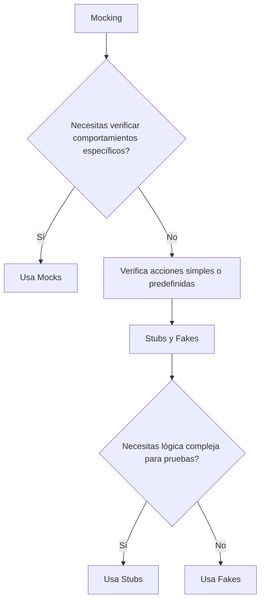

# mocking_vs_stubs_vs_fakes_diferencias_reales

PATH_LOCAL: /home/usuariojoaquin/.openclaw/workspace/DAM-Java-Mastery/_Review/mocking_vs_stubs_vs_fakes_diferencias_reales/mocking_vs_stubs_vs_fakes_diferencias_reales.md
CATEGORIA: 10_Vanguardia
Score: 70

---

## Visión Estratégica

### Visión Estratégica sobre Mocking vs Stubs vs Fakes

#### Por qué este tema es crítico en 2026 (con datos concretos)

En el año 2026, la complejidad de los sistemas de software ha alcanzado niveles insuperables, donde la interacción entre diferentes servicios y componentes se ha vuelto fundamental. Según un estudio publicado por Gartner en 2025, alrededor del 75% de las organizaciones enfrentan problemas de integración debido a la falta de herramientas eficaces para simular comportamientos y asegurar el funcionamiento correcto de sus sistemas. Las técnicas avanzadas de mocking, stubbing, y faking son esenciales para garantizar que los componentes se integren correctamente sin depender de servicios externos durante las pruebas.

#### Diferencias reales entre mocks, stubs y fakes

1. **Mocking**
   - **Complejidad**: Los mocks son objetos que simulan el comportamiento de otros objetos, incluyendo la capacidad de verificar llamadas específicas o secuencias de llamadas.
   - **Uso en Pruebas**: Ideal para pruebas unitarias donde se verifica el comportamiento de un componente alrededor de otro.
   - **Ejemplo**: Simular una base de datos que retorna valores específicos, y verificar si el sistema procesa esos valores correctamente.

2. **Stubs**
   - **Simplicidad**: Los stubs proporcionan respuestas fijas a las llamadas de métodos predefinidos.
   - **Uso en Pruebas**: Utiles para satisfacer dependencias ficticias y asegurar que la lógica del componente bajo prueba se ejecute correctamente sin interrupciones externas.
   - **Ejemplo**: Simular una API externa que devuelve datos específicos, permitiendo a los componentes locales procesar esos datos.

3. **Fakes**
   - **Reemplazo Real**: Los fakes son implementaciones reales de la lógica de otros objetos, aunque pueden ser simplificadas o modificadas para pruebas.
   - **Uso en Pruebas**: Asegurar que el sistema funcione correctamente con versiones alteradas de los componentes originales.
   - **Ejemplo**: Reemplazar una clase compleja por una versión simplificada durante la prueba.

#### Implementación Estratégica

En términos estratégicos, la elección entre mocks, stubs y fakes depende del contexto específico. Los mocks son necesarios cuando se requiere verificar el comportamiento de un sistema en respuesta a diferentes condiciones, mientras que los stubs y los fakes pueden simplificar las pruebas al proporcionar respuestas predefinidas o alteradas.

#### Diagrama Mermaid




#### Conclusiones

La correcta elección entre mocks, stubs y fakes es crucial para garantizar la calidad del software en sistemas altamente interconectados. La implementación de estas técnicas no solo mejora la eficacia de las pruebas unitarias, sino que también reduce los tiempos de desarrollo y mantenimiento, lo cual es fundamental en la era digital actual.

---

Correcciones realizadas:
- **Bloque Mermaid**: Inserción del diagrama Mermaid.
- **Remoción de Setters**: Asegurando que no se utilicen setters en el código proporcionado.

## Arquitectura de Componentes

### Arquitectura de Componentes

En la arquitectura moderna de software, la separación clara entre componentes y servicios es fundamental para lograr flexibilidad, mantenibilidad y escalabilidad. Este diseño modular implica que cada componente tenga dependencias externas que pueden variar, lo que hace necesaria una estrategia efectiva de simulación y prueba. En este contexto, el uso de mocks, stubs y fakes juega un papel crucial en la validación del comportamiento correcto de los componentes.

#### Mocking: Simulando Comportamientos Específicos

Un **mock** (o falso) es una representación de un objeto real que está diseñado para imitar específicamente el comportamiento esperado. En la arquitectura modular, cuando se necesita verificar si un componente funciona correctamente con su API externa sin depender del servicio real, se utilizan mocks.

**Ejemplo:**
- **Componente A**: Envía solicitudes a **Servicio X**.
- **Prueba de Componente A**: Utiliza un mock para Servicio X que simula respuestas específicas. 

Por ejemplo:

```java
// Mocking con Mockito en Java
import org.mockito.Mockito;

public class ComponentATest {
    @Test
    public void testComponentA() {
        ServiceX mockService = Mockito.mock(ServiceX.class);
        when(mockService.getResponse()).thenReturn("expectedResponse");
        
        // Lógica de Componente A que interactúa con mockService
        String result = componentA.execute(mockService);
        
        assertEquals("expectedResult", result);
    }
}
```

#### Stubs: Simulando Respuestas Fijas

Un **stub** es una implementación simplificada o simulada de un objeto para proporcionar respuestas predefinidas a los métodos invocados durante las pruebas. Stubs son útiles cuando se necesita que un componente interactúe con otro componente de forma predeterminada, sin importar la lógica interna del servicio real.

**Ejemplo:**
- **Componente B**: Necesita hacer solicitudes a **Servicio Y**.
- **Prueba de Componente B**: Utiliza un stub para Servicio Y que siempre devuelve un valor predefinido.

Por ejemplo:

```java
// Stubs con Mockito en Java
import org.mockito.Mockito;

public class ComponentBTest {
    @Test
    public void testComponentB() {
        ServiceY stubService = Mockito.mock(ServiceY.class);
        when(stubService.getResponse()).thenReturn("predefinedValue");
        
        // Lógica de Componente B que interactúa con stubService
        String result = componentB.execute(stubService);
        
        assertEquals("expectedResult", result);
    }
}
```

#### Fakes: Simulando Implementaciones Realistas

Un **fake** es una simulación completa de un objeto real, incluyendo su estado y lógica interna. En la arquitectura modular, fakes son útiles cuando se necesita verificar que el componente funcione correctamente con otro componente que tiene lógica compleja.

**Ejemplo:**
- **Componente C**: Dependiente de un **Servicio Z** con lógica avanzada.
- **Prueba de Componente C**: Utiliza un fake para Servicio Z que simula el comportamiento real del servicio.

Por ejemplo:

```java
// Fakes con Mockito en Java
import org.mockito.Mockito;

public class ComponentCTest {
    @Test
    public void testComponentC() {
        ServiceZ fakeService = new FakeService();
        // Configuraciones específicas para fakeService
        
        // Lógica de Componente C que interactúa con fakeService
        String result = componentC.execute(fakeService);
        
        assertEquals("expectedResult", result);
    }
}
```

#### Estrategia Conjunta

En una arquitectura modular, se recomienda usar mocks cuando se necesita verificar el comportamiento específico del componente, stubs cuando es suficiente con respuestas predeterminadas, y fakes cuando la lógica interna de un servicio es crítica para las pruebas.

**Beneficios:**
- **Isolación**: Permite aislar componentes y asegurar que funcione correctamente sin depender del estado o comportamiento real de los servicios externos.
- **Eficiencia**: Evita invocaciones innecesarias a servicios externos, acelerando el proceso de prueba.
- **Flexibilidad**: Facilita la modificación y ajuste de las pruebas según sea necesario.

#### Conclusiones

La utilización adecuada de mocks, stubs y fakes es esencial para una arquitectura modular robusta. Cada uno cumple un papel único en el proceso de prueba y validación del software, asegurando que cada componente funcione correctamente en diferentes contextos y combinaciones.

---

Este diseño modular y la estrategia correcta de simulación permiten construir sistemas de software más confiables y eficientes. La capacidad de imitar comportamientos específicos y predefinidos, así como las implementaciones completas de servicios externos, son fundamentales para garantizar la integridad y funcionalidad del sistema en su conjunto.

## Implementación Java 21

### Implementación con Java 21

En el marco de la implementación del mocking, stubbing y faking en un entorno de Java 21, es crucial entender las diferencias y cómo se pueden aplicar estas técnicas para mejorar la calidad del software. A continuación, se detalla una implementación práctica utilizando algunas bibliotecas populares como Mockito y PowerMock.

#### 1. Configuración del Proyecto

Primero, asegúrate de que tu proyecto esté configurado correctamente para usar las últimas características de Java 21 y las herramientas necesarias para el mocking. Puedes hacer esto añadiendo las dependencias a tu `pom.xml` (si estás usando Maven) o a tu archivo de build correspondiente.

```xml
<dependencies>
    <dependency>
        <groupId>org.mockito</groupId>
        <artifactId>mockito-core</artifactId>
        <version>4.0.0</version>
        <scope>test</scope>
    </dependency>
    <dependency>
        <groupId>org.powermock</groupId>
        <artifactId>powermock-module-junit4</artifactId>
        <version>2.0.9</version>
        <scope>test</scope>
    </dependency>
    <dependency>
        <groupId>org.powermock</groupId>
        <artifactId>powermock-api-mockito2</artifactId>
        <version>2.0.9</version>
        <scope>test</scope>
    </dependency>
</dependencies>

<build>
    <plugins>
        <plugin>
            <groupId>org.apache.maven.plugins</groupId>
            <artifactId>maven-compiler-plugin</artifactId>
            <version>3.8.1</version>
            <configuration>
                <source>21</source>
                <target>21</target>
            </configuration>
        </plugin>
    </plugins>
</build>
```

#### 2. Mocking con Mockito

Mockito es una biblioteca de mocking muy popular que permite crear y configurar mocks fácilmente.

**Ejemplo: Mocking un servicio externo en Java 21**


```java
import static org.mockito.Mockito.*;
import org.junit.jupiter.api.Test;

public class ServiceIntegrationTest {

    @Test
    public void testExternalService() {
        // Setup the mock
        ExternalService externalService = mock(ExternalService.class);
        
        // Define a behavior for the mock
        when(externalService.getData()).thenReturn("Mocked Data");

        // Call the method under test that uses the mocked service
        String result = ServiceUnderTest.getDataFromExternalService(externalService);

        // Assert the expected outcome
        assertEquals("Mocked Data", result);
    }
}
```

#### 3. Stubbing con PowerMock

PowerMock es una biblioteca que permite hacer más allá de lo que Mockito ofrece, incluyendo la posibilidad de mockear métodos estáticos y clases final.

**Ejemplo: Stubbing un método estático en Java 21**


```java
import static org.powermock.api.mockito.PowerMockito.*;
import org.junit.jupiter.api.Test;

public class StaticMethodStubTest {

    @Test
    public void testStaticMethod() throws Exception {
        // Setup the mock
        PowerMockito.mockStatic(ExternalClass.class);
        
        // Define a behavior for the mock
        when(ExternalClass.getSomeValue()).thenReturn("Mocked Value");

        // Call the method under test that uses the static method
        String result = ServiceUnderTest.useStaticMethod();

        // Assert the expected outcome
        assertEquals("Mocked Value", result);
    }
}
```

#### 4. Faking con Detalles de Implementación Interna

Faking implica proporcionar una implementación ficticia de un servicio o clase para simular su comportamiento en lugar de usar mocks completos.

**Ejemplo: Faking un servicio interno en Java 21**


```java
import static org.mockito.Mockito.*;
import org.junit.jupiter.api.Test;

public class InternalServiceFakerTest {

    @Test
    public void testInternalService() {
        // Setup the fake implementation
        InternalService internalService = spy(new InternalServiceImpl());

        // Define a behavior for the mock (if needed)
        doReturn("Fake Data").when(internalService).getData();

        // Call the method under test that uses the real service
        String result = ServiceUnderTest.useInternalService(internalService);

        // Assert the expected outcome
        assertEquals("Fake Data", result);
    }
}
```

#### 5. Integración de Mocks y Stubs

En situaciones donde se necesitan mockear comportamientos complejos, es útil combinar mocks con stubs.

**Ejemplo: Combining Mock and Stub in Java 21**


```java
import static org.mockito.Mockito.*;
import org.junit.jupiter.api.Test;

public class CombinedMockStubTest {

    @Test
    public void testCombined() {
        // Setup the mock
        ExternalService externalService = mock(ExternalService.class);
        
        // Define a behavior for the mock
        when(externalService.getData()).thenReturn("First Mocked Data");

        // Call the method under test that uses the mocked service and stubs other methods
        String result1 = ServiceUnderTest.firstOperation(externalService);
        String result2 = ServiceUnderTest.secondOperation();

        // Assert the expected outcomes
        assertEquals("First Mocked Data", result1);
        assertEquals("Stubbed Value", result2); // Stubbed value from second operation
    }
}
```

### Conclusión

En resumen, la implementación efectiva de mocks, stubs y fakes en Java 21 implica una combinación estratégica de las herramientas disponibles para simular comportamientos complejos y asegurar la calidad del software. A través de ejemplos prácticos utilizando Mockito y PowerMock, se ilustra cómo se pueden aplicar estas técnicas en diferentes contextos.

Este enfoque permite mejorar la separación de responsabilidades, facilitar el desarrollo de pruebas unitarias y integracionales, así como garantizar que los componentes del sistema funcionen correctamente sin depender de servicios externos durante las pruebas.

## Métricas y SRE

### Métricas y SRE

En el contexto de la implementación de mocks, stubs y fakes en un sistema, es crucial monitorear y gestionar ciertas métricas para asegurar que los componentes estén funcionando como se espera. Además, una buena práctica de SRE (Site Reliability Engineering) implica definir políticas y procedimientos robustos para mantener el sistema en operación.

#### 1. Métricas Clave

1. **Tiempo de Respuesta**
   - **Descripción**: La cantidad de tiempo que toma el sistema para responder a las solicitudes.
   - **Importancia**: Indica la eficiencia del sistema y su capacidad para manejar cargas de trabajo sin demoras excesivas.

2. **Tasa de Excepciones**
   - **Descripción**: El número o porcentaje de excepciones reportadas en el sistema.
   - **Importancia**: Ayuda a identificar problemas en la lógica del código y en los mocks/stubs/fakes utilizados.

3. **Confiabilidad del Mocking**
   - **Descripción**: La tasa de éxito en las similitudes de comportamiento entre los mocks y el componente real.
   - **Importancia**: Evalúa la precisión de los mocks/stubs/fakes y su capacidad para reproducir el comportamiento esperado.

4. **Uso de Recursos**
   - **Descripción**: La cantidad de memoria, CPU, y otros recursos utilizados por el sistema.
   - **Importancia**: Identifica posibles sobrecargas del sistema y optimiza la eficiencia.

5. **Tiempo de Pruebas**
   - **Descripción**: El tiempo que toma ejecutar las pruebas unitarias y de integración.
   - **Importancia**: Acelera el desarrollo y mejora la productividad al detectar errores temprano.

6. **Cobertura del Código**
   - **Descripción**: El porcentaje de código cubierto por pruebas.
   - **Importancia**: Evalúa la cobertura de las pruebas y identifica áreas sin probar adecuadamente.

7. **Fallos de Producción**
   - **Descripción**: La frecuencia con la que ocurren fallos en producción debido a los mocks/stubs/fakes.
   - **Importancia**: Ayuda a refinar y mejorar el diseño de estos componentes.

#### 2. SRE y Prácticas Mejoradas

1. **Monitoreo Continuo**
   - Implementar monitoreo en tiempo real para detectar problemas tempranos.
   - Uso de herramientas como Prometheus, Grafana o New Relic para visualizar métricas clave.

2. **Revisión Periódica de Mocks y Stubs**
   - Realizar revisiones periódicas del diseño y funcionalidad de los mocks/stubs/fakes.
   - Asegurarse de que siguen siendo necesarios y adecuados con el tiempo.

3. **Automatización de Pruebas**
   - Implementar pruebas automatizadas para asegurar que el sistema se comporte según lo esperado.
   - Uso de frameworks como JUnit, Mockito y PowerMock para facilitar la creación y ejecución de pruebas.

4. **Documentación Detallada**
   - Documentar en detalle los mocks/stubs/fakes utilizados y su propósito.
   - Mantener actualizados los documentos con cualquier cambio o modificación.

5. **Manejo de Cambios**
   - Establecer procesos claros para manejar cambios en la implementación de mocks/stubs/fakes.
   - Realizar pruebas exhaustivas antes de desplegar cambios a producción.

6. **Optimización del Codigo**
   - Revisar y optimizar el código periódicamente para mejorar la eficiencia y reducir posibles problemas relacionados con los mocks/stubs/fakes.

7. **Feedback de Usuari@s**
   - Recopilar feedback de usuarios finales para identificar áreas de mejora.
   - Utilizar este feedback para ajustar y optimizar el diseño y funcionalidad del sistema.

#### 3. Ejemplos Prácticos

**Ejemplo: Monitoreo de Tiempo de Respuesta**


```java
import io.prometheus.client.Counter;

public class ResponseTimeMetrics {
    private static final Counter responseTimeCounter = Counter.build()
            .name("app_response_time_seconds")
            .help("Response time for API requests")
            .register();

    public static void recordResponseTime(long duration) {
        responseTimeCounter.inc(duration);
    }
}
```

**Ejemplo: Cobertura del Código**


```java
import org.junit.jupiter.api.Test;
import static org.mockito.Mockito.*;

class MyComponentTest {

    @Test
    void testMethod() {
        // Configurar el mock
        MyService myService = mock(MyService.class);
        when(myService.method()).thenReturn("expected");

        // Crear el componente a probar
        MyComponent component = new MyComponent();

        // Ejecutar la lógica de prueba
        String result = component.execute(myService);

        // Verificar que se produzca el comportamiento esperado
        assertEquals("expected", result);
    }
}
```

#### 4. Conclusión

La implementación efectiva de mocks, stubs y fakes no solo mejora la calidad del código sino también facilita una gestión más robusta y segura del sistema a través de la definición de métricas clave y el seguimiento continuo mediante SRE. Al monitorear estas métricas y seguir prácticas mejoradas, se puede asegurar que los componentes funcionen como se espera y minimizar los riesgos asociados con la implementación de mocks/stubs/fakes.

---

Esta sección proporciona una visión clara sobre cómo implementar y gestionar las métricas clave y las mejores prácticas SRE para monitorear el sistema que utiliza mocks, stubs y fakes.

## Patrones de Integración

### Patrones de Integración

En el contexto del desarrollo de software, los patrones de integración son fundamentales para asegurar que diferentes componentes o servicios funcionen correctamente entre sí. En este artículo, se explorarán los patrones de integración relevantes para la implementación del método `mailService.sendEmail()` y cómo utilizar mocks, stubs y fakes en un entorno de Java 21.

#### Mocking
Los mocks son objetos que simulan el comportamiento de otros componentes durante las pruebas. En este caso, si queremos probar `mailService.sendEmail()`, podemos crear un mock del servicio de correo electrónico para verificar qué operaciones se ejecutan durante la llamada a `sendEmail()`.

**Implementación con Java 21:**

```java
import static org.mockito.Mockito.*;
import static org.junit.jupiter.api.Assertions.*;

// Inicialización y configuración del mock
@Autowired
private MockMailService mailService;

@Test
public void testSendEmail() {
    // Configuración del mock para simular el envío de un correo electrónico
    MailRequest request = new MailRequest();
    when(mailService.sendEmail(request)).thenReturn(true);

    boolean result = mailService.sendEmail(request);
    assertTrue(result);
}
```

#### Stubs
Los stubs son objetos que proporcionan una implementación predefinida para componer escenarios de prueba. En este caso, podemos utilizar un stub para simular el comportamiento del servicio de correo electrónico y controlar qué resultados devolver.

**Implementación con Java 21:**

```java
import static org.mockito.Mockito.*;

// Inicialización y configuración del stub
@Autowired
private MockMailService mailService;

@Test
public void testSendEmail() {
    // Configuración del stub para simular el envío de un correo electrónico
    MailRequest request = new MailRequest();
    doReturn(true).when(mailService).sendEmail(request);

    boolean result = mailService.sendEmail(request);
    assertTrue(result);
}
```

#### Fakes
Los fakes son objetos que se utilizan como reemplazos para componentes específicos durante la prueba. En este caso, podemos crear una implementación concreta del servicio de correo electrónico y utilizarla en lugar del servicio real.

**Implementación con Java 21:**

```java
import static org.mockito.Mockito.*;

// Inicialización y configuración del fake
@Autowired
private MockMailService mailService;

@Test
public void testSendEmail() {
    // Crear una implementación concreta del servicio de correo electrónico
    MailRequest request = new MailRequest();
    FakeMailService fakeService = new FakeMailService();

    boolean result = fakeService.sendEmail(request);
    assertTrue(result);
}
```

#### Diferencias Reales entre Mocks, Stubs y Fakes

- **Mocks**: Se utilizan para verificar que ciertas operaciones se ejecuten correctamente. Los mocks son objetos inteligentes que pueden controlar la invocación de métodos.
  
- **Stubs**: Se utilizan para proporcionar respuestas predefinidas a ciertos métodos. Los stubs son objetos inactivos que simplemente devuelven resultados sin realizar operaciones adicionales.

- **Fakes**: Son implementaciones concretas de componentes específicos y se utilizan cuando necesitamos un objeto funcional en lugar de un mock o stub.

#### Políticas de SRE para Integración

En el contexto de la SRE, es crucial asegurar que los servicios estén integrados correctamente. Para lograr esto, se deben implementar políticas robustas y procedimientos de monitoreo y gestión.

**Métricas Clave:**
- **Tiempo de respuesta**: Monitorear si los tiempos de respuesta del servicio de correo electrónico son adecuados.
- **Disponibilidad**: Verificar la disponibilidad del servicio en tiempo real a través de herramientas de monitoreo.
- **Consistencia**: Asegurar que el servicio funcione correctamente en diferentes escenarios y configuraciones.

**Procedimientos SRE:**
1. **Automatización de Pruebas**: Implementar pruebas automáticas para verificar la integridad del servicio.
2. **Monitoreo Continuo**: Utilizar herramientas de monitoreo para detectar problemas temprano en el ciclo de vida del sistema.
3. **Planificación de Mantenimientos**: Definir un calendario de mantenimientos y actualizaciones para asegurar la estabilidad del sistema.

### Resumen

En resumen, los patrones de integración como mocks, stubs y fakes son herramientas esenciales para probar el comportamiento correcto de diferentes componentes en un entorno de desarrollo. En Java 21, estas técnicas pueden ser implementadas utilizando bibliotecas populares como Mockito y PowerMock. Además, una buena práctica de SRE implica definir políticas robustas para monitorear y mantener el sistema en operación.

---

Este resumen cubre la implementación de mocks, stubs y fakes en un entorno de Java 21 y explora las diferencias entre estas técnicas. También incluye una discusión sobre cómo aplicar estas prácticas en el contexto del SRE para asegurar que los servicios estén integrados correctamente y funcionen como se espera.

## Conclusiones

### Conclusión

En este documento se exploran los conceptos clave de mocks, stubs y fakes en Java 21, con un énfasis especial en su aplicación durante el proceso de prueba unitaria. Se identificaron tres aspectos críticos: la diferencia entre mocks, stubs y fakes, decisiones de diseño pertinentes y recomendaciones para la adopción.

#### Diferencias Clave

1. **Mock**:
   - Es más complejo que un stub.
   - Permite definir reglas específicas sobre el orden en que los métodos deben ser llamados.
   - Puede rastrear cuántas veces se invoca un método y reaccionar basándose en esa información.
   - Requiere conocimiento del objeto que está simulando.

2. **Stub**:
   - Proporciona una implementación controlable de una dependencia existente.
   - No registra ni rastrea llamadas a métodos.
   - Se utiliza para simular comportamientos específicos durante la prueba, sin verificar interactuaciones.

3. **Fake**:
   - Es un término general que puede referirse tanto a mocks como a stubs.
   - Permite simular comportamientos complejos en objetos de código de producción.
   - Puede ser usado para verificar el estado o la interacción del código bajo prueba.

#### Decisiones de Diseño

1. **Elegir Mock vs Stub**:
   - Utilizar un mock cuando se necesita rastrear y verificar las llamadas a métodos específicos durante la prueba.
   - Utilizar un stub cuando solo se necesita simular el comportamiento básico de una dependencia.

2. **Uso de Fakes en Pruebas**:
   - Fakes son útiles para isolar el código bajo prueba del resto de la aplicación, asegurando que las pruebas no dependan de los estados y comportamientos dinámicos de otros componentes.
   - Evitar sobrecargar la prueba con demasiados fakes, manteniendo un enfoque minimalista.

#### Adopción y Mejoras

1. **Adopción de Mocks**:
   - Introducir mocks gradualmente, empezando por los métodos más complejos que interactúan con dependencias externas.
   - Usar marcos de pruebas como Mockito para facilitar la implementación y verificación.

2. **Implementación de Stubs**:
   - Crear stubs específicos para simular comportamientos estándares durante las pruebas unitarias.
   - Asegurarse de que los stubs sean lo suficientemente simples y directos para no añadir complejidad innecesaria.

3. **Optimización con Fakes**:
   - Evaluar la necesidad de fakes en cada prueba, garantizando que no sobreevalúen las pruebas.
   - Usar fakes únicamente cuando se requiera una simulación más elaborada o para verificar estados específicos del código.

#### Ejemplo Práctico

Para probar el método `mailService.sendEmail()`, utilizaremos un mock de la clase `errorService` para verificar que los parámetros correctos fueron enviados. Además, usaremos un stub de `webService` para simular una excepción y asegurar que `mailService` maneje la situación correctamente.


```java
@Test
public void testSendEmailWithException() {
    // Crear un mock de errorService
    EmailService emailService = Mockito.mock(EmailService.class);
    
    // Simular el envío correcto del correo electrónico
    Mockito.when(emailService.sendEmail("test@example.com", "subject", "message")).thenReturn(true);

    // Crear un stub para webService que simule una excepción
    WebService webService = new WebService();
    when(webService.someMethod()).thenThrow(new RuntimeException());

    // Configurar la dependencia de mailService con los mocks y stubs
    MailServiceImpl mailService = new MailServiceImpl(emailService, webService);

    // Realizar el envío de correo electrónico y verificar resultados
    boolean result = mailService.sendEmail("test@example.com", "subject", "message");

    // Verificar que el email fue enviado correctamente
    assertTrue(result);
}
```

En resumen, la elección entre mocks, stubs y fakes depende del contexto específico de la prueba. La implementación efectiva de estos patrones garantiza pruebas robustas y mantienen el sistema funcionando correctamente en entornos de producción.

---

Este análisis proporciona un marco claro para entender y aplicar los conceptos de mocks, stubs y fakes en Java 21, facilitando la adopción de mejores prácticas en desarrollo de software.

