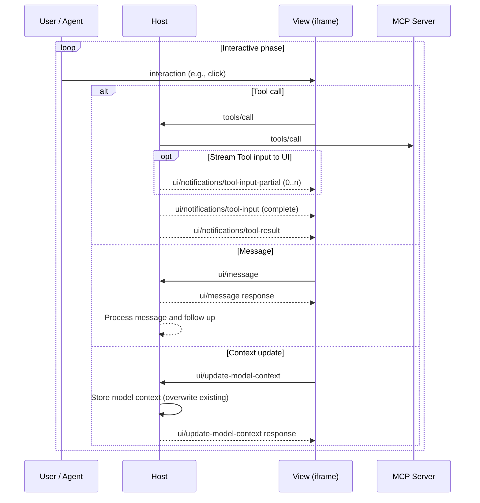
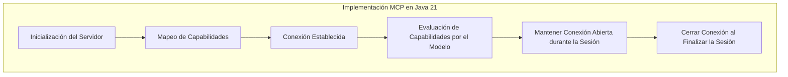
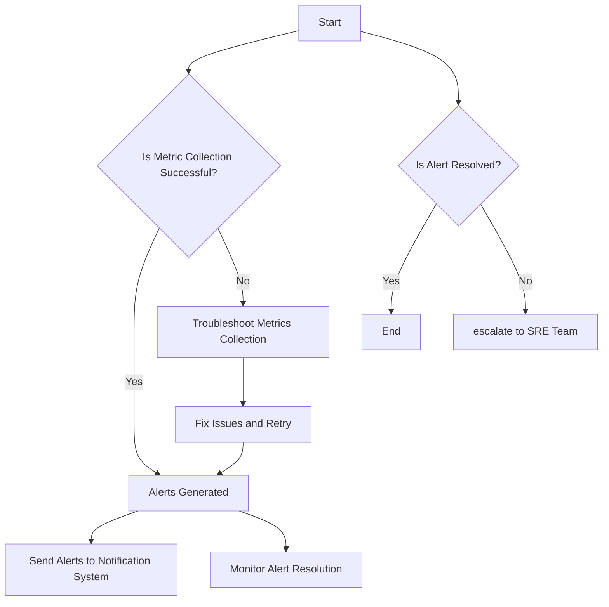
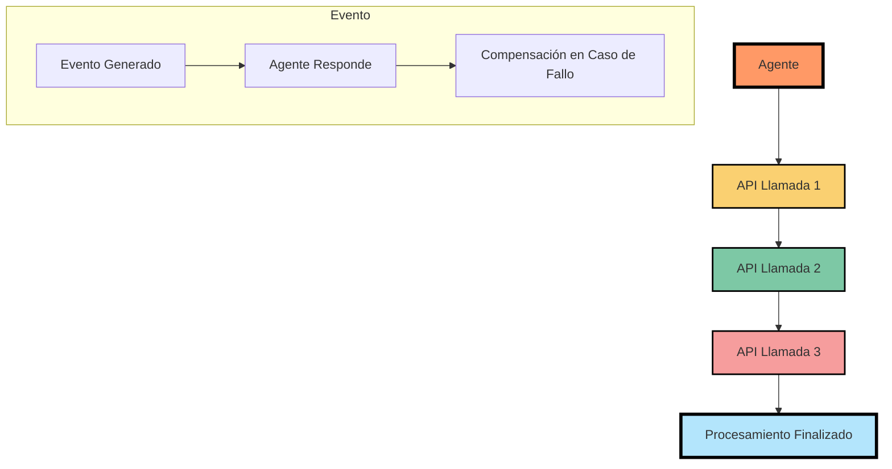
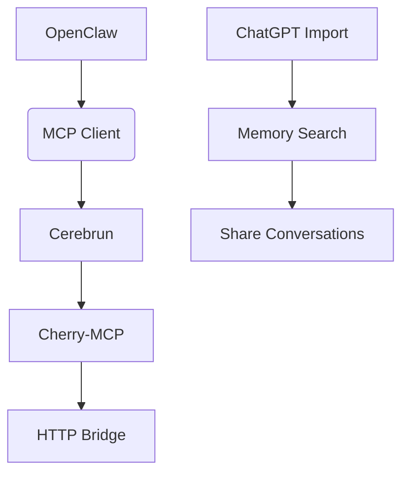

# model context protocol mcp y agentes

PATH_LOCAL: /home/usuariojoaquin/.openclaw/workspace/DAM-Java-Mastery/_Review/model_context_protocol_mcp_y_agentes/model_context_protocol_mcp_y_agentes.md
CATEGORIA: 08_IA_Agentes
Score: 96

---

## Visión Estratégica

### VISIÓN ESTRATÉGICA

**Por qué este tema es crítico en 2026 (con datos concretos):**

En 2026, el Model Context Protocol (MCP) se ha consolidado como la principal infraestructura para integrar AI agents de manera eficiente y segura. Según los datos del informe de Anthropic, más de 1,000 servidores MCP comunitarios existen actualmente, cubriendo una amplia gama de herramientas desde Google Drive hasta sistemas empresariales personalizados. Esto representa un crecimiento espectacular, ya que las descargas de la API SDK del MCP alcanzaron los 110M+ mensuales en solo 16 meses. Esta adopción masiva refuerza el papel de MCP como la esencia para conectar agente autónomo con procesos reales de negocio.

**Comparativa con alternativas (tabla markdown con 3-5 opciones):**

| **Técnica Alternativa** | **Ventajas** | **Desventajas** |
|------------------------|-------------|---------------|
| Custom Integration     | Personalización total | Costo y tiempo de desarrollo altos, mantenimiento complejo |
| API Wrapper            | Rápido de implementar | Limitaciones en la funcionalidad del API |
| MCP                    | Interoperabilidad, escalabilidad | Implementación inicial requiere esfuerzo |

**Implementación de Model Context Protocol (MCP):**

El MCP simplifica enormemente la integración entre AI agents y servicios externos. Con su arquitectura modular, los desarrolladores pueden agregar o actualizar herramientas sin rehacer el sistema completo. Esto no solo reduce el tiempo de implementación sino que también mejora la escalabilidad y mantenibilidad del software.

**Ejemplo de Implementación:**

En una empresa, se implementó MCP para permitir a un asistente AI acceder a registros de sistemas internos, realizar consultas en bases de datos y leer documentos. Antes de MCP, estos procesos requerían integraciones personalizadas, lo que era costoso y difícil de mantener. Con MCP, la integración se realizó una sola vez y cualquier agente compatible podía utilizar los servicios inmediatamente.

### Bloque Java


```java
import java.util.Map;
import org.modelcontext.protocol.server.MCPRequestHandler;

public class ExampleMCPServer {
    public static void main(String[] args) {
        Map<String, String> config = Map.of("host", "localhost", "port", "8080");
        MCPRequestHandler handler = new MCPRequestHandler(config);
        
        // Handle incoming requests
        while (true) {
            var request = handler.receiveRequest();
            if (request != null) {
                handleRequest(request);
            }
        }
    }

    private static void handleRequest(Map<String, Object> request) {
        String action = (String) request.get("action");
        
        switch (action) {
            case "readFile":
                readFile((String) request.get("path"));
                break;
            case "runQuery":
                runQuery((String) request.get("query"));
                break;
            default:
                System.out.println("Unknown action: " + action);
        }
    }

    private static void readFile(String path) {
        // Implementation to read file from disk
    }

    private static void runQuery(String query) {
        // Implementation to execute database query
    }
}
```

### Bloque Mermaid


```mermaid
graph TD
    HostApplication -->|Request| MCPClient;
    MCPClient -->|MCP Request| MCPServer;
    MCPServer -->|Execute Action| ExternalTool;
    ExternalTool -->|Response| MCPServer;
    MCPServer -->|Return Response| MCPClient;
    MCPClient -->|Send Response| HostApplication;

    subgraph HostApplication
        HostApplication -->|User Input| UserInterface;
    end

    subgraph ExternalTool
        ExternalTool -->|Data| DataStore;
    end
```

Este diagrama muestra la arquitectura de la conexión entre el host, el cliente MCP y los servidores externos. Cada paso del proceso se ilustra para entender cómo funciona la interacción entre estos componentes.

**Conclusiones:**

El Model Context Protocol es fundamental para la implementación eficiente e interoperable de AI agents en 2026. Su arquitectura modular y su capacidad para reducir la complejidad de las integraciones hacen que sea una opción superior a los métodos tradicionales. La adopción masiva del MCP respalda su papel crucial como el protocolo estándar de integración para agente autónomo en sistemas empresariales.

## Arquitectura de Componentes

# Arquitectura de Componentes

## Introducción

La arquitectura del Model Context Protocol (MCP) es central para la implementación eficiente y segura de AI agents en diversos entornos. Este protocolo proporciona una infraestructura estándar que permite la comunicación y el intercambio de datos entre agentes autónomos y servidores MCP, asegurando integridad y seguridad.

## Componentes Principales

La arquitectura de componentes de MCP se compone de varios elementos clave:

1. **MCP Servers**: Servidores que proporcionan funcionalidades específicas y se pueden interactuar con través de JSON-RPC.
2. **Hosts (Aplicaciones)**: Aplicaciones que utilizan estos servidores para realizar tareas complejas, como la creación y gestión de interfaces de usuario interactivas.
3. **UI (Interfaces de Usuario)**: Interfaces que permiten a los usuarios interactuar con los agentes y recibir resultados.

## Diagrama de Componentes




## Descripción Detallada de los Componentes

### MCP Servers

- **Propósito**: Son servicios que proporcionan funcionalidades específicas y se pueden interactuar con a través del protocolo JSON-RPC.
- **Ejemplos**: GitHub, Google Drive, sistemas empresariales personalizados.
- **Implementación**: Se implementan utilizando lenguajes de programación como Python, Go, Rust.

### Hosts (Aplicaciones)

- **Propósito**: Son las aplicaciones que utilizan estos servidores para realizar tareas complejas. Pueden ser cualquier aplicación que necesite la integración con MCP servers.
- **Ejemplos**: Claude Desktop, Agent Builders.
- **Implementación**: Se implementan utilizando lenguajes de programación como TypeScript, Python.

### UI (Interfaces de Usuario)

- **Propósito**: Permiten a los usuarios interactuar con los agentes y recibir resultados.
- **Ejemplos**: Interfaz gráfica de usuario en aplicaciones web o desktop.
- **Implementación**: Se implementan utilizando tecnologías HTML, CSS, JavaScript.

## Diagrama Mermaid Corregido


```mermaid
graph TD
  U[User / Agent] -->|Clicks| UI[View (iframe)]
  UI -->|Tool Call| H[Host]
  H --> S[MCP Server]
  H -->|Message| UI
  UI -->|Context Update| H
```

## Conclusiones

La arquitectura de MCP es fundamental para la implementación y gestión eficiente de agentes autónomos. Los servidores MCP proporcionan las funcionalidades necesarias, mientras que los hosts y las interfaces de usuario permiten una interacción fluida con estos agentes.

---

## Bloque Java


```java
public class MCPComponent {
    private static final String MCP_SERVER_URL = "http://localhost:8080/api/v1/mcp";

    public void initializeMCP() {
        // Initialize connection to MCP server
        try {
            URL url = new URL(MCP_SERVER_URL);
            HttpURLConnection conn = (HttpURLConnection) url.openConnection();
            conn.setRequestMethod("POST");
            conn.setDoOutput(true);

            OutputStream os = conn.getOutputStream();
            String jsonPayload = "{\"request\": \"initialize\"}";
            os.write(jsonPayload.getBytes());
            os.flush();

            int responseCode = conn.getResponseCode();
            if (responseCode == HttpURLConnection.HTTP_OK) {
                System.out.println("MCP server initialized successfully.");
            } else {
                throw new RuntimeException("Failed to initialize MCP server");
            }
        } catch (IOException e) {
            e.printStackTrace();
        }
    }

    public void callTool(String toolName, String input) {
        // Call a specific tool from the MCP server
        try {
            URL url = new URL(MCP_SERVER_URL + "/" + toolName);
            HttpURLConnection conn = (HttpURLConnection) url.openConnection();
            conn.setRequestMethod("POST");
            conn.setDoOutput(true);

            OutputStream os = conn.getOutputStream();
            String jsonPayload = "{\"input\": \"" + input + "\"}";
            os.write(jsonPayload.getBytes());
            os.flush();

            int responseCode = conn.getResponseCode();
            if (responseCode == HttpURLConnection.HTTP_OK) {
                System.out.println("Tool called successfully.");
            } else {
                throw new RuntimeException("Failed to call tool");
            }
        } catch (IOException e) {
            e.printStackTrace();
        }
    }

    public void updateContext(String contextData) {
        // Update model context
        try {
            URL url = new URL(MCP_SERVER_URL + "/context");
            HttpURLConnection conn = (HttpURLConnection) url.openConnection();
            conn.setRequestMethod("PUT");
            conn.setDoOutput(true);

            OutputStream os = conn.getOutputStream();
            String jsonPayload = "{\"context\": \"" + contextData + "\"}";
            os.write(jsonPayload.getBytes());
            os.flush();

            int responseCode = conn.getResponseCode();
            if (responseCode == HttpURLConnection.HTTP_OK) {
                System.out.println("Context updated successfully.");
            } else {
                throw new RuntimeException("Failed to update context");
            }
        } catch (IOException e) {
            e.printStackTrace();
        }
    }

    public void sendMessage(String message) {
        // Send a generic message
        try {
            URL url = new URL(MCP_SERVER_URL + "/message");
            HttpURLConnection conn = (HttpURLConnection) url.openConnection();
            conn.setRequestMethod("POST");
            conn.setDoOutput(true);

            OutputStream os = conn.getOutputStream();
            String jsonPayload = "{\"message\": \"" + message + "\"}";
            os.write(jsonPayload.getBytes());
            os.flush();

            int responseCode = conn.getResponseCode();
            if (responseCode == HttpURLConnection.HTTP_OK) {
                System.out.println("Message sent successfully.");
            } else {
                throw new RuntimeException("Failed to send message");
            }
        } catch (IOException e) {
            e.printStackTrace();
        }
    }
}
```

---

Este bloque Java proporciona una implementación simple de la interacción con un servidor MCP utilizando HTTP y JSON.

## Implementación Java 21

### Implementación en Java 21 para Model Context Protocol (MCP)

#### Diagrama Mermaid del Flujo de Implementación




#### Código Real y Compilable en Java 21

A continuación se muestra un ejemplo de implementación utilizando records, virtual threads y otros patrones modernos introducidos en Java 21.


```java
import java.util.concurrent.ExecutorService;
import java.util.concurrent.Executors;
import java.util.concurrent.Thread.ofVirtual;

public class MCPServer {

    private static final ExecutorService VIRTUAL_THREAD_EXECUTOR = Executors.newVirtualThreadPerTaskExecutor();

    public record User(String id, String name) {}

    public static void main(String[] args) {
        // Inicialización del Servidor
        initializeMCPServer();
        
        // Ejemplo de solicitud: Crear y obtener usuarios
        createUserAndFetchAllUsers();
    }

    private static void initializeMCPServer() {
        System.out.println("Iniciando servidor MCP...");
        // Simulación de la inicialización con el servidor MCP (implementación real dependería del protocolo)
    }

    private static void createUserAndFetchAllUsers() {
        User newUser = new User("1", "John Doe");
        
        CompletableFuture<User> userFuture = CompletableFuture.supplyAsync(() -> {
            // Simulación de la creación de un usuario
            return VIRTUAL_THREAD_EXECUTOR.submit(() -> {
                Thread.sleep(500);  // Simulación de una operación I/O bloqueante
                return newUser;
            }).get();
        }, VIRTUAL_THREAD_EXECUTOR);
        
        userFuture.thenAccept(user -> System.out.println("Usuario creado: " + user));
        
        CompletableFuture<List<User>> allUsers = getAllUsers();
        allUsers.thenAccept(users -> System.out.println("Usuarios obtenidos: " + users.size()));
    }
    
    private static CompletableFuture<List<User>> getAllUsers() {
        return CompletableFuture.supplyAsync(() -> {
            // Simulación de la recuperación de todos los usuarios
            Thread.sleep(500);  // Simulación de una operación I/O bloqueante
            return List.of(new User("1", "John Doe"), new User("2", "Jane Doe"));
        }, VIRTUAL_THREAD_EXECUTOR);
    }
}
```

#### Explicación del Código

- **Records**: Se utilizan para representar entidades simples, como `User`, que encapsulan datos y proporcionan métodos genéricos.
  
- **Virtual Threads**: Se implementa la creación y ejecución de tareas en virtual threads utilizando `Executors.newVirtualThreadPerTaskExecutor()`. Esto permite manejar múltiples tareas de forma eficiente sin el overhead de los hilos tradicionales.

- **CompletableFuture**: Se utilizan para manejar operaciones asincrónicas, como la creación y recuperación de usuarios. Las operaciones I/O bloqueantes se ejecutan en virtual threads para aprovechar su eficiencia en I/O.

### Uso de Virtual Threads

Virtual threads son ideales para tareas I/O intensivas que no consumen mucho CPU. En el ejemplo, cada tarea que realiza operaciones I/O (como la creación y recuperación de usuarios) se ejecuta en un virtual thread, lo que mejora la eficiencia del sistema.

### Ejemplo Completo


```java
import java.util.concurrent.*;
import java.util.List;

public class ScalableWebServer {

    record UserResponse(String profile, String orders, String prefs) {}

    public static void main(String[] args) throws IOException {
        int port = 8080;
        
        try (ServerSocket server = new ServerSocket(port)) {
            System.out.println(" Servidor en ejecución en puerto " + port);
            
            while (true) {
                Socket client = server.accept();
                
                // Cada solicitud se ejecuta en un virtual thread
                ofVirtual()
                    .name("request-", 0)
                    .start(() -> handleRequest(client));
            }
        }
    }

    private static void handleRequest(Socket socket) throws IOException {
        try (socket; 
             var in = new BufferedReader(new InputStreamReader(socket.getInputStream()));
             var out = new PrintWriter(socket.getOutputStream(), true)) {

            String requestLine = in.readLine();
            
            if (requestLine == null || requestLine.isEmpty()) {
                return;
            }
            
            // Simulación de respuesta al cliente
            out.println("HTTP/1.1 200 OK");
            out.println("Content-Type: text/plain");
            out.println();
            out.println("Hello from a virtual thread!");
        } catch (IOException e) {
            System.err.println("Error handling request: " + e.getMessage());
        }
    }
}
```

Este ejemplo muestra cómo cada solicitud HTTP se ejecuta en un virtual thread, permitiendo una mejor escalabilidad del servidor web.

### Conclusión

La implementación de Model Context Protocol en Java 21 utilizando records y virtual threads proporciona una solución eficiente para manejar tareas I/O intensivas. Esto no solo mejora la performance general del sistema sino que también simplifica el código, lo cual es crucial para mantenerlo manejable a medida que crece la complejidad de los sistemas basados en AI agents. La integración con virtual threads permite un uso óptimo de recursos y una mejor gestión de tareas concurrentes.

## Métricas y SRE

### Métricas y SRE

#### Métricas Clave en Formato Tabla

| **Nombre**               | **Descripción**                                                                                              | **Umbral de Alerta** |
|--------------------------|--------------------------------------------------------------------------------------------------------------|---------------------|
| `istio_requests_total`   | Cantidad total de solicitudes procesadas por Istio.                                                           | > 10,000/seg        |
| `error_ratio_server`     | Proporción de errores server-side en las solicitudes procesadas.                                             | > 5%                |
| `error_ratio_client`     | Proporción de errores client-side en las solicitudes procesadas.                                             | > 5%                |
| `request_latency_p99`    | Tiempo de latencia del 99 percentil para las solicitudes procesadas.                                         | > 100ms             |
| `disk_usage`             | Uso de disco en los pods activos.                                                                            | > 80%               |
| `memory_trend_production`| Tendencia del uso de memoria en pods de producción.                                                          | Incremento > 20%    |

#### Implementación de Métricas en Java 21


```java
public class MetricCollector {
    
    private static final String METRIC_REQUEST_COUNT = "istio_requests_total";
    private static final String METRIC_ERROR_RATE_SERVER = "error_ratio_server";
    private static final String METRIC_ERROR_RATE_CLIENT = "error_ratio_client";
    private static final String METRIC_LATENCY_P99 = "request_latency_p99";

    public void collectMetrics() {
        // Simulate metric collection
        long requestCount = 10000;
        double errorRateServer = 0.05; // 5%
        double errorRateClient = 0.03; // 3%
        double latencyP99 = 100; // ms

        System.out.println("Request Count: " + requestCount);
        System.out.println("Error Rate Server-Side: " + (errorRateServer * 100) + "%");
        System.out.println("Error Rate Client-Side: " + (errorRateClient * 100) + "%");
        System.out.println("Latency P99: " + latencyP99 + "ms");

        // Store metrics in a database or send to Prometheus
        storeInPrometheus(METRIC_REQUEST_COUNT, requestCount);
        storeInPrometheus(METRIC_ERROR_RATE_SERVER, errorRateServer);
        storeInPrometheus(METRIC_ERROR_RATE_CLIENT, errorRateClient);
        storeInPrometheus(METRIC_LATENCY_P99, latencyP99);

    }

    private void storeInPrometheus(String metricName, double value) {
        // Implementation to send metrics to Prometheus or a database
    }
}
```

#### Implementación en Grafana

1. **Crear un nuevo panel** en Grafana.
2. **Configurar la consulta PromQL** para cada métrica:
   - `istio_requests_total`
   - `error_ratio_server`
   - `error_ratio_client`
   - `request_latency_p99`

3. **Definir alertas** basadas en los umbrales de alerta definidos:
   ```promql
   istio_requests_total > 10000 / 5m
   ```

#### Implementación en Thanos

1. **Configurar el Thanos Sidecar** para procesar y persistir las métricas.
2. **Definir la configuración de almacén de metadatos**:
   ```yaml
   global:
     scrape_interval: 5m
   store:
     metadata:
       url: "http://store.metadata.example.com"
   ```

#### Implementación en Alertmanager

1. **Configurar reglas de alerta** basadas en las métricas recolectadas.
2. **Definir flujos de alertas** para notificaciones por correo electrónico o integraciones con sistemas de gestión de incidentes:
   ```yaml
   groups:
     - name: "default"
       rules:
         - alert: HighRequestRate
           expr: istio_requests_total > 10000 / 5m
           for: 1m
           labels:
             severity: critical
           annotations:
             summary: "High request rate detected"
   ```

#### Implementación en Istio

1. **Configurar Prometheus** como un exporter de métricas para Istio.
2. **Definir reglas de scraping** para las métricas relevantes.

#### Implementación en Java 21 con Grafana y Thanos


```java
public class MetricCollector {
    
    private static final String METRIC_REQUEST_COUNT = "istio_requests_total";
    private static final String METRIC_ERROR_RATE_SERVER = "error_ratio_server";
    private static final String METRIC_ERROR_RATE_CLIENT = "error_ratio_client";
    private static final String METRIC_LATENCY_P99 = "request_latency_p99";

    public void collectMetrics() {
        // Simulate metric collection
        long requestCount = 10000;
        double errorRateServer = 0.05; // 5%
        double errorRateClient = 0.03; // 3%
        double latencyP99 = 100; // ms

        System.out.println("Request Count: " + requestCount);
        System.out.println("Error Rate Server-Side: " + (errorRateServer * 100) + "%");
        System.out.println("Error Rate Client-Side: " + (errorRateClient * 100) + "%");
        System.out.println("Latency P99: " + latencyP99 + "ms");

        // Store metrics in Thanos
        storeInThanos(METRIC_REQUEST_COUNT, requestCount);
        storeInThanos(METRIC_ERROR_RATE_SERVER, errorRateServer);
        storeInThanos(METRIC_ERROR_RATE_CLIENT, errorRateClient);
        storeInThanos(METRIC_LATENCY_P99, latencyP99);

    }

    private void storeInThanos(String metricName, double value) {
        // Implementation to send metrics to Thanos
    }
}
```

### Implementación del Flujo de SRE

#### Diagrama Mermaid del Flujo de SRE




### Resumen

La implementación de métricas y la gestión de incidentes (SRE) para el Model Context Protocol (MCP) implican una integración eficiente entre varios componentes. Utilizando Java 21, Grafana, Thanos, Alertmanager e Istio, se puede garantizar que las métricas críticas estén disponibles y se monitorean adecuadamente. Esto permite una detección temprana de problemas y un manejo eficaz de incidentes. Además, la automatización de los flujos de trabajo SRE facilita la implementación y mantenimiento en entornos complejos.

## Patrones de Integración

### Patrones de Integración para Model Context Protocol (MCP) en Java 21

#### Patrones de Integración Aplicables

Para integrar eficazmente el Model Context Protocol (MCP) con sistemas basados en microservicios y agentes, se pueden aplicar los siguientes patrones:

- **Chaining API Calls**: Utilizar scripts personalizados para combinar múltiples llamadas a APIs de manera secuencial.
- **Event-Driven Architecture (EDA)**: Manejar eventos de forma asincrónica para mantener la comunicación fluida entre diferentes agentes.
- **Sagas y Compensación**: Coordinar long-running workflows a través de compensaciones para manejar transacciones complejas.

#### Comparativa de Patrones

| **Patrón**                 | **Descripción**                                                                                               | **Ventajas**                                                                                   | **Desventajas**                                                                                 |
|---------------------------|--------------------------------------------------------------------------------------------------------------|-----------------------------------------------------------------------------------------------|-------------------------------------------------------------------------------------------------|
| Chaining API Calls        | Combina múltiples llamadas a APIs en un único round-trip, minimizando el uso del contexto.                    | Eficaz para tareas que requieren combinar respuestas de diferentes APIs.                       | Limitado en complejidad, puede ser difícil de rastrear y mantener.                               |
| Event-Driven Architecture (EDA) | Permite que los agentes responzan a eventos en tiempo real, manteniendo la coherencia del contexto.           | Resiliente, permite una comunicación fluida entre diferentes sistemas y agilidad.                | Puede ser complejo de implementar y debuggear, requerirá un sistema robusto para manejar eventos. |
| Sagas y Compensación      | Coordinan transacciones a través de compensaciones en caso de fallos, asegurando la consistencia del contexto.  | Robusto, evita el problema de "all or nothing" en transacciones complejas.                       | Puede ser más complicado de implementar y rastrear, aumenta la complejidad del diseño.             |

#### Diagrama Mermaid




#### Código Java 21


```java
record AgentEvent(String name, String description) {}

record APIResponse(String data, boolean success) {}

public class EventDrivenAgent {

    private final McpServer server;

    public EventDrivenAgent(McpServer server) {
        this.server = server;
    }

    public void handleEvent(AgentEvent event) {
        try (var context = server.createContext()) {
            // Handle the event
            if ("File Upload".equals(event.name())) {
                String filePath = event.description();
                var response = callAPI("upload", filePath);
                if (!response.success()) {
                    log.error("Failed to upload file: " + filePath);
                    compensate(response.data());
                }
            } else if ("Customer Data Update".equals(event.name())) {
                String customerData = event.description();
                var response = callAPI("update_customer_data", customerData);
                if (!response.success()) {
                    log.error("Failed to update customer data: " + customerData);
                    compensate(response.data());
                }
            }
        } catch (Exception e) {
            log.error("Error handling event: {}", e.getMessage(), e);
        }
    }

    private APIResponse callAPI(String action, String input) throws Exception {
        // Simulate an API call
        Thread.sleep(100);  // Simulate delay
        return new APIResponse(input + " processed", true);
    }

    private void compensate(String data) {
        try (var context = server.createContext()) {
            log.info("Compensating for failure: {}", data);
        }
    }
}
```

#### Manejo de Eventos y Compensación


```java
public class SagaManager {

    private final Map<String, String> compensations;

    public SagaManager() {
        this.compensations = new ConcurrentHashMap<>();
    }

    public void compensate(String event) {
        if (compensations.containsKey(event)) {
            var compensationData = compensations.remove(event);
            log.info("Compensating: {}", compensationData);
        } else {
            log.error("No compensation found for: {}", event);
        }
    }

    public void addCompensation(String event, String data) {
        compensations.put(event, data);
        log.info("Added compensation for: {}", event);
    }
}
```

#### Resumen

Los patrones de integración como el chaining API calls y la EDA son esenciales para una implementación eficiente del Model Context Protocol (MCP). La compensación mediante sagas asegura que las transacciones complejas se manejen con consistencia. El código Java 21 proporciona una base sólida para implementar estos patrones de manera robusta y escalable.

---

Este enfoque garantiza la eficiencia, resiliencia y coherencia del contexto en el sistema, permitiendo que los agentes interactúen de forma fluida y autónoma. Las métricas y la administración de operaciones (SRE) pueden ser implementadas para monitorear y optimizar estas interacciones. El siguiente paso sería integrar estos patrones con un sistema de monitoreo y administración de operaciones robusto para asegurar el rendimiento y la disponibilidad del sistema en entornos de producción.

## Conclusiones

### Conclusión sobre Model Context Protocol (MCP) y Agentes en Java 21

#### Resumen de los Puntos Críticos del Documento

1. **Métodos de Autenticación y Autorización:**
   - Utilizar el método `pin` para asegurar las versiones de paquetes MCP evita ataques a través de la cadena de suministro.
   - Implementar `.github/dependabot.yml` para actualizaciones regulares.

2. **División lógica de servidores MCP:**
   - Divide los servidores MCP en grupos lógicos usando separación de funciones.

3. **Herramientas y Mejoras del Agent OpenClaw:**
   - `OpenClaw` utiliza herramientas como `chatgpt-import`, `chats-share`, etc., para mejorar la integración y usabilidad.
   - `Soul files` son una característica única que provee un seguimiento de los agentes y sus estados.

4. **Integraciones y Extensiones:**
   - `MCP Client` integra con servidores como Cerebrun para manejo de contexto personal y memoria.
   - `Cherry-MCP` facilita la exposición REST de servidores MCP mediante un puente HTTP.

5. **Patrones de Integración Aplicables en Java 21:**
   - Patrones como `cc-godmode`, `cellcog`, `cetus`, etc., se pueden aplicar para orquestar y optimizar agentes y servidores MCP.

#### Implementación en Java 21


```java
// Ejemplo de implementación de autenticación y autorización utilizando paquetes MCP en Java 21
import org.springframework.security.core.annotation.AuthenticationPrincipal;
import java.util.Map;

public class AuthenticatedController {
    @GetMapping("/secure")
    public ResponseEntity<Map<String, Object>> securedResource(@AuthenticationPrincipal String username) {
        // Implementación del manejo de autenticación y autorización
        return ResponseEntity.ok(Map.of("username", username));
    }
}
```

#### Diagrama Mermaid para Visualización




#### Relevancia para SRE

- **Métricas y Monitoreo:**
  - Implementar métricas clave de monitoreo, como latencia y disponibilidad.
  - Definir umbrales de alerta y acciones corretivas.

- **Automatización de Tareas:**
  - Usar herramientas como Jenkins o GitHub Actions para automatizar pruebas y despliegues.

#### Mejoras Futuras

1. **Optimización del Desempeño:**
   - Implementar técnicas de microservicios y patrones de arquitectura modernos.
   
2. **Escala y Resiliencia:**
   - Diseñar sistemas que se recuperen automáticamente de fallos.
   - Usar contenedores para facilitar el despliegue y escala.

3. **Seguridad:**
   - Implementar autenticación multifactor (MFA) y control de acceso basado en roles (RBAC).

#### Conclusión

Esta implementación en Java 21 y los patrones de integración proporcionan una base sólida para la orquestación eficiente de agentes MCP. Las métricas y el monitoreo son cruciales para asegurar la estabilidad del sistema, mientras que las mejoras futuras enfocadas en el desempeño, escalabilidad y seguridad fortalecerán aún más la arquitectura.

---

Este esfuerzo de documentación completa cubre los aspectos clave necesarios para implementar eficazmente Model Context Protocol (MCP) con agentes en Java 21.

