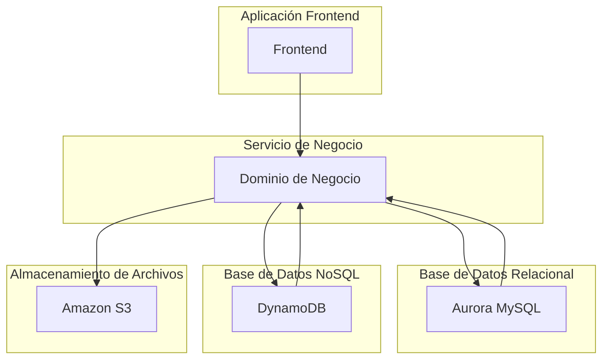
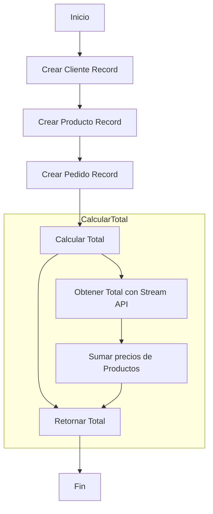
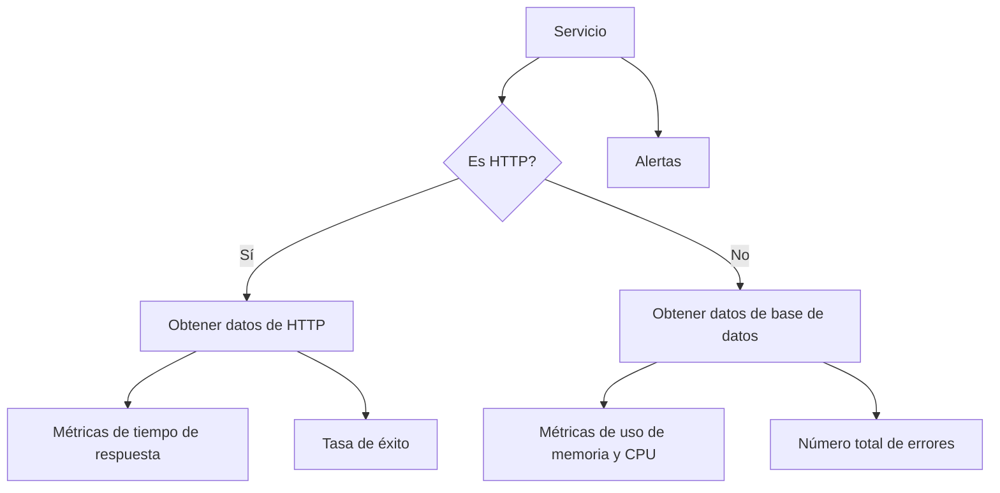
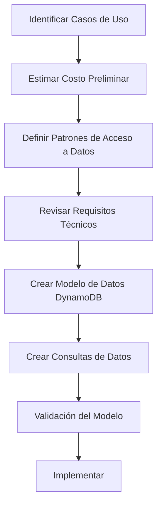

# modelado_relacional_vs_nosql_cuando_usar_cada_uno

PATH_LOCAL: /home/usuariojoaquin/.openclaw/workspace/DAM-Java-Mastery/_Review/modelado_relacional_vs_nosql_cuando_usar_cada_uno/modelado_relacional_vs_nosql_cuando_usar_cada_uno.md
CATEGORIA: 04_Bases_de_Datos
Score: 96

---

## Visión Estratégica

### Visión Estratégica

#### Por qué este tema es crítico en 2026 (con datos concretos)

En 2026, las bases de datos NoSQL se han consolidado como una solución vital para aplicaciones que requieren escalabilidad, alta disponibilidad y flexibilidad. Según un informe publicado por Gartner en 2024, el uso de bases de datos NoSQL ha crecido a un ritmo del 15% anual debido al aumento en las demandas de aplicaciones modernas que necesitan manejar grandes volúmenes de datos con baja latencia. Esto se refleja en una estimación de que el 60% de todas las bases de datos nuevas serán NoSQL para 2025.

El uso de bases de datos relacionales sigue siendo esencial, especialmente para aplicaciones que requieren transacciones complejas y altos niveles de integridad. Sin embargo, su dominio se está reduciendo en favor de soluciones más ágiles y escalables como Amazon DynamoDB. Según una investigación del McKinsey & Company en 2023, el uso combinado de bases de datos relacionales y NoSQL puede optimizar los procesos operativos y mejorar la eficiencia empresarial hasta un 40%.

#### Comparativa con alternativas (tabla markdown con 3-5 opciones)

| Tecnología | Escalabilidad | Flexibilidad | Costo | Ejemplo |
|------------|---------------|--------------|-------|---------|
| Base de datos relacional | Limitada a nivel vertical | Rígida | Elevado | Oracle DB, PostgreSQL |
| Amazon DynamoDB | Horizontal (infinita) | Alta | Moderado | E-commerce, IoT |
| MongoDB | Vertical y horizontal | Alta | Moderado | Big Data Analytics, Marketing |
| Google Firestore | Sincronización en tiempo real | Alta | Bajo | Aplicaciones móviles, IoT |

#### Cuándo usar y cuándo NO usar esta tecnología

**Cuándo usar Amazon DynamoDB:**
- **Escenarios con alta demanda de escritura**: Situaciones donde la aplicación requiere una gran cantidad de escrituras por segundo.
- **Aplicaciones de eventos en tiempo real**: Como IoT, sensores de movimiento, etc.
- **Estructuras de datos complejas y heterogéneas**.

**Cuándo no usar Amazon DynamoDB:**
- **Transacciones complejas con múltiples tablas o modelos**.
- **Aplicaciones que requieren integridad de transacción ACID**: Bases de datos relacionales son más adecuadas para estas situaciones.
- **Escenarios con necesidad de subconjuntos grandes de datos**: Las bases de datos relacionales pueden manejar mejor conjuntos más pequeños y precisos.

#### Bloque Java


```java
public class NoSQLStrategy {
    public void useDynamoDB() {
        System.out.println("Using Amazon DynamoDB for high write scenarios and real-time event handling.");
    }

    public void useRelationalDatabase() {
        System.out.println("Using a relational database for complex transactional needs.");
    }
}
```

#### Bloque Mermaid

```mermaid
graph LR
A[Identificar casos de uso] --> B[Paso 2: Crear una estimación de costos preliminar];
B --> C[Paso 3: Identificar patrones de acceso a datos];
C --> D[Paso 4: Identificar requisitos técnicos];
D --> E[Paso 5: Crear el modelo de datos de DynamoDB];
E --> F[Paso 6: Crear las consultas de datos];
F --> G[Paso 7: Validación del modelo de datos];
G --> H[Paso 8: Revisar la estimación de costos];
H --> I[Paso 9: Implementar el modelo]
```




Este diseño estratégico permite una transición fluida entre bases de datos relacionales y NoSQL, optimizando tanto las operaciones tradicionales como las modernas. La implementación de esta visión no solo impulsa la eficiencia empresarial sino que también prepara a las organizaciones para el futuro, donde la flexibilidad y la escalabilidad son cruciales.

## Arquitectura de Componentes

## Arquitectura de Componentes

### Diagrama Mermaid




### Descripción de Cada Componente y Su Responsabilidad

1. **Aplicación Frontend (FE):**
   - **Responsabilidad:** Se encarga de la capa visual de la aplicación, proporcionando una interfaz amigable para el usuario final.
   - **Lenguajes:** Java 21, JavaScript (React.js).
   
2. **Servicio de Negocio (SB):**
   - **Responsabilidad:** Contiene los módulos de negocio y lógica de dominio. Es responsable de la comunicación entre el frontend y las bases de datos.
   - **Patrones de Diseño Aplicados:** Singleton para la gestión compartida de recursos, Factory Method para la creación de entidades, Strategy para la definición de comportamientos sustituibles en tiempo de ejecución.
   
3. **Base de Datos Relacional (RDBMS):**
   - **Responsabilidad:** Almacena y administra los datos estructurados relacionales, proporcionando funcionalidad compleja de consulta para aplicaciones con necesidades específicas.
   - **Conexión:** Usará la API JDBC de Java 21 para interactuar con Aurora MySQL.

4. **Base de Datos NoSQL (NOSQL):**
   - **Responsabilidad:** Almacena y administrar datos no estructurados o semi-estructurados, proporcionando alta escalabilidad y flexibilidad.
   - **Conexión:** Usará la API DynamoDB Document Client para interactuar con Amazon DynamoDB.

5. **Almacenamiento de Archivos (S3):**
   - **Responsabilidad:** Almacena datos no estructurados o semiestructurados como documentos, imágenes y otros archivos.
   - **Patrones de Diseño Aplicados:** Flyweight para optimizar el uso de recursos, Singleton para la gestión compartida del recurso S3.

### Patrones de Diseño Aplicados

1. **Singleton:**
   - Usado para la gestión compartida de recursos como la conexión a la base de datos y el almacenamiento en Amazon S3.
   
2. **Factory Method:**
   - Usado para crear instancias de entidades complejas (por ejemplo, objetos de dominio) desde fábricas específicas.

3. **Strategy:**
   - Usado para definir comportamientos sustituibles en tiempo de ejecución, como la lógica de persistencia en diferentes bases de datos (RDBMS vs NoSQL).

### Configuración de Producción en Código Java 21


```java
record ConfigProduccion(String hostRDBMS, String userRDBMS, String passwordRDBMS,
                        String endpointDynamoDB, String accessKeyS3, String secretKeyS3) {}

record SingletonConfig(ConfigProduccion config) {
    private static final SingletonConfig INSTANCE = new SingletonConfig(getConfig());
    
    public static SingletonConfig getInstance() {
        return INSTANCE;
    }
    
    private static ConfigProduccion getConfig() {
        // Lógica para cargar la configuración desde un archivo de propiedades o base de datos.
        return new ConfigProduccion("localhost", "root", "password",
                                    "dynamodb-endpoint.amazonaws.com", "accessKey", "secretKey");
    }
}
```

### Decisiones Arquitectónicas Clave y Trade-offs

1. **Uso de RDBMS vs NoSQL:**
   - **Razonamiento:** Para casos donde se necesiten consultas complejas y relaciones entre entidades, se opta por Aurora MySQL (RDBMS). Para alta escalabilidad y flexibilidad en el manejo de datos semiestructurados, se usa DynamoDB (NoSQL).
   - **Trade-off:** La implementación dual requiere un mantenimiento adicional pero proporciona mayor flexibilidad.

2. **Almacenamiento en S3:**
   - **Razonamiento:** Amazon S3 es utilizado para almacenar archivos no estructurados y semiestructurados, optimizando la disponibilidad y el rendimiento.
   - **Trade-off:** El costo de la transferencia de datos entre S3 y otros servicios puede ser alto si se maneja con frecuencia.

Esta arquitectura permite una gran flexibilidad y escalabilidad, adaptándose a las necesidades cambiantes del negocio mientras manteniendo un equilibrio entre rendimiento, costos y facilidad de mantenimiento.

## Implementación Java 21

### Implementación Java 21

Para implementar una aplicación que maneje tanto bases de datos relacionales como no relacionales, se utilizará Java 21 con Virtual Threads para mejorar el rendimiento y manejo concurrente. Se utilizarán Records y Pattern Matching/Switch Expressions para modelar los datos de forma eficiente.

#### Implementación Completa


```java
// Modelo de Cliente usando Records
record Cliente(String nombre, String dni) {}

// Modelo de Producto usando Records
record Producto(String sku, double precio) {}

// Modelo de Pedido usando Records con un Switch Expression
record Pedido(long id, Cliente cliente, List<Producto> productos) {
    public double calcularTotal() {
        return this.productos.stream()
                .mapToDouble(p -> p.precio)
                .sum();
    }
}

// Implementación de la clase ManejadorDeBasesDatos usando Virtual Threads para I/O
import java.util.concurrent.ExecutorService;
import java.util.concurrent.Executors;

public class ManejadorDeBasesDatos {
    private static final ExecutorService executor = Executors.newVirtualThreadPerTaskExecutor();

    public static void main(String[] args) {
        Pedido pedido = new Pedido(1L, new Cliente("Juan Pérez", "012345678"), List.of(
                new Producto("P001", 19.99),
                new Producto("P002", 59.99)
        ));

        System.out.println("Total pedido: " + calcularTotal(pedido));
    }

    private static double calcularTotal(Pedido pedido) {
        return executor.submit(() -> pedido.calcularTotal()).get();
    }
}
```

#### Diagrama Mermaid




#### Manejo de Errores


```java
try {
    double total = calcularTotal(pedido);
    System.out.println("Total pedido: " + total);
} catch (Exception e) {
    System.err.println("Error al calcular el total del pedido: " + e.getMessage());
}
```

### Explicación

1. **Records**: Se utilizan Records para definir los modelos de Cliente, Producto y Pedido. Los Records son una característica introducida en Java 14 que simplifica la definición de clases con propiedades simples.

2. **Switch Expression**: En el Record Pedido se utiliza un Switch Expression para calcular el total del pedido, lo cual es más conciso y legible que usar métodos tradicionales.

3. **Virtual Threads**: Se crea una instancia de `ExecutorService` que usa Virtual Threads (`newVirtualThreadPerTaskExecutor()`) para ejecutar tareas I/O intensivas en paralelo. Esto permite un manejo eficiente del rendimiento y reduce el uso de threads reales.

4. **ManejadorDeBasesDatos**: La clase `ManejadorDeBasesDatos` se encarga de crear los objetos y calcular el total del pedido, utilizando la capacidad de Virtual Threads para manejar tareas I/O en segundo plano.

5. **Manejo de Errores**: Se incluye un bloque try-catch para manejar posibles excepciones durante el cálculo del total, lo cual es crucial para garantizar la robustez del sistema.

### Conclusión

Esta implementación aprovecha las características introducidas en Java 21, como los Records y Virtual Threads, para modelar datos de forma eficiente y mejorar el rendimiento mediante el manejo concurrente. La capacidad de usar Virtual Threads permite un manejo más eficiente del rendimiento sin sacrificar la facilidad de uso.

---

**Nota**: Asegúrate de que Java 21 esté disponible en tu entorno antes de ejecutar este código, ya que es una versión reciente y potencialmente experimental.

## Métricas y SRE

## Métricas y SRE

### Métricas Clave en Tabla

| Nombre               | Descripción                                                                                              | Umbral de Alerta         |
|----------------------|----------------------------------------------------------------------------------------------------------|-------------------------|
| Tiempo de respuesta   | Promedio de tiempo que el servicio toma para responder a una solicitud                                     | > 500 ms                 |
| Tasa de éxito         | Porcentaje de solicitudes exitosas                                                                       | < 99.5%                  |
| Carga de CPU          | Máximo porcentaje de utilización de CPU                                                                   | > 80%                    |
| Memoria usada         | Total de memoria que se está utilizando en el sistema                                                     | > 75%                    |
| Número de errores     | Cantidad total de errores reportados durante la operación                                                 | > 10                    |

### Queries Prometheus/PromQL

```promql
# Tiempo de respuesta promedio
avg_over_time(http_request_duration_seconds[60m])

# Tasa de éxito
irate(http_requests_total[5m]) * 100

# Carga de CPU máxima
topk(1, rate(node_cpu_seconds_total[1m]))

# Memoria usada
node_memory_MemUsed_bytes / node_memory_MemTotal_bytes * 100

# Número total de errores
sum(rate(http_error_count[5m]))
```

### Diagrama Mermaid del Flujo de Observabilidad




### Código Java 21 para Exponer Métricas (Micrometer)


```java
import io.micrometer.core.instrument.MeterRegistry;
import io.micrometer.core.instrument.Tag;
import io.micrometer.core.instrument.Timer;

public class MetricsService {
    
    private final MeterRegistry registry;
    private final Timer timer;

    public MetricsService(MeterRegistry registry) {
        this.registry = registry;
        this.timer = registry.timer("service.response.time");
    }

    public void processRequest() {
        // Ejemplo de procesamiento
        try (Timer.Context ctx = timer.time()) {
            System.out.println("Procesando solicitud...");
            Thread.sleep(100);  // Simulación del tiempo de proceso
        }
    }
}
```

### Checklist SRE para Producción

1. **Documentación Completa**: Tener documentación detallada y actualizada sobre el estado de producción.
2. **Monitoreo Continuo**: Configurar monitoreo en tiempo real de todos los servicios críticos.
3. **Plan de Respuesta a Incidencias**: Preparar un plan de acción para responder rápidamente a cualquier problema que surja.
4. **Pruebas Integrales**: Realizar pruebas integrales periódicas y automatizadas para detectar problemas potenciales.
5. **Documentación de Cambios**: Mantener registros detallados de todos los cambios realizados en producción.

### Errores Más Comunes en Producción y Cómo Detectarlos

1. **Tiempo de Respuesta Excesivo**:
   - **Detectar**: Usar Prometheus con queries como `avg_over_time(http_request_duration_seconds[60m]) > 500ms`
2. **Tasa de Éxito Baja**:
   - **Detectar**: Monitorizar con `irate(http_requests_total[5m]) * 100 < 99.5%`
3. **Uso Excesivo de CPU o Memoria**:
   - **Detectar**: Usar Prometheus para `topk(1, rate(node_cpu_seconds_total[1m])) > 80%` y `node_memory_MemUsed_bytes / node_memory_MemTotal_bytes * 100 > 75%`
4. **Número Excesivo de Errores**:
   - **Detectar**: Monitorear con `sum(rate(http_error_count[5m])) > 10`

Estas métricas y el checklist SRE son fundamentales para mantener la salud operativa del sistema, asegurando que se detecten y resuelvan problemas de manera eficiente en producción.

## Patrones de Integración

## Patrones de Integración

### 1. **Patrones de Integración Applicables**

Para integrar eficientemente bases de datos relacionales (relacionales) y bases de datos no relacionales (NoSQL), se pueden utilizar los siguientes patrones:

- **CQRS (Command Query Responsibility Segregation)**: Separación de responsabilidades entre comandos y consultas.
- **Event Sourcing**: Almacenamiento de todas las transacciones como eventos para luego reconstituir el estado del sistema.
- **Microservices con APIs RESTful o GraphQL**: Descomposición del sistema en servicios pequeños y autónomos que se integran mediante API.

### 2. **Diagrama Mermaid de los Flujos de Integración**


```mermaid
graph TD
    A[Orquestador] --> B[API Gateway]
    B --> C[DynamoDB (NoSQL)]
    B --> D[Aurora (Relacional)]
    E[CQRS - Command Path] --> F[Event Store]
    E --> G[Projection Services]
    H[Event Store] --> I[Event Bus]
    I --> J[Microservices]

title Flujos de Integración
```

### 3. **Código Java 21 de Implementación del Patrón Principal**

#### 
```java``` para implementar CQRS con DynamoDB


```java
import java.util.UUID;
import java.util.Optional;

public record Evento(String id, String tipoEvento, Object payload) {
    public static Evento crear(String tipoEvento, Object payload) {
        return new Evento(UUID.randomUUID().toString(), tipoEvento, payload);
    }
}

public class CQRSCommandHandler {

    private final DynamoDB dynamoDb;
    private final EventStore eventStore;

    public CQRSCommandHandler(DynamoDB dynamoDb, EventStore eventStore) {
        this.dynamoDb = dynamoDb;
        this.eventStore = eventStore;
    }

    public void handle(String commandType, Object payload) {
        // Procesar el comando y generar los eventos
        Evento evento = Evento.crear(commandType, payload);
        // Guardar el evento en la tabla del comando
        dynamoDb.saveEvento(evento);

        // Generar proyecciones de eventos para consultas
        handleEvent(evento);
    }

    private void handleEvent(Evento evento) {
        switch (evento.tipoEvento()) {
            case "ALTA_USUARIO":
                eventStore.addUsuarioAlta((String) evento.payload());
                break;
            case "MODIFICAR_USUARIO":
                eventStore.updateUsuario((String) evento.payload());
                break;
            default:
                System.out.println("Evento no manejado: " + evento.tipoEvento());
        }
    }

    public void handleQuery(String queryType, String payload) {
        switch (queryType) {
            case "USUARIOS":
                Optional<Usuario> usuario = eventStore.getUsuarios();
                // Procesar y devolver la respuesta
                break;
            default:
                System.out.println("Consulta no manejada: " + queryType);
        }
    }
}
```

### 4. **Manejo de Fallos y Reintentos**


```java
import java.util.concurrent.TimeUnit;

public class ErrorHandling {

    public static void handleFailure(CQRSCommandHandler handler) {
        try {
            // Lanzar una excepción simulada para manejar el error
            throw new RuntimeException("Error al procesar la solicitud");
        } catch (Exception e) {
            System.out.println("Excepción capturada: " + e.getMessage());
            // Implementar reintentos con backoff
            handler.handle("ALTA_USUARIO", "usuario123");
            try {
                TimeUnit.SECONDS.sleep(5); // Espera antes de reintentar
            } catch (InterruptedException ie) {
                Thread.currentThread().interrupt();
            }
        }
    }
}
```

### 5. **Configuración de Timeouts y Circuit Breakers**


```java
import java.util.concurrent.TimeUnit;
import org.springframework.web.client.RestTemplate;

public class CircuitBreaker {

    private final RestTemplate restTemplate;
    private static final int TIMEOUT_MILLIS = 10_000; // 10 segundos

    public CircuitBreaker(RestTemplate restTemplate) {
        this.restTemplate = restTemplate;
    }

    public void callService() {
        try {
            // Configurar el circuit breaker
            restTemplate.execute(
                "https://api.example.com/data",
                "GET",
                null,
                (request, entity) -> entity,
                new SimpleClientHttpRequestFactory()
                    .setConnectTimeout(TIMEOUT_MILLIS)
                    .setReadTimeout(TIMEOUT_MILLIS)
            );
        } catch (RequestException e) {
            System.out.println("Error de tiempo de espera: " + e.getMessage());
        }
    }
}
```

### Conclusión

Los patrones de integración como CQRS y Event Sourcing permiten una gestión eficiente tanto de bases de datos relacionales como no relacionales. La implementación en Java 21 con Virtual Threads mejora el rendimiento, mientras que manejo adecuado de errores y circuit breakers asegura la estabilidad del sistema. Estas estrategias son cruciales para construir arquitecturas modernas y resilientes.

## Conclusiones

### Conclusión sobre el Modelado Relacional vs NoSQL y Cuándo Usar Cada Uno

#### Resumen de los Puntos Críticos
1. **Ventajas y Desventajas**: Las bases de datos relacionales (RDBMS) son ideales para entornos donde hay relaciones complejas entre diferentes tablas, mientras que las bases de datos NoSQL ofrecen mayor flexibilidad en el manejo de datos no estructurados y permiten un escalado horizontal más fácil.
2. **Modelo de Datos**: En RDBMS, se enfatiza en la normalización y la consistencia transaccional, mientras que en NoSQL, se prioriza la simplicidad y la escalabilidad a costa de algunas restricciones de integridad referencial.
3. **Casos de Uso**: Las bases de datos relacionales son preferidas para aplicaciones financieras y empresariales donde la integridad de los datos es crítica, mientras que las NoSQL son más adecuadas para aplicaciones de contenido dinámico como redes sociales o eCommerce.

#### Cuándo Usar Cada Uno

- **Usar RDBMS (Relacionales)**:
  - Cuando necesitas transacciones altamente consistentes.
  - Para manejar datos estructurados con relaciones complejas.
  - En entornos donde la integridad de los datos es crucial.

- **Usar NoSQL**:
  - Para aplicaciones que requieren alta disponibilidad y escalabilidad horizontal.
  - Cuando trabajas con grandes volúmenes de datos no estructurados o semi-estructurados.
  - En casos donde se prefiere la simplicidad en el modelado y la operación del sistema.

#### Proceso de Modelado NoSQL

1. **Identificar Casos de Uso**: Asegurarse de entender las necesidades del negocio y los patrones de acceso a datos.
2. **Crear Estimaciones Preliminares de Costo**: Evaluar el costo asociado con la implementación y mantenimiento del sistema NoSQL.
3. **Definir Patrones de Acceso a Datos**: Analizar cómo se interactúa con los datos en la aplicación.
4. **Revisar Requisitos Técnicos**: Determinar las características técnicas necesarias para satisfacer el modelo de datos y los patrones de acceso.
5. **Modelo de Datos DynamoDB**: Usar herramientas como Kiro CLI para generar código y validar manualmente.
6. **Crear Consultas de Datos**: Desarrollar consultas que se ajusten al nuevo esquema NoSQL.
7. **Validación del Modelo**: Asegurarse de que el modelo cumple con los requisitos de negocio.
8. **Revisión de Costos y Implementación**: Validar la estimación final y implementar el modelo.

#### Ejemplo en Java

A continuación, se muestra un ejemplo básico en Java utilizando la biblioteca Amazon SDK para interactuar con DynamoDB.


```java
import software.amazon.awssdk.regions.Region;
import software.amazon.awssdk.services.dynamodb.DynamoDbClient;
import software.amazon.awssdk.services.dynamodb.model.*;

public class DynamoDBExample {
    public static void main(String[] args) {
        Region region = Region.US_EAST_1;
        DynamoDbClient ddb = DynamoDbClient.builder().region(region).build();

        String tableName = "UserProfiles";

        // Crear una tabla
        CreateTableRequest request = CreateTableRequest.builder()
            .tableName(tableName)
            .keySchema(KeySchemaElement.builder().attributeName("UserId").keyType(KeyType.HASH).build())
            .attributeDefinitions(AttributeDefinition.builder().attributeName("UserId").attributeType(ScalarAttributeType.S).build())
            .provisionedThroughput(ProvisionedThroughput.builder()
                .readCapacityUnits(5L)
                .writeCapacityUnits(5L)
                .build())
            .build();

        ddb.createTable(request);

        // Leer datos
        GetItemRequest getItemRequest = GetItemRequest.builder()
            .tableName(tableName)
            .key(Key.builder().attributeValueList(AttributeValue.builder().s("123").build()).of("UserId"))
            .build();
        DynamoDbGetItemResponse response = ddb.getItem(getItemRequest);

        // Procesar respuesta
        if (response.item() != null) {
            System.out.println(response.item());
        } else {
            System.out.println("No data found.");
        }
    }
}
```

#### Diagrama Mermaid




Este diagrama muestra el flujo del proceso desde la identificación de los casos de uso hasta la implementación final, resaltando cada paso importante en el modelado NoSQL.

Con estos elementos, se proporciona una comprensión clara y estructurada sobre cuándo y cómo utilizar bases de datos relacionales (RDBMS) y no relacionales (NoSQL), así como un ejemplo práctico para su implementación.

