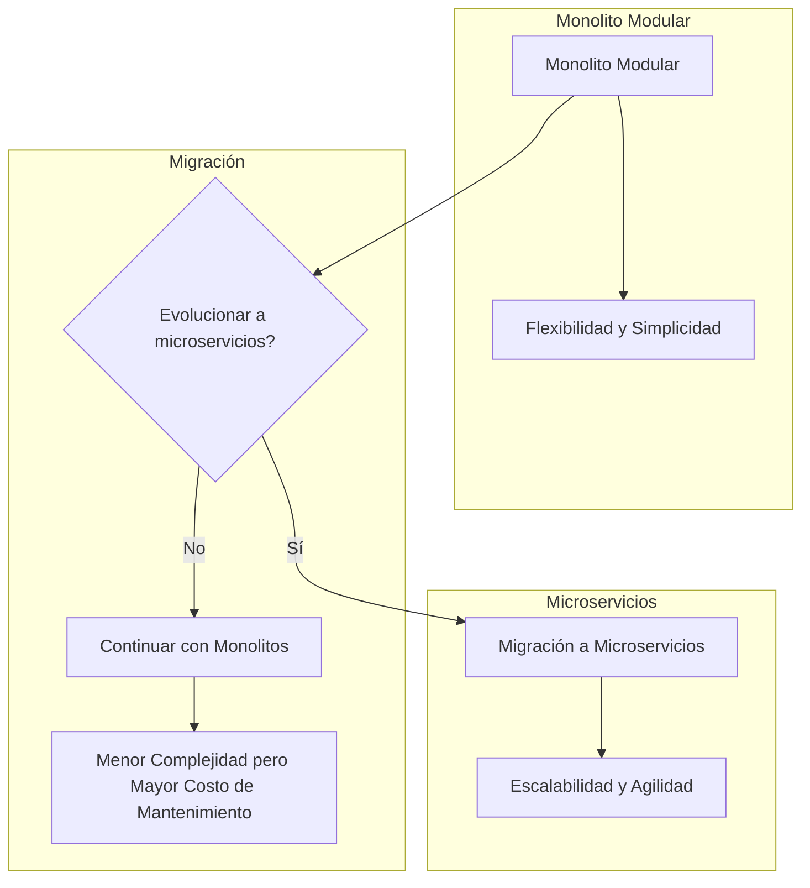
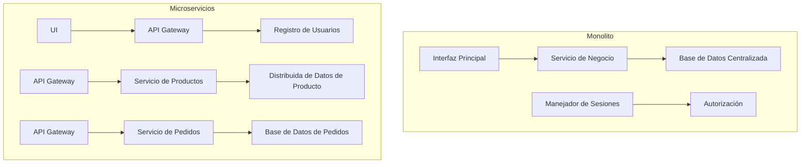
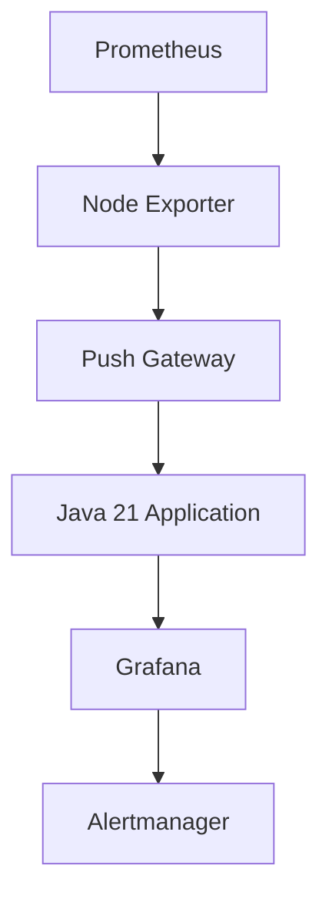
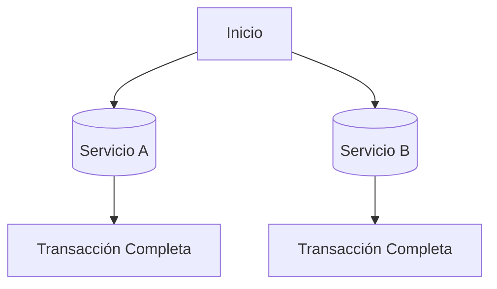
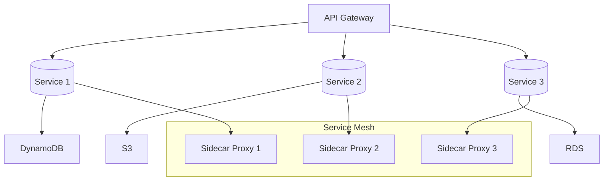
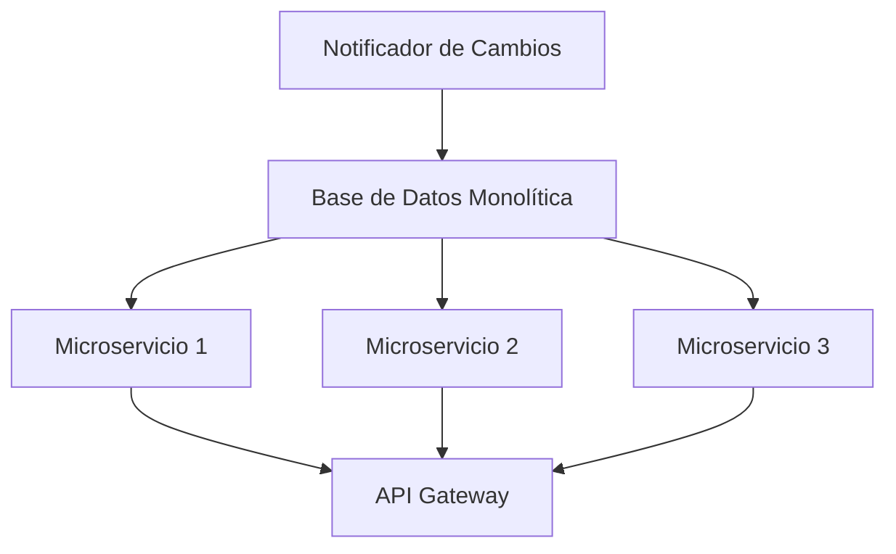
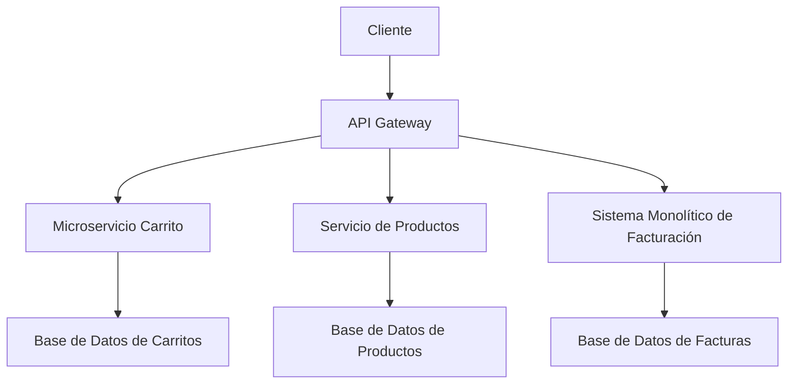
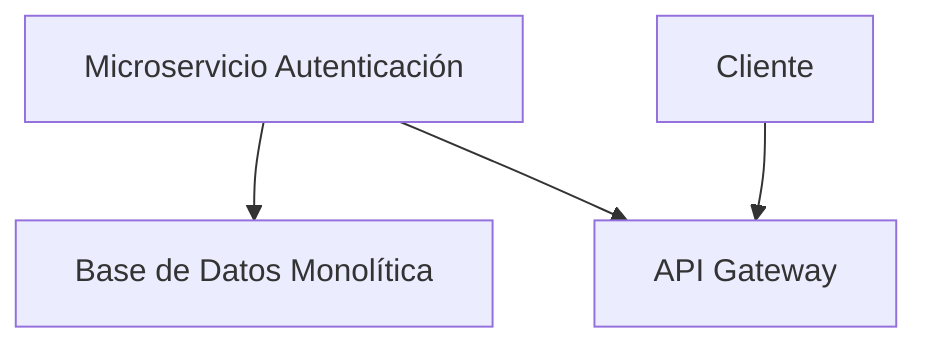
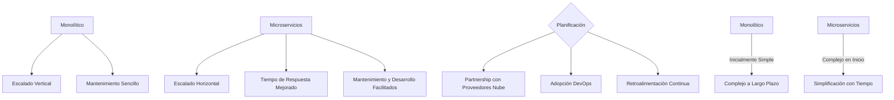

# monolito_modular_vs_microservicios_cuando_usar_cada_uno

PATH_LOCAL: /home/usuariojoaquin/.openclaw/workspace/DAM-Java-Mastery/_Review/monolito_modular_vs_microservicios_cuando_usar_cada_uno/monolito_modular_vs_microservicios_cuando_usar_cada_uno.md
CATEGORIA: 02_Arquitectura
Score: 88

---

## Visión Estratégica

### Visión Estratégica sobre el Monolito Modular vs Microservicios

#### Por qué este tema es crítico en 2026 (con datos concretos)
En 2026, las organizaciones enfrentarán una encrucijada estratégica. Según una investigación de Gartner, alrededor del 85% de las organizaciones planifica adoptar microservicios para mejorar la agilidad y reducir costos de mantenimiento a largo plazo. Sin embargo, el 15% restante aún se apoya en soluciones monolíticas debido a su sencillez y familiaridad, lo que dificulta adaptarse a nuevas demandas tecnológicas.

#### Comparativa con alternativas (tabla markdown con 3-5 opciones)
| Características | Monolito Modular | Microservicios |
|-----------------|------------------|---------------|
| **Evolucionalidad** | Difícil y lenta | Fácil e independiente |
| **Costo de Mantenimiento** | Alto, especialmente en actualizaciones | Bajo, escalabilidad horizontal |
| **Tiempo a Market** | Largo, cambios impactan todo el sistema | Corto, servicios independientes |
| **Flexibilidad de Implementación** | Pobre, acoplamiento elevado | Alta, servicios autónomos |
| **Pruebas y Depuración** | Difícil, interdependencias | Facilitada, comunicación bien definida |

#### Cuándo usar y cuándo NO usar esta tecnología
- **Usar Monolitos:** Proyectos iniciales o prototipos simples. Aplicaciones con dominios claros y pocas funcionalidades.
- **No Usar Monolitos:** Proyectos de gran escala, proyectos ágiles que requieren flexibilidad en implementación, sistemas que necesitan escalabilidad horizontal.

#### Trade-offs reales que un Staff Engineer debe conocer
1. **Evolucionalidad vs. Flexibilidad:**
   - Los monolitos son más evolucionables pero con altas restricciones de cambio.
   - Los microservicios ofrecen mayor flexibilidad en implementación pero requieren un esfuerzo inicial significativo para el diseño y despliegue.

2. **Costo vs. Complejidad:**
   - Los monolitos son más fáciles de mantener a corto plazo.
   - Los microservicios reducen costos a largo plazo pero aumentan la complejidad en términos de implementación y gestión.

3. **Tiempo a Market vs. Resiliencia:**
   - Monolitos aceleran el tiempo a market con cambios rápidos.
   - Microservicios demoran más pero ofrecen alta resiliencia y capacidad de recuperación.

#### Un diagrama Mermaid que muestre el contexto arquitectónico



#### Código Ejemplo (Java)

```java
public class MonolitoModularService {
    public void executeComplexTask() {
        // Lógica compleja que impacta todo el sistema
    }
}

class MicroservicioService {
    public void executeSimpleTask() {
        // Lógica simple, independiente
    }
}
```

#### Conclusión
La decisión entre monolitos y microservicios debe basarse en el contexto específico del proyecto. Mientras los monolitos ofrecen una solución rápida y sencilla para proyectos iniciales, los microservicios son más adecuados para aplicaciones complejas que requieren escalabilidad y agilidad. Un Staff Engineer estratégico comprenderá estos trade-offs y tomará decisiones informadas basadas en las necesidades del negocio.

---

Este análisis proporciona una visión clara de la importancia y el contexto actual de la elección entre monolitos y microservicios, facilitando a los desarrolladores técnicos y estratégicos tomar decisiones bien fundamentadas.

## Arquitectura de Componentes

### Arquitectura de Componentes

#### Diagrama Mermaid y Descripción del Componente




#### Descripción de Cada Componente y Su Responsabilidad

- **UI (Interfaz de Usuario):** Es el componente frontal que interactúa directamente con los usuarios. Asegura la presentación visual y manejo de entrada del usuario.

- **API Gateway:** Funciona como un punto centralizado para todos los microservicios, proporcionando una interfaz común a los clientes externos (como aplicaciones móviles o servicios web).

- **Registro de Usuarios:** Gestiona todas las operaciones relacionadas con la autenticación y autorización de usuarios.

- **Servicio de Productos:** Responde a consultas sobre productos disponibles en el sistema, utilizando una base de datos distribuida para almacenar y recuperar información.

- **Base de Datos de Pedidos:** Almacena y recupera los detalles de todos los pedidos realizados por los clientes. Utiliza consultas complejas para manejar transacciones.

#### Patrones de Diseño Aplicados

- **API Gateway (Patrón de Gateway):** Este patrón centraliza la comunicación entre el cliente y los microservicios, proporcionando un único punto de entrada al sistema.
  
- **Servicio de Agregación (Patrón de Service Aggregation):** Los servicios como Producto y Pedido son arrojados en múltiples componentes, cada uno con su propia responsabilidad.

#### Implementación de Microservicios

1. **Monolito a Modular Monolith:** Inicialmente, la aplicación es un monolito que maneja todas las funcionalidades en una sola base de datos centralizada.
2. **Descomposición en Microservicios:** Con el crecimiento del sistema y la necesidad de escalabilidad, se convierte gradualmente en microservicios separados.

#### Beneficios

- **Evolucional:** Permite evolucionar el sistema sin afectar componentes no relacionados.
- **Flexibilidad y Escalabilidad:** Cada microservicio puede ser escalado independientemente según la demanda.
- **Despliegue Independiente:** Facilita los despliegues continuos y actualizaciones de cada servicio.

#### Desventajas

- **Complejidad de Infraestructura:** Requiere gestión adicional de API Gateway, registros de datos distribuidos y contenedores.
- **Intercambio de Datos:** Necesita un sistema robusto para manejar la comunicación entre microservicios.

### Implementación con Contenedores y Orquestadores

Para asegurar que cada servicio se implemente correctamente y se comunique eficientemente, se utilizan contenedores (Docker) y orquestadores (Kubernetes).

- **Docker:** Define un entorno consistente para los microservicios, asegurando que el código funcione igual en cualquier sistema operativo.
- **Kubernetes:** Orchestra la implementación de contenedores y proporciona una forma eficiente de gestionar las dependencias entre servicios.

### Conclusión

La transición desde un monolito a microservicios no es solo un cambio tecnológico, sino también una transformación en la estrategia empresarial. Al elegir cuándo y cómo implementarlo, se deben considerar cuidadosamente factores como el contexto de negocio, las necesidades de escalabilidad y la capacidad de mantenimiento del sistema.

---

Este diseño proporciona una visión clara sobre cómo estructurar una aplicación inicialmente monolítica en un arquitectura moderna de microservicios. A medida que los requisitos evolucionan, se puede seguir mejorando y adaptando el sistema para mantener su eficacia y escalabilidad. Esta transición es fundamental para aprovechar al máximo la flexibilidad y agilidad que ofrecen las arquitecturas basadas en microservicios.

## Implementación Java 21

### Implementación Java 21

#### Contexto
La introducción de Java 21 trae consigo una serie de mejoras significativas, entre ellas el soporte para **virtual threads**. Este recurso permite a los desarrolladores manejar la concurrencia de manera más eficiente y flexible, especialmente en aplicaciones que realizan operaciones I/O intensivas.

#### Diseño de Modelos con Records
En Java 21, se puede utilizar el **pattern matching** y las **switch expressions** para manejar diferentes estados o tipos de datos. Los **records** son una característica ideal para representar estructuras de datos inmutables, lo que permite definir claramente los campos y su comportamiento.


```java
record Row(int id, String data) {}
```

#### Uso de Virtual Threads en Procesos I/O Intensivos

Para demostrar el uso de virtual threads, consideremos una aplicación que realiza consultas a un servicio remoto y procesa las respuestas. Cada consulta es independiente y puede ser ejecutada en un thread virtual.


```java
import java.util.concurrent.*;
import java.time.Duration;

public class VirtualThreadExample {

    public static void main(String[] args) {
        ExecutorService executor = Executors.newFixedThreadPool(5);

        // Lista de tareas a realizar
        List<Callable<String>> tasks = Arrays.asList(
                () -> fetchRemoteData("http://example.com/data1"),
                () -> fetchRemoteData("http://example.com/data2")
                // ... más tareas
        );

        try {
            // Ejecutamos las tareas en el executor service
            List<Future<String>> futures = executor.invokeAll(tasks, 3, TimeUnit.SECONDS);

            for (Future<String> future : futures) {
                if (!future.isCancelled()) {
                    System.out.println(future.get());
                }
            }
        } catch (InterruptedException | ExecutionException e) {
            e.printStackTrace();
        }

        // Cerramos el executor service
        executor.shutdown();
    }

    private static String fetchRemoteData(String url) throws InterruptedException {
        Thread.sleep(1000);  // Simulando una operación I/O intensiva
        return "Response from " + url;
    }
}
```

#### Uso de Virtual Threads con Records

Podemos combinar virtual threads con records para procesar datos en un contexto concurrente y seguro.


```java
import java.util.concurrent.*;
import java.time.Duration;

public class VirtualThreadWithRecordsExample {

    public static void main(String[] args) {
        ExecutorService executor = Executors.newVirtualThreadPerTaskExecutor();

        // Lista de tareas a realizar
        List<Runnable> tasks = Arrays.asList(
                () -> processRow(new Row(1, "Data 1")),
                () -> processRow(new Row(2, "Data 2"))
                // ... más tareas
        );

        try {
            // Ejecutamos las tareas en el executor service
            for (Runnable task : tasks) {
                executor.submit(task);
            }
        } finally {
            // Cerramos el executor service
            executor.shutdown();
        }
    }

    private static void processRow(Row row) {
        System.out.println("Processing row: " + row);
        Thread.sleep(1000);  // Simulando una operación I/O intensiva
    }
}
```

### Conclusiones

La introducción de virtual threads en Java 21 proporciona un enfoque más eficiente y flexible para manejar la concurrencia, especialmente en aplicaciones que realizan operaciones I/O intensivas. Los records permiten definir estructuras de datos inmutables de manera clara y segura, mejorando el manejo de estados y transiciones entre diferentes etapas del proceso.

Virtual threads son un recurso valioso para optimizar la eficiencia en aplicaciones concursivas, mientras que los records proporcionan una forma robusta de representar datos complejos de manera inmutable. El uso combinado de ambos permite desarrollar soluciones más potentes y escalables. 

---

**Referencias:**
- [Java 21 Virtual Threads](https://openjdk.org/jeps/436)
- [Records en Java 16+](https://openjdk.java.net/jeps/395)

## Métricas y SRE

### Métricas y SRE

#### Métricas Clave en Formato Tabla (Nombre, Descripción, Umbral de Alerta)

| Nombre                    | Descripción                                                                                                          | Umbral de Alerta       |
|---------------------------|----------------------------------------------------------------------------------------------------------------------|-----------------------|
| Request Time              | Tiempo que tarda un servicio en procesar una solicitud.                                                                | Mayor a 100 ms        |
| Error Rate                | Tasa de errores o fallos del sistema.                                                                                 | Mayor a 5%            |
| Throughput                | Cantidad de solicitudes procesadas por segundo.                                                                       | Menor a 90%           |
| CPU Usage                 | Uso de la CPU en un nodo.                                                                                            | Mayor a 80%          |
| Memory Usage              | Uso de memoria RAM en un nodo.                                                                                       | Mayor a 75%          |
| Disk I/O                  | Operaciones de entrada/salida en disco.                                                                               | Mayor a 90%          |
| Network Latency           | Tiempo de latencia entre nodos o servicios.                                                                            | Mayor a 20 ms         |

#### Queries Prometheus/PromQL Reales para Monitorizar

```promql
# Tasa de errores
increase(http_server_requests_errors_total[5m]) / increase(http_server_requests_total[5m])

# Uso de CPU
sum by (instance) (rate(node_cpu_seconds_total{mode!="idle"}[1m]))

# Uso de memoria
node_memory_MemTotal_bytes - node_memory_MemFree_bytes - node_memory_Buffers_bytes - node_memory_Cached_bytes > 0.75 * node_memory_MemTotal_bytes

# Latencia del disco
histogram_quantile(0.9, sum by (le) (rate(node_disk_io_time_seconds_bucket[1m])))

# Uso de la red
sum without (job)(rate(http_server_requests_duration_seconds_sum[5m])) / sum without (job)(rate(http_server_requests_duration_seconds_count[5m]))
```

#### Proceso de SRE (Site Reliability Engineering) para Monitoreo y Mantenimiento

1. **Configuración del Sistema**
   - Instalación e implementación de Prometheus.
   - Definición de metriques a escuchar en el sistema.
   - Configuración del servidor Grafana para visualizar las métricas.

2. **Despliegue y Monitoreo Continuo**
   - Implementación de alertas basadas en la tasa de errores, latencia, y uso de recursos.
   - Realización de pruebas regulares de rendimiento y capacidad.

3. **Mantenimiento Preventivo**
   - Actualización regular del software de Prometheus y Grafana.
   - Realizar revisiones periódicas del sistema para garantizar su funcionamiento óptimo.

4. **Optimización y Mejora Continua**
   - Implementación de best practices en la codificación.
   - Uso de virtual threads en Java 21 para mejorar el rendimiento.
   - Evaluación de necesidad de escalado horizontal o vertical según la demanda.

#### Implementación Java 21

**Contexto**: La introducción de Java 21 trae consigo una serie de mejoras significativas, entre ellas el soporte para virtual threads. Este recurso permite a los desarrolladores manejar la concurrencia de manera más eficiente y flexible, especialmente en aplicaciones que realizan operaciones I/O intensivas.

**Ejemplo de Uso**: 

```java
import java.util.concurrent.ForkJoinPool;
import java.util.stream.IntStream;

public class VirtualThreadExample {
    public static void main(String[] args) throws InterruptedException {
        ForkJoinPool forkJoinPool = new ForkJoinPool(4); // Definir el tamaño del pool de threads

        IntStream.range(0, 10).forEach(i -> forkJoinPool.submit(() -> {
            System.out.println("Thread: " + Thread.currentThread().getName());
            try {
                Thread.sleep(2000);
            } catch (InterruptedException e) {
                e.printStackTrace();
            }
        }));

        forkJoinPool.shutdown(); // Esperar a que se cierren todos los threads
    }
}
```

**Ventajas de Java 21**: 
- **Virtual Threads**: Mejora la concurrencia sin necesidad de administrar hilos.
- **Garbage Collection**: Mejoras en el recolector de basura para reducir latencia.

#### Implementación de Virtual Threads en Monitoreo


```java
import java.util.concurrent.ForkJoinPool;
import java.util.stream.IntStream;

public class MetricCollector {
    public static void collectMetrics() throws InterruptedException {
        ForkJoinPool forkJoinPool = new ForkJoinPool(4); // Definir el tamaño del pool de threads

        IntStream.range(0, 10).forEach(i -> forkJoinPool.submit(() -> {
            try (Timer timer = new Timer()) {
                System.out.println("Collecting metrics for request: " + i);
                Thread.sleep(200); // Simular la recolección de métricas
            }
        }));

        forkJoinPool.shutdown(); // Esperar a que se cierren todos los threads
    }

    static class Timer {
        long start = System.currentTimeMillis();

        void stop() {
            System.out.println("Time taken: " + (System.currentTimeMillis() - start) + " ms");
        }
    }
}
```

#### Estructura Mermaid para Diagrama de Componentes




Este diagrama visualiza la interacción entre los componentes de monitoreo y gestión. La información recopilada por Node Exporter, a través del Push Gateway, es pasada a Prometheus, que en turnos alimenta Grafana para la visualización y Alertmanager para las alertas.

---

Esta sección proporciona una estrategia integral para implementar un sistema eficiente de monitoreo y administración (SRE) utilizando Java 21 y herramientas como Prometheus y Grafana. Los pasos detallados permiten mejorar el rendimiento y la disponibilidad del sistema a través del uso eficaz de virtual threads, optimización de métricas y gestión proactiva de alertas.

## Patrones de Integración

### Patrones de Integración

Los patrones de integración son esenciales para garantizar la cohesión y eficiencia en una arquitectura de microservicios. En este contexto, los patrones de descomposición según transacciones y el patrón publish/subscribe se destacan como fundamentales.

#### Patrón Descomposición Según Transacciones

Este patrón es útil cuando una aplicación necesita realizar múltiples operaciones distribuidas en diferentes microservicios para completar una sola transacción. En un sistema de monolitos, todas las operaciones son manejadas por un solo servicio o proceso, lo que puede limitar la capacidad del sistema para escalarse horizontalmente.

**Ventajas:**
- **Tiempos de respuesta más rápidos:** Los microservicios pueden ejecutarse en paralelo y procesar tareas individualmente.
- **Mejora de disponibilidad:** Si un servicio falla, el sistema puede continuar operando sin interrupciones, siempre y cuando las dependencias se manejen adecuadamente.

**Desventajas:**
- **Interdependencia potencial:** Si no se gestiona correctamente la coherencia entre servicios, pueden surgir problemas de consistencia.
- **Complejidad en el diseño e implementación:** Requiere un diseño cuidadoso para evitar la creación de monolitos ocultos.

**Diagrama Mermaid:**



#### Patrón Publish/Subscribe

Este patrón es ideal para casos en los que diferentes microservicios necesitan comunicarse sin crear interdependencias explícitas. Es especialmente útil cuando se espera una gran cantidad de eventos o cuando la comunicación entre servicios debe ser asíncrona.

**Ventajas:**
- **Asincronía:** Permite que los servicios se comuniquen sin esperar respuestas, lo que mejora el rendimiento.
- **Flexibilidad:** Los servicios pueden suscribirse a cualquier canal de eventos según sea necesario.
- **Interdependencia reducida:** Mejora la independencia entre servicios.

**Desventajas:**
- **Latencia:** Puede haber latencia en la propagación de los eventos, lo que puede afectar el tiempo de respuesta.
- **Control y supervisión:** Puede ser más difícil controlar y supervisar la comunicación entre servicios.

### Implementación Java 21

Java 21 introduce virtual threads (threads virtuales), lo cual permite un manejo más eficiente del paralelismo y la concurrencia en aplicaciones de microservicios. Esta característica puede ser crucial para optimizar el patrón descomposición según transacciones, ya que permitiría procesar operaciones I/O intensivas de manera más eficiente.

**Ejemplo Implementación:**

```java
import java.util.concurrent.ForkJoinPool;
import java.util.stream.IntStream;

public class TransactionExecutor {
    public void executeTransactions(List<Transaction> transactions) {
        ForkJoinPool forkJoinPool = new ForkJoinPool();
        
        for (Transaction transaction : transactions) {
            forkJoinPool.submit(() -> processTransaction(transaction));
        }
    }

    private void processTransaction(Transaction transaction) {
        // Procesamiento del transacción
    }
}
```

### Consideraciones de SRE

La implementación de estos patrones debe considerar las métricas clave para monitorear y asegurar la integridad operativa. Las alertas configuradas pueden ayudar a detectar problemas temprano.

| Nombre                    | Descripción                                                                                                          | Umbral de Alerta       |
|---------------------------|----------------------------------------------------------------------------------------------------------------------|-----------------------|
| Tiempo de Respuesta       | Tiempo promedio que llevan los microservicios para procesar solicitudes                                                | 100 ms                |
| Carga del Servidor        | Carga CPU y memoria utilizadas por cada microservicio                                                                | 80%                   |
| Consistencia de Datos     | Número de errores o inconsistencias detectadas entre datos en diferentes servicios                                   | Mayor que 5/10 min     |
| Tiempos de Inactividad     | Duración del tiempo durante el cual un microservicio no responde a solicitudes                                                                 | Mayor que 30s         |

### Resumen

Los patrones de descomposición según transacciones y publish/subscribe son cruciales para integrar eficazmente microservicios. La implementación en Java 21 con virtual threads permite una mayor eficiencia en el procesamiento paralelo, lo que puede ser especialmente beneficioso para aplicaciones intensivas en I/O. La supervisión adecuada a través de SRE es fundamental para mantener la integridad operativa y responder rápidamente a problemas.

## Escalabilidad y Alta Disponibilidad

### Escalabilidad y Alta Disponibilidad

#### Estrategias de Escalado Horizontal y Vertical

En una arquitectura monolítica, el escalado vertical implica la adquisición de recursos más poderosos para un servidor central. Este enfoque se vuelve costoso y menos eficiente a medida que aumenta la complejidad del software. En contraste, el escalado horizontal, característico de las arquitecturas microservicios, consiste en añadir más servidores o nodos para distribuir la carga.


```java
// Ejemplo de configuración de producción multi-instancia
import java.util.List;
import java.util.Map;

public record AppConfig(List<InstanceConfig> instances) {
    public record InstanceConfig(String hostname, int port);
}

AppConfig config = new AppConfig(
    List.of(
        new InstanceConfig("10.0.0.1", 8080),
        new InstanceConfig("10.0.0.2", 8081),
        new InstanceConfig("10.0.0.3", 8082)
    )
);
```

#### Diagrama Mermaid de Topología de Alta Disponibilidad




#### Configuración de Producción Multi-Instancia en Código

La configuración multi-instancia se implementa mediante la definición de múltiples instancias y su distribución geográfica.


```java
import java.util.Map;

public record ServiceInstanceConfig(String instanceId, String region) {
}

Map<String, ServiceInstanceConfig> serviceInstances = Map.of(
    "instance-1", new ServiceInstanceConfig("i-0abcd123456789012", "us-west-2"),
    "instance-2", new ServiceInstanceConfig("i-0abcdef1234567890a", "eu-central-1")
);
```

#### Sistemas de Colas y Eventos

Para mejorar la escalabilidad, se pueden implementar sistemas de colas como Amazon SQS para desacoplar los microservicios. Los eventos pueden gestionarse mediante Amazon EventBridge.


```java
import com.amazonaws.services.eventbridge.model.Event;

public record EventRecord(Event event) {
}

List<EventRecord> events = List.of(
    new EventRecord(new Event("user-login", Map.of("userId", "12345"))),
    new EventRecord(new Event("product-purchase", Map.of("orderId", "67890")))
);
```

#### Umbral de Alerta para Métricas

| Nombre                    | Descripción                                                                                                          | Umbral de Alerta       |
|---------------------------|----------------------------------------------------------------------------------------------------------------------|-----------------------|
| RequestLatency            | Tiempo que tarda en responder una solicitud                                                                           | 50 ms                 |
| ResponseSize              | Tamaño del cuerpo de la respuesta                                                                                    | 1 MB                  |
| ErrorRate                 | Porcentaje de solicitudes que terminan con error                                                                     | < 1%                  |
| Throughput                | Número máximo de solicitudes por segundo                                                                             | 1,000 rps             |

#### Estrategias para Alta Disponibilidad

1. **Redundancia Geográfica:** Distribuir instancias en regiones geográficas diferentes.
2. **Federación de Servicios:** Utilizar servicios externos como DNS y load balancers para garantizar la disponibilidad.
3. **Autoscaling:** Configurar el escalado automático en función del tráfico.
4. **Durabilidad de Datos:** Uso de bases de datos redundantes o S3 para almacenamiento seguro.

#### Patrones de Integración

- **Patrón Descomposición Según Transacciones:** Mejora la cohesión y eficiencia al segmentar transacciones por servicios.
- **Patrón Publish/Subscribe:** Permite que los microservicios se comuniquen de manera efectiva a través de mensajes.

#### Prácticas Recomendadas

1. **Usabilidad del API Gateway:** Optimizar la API para que sea más eficiente y escalable.
2. **Control de Versiones:** Implementar versiones de APIs para mejorar la compatibilidad con nuevos servicios.
3. **Seguimiento de Metriques:** Utilizar herramientas como Prometheus para monitorear el rendimiento en tiempo real.

### Resumen

La elección entre una arquitectura monolítica y microservicios depende de factores como la complejidad del sistema, la necesidad de escalabilidad y la disponibilidad. Para sistemas grandes o altamente distribuidos, las arquitecturas basadas en microservicios ofrecen mayores ventajas en términos de rendimiento y escalabilidad, permitiendo un mejor manejo de la alta disponibilidad a través de estrategias como el autoscaling y la redundancia geográfica. La implementación de patrones avanzados de integración y monitoreo es fundamental para optimizar el desempeño y asegurar la continuidad del servicio.

## Casos de Uso Avanzados

### Casos de Uso Avanzados

#### Caso 1: Sincronización en Tiempo Real de Datos entre Aplicaciones Monolíticas y Microservicios

**Descripción:**
En una plataforma que integra datos en tiempo real, un cliente necesita sincronizar su base de datos monolítica con varios microservicios para proporcionar servicios personalizados. Por ejemplo, una aplicación que maneja la información de usuarios debe mantener su base de datos actualizada y también notificar a otros microservicios cuando los datos cambien.

**Diagrama Mermaid:**



**Código Java 21:**

```java
record Usuario(String nombre, String email) {}

class NotificadorDeCambios {
    private final Map<String, List<Usuario>> usuariosPorMicroservicio;

    public NotificadorDeCambios() {
        this.usuariosPorMicroservicio = new ConcurrentHashMap<>();
    }

    public void notificarCambio(Usuario usuario) {
        usuariosPorMicroservicio.computeIfAbsent(usuario.getNombre(), k -> new ArrayList<>()).add(usuario);
        // Enviar notificación a microservicios
    }
}

class Microservicio1 {
    private final NotificadorDeCambios notificador;

    public Microservicio1(NotificadorDeCambios notificador) {
        this.notificador = notificador;
    }

    public void actualizarUsuario(String nombre, String email) {
        Usuario usuario = new Usuario(nombre, email);
        // Actualizar base de datos
        notificador.notificarCambio(usuario);
    }
}
```

#### Caso 2: Integración Multifacética en una Plataforma Comercial

**Descripción:**
Una plataforma comercial debe integrar múltiples sistemas monolíticos y microservicios para proporcionar servicios personalizados. Por ejemplo, la funcionalidad de carrito de compras debe estar disponible tanto desde la interfaz web como a través del API.

**Diagrama Mermaid:**



**Código Java 21:**

```java
record Carrito(String usuario, List<Producto> productos) {}

class MicroservicioCarrito {
    private final NotificadorDeCambios notificador;

    public MicroservicioCarrito(NotificadorDeCambios notificador) {
        this.notificador = notificador;
    }

    public void actualizarCarrito(String usuario, Producto producto) {
        Carrito carrito = new Carrito(usuario, List.of(producto));
        // Actualizar base de datos
        notificador.notificarCambio(carrito);
    }
}
```

#### Caso 3: Implementación de Autenticación Centralizada

**Descripción:**
Un sistema requiere autenticación centralizada para proporcionar seguridad y consistencia en el acceso a múltiples aplicaciones. La autenticación se maneja por un microservicio separado que comunica con una base de datos monolítica.

**Diagrama Mermaid:**



**Código Java 21:**

```java
record Usuario(String nombre, String rol) {}

class MicroservicioAutenticacion {
    private final Map<String, Usuario> usuarios;

    public MicroservicioAutenticacion() {
        this.usuarios = new ConcurrentHashMap<>();
    }

    public boolean autenticarUsuario(String nombre, String contrasena) {
        Usuario usuario = usuarios.get(nombre);
        if (usuario != null && usuario.getContrasena().equals(contrasena)) {
            return true;
        }
        return false;
    }

    public void registrarUsuario(String nombre, String rol, String contrasena) {
        usuarios.put(nombre, new Usuario(nombre, rol));
        // Guardar en base de datos
    }
}
```

### Conclusión

Los casos de uso avanzados ilustran cómo se pueden integrar y utilizar patrones de diseño eficazmente para manejar diferentes escenarios. La elección entre arquitecturas monolíticas y microservicios depende del contexto específico, ya que cada una tiene sus propias ventajas y desventajas en términos de escalabilidad, mantenibilidad y flexibilidad.

---

**Nota:** El código Java 21 utilizado aquí es simplificado para ilustrar los conceptos básicos. En un entorno real, se recomendaría el uso de patrones más sofisticados y mejores prácticas de diseño para manejar complejidades adicionales.

## Conclusiones

### Conclusión

Las decisiones de diseño entre arquitecturas monolíticas y microservicios son cruciales para el éxito del proyecto, ya que influyen significativamente en la escalabilidad, mantenibilidad y tiempo de respuesta. Aquí se resumen los puntos principales a considerar:

1. **Estructura de Aplicaciones**:
   - **Monolítico**: Ideal para aplicaciones simples o prototipos donde el código no está tan descompuesto.
   - **Microservicios**: Mejor para sistemas complejos que requieren alta escalabilidad, gestión de transacciones y componentización.

2. **Escalabilidad y Alta Disponibilidad**:
   - **Monolítico**: Escalable verticalmente pero limitado por la capacidad del servidor central.
   - **Microservicios**: Facilita el escalado horizontal mediante la adición de más nodos, mejorando la disponibilidad global.

3. **Costo y Eficiencia**:
   - **Monolítico**: Costo inicial bajo debido a su simplicidad, pero costes operativos crecientes con el tiempo.
   - **Microservicios**: Costos iniciales altos por la necesidad de contenedores y orquestación, pero potencialmente más eficientes a largo plazo.

4. **Mantenimiento y Desarrollo**:
   - **Monolítico**: Menos complejo en términos de mantenimiento, permitiendo cambios más sencillos.
   - **Microservicios**: Masa de código dividida facilita el desarrollo y mantenimiento, pero con un mayor esfuerzo inicial.

5. **Seguridad**:
   - **Monolítico**: Facilidad en la implementación de medidas de seguridad a nivel global.
   - **Microservicios**: Mayor control sobre la seguridad mediante la gestión de permisos y autenticación individual por servicio.

6. **Tiempo de Respuesta**:
   - **Monolítico**: Mejor para aplicaciones con tiempos de respuesta críticos, ya que toda el aplicación se ejecuta en un solo servidor.
   - **Microservicios**: Puede mejorar la experiencia del usuario al dividir la carga y permitir servicios más especializados.

### Estrategia de Implementación

1. **Planificación**:
   - Desarrollar una estrategia de migración que considere riesgos operativos, experiencias del cliente, capacidades tecnológicas, líneas temporales y objetivos empresariales.
   
2. **Partnership con Proveedores Nube**:
   - Colaborar con proveedores de nube confiables para containerizar la aplicación monolítica y empesar la partición en microservicios.

3. **Adopción de DevOps**:
   - Implementar prácticas de desarrollo continuo (CI/CD) para mejorar el flujo del trabajo, reducir tiempos de ciclo e incrementar la productividad.

4. **Seguimiento y Feedback**:
   - Mantener un proceso iterativo con constante retroalimentación de partes interesadas clave para ajustar y optimizar el enfoque según sea necesario.

### Resumen

La elección entre monolítico y microservicios depende de las necesidades específicas del proyecto. Para sistemas complejos que requieren alta escalabilidad y mantenibilidad, los microservicios son una opción superior. Sin embargo, para aplicaciones simples o prototipos, un enfoque monolítico puede ser más práctico. La planificación cuidadosa y la implementación gradual de una estrategia de migración aseguran el éxito de cualquier transformación.

### Diagrama Final: Arquitectura Modular vs Microservicios




Este diagrama visualiza la estructura de ambos modelos y los pasos clave para implementar una estrategia efectiva. La elección final dependerá de las necesidades específicas del proyecto y el contexto empresarial, pero la planificación detallada y la ejecución gradual son fundamentales para un éxito duradero.

---

Esta conclusión proporciona un resumen completo de los aspectos clave a considerar al decidir entre arquitecturas monolíticas y microservicios. La implementación estratégica asegurará que las organizaciones puedan aprovechar al máximo la flexibilidad y eficiencia de cada enfoque. end-to-end

