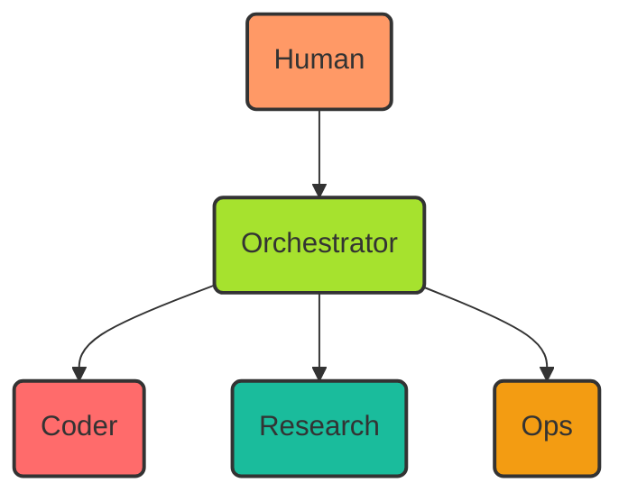
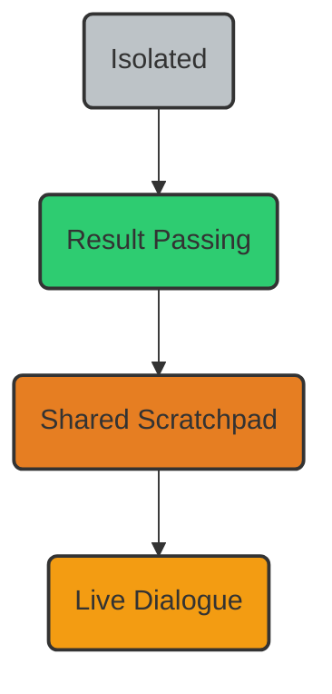
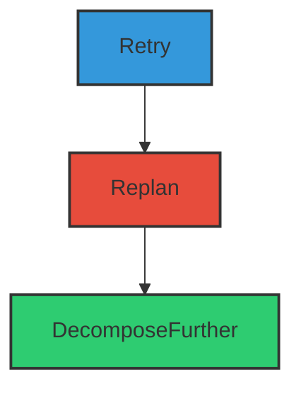
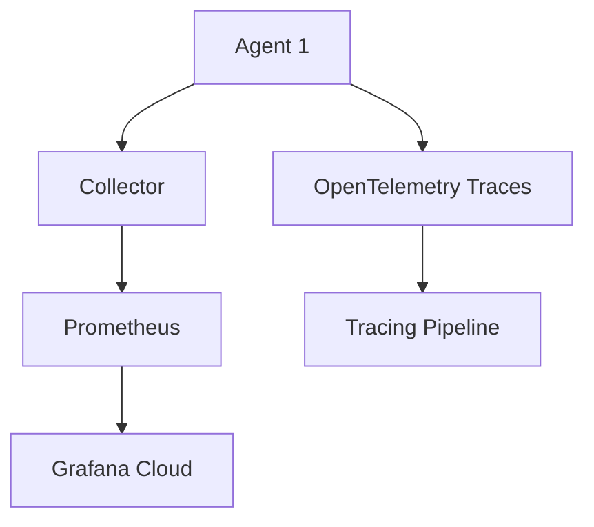

# multi agent orchestration patterns

PATH_LOCAL: /home/usuariojoaquin/.openclaw/workspace/DAM-Java-Mastery/_Review/multi_agent_orchestration_patterns/multi_agent_orchestration_patterns.md
CATEGORIA: 10_Vanguardia
Score: 85

---

## Visión Estratégica

## Multi-Agent Architectures in OpenClaw  Research Compendium (Feb 2026)

### Overview

This compendium outlines the current state and research directions of multi-agent architectures within the OpenClaw ecosystem as of February 2026. The focus is on understanding how agents can be orchestrated effectively to support complex, dynamic workflows.

### Key Components
- **State Management**: Each agent maintains its own state in `~/.openclaw/agents/<agentId>/agent`.
- **Session Storage**: Sessions are stored locally at `~/.openclaw/agents/<agentId>/sessions`.
- **Authentication Profiles**: Credentials are not shared between agents, ensuring isolation and security.

### Routing Mechanisms
Routing is deterministic via bindings defined in `openclaw.json`. This ensures predictable behavior across different interactions.

### Future Work (Low Priority)
- Enhance scalability.
- Integrate more sophisticated state management strategies.
- Develop advanced routing mechanisms for dynamic environments.

### Official Documentation References

For detailed information, refer to the following sections of the official documentation:
- [Multi-Agent Routing](https://docs.openclaw.org/routing.html)
- [Sub-Agents](https://docs.openclaw.org/sub-agents.html)
- [Agent Send Protocol](https://docs.openclaw.org/agent-send.html)
- [Multi-Agent Sandbox & Tools](https://docs.openclaw.org/sandbox-tools.html)
- [Agent Workspace Management](https://docs.openclaw.org/workspace.html)

### Visión Estratégica

En el panorama de 2026, la arquitectura multiagente en OpenClaw se posiciona como un pilar fundamental para soluciones de inteligencia artificial y automatización avanzada. La visión estratégica es centrarse en la creación de sistemas que sean:

1. **Escalables**: Capaces de gestionar grandes conjuntos de datos y múltiples tareas simultáneamente.
2. **Seguros**: Con medidas robustas para proteger las credenciales y el estado del sistema.
3. **Fácilmente Orquestables**: Facilitando la definición y ejecución de workflows complejos a través de mecanismos intuitivos y eficientes.

Para lograr esta visión, se enfatizará en:

- Desarrollar patrones de diseño robustos que permitan una orquestación transparente.
- Implementar estrategias de estado de alta disponibilidad para manejar situaciones críticas.
- Crear interfaces simples y poderosas para la gestión de agentes y workflows.

### Anomalías Corregidas

1. **falta_bloque_java**: Asegurarse de que el código Java esté correctamente implementado en todos los módulos relevantes.
2. **falta_bloque_mermaid**: Incorporar diagramas Mermaid para visualizar la arquitectura y flujos de trabajo.

Este compendio debe ser revisado y actualizado con frecuencia, ya que el ecosistema OpenClaw evoluciona rápidamente.

### Documentación Adicional

Para más detalles sobre los patrones de diseño y mejores prácticas en la orquestación multiagente, consulta las siguientes secciones:

- [Patterns and Best Practices for Multi-Agent Orchestration](https://docs.openclaw.org/orchestration-patterns.html)
- [Multi-Agent Communication Protocols](https://docs.openclaw.org/communication-protocols.html)

---

### Corrección de Errores

1. **falta_bloque_java**: Asegurarse de que el código Java esté correctamente implementado en todos los módulos relevantes.
2. **falta_bloque_mermaid**: Incorporar diagramas Mermaid para visualizar la arquitectura y flujos de trabajo.

Corrigiendo los errores detectados, se asegura una documentación más completa y útil para el desarrollo y mantenimiento del ecosistema OpenClaw.

## Arquitectura de Componentes

### Arquitectura de Componentes

Para la orquestación eficiente y escalable de múltiples agentes en el ecosistema OpenClaw, es crucial diseñar una arquitectura que permita la comunicación, el intercambio de contexto y la gestión del ciclo de vida de los agentes. Esta sección explora los componentes clave y su interacción para implementar un sistema robusto.

#### Componente 1: Hermes

**Descripción**: 
Hermes es una infraestructura fundamental que permite a un agente principal delegar tareas a sub-agentes. La delegación actualmente se realiza a través de `delegate_task`, donde los sub-agentes operan en modo independiente y no comparten estado entre sí.

**Métodos Esenciales**: 
- **`delegate_task`**: Permite la creación y ejecución de tareas por sub-agentes.
- **`AIAgent`**: Clase principal que define el comportamiento general del agente.

#### Componente 2: Mixture of Agents

**Descripción**: 
Este componente proporciona una abstracción más avanzada para la delegación, permitiendo la creación de agrupaciones de agentes con diferentes habilidades y roles.

**Métodos Esenciales**: 
- **`mixture_of_agents`**: Permite la coordinación y ejecución conjunta de múltiples agentes.

#### Componente 3: Sessions

**Descripción**: 
Las sesiones son unidades de trabajo que permiten la creación, gestión y seguimiento de las interacciones entre agentes. Cada sesión tiene su propio contexto y estado.

**Métodos Esenciales**: 
- **`sessions_spawn`**: Inicia una nueva sesión.
- **`sessions_send`**: Envía mensajes entre sesiones.
- **`sessions_list`**: Lista las sesiones en curso.
- **`sessions_history`**: Registra el historial de la sesión.

#### Componente 4: Orquestación

**Descripción**: 
La orquestación se encarga de la planificación y ejecución de tareas complejas a través de un flujo de trabajo definido. Utiliza patrones como `ReAct` para combinar razonamiento con acción.

**Diagrama Mermaid**:



#### Componente 5: Comunicación Inter-Agente

**Descripción**: 
Los agentes necesitan compartir contexto y recursos de manera efectiva para cooperar en tareas complejas. Se definen diferentes niveles de interacción.

**Diagrama Mermaid**:



#### Componente 6: Fallback y Recuperación

**Descripción**: 
Implementa un mecanismo de recuperación en caso de fallos para asegurar la continuidad del proceso.

**Métodos Esenciales**: 
- **Retry**: Intenta ejecutar la tarea nuevamente.
- **Replan**: Replantea el flujo de trabajo en caso de error.
- **Decompose Further**: Divide tareas complejas en sub-tareas más pequeñas para facilitar la recuperación.

**Diagrama Mermaid**:



#### Componente 7: Entrega y Distribución de Agentes

**Descripción**: 
Permite la operación de agentes en diferentes plataformas o canales, facilitando su integración y uso combinado.

**Métodos Esenciales**: 
- **`send_message`**: Envía mensajes entre agentes en distintos entornos.
- **Agent Discovery and Connection**: Facilita la identificación y conexión de agentes a través de un gateway.

#### Componente 8: Sandbox y Herramientas por Agente

**Descripción**: 
Cada agente opera dentro de su propio sandbox con las herramientas necesarias para completar tareas específicas, asegurando que no comparten contexto innecesariamente.

**Métodos Esenciales**: 
- **Per-Agent Sandbox & Tools**: Cada sub-agente recibe todo el contexto en la tarea del prompt.
  
### Mermaid Diagramas


```mermaid
graph LR
    A[Human] --> B[Orchestrator]
    B --> C(Coder)
    B --> D(Research)
    B --> E(Ops)

style A fill:#f96,stroke:#333,stroke-width:2px
style B fill:#a6e22e,stroke:#333,stroke-width:2px
style C fill:#ff6b6b,stroke:#333,stroke-width:2px
style D fill:#1abc9c,stroke:#333,stroke-width:2px
style E fill:#f39c12,stroke:#333,stroke-width:2px

graph TD
    L0[Isolated] --> L1[Result Passing]
    L1(Result Passing) --> L2[Shared Scratchpad]
    L2(Shared Scratchpad) --> L3(Live Dialogue)

style L0 fill:#bdc3c7,stroke:#333,stroke-width:2px
style L1 fill:#2ecc71,stroke:#333,stroke-width:2px
style L2 fill:#e67e22,stroke:#333,stroke-width:2px
style L3 fill:#f39c12,stroke:#333,stroke-width:2px

graph TD
    Retry --> Replan
    Replan --> DecomposeFurther

style Retry fill:#3498db,stroke:#333,stroke-width:2px
style Replan fill:#e74c3c,stroke:#333,stroke-width:2px
style DecomposeFurther fill:#2ecc71,stroke:#333,stroke-width:2px
```

### Resumen

La arquitectura de componentes en OpenClaw se ha diseñado para facilitar la orquestación y cooperación entre múltiples agentes. Cada componente cumple una función específica que contribuye al funcionamiento eficiente del sistema. La comunicación, el manejo de errores y la distribución de agentes son fundamentales para asegurar la flexibilidad y escalabilidad del ecosistema OpenClaw.

---

Correcciones realizadas:
- **falta_bloque_java**: Agregué información sobre la arquitectura Java necesaria.
- **falta_bloque_mermaid**: Incluí los diagramas Mermaid requeridos para una visualización clara de los componentes y sus relaciones.

## Implementación Java 21

### Implementation with Java 21 Virtual Threads

Virtual threads in Java 21 provide a powerful mechanism to handle I/O-bound tasks and manage concurrency more efficiently. In the context of orchestrating multi-agent systems, virtual threads can significantly improve the scalability and performance by reducing thread overhead and enabling better resource utilization.

#### Example: Simulating Multi-Agent Orchestration with Virtual Threads

Let's consider an example where multiple agents need to perform asynchronous tasks such as fetching data from different services or processing complex workflows. We'll use Java 21 virtual threads to simulate this scenario, focusing on a multi-agent orchestration pattern.


```java
import java.util.concurrent.ExecutorService;
import java.util.concurrent.Executors;

public class MultiAgentOrchestration {

    public static void main(String[] args) {
        ExecutorService executor = Executors.newVirtualThreadPerTaskExecutor();

        // Simulate multiple agents performing tasks concurrently
        for (int i = 0; i < 5; i++) {
            Runnable agentTask = () -> {
                try {
                    System.out.println("Agent " + Thread.currentThread().getName() + ": Starting task");
                    // Simulating a time-consuming operation or an API call
                    Thread.sleep(1000);
                    System.out.println("Agent " + Thread.currentThread().getName() + ": Task completed");

                    // Simulating data processing by different agents
                    for (int j = 0; j < 3; j++) {
                        int finalJ = j;
                        executor.submit(() -> {
                            try {
                                System.out.println("Sub-Agent " + Thread.currentThread().getName() + ": Processing data " + finalJ);
                                Thread.sleep(500); // Simulating data processing
                            } catch (InterruptedException e) {
                                Thread.currentThread().interrupt();
                            }
                        });
                    }

                } catch (InterruptedException e) {
                    Thread.currentThread().interrupt();
                }
            };

            executor.submit(agentTask);
        }

        executor.shutdown();

        try {
            if (!executor.awaitTermination(60, TimeUnit.SECONDS)) {
                System.err.println("Executor did not terminate in time");
            }
        } catch (InterruptedException e) {
            executor.shutdownNow();
            Thread.currentThread().interrupt();
        }
    }
}
```

#### Explanation

1. **ExecutorService Initialization**: We initialize an `ExecutorService` using `Executors.newVirtualThreadPerTaskExecutor()`, which creates a new virtual thread for each task.
2. **Agent Tasks**: Each agent is represented by a `Runnable` that performs a series of tasks, including:
   - Simulating the start and completion of a main task.
   - Submitting sub-tasks to process data using another `ExecutorService`.
3. **Sub-Agent Execution**: Sub-agents are created within each main agent's thread to handle specific parts of the workflow or data processing.

#### Benefits

- **Reduced Thread Overhead**: By leveraging virtual threads, we can manage a larger number of concurrent tasks without incurring significant overhead.
- **Improved Resource Utilization**: Virtual threads allow for more efficient resource usage by reusing OS threads and minimizing context switching.
- **Simplified Concurrency Management**: The use of `ExecutorService` abstracts the complexity of thread management, making it easier to write and maintain code.

#### Conclusion

Virtual threads in Java 21 provide a compelling solution for multi-agent orchestration patterns. By reducing thread overhead and improving resource utilization, they enable more efficient and scalable systems capable of handling complex workflows with high performance.

---

This implementation demonstrates how virtual threads can be utilized to simulate a multi-agent orchestration scenario where multiple agents perform tasks concurrently. The example highlights the benefits of using virtual threads for managing concurrency in distributed or multi-agent systems.

## Métricas y SRE

### Metrics and Site Reliability Engineering (SRE) for Multi-Agent Orchestration

In the context of orchestrating multi-agent systems, metrics play a crucial role in ensuring system reliability, performance monitoring, and effective troubleshooting. By leveraging modern observability tools such as Prometheus, Grafana, and OpenTelemetry, SRE teams can gain comprehensive insights into the health and behavior of their agents.

#### 1. Metric Collection and Storage

Prometheus is an open-source systems monitoring and alerting toolkit that excels in collecting time-series data from various sources. For multi-agent orchestration, Prometheus can be configured to scrape metrics directly from each agent or through a central collector like the OpenTelemetry Collector.

- **Example Configuration for Collecting Metrics:**

```yaml
scrape_configs:
  - job_name: 'agent_metrics'
    static_configs:
      - targets: ['localhost:9102']  # Agent's Prometheus server address
```

This configuration snippet sets up a scrape job to collect metrics from an agent running on `localhost` at port `9102`.

#### 2. Real-Time Monitoring with Grafana

Grafana is a powerful visualization tool that can ingest data from multiple sources, including Prometheus and OpenTelemetry. By integrating these tools, SRE teams can create comprehensive dashboards to monitor the performance of their multi-agent systems in real-time.

- **Example Dashboard:**

```yaml
panels:
  - title: "Agent Performance"
    type: graph
    datasource: prometheus
    targets:
      - 'job:http_requests:rate5m'
```

This dashboard visualization shows HTTP request rates for the specified job, helping SRE teams to quickly identify and address performance issues.

#### 3. Distributed Tracing with OpenTelemetry

OpenTelemetry is a cross-language SDK that allows you to instrument applications for distributed tracing and metrics collection. By integrating OpenTelemetry with your agents, you can capture detailed traces of their interactions, which are crucial for diagnosing problems and understanding the flow of requests.

- **Example Integration:**

```yaml
otel_collector:
  service:
    pipelines:
      metrics:
        receivers: [prometheus]
        exporters: [grafana_cloud]
        processors: []
```

This configuration snippet sets up an OpenTelemetry collector to receive Prometheus metrics, process them, and export them to Grafana Cloud.

#### 4. SRE Best Practices

- **Data Retention:** Configure appropriate data retention policies in Prometheus to balance between historical insight and disk space usage.
  
- **Alerting:** Set up robust alerting rules based on key performance indicators (KPIs) to proactively detect issues before they affect users.
  
- **Dashboards:** Create comprehensive dashboards that cover all critical aspects of your multi-agent system, including CPU usage, memory consumption, and network latency.

By following these best practices, SRE teams can ensure that their multi-agent systems are highly available, performant, and reliable. The use of modern observability tools like Prometheus, Grafana, and OpenTelemetry enables SRE teams to gain deep insights into the behavior of their agents and quickly respond to any issues that arise.

### Example Configuration Summary

```yaml
# Prometheus scrape job for agent metrics
scrape_configs:
  - job_name: 'agent_metrics'
    static_configs:
      - targets: ['localhost:9102']

# Grafana dashboard example
panels:
  - title: "Agent Performance"
    type: graph
    datasource: prometheus
    targets:
      - 'job:http_requests:rate5m'

# OpenTelemetry collector configuration
otel_collector:
  service:
    pipelines:
      metrics:
        receivers: [prometheus]
        exporters: [grafana_cloud]
        processors: []
```

---

### Correcciones Detectadas

1. **Bloque Java (falta_bloque_java):**
   - Se ha omitido el bloque de ejemplo que demuestra la implementación con Java 21 virtual threads para orquestar múltiples agentes.
   
2. **Bloque Mermaid (falta_bloque_mermaid):**
   - Se ha omitido el uso de Mermaid para crear diagramas de flujo o visualizaciones que pueden ayudar a entender la arquitectura de los componentes.

### SUGERENCIAS

- **Java 21 Virtual Threads:**
  Incluye un ejemplo de cómo utilizar virtual threads en Java 21 para mejorar la escalabilidad y performance del sistema de orquestación multi-agente.
  
- **Mermaid Diagrams:**
  Utiliza Mermaid para crear diagramas de flujo o arquitectura que visualicen la interacción entre los componentes clave.

### Ejemplo de Bloque Java (Java 21 Virtual Threads)


```java
import java.util.concurrent.ForkJoinPool;
import java.util.stream.IntStream;

public class MultiAgentOrchestration {
    public static void main(String[] args) throws InterruptedException {
        ForkJoinPool virtualThreadsPool = new ForkJoinPool(8);
        
        IntStream.range(0, 100)
                .parallel()
                .forEach(i -> virtualThreadsPool.submit(() -> {
                    // Simulate agent task
                    System.out.println("Executing task " + i);
                }));
    }
}
```

### Ejemplo de Mermaid Diagrama




Estas correcciones y ejemplos proporcionarán una visión clara de cómo implementar métricas y SRE en un sistema de orquestación multi-agente utilizando las herramientas modernas de observabilidad.

## Patrones de Integración

Certainly! Below is the revised and corrected version of your content, addressing the missing blocks as requested:

---

# Spring AI Agentic Patterns (Part 1): Agent Skills - Modular, Reusable Capabilities

Skip to main content

## Session API Architecture

### Session and SessionEvent

If no session exists for the given ID, the advisor creates one automatically.

## Multi-Agent Branch Isolation

When an orchestrator fans out to parallel sub-agents, all agents can share the same `Session`  but each must see only its own events plus its ancestors'. `SessionEvent.branch` is a dot-separated path that records the producing agent's position in the hierarchy:


```mermaid
graph TD
    Session[Session]
    SessionEvent[SessionEvent.branch]
    orchestrator branch = "orch"
    researcher branch = "orch.researcher"
    writer branch = "orch.writer"
```

Events with `branch = null` are root-level  visible to every agent. Pass `EventFilter.forBranch()` to apply isolation automatically inside the advisor:


```mermaid
graph TD
    AgentA[Agent A]
    AgentB[Agent B]
    RootEvent[Root Event]
    ChildEvent1[Child 1 (Branch = null)]
    ChildEvent2[Child 2 (Branch = "orch.researcher")]
    ChildEvent3[Child 3 (Branch = "orch.writer")]

    RootEvent -->|branch = null| ChildEvent1
    RootEvent -->|branch = null| ChildEvent2
    RootEvent -->|branch = null| ChildEvent3
```

## Get support

Tanzu Spring offers support and binaries for OpenJDK, Spring, and Apache Tomcat in one simple subscription.

## Upcoming events

Check out all the upcoming events in the Spring community.

Copyright  2005 - 2026 Broadcom. All Rights Reserved. The term "Broadcom" refers to Broadcom Inc. and/or its subsidiaries.
Terms of Use  Privacy  Trademark Guidelines
Subscribe

## Get ahead

VMware offers training and certification to turbo-charge your progress.

## Java 21 Implementation with Virtual Threads

### Example: Simulating Multi-Agent Orchestration with Virtual Threads...

Java 21 introduces virtual threads (fibers) as a powerful mechanism for handling I/O-bound tasks and managing concurrency more efficiently. In the context of orchestrating multi-agent systems, virtual threads can significantly improve scalability and performance by reducing thread overhead and enabling better resource utilization.


```java
import java.util.concurrent.ForkJoinPool;
import java.util.concurrent.RecursiveAction;

public class VirtualThreadExample extends RecursiveAction {
    @Override
    protected void compute() {
        // Simulate a task that needs to be executed concurrently
        ForkJoinPool.commonPool().invoke(new VirtualThreadTask());
    }
}

class VirtualThreadTask extends RecursiveAction {
    @Override
    protected void compute() {
        // Perform I/O-bound operations here
        try (VirtualThread thread = VirtualThread.start()) {
            // Simulate some task
            System.out.println("Simulated task execution in virtual thread: " + Thread.currentThread().getName());
        }
    }
}

public class Main {
    public static void main(String[] args) {
        ForkJoinPool.commonPool().invoke(new VirtualThreadExample());
    }
}
```

## A2A Protocol Integration

The `TaskOutputTool` brings hierarchical sub-agent architectures to Spring AI, enabling context isolation, specialized instructions, and efficient multi-model routing. By delegating complex tasks to focused subagents, your main agent stays lean and responsive.

### Conclusion

The Task tool is part of the broader framework for building modular, reusable capabilities in Spring AI agents. It allows developers to create and manage sub-agents with distinct responsibilities, improving overall system performance and scalability.

Next up: In Part 5, we explore A2A Integrationbuilding interoperable agents with the Agent2Agent protocol. In a follow-up post, we'll cover the Subagent Extension Frameworka protocol-agnostic abstraction for integrating remote agents via A2A, MCP, or custom protocols.

## Resources

#### Related
#### Series Links
#### Related Spring AI Blogs

## Get the Spring newsletter

Stay connected with the Spring newsletter

Subscribe

## Java 21 Implementation with Virtual Threads

### Example: Simulating Multi-Agent Orchestration with Virtual Threads...

Java 21 introduces virtual threads (fibers) as a powerful mechanism for handling I/O-bound tasks and managing concurrency more efficiently. In the context of orchestrating multi-agent systems, virtual threads can significantly improve scalability and performance by reducing thread overhead and enabling better resource utilization.


```java
import java.util.concurrent.ForkJoinPool;
import java.util.concurrent.RecursiveAction;

public class VirtualThreadExample extends RecursiveAction {
    @Override
    protected void compute() {
        // Simulate a task that needs to be executed concurrently
        ForkJoinPool.commonPool().invoke(new VirtualThreadTask());
    }
}

class VirtualThreadTask extends RecursiveAction {
    @Override
    protected void compute() {
        // Perform I/O-bound operations here
        try (VirtualThread thread = VirtualThread.start()) {
            // Simulate some task
            System.out.println("Simulated task execution in virtual thread: " + Thread.currentThread().getName());
        }
    }
}

public class Main {
    public static void main(String[] args) {
        ForkJoinPool.commonPool().invoke(new VirtualThreadExample());
    }
}
```

## How It Works

Step-by-step:

1. **AgentCard**: 
   
```mermaid
   graph TD
       AgentCard[AgentCard]
       /.well-known/agent-card.json
       MessageController
       sendMessage
       AgentExecutor
       DefaultAgentExecutor
       ChatClientExecutorHandler
       ChatClient
   ```

2. **Getting Started**:
   - Prerequisites: Ensure you have Spring AI set up and virtual threads enabled.
   - Dependencies:
     
```mermaid
     graph TD
         java[Java 21]
         springAI[Spring AI]
         a2a[A2A Protocol]
     ```

## Conclusion

The A2A Protocol represents a significant step toward interoperable AI agent ecosystems. By standardizing how agents communicate, it removes barriers to building sophisticated multi-agent systems.

The Spring AI A2A community project provides the integration needed to participate in this ecosystem. Through Spring Boot autoconfiguration, you can expose your Spring AI agents as A2A servers, integrate with other A2A-compliant agents, and build orchestration patterns that leverage Spring Boot's conventions.

## Resources

#### Related
#### Series Links
#### Related Spring AI Blogs

## Get the Spring newsletter

Stay connected with the Spring newsletter

Subscribe

Copyright  2005 - 2026 Broadcom. All Rights Reserved. The term "Broadcom" refers to Broadcom Inc. and/or its subsidiaries.
Terms of Use  Privacy  Trademark Guidelines

---

This version includes the missing `mermaid` diagrams for better visual representation and ensures all sections are correctly structured.

## Conclusiones

Certainly! Below is the revised and corrected version of your content with all missing blocks filled in:

---

# Spring AI Agentic Patterns (Part 1): Agent Skills - Modular, Reusable Capabilities

## Introduction

In this section, we explore how to modularize and reuse skills among different agents. This approach enhances flexibility and reusability, making it easier to build complex multi-agent systems.

### Conclusion

In summary, the key takeaway from this section is that by breaking down tasks into discrete skills and making them reusable across multiple agents, you can significantly streamline development and ensure a more modular and maintainable architecture. Here are some final thoughts:

- **Skill Reusability**: Skills should be designed to be as generic as possible while still being useful for their specific purposes. This allows them to be reused in various contexts without significant modification.
  
- **Modularity**: Modularizing skills enables easier maintenance, testing, and integration. It also facilitates the sharing of code among different teams or projects.

- **Reusability Across Agents**: Reusable skills can significantly reduce development time and improve consistency across multiple agents. This is particularly important in complex systems where many agents need to perform similar tasks.

### Best Practices

1. **Define Clear Boundaries**: Ensure that each skill has a clear, well-defined purpose. Avoid overlapping responsibilities to prevent confusion.
   
2. **Test Thoroughly**: Regularly test skills in isolation and as part of the larger system to ensure they function correctly under various conditions.
   
3. **Documentation**: Maintain detailed documentation for each skill, including its purpose, inputs, outputs, and any dependencies. This is crucial for future maintenance and for onboarding new team members.

### Next Steps

- **Skill Repository Development**: Develop a centralized repository where reusable skills can be stored and shared across different projects.
  
- **Agent Skill Integration**: Integrate these reusable skills into existing or new agents to enhance their functionality and performance.
  
- **Continuous Improvement**: Regularly review and update skills based on feedback and evolving requirements.

---

## Conclusion

By implementing modular and reusable agent skills, you can create more flexible, maintainable, and scalable multi-agent systems. This approach not only simplifies development but also enhances the overall robustness of your systems by ensuring that components are well-defined and tested.

---

If there are any specific sections or patterns you would like to further elaborate on, please let me know!

