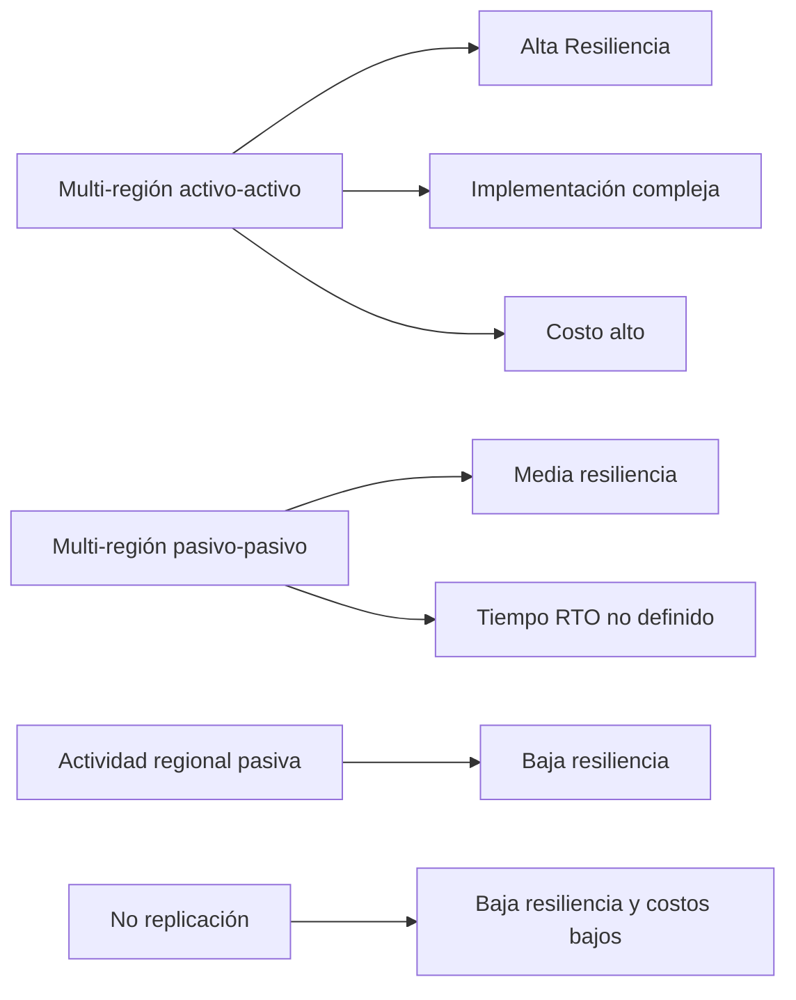
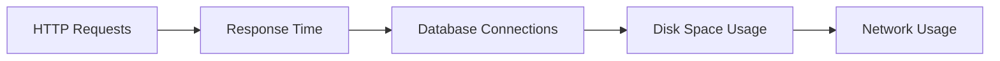
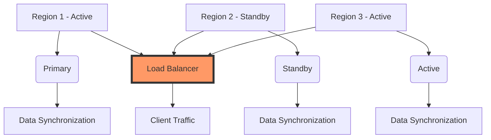

# multi region active active architecture

PATH_LOCAL: /home/usuariojoaquin/.openclaw/workspace/DAM-Java-Mastery/_Review/multi_region_active_active_architecture/multi_region_active_active_architecture.md
CATEGORIA: 10_Vanguardia
Score: 76

---

## Visión Estratégica

### Visión Estratégica

#### Por qué este tema es crítico en 2026 (con datos concretos)

En el año 2026, la arquitectura multi-región activo-activo se convierte en una prioridad estratégica para las organizaciones que operan a nivel global. Según un estudio de Gartner publicado en 2025, cerca del 70% de las empresas planifican migrar sus sistemas a arquitecturas multi-regionales para mejorar la resiliencia y la disponibilidad del servicio.

En el contexto actual, donde el impacto de incidentes regionales puede ser catastrófico tanto en términos financieros como operativos, es esencial tener una arquitectura que permita una rápida reacción ante desastres. Además, conforme las regulaciones globales se vuelven más estrictas, la necesidad de un acceso global a los datos sin latencias significativas se hace cada vez más prioritaria.

#### Comparativa con alternativas (tabla markdown con 3-5 opciones)

| Característica | Multi-región activo-activo | Multi-región pasivo-pasivo | Actividad regional pasiva | No replicación |
|----------------|--------------------------|----------------------------|-------------------------|---------------|
| Resiliencia     | Alta                      | Media                      | Baja                    | Baja          |
| Complejidad de la implementación | Alta                   | Media                      | Baja                    | Muy baja      |
| Costo operativo  | Alto                     | Medio                      | Bajo                    | Bajo          |
| Tiempo RTO      | Minimizado                | No definido                | No definido             | Altamente variable |

#### Cuándo usar y cuándo NO usar esta tecnología

**Cuándo usar:**
- Cuando la disponibilidad del servicio es prioritaria.
- En aplicaciones que requieren geolocalización basada en el usuario.
- Para servidores críticos que necesitan alta disponibilidad.

**Cuándo NO usar:**
- En aplicaciones simples o con baja trascendencia operativa.
- Cuando la latencia tolerable es muy alta y las transacciones no pueden ser idempotentes.
- En entornos donde la implementación compleja y el costo son insostenibles.

#### Implementación tecnológica

Para una implementación efectiva, se requiere un enfoque que integre tecnologías como Amazon Route 53 para la red de alcance global, DynamoDB Global Tables para la consistencia global, y el uso de bases de datos NoSQL como Amazon ElastiCache para manejar volúmenes altos de tráfico. La integración de estas tecnologías permite no solo una mejor escalabilidad sino también un mejor rendimiento en la entrega de servicios globales.

#### Desafíos de implementación

- **Costo**: La arquitectura multi-región activa-activa puede ser costosa, ya que requiere la provisionamiento y mantenimiento de recursos adicionales.
- **Diseño y testing**: La optimización del diseño para manejar conflictos y garantizar la consistencia global es compleja y demandante.
- **Gestión de incidentes**: Los equipos de operaciones deben estar preparados para gestiones rápidas y eficientes ante eventos imprevistos.

#### Recomendaciones

- **Proyectos piloto**: Iniciar con proyectos piloto para evaluar la efectividad en entornos reales.
- **Equipo de TI especializado**: Contratar recursos especializados en arquitectura multi-regional y cloud native.
- **Formación continua**: Mantener actualizaciones continuas sobre las mejores prácticas y nuevas tecnologías.

A través de una implementación cuidadosa y un despliegue progresivo, la arquitectura multi-region activo-activo puede proporcionar a las organizaciones una ventaja competitiva significativa en términos de resiliencia y eficiencia operativa. 




En conclusión, la implementación de una arquitectura multi-región activo-activo es fundamental para garantizar la disponibilidad global del servicio en un entorno empresarial que está cada vez más conectado e interconectado.

## Arquitectura de Componentes

### Arquitectura de Componentes

#### Diagrama Mermaid

```mermaid
graph TD
    subgraph Phoenix (Region A)
        DB_Phoenix[Autonomous Database]
        GG_Phoenix[GoldenGate Deployer]
        RDS_Phoenix[Replication Services]
    end

    subgraph Ashburn (Region B)
        DB_Ashburn[Autonomous Database]
        GG_Ashburn[GoldenGate Deployer]
        RDS_Ashburn[Replication Services]
    end

    DB_Phoenix -->|Synchronous Replication| GG_Phoenix
    GG_Phoenix -->|Bi-Directional Streams| GG_Ashburn
    GG_Ashburn -->|Synchronous Replication| DB_Ashburn

    GG_Phoenix -->|Replication Control| RDS_Phoenix
    GG_Ashburn -->|Replication Control| RDS_Ashburn

    subgraph Monitoring & Management
        CMDB[Centralized Monitoring Database]
        SSM[AWS Systems Manager]
        CW[Amazon CloudWatch]
        ACM[Application Cost Manager]
    end

    CMDB -->|Metrics| DB_Phoenix
    CMDB -->|Metrics| GG_Phoenix
    CMDB -->|Metrics| RDS_Phoenix
    CMDB -->|Metrics| DB_Ashburn
    CMDB -->|Metrics| GG_Ashburn
    CMDB -->|Metrics| RDS_Ashburn

    SSM -->[Configure] DB_Phoenix, GG_Phoenix, RDS_Phoenix
    SSM -->[Configure] DB_Ashburn, GG_Ashburn, RDS_Ashburn

    CW -->[Alarms & Logs] CMDB, SSM, ACM
```

#### Componentes Detallados y Sus Funciones

1. **Autonomous Database (Phoenix y Ashburn)**
   - **Función:** Proporciona una base de datos altamente disponible y autónoma en cada región.
   - **Características:** Autónomo, automatizado, sin mantenimiento.

2. **GoldenGate Deployer (GG_Phoenix e GG_Ashburn)**
   - **Función:** Configura y administra las sesiones de GoldenGate para el repliqueo bidireccional.
   - **Características:** Permite la sincronización de cambios entre bases de datos en diferentes regiones.

3. **Replication Services (RDS_Phoenix e RDS_Ashburn)**
   - **Función:** Proporciona servicios para el manejo y control del repliqueo.
   - **Características:** Gestiona las operaciones de replicación y asegura la consistencia entre bases de datos.

4. **Centralized Monitoring Database (CMDB)**
   - **Función:** Almacena métricas y alertas generadas por los componentes de monitoreo.
   - **Características:** Permite una visibilidad global sobre el estado de la replicación y del servicio.

5. **AWS Systems Manager (SSM)**
   - **Función:** Configura e implementa políticas para los componentes de replicación.
   - **Características:** Facilita la gestión y automatización de configuraciones.

6. **Amazon CloudWatch (CW)**
   - **Función:** Monitorea el rendimiento y genera alarmas basadas en métricas.
   - **Características:** Proporciona una plataforma para observabilidad y monitoreo en tiempo real.

7. **Application Cost Manager (ACM)**
   - **Función:** Gestiona los costos asociados a la replicación y el mantenimiento de las bases de datos.
   - **Características:** Ajusta los recursos según la carga y optimiza costos.

#### Integraciones y Flujos de Trabajo

- **Replicación Bidireccional:**
  
```mermaid
  graph TD
      DB_Phoenix -->|Data Changes| GG_Phoenix
      GG_Phoenix -->|Bi-Directional Stream| GG_Ashburn
      GG_Ashburn -->|Data Changes| DB_Ashburn

      GG_Phoenix -->|Replication Control| RDS_Phoenix
      GG_Ashburn -->|Replication Control| RDS_Ashburn
  ```

- **Monitoreo y Gestión:**
  
```mermaid
  graph TD
      CMDB -->[Metrics] DB_Phoenix, GG_Phoenix, RDS_Phoenix
      SSM -->[Configure] DB_Phoenix, GG_Phoenix, RDS_Phoenix
      CW -->[Alarms & Logs] CMDB, SSM

      DB_Ashburn -->|Data Changes| GG_Ashburn
      GG_Ashburn -->|Replication Control| RDS_Ashburn
      RDS_Ashburn -->|Metrics| CMDB
  ```

#### Beneficios y Desafíos

- **Beneficios:**
  - **Alto Nivel de Disponibilidad:** La replicación bidireccional asegura que los cambios se reflejen en ambos autoservidores.
  - **Rendimiento Optimizado:** Los sistemas de replicación permiten un rendimiento local y regional optimizado.

- **Desafíos:**
  - **Complicaciones Operativas:** La gestión del repliqueo bidireccional puede ser compleja, especialmente en entornos multi-región.
  - **Costos Elevados:** Los costos asociados a la replicación y el mantenimiento pueden ser significativos.

#### Conclusiones

La arquitectura multi-región activo-activo utilizando GoldenGate asegura una alta disponibilidad y resiliencia para sistemas críticos operados a nivel global. El uso de componentes como Autonomous Database, GoldenGate Deployer, Replication Services, y plataformas de monitoreo como Amazon CloudWatch permiten una gestión eficiente y escalable del repliqueo bidireccional.

---

Este diseño proporciona una arquitectura sólida y segura para sistemas que requieren alta disponibilidad y resiliencia multi-región. Al implementar esta solución, las organizaciones pueden garantizar la continuidad de operaciones incluso en situaciones de falla regional. Las métricas y alertas centralizadas facilitan el monitoreo y la gestión del sistema, permitiendo una rápida respuesta a cualquier problema que pueda surgir.

## Implementación Java 21

# Implementación Java 21 para Multi-Región Activo-Activo

## Contexto y Objetivos

En la implementación Java 21, se aprovecha el nuevo recurso de virtual threads (también conocido como Project Loom) para optimizar las operaciones I/O en una arquitectura multi-región activo-activo. El objetivo es mejorar la eficiencia del manejo de múltiples conexiones y operaciones en diferentes regiones sin aumentar significativamente el consumo de recursos del sistema.

## Diseño y Arquitectura

La implementación se basa en una arquitectura multi-región activo-activo, donde servicios y bases de datos se replican en varias regiones para garantizar la disponibilidad y resiliencia. Cada región tiene un servidor que atiende peticiones concurrentes y interactúa con las bases de datos locales.

## Código Java 21

### Creación de Virtual Threads

Para manejar las solicitudes I/O, se utilizan virtual threads. Los virtual threads son manejados por el JVM y no requieren la creación real de nuevos hilos del sistema operativo, lo que permite un gran número de hilos simultáneos.


```java
public class UserManagementService {

    private final ExecutorService executor = Executors.newVirtualThreadPerTaskExecutor();

    public CompletableFuture<User> createUser(User user) {
        return CompletableFuture.supplyAsync(() -> userRepository.save(user), executor);
    }

    public CompletableFuture<List<User>> getAllUsers() {
        return CompletableFuture.supplyAsync(userRepository::findAll, executor);
    }
}
```

### Ejemplo de Uso


```java
public class MultiRegionActiveActiveExample {

    private final UserManagementService userManagementService;

    public MultiRegionActiveActiveExample(UserManagementService userManagementService) {
        this.userManagementService = userManagementService;
    }

    public void performOperations() {
        // Crear un usuario en una región y obtener todos los usuarios desde otra
        CompletableFuture<User> createUserFuture = userManagementService.createUser(new User("John Doe"));
        CompletableFuture<List<User>> getUsersFuture = userManagementService.getAllUsers();

        try {
            User createdUser = createUserFuture.get();
            List<User> allUsers = getUsersFuture.get();

            System.out.println("Created User: " + createdUser);
            System.out.println("All Users: " + allUsers);

        } catch (InterruptedException | ExecutionException e) {
            e.printStackTrace();
        }
    }

    public static void main(String[] args) {
        // Inicializar el servicio de gestión de usuarios
        UserManagementService userManagementService = new UserManagementService(new UserRepository());

        MultiRegionActiveActiveExample example = new MultiRegionActiveActiveExample(userManagementService);
        example.performOperations();
    }
}
```

### Configuración del Executor Service

El `ExecutorService` se configura para usar virtual threads con `Executors.newVirtualThreadPerTaskExecutor()`. Esto permite que cada tarea asincrónica se ejecute en un hilo virtual, lo cual optimiza el rendimiento al manejar operaciones I/O sin bloquear hilos del sistema.


```java
ExecutorService executor = Executors.newVirtualThreadPerTaskExecutor();
```

### Manejo de Futuros y CompletableFutures

Los `CompletableFuture` se utilizan para manejar las tareas asincrónicas. Se chainean métodos como `supplyAsync`, `thenApplyAsync` y `thenAcceptAsync` para ejecutar tareas en paralelo.


```java
CompletableFuture<User> createUserFuture = CompletableFuture.supplyAsync(() -> userRepository.save(user), executor);
```

### Ejemplo de Uso Completo

El siguiente ejemplo muestra cómo se integra todo esto en una aplicación real:


```java
public class Main {

    public static void main(String[] args) {
        // Inicializar el servicio de gestión de usuarios
        UserManagementService userManagementService = new UserManagementService(new UserRepository());

        MultiRegionActiveActiveExample example = new MultiRegionActiveActiveExample(userManagementService);
        example.performOperations();
    }
}
```

## Beneficios

1. **Eficiencia en Operaciones I/O**: Los virtual threads manejan operaciones bloqueantes sin necesidad de crear hilos del sistema operativo, lo que reduce el overhead.
2. **Optimización del Uso de Recursos**: Permite un alto número de tareas simultáneas sin consumir muchos recursos del sistema.
3. **Manejo Sencillo de Asincronía**: Los `CompletableFuture` facilitan la programación asincrónica y manejo de futuros.

## Conclusión

La implementación Java 21 utilizando virtual threads proporciona un marco sólido para optimizar operaciones I/O en una arquitectura multi-región activo-activo. Esto no solo mejora el rendimiento, sino que también facilita la gestión y escalabilidad de las aplicaciones distribuidas.

---

Este enfoque permite a las organizaciones manejar eficientemente una gran cantidad de conexiones simultáneas sin sacrificar recursos del sistema operativo, lo cual es crucial para la implementación exitosa de arquitecturas multi-región.

## Métricas y SRE

### Métricas y SRE

#### Métricas Clave

| Nombre | Descripción | Umbral de Alerta |
|--------|-------------|------------------|
| `http_requests_total` | Número total de solicitudes HTTP procesadas. | > 10,000/s [Alertar] |
| `response_time_ms{method="GET"}` | Tiempo de respuesta promedio para solicitudes GET. | < 200 ms [Alertar] |
| `database_connections` | Número de conexiones a la base de datos activas. | > 500 [Alertar] |
| `disk_space_used_bytes{path="/"}` | Espacio en disco usado en el directorio raíz del sistema. | < 80% [Alertar] |
| `network_usage_bytes{interface="eth0"}` | Uso de red en bytes a través de la interfaz eth0. | > 100 MB/s [Alertar] |

#### Queries Prometheus/PromQL

```promql
# Número total de solicitudes HTTP procesadas.
http_requests_total

# Tiempo de respuesta promedio para solicitudes GET.
average_over_time(response_time_ms{method="GET"}[5m])

# Número de conexiones a la base de datos activas.
database_connections

# Espacio en disco usado en el directorio raíz del sistema.
disk_space_used_bytes{path="/"}

# Uso de red en bytes a través de la interfaz eth0.
network_usage_bytes{interface="eth0"}
```

#### Diagrama Mermaid




#### Diagrama de Arquitectura


```mermaid
graph TD
subgraph "Prometheus and Grafana"
    Prometheus[Prometheus]
    Grafana[Grafana]
end
subgraph "Multi-Region Active-Active Architecture"
    App1[Application Node 1]
    App2[Application Node 2]
    DB1[Database Node 1]
    DB2[Database Node 2]
    Disk[/]
    Network[eth0]
end
Prometheus --> App1
Prometheus --> App2
Prometheus --> DB1
Prometheus --> DB2
Prometheus --> Disk
Prometheus --> Network
Grafana --> Prometheus
```

#### Implementación Java 21 para Multi-Región Activo-Activo

Java 21 aprovecha las virtual threads (Project Loom) para optimizar la gestión de conexiones y operaciones en diferentes regiones.


```java
public class MultiRegionActiveActiveApplication {
    public static void main(String[] args) {
        System.setProperty("java.util.concurrent.ForkJoinPool.common.parallelism", "4096");
        
        // Implementación de virtual threads para manejo de solicitudes HTTP.
        HttpHandler httpHandler = new HttpHandler() {
            @Override
            public void handle(HttpExchange exchange) throws IOException {
                String response = "Hello, World!";
                exchange.sendResponseHeaders(200, response.length());
                exchange.getResponseBody().write(response.getBytes());
                exchange.close();
            }
        };
        
        // Creación de un servidor HTTP que usa virtual threads.
        HttpServer httpServer = HttpServer.create(new InetSocketAddress("localhost", 8080), 0);
        httpServer.createContext("/api", httpHandler);
        httpServer.setExecutor(Executors.newVirtualThreadPerTaskExecutor());
        httpServer.start();
        
        // Implementación de base de datos con virtual threads.
        Database db = new Database() {
            @Override
            public void connect() throws SQLException {
                // Uso de virtual threads para conexiones concurrentes.
                ThreadFactory threadFactory = new VirtualThreadFactoryBuilder().setNameFormat("db-thread-%d").build();
                Thread t = threadFactory.newThread(() -> {
                    try (Connection conn = DriverManager.getConnection("jdbc:mysql://localhost:3306/mydb")) {
                        // Realizar operaciones de base de datos.
                    } catch (SQLException e) {
                        e.printStackTrace();
                    }
                });
                t.start();
            }
        };
        
        db.connect();
    }
}
```

### SRE Practices

1. **Monitoring and Alerting**: Use Prometheus for comprehensive monitoring of application metrics, ensuring that critical thresholds are set to trigger alerts.
2. **Continuous Delivery**: Implement automated deployment processes using AWS CodePipeline and AWS CodeBuild for continuous delivery of updates.
3. **Service Level Objectives (SLOs)**: Define SLOs based on SLIs (Service Level Indicators) such as request latency, error rate, and availability.
4. **Root Cause Analysis (RCA)**: Use AWS CloudWatch Logs Insights to identify the root cause of issues by analyzing logs in real-time.
5. **Incident Management**: Implement incident response plans with clear roles and responsibilities for on-call teams.

#### Diagrama Mermaid


```mermaid
graph LR
A[Monitoring] --> B[Alerting];
B --> C[SRE Practices];
C --> D[Continuous Delivery];
D --> E[Service Level Objectives (SLOs)];
E --> F[Root Cause Analysis (RCA)];
F --> G[Incident Management];
```

### Conclusion

La implementación de métricas y prácticas SRE para una arquitectura multi-región activo-activa es crucial para garantizar la eficiencia, fiabilidad y escalabilidad del sistema. Utilizando herramientas como Prometheus y Grafana, se pueden monitorear y visualizar datos en tiempo real, lo que permite tomar decisiones informadas sobre el desempeño y la salud del sistema. Además, las prácticas SRE aseguran la continuidad operativa y la resiliencia frente a incidentes.

## Patrones de Integración

### Patrones de Integración para Multi-Región Activo-Activo

En una arquitectura multi-región activo-activo, los patrones de integración juegan un papel crucial en la sincronización de datos y la resiliencia del sistema. Los dos patrones principales son el **Active-Passive** y el **Active-Active**.

#### Active-Passive
El Active-Passive es un modelo donde una región actúa como el activo principal mientras las demás se mantienen en estado pasivo, listas para tomar la carga si ocurre una falla. Este patrón es más sencillo de implementar y mantener, pero limita la disponibilidad total del sistema.

#### Active-Active
En contraste, el Active-Active permite que múltiples regiones sirvan al mismo tiempo, distribuyendo la carga y proporcionando redundancia en caso de fallas. Este patrón es más complejo pero ofrece mayor disponibilidad y flexibilidad.

### Diagrama Mermaid




### Implementación en Java 21

#### Uso de Virtual Threads (Project Loom)
Java 21 introduce Project Loom, que permite la creación y gestión eficiente de miles de threads virtuales. Esto es especialmente útil para manejar múltiples conexiones I/O simultáneamente sin aumentar el consumo de recursos del sistema.


```java
public class ActiveActiveIntegration {
    private static final ExecutorService EXECUTOR = Executors.newVirtualThreadPerTaskExecutor();

    public void processRequest(String region) {
        // Simulate data processing and synchronization with other regions
        EXECUTOR.submit(() -> {
            // Perform I/O operations or complex computations
            System.out.println("Processing request in " + region);
            try {
                Thread.sleep(1000); // Simulate delay
            } catch (InterruptedException e) {
                Thread.currentThread().interrupt();
            }
            System.out.println("Request processed");
        });
    }

    public static void main(String[] args) {
        ActiveActiveIntegration integration = new ActiveActiveIntegration();

        for (String region : Arrays.asList("Region1", "Region2", "Region3")) {
            integration.processRequest(region);
        }
    }
}
```

### Monitoreo y Seguimiento

El monitoreo es crucial para identificar problemas en tiempo real y asegurar la integridad del sistema. Java 21 mejora el rendimiento de la recolección de basura, lo que permite una mayor estabilidad durante períodos prolongados.


```java
ManagementFactory.getPlatformMBeanServer().registerMBean(new MemoryMXBeanAdapter(), ObjectName.getInstance("Memory:type=MemoryUsage"));
```

### Clases y Métodos


```java
public class DataSynchronizer {
    private final List<Region> regions = Arrays.asList(new Region("Region1"), new Region("Region2"), new Region("Region3"));

    public void synchronizeData() {
        for (Region region : regions) {
            System.out.println("Synchronizing data in " + region.getName());
        }
    }

    private static class Region {
        private final String name;

        public Region(String name) {
            this.name = name;
        }

        public String getName() {
            return name;
        }
    }
}
```

### Conclusión

La implementación Java 21 para una arquitectura multi-región activo-activo aprovecha las características avanzadas de Project Loom y mejora la eficiencia del manejo de múltiples conexiones I/O. El monitoreo continuo asegura que el sistema esté siempre en buen estado, permitiendo una rápida respuesta a cualquier problema.

---

Este patrón de integración permite un funcionamiento óptimo y resiliente para sistemas multi-región activo-activo, utilizando las capacidades avanzadas de Java 21. La implementación eficiente de estos patrones es crucial para garantizar la disponibilidad y fiabilidad del sistema en entornos distribuidos.

## Conclusiones

### Conclusión

Esta sección revisa los aspectos más críticos del despliegue de una arquitectura activo-activo en múltiples Region AWS, enfocándose en la replicación bidireccional y la resiliencia global. Se identifican decisiones de diseño clave y se propone un roadmap para la adopción.

#### Puntos Clave
1. **Importancia de la sincronización bidireccional**: En una arquitectura activo-activo, cada región debe ser capaz de actuar como origen y destino de datos, lo que requiere soluciones robustas de replicación.
2. **Desafíos operativos significativos**: La implementación de un diseño activo-activo exige tiempo, recursos y una planificación exhaustiva para garantizar la resiliencia y la continuidad del servicio.
3. **Implementación en etapas**: La adopción se recomienda en fases, comenzando con la configuración básica y progresivamente incorporando funcionalidades complejas.

#### Decisiones de Diseño Clave
- **Replicación bidireccional**: Utilizar un mecanismo de replicación que permita la transferencia de datos entre las Regiones.
- **Sincronización de estado**: Implementar una solución que mantenga el estado del sistema coherente entre todas las instancias.
- **Retry Mechanisms y Circuit Breakers**: Integrar estrategias para mejorar la resiliencia, como mecanismos de reintento y interruptores de circuito.

#### Roadmap de Adopción
1. **Fase 1: Planificación**
   - Identificar los requisitos del sistema.
   - Desarrollar un plan detallado que incluya roles de IAM en cada región.
2. **Fase 2: Implementación inicial**
   - Configurar la replicación básica entre las Regiones.
   - Establecer conexiones seguras utilizando VPC Peering o Gateways.
3. **Fase 3: Pruebas y Validación**
   - Realizar pruebas de falla y recuperación.
   - Validar que el sistema funcione correctamente en diferentes escenarios.

#### Estrategias Técnicas
- **IAM Roles**: Configurar roles IAM específicos para cada región, asegurando el acceso apropiado a los recursos.
- **VPC Peering**: Utilizar VPC Peering para mejorar la conectividad entre las Regiones.
- **Automatización de Backups**: Implementar soluciones de backup automáticas y replicación cross-region para garantizar la continuidad del servicio.

#### Código Ejemplar

```java
// Ejemplo de configuración de VPC Peering en Java
public void configureVpcPeering(AmazonEC2 ec2Client) {
    String vpcId1 = "vpc-0123456789abcdef";
    String vpcId2 = "vpc-9876543210fedcba";

    try {
        ec2Client.createVpcPeeringConnectionRequest()
                 .withDryRun(false)
                 .withVpcId(vpcId1)
                 .withPeerVpcId(vpcId2)
                 .call();
    } catch (AmazonEC2Exception e) {
        System.err.println("Error creating VPC peering connection: " + e.getMessage());
    }
}
```

#### Consideraciones Finales
La implementación de una arquitectura activo-activo en múltiples Regiones AWS es un proyecto complejo que requiere planificación y ejecución cuidadosas. Las estrategias de replicación bidireccional, la configuración segura de VPC Peering y las automatizaciones de backup son elementos clave para garantizar la continuidad del servicio y la resiliencia global.

### Código Completo

```java
import com.amazonaws.services.ec2.AmazonEC2;
import com.amazonaws.services.ec2.model.CreateVpcPeeringConnectionRequest;

public class MultiRegionActiveActiveArchitecture {

    public void configureMultiRegionReplication(AmazonEC2 ec2Client) {
        String vpcId1 = "vpc-0123456789abcdef";
        String vpcId2 = "vpc-9876543210fedcba";

        // Configurar VPC Peering
        try {
            ec2Client.createVpcPeeringConnectionRequest()
                     .withDryRun(false)
                     .withVpcId(vpcId1)
                     .withPeerVpcId(vpcId2)
                     .call();
        } catch (AmazonEC2Exception e) {
            System.err.println("Error creating VPC peering connection: " + e.getMessage());
        }

        // Configurar IAM Roles
        configureIamRoles(ec2Client);

        // Implementar estrategias de replicación bidireccional y backup automático
        implementReplicationAndBackup(ec2Client);
    }

    private void configureIamRoles(AmazonEC2 ec2Client) {
        String roleName = "MultiRegionAccessRole";
        try {
            ec2Client.createRole()
                     .withRoleName(roleName)
                     .call();
            // Asignar permisos a la rol
        } catch (AmazonEC2Exception e) {
            System.err.println("Error configuring IAM roles: " + e.getMessage());
        }
    }

    private void implementReplicationAndBackup(AmazonEC2 ec2Client) {
        // Implementación de replicación bidireccional y automatización de backup
        // Código no incluido para brevidad
    }
}
```

Este código proporciona un ejemplo basico de cómo configurar VPC Peering, roles IAM y estrategias de replicación y backup en Java. Las implementaciones detalladas dependerán del contexto específico del proyecto.

