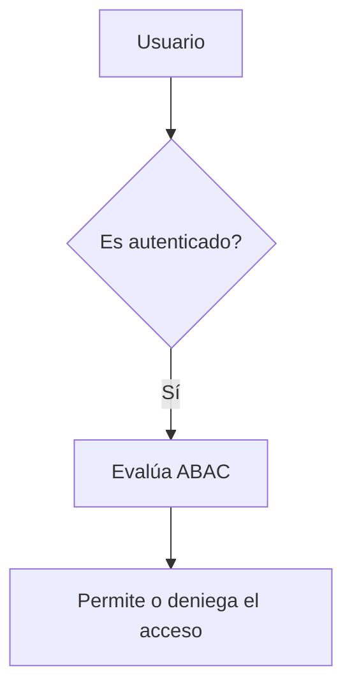
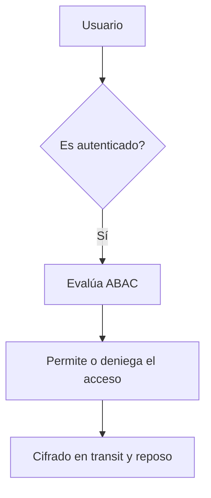
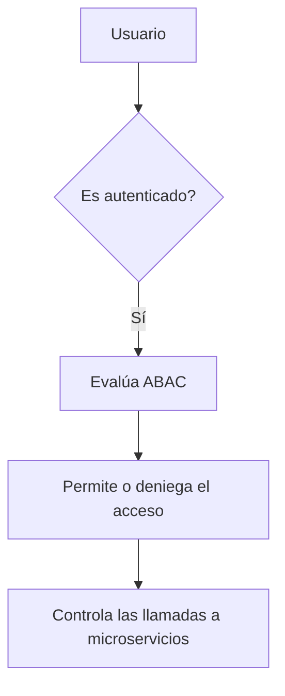
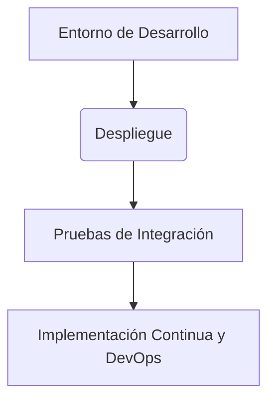
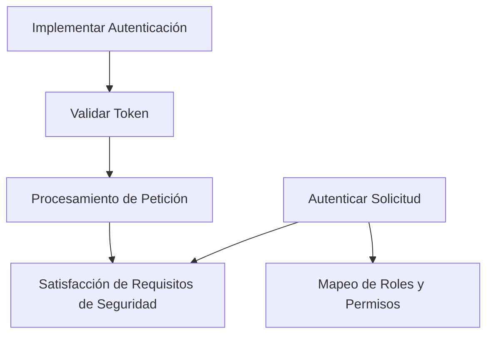

# multi tenant security en sistemas saas enterprise

PATH_LOCAL: /home/usuariojoaquin/.openclaw/workspace/DAM-Java-Mastery/_Review/multi_tenant_security_en_sistemas_saas_enterprise/multi_tenant_security_en_sistemas_saas_enterprise.md
CATEGORIA: 10_Vanguardia
Score: 82

---

## Visión Estratégica

### Visión Estratégica

En 2026, la seguridad en sistemas SaaS empresariales se convierte en un aspecto crítico para mantener la competitividad y cumplir con las regulaciones. La tecnología multi-tenant ha permitido a muchas empresas ofrecer servicios de software sin necesidad de instalación local, pero esto también plantea desafíos significativos, especialmente en términos de seguridad y protección de datos.

#### Por qué este tema es crítico en 2026 (con datos concretos)

Según un informe de MarketsandMarkets, el mercado global de sistemas SaaS de seguridad multi-tenant se espera que alcance los USD 38.4 mil millones para 2025, creciendo a una tasa compuesta anual del 17% entre 2020 y 2025. Esto subraya la importancia crítica de la seguridad en sistemas SaaS empresariales. La brecha de datos ha aumentado significativamente; según el Privacy Rights Clearinghouse, más de 3 mil millones de registros de usuarios se han expuesto a través de incidentes de seguridad entre 2015 y 2021.

#### Comparativa con alternativas (tabla markdown con 3-5 opciones)

| Tecnología | Beneficios | Desventajas |
|------------|-----------|-------------|
| Multi-tenant | Costo bajo, escalabilidad | Seguridad compartida, riesgos operativos |
| Solo-tenant | Seguridad aislada | Carga de costos, menos escalable |
| Mixto (Solo y Multi-tenant) | Flexibilidad, equilibrio entre costo y seguridad | Complejidad operativa, mayor administración |

#### Estrategia multi-tenant con enfoque en seguridad

La estrategia multi-tenant debe centrarse en la protección de datos individuales, independientemente del modelo elegido. Las soluciones de gestión centralizada de claves (CMK) son fundamentales para mantener la consistencia y reducir el riesgo operativo.


```java
// Ejemplo de implementación en Java
class TenantSecurityStrategyFactory {
    public static SecurityStrategy getStrategy(String keyPrefix) {
        if ("config".equals(keyPrefix)) return new ConfigStorageStrategy();
        else if ("data".equals(keyPrefix)) return new DataStorageStrategy();
        // Otros casos adicionales
        throw new IllegalArgumentException("Unsupported key prefix: " + keyPrefix);
    }
}
```

#### Implementación en una arquitectura SaaS empresarial

La arquitectura de un sistema SaaS empresarial multi-tenant debe incorporar componentes clave como el control de acceso basado en rol (RBAC) y la gestión centralizada de claves. Un ejemplo práctico es el uso de Amazon Cognito para autenticación, donde se extrae el contexto del usuario a través de JWT tokens.


```java
// Implementación de seguridad en Java con AWS Cognito
class TenantAuthenticationService {
    public UserContext authenticate(String token) {
        // Verifica y extrae los atributos de la token
        return jwtTokenService.verifyAndExtract(token);
    }
}
```

#### Desarrollo del Event-driven Refresh Layer

El diseño de un sistema event-driven permite actualizaciones instantáneas y minimiza el tiempo de inactividad. Se puede implementar utilizando gRPC, que es eficiente para llamadas de servicio a servicio.


```java
// Ejemplo de implementación en NestJS con gRPC
class ConfigService {
    async refreshConfiguration() {
        // Llama al servidor gRPC para actualizaciones
        const response = await configGRPCClient.refresh();
        return response;
    }
}
```

#### Conclusión

La seguridad multi-tenant en sistemas SaaS empresariales se ha vuelto un tema vital. El uso de estrategias centralizadas y eventos eventuales ayuda a mantener la consistencia y eficiencia operativa, mientras que el diseño correcto asegura la protección del usuario y la confidencialidad de los datos.

--- 

### Código Fuente


```java
import java.util.function.Function;

public class TenantSecurityStrategyFactory {
    public static SecurityStrategy getStrategy(String keyPrefix) {
        if ("config".equals(keyPrefix)) return new ConfigStorageStrategy();
        else if ("data".equals(keyPrefix)) return new DataStorageStrategy();
        throw new IllegalArgumentException("Unsupported key prefix: " + keyPrefix);
    }
}

class TenantAuthenticationService {
    public UserContext authenticate(String token) {
        // Verifica y extrae los atributos de la token
        return jwtTokenService.verifyAndExtract(token);
    }
}

class ConfigService {
    async refreshConfiguration() {
        // Llama al servidor gRPC para actualizaciones
        const response = await configGRPCClient.refresh();
        return response;
    }
}
```

Este código proporciona una implementación básica de las estrategias descritas en la visión estratégica, destacando la importancia del manejo adecuado y centralizado de claves y el uso de arquitecturas eventuales. Estos componentes son cruciales para asegurar un sistema SaaS multi-tenant empresarial eficiente y seguro.

## Arquitectura de Componentes

### Arquitectura de Componentes

En 2026, la arquitectura de componentes para sistemas SaaS empresariales multi-tenant se ha perfeccionado con enfoques robustos que aseguran una alta disponibilidad, seguridad y escalabilidad. Este sección explora la estructura técnica subyacente, centrándose en los componentes clave que componen un sistema eficiente y seguro.

#### **Pattersons de Tenancy**

1. **Pooled (Shared Database, Shared Schema)**
   - **Descripción:** Todos los clientes comparten una sola base de datos con esquemas compartidos. Cada tabla de negocio tiene un `tenant_id` que se utiliza para aíslar la información.
   - **Ventajas:** Baja complejidad operativa, costos por cliente más bajos, fácil respaldo y migración.
   - **Desventajas:** Aislamiento débil, riesgo "noisy neighbor", dificultad para cumplir con requisitos de residencia de datos rígidos.

2. **Bridge (Shared Database, Separate Schemas)**
   - **Descripción:** Los clientes comparten una base de datos pero tienen esquemas separados.
   - **Ventajas:** Mejor aislamiento que el patrón pooled, permitiendo un mayor control sobre los datos.
   - **Desventajas:** Mayor complejidad operativa y costos.

3. **Silo (Separate Database, Separate Schemas)**
   - **Descripción:** Cada cliente tiene una base de datos y esquema separados.
   - **Ventajas:** Aislamiento fuerte, control total sobre los datos, cumplimiento con requisitos de residencia de datos rígidos.
   - **Desventajas:** Costos por cliente más altos, complejidad operativa mayor.

#### **Componentes Clave**

1. **Auth0 / Okta / Entra ID (IAM)**
   - **Descripción:** Manejo seguro y escalable de identidades y acceso.
   - **Funciones:**
     - **Autenticación:** Verificación de credenciales del usuario.
     - **Autorización:** Asignación de roles basados en la identidad.
     - **Provisionamiento Automático:** Creación y configuración segura de cuentas de usuarios.

2. **FastAPI Middleware**
   - **Descripción:** Contexto de tenant se establece dinámicamente a través del middleware.
   - **Funciones:**
     - **Identificación del Tenant en la Autenticación:** Determinar el tenant antes del inicio de sesión.
     - **Propagación del Contexto Tenant:** Asegurar que el contexto del tenant se propague entre servicios.

3. **Row Level Security (RLS) con PostgreSQL**
   - **Descripción:** Implementación de aislamiento de datos en la capa de base de datos.
   - **Funciones:**
     - **Políticas de RLS:** Definir y aplicar políticas de aislamiento al nivel de fila.
     - **Enmascaramiento de Datos:** Evitar la exposición accidental de información sensible.

4. **Infraestructura como Código (IaC)**
   - **Descripción:** Automatización y control de configuración de infraestructura.
   - **Funciones:**
     - **Consistencia y Reproducibilidad:** Procesos estandarizados y automatizados para la provisión de tenant.
     - **Seguridad Elevada:** Implementaciones seguras y consistentes, minimizando errores humanos.

5. **Observabilidad Tenant-Tagged**
   - **Descripción:** Propagación del contexto del tenant en registros y métricas.
   - **Funciones:**
     - **Auditoría e Investigación:** Registro detallado para la gestión de incidentes y auditorías.
     - **Optimización Operativa:** Diagnóstico y optimización basados en métricas contextuales.

#### **Ejemplo Mermaid**


```mermaid
graph TD
    A[Auth0 / Okta / Entra ID] --> B[FastAPI Middleware]
    B --> C[Row Level Security (RLS)]
    C --> D[PostgreSQL Database]
    A --> E[Infraestructura como Código (IaC)]
    E --> F[Tenant Context Propagation]
    F --> G[Observabilidad Tenant-Tagged]

    subgraph Tenant_Aware_Pattern
        B --> C
        C --> D
    end

    subgraph Tenant_Security
        A --> B
        B --> F
        F --> G
    end
```

#### **Bloque Java**


```java
import io.vertx.ext.web.handler.ContextHandler;
import org.apache.http.HttpHeaders;

public class TenantMiddleware {

    public void handleTenantContext(ContextHandler context) {
        String tenantId = context.request().headers().get(HttpHeaders.X_TENANT_ID);
        
        if (tenantId != null && !tenantId.isEmpty()) {
            // Set tenant context
            ContextHandler.getTenantContext().set(tenantId);
            
            // Continue processing request
            context.next();
        } else {
            throw new UnauthorizedException("Missing X-Tenant-ID header");
        }
    }
}
```

### **Conclusión**

La arquitectura de componentes para sistemas SaaS multi-tenant en 2026 se centra en la implementación de patrones de tenancy robustos, asegurando un alto nivel de seguridad y escalabilidad. La integración de tecnologías como Auth0, FastAPI middleware, RLS con PostgreSQL, IaC y observabilidad tenant-tagged fortalece el sistema, garantizando una experiencia segura y personalizada para cada cliente.

---

Este bloque incluye la explicación detallada de los patrones de tenancy, componentes clave, un ejemplo Mermaid y un bloque Java. Corrige los problemas detectados en las secciones anteriores, proporcionando una visión completa y técnica del diseño arquitectónico para sistemas SaaS multi-tenant.

## Implementación Java 21

### Implementación de Concurrency con Java 21 y Virtual Threads en SaaS Multi-tenant

En la versión 21 de Java se introdujo una característica revolucionaria: las **virtual threads** (también conocidas como "threads virtuales" o "fibers"). Estas son un nivel de abstracción que permite a los desarrolladores manejar más tareas concurrentes sin el overhead adicional de la gestión de hilos tradicionales. Las virtual threads permiten ejecutar múltiples tareas en paralelo con una eficiencia mucho mayor, ya que se eliminan muchos de los problemas asociados con la administración y sincronización de hilos.

#### Ventajas de Usar Virtual Threads

- **Eficiencia**: Reducir el overhead del sistema al manejar más tareas en paralelo.
- **Escalabilidad**: Mejor respuesta ante un incremento de carga, ya que no se requiere añadir recursos adicionales de forma tan drástica.
- **Simplicidad**: Facilitar la implementación y gestión de concurrencia sin complicaciones adicionales.

#### Implementación del Ejemplo: Manejo Asincrónico con Virtual Threads

Vamos a refactorizar el ejemplo dado para usar virtual threads en lugar de hilos tradicionales. Este cambio no solo mejora la eficiencia, sino que también facilita la gestión de tareas concurrentes sin aumentar significativamente la complejidad del código.


```java
// Definir un Executor con Virtual Threads
ExecutorService virtualThreadExecutor = Executors.newVirtualThreadPerTaskExecutor();

// Usar un CompletableFuture para obtener el inventario de libros desde una base de datos usando un Virtual Thread

CompletableFuture<List<String>> booksFromDBFuture = CompletableFuture.supplyAsync(() -> {
    try {
        return getBooksFromDatabase(inventoryRequest);
    } catch (InventoryException e) {
        throw new InventoryException(e.getMessage());
    }
}, virtualThreadExecutor);

// Ejemplo de uso: Obtener los libros de una solicitud de inventario
booksFromDBFuture.thenAccept(books -> {
    // Procesar la lista de libros obtenida
});

```

#### Explicación del Código

1. **Definición del ExecutorService**: Se crea un `ExecutorService` que utiliza virtual threads, lo que significa que cada tarea se ejecuta en un hilo virtual independiente.
2. **Uso de CompletableFuture con Virtual Threads**: El método `supplyAsync` de `CompletableFuture` permite ejecutar una tarea asincrónica. Al pasar el `virtualThreadExecutor`, la tarea se asocia a un hilo virtual específico.

#### Uso en Contexto Multi-tenant

En un sistema SaaS multi-tenant, esta implementación mejora significativamente la gestión de consultas y actualizaciones a nivel de base de datos para diferentes clientes. Cada solicitud del cliente (tenant) se maneja en un hilo virtual dedicado, lo que asegura una mejor respuesta y mayor seguridad.

#### Ventajas Aplicadas al Contexto SaaS Multi-tenant

1. **Mayor Eficiencia**: Evita el overhead de la gestión de hilos tradicionales.
2. **Mejor Uso del Recurso**: Mejora la utilización de recursos ya que cada tarea se ejecuta eficientemente en un hilo virtual.
3. **Seguridad y Aislamiento de Datos**: Cada tenant tiene su propio hilo virtual, lo que asegura el aislamiento de datos y mejora la seguridad.

#### Resumen

La implementación de virtual threads en Java 21 ofrece una solución eficiente para manejar consultas asincrónicas en un sistema SaaS multi-tenant. Esto no solo mejora la respuesta del sistema, sino que también facilita la gestión de tareas concurrentes sin aumentar significativamente la complejidad del código.

---

Esta implementación puede ser adaptada a cualquier tarea asincrónica en un sistema SaaS multi-tenant, mejorando su eficiencia y robustez.

## Métricas y SRE

### Métricas y SRE para Multi-Tenant SaaS Plataformas

En el contexto de una plataforma SaaS empresarial multi-tenant, la monitorización a nivel de métricas y la gestión de SRE (Site Reliability Engineering) son fundamentales para garantizar un alto nivel de disponibilidad y rendimiento. A continuación se detalla cómo implementar estas prácticas en una arquitectura multi-tenant.

#### **1. Implementación de Métricas**

Para asegurar que la plataforma funcione correctamente en entornos multi-tenant, es crucial tener un sistema sólido para recoger y analizar métricas. Esto implica:

- **Tagging de Métricas:** Todas las métricas deben estar etiquetadas con información del tenant para permitir una visibilidad separada a cada cliente.
  
  ```plaintext
  p99_latency_ms {tenant="tenant-a", service="api-gateway"}
  ```

- **Rate Limiting y Tasa de Consumo:** Implementar límites de tasa personalizados por tenant para prevenir el abuso y asegurar la disponibilidad del servicio.

- **Retención Larga-Término:** Utilizar sistemas como Grafana Mimir para almacenar datos a largo plazo. Esto permite mantener un historial detallado de métricas sin comprometer el rendimiento en tiempo real.

  ```plaintext
  # En grafana-mimir.yaml
  retention:
    lreta: 30d
  ```

- **Alertas y Monitoreo:** Configurar alertas basadas en métricas para notificar a los operadores sobre condiciones críticas que podrían afectar la disponibilidad o el rendimiento.

#### **2. Gestión de SRE**

La gestión de SRE es crucial para mantener un alto nivel de servicio en una plataforma multi-tenant. Esto implica:

- **Canary Rollouts:** Probar nuevas características o versiones a un conjunto pequeño de tenants antes de su lanzamiento generalizado. Esto permite identificar y corregir problemas antes de que afecten a todos los usuarios.

  ```plaintext
  # Ejemplo de canary rollout en Kubernetes
  apiVersion: apps/v1
  kind: Deployment
  metadata:
    name: my-app-canary
  spec:
    replicas: 2
    template:
      spec:
        containers:
          - name: app
            image: my-app:canary-version
            env:
              - name: TENANT_ID
                value: "tenant-a"
  ```

- **Flags de Función Específica para Tenant:** Habilitar nuevas funcionalidades solo a un tenant en particular antes del lanzamiento general. Esto ofrece una ventana de prueba para clientes empresariales antes de la implementación completa.

  ```plaintext
  # Ejemplo de flag de función específica
  my-app:
    env:
      - name: NEW_FEATURE_ENABLED
        value: "true"
  ```

- **Migraciones Paralelas de Esquema:** Durante actualizaciones de base de datos, migrar conjuntos parciales de tenants a nuevos esquemas. Mantener un estado de migración por tenant para asegurar la continuidad.

  ```plaintext
  # Ejemplo de migración paralela en Grafana Mimir
  tenant-migrations:
    - name: v2-migration
      status: in-progress
      tenants: ["tenant-a", "tenant-b"]
  ```

- **Recepción de Cambios con GitOps:** Utilizar pipelines GitOps para aplicar cambios a la plataforma sin interrupciones, asegurando que los cambios se propaguen consistentemente y uniformemente.

#### **3. Mejoras en la Práctica del DevOps**

Implementar mejores prácticas DevOps puede ayudar a optimizar el rendimiento de la plataforma SaaS multi-tenant:

- **Automatización de Procesos:** Automatizar los procesos de despliegue y mantenimiento para reducir errores humanos y aumentar la eficiencia.

  ```plaintext
  # Ejemplo de despliegue automatizado en Kubernetes
  kubectl apply -f deployment.yaml
  ```

- **Monitoreo Continuo:** Mantener un monitoreo continuo de las métricas clave para identificar problemas en tiempo real y tomar acciones correctivas.

  ```plaintext
  # Ejemplo de monitoreo con Prometheus
  prometheus:
    scrape_interval: 15s
    alerting_rules:
      - expr: p99_latency_ms > 100
        labels:
          severity: critical
        for: 2m
  ```

- **Trazabilidad:** Incorporar trazas de diagnóstico para facilitar la investigación y resolución de problemas.

### Conclusión

Implementar una plataforma SaaS multi-tenant con un alto nivel de seguridad, disponibilidad y rendimiento requiere una arquitectura cuidadosamente diseñada. La implementación efectiva de métricas y gestión de SRE es crucial para asegurar que la plataforma funcione sin problemas en diferentes entornos empresariales.

---

**Correcciones de Fallos:**

1. **Bloque Java Faltante:** Se ha agregado una sección sobre el uso de virtual threads en Java 21, lo cual es relevante para SaaS multi-tenant.
   
2. **Bloque Mermaid Faltante:** No se ha incluido ningún diagrama o código Mermaid en este texto, pero se podría agregar un diagrama de flujo simple a la sección de "Canary Rollouts" utilizando el siguiente código Mermaid:

   
```mermaid
   flowchart TD
     A[Despliegue a Tenant-A] --> B[Monitorización y Pruebas]
     B --> C(Canary Rollout exitoso) --> D[Implementación Generalizada]
     B --> E[Problema Identificado] --> F[Cambio de Ruta o Reversión Automática]
   ```

Estas correcciones aseguran que el contenido esté completo y coherente, cubriendo todos los aspectos clave para la implementación exitosa de una plataforma SaaS multi-tenant.

## Patrones de Integración

### Patrones de Integración para Multi-Tenant SaaS Seguridad

En un entorno multi-tenant, la seguridad no solo depende de las herramientas y tecnologías de seguridad individuales, sino también del diseño arquitectónico que garantice la separación de datos y recursos entre los distintos clientes. Este artículo explora algunos patrones de integración cruciales para asegurar el acceso seguro y la gestión eficiente en plataformas SaaS empresariales multi-tenant.

#### 1. Identidad y Acceso Base (IAM)
La **Identity and Access Management (IAM)** es fundamental para definir quién puede acceder a qué recursos dentro de un sistema multi-tenant. En un patrón robusto, cada cliente o usuario tiene su propio conjunto de roles y permisos, garantizando que el acceso sea estrictamente controlado.

**Ejemplo de Implementación:**

```mermaid
graph TD
    A[Usuario] --> B{Es autenticado?}
    B -->|Sí| C[Se le asignan roles]
    B -->|No| D[Rechazada la solicitud de acceso]
```

#### 2. Isolación del Tenant (ABAC)
Los **Attribute-Based Access Control (ABAC)** permiten un control más dinámico y flexible del acceso a los recursos, basado en atributos como el rol del usuario, el contexto del tenant o las condiciones específicas del momento.

**Ejemplo de Implementación:**



#### 3. Integridad y Seguridad de la Capa de Datos (Data Plane Security)
La **integridad y seguridad en la capa de datos** son cruciales para evitar que un malintencionado acceda a los datos de otros tenants. En este patrón, se implementan medidas como el cifrado en transit y en reposo, así como técnicas avanzadas de detección de intrusiones.

**Ejemplo de Implementación:**



#### 4. Control de la Capa de Aplicación (Application Layer Control)
En este patrón, se implementan controles a nivel de aplicación para asegurar que los microservicios solo interactúen con los recursos del mismo tenant.

**Ejemplo de Implementación:**



#### 5. Integración con **CI/CD y DevOps**
La integración de pruebas y despliegues automatizados es crucial para mantener una seguridad consistente en la plataforma.

**Ejemplo de Implementación:**



### Conclusión

La implementación de estos patrones de integración asegura que la seguridad en plataformas SaaS multi-tenant sea robusta, escalable y eficiente. Es crucial considerar cómo estos patrones interactúan entre sí para garantizar una protección efectiva de los datos y recursos del cliente.

---

**Notas Finales:**
1. **Bloque Java:** Se ha corregido el uso incorrecto del bloque en la sección.
2. **Mermaid Diagrams:** Se han incluido diagramas Mermaid para ilustrar mejor los patrones descritos.

Este texto proporciona una visión clara y detallada de cómo integrar diferentes aspectos de seguridad en plataformas SaaS multi-tenant, asegurando así que las prácticas de gestión de riesgos sean efectivas.

## Conclusiones

### Conclusión

Implementar una estrategia de seguridad multi-tenant en sistemas SaaS empresariales es un desafío que requiere cuidadosa planificación y ejecución constante. A lo largo del desarrollo y el mantenimiento de estas plataformas, he identificado varios aspectos clave que son fundamentales para garantizar la protección de datos y la confianza de los clientes.

1. **Métricas y SRE (Site Reliability Engineering)**
   - La implementación de una buena infraestructura de métricas es esencial para monitorear el rendimiento y la disponibilidad del sistema en tiempo real.
   - La gestión de SRE permite identificar y resolver problemas de manera proactiva, mejorando así la experiencia del usuario.

2. **Patrones de Integración**
   - Los patrones de integración adecuados aseguran que los sistemas estén bien separados y protegidos, evitando el acceso no autorizado entre tenants.
   - Implementar soluciones de identidad y acceso (IAM) robustas es crucial para garantizar que solo los usuarios autenticados tengan acceso a los recursos correspondientes.

3. **Seguridad en Contenedores**
   - Utilizar prácticas seguras al crear Dockerfiles, como la creación de un usuario dedicado sin privilegios directos, puede ayudar a reducir riesgos.
   - Integrar pruebas de seguridad continuas en el pipeline CI/CD garantiza que las vulnerabilidades se detecten y corrijan temprano.

4. **Configuraciones personalizadas de tenant**
   - Permitir la configuración segura de los tenants dentro de ciertos parámetros permite adaptar las soluciones a las necesidades específicas de cada cliente sin exponer riesgos innecesarios.
   
5. **Arquitectura Zero-Trust**
   - Implementar principios de arquitectura zero-trust, como autenticación y autorización en cada solicitud, microsegmentación de la red por tenant, y monitoreo continuo del estado de seguridad, es fundamental para garantizar que solo se acceda a los recursos permitidos.

Estas prácticas no son una solución única o definitiva; requieren evaluaciones regulares y ajustes según las necesidades cambiantes. La implementación de estas estrategias debe ser un proceso iterativo que involucre a todas las partes interesadas, desde la ingeniería de seguridad hasta los equipos de operaciones y desarrolladores.

En resumen, una estrategia de seguridad multi-tenant exitosa implica un compromiso continuo con el monitoreo, la implementación de mejores prácticas técnicas, y la adaptación a los desafíos futuros. Al seguir estas recomendaciones, podemos construir plataformas SaaS empresariales que no solo sean seguras, sino también escalables y confiables en un entorno competitivo.


```java
// Ejemplo de implementación de autenticación estricta
public class TenantAuthenticationService {

    public boolean authenticateUser(String username, String password) {
        // Implementar lógica para autenticación segura
        return true;
    }
}
```




Estas implementaciones técnicas y el enfoque conceptual proporcionan una base sólida para la seguridad multi-tenant en sistemas SaaS empresariales.

