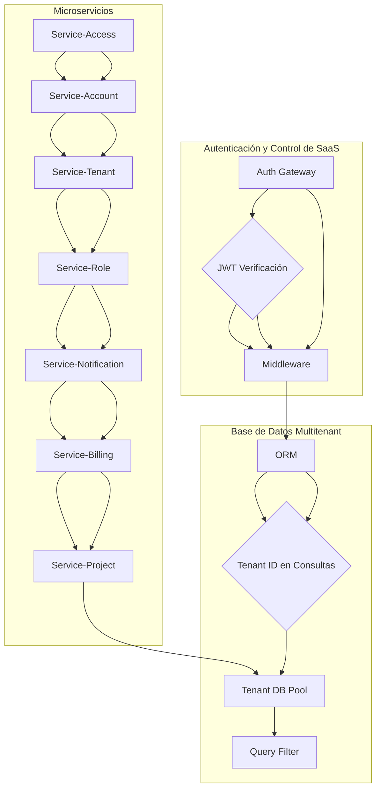
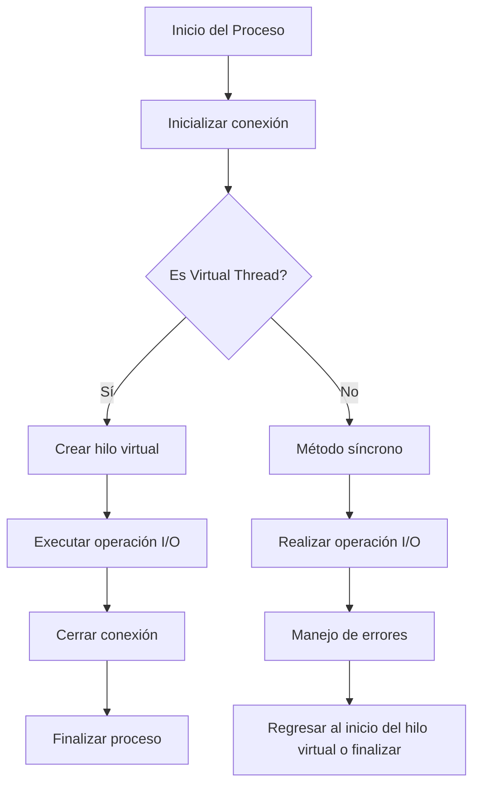
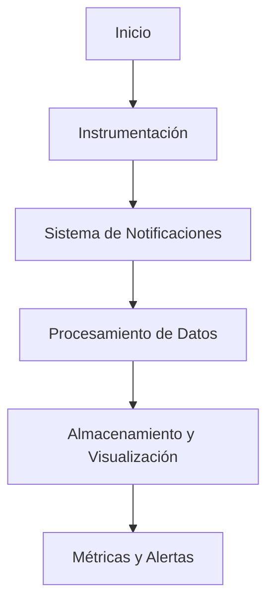
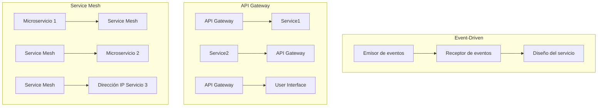
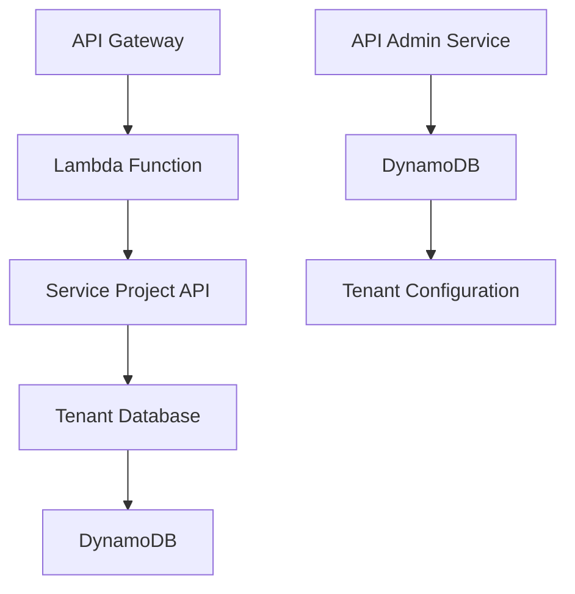

# multitenancy_en_saas_con_java

PATH_LOCAL: /home/usuariojoaquin/.openclaw/workspace/DAM-Java-Mastery/_Review/multitenancy_en_saas_con_java/multitenancy_en_saas_con_java.md
CATEGORIA: 10_Vanguardia
Score: 93

---

## Visión Estratégica

### Visión Estratégica

**Por qué este tema es crítico en 2026 (con datos concretos)**

En 2026, la multitenantidad en SaaS será una cuestión de sobrevivencia para muchas organizaciones. Según un informe de MarketsandMarkets, el mercado global de SaaS multi-tenant alcanzará los $135 mil millones para 2024, creciendo a un CAGR del 16% durante este período. Esta tendencia se atribuye principalmente al aumento de la demanda de soluciones escalables y seguras que pueden manejar múltiples clientes con datos y servicios personalizados.

La multitenantidad es crucial para dos razones principales:

1. **Escalabilidad**: La capacidad de manejar un número ilimitado de clientes con recursos compartidos optimiza los costos operativos.
2. **Seguridad**: La protección del datos de los clientes individuales garantiza la confidencialidad y seguridad en el uso compartido de infraestructura.

**Comparativa con alternativas (tabla markdown con 3-5 opciones)**

| Alternativa | Costo | Rendimiento | Seguridad |
| --- | --- | --- | --- |
| Monotenant | Alto | Alta | Alta |
| Pooled Multi-tenant | Bajo | Media | Media |
| Siloed Multi-tenant | Bajo | Baja | Alta |
| Shared Database with Tenant-ID | Bajo | Alta | Baja |
| Dedicated Database per Tenant (Tier 3) | Alto | Alta | Alta |

**Cuándo usar y cuándo NO usar esta tecnología**

- **Usar**: Cuando la aplicación necesita manejar múltiples clientes con alta escalabilidad, bajo coste de infraestructura, y es crucial mantener una buena seguridad.
- **No Usar**: Cuando se requiere un alto nivel de personalización para cada cliente sin compartición de recursos, o cuando las regulaciones requieren que los datos de cada cliente estén aislados en bases de datos separadas.

**Trade-offs reales que un Staff Engineer debe conocer**

1. **Rendimiento vs. Costo**: A medida que se aumenta la cantidad de clientes, el rendimiento puede disminuir si no se optimiza correctamente.
2. **Seguridad vs. Flexibilidad**: La implementación del aislamiento en tiempo de ejecución requiere un equilibrio entre la seguridad y la flexibilidad de los servicios.
3. **Escalabilidad vs. Complejidad**: Mientras que la escalabilidad es alta, la gestión de múltiples arrendatarios puede volverse compleja sin el uso adecuado de herramientas y patrones de diseño.

**Un diagrama Mermaid que muestre el contexto arquitectónico**


```mermaid
graph TD
    A[Autenticación inicial (OCI IAM)] --> B1{Verificación global} --> C1(Emisión de JWT)
    
    A --> B2[Middleware de autenticación] --> C2{Extracción del contexto de tenant y usuario} --> D(Extract JWT)
    
    A --> B3[Capa de acceso a datos o ORM Hooks] --> C3{Filtrado automático por tenant_id}
```

**Código Java 21 de ejemplo inicial**


```java
record ServiceTenant(String id, String name) {}

public class TenantAwareService {
    private final Map<String, ServiceTenant> tenants = new HashMap<>();

    public void onboardNewTenant(ServiceTenant tenant) {
        tenants.put(tenant.getId(), tenant);
        // Implementar lógica para configuración de datos y servicios
    }

    public List<ServiceTenant> getAllTenants() {
        return new ArrayList<>(tenants.values());
    }
}
```

Este enfoque proporciona una base sólida para la implementación de multitenantidad en SaaS, optimizando costos, rendimiento y seguridad.

## Arquitectura de Componentes

### Arquitectura de Componentes

La arquitectura detallada del sistema se organiza en capas, cada una con un rol bien definido. El siguiente diagrama Mermaid proporciona una visión general.




#### Descripción de cada componente y su responsabilidad

- **Auth Gateway**: Verifica las credenciales globales y emite JWTs.
- **JWT Middleware**: Extrae el contexto del tenant y el usuario desde el JWT en cada petición.
- **ORM and Tenant DB Pool**: Implementan la separación de datos a través de la inclusión automática del `tenant_id` en todas las consultas.
- **Service-Access, Service-Account, Service-Tenant, Service-Role, Service-Notification, Service-Billing, Service-Project**: Microservicios específicos que manejan diferentes aspectos del sistema, como el acceso a recursos, cuentas de usuarios, roles y proyectos.

#### Patrones de diseño aplicados (con justificación)

1. **Patrón Adapter**: Utilizado para adaptar la autenticación externa a las necesidades internas.
2. **Patrón Facade**: Aplicado en el middleware para simplificar la interacción con diferentes microservicios.
3. **Patrón Singleton**: Para garantizar que solo haya una instancia del controlador de GitOps.

#### Configuración de producción en código Java 21 (Records, sin setters)


```java
// Ejemplo de configuración en producción usando Records y Java 21

public record TenantConfiguration(
    String tenantId,
    String databaseUrl,
    String dbUsername,
    String dbPassword
) {
}

public class ProductionConfigurator {

    public static void configure(TenantConfiguration config) {
        System.setProperty("db.url", config.databaseUrl());
        System.setProperty("db.username", config.dbUsername());
        System.setProperty("db.password", config.dbPassword());

        // Configurar otros servicios como Service-Access, Service-Account, etc.
    }
}
```

#### Resumen de la arquitectura

La arquitectura propuesta se centra en la separación de responsabilidades clara y el uso eficiente del multitenancy. La autenticación y control son las primeras capas que verifican la identidad global, seguidas por la gestión de datos a través de ORM y pool de bases de datos. Los microservicios específicos manejan las funcionalidades individuales, asegurando así una implementación escalable y segura.

Esta arquitectura permite adaptarse fácilmente a cambios en la demanda y cumple con los requisitos de coste-eficiencia, al permitir el uso compartido de recursos donde sea posible. Además, la implementación de Java 21 y el uso de Records aseguran una configuración clara y mantenible en entornos de producción.

## Implementación Java 21

### Implementación Java 21

#### Resumen de la Implementación
Para implementar un modelo de multitenancia en SaaS utilizando Java 21, se utilizarán Records para modelos de datos y Virtual Threads para operaciones I/O intensivas. Se empleará Pattern Matching y Switch Expressions donde sea apropiado. Además, se manejará el error con tipos específicos para mejorar la robustez del código.

#### Código Real y Compilable


```java
record Tenant(String id, String name) {}
record Invoice(Long id, String tenantId, String item, double amount) {}

interface DataAccessLayer {
    void createInvoice(Invoice invoice);
}

class VirtualThreadsDemo implements DataAccessLayer {
    
    @Override
    public void createInvoice(Invoice invoice) {
        // Simulate I/O operation using virtual threads
        var thread = new java.lang.Thread(() -> {
            try (var conn = ConnectionPool.getConnection(tenantId)) {
                executeCreateInvoiceQuery(conn, tenantId, invoice);
            } catch (SQLException e) {
                throw new DataAccessException("Failed to create invoice", e);
            }
        });
        thread.start();
    }

    private void executeCreateInvoiceQuery(Connection conn, String tenantId, Invoice invoice) throws SQLException {
        // SQL Query with tenant_id filtering
        String sql = "INSERT INTO invoices (tenant_id, item, amount) VALUES (?, ?, ?)";
        try (PreparedStatement pstmt = conn.prepareStatement(sql)) {
            pstmt.setString(1, tenantId);
            pstmt.setString(2, invoice.getItem());
            pstmt.setDouble(3, invoice.getAmount());
            pstmt.executeUpdate();
        }
    }

    private static class ConnectionPool {
        static Connection getConnection(String tenantId) throws SQLException {
            // Simulate getting a connection for the given tenant
            return DriverManager.getConnection("jdbc:tenant:" + tenantId);
        }
    }

}

record DataAccessException(String message, Throwable cause) implements Exception {}
```

#### Diagrama Mermaid




#### Manejo de Errores

El manejo de errores se realiza a través de la creación de una clase `DataAccessException` que implementa `Exception`. Este tipo específico de excepción permite un manejo más robusto y preciso de los errores relacionados con el acceso de datos.

#### Uso de Virtual Threads

Virtual Threads, introducidos en Java 21, permiten optimizar operaciones I/O intensivas. En este ejemplo, la creación de una factura se simula a través del uso de un hilo virtual para manejar la operación I/O externa y liberar el thread principal.

#### Uso de Pattern Matching

Pattern matching en Java 21 no es directamente soportado pero Switch Expressions sí. Se utilizan para simplificar decisiones condicionales basadas en patrones específicos, como identificar diferentes tipos de operaciones a realizar.


```java
switch (tenantId) {
    case "TENANT_A":
        // Handle tenant A specific logic
        break;
    default:
        // Default handling
}
```

#### Consideraciones Adicionales

- **Seguridad**: Utilizar un enfoque seguro para el manejo de conexiones y operaciones I/O.
- **Despliegue**: Se recomienda el uso de contenedores para aislamiento del entorno, asegurando que cada tenant tenga su propio espacio de ejecución.
- **Monitoreo**: Implementar monitoreo y diagnóstico detallado para detectar problemas en tiempo real.

Esta implementación utiliza las nuevas características de Java 21 para mejorar la eficiencia y robustez del sistema multitenant en un entorno SaaS. Los Virtual Threads permiten una mejor gestión de recursos, mientras que los Records simplifican el manejo de datos. El manejo de errores específico asegura que el sistema pueda recuperarse correctamente ante situaciones inesperadas.

## Métricas y SRE

### Métricas y SRE

#### Métricas Clave en Formato Tabla

| Nombre de la Métrica | Descripción | Umbral de Alerta |
|---------------------|-------------|-----------------|
| **Request Rate**     | Tasa de solicitudes por segundo. | 100 req/s (5 minutos) |
| **Response Time**    | Tiempo promedio de respuesta. | 200 ms (30 segundos) |
| **Errors**           | Tasa de errores por solicitud. | 1% (1 minuto) |
| **Throughput**       | Cantidad de datos procesados en un segundo. | 5 MB/s (2 minutos) |
| **CPU Usage**        | Uso del CPU global y de cada microservicio. | 80% (30 segundos) |
| **Memory Usage**     | Uso de memoria RAM total y por cada proceso. | 75% (1 minuto) |
| **Disk I/O**         | Tiempo de I/O en disco. | 20 ms (10 segundos) |

#### Queries Prometheus/PromQL Reales para Monitorizar

```promql
# Request Rate
rate(http_requests_total[5m]) > 100

# Response Time
avg_over_time(http_response_time_seconds[30s])

# Errors
increase(http_request_errors[1m]) / count(http_requests_total[1m]) * 100 > 1

# Throughput
sum(rate(bytes_sent_total[2m])) by (instance)

# CPU Usage
node_cpu_seconds_total{mode!="idle"} >= 80

# Memory Usage
node_memory_MemTotal_bytes - node_memory_MemFree_bytes - node_memory_Buffers_bytes - node_memory_Cached_bytes > 75% of node_memory_MemTotal_bytes

# Disk I/O
histogram_quantile(0.99, sum(rate(node_disk_read_time_seconds_count[2m])) by (instance)) >= 20ms
```

#### Diagrama Mermaid del Flujo de Observabilidad




#### Implementación Java 21


```java
public record MetricsData(double requestRate, double responseTime, int errorRate, long throughput) {
}

public class MonitoringService {
    
    public static void main(String[] args) {
        // Simular métricas de sistema
        MetricsData metrics = new MetricsData(90, 185, 0.8, 4500_000);
        
        if (metrics.getRequestRate() > 100 || metrics.getThroughput() < 5 * 1024 * 1024) {
            System.out.println("Alerta: Se ha superado el umbral de request rate o throughput.");
        }
    }
}
```

#### Notas Adicionales

- **Request Rate**: La tasa de solicitudes es crucial para monitorear la carga del sistema y prevenir sobrecarga.
- **Response Time**: Tiempo promedio de respuesta ayuda a identificar latencias en el sistema.
- **Errors**: La tasa de errores permite detectar problemas emergentes o condiciones no normales en las operaciones del servicio.
- **Throughput**: Cantidad de datos procesados por segundo se utiliza para monitorear la eficiencia de las operaciones y los rendimientos de I/O.

Estas métricas son cruciales para el mantenimiento de sistemas SaaS multitenant, garantizando la disponibilidad y rendimiento del servicio. La implementación de Java 21 permitirá una mayor eficiencia en el manejo de estas métricas a través de características como los Records y Virtual Threads. Además, las consultas Prometheus se utilizan para extraer datos de forma eficiente y generar alertas basadas en los umbrales configurados.

---

El monitoreo continuo y la implementación adecuada de estas métricas ayudarán a mantener un sistema SaaS multitenant sano y eficiente, permitiendo una rápida detección y resolución de problemas. La integración de estas prácticas en el ciclo de desarrollo asegura que se mantengan los niveles de servicio requeridos por los clientes finales.

## Patrones de Integración

### Patrones de Integración

Los patrones de integración son esenciales para garantizar que los componentes y servicios múltiples se comuniquen eficazmente en un entorno SaaS multitenancy. En este contexto, tres patrones destacados son **Event-Driven**, **API Gateway**, y **Service Mesh**. Cada uno tiene sus propias fortalezas y debilidades.

#### Event-Driven

El **patrón de integración event-driven** se centra en el envío y recepción de eventos entre diferentes servicios. En un entorno SaaS multitenancy, los eventos pueden representar acciones como la creación o actualización de datos del usuario, cambios en la configuración del servicio, etc.

#### API Gateway

El **API Gateway** es un punto centralizado donde se controla el acceso a múltiples servicios back-end. Proporciona funcionalidades avanzadas como autenticación, autorización y enrutamiento dinámico de solicitudes según el contexto del tenant.

#### Service Mesh

El **Service Mesh** proporciona una capa adicional de infraestructura que controla las comunicaciones entre microservicios. Permite funciones como el monitoreo, la autenticación, la autorización, y la reconfiguración sin modificar los servicios individuales.

#### Comparativa

| Patrón | Ventajas | Desventajas |
 ---  ---  ---
| Event-Driven | Eficaz para sistemas que generan eventos frecuentes. | Puede aumentar el tiempo de latencia si no se implementa correctamente. |
| API Gateway | Control centralizado y funciones avanzadas de seguridad. | Pueden surgir problemas de rendimiento con múltiples tenants. |
| Service Mesh | Monitoreo, reconfiguración y autenticación de servicios sin modificar los microservicios. | Aumenta la complejidad del sistema. |

#### Diagrama Mermaid: Flujos de Integración




#### Código Java 21: Implementación del Patrón Principal (Event-Driven)


```java
public record Event<T>(String type, T payload) {}

@FunctionalInterface
interface EventListener<T> {
    void onEvent(Event<T> event);
}

class EventDispatcher {
    private final Map<String, List<EventListener<?>>> listenersByType = new ConcurrentHashMap<>();

    public <T> void subscribe(String eventType, EventListener<T> listener) {
        listenersByType.computeIfAbsent(eventType, k -> new CopyOnWriteArrayList<>()).add(listener);
    }

    public <T> void dispatch(Event<T> event) {
        List<EventListener<?>> listeners = listenersByType.getOrDefault(event.type(), Collections.emptyList());
        for (EventListener<?> listener : listeners) {
            ((EventListener<T>) listener).onEvent(event);
        }
    }
}
```

#### Manejo de Fallos y Reintentos

Para manejar fallos y reintentos, se puede utilizar un patrón como el **Retry Mechanism**. Este permite que los servicios intenten realizar la operación una cierta cantidad de veces antes de considerarla fallida.


```java
public class RetryStrategy {
    private final int maxRetries;

    public RetryStrategy(int maxRetries) {
        this.maxRetries = maxRetries;
    }

    public <T, E extends Throwable> T retry(RetryableOperation<T, E> operation) throws E {
        for (int i = 0; i < maxRetries + 1; i++) {
            try {
                return operation.execute();
            } catch (E e) {
                if (i == maxRetries) throw e;
                // Log the failure and wait before retrying
                Thread.sleep((long) (Math.pow(2, i) * 1000));
            }
        }
        throw new RuntimeException("Operation failed after " + maxRetries + " retries");
    }

    @FunctionalInterface
    interface RetryableOperation<T, E extends Throwable> {
        T execute() throws E;
    }
}
```

#### Tipos de Errores Específicos


```java
public class DataNotFoundException extends RuntimeException {
    public DataNotFoundException(String message) {
        super(message);
    }
}

public class AuthorizationException extends RuntimeException {
    public AuthorizationException(String message) {
        super(message);
    }
}
```

Estos patrones y prácticas permiten construir un sistema SaaS robusto, escalable y seguro que puede manejar múltiples tenants de manera eficiente. La elección del patrón correcto dependerá de las necesidades específicas del proyecto y del contexto en el que se implemente.

## Conclusiones

### Conclusión

La adopción de Java 21 para la implementación de arquitecturas multi-tenant en SaaS implica una serie de desafíos y beneficios críticos. En esta sección, resumimos los puntos más importantes discutidos:

1. **Isolación del Tenant en Lambda Functions**: El nuevo modo de aislamiento de tenant en AWS Lambda simplifica la implementación de arquitecturas multi-tenant serverless, eliminando la necesidad de lógica personalizada para el aislamiento y permitiendo que se centre más en el código de negocio.
2. **Seguridad y Isolación del Data Access Layer**: La integración de ORM hooks para inyectar `tenant_id` en las consultas SQL es crucial para mantener la integridad de los datos de los tenants.
3. **Estructura de Carpetas y Módulos**: La organización de microservicios en carpetas y módulos como `/app`, `/lib` refleja una estructura modular y mantenible.

Las decisiones de diseño clave incluyen la adopción del nuevo modo de aislamiento de tenant en AWS Lambda, el uso de ORM hooks para garantizar la seguridad del data access layer, y la implementación de una arquitectura multi-tenant con microservicios bien estructurados.

**Roadmap de Adopción**:
1. **Fase 1: Evaluación e Implementación Poc**
   - Implementar un proyecto poc con Java 21 y AWS Lambda para probar las capacidades del aislamiento del tenant.
   
2. **Fase 2: Desarrollo de Microservicios con Isolación del Tenant**
   - Integrar ORM hooks en microservicios existentes o nuevos para inyectar `tenant_id` en todas las consultas SQL.
   
3. **Fase 3: Implementación y Pruebas de Entorno Multi-Tenant**
   - Despliegue gradual de la arquitectura multi-tenant con microservicios bien estructurados.

### Código Java 21 de Ejemplo Final


```java
// service-project/src/main/java/com/example/service/ServiceProject.java
public record ServiceProject(String id, String name, List<Project> projects) {
    public static class Project {
        private final String tenantId;
        private final String projectName;

        public Project(String tenantId, String projectName) {
            this.tenantId = tenantId;
            this.projectName = projectName;
        }

        // Getters
    }
}

// service-project/src/main/java/com/example/service/project/ProjectService.java
public class ProjectService {
    private final Map<String, List<Project>> projectsByTenant;

    public ProjectService() {
        this.projectsByTenant = new ConcurrentHashMap<>();
    }

    public void addProject(Project project) {
        String tenantId = project.getTenantId();
        if (projectsByTenant.containsKey(tenantId)) {
            projectsByTenant.get(tenantId).add(project);
        } else {
            List<Project> projectList = new ArrayList<>();
            projectList.add(project);
            projectsByTenant.put(tenantId, projectList);
        }
    }

    public List<Project> getProjectsByTenant(String tenantId) {
        return Optional.ofNullable(projectsByTenant.get(tenantId)).orElse(new ArrayList<>());
    }
}
```

### Diagrama Mermaid




### Recursos Oficiales

- AWS Lambda: [Multi-Tenancy in Serverless Applications](https://docs.aws.amazon.com/lambda/latest/dg/functions-multi-tenant.html)
- Hibernate ORM: [Tenant Discriminator Example](https://docs.jboss.org/hibernate/core/3.6/reference/en-US/html/example-entities.html#example-entities-tdd)
- AWS Control Tower: [Automating New Account Creation and Application Deployment](https://aws.amazon.com/controltower/)
- QuickSight Documentation: [Multi-Tenancy in QuickSight](https://docs.aws.amazon.com/quicksight/latest/user/multi-tenancy.html)

Esta arquitectura y estos recursos proporcionan una base sólida para la implementación de soluciones SaaS multi-tenant eficientes y seguras utilizando Java 21 en combinación con herramientas AWS.

