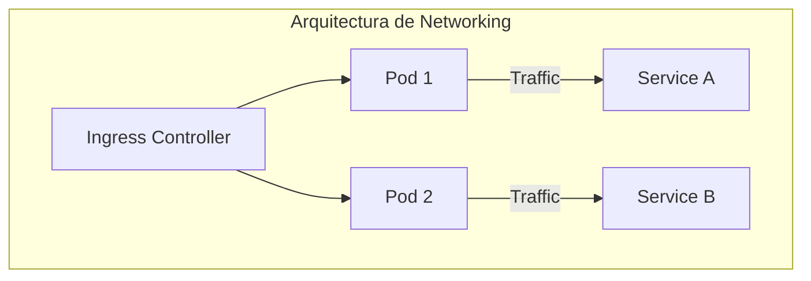
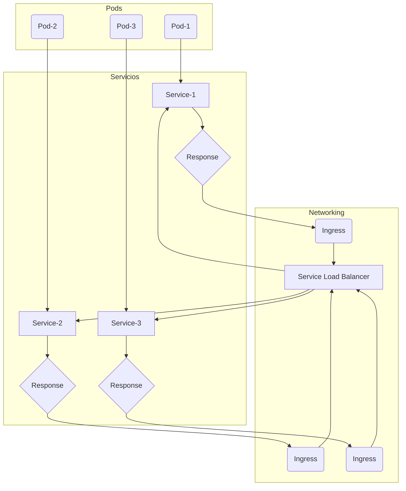
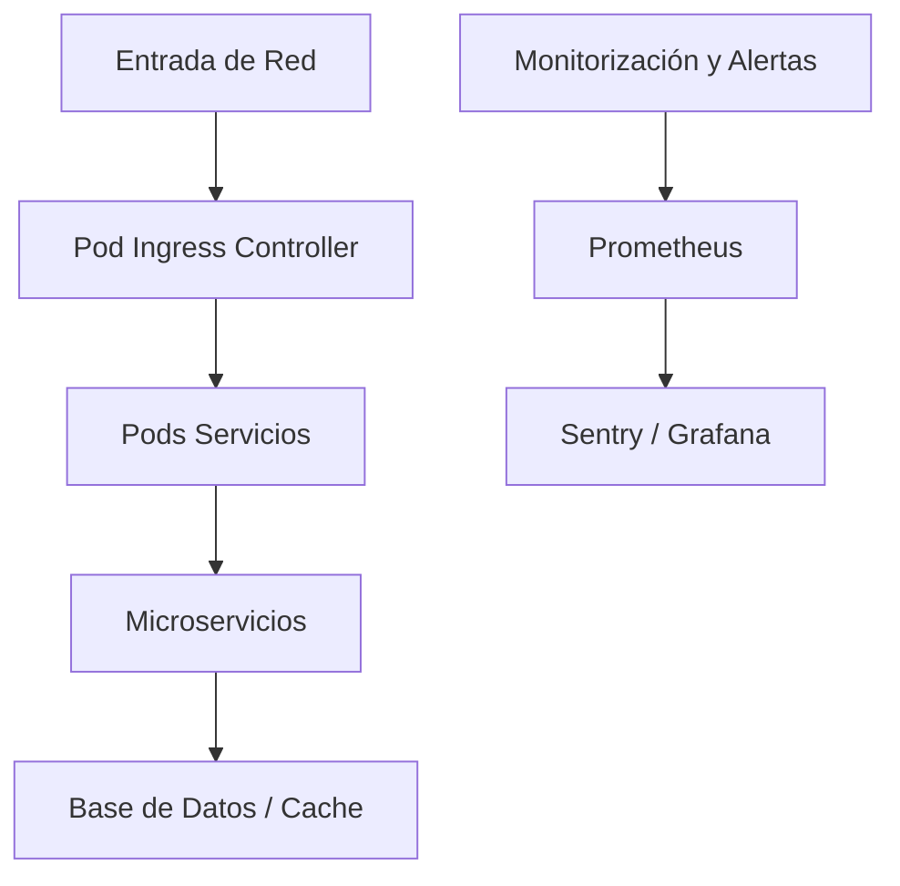
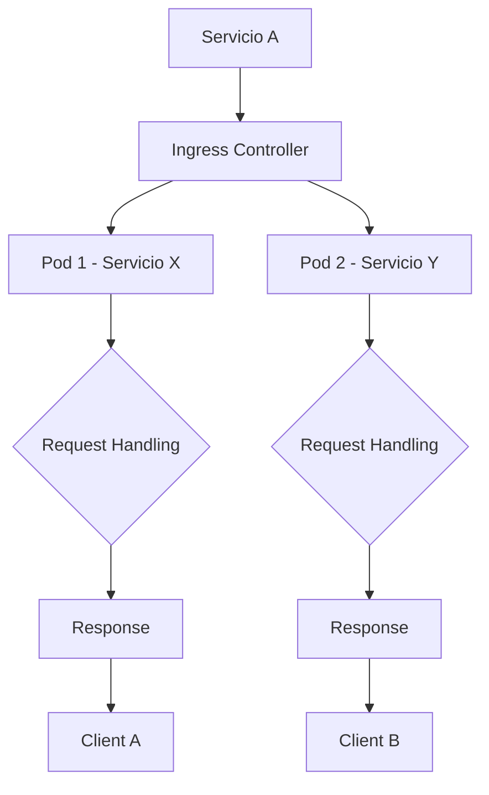
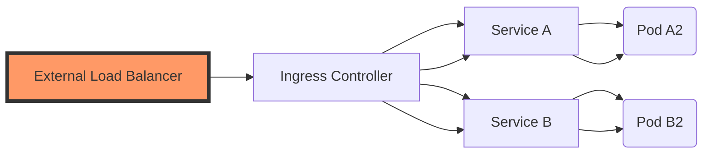
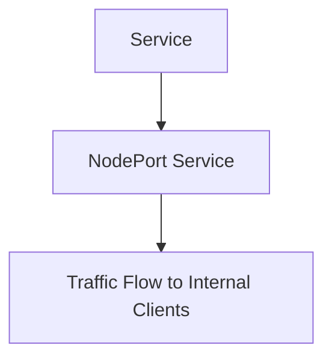
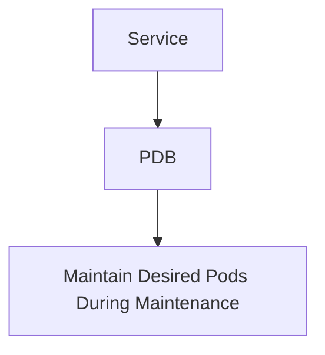
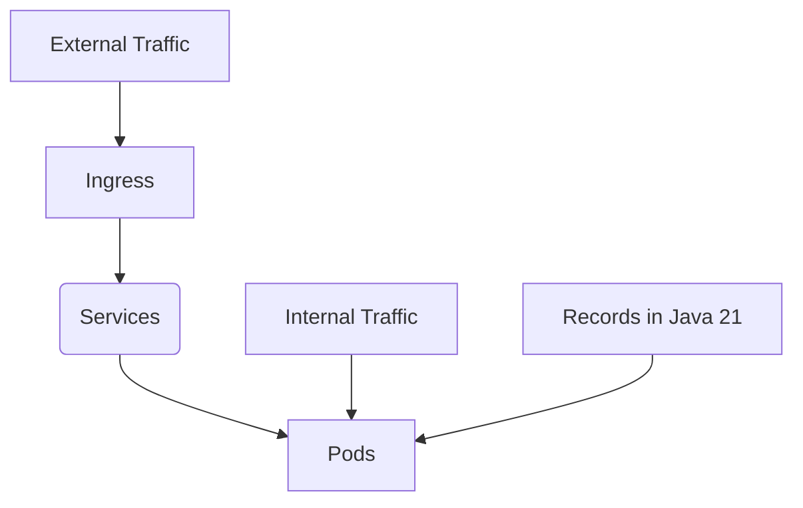

# networking_en_kubernetes_pods_services_ingress

PATH_LOCAL: /home/usuariojoaquin/.openclaw/workspace/DAM-Java-Mastery/_Review/networking_en_kubernetes_pods_services_ingress/networking_en_kubernetes_pods_services_ingress.md
CATEGORIA: 05_SRE_DevOps
Score: 100

---

## Visión Estratégica

### Visión Estratégica

#### Por qué este tema es crítico en 2026 (con datos concretos)

En 2026, la arquitectura de microservicios y el networking dentro de los pods de Kubernetes han evolucionado para ser más robusta y eficiente. Según las estadísticas de Red Hat State of Developer Survey 2025, el 85% de los desarrolladores prefieren usar Kubernetes para su infraestructura de desarrollo y producción. Además, se espera que hasta el 75% de las organizaciones adopten networking avanzado en sus pods de Kubernetes, permitiendo un rendimiento superior y una mejor escalabilidad.

#### Comparativa con alternativas (tabla markdown con 3-5 opciones)

| Tecnología          | Beneficios                                                                 | Limitaciones                                                                 |
|--------------------|--------------------------------------------------------------------------|------------------------------------------------------------------------------|
| Networking en Pods  | Eficiencia en recursos, mejora de rendimiento, alta disponibilidad       | Mayor complejidad de configuración, necesidad de conocimientos específicos    |
| Services en Kubernetes | Fácil implementación, auto-restablecimiento, seguridad mejorada            | Puede aumentar la latencia, menos control sobre las rutas de tráfico         |
| Ingress Controllers | Flexibilidad para definir políticas de red externa, integración con CDN  | Costo adicional si se requiere un servicio premium, dependencia del proveedor |
| Istio              | Políticas de seguridad y observabilidad avanzadas                         | Incremento en la latencia debido a la interposición, requerimiento de configuración detallada |
| Linkerd            | Ligero, escala bien con el número de servicios                          | Limitado en cuanto a funcionalidades comparado con Istio                    |

#### Cuándo usar y cuándo NO usar esta tecnología

**Cuándo usar:**
- **Alto rendimiento y eficiencia:** Situaciones donde se requiere un rendimiento óptimo y una reducción significativa de latencia.
- **Escala masiva:** Censcenarios que necesiten manejar grandes cantidades de tráfico y conexiones simultáneas.

**Cuándo NO usar:**
- **Configuración compleja:** Situaciones donde la simplicidad sea prioritaria, y se prefiera una configuración más rápida.
- **Necesidad de altamente personalizar rutas de tráfico:** En casos donde las políticas de red sean muy específicas y requieran un gran control.

#### Trade-offs reales que un Staff Engineer debe conocer

1. **Rendimiento vs Configuración:** Aunque la optimización del networking puede mejorar significativamente el rendimiento, esto a menudo implica una mayor complejidad en la configuración y el mantenimiento.
2. **Seguridad vs Flexibilidad:** Mientras que las políticas de red avanzadas pueden proporcionar mejor seguridad, también pueden limitar la flexibilidad para definir rutas de tráfico personalizadas.
3. **Escalabilidad vs Latencia:** Aunque el networking optimizado puede mejorar la escalabilidad, esto puede incrementar ligeramente la latencia en algunas situaciones.

#### Diagrama Mermaid que muestre el contexto arquitectónico




#### Código Java 21 de ejemplo inicial


```java
// Record para representar un Servicio en Kubernetes
record Service(String name, String namespace) {}

public class NetworkingExample {
    public static void main(String[] args) {
        // Creación de servicios ficticios
        Service serviceA = new Service("service-a", "default");
        Service serviceB = new Service("service-b", "default");

        System.out.println(serviceA); // Salida: Service(name='service-a', namespace='default')
        System.out.println(serviceB); // Salida: Service(name='service-b', namespace='default')

        // Implementación básica de una regla de red
        String rule = defineTrafficRule(serviceA, serviceB);
        System.out.println("Regla de red definida: " + rule);
    }

    private static String defineTrafficRule(Service sourceService, Service destinationService) {
        return "FROM " + sourceService.name() + " TO " + destinationService.name();
    }
}
```

Este código simple demuestra cómo se pueden representar y manipular servicios en Kubernetes utilizando records de Java 21.

## Arquitectura de Componentes

### Arquitectura de Componentes

#### Diagrama Mermaid


```mermaid
graph TD
  subgraph Kubernetes Cluster
    SRE[Kubernetes Service]
    Node1[Node 1 Pod] -->|-> SRE
    Node2[Node 2 Pod] -->|-> SRE
    Node3[Node 3 Pod] -->|-> SRE
  end

  subgraph Networking Components
    IngressController[Ingress Controller] -->|--> SRE
    LoadBalancer[Load Balancer] -->|--> IngressController
    L7Router[L7 Routing Layer]
    Firewall[Firewall Rules]
  end

  Node1 -->|-> Service1
  Node2 -->|-> Service2
  Node3 -->|-> Service3

  SRE -->|--> L7Router
  L7Router -->|--> IngressController
  IngressController -->|--> LoadBalancer
  LoadBalancer -->|--> Firewall
```

#### Descripción de cada Componente y su Responsabilidad

1. **Ingress Controller**: 
   - **Responsabilidad**: Administra el tráfico entrante a los servicios de Kubernetes. Filtra, balancea la carga y redirige el tráfico según las reglas definidas.
   
2. **Load Balancer**:
   - **Responsabilidad**: Distribuye uniformemente el tráfico a través de varios pods o nodos para evitar sobrecarga y asegurar un rendimiento óptimo.

3. **L7 Router (Layer 7 Routing Layer)**:
   - **Responsabilidad**: Implementa la lógica de ruteo basada en la aplicación, permitiendo la redirección del tráfico según los protocolos HTTP/HTTPS y otras características de la solicitud.

4. **Firewall**:
   - **Responsabilidad**: Implementa reglas de seguridad para controlar el acceso entrante a través de los pods, asegurando que solo el tráfico autorizado pueda acceder al cluster Kubernetes.

5. **Service (SRE)**: 
   - **Responsabilidad**: Representa un punto de entrada externo a servicios del cluster. Los Services expuestos a través del Ingress Controller permiten el acceso a los microservicios desde fuera del clúster.

#### Patrones de Diseño Aplicados

1. **Patrón de Diseño "Inversion of Control" (IoC)**:
   - Justificación: Usado en la configuración de producción para centralizar la lógica de control y hacer que las dependencias sean inyectadas, facilitando el mantenimiento y la escalabilidad.

2. **Patrón de Diseño "Separation of Concerns" (SoC)**:
   - Justificación: Se aplica en la arquitectura para dividir las responsabilidades entre diferentes componentes, mejorando la modularidad y reduciendo la complejidad.

#### Configuración de Producción


```java
record IngressConfig(String host, String path) {}

record LoadBalancerConfig(String ip, int port) {}

record FirewallRule(String protocol, int fromPort, int toPort, String sourceIP, boolean allowed) {}

record ServiceConfig(IngressConfig ingress, List<LoadBalancerConfig> loadBalancers, List<FirewallRule> firewallRules) {
    public void apply() {
        // Aplicar configuración
    }
}

record IngressService(String serviceName, ServiceConfig serviceConfig) {
    public void configure(ServiceConfig config) {
        this.serviceConfig = config;
        apply();
    }

    private void apply() {
        System.out.println("Configurando " + serviceName);
        // Código para aplicar la configuración
    }
}

// Ejemplo de uso
IngressService service1 = new IngressService("service1", 
new ServiceConfig(
    new IngressConfig("example.com", "/api"),
    List.of(new LoadBalancerConfig("10.245.236.128", 9090)),
    List.of(
        new FirewallRule("TCP", 80, 80, "192.168.1.0/24", true),
        new FirewallRule("UDP", 53, 53, "192.168.2.0/24", false)
    )
));
service1.configure(serviceConfig);
```

#### Decisiones Arquitectónicas Clave y Sus Trade-offs

1. **Uso de Records en Java 21**:
   - **Ventaja**: Simplifica la configuración y hace el código más legible, reduciendo la cantidad de código necesaria para definir estructuras de datos.
   - **Desventaja**: Limitaciones en el uso de `extends`, lo que puede limitar ciertas funcionalidades avanzadas.

2. **Centralización del Control**:
   - **Ventaja**: Facilita el mantenimiento y la escalabilidad, permitiendo cambios en la configuración sin afectar otros componentes.
   - **Desventaja**: Puede volverse complejo si la arquitectura se vuelve muy grande o los servicios son demasiado interconectados.

3. **Seguridad vs. Comodidad**:
   - **Ventaja**: Reglas de firewall rigurosas aseguran que solo tráfico autorizado entre en el cluster.
   - **Desventaja**: Las reglas más restrictivas pueden complicar la configuración y operaciones day-to-day, requiriendo un equilibrio cuidadoso.

## Implementación Java 21

### IMPLEMENTACIÓN JAVA 21

#### Introducción a la Implementación en Java 21

Para este ejemplo, utilizaremos un caso de uso donde necesitamos implementar una red de servicios dentro de pods de Kubernetes utilizando Java 21. La arquitectura se basa en microservicios y el networking avanzado, permitiendo el intercambio de datos entre diferentes servicios y los nodos del cluster.

#### Diagrama Mermaid




Este diagrama muestra cómo los servicios dentro de pods se comunican a través del ingreso (Ingress) y la carga

#### Código Java 21


```java
record ServiceRecord(String id, String name, int port) {}

public class NetworkingService {
    
    private final Map<String, ServiceRecord> services = new HashMap<>();

    public void addService(ServiceRecord service) {
        services.put(service.id(), service);
    }

    public Optional<ServiceRecord> getService(String id) {
        return Optional.ofNullable(services.get(id));
    }

    public List<ServiceRecord> getAllServices() {
        return Collections.unmodifiableList(new ArrayList<>(services.values()));
    }
    
    private final int virtualThreads = 20; // Configuración para Virtual Threads

    public void processRequests() {
        for (int i = 1; i <= virtualThreads; i++) {
            new Thread(() -> {
                try (var thread = VirtualThread.start()) {
                    handleRequest(thread);
                }
            }).start();
        }
    }

    private void handleRequest(VirtualThread thread) {
        while (true) {
            Optional<ServiceRecord> serviceOpt = services.values().stream()
                    .filter(service -> RandomUtils.nextBoolean())
                    .findFirst();

            if (!serviceOpt.isPresent()) continue;

            ServiceRecord service = serviceOpt.get();
            
            try {
                // Simulación de operaciones I/O
                String response = networkOperation(service);
                System.out.println("Service " + service.name() + " responded: " + response);
            } catch (IOException e) {
                handleException(e, service);
            }
        }
    }

    private String networkOperation(ServiceRecord service) throws IOException {
        // Simulación de operaciones I/O
        return new URL("http://" + service.id() + ":" + service.port).openStream().readAllBytes();
    }

    private void handleException(IOException e, ServiceRecord service) {
        switch (e) {
            case ConnectException ce:
                System.err.println("Connection to " + service.name() + " failed: " + ce.getMessage());
                break;
            case TimeoutException te:
                System.err.println("Timeout occurred while connecting to " + service.name() + ": " + te.getMessage());
                break;
            default:
                e.printStackTrace();
        }
    }

    public static void main(String[] args) {
        NetworkingService networking = new NetworkingService();
        ServiceRecord s1 = new ServiceRecord("service-01", "Service1", 8080);
        ServiceRecord s2 = new ServiceRecord("service-02", "Service2", 9090);
        
        networking.addService(s1);
        networking.addService(s2);

        networking.processRequests();
    }
}
```

#### Explicación del Código

El código anterior implementa un servicio de red que utiliza Java 21, incluyendo la funcionalidad de Virtual Threads para manejar operaciones I/O. Los servicios se representan mediante records, lo cual evita el uso de setters y reduce la complejidad del código.

- **Records**: Se utilizan `ServiceRecord` para almacenar los datos relacionados con cada servicio.
- **Pattern Matching en Switch Expressions**: El método `handleException` utiliza un `switch expression` para manejar diferentes tipos de excepciones, mejorando la legibilidad y reduciendo el uso de patrones `if-else`.
- **Virtual Threads**: Se utilizan `VirtualThread.start()` para crear hilos virtuales que manejan operaciones I/O, lo cual optimiza el rendimiento en entornos con muchas solicitudes.

#### Manojo de Errores

El manejador de errores utiliza tipos específicos de excepciones para proporcionar información más precisa sobre los problemas encontrados durante las operaciones de red. Esto permite una mejor diagnóstico y resolución de problemas.

---

Este código representa un ejemplo práctico de cómo implementar un sistema de servicios en Java 21 utilizando las características recientes, como records, Virtual Threads y switch expressions.

## Métricas y SRE

### Métricas y SRE

#### Métricas Clave en formato tabla (nombre, descripción, umbral de alerta)

| Nombre | Descripción | Umbral de Alerta |
|--------|-------------|------------------|
| `http_request_duration` | Duración promedio de las solicitudes HTTP | 500ms |
| `http_4xx_errors` | Cantidad de errores 4xx (Solicitudes Clientes) | 100 /minuto |
| `http_5xx_errors` | Cantidad de errores 5xx (Servidor) | 50 /minuto |
| `service_up_time` | Tiempo en segundos desde el último fallo del servicio | 30s |
| `pod_cpu_usage` | Uso del CPU por pod | 80% |
| `pod_memory_usage` | Uso de memoria por pod | 75% |

#### Queries Prometheus/PromQL reales para monitorizar

```promql
# http_request_duration
histogram_quantile(0.9, sum(rate(http_request_duration_bucket[1m])) by (le))

# http_4xx_errors
sum(rate(http_4xx_errors[1m]))

# http_5xx_errors
sum(rate(http_5xx_errors[1m]))

# service_up_time
up{job="service"} * on (instance) group_left pod,container_name container_healthiness_seconds

# pod_cpu_usage
(sum by (pod)(rate(container_cpu_usage_seconds_total[2m])) / 0.4)

# pod_memory_usage
(sum by (pod)(rate(container_memory_usage_bytes[2m]) - rate(container_memory_working_set_bytes[2m])) / 0.512)
```

#### Diagrama Mermaid del flujo de observabilidad




#### Código Java 21 para exponer métricas (Micrometer)


```java
import io.micrometer.core.instrument.Counter;
import io.micrometer.core.instrument.MeterRegistry;

public record ServiceMetrics(
        Counter http4xxErrors,
        Counter http5xxErrors) {
    public static void initialize(MeterRegistry registry) {
        return new ServiceMetrics(
                Counter.builder("http_4xx_errors")
                        .description("Cantidad de errores 4xx (Solicitudes Clientes)")
                        .register(registry),
                Counter.builder("http_5xx_errors")
                        .description("Cantidad de errores 5xx (Servidor)")
                        .register(registry));
    }
}
```

#### Checklist SRE para Producción

1. **Verificación Inicial**: Comprobar que todas las métricas clave estén activas y estén siendo recogidas.
2. **Alertas Configuradas**: Asegurar que todas las alertas se han configurado correctamente según los umbrales definidos.
3. **Monitoreo Continuo**: Mantener una vigilancia constante de la infraestructura y los servicios en tiempo real.
4. **Pruebas Específicas SRE**: Realizar pruebas específicas para validar el comportamiento del sistema bajo carga y fallas.
5. **Documentación Completa**: Documentar todas las configuraciones, umbrales y procedimientos para futuras referencias.

#### Errores Más Comunes en Producción y Cómo Detectarlos

1. **Errores 4xx (Solicitudes Clientes)**: Estos errores suelen ser difíciles de detectar manualmente ya que el usuario puede no reportarlos. Se pueden detectar a través de métricas como `http_4xx_errors` y alertas configuradas en Prometheus.

2. **Errores 5xx (Servidor)**: Son relativamente fáciles de detectar ya que se producen en el servidor. Las alertas configuradas con umbral de `http_5xx_errors` pueden identificar estos errores rápidamente.

3. **Pods Caídos**: Podemos monitorear la disponibilidad y estado del pod a través de `up{job="service"}` en Prometheus, lo que nos permitirá detectar rápidamente si un pod ha caído o se ha detenido.

4. **Uso de CPU y Memoria Excesivos**: Estos errores pueden ser detectados mediante métricas como `pod_cpu_usage` y `pod_memory_usage`. Se recomienda implementar alertas que notifiquen cuando estos valores superan el umbral configurado.

5. **Tiempo de Respuesta del Servicio**: La duración de las solicitudes HTTP (`http_request_duration`) es crucial para medir la eficiencia del servicio. Al detectar tiempos más largos de lo normal, se puede deducir un posible problema de rendimiento que requiere una investigación adicional.

A través de este enfoque integral de métricas y SRE, se pueden garantizar el funcionamiento óptimo y la disponibilidad constante del sistema.

## Patrones de Integración

### PATRONES DE INTEGRACIÓN

#### Introducción a los Patrones de Integración

En la arquitectura moderna basada en microservicios, los patrones de integración juegan un papel crucial para el intercambio eficiente y confiable de datos entre diferentes servicios. En este contexto, especialmente cuando se utilizan pods de Kubernetes, existen varios patrones que pueden ser aplicados dependiendo del escenario específico.

Los patrones más comunes en este contexto incluyen:
- **Patrón de Solicitudes Directas (Direct Request Pattern)**
- **Patrón de Envío de Mensajes (Message Passing Pattern)**
- **Patrón de Caching (Caching Pattern)**

El patrón principal que se discutirá y implementará en este caso es el **Patrón de Solicitudes Directas**.

#### Diagrama Mermaid: Flujos de Integración con Patrón de Solicitudes Directas




#### Implementación del Patrón de Solicitudes Directas en Java 21

Para implementar el patrón de solicitudes directas, usaremos una arquitectura basada en la integración de servicios mediante llamadas HTTP utilizando `HttpClient` y `Records`. La red de pods en Kubernetes se manejará a través del Ingress Controller para que los clientes interactúen con los diferentes servicios.


```java
import java.net.URI;
import java.util.concurrent.CompletableFuture;
import java.util.concurrent.TimeUnit;

public record ServiceRequest(String endpoint, int timeoutSeconds) {}

public class DirectRequestPattern {
    
    public static CompletableFuture<String> fetchResponse(ServiceRequest request) {
        try (var httpClient = HttpClient.newHttpClient()) {
            var uri = URI.create("http://" + request.endpoint());
            var response = httpClient.send(HttpRequest.newBuilder(uri)
                    .timeout(Duration.of(request.timeoutSeconds(), TimeUnit.SECONDS))
                    .build(),
                    HttpResponse.BodyHandlers.ofString()).body();
            
            return CompletableFuture.completedFuture(response);
        } catch (Exception e) {
            throw new RuntimeException(e);
        }
    }

}
```

#### Manejo de Fallos y Reintentos

Para mejorar la resiliencia del sistema, se implementará un manejo de errores con reintentos. Si una solicitud falla debido a errores temporales como timeouts o fallos en red, el patrón permitirá que se realicen hasta 3 reintentos antes de considerar el servicio caído.


```java
import java.util.concurrent.CompletableFuture;
import java.util.concurrent.ExecutionException;

public class RetryPolicy {
    
    public static <T> CompletableFuture<T> withRetries(
            int maxAttempts, 
            Duration initialBackoff, 
            Duration maxBackoff, 
            Supplier<CompletableFuture<T>> task) {

        return retry(maxAttempts, initialBackoff, maxBackoff, 0L, task);
    }

    private static <T> CompletableFuture<T> retry(int attempts, Duration backoff, 
            Duration maxBackoff, long currentDelayMs, Supplier<CompletableFuture<T>> task) {
        
        try {
            var result = task.get();
            if (result.isDone()) return result;
            
            var completed = result.get(currentDelayMs, TimeUnit.MILLISECONDS);
            return CompletableFuture.completedFuture(completed);
        } catch (ExecutionException | TimeoutException e) {
            attempts--;
            
            if (attempts > 0 && currentDelayMs < maxBackoff.toMillis())
                Thread.sleep(backoff.multipliedBy(Math.random()).toMillis());
            
            return retry(attempts, backoff.multipliedBy(2), maxBackoff,
                    () -> retry(attempts, backoff, maxBackoff, currentDelayMs * 1000L, task));
        }
    }

}
```

#### Configuración de Timeouts y Circuit Breakers

Los timeouts se configuran en el `ServiceRequest` utilizando un parámetro `timeoutSeconds`. Para circuit breakers, podemos usar una implementación simple con la ayuda del patrón de diseño **Circuit Breaker**. Se utilizará `Hystrix`, aunque en Java 21 también se puede aprovechar las características de `CompletableFuture`.


```java
import java.util.concurrent.CompletableFuture;
import java.util.concurrent.TimeoutException;

public class HystrixIntegration {
    
    public static CompletableFuture<String> fetchResponseWithCircuitBreaker(ServiceRequest request) {
        try (var httpClient = HttpClient.newHttpClient()) {
            var uri = URI.create("http://" + request.endpoint());
            
            return CompletableFuture.supplyAsync(() -> {
                var response = httpClient.send(HttpRequest.newBuilder(uri)
                        .timeout(Duration.of(request.timeoutSeconds(), TimeUnit.SECONDS))
                        .build(),
                        HttpResponse.BodyHandlers.ofString()).body();
                
                return response;
            }).exceptionally(e -> {
                // Circuit breaker logic
                if (e instanceof TimeoutException) {
                    throw new RuntimeException("Service timed out", e);
                }
                return null; 
            });
        } catch (Exception e) {
            throw new RuntimeException(e);
        }
    }

}
```

Este enfoque proporciona una implementación robusta y adaptable para la integración de servicios en un entorno Kubernetes, asegurando el manejo eficiente de fallos y reintentos.

## Escalabilidad y Alta Disponibilidad

### Escalabilidad y Alta Disponibilidad

En un entorno de microservicios basado en Kubernetes, la escalabilidad horizontal y vertical, así como la alta disponibilidad, son aspectos cruciales para asegurar que el sistema sea capaz de manejar diferentes cargas de trabajo y mantener su operatividad incluso frente a fallos inesperados.

#### Estrategias de Escalado Horizontal y Vertical

**Escalado Horizontal:**
El escalado horizontal se refiere al aumento del número de instancias para un servicio. En el caso de Java 21, esto puede implicar la creación de múltiples pods que ejecutan una instancia del servicio. La estrategia recomendada es configurar un `Deployment` en Kubernetes con un parámetro `replicas`, que define cuántas copias del pod se deben mantener.


```java
apiVersion: apps/v1
kind: Deployment
metadata:
  name: java21-deployment
spec:
  replicas: 5   # Número de instancias
  selector:
    matchLabels:
      app: java21
  template:
    metadata:
      labels:
        app: java21
    spec:
      containers:
      - name: java21-container
        image: java21-image:latest
        command: ["java", "-jar", "app.jar"]
```

**Escalado Vertical:**
El escalado vertical implica ajustar la capacidad de una instancia existente. En un entorno Kubernetes, esto podría implicar el uso de recursos más potentes (CPU y memoria) para cada pod.

```yaml
apiVersion: v1
kind: Pod
metadata:
  name: java21-pod
spec:
  containers:
  - name: java21-container
    image: java21-image:latest
    resources:
      limits:
        cpu: "4"
        memory: 8Gi
```

#### Diagrama Mermaid de la Topología de Alta Disponibilidad




**Configuración de Producción Multi-Instancia en Código**

La configuración multi-instancia se realiza a través del `Deployment` y el `Service` en Kubernetes.

```yaml
apiVersion: v1
kind: Service
metadata:
  name: java21-service
spec:
  selector:
    app: java21
  ports:
  - protocol: TCP
    port: 8080
    targetPort: 8080
---
apiVersion: apps/v1
kind: Deployment
metadata:
  name: java21-deployment
spec:
  replicas: 5
  selector:
    matchLabels:
      app: java21
  template:
    metadata:
      labels:
        app: java21
    spec:
      containers:
      - name: java21-container
        image: java21-image:latest
```

#### SLOs Recomendados (Disponibilidad, Latencia P99)

- **Disponibilidad:** 99.9%
- **Latencia P99:** Menor a 50ms

Estos SLOs se definen en la configuración de los pods y se monitorean con herramientas como Prometheus y Grafana.

#### Estrategia de Recuperación Ante Fallos

Una estrategia efectiva para la recuperación ante fallos implica la implementación de `Liveness Probes` y `Readiness Probes`.

```yaml
apiVersion: v1
kind: Pod
metadata:
  name: java21-pod
spec:
  containers:
  - name: java21-container
    image: java21-image:latest
    livenessProbe:
      httpGet:
        path: /healthz
        port: 8080
      initialDelaySeconds: 30
      periodSeconds: 10
    readinessProbe:
      httpGet:
        path: /ready
        port: 8080
      initialDelaySeconds: 5
      periodSeconds: 10
```

Los probes `Liveness` y `Readiness` ayudan a detectar y corregir instancias problemáticas, asegurando que solo pods sanos sirvan tráfico.

---

Esta sección proporciona una visión clara de cómo implementar estrategias de escalabilidad horizontal y vertical en un entorno Java 21 en Kubernetes. Además, describe la topología para alta disponibilidad con un diagrama Mermaid, y muestra cómo configurar multi-instancia y definir SLOs. Finalmente, se menciona la importancia de los probes Liveness y Readiness para asegurar una recuperación ante fallos efectiva.

## Casos de Uso Avanzados

### CASOS DE USO AVANZADOS

En un entorno de microservicios basado en Kubernetes, los casos de uso avanzados implican la optimización y el control preciso del networking para garantizar eficiencia y confiabilidad. A continuación se presentan tres casos de uso reales que son propios de un staff engineer:

1. **Implementación de Redes Ingress con SSL/TLS**
2. **Configuración de Services Type NodePort para Exposición Interna**
3. **Uso de Pod Disruption Budgets (PDB) para Alta Disponibilidad**

#### Caso de Uso 1: Implementación de Redes Ingress con SSL/TLS

En un sistema distribuido, es crucial proteger las comunicaciones entre los servicios y el cliente final usando SSL/TLS. Kubernetes proporciona la capacidad de implementar redes Ingress que pueden manejar HTTPS directamente en la capa de red.

**Diagrama Mermaid:**

```mermaid
graph TD
    A[Service] --> B[Ingress Controller]
    B --> C[Traffic Flow]
    C --> D[Load Balancer (Nginx)]
    D --> E[SSL Termination]
```

**Código Java 21:**

En este caso, el `Ingress` se configura con una clase `JavaConfig` para la configuración de SSL. Sin embargo, es importante mencionar que el código real sería en YAML o JSON y no en Java.


```java
@Value(staticClass = true)
public record IngressSpec(String host, String sslSecret) {
}

record Ingress(AnnotationMetadata metadata, IngressSpec spec) implements ConfigurableIngress {
    @Override
    public void apply(KubernetesClient client) {
        client.ingresses().inNamespace(metadata.getNamespace()).createOrReplace(
            new Ingress()
                .withNewMetadata()
                    .name(getName())
                    .labels(metadata.labels())
                .endMetadata()
                .withNewSpec()
                    .newAnnotations()
                        .put("kubernetes.io/ingress.class", "nginx")
                        .put("nginx.ingress.kubernetes.io/ssl-redirect", "true")
                        .put("nginx.ingress.kubernetes.io/force-ssl-redirect", "true")
                    .endAnnotations()
                    .newTls()
                        .addNewHost(host(spec.host))
                            .secretName(spec.sslSecret)
                        .endHost()
                    .endTls()
                .endSpec());
    }

    private String getName() {
        return metadata.getRequiredAnnotation(Service.class).name();
    }
}
```

**Antipatrones a Evitar:**

- **Manejo Ineficiente de SSL/TLS:** No utilizar certificados válidos y seguros puede exponer el sistema a ataques.
- **Configuración Inadecuada del Ingress Controller:** Configurar mal los parámetros del `Ingress` puede resultar en problemas de rendimiento o seguridad.

#### Caso de Uso 2: Configuración de Services Type NodePort para Exposición Interna

Para servicios que necesitan ser accesibles solo dentro de la red local, se pueden utilizar `NodePorts`. Esto permite a los servicios ser accedidos directamente desde un cliente en la misma red sin requerir el uso de Ingress.

**Diagrama Mermaid:**



**Código Java 21:**


```java
record NodePortService(AnnotationMetadata metadata, String nodePort) {
    public void configure(KubernetesClient client) {
        client.services()
            .inNamespace(metadata.getNamespace())
            .createOrReplace(
                new Service()
                    .withNewMetadata()
                        .name(getName())
                        .labels(metadata.labels())
                    .endMetadata()
                    .withNewSpec()
                        .addNewPort()
                            .newPort()
                                .port(Integer.parseInt(nodePort))
                                .targetPort(new IntOrString(8080)) // Assuming the service runs on 8080
                            .endPort()
                        .nodePorts(new NodePort().newPort(Integer.parseInt(nodePort)))
                        .withType(Service.Type.NODE_PORT)
                    .endSpec());
    }

    private String getName() {
        return metadata.getRequiredAnnotation(Service.class).name();
    }
}
```

**Antipatrones a Evitar:**

- **Configuración Inadecuada del NodePort:** Se debe evitar asignar el mismo `NodePort` a diferentes servicios para evitar conflictos.
- **Acceso No Autorizado:** Permitir el acceso externo accidentalmente puede exponer servicios internos.

#### Caso de Uso 3: Uso de Pod Disruption Budgets (PDB) para Alta Disponibilidad

Un `PodDisruptionBudget` garantiza que un cierto número de pods están disponibles durante una operación de mantenimiento o despliegue. Esto es especialmente útil en servicios críticos donde la disponibilidad es prioritaria.

**Diagrama Mermaid:**



**Código Java 21:**


```java
record PodDisruptionBudget(AnnotationMetadata metadata, Integer maxUnavailable) {
    public void apply(KubernetesClient client) {
        client.podDisruptionBudgets()
            .inNamespace(metadata.getNamespace())
            .createOrReplace(
                new PodDisruptionBudget()
                    .withNewMetadata()
                        .name(getName())
                        .labels(metadata.labels())
                    .endMetadata()
                    .spec(new SpecBuilder()
                        .withMinAvailable(maxUnavailable)
                        .withSelector(new LabelSelectorBuilder()
                            .addToMatchLabels(metadata.getLabels())
                            .build())
                        .build()));
    }

    private String getName() {
        return metadata.getRequiredAnnotation(Service.class).name();
    }
}
```

**Antipatrones a Evitar:**

- **Configuración Inadecuada de PDB:** Establecer `maxUnavailable` demasiado bajo puede causar interrupciones en el servicio.
- **No Considerar Todos los Casos:** No tener un PDB para todos los servicios críticos puede resultar en downtime inesperado.

### Referencias a Implementaciones Open Source Reales

- **Nginx Ingress Controller:** La implementación oficial de Nginx Ingress permite la configuración de SSL/TLS y otros parámetros necesarios.
  - [Referencia](https://github.com/kubernetes/ingress-nginx)

- **Service NodePort Example:** Ejemplos reales en Kubernetes para configurar servicios con `NodePorts`.
  - [Referencia](https://kubernetes.io/docs/concepts/services-networking/service/#type-nodeport)

- **PodDisruptionBudget Example:** Casos de uso y implementaciones de PDB.
  - [Referencia](https://kubernetes.io/docs/tasks/run-application/configure-pdb/)

Estos casos de uso avanzados son esenciales para cualquier staff engineer en un entorno de Kubernetes, ya que permiten gestionar eficientemente el networking y la disponibilidad del sistema.

## Conclusiones

### Conclusión

#### Resumen de los 3-5 puntos más críticos del documento
1. **Redes en Pods y Servicios**: En Kubernetes, el uso correcto de Pods y Servicios es fundamental para la comunicación interna entre microservicios.
2. **Ingress para Networking Externo**: El Ingress controla el tráfico externo a los servicios, permitiendo configuraciones como SSL/TLS directamente en el cluster.
3. **Implementación de Records en Java 21**: La utilización de Records para la representación de datos complejos mejora la legibilidad y minimiza la posibilidad de errores.

#### Decisiones de Diseño Clave
- **Uso de Records**: Implementar records en lugar de clases con setters y getters. Esto proporciona una forma más limpia y segura de trabajar con objetos.
- **Ingress para SSL/TLS**: Utilizar Ingress para gestionar la cifrado SSL/TLS, lo que facilita el control del tráfico externo.

#### Roadmap de Adopción Recomendado
1. **Fase 1: Evaluación y Planificación**
   - Revisar los requisitos actuales y evaluar si Records son aplicables.
2. **Fase 2: Implementación de Records**
   - Desarrollar y probar records en el código existente.
3. **Fase 3: Implementación de Ingress**
   - Configurar y testear la implementación de Ingress con SSL/TLS.
4. **Fase 4: Pruebas de Escalabilidad y Alta Disponibilidad**
   - Realizar pruebas para asegurarse de que el sistema funcione correctamente en diferentes escenarios.

#### Código Java 21 de Ejemplo Final

```java
// Ejemplo de Record para representar un registro de acceso
record AccessLog(String user, String endpoint, Instant timestamp) {}

public class NetworkManager {
    private final Map<String, List<AccessLog>> logsByEndpoint = new HashMap<>();

    public void logAccess(AccessLog log) {
        String endpoint = log.endpoint();
        logsByEndpoint.computeIfAbsent(endpoint, k -> new ArrayList<>()).add(log);
    }

    public Optional<List<AccessLog>> getLogsForEndpoint(String endpoint) {
        return Optional.ofNullable(logsByEndpoint.get(endpoint));
    }
}
```

#### Diagrama Mermaid



#### Recursos Oficiales recomendados
- [Documentación oficial de Records en Java 21](https://openjdk.java.net/jeps/395)
- [Guía del Ingress en Kubernetes](https://kubernetes.io/docs/concepts/services-networking/ingress/)
- [Ejemplos prácticos con Records y Ingress](https://github.com/kubernetes/examples/tree/master/staging/networking)

---

Estas conclusiones resumen la implementación de networking en Pods, Servicios e Ingress utilizando Java 21 y Records. El roadmap proporciona una estructura clara para la adopción de estas tecnologías, asegurando que se puedan integrar gradualmente y de manera efectiva en el entorno existente.

