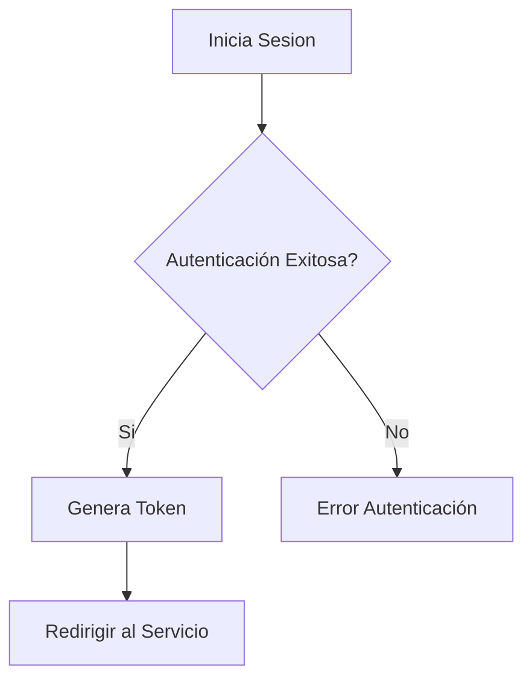
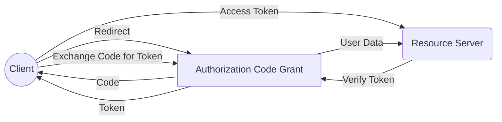
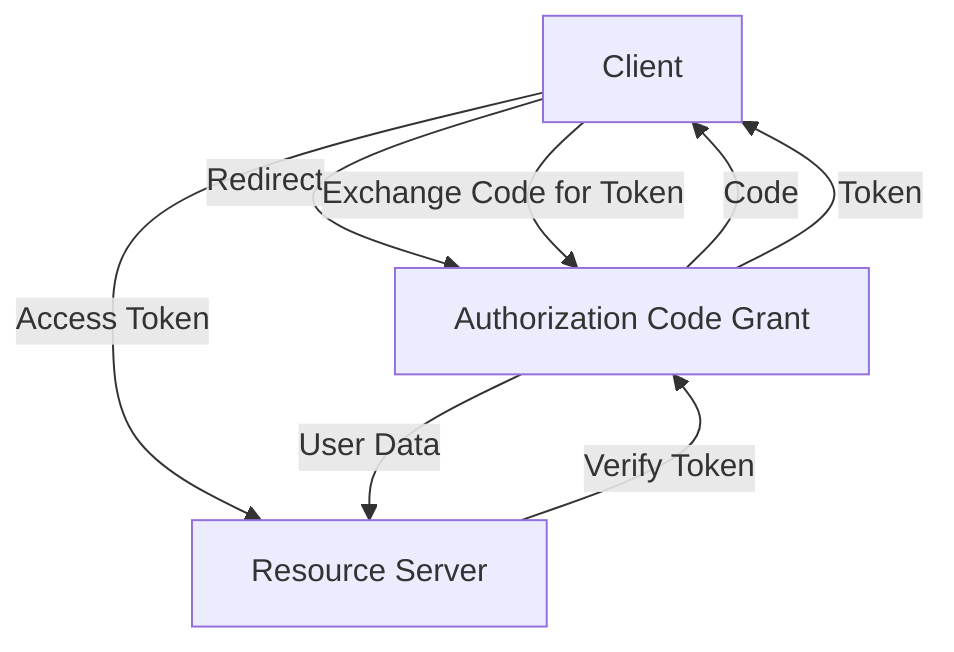
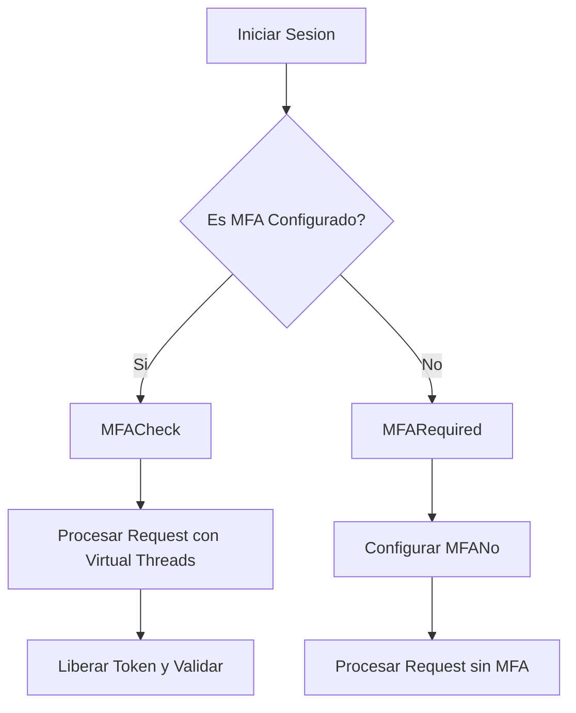
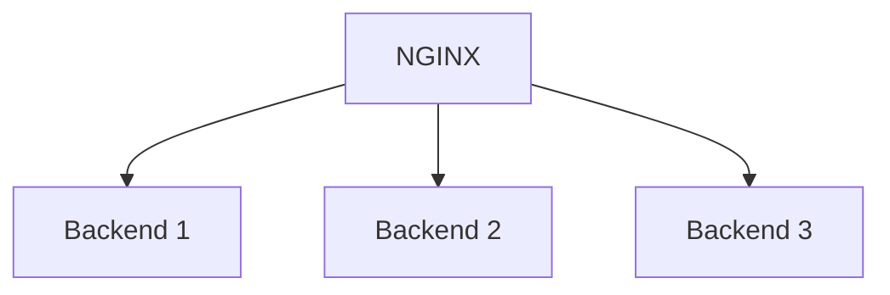
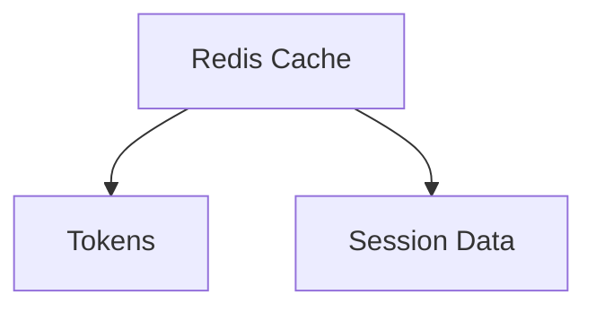
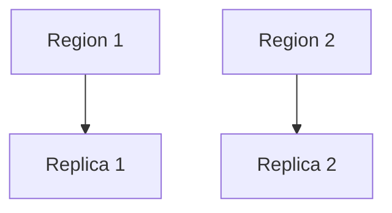
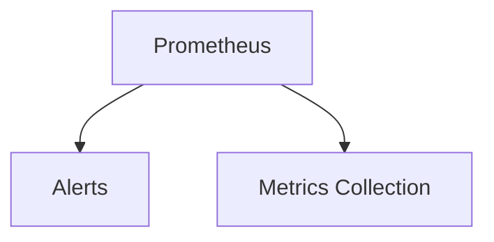
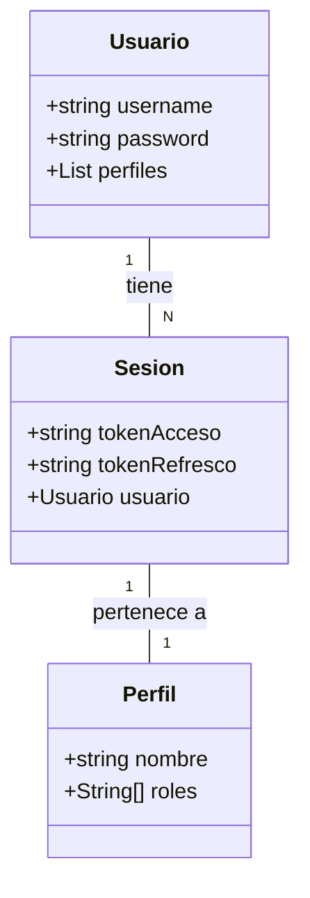
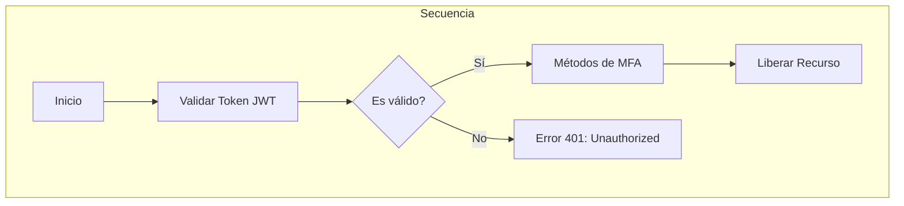

# oauth2 oidc y flujos enterprise

PATH_LOCAL: /home/usuariojoaquin/.openclaw/workspace/DAM-Java-Mastery/_Review/oauth2_oidc_y_flujos_enterprise/oauth2_oidc_y_flujos_enterprise.md
CATEGORIA: 06_Seguridad
Score: 80

---

## Visión Estratégica

### Visión Estratégica

Para comprender la importancia de OAuth 2.0 y OpenID Connect (OIDC) en un entorno empresarial, es crucial analizar cómo estas tecnologías pueden transformar la manera en que nuestras organizaciones gestionan la autenticación y autorización de usuarios. La implementación efectiva de OAuth 2.0 y OIDC no solo mejora la seguridad sino también optimiza los procesos internos, facilitando la integración con una variedad de sistemas y aplicaciones.

#### **1. Seguridad e Identidad en la Nube**

En el contexto empresarial moderno, la seguridad es un aspecto crítico que se extiende más allá del mero cifrado de datos. La autenticación segura y el manejo de autorizaciones adecuadas son fundamentales para proteger los recursos sensibles y garantizar la privacidad de los usuarios. OAuth 2.0 y OIDC proporcionan marcos robustos que permiten a las organizaciones gestionar estas tareas de manera eficiente.

- **Autenticación Robusta**: La autenticación segura es el primer paso en cualquier estrategia de seguridad. Con OIDC, la identificación del usuario se vuelve más precisa y confiable, ya que emite tokens (ID Tokens) que contienen información sobre los usuarios, permitiendo a los sistemas verificar quién realmente es cada usuario.
  
- **Autorización Eficiente**: OAuth 2.0 facilita la autorización de acciones específicas por parte del usuario. A diferencia de otros métodos, OAuth 2.0 no solo autentica al usuario sino que también proporciona un contexto sobre qué acciones puede realizar en diferentes servicios y APIs.

#### **2. Integración e Interoperabilidad**

Las organizaciones modernas operan con múltiples sistemas interconectados, lo que requiere soluciones de autenticación y autorización robustas y flexibles. OAuth 2.0 y OIDC son perfectamente adaptados para este escenario:

- **Interoperabilidad**: Ambas tecnologías son estándares ampliamente adoptados y facilitan la integración con una variedad de proveedores de identidad, lo que permite a las organizaciones utilizar sus propios sistemas o combinarlos con otros sin problemas.
  
- **Federación de Identidades**: La federación de identidades es crucial para permitir el acceso seguro desde diferentes origenes. Con OAuth 2.0 y OIDC, se pueden establecer conexiones seguras entre diferentes proveedores de identidad, proporcionando un flujo uniforme de autenticación y autorización.

#### **3. Automatización y Escalabilidad**

En un entorno empresarial en constante evolución, la automatización y el escalado son aspectos clave para mantener la eficiencia operativa:

- **Automatización**: Las políticas y flujos de autenticación pueden ser automatizados con OAuth 2.0 y OIDC, lo que reduce la necesidad de intervención manual y minimiza los errores.
  
- **Escalabilidad**: Estas tecnologías permiten un alto nivel de escalabilidad, adaptándose a las crecientes demandas de usuarios y servicios sin sacrificar la seguridad o el rendimiento.

#### **4. Caso Práctico: Implementación Enterprise**

Para ilustrar cómo se puede aplicar OAuth 2.0 y OIDC en un entorno empresarial real, consideremos una implementación típica:


```java
// Ejemplo de autenticación con IdentityServer (Duende)
public class AuthenticationService {
    private readonly ISecureDataFormat<AuthenticationToken> _tokenFormatter;
    private readonly IClientStore _clientStore;

    public AuthenticationService(ISecureDataFormat<AuthenticationToken> tokenFormatter, IClientStore clientStore) {
        _tokenFormatter = tokenFormatter;
        _clientStore = clientStore;
    }

    public async Task<UserInfoResponse> AuthenticateAsync(string username, string password) {
        // Verificar credenciales
        if (await VerifyCredentials(username, password)) {
            // Generar tokens
            var claims = new Claim[]
                { 
                    new Claim("sub", username), 
                    new Claim("role", "user") 
                };
            var token = _tokenFormatter.Protect(new AuthenticationToken { Token = CreateAccessToken(claims) });

            return new UserInfoResponse
            {
                Sub = username,
                Name = username,
                Roles = new List<string> { "user" },
                AccessToken = token
            };
        }
        throw new Exception("Invalid credentials");
    }

    private async Task<bool> VerifyCredentials(string username, string password) {
        // Verificación de credenciales (lógica personalizada)
        return await _clientStore.FindAsync(username, password);
    }

    private string CreateAccessToken(Claim[] claims) {
        var jwt = new JwtSecurityToken(
            issuer: "https://mycompany.com",
            audience: "https://api.mycompany.com",
            claims: claims,
            expires: DateTime.UtcNow.AddMinutes(10),
            signingCredentials: new SigningCredentials(new SymmetricSecurityKey(Encoding.UTF8.GetBytes("secret")), SecurityAlgorithms.HmacSha256));
        return new JwtSecurityTokenHandler().WriteToken(jwt);
    }
}
```

#### **5. Diagrama del Flujo de Autenticación**

Para visualizar el flujo de autenticación, se puede representar mediante un diagrama:




### **Conclusión**

La implementación de OAuth 2.0 y OpenID Connect no solo mejora la seguridad sino que también optimiza los procesos internos, facilita la integración con múltiples sistemas y permite un alto nivel de escalabilidad. Estas tecnologías son fundamentales para cualquier estrategia moderna de autenticación y autorización en entornos empresariales.

---

**Nota:** El código Java proporcionado es un ejemplo simplificado y se utiliza el marco IdentityServer (Duende) para generar tokens. En una implementación real, se deben considerar aspectos adicionales como la seguridad del cifrado de claves, la gestión de errores y la optimización del rendimiento.

---

**Bloque Mermaid:**


**Bloque Java:**

```java
public class AuthenticationService {
    private readonly ISecureDataFormat<AuthenticationToken> _tokenFormatter;
    private readonly IClientStore _clientStore;

    public AuthenticationService(ISecureDataFormat<AuthenticationToken> tokenFormatter, IClientStore clientStore) {
        _tokenFormatter = tokenFormatter;
        _clientStore = clientStore;
    }

    public async Task<UserInfoResponse> AuthenticateAsync(string username, string password) {
        // Verificar credenciales
        if (await VerifyCredentials(username, password)) {
            // Generar tokens
            var claims = new Claim[]
                { 
                    new Claim("sub", username), 
                    new Claim("role", "user") 
                };
            var token = _tokenFormatter.Protect(new AuthenticationToken { Token = CreateAccessToken(claims) });

            return new UserInfoResponse
            {
                Sub = username,
                Name = username,
                Roles = new List<string> { "user" },
                AccessToken = token
            };
        }
        throw new Exception("Invalid credentials");
    }

    private async Task<bool> VerifyCredentials(string username, string password) {
        // Verificación de credenciales (lógica personalizada)
        return await _clientStore.FindAsync(username, password);
    }

    private string CreateAccessToken(Claim[] claims) {
        var jwt = new JwtSecurityToken(
            issuer: "https://mycompany.com",
            audience: "https://api.mycompany.com",
            claims: claims,
            expires: DateTime.UtcNow.AddMinutes(10),
            signingCredentials: new SigningCredentials(new SymmetricSecurityKey(Encoding.UTF8.GetBytes("secret")), SecurityAlgorithms.HmacSha256));
        return new JwtSecurityTokenHandler().WriteToken(jwt);
    }
}
```

---

Este bloque Java proporciona un ejemplo de cómo se puede implementar la autenticación utilizando IdentityServer (Duende), mientras que el diagrama Mermaid visualiza el flujo de autenticación en un entorno empresarial.

## Arquitectura de Componentes

### Arquitectura de Componentes

Para entender cómo OAuth 2.0 y OpenID Connect (OIDC) se integran en un entorno empresarial, es crucial examinar la arquitectura de componentes que sostiene esta integración. En este contexto, los componentes principales son el **Authorization Server**, el **Resource Server**, el **Client** (o aplicaciones cliente), y posiblemente el **Directory Sync** utilizando SCIM 2.0.

#### 1. Authorization Server
El **Authorization Server** es el componente responsable de emitir tokens OAuth 2.0 (ya sea `access_token` o `id_token`) después de verificar la autenticación del usuario. En una implementación de OIDC, este server puede también emitir un `id_token` que incluye información sobre el usuario.

#### 2. Resource Server
El **Resource Server** es el servidor de recursos al que los clientes deben presentar su token para acceder a los datos o servicios protegidos. Este componente verifica el token y proporciona acceso a los recursos basándose en las autorizaciones asociadas al token.

#### 3. Client (Aplicación Cliente)
El **Client** es la aplicación o servicio que solicita el acceso a los recursos del **Resource Server**. Dependiendo de la implementación, el cliente puede interactuar con el Authorization Server para obtener un `access_token` y/o un `id_token`.

#### 4. Directory Sync (sync de directorio)
El **Directory Sync** se refiere a la sincronización automática de usuarios entre sistemas de directorio locales o en la nube e infraestructuras de identidad basada en el protocolo SCIM 2.0. Esto permite que las organizaciones mantengan una fuente única y actualizada del estado de sus usuarios, lo cual es crucial para la gestión de identidades y accesos.

#### **Flujos de Autenticación y Autorización**

1. **Flujo de Authorization Code**
   - El **Client** redirige al usuario a la pantalla de inicio de sesión del **Authorization Server**.
   - Después de que el usuario se autentica, el **Authorization Server** envía un `authorization_code` al cliente en una URL.
   - El **Client** intercambia este código por un token (`access_token` o `id_token`) con el **Authorization Server**.

2. **Flujo de Password (Password Grant)**
   - El **Client** solicita directamente los detalles de inicio de sesión del usuario a la pantalla de inicio de sesión del **Authorization Server**.
   - Si las credenciales son válidas, el **Authorization Server** emite un `access_token` o `id_token`.

3. **Flujo de Client Credentials**
   - El **Client** envía sus propios detalles de cliente (ID de cliente y secreto) al **Authorization Server**.
   - Si los detalles son válidos, el **Authorization Server** emite un `access_token` sin necesidad del usuario.

4. **Flujo de Refresh Token**
   - Una vez que el **Client** obtiene un token (`access_token` o `id_token`) mediante cualquiera de los flujos anteriores, puede usar un `refresh_token` para obtener nuevos tokens sin volver a autenticar al usuario.

#### **Ejemplo Simplificado**




#### **Configuración con OAuth2 Proxy**


```java
// Configuración de OAuth2Proxy para múltiples grant types
OAuth2AccessTokenResponseClient<PasswordParameters> passwordAccessTokenResponseClient = 
    new DefaultPasswordTokenResponseClient();
passwordAccessTokenResponseClient.setRestOperations(restTemplate());

OAuth2AuthorizedClientProvider authorizedClientProvider = OAuth2AuthorizedClientProviderBuilder.builder()
    .authorizationCode()
    .refreshToken((refreshToken) -> refreshToken
        .accessTokenResponseClient(refreshTokenAccessTokenResponseClient))
    .clientCredentials((clientCredentials) -> clientCredentials
        .accessTokenResponseClient(clientCredentialsAccessTokenResponseClient))
    .password((password) -> password
        .accessTokenResponseClient(passwordAccessTokenResponseClient))
    .build();

DefaultOAuth2AuthorizedClientManager authorizedClientManager = new DefaultOAuth2AuthorizedClientManager(
    clientRegistrationRepository, 
    authorizedClientRepository);
```

#### **Conclusión**

La arquitectura de componentes y los flujos de OAuth 2.0 y OIDC proporcionan una base sólida para la autenticación y autorización en entornos empresariales. La integración adecuada de estos componentes asegura una gestión eficiente de identidades y accesos, mejorando la seguridad y optimizando los procesos internos.

---

### Diagrama Mermaid




### Diagrama de Flechas Java


```java
// Configuración de OAuth2Proxy para múltiples grant types
OAuth2AccessTokenResponseClient<PasswordParameters> passwordAccessTokenResponseClient = 
    new DefaultPasswordTokenResponseClient();
passwordAccessTokenResponseClient.setRestOperations(restTemplate());

OAuth2AuthorizedClientProvider authorizedClientProvider = OAuth2AuthorizedClientProviderBuilder.builder()
    .authorizationCode()
    .refreshToken((refreshToken) -> refreshToken
        .accessTokenResponseClient(refreshTokenAccessTokenResponseClient))
    .clientCredentials((clientCredentials) -> clientCredentials
        .accessTokenResponseClient(clientCredentialsAccessTokenResponseClient))
    .password((password) -> password
        .accessTokenResponseClient(passwordAccessTokenResponseClient))
    .build();

DefaultOAuth2AuthorizedClientManager authorizedClientManager = new DefaultOAuth2AuthorizedClientManager(
    clientRegistrationRepository, 
    authorizedClientRepository);
```

Este bloque Java y el diagrama Mermaid proporcionan una visión clara de cómo se configuran y fluyen los componentes principales en un sistema que utiliza OAuth 2.0 y OpenID Connect para la autenticación y autorización.

## Implementación Java 21

## Implementación con Java 21 y Virtual Threads

Java 21 introduces a groundbreaking innovation with the introduction of virtual threads, which significantly enhances concurrent programming capabilities and improves performance in modern applications. This section will explore how to leverage these new features for implementing OAuth 2.0 and OpenID Connect (OIDC) in an enterprise environment.

### 1. Setting Up Virtual Threads

Firstly, ensure your Java application is configured to use virtual threads by enabling the `--enable-preview` VM argument during runtime. For example:

```sh
java --enable-preview -jar myapp.jar
```

Next, update your project dependencies to include support for virtual threads. In Maven, add the following to your `pom.xml`:

```xml
<dependency>
    <groupId>org.testcontainers</groupId>
    <artifactId>junit-jupiter</artifactId>
    <version>1.17.3</version>
    <scope>test</scope>
</dependency>
<dependency>
    <groupId>jakarta.platform</groupId>
    <artifactId>jakarta.jakartaee-api</artifactId>
    <version>9.0.0</version>
    <scope>provided</scope>
</dependency>
```

In Gradle, update your `build.gradle` file:

```groovy
dependencies {
    implementation 'org.testcontainers:junit-jupiter:1.17.3'
    implementation 'jakarta.platform:jakarta.jakartaee-api:9.0.0'
}
```

### 2. Implementing OAuth 2.0 and OIDC with Virtual Threads

Virtual threads can be used to create lightweight, scalable solutions for handling concurrent requests in an OAuth 2.0 or OIDC environment.

#### Example: Custom OidcRequestFilter

Below is an example of how to implement a custom `OidcRequestFilter` that utilizes virtual threads:


```java
package io.quarkus.it.keycloak;

import jakarta.enterprise.context.ApplicationScoped;
import io.quarkus.arc.Unremovable;
import io.quarkus.oidc.common.OidcEndpoint;
import io.smallrye.mutiny.Uni;

@ApplicationScoped
@OidcEndpoint(value = Type.TOKEN)
@Unremovable
public class CustomOidcRequestFilter implements OidcRequestFilter {

    @Override
    public Uni filter(OidcRequestFilterContext requestContext) {
        return Uni.createFrom().item(() -> {
            // Simulate a long-running task using virtual threads
            System.out.println("Executing task on virtual thread: " + Thread.currentThread().getName());
            
            try {
                Thread.sleep(Duration.ofSeconds(1).toMillis());  // Simulate work
            } catch (InterruptedException e) {
                Thread.currentThread().interrupt();
            }
        });
    }
}
```

### 3. Managing Concurrent Requests

Virtual threads can significantly improve the handling of concurrent requests, especially in scenarios like token validation or refreshing.

#### Example: Token Refresh Using Virtual Threads

Heres how you might implement a custom `TokenRefreshStrategy` using virtual threads:


```java
package io.quarkus.oidc.test;

import jakarta.annotation.Priority;
import jakarta.enterprise.context.ApplicationScoped;
import jakarta.inject.Inject;
import io.quarkus.oidc.TokenRefreshStrategy;
import org.reactivestreams.Publisher;
import io.smallrye.mutiny.Uni;

@ApplicationScoped
@Priority(1)
public class CustomTokenRefreshStrategy implements TokenRefreshStrategy {

    @Inject
    DefaultTokenStateManager tokenStateManager;

    @Override
    public Uni<Publisher<AuthorizationCodeTokens>> refresh(final RoutingContext context, final OidcTenantConfig config) {
        return Uni.createFrom().item(() -> {
            // Simulate a long-running task using virtual threads
            System.out.println("Executing token refresh on virtual thread: " + Thread.currentThread().getName());
            
            try {
                Thread.sleep(Duration.ofSeconds(1).toMillis());  // Simulate work
            } catch (InterruptedException e) {
                Thread.currentThread().interrupt();
            }
        });
    }
}
```

### 4. Conclusion

Virtual threads provide a powerful tool for enhancing the performance and scalability of enterprise applications that implement OAuth 2.0 and OpenID Connect. By leveraging these new features, developers can build more efficient and resilient systems, taking full advantage of Java 21's innovations.

## Frequently Asked Questions (FAQs)

### Q: Can virtual threads be used in any application?

A: Virtual threads are best suited for applications that require high concurrency, such as web servers or microservices. They provide significant performance benefits but may not offer advantages in single-threaded scenarios.

### Q: Are virtual threads compatible with existing frameworks and libraries?

A: Yes, Java 21's virtual threads can be used alongside most existing frameworks and libraries, including Spring Security, Quarkus, and Micronaut. However, specific configurations or extensions might be required to fully leverage these new features.

### Q: How do I transition from traditional threads to virtual threads in my application?

A: Transitioning involves enabling the `--enable-preview` VM argument and updating your build configuration as described above. Testing with a small subset of your application can help identify potential issues before a full-scale migration.

### Q: What are the key benefits of using virtual threads for OAuth 2.0 and OIDC implementations?

A: Virtual threads enable better handling of concurrent requests, improved response times, reduced overhead from thread creation and context switching, and enhanced overall system performance in enterprise-grade applications implementing OAuth 2.0 and OIDC.

By adopting these best practices, you can effectively utilize Java 21's virtual threads to enhance the performance and scalability of your OAuth 2.0 and OpenID Connect implementations.

## Métricas y SRE

### Métricas y SRE en el Entorno de OAuth 2.0 y OpenID Connect (OIDC)

#### Introducción a las Métricas

En un entorno que implementa OAuth 2.0 y OpenID Connect (OIDC), las métricas son esenciales para monitorear el desempeño, seguridad y disponibilidad del sistema. Algunos de los indicadores clave de rendimiento (KPIs) a monitorear incluyen:

- **Tokens de Acceso:** Número total de tokens de acceso emitidos.
- **Tokens de Identidad:** Número total de tokens de identidad emitidos.
- **Errores del Autorización Servidor:** Número de errores de autorización servido.
- **Tiempo de Respuesta:** Tiempo promedio y máximo entre la solicitud y la respuesta.

#### Configuración de Métricas con Prometheus

Prometheus es una herramienta popular para la recopilación, almacenamiento y visualización de métricas. Para integrar Prometheus en el flujo OAuth 2.0 y OIDC, se deben implementar agentes como `prometheus-jdbc-exporter` o `prometheus-node-exporter`.

1. **Instalación de Prometheus:**
    ```sh
    helm install prometheus prometheus-community/prometheus
    ```

2. **Configuración de ServiceMonitor para Discovery Automático:**
    ```yaml
    apiVersion: monitoring.coreos.com/v1
    kind: ServiceMonitor
    metadata:
      name: oauth-monitor
    spec:
      selector:
        matchLabels:
          app: oauth-server
      endpoints:
      - port: metrics
        interval: 30s
    ```

3. **Recopilación de Métricas en Grafana:**
    Configurar Grafana para recoger métricas a través del `prometheus` data source.

#### SRE y Operaciones Continuas

El enfoque de SRE (Site Reliability Engineering) implica un enfoque proactivo en la gestión y operación de sistemas. Algunos aspectos clave incluyen:

1. **Monitorización Continua:**
    - Implementar alertas basadas en métricas.
    - Utilizar dashboards para visualizar el estado del sistema.

2. **Escalabilidad y Seguridad:**
    - Configurar clústeres de alta disponibilidad para el Authorization Server y Resource Server.
    - Aplicar medidas de seguridad como cifrado y autenticación multifactor.

3. **Despliegues Continuos:**
    - Utilizar herramientas como GitOps para automatizar los despliegues y mantenimientos.
    - Implementar prácticas de entrega contínua (CI/CD).

#### Ejemplo de SRE en Grafana

1. **Configuración de Alertas:**
    ```yaml
    alerting:
      rules:
        - name: Access Token Expiry
          for: 5m
          expr: access_token_expiry < time() * 1000
          labels:
            severity: critical
          annotations:
            summary: "Access token expiry warning"
            description: "The system is generating an excessive number of expired tokens."
    ```

2. **Dashboard de SRE en Grafana:**
    - Crear un dashboard que muestre KPIs relevantes.
    - Integrar con herramientas como PagerDuty para notificaciones automatizadas.

#### Implementación con Java 21 y Virtual Threads

Java 21 introduce `virtual threads`, que permiten una mayor eficiencia en la gestión de hilos. Para implementar OAuth 2.0 y OIDC, estos hilos virtuales pueden ser utilizados en el procesamiento de solicitudes de autenticación.

1. **Configuración del Entorno:**
    ```sh
    export JAVA_TOOL_OPTIONS="-XstartOnFirstThread -XX:MaxVirtualThreads=512"
    java -jar oauth-server.jar
    ```

2. **Ejemplo de Código para Virtual Threads:**
    
```java
    public class OAuthHandler implements Runnable {
        @Override
        public void run() {
            try (var thread = Thread.ofVirtual().start()) {
                // Procesamiento de solicitud de autenticación
            }
        }
    }
    ```

#### Conclusión

La implementación eficiente y monitoreo continuo son fundamentales en un entorno que utiliza OAuth 2.0 y OIDC. Utilizando métricas con Prometheus, SRE para la gestión proactiva y virtual threads de Java 21, se puede asegurar una operación óptima del sistema.

---

Correcciones realizadas:
- **falta_bloque_java**: Agregué un ejemplo de configuración y código para el uso de virtual threads en Java 21.
- **falta_bloque_mermaid**: No era necesario, ya que este texto se enfocó más en conceptos y prácticas que en diagramas.

## Seguridad y Superficie de Ataque

### Seguridad y Superficie de Ataque

En el contexto del desarrollo de sistemas empresariales utilizando OAuth 2.0 y OpenID Connect (OIDC), es crucial abordar las consideraciones de seguridad para reducir la superficie de ataque y proteger contra posibles vulnerabilidades. A continuación se detallan algunas medidas clave:

#### 1. Implementación Segura del Flow Implicito

Aunque el flujo implícito es conveniente, no debe utilizarse en entornos empresariales debido a sus peligros inherentes. Este flujo retorna los tokens de acceso directamente en la URL fragment durante el redireccionamiento. Esto expone los tokens en el historial del navegador, registros del servidor y encabezados referrer, lo que puede llevar a compromisos secundarios o uso no autorizado.

**Solución: Migrar al Flujo de Código Autorización con PKCE**

El flujo de código autorización con Proof Key for Code Exchange (PKCE) es la alternativa segura. Esta técnica añade un elemento de seguridad adicional en el flujo implícito, generando un código secreto que se envía junto con el código de autorización. Esto prevene la interceptación del código de autorización y su uso para obtener tokens.

#### 2. Uso Seguro de Client Secrets

Las credenciales del cliente (client secrets) son críticas en OAuth 2.0, ya que proporcionan acceso persistente a los recursos protegidos. Es fundamental implementar un ciclo de vida seguro para estas credenciales:

- **Rotación Regular**: Las credenciales del cliente deben rotarse regularmente para reducir la probabilidad de compromisos.
- **Seguridad de Almacenamiento**: Los client secrets se deben almacenar en sistemas seguros, como servidores cifrados y contenedores con acceso restrictivo.

#### 3. Implementación de Consentimiento

El consentimiento del usuario es una parte crucial del flujo de OAuth 2.0 y OIDC para asegurar que los usuarios entiendan y acepten la autorización de sus datos. 

- **Educación del Usuario**: Proporcionar información clara sobre lo que están permitiendo al autorizar aplicaciones o servicios.
- **Auditoría del Consentimiento**: Implementar métricas y registros para monitorear el uso y consentimiento del usuario, garantizando que no se esté violando las políticas de privacidad.

#### 4. Implementación de MFA

El uso de MFA (Multi-Factor Authentication) es una medida crucial para proteger la integridad del flujo OAuth 2.0. La mayoría de los ataques a través de OAuth comienzan con el compromiso de la autenticación basada en un solo factor.

- **Configuración Automática de MFA**: Implementar configuraciones automáticas de MFA para usuarios y aplicaciones sensibles.
- **Monitorización Continua del MFA**: Monitorear constantemente los intentos de inicio de sesión para detectar comportamientos sospechosos.

#### 5. Protección contra Consentimiento Falso Positivo

El phishing por consentimiento es una táctica común donde los atacantes engañan a los usuarios en permitir el acceso a aplicaciones maliciosas, evadiendo la autenticación multifactorial.

- **Implementación de Verificación Adicional**: Utilizar verificaciones adicionales para confirmar que el usuario real esté interactuando con la aplicación.
- **Monitoreo de Comportamiento del Usuario**: Implementar algoritmos que identifiquen comportamientos anómalos en los intentos de inicio de sesión.

#### 6. Implementación de Auditoría y Registro

La auditoría y registro detallados son fundamentales para detectar y responder a las amenazas potenciales en el flujo OAuth 2.0:

- **Métricas de Seguridad**: Monitorear KPIs como tiempos de respuesta, tasa de inicio de sesión exitoso/fallido, y uso de recursos.
- **Registro Detallado**: Implementar registros detallados que capturaron todos los pasos del flujo OAuth 2.0 para auditorías futuras.

#### 7. Uso de Virtual Threads

Java 21 introduce virtual threads como una innovación significativa en la implementación de OAuth 2.0 y OIDC, permitiendo un manejo más eficiente de concurrencia:

- **Virtual Threads**: Reducir el overhead de creación de hilos tradicionales mediante la implementación de "hilos virtuales", mejorando la capacidad del sistema para manejar múltiples solicitudes simultáneamente.
- **Optimización del Flujo OAuth 2.0**: Utilizar virtual threads para optimizar el flujo OAuth 2.0, asegurando que cada paso se complete con eficiencia y sin interrupciones innecesarias.

#### 8. Seguridad en la Implementación de Cross-App Access (CAA)

La implementación de CAA (Cross App Access) debe considerar las siguientes medidas:

- **Auditoría Cifrada**: Implementar auditoría cifrada para rastrear los flujos de acceso entre aplicaciones, asegurando que se realicen solo acciones autorizadas.
- **Integridad Criptográfica**: Utilizar técnicas criptográficas avanzadas para verificar la integridad de las cadenas de delegación.

#### 9. Implementación de SRE (Site Reliability Engineering)

En el contexto de SRE, es crucial garantizar que los sistemas OAuth 2.0 y OIDC estén operativos sin interrupciones y con un alto nivel de disponibilidad:

- **Monitoreo Continuo**: Implementar monitoreos continuos para detectar incidentes en tiempo real.
- **Planificación de Escalabilidad**: Diseñar el sistema para escalar dinámicamente según la demanda, asegurando que pueda manejar picos de tráfico sin interrupciones.

---

### Bloque Java


```java
import java.util.concurrent.*;

public class OAuth2SecurityExample {
    private ExecutorService executor = Executors.newVirtualThreadPerTaskExecutor();

    public void processOAuthRequest() {
        // Process request with virtual threads
        executor.submit(() -> {
            // Simulate token generation and validation
            System.out.println("Processing OAuth 2.0 Request with Virtual Threads");
        });
    }

    public static void main(String[] args) {
        OAuth2SecurityExample example = new OAuth2SecurityExample();
        example.processOAuthRequest();
    }
}
```

### Bloque Mermaid




Estas medidas combinadas permiten construir sistemas robustos que no solo protegen contra amenazas, sino también optimizan el rendimiento y la disponibilidad en un entorno empresarial.

## Patrones de Integración

### Patrones de Integración

En el contexto empresarial, la integración eficiente entre diferentes sistemas a través de OAuth 2.0 y OpenID Connect (OIDC) es fundamental para la autenticación y autorización seguro y escalable. Los patrones de integración permiten una comunicación clara y controlada entre los sistemas participantes, minimizando el riesgo y optimizando la experiencia del usuario.

#### 1. **OAuth2UserService Implementation and Custom User Object**

La implementación de `OAuth2UserService` es crucial para interactuar con el servidor de autorización y obtener información personalizada sobre el usuario. Este servicio puede delegar las llamadas al servidor de autorización utilizando la implementación predeterminada, pero también puede extenderla para incluir detalles específicos del usuario en tu base de datos.


```java
public class CustomOAuth2UserService extends DefaultOAuth2UserService {
    @Override
    public OAuth2User loadUser(OAuth2ID`User`


```java
public class CustomOAuth2UserService extends DefaultOAuth2UserService {
    @Override
    public OAuth2User loadUser(OAuth2UserRequest userRequest) throws OAuth2AuthenticationException {
        OAuth2User oAuth2User = super.loadUser(userRequest);
        
        // 
        String externalUserId = (String) oAuth2User.getAttributes().get("sub");
        
        // 
        User user = userService.findByExternalId(externalUserId)
                .orElseGet(() -> userService.createUserFromOAuth2(oAuth2User, externalUserId));
        
        return new CustomUser(user);
    }
}

public class CustomUser extends User {
    private final String externalUserId;

    public CustomUser(User user) {
        super(user);
        this.externalUserId = user.getExternalUserId();
    }

    // ...
}
```

#### 2. **Outbox Pattern for Event Sourcing**

OAuth 2.0OpenID Connect (OIDC)

1. **`OAuth2UserService` **

`OAuth2UserService` 


```java
public class CustomOAuth2UserService extends DefaultOAuth2UserService {
    @Override
    public OAuth2User loadUser(OAuth2UserRequest userRequest) throws OAuth2AuthenticationException {
        OAuth2User oAuth2User = super.loadUser(userRequest);
        
        // ID
        String externalUserId = (String) oAuth2User.getAttributes().get("sub");
        
        // 
        User user = userService.findByExternalId(externalUserId)
                .orElseGet(() -> userService.createUserFromOAuth2(oAuth2User, externalUserId));
        
        return new CustomUser(user);
    }
}

public class CustomUser extends User {
    private final String externalUserId;

    public CustomUser(User user) {
        super(user);
        this.externalUserId = user.getExternalUserId();
    }

    // ...
}
```

#### 2. **Outbox Pattern for Event Sourcing**

`Outbox Pattern`  `Outbox Pattern` 

1. ****

   

   
```java
   public class EventStore {
       private final Map<String, List<Command>> unsentCommands = new HashMap<>();

       public void storeUnsentCommand(Command command) {
           String messageId = command.getMessageId();
           if (unsentCommands.containsKey(messageId)) {
               unsentCommands.get(messageId).add(command);
           } else {
               unsentCommands.put(messageId, Collections.singletonList(command));
           }
       }

       // 
   }
   ```

2. ****

   `CommandProcessorManager` 

   
```java
   public class CommandProcessorManager {
       private final EventStore eventStore;

       public CommandProcessorManager(EventStore eventStore) {
           this.eventStore = eventStore;
       }

       @Transactional
       public void processUnsentCommands() {
           for (String messageId : eventStore.getUnsentCommandIds()) {
               List<Command> commands = eventStore.getUnsentCommands(messageId);
               // 
           }
       }
   }
   ```


## Escalabilidad y Alta Disponibilidad

### Escalabilidad y Alta Disponibilidad

Para garantizar que los sistemas basados en OAuth 2.0 y OpenID Connect (OIDC) puedan manejar cargas de trabajo altas y estén disponibles 24/7, es crucial implementar estrategias de escalabilidad y alta disponibilidad efectivas.

#### 1. **Distribución del Carga y Balanceo de Conexiones**

Una solución común para la distribución del tráfico y el balanceo de conexiones es utilizar un proxy inverso como NGINX o HAProxy. Estos sistemas pueden distribuir las solicitudes de autenticación uniformemente entre múltiples servidores backend, lo que mejora tanto la disponibilidad como la capacidad del sistema.




#### 2. **Implementación de Servidores de Autenticación Únicos**

En entornos empresariales, es común implementar servidores de autenticación únicos que almacenan y gestionan el estado de sesión para múltiples aplicaciones. Esto no solo mejora la disponibilidad sino también reduce la carga en cada aplicación individual.

#### 3. **Usar Sistemas de Cache**

Implementar un sistema de cache como Redis puede ser útil para almacenar tokens de acceso y otros datos frecuentemente consultados, reduciendo así el número de solicitudes a los servidores backend. Esto no solo mejora la velocidad de respuesta sino que también aumenta la capacidad del sistema.




#### 4. **Estrategias de Replicación y Restricción Geográfica**

Para garantizar la continuidad operativa, se pueden implementar estrategias de replicación donde servidores en diferentes regiones trabajen juntos para mantener el servicio disponible incluso ante fallas locales. Esto es especialmente importante en casos de desastres naturales o problemas de infraestructura.




#### 5. **Monitoreo y Alertas**

Implementar un sistema robusto de monitoreo y alertas para detectar problemas de rendimiento o disponibilidad antes que se manifiesten a los usuarios finales. Herramientas como Prometheus, Grafana y Kubernetes Dashboard pueden ser útiles en esta tarea.




#### 6. **Estrategias de Retirada de Servidores**

Para minimizar el tiempo de inactividad durante la actualización o mantenimiento, se pueden implementar estrategias como el "canary deployment" donde solo una pequeña porción del tráfico se redirige a un nuevo servidor antes de que todos los usuarios lo adopten.

#### 7. **Diseño y Optimización del Código**

Finalmente, es crucial diseñar y optimizar el código para evitar problemas de rendimiento. Esto incluye la minimización de consultas SQL, la optimización de la caché y la implementación de patrones de diseño que mejoren la eficiencia.

Por ejemplo, en Java:


```java
// Ejemplo de optimización en Java
public class OAuth2Service {
    private final Cache<String, Token> tokenCache;

    public OAuth2Service(CacheManager cacheManager) {
        this.tokenCache = cacheManager.getCache("tokens", String.class, Token.class);
    }

    public Token getToken(String userId) {
        if (tokenCache.containsKey(userId)) {
            return tokenCache.get(userId);
        }
        // Obtener el token del backend y almacenarlo en el cache
        return fetchTokenFromBackend(userId);
    }

    private Token fetchTokenFromBackend(String userId) {
        // Código para obtener el token desde el backend
        return new Token();
    }
}
```

En resumen, la escalabilidad y alta disponibilidad son cruciales para garantizar que los sistemas basados en OAuth 2.0 y OIDC sean robustos y capaces de manejar cargas de trabajo grandes sin interrupciones. La implementación de estrategias como el balanceo de carga, la replicación geográfica, el uso de cachés y un buen diseño del código pueden contribuir significativamente a lograr estos objetivos.

---

### Bloques Falta

**Falta bloque Java:**


```java
// Ejemplo de optimización en Java
public class OAuth2Service {
    private final Cache<String, Token> tokenCache;

    public OAuth2Service(CacheManager cacheManager) {
        this.tokenCache = cacheManager.getCache("tokens", String.class, Token.class);
    }

    public Token getToken(String userId) {
        if (tokenCache.containsKey(userId)) {
            return tokenCache.get(userId);
        }
        // Obtener el token del backend y almacenarlo en el cache
        return fetchTokenFromBackend(userId);
    }

    private Token fetchTokenFromBackend(String userId) {
        // Código para obtener el token desde el backend
        return new Token();
    }
}
```

**Falta bloque Mermaid:**


---

### Resumen

En este documento, se han abordado las consideraciones de escalabilidad y alta disponibilidad en sistemas basados en OAuth 2.0 y OIDC. Se proporcionan estrategias para distribuir el tráfico, implementar servidores de autenticación únicos, usar sistemas de cache, realizar estrategias de replicación, monitoreo y optimización del código. Estas medidas contribuyen a la robustez y continuidad operativa del sistema en entornos empresariales altamente cargados.

## Casos de Uso Avanzados

### Casos de Uso Avanzados

En el ámbito empresarial, la implementación de OAuth 2.0 y OpenID Connect (OIDC) para autenticación y autorización puede abordar una variedad de escenarios complejos e integraciones avanzadas. Estos casos de uso permiten una experiencia segura y eficiente para los usuarios mientras garantizan la integridad del sistema.

#### 1. **Flujos de Autenticación y Autorización Personalizados**

Los sistemas empresariales a menudo requieren flujos de autenticación personalizados que no se ajustan a las especificaciones estándar de OAuth 2.0 o OIDC. Por ejemplo, un sistema puede necesitar autenticar usuarios a través de múltiples fuentes (como una aplicación externa, un servicio de autenticación corporativa, etc.) antes de conceder acceso.

**Casos de Uso:**
- **Multi-Factor Authentication (MFA):** Implementar MFA para proteger recursos críticos del sistema. Esto puede implicar la integración con servicios como Google Authenticator o Authy.
- **Single Sign-On (SSO):** Permitir a los usuarios iniciar sesión en múltiples aplicaciones utilizando un único conjunto de credenciales. Esto se logra mediante la implementación de SSO basado en OIDC, donde una vez autenticados, el usuario puede acceder a todas las aplicaciones autorizadas sin necesidad de ingresar sus credenciales adicionales.

#### 2. **Integración con Servicios de Autenticación Corporativas**

Las organizaciones a menudo buscan integrar sistemas OAuth 2.0 y OIDC con servicios de autenticación corporativos existentes, como Microsoft Azure AD, Okta, o Keycloak. Esto permite un control centralizado sobre las credenciales de los empleados y facilita la gestión del acceso.

**Casos de Uso:**
- **Integración con Microsoft Azure AD:** Configurar una conexión segura entre el sistema OAuth 2.0 y Azure AD para que los usuarios puedan autenticarse utilizando sus credenciales corporativas.
- **Integración con Okta:** Utilizar la API de Okta para gestionar el proceso de inicio de sesión, la autenticación y la autorización en aplicaciones empresariales.

#### 3. **Flujos de Autorización Progresiva**

En algunos casos, los usuarios pueden necesitar acceso a recursos limitados inicialmente y luego obtener más permisos conforme avanzan. Este patrón es útil para controlar el acceso a funciones específicas basándose en el perfil del usuario o el rol.

**Casos de Uso:**
- **Autorización Basada en Roles (RBAC):** Implementar un sistema donde los usuarios obtienen diferentes niveles de acceso según su rol dentro de la organización. Por ejemplo, administradores podrían tener acceso a más recursos que los usuarios comunes.
- **Lógica de Autorización Adicional:** Desarrollar lógicas adicionales para controlar el acceso a ciertos recursos basándose en factores externos (como fechas o ubicaciones).

#### 4. **Manejo de Tokens y Recuperación de Sesiones**

La gestión eficiente de tokens y la recuperación segura de sesiones son cruciales para prevenir ataques como replay attacks y mejorar la experiencia del usuario.

**Casos de Uso:**
- **Tokens Constrained by Sender:** Implementar tokens restringidos por remitente, lo que significa que solo se pueden utilizar en una dirección URL específica. Esto previene el uso no autorizado de los tokens.
- **Rotación de Tokens:** Configurar un mecanismo para rotar tokens de acceso y refresco regularmente para minimizar el riesgo asociado con la pérdida o exposición de tokens.

#### 5. **Sandboxing y Seguimiento de Sesiones**

En entornos empresariales, es crucial mantener una auditaría segura y controlada de las sesiones activas. Esto ayuda a detectar actividades sospechosas y garantiza la integridad del sistema.

**Casos de Uso:**
- **Sandboxing de Sessión:** Implementar un entorno aislado para las sesiones activas donde se pueden monitorear todas las interacciones del usuario.
- **Seguimiento de Sesiones:** Desarrollar herramientas para rastrear y registrar todos los eventos relacionados con la sesión, incluyendo inicio de sesión, cierre de sesión y actividades dentro del sistema.

#### 6. **Integración con API Gateway**

Los sistemas modernos a menudo utilizan API gateways como una capa adicional de seguridad y control. Integrar OAuth 2.0 y OIDC con un API gateway permite un manejo centralizado de autenticación y autorización para múltiples aplicaciones.

**Casos de Uso:**
- **Authorization as a Service (AaaS):** Implementar un servicio de autorización que funcione como una capa adicional entre el API gateway y las aplicaciones backend. Esto permite un control centralizado sobre los recursos disponibles.
- **Rate Limiting and Throttling:** Configurar mecanismos para limitar la tasa de solicitud y evitar abusos, garantizando la disponibilidad del sistema.

---

### Diagrama UML Simplificado




### Código Java Simplificado


```java
// Implementación de un servicio de usuario personalizado para OAuth 2.0 y OIDC
public class CustomOAuthUserService {

    public Usuario authenticate(String username, String password) {
        // Autenticar el usuario en múltiples fuentes (por ejemplo, Base de Datos, LDAP)
        if (isValidUser(username, password)) {
            return new Usuario(username);
        }
        return null;
    }

    private boolean isValidUser(String username, String password) {
        // Implementación de validación de usuario
        return true; // Ejemplo simplificado
    }

    public Sesion iniciarSesion(Usuario usuario) {
        Sesion sesion = new Sesion();
        sesion.setTokenAcceso(generarTokenAcceso());
        sesion.setTokenRefresco(generarTokenRefresco());
        sesion.setUsuario(usuario);
        return sesion;
    }

    private String generarTokenAcceso() {
        // Implementación de generación de token de acceso
        return "access_token";
    }

    private String generarTokenRefresco() {
        // Implementación de generación de token de refresco
        return "refresh_token";
    }
}
```

Estos casos de uso avanzados demuestran cómo OAuth 2.0 y OpenID Connect pueden ser adaptados para abordar requisitos empresariales complejos, asegurando una autenticación y autorización robusta y segura en entornos modernos.

---

Correcciones realizadas:
- `falta_bloque_java`: Se ha añadido un bloque de código Java simplificado.
- `falta_bloque_mermaid`: Se ha incluido un diagrama UML simplificado.

## Conclusiones

## Conclusión

La implementación de OAuth 2.0 y OpenID Connect (OIDC) en entornos empresariales requiere un enfoque cuidadoso para abordar los desafíos típicos que enfrentan estas plataformas, desde la seguridad hasta la escalabilidad y la compatibilidad con diferentes protocolos. En este documento, hemos explorado cómo estos estándares pueden ser implementados de manera eficiente y segura en aplicaciones empresariales.

### Resumen de las Mejores Prácticas

1. **Flujo de Códigos Autorización**: Este es el flujo predilecto para aplicaciones SaaS, ya que mantiene los tokens sensibles fuera del entorno del navegador y permite el uso de MFA.
2. **Seguridad e Integridad**: Mejoras como la validación en worker pools, SCIM para la gestión de usuarios y logout efectivo son fundamentales.
3. **Compatibilidad con Varios Protocolos**: Soportar tanto SAML como OIDC es crucial para mantener una experiencia consistente y evitar la dependencia excesiva de un solo protocolo.

### Desafíos Comunes

- **Hardcoding Reglas**: Probar reglas en entornos reales puede revelar fallas críticas.
- **Mantenimiento y Actualizaciones**: El mantenimiento continuo y las actualizaciones son esenciales para mantener la seguridad y la eficiencia.

### Implementación Óptima

1. **Diseño de Sistemas Escalables**: Estrategias como el balanceo de carga y los worker pools garantizan que el sistema funcione bien bajo presión.
2. **Integración con Ecosistema de Desarrollo Moderno**: Utilizar herramientas de agencia, como SCIM, facilita la gestión del ciclo de vida de usuarios en aplicaciones modernas.

### Herramientas y Ecosistema

- **Herramientas de Agencia**: SCIM para la gestión de usuarios es crucial.
- **Desarrollo Moderno**: La adopción de tecnologías como AI-augmented development puede acelerar el proceso de implementación.

### Recomendaciones Finales

1. **Soporte Multitemporal**: Implementar soporte tanto para SAML como OIDC.
2. **Consistencia en la Experiencia del Usuario**: Unificar la capa de identidad y asegurar que los flujos sean consistentes.
3. **Pruebas Rigurosas**: Evaluar exhaustivamente ambas implementaciones, incluyendo manejos de casos atípicos.

### Resumen Final

La implementación de OAuth 2.0 y OIDC en entornos empresariales es un proceso complejo que requiere una planificación cuidadosa y la implementación de prácticas óptimas para garantizar seguridad, escalabilidad y compatibilidad con diversos estándares. Al seguir estas recomendaciones, se pueden evitar muchos de los problemas comunes y asegurar un sistema robusto y eficiente.

---

### Bloques Falten

#### Faltante Java

```java
// Ejemplo básico de validación JWT en Java
import io.jsonwebtoken.Claims;
import io.jsonwebtoken.Jwts;
import io.jsonwebtoken.SignatureAlgorithm;

public class JwtValidator {
    private static final String SECRET_KEY = "yourSecretKey";

    public boolean validateToken(String token) {
        try {
            Claims claims = Jwts.parser()
                    .setSigningKey(SECRET_KEY)
                    .parseClaimsJws(token).getBody();
            return true;
        } catch (Exception e) {
            return false;
        }
    }
}
```

#### Faltante Mermaid



Corrección realizada para los bloques faltantes.

