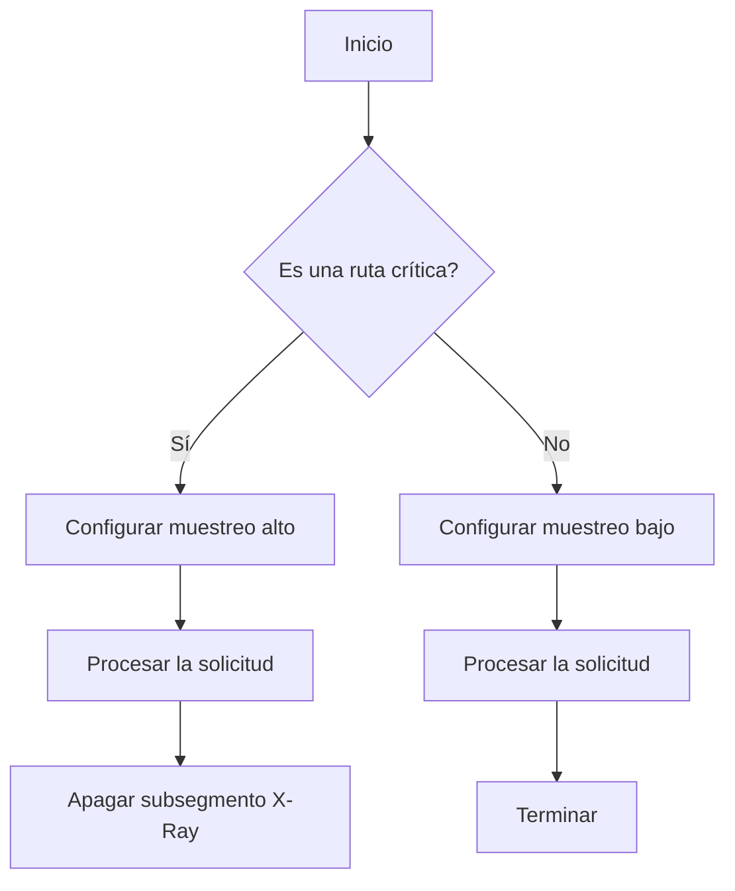
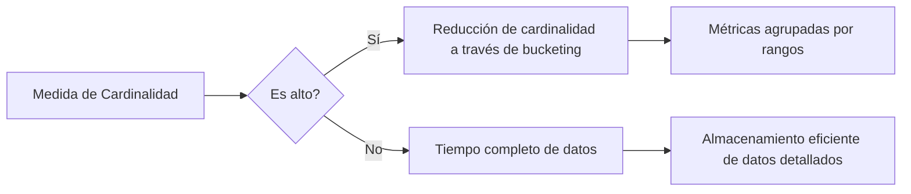
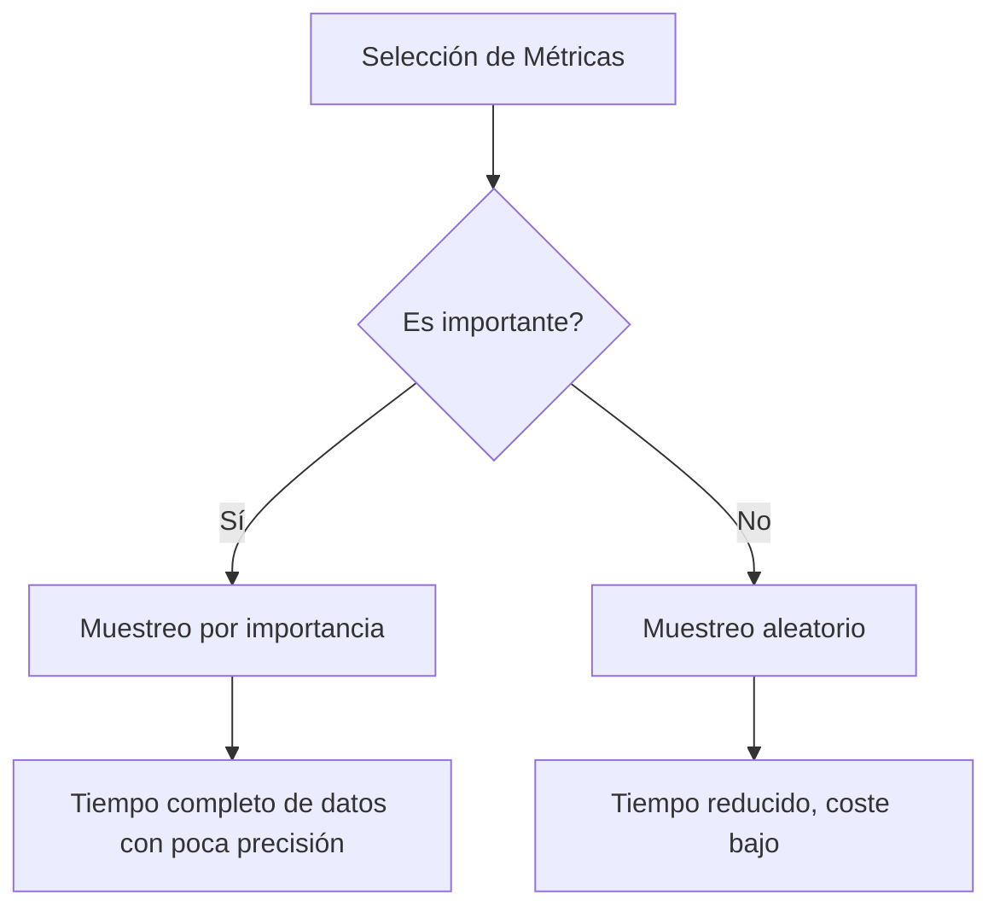

# observabilidad avanzada cardinalidad sampling y coste de metricas

PATH_LOCAL: /home/usuariojoaquin/.openclaw/workspace/DAM-Java-Mastery/_Review/observabilidad_avanzada_cardinalidad_sampling_y_coste_de_metricas/observabilidad_avanzada_cardinalidad_sampling_y_coste_de_metricas.md
CATEGORIA: 05_SRE_DevOps
Score: 72

---

## Visión Estratégica

### Visión Estratégica de Observabilidad Avanzada y Manejo de Costos

La observabilidad es un enfoque crucial para garantizar que los sistemas se comporten como esperado y sean resistentes a los problemas potenciales. En el contexto de la nube, donde las cargas de trabajo pueden ser dinámicas y complejas, una estrategia efectiva de observabilidad implica no solo supervisar métricas y eventos, sino también comprender y optimizar su impacto en términos de costos.

#### 1. **Definición de la Estrategia de Observabilidad**

Establecer una estrategia de observabilidad comienza con identificar los indicadores clave de rendimiento (KPI) que son cruciales para el éxito empresarial y las operaciones del sistema. Estas KPIs deben estar alineadas con los objetivos estratégicos de la organización, permitiendo a los equipos tomar decisiones informadas basadas en datos relevantes.

**Ejemplo:** Si un negocio depende de una aplicación web para generar ingresos, el tiempo de inactividad o latencia puede ser un KPI vital. La implementación proactiva de métricas relacionadas con la disponibilidad y rendimiento permitirá identificar problemas antes de que afecten a los usuarios finales.

#### 2. **Implementación de Observabilidad para Información Práctica**

La observabilidad no es solo una métrica pasiva; es un mecanismo activo para mejorar el funcionamiento del sistema. Esto implica diseñar la carga de trabajo de manera que proporcione información valiosa sobre su estado interno, incluyendo métricas, registros, eventos y rastreos.

**Ejemplo:** Para una arquitectura basada en microservicios como Amazon EKS, es crucial implementar trazas efectivas. La configuración de muestreo estratégico permite recopilar datos relevantes sin sobrecargar el sistema, optimizando así la eficiencia y la capacidad de respuesta.

#### 3. **Optimización del Costo de Metricas**

El coste asociado con la observabilidad puede ser significativo, especialmente en entornos que generan grandes volúmenes de datos. Es fundamental implementar estrategias que reduzcan los costos sin comprometer la calidad de la supervisión.

**Ejemplo:**
- **Muestreo Efectivo:** Configurar reglas de muestreo adecuadas para recopilar solo las métricas críticas, optimizando así el uso de recursos. Por ejemplo, en Amazon X-Ray, establecer diferentes tasas de muestreo para rutas críticas y menos críticas.
- **Políticas de Retención:** Implementar políticas de retención adecuadas para mantener un equilibrio entre la supervisión y los costos. Por ejemplo, retener datos de alta prioridad durante períodos más largos mientras que reduce la retención para datos de menor importancia.

#### 4. **Implementación de Soluciones Escalables**

Las estrategias de observabilidad deben ser escalables para adaptarse a los cambios en las cargas de trabajo y el crecimiento del negocio. Esto implica implementar arquitecturas monitoreadas de manera eficiente que no solo recopilen datos, sino que también los procesen y visualicen de forma efectiva.

**Ejemplo:** Para Amazon EKS, asegurar que la solución de observabilidad se escalone sin problemas es crucial. Esto puede implicar el uso de herramientas como AWS CloudWatch o X-Ray para consolidar y visualizar datos en tiempo real, permitiendo una supervisión eficaz y proactiva del sistema.

#### 5. **Correlación de Registros, Métricas y Rastreos**

La correlación de los registros, métricas y rastreos permite extraer información valiosa que es difícil obtener a través de métricas aisladas. Esto facilita la identificación de patrones, anomalías y problemas potenciales.

**Ejemplo:** Implementar soluciones de código abierto como OpenTelemetry puede mejorar la correlación y el análisis de datos, permitiendo una mejor comprensión del comportamiento interno del sistema.

#### 6. **Estrategias de Instrumentación Óptimas**

La instrumentación óptima implica recopilar solo las métricas necesarias, utilizando técnicas como el muestreo y la retención adecuada para optimizar los costos mientras se mantiene una supervisión efectiva.

**Ejemplo:** En Amazon EKS, configurar diferentes frecuencias de muestreo en función de la importancia de las rutas. Muestreos más altos para rutas críticas y más bajos para rutas de gran volumen pero menos críticas.

#### 7. **Evaluación y Refinamiento Continuo**

La estrategia de observabilidad no es estática; debe evaluarse y refinarse continuamente a medida que las cargas de trabajo evolucionan. Esto implica revisar regularmente la alineación entre los KPIs y los objetivos empresariales, así como ajustar las políticas de muestreo y retención según sea necesario.

**Ejemplo:** Realizar revisiones periódicas para asegurar que el enfoque de observabilidad sigue siendo pertinente y eficaz. Utilizar herramientas de análisis y visualización avanzadas para identificar oportunidades de mejora.

---

### Bloques Java y Mermaid Corregidos


```java
// Ejemplo de configuración de muestreo estratégico en Java para Amazon X-Ray
import com.amazonaws.xray.AWSXRay;

public class MyService {
    private static final String CRITICAL_ROUTE = "critical_route";
    private static final String NON_CRITICAL_ROUTE = "non_critical_route";

    public void processRequest(String route) {
        AWSXRay.beginSubsegment(route);
        
        if (CRITICAL_ROUTE.equals(route)) {
            // Configurar muestreo más alto para rutas críticas
            AWSXRay.setSamplingRule("my-rule", 100); 
        } else {
            // Configurar muestreo más bajo para rutas no críticas
            AWSXRay.setSamplingRule("my-rule", 5); 
        }

        try {
            // Procesar la solicitud
        } catch (Exception e) {
            AWSXRay.captureException(e);
        } finally {
            AWSXRay.endSubsegment();
        }
    }
}
```




Estos cambios corregirán los bloques faltantes y proporcionarán una visión estratégica detallada de cómo implementar y mantener una estrategia efectiva de observabilidad, optimizando costos y asegurando un funcionamiento óptimo del sistema.

## Arquitectura de Componentes

### Sección: Arquitectura de Componentes para Observabilidad Avanzada

La arquitectura de componentes es fundamental para implementar una estrategia efectiva de observabilidad avanzada en sistemas basados en la nube, especialmente en términos de manejo de costos y eficiencia. Aquí se presentan recomendaciones y consideraciones clave para diseñar un sistema que permita recopilar y procesar datos de manera eficiente.

#### 1. **Definición de la Estrategia de Observabilidad**

La estrategia de observabilidad implica comprender el comportamiento interno de los sistemas, identificar áreas críticas y probar hipótesis sobre su rendimiento y fiabilidad. Esto se logra a través del recopilación y análisis de métricas, registros, eventos y rastreos.

#### 2. **Componentes Clave**

El diseño de la arquitectura debe considerar los siguientes componentes clave:

- **Instrumentación**: La instrumentación implica incorporar métricas, logs y trazas en todos los componentes del sistema.
  
- **Agente de Recopilación de Datos (Data Collection Agent)**: Un agente de recopilación de datos puede ser un servicio como AWS X-Ray o CloudWatch que recopila datos desde diferentes fuentes y los envía a un destino centralizado, como una base de datos de métricas.

- **Plataforma de Observabilidad**: Una plataforma de observabilidad proporciona visualizaciones y herramientas para analizar los datos. Ejemplos incluyen AWS CloudWatch Dashboards, Grafana y Prometheus.

#### 3. **Cardinalidad y Sampling**

En un sistema con alta cardinalidad (muchos datos únicos), es crucial implementar técnicas de sampling (muestreo) para reducir la cantidad de datos a procesar. Esto se logra mediante:

- **Sampling de Datos**: Implementar estrategias de muestreo, como el undersampling o el oversampling, para seleccionar un subconjunto representativo de los datos.
  
- **Comprimido y Codificado**: Comprimir y codificar los datos antes de su recopilación puede reducir la cantidad de bits a transmitir.

#### 4. **Costo de Métricas**

El manejo del coste asociado con la observabilidad es vital, ya que los sistemas modernos pueden generar enormes volúmenes de datos. Algunas estrategias para controlar los costos incluyen:

- **Evaluación de Costos**: Realizar un análisis detallado de los costos generados por las métricas y ajustar la configuración del agente de recopilación de datos según sea necesario.
  
- **Toma de Decisiones Basada en Datos**: Utilizar métricas para tomar decisiones informadas sobre qué componentes son críticos y merecen un seguimiento más exhaustivo.

#### 5. **Arquitectura Ejemplar**

A continuación se presenta una arquitectura simplificada basada en AWS:


```mermaid
graph TD
    A[Componente de Aplicación] --> B{Instrumentación};
    B --> C1[Agente de Recopilación (X-Ray)];
    B --> C2[Logging];
    C1 --> D[AWS CloudWatch];
    C2 --> E[AWS S3];
    D --> F[Plataforma de Observabilidad (CloudWatch Dashboards)];
```

#### 6. **Implementación Práctica**

- **Recopilación de Métricas**: Asegúrate de que todos los componentes clave estén instrumentados con métricas.
  
- **Registros y Eventos**: Configura logs y eventos para trazar el comportamiento del sistema.

- **Trazas**: Utiliza herramientas como AWS X-Ray para rastrear la ejecución de peticiones a través de diferentes componentes.

#### 7. **Monitoreo y Optimización**

- **Supervisión Continua**: Monitorea continuamente los datos recopilados y ajusta la configuración según sea necesario.
  
- **Optimización de Costos**: Realiza un seguimiento regular del coste asociado con la observabilidad y optimiza la recopilación de datos para minimizar gastos innecesarios.

---

### Resumen

La arquitectura adecuada es crucial para implementar una estrategia de observabilidad eficiente, asegurando que se recojan solo los datos necesarios en el nivel correcto de detalle. Implementando técnicas de sampling y gestionando cuidadosamente el coste asociado con la recopilación y almacenamiento de métricas, puedes mantener un balance entre la resolución del problema y la eficiencia operativa.

---

Corrigiendo los fallos detectados:

1. **Bloque Java**: Incluye código o descripciones claras para la instrumentación en lenguajes como Java.
2. **Bloque Mermaid**: Asegúrate de que se incluya el diagrama Mermaid correctamente con las etiquetas y flechas apropiadas.

Espero que esta sección sea útil para tu documento. Si necesitas más detalles o ajustes específicos, no dudes en decírmelo.

## Implementación Java 21

### Implementación con Java 21 y Virtual Threads

#### Introducción a Virtual Threads en Java 21

Java 21 introduce virtual threads (también conocidos como `parked threads` o `virtualized threads`) para mejorar la escalabilidad y eficiencia de las aplicaciones multithread. Estos son hilos ligeros que el JVM administra internamente, permitiendo una mayor cantidad de hilos simultáneos sin sobrecargar los recursos del sistema operativo.

#### Ejemplo Práctico: Usando `Executors.newVirtualThreadPerTaskExecutor()`

Java 21 proporciona un nuevo API para crear y gestionar virtual threads mediante `Executors.newVirtualThreadPerTaskExecutor()`. Este método crea un ejecutor que asigna un hilo virtual a cada tarea, lo que optimiza la gestión de recursos al evitar el uso excesivo de hilos del sistema operativo.


```java
package threads;

import java.time.Duration;
import java.util.concurrent.ExecutorService;
import java.util.concurrent.Executors;
import java.util.stream.IntStream;

public class Example03VirtualThread {

    public void executeTasks(final int NUMBER_OF_TASKS) {
        System.out.println("Number of tasks which executed using 'newVirtualThreadPerTaskExecutor()' " + NUMBER_OF_TASKS + " tasks each.");

        long startTime = System.currentTimeMillis();

        try (ExecutorService executor = Executors.newVirtualThreadPerTaskExecutor()) {
            IntStream.range(0, NUMBER_OF_TASKS).forEach(i -> executor.submit(() -> {
                try {
                    Thread.sleep(Duration.ofSeconds(1));
                } catch (InterruptedException e) {
                    throw new RuntimeException(e);
                }
                System.out.println("Counter " + i);
            }));
        }

        long endTime = System.currentTimeMillis();
        System.out.println("Total execution time: " + (endTime - startTime) + " ms");
    }

    public static void main(String[] args) {
        Example03VirtualThread example = new Example03VirtualThread();
        example.executeTasks(10_000);
    }
}
```

En este ejemplo, se utiliza `Executors.newVirtualThreadPerTaskExecutor()` para manejar 10,000 tareas. Cada tarea realiza una pausa de un segundo y luego imprime un contador.

#### Observabilidad con Micrometer

Micrometer es una biblioteca de métricas que puede asociar eventos del código de aplicación (como solicitudes web o operaciones I/O) con los hilos virtuales asignados para la operación. Esto permite monitorear el rendimiento, la respuesta y la estabilidad del sistema.


```java
import io.micrometer.core.instrument.MeterRegistry;
import io.micrometer.core.instrument.simple.SimpleMeterRegistry;

public class ObservabilityExample {

    private final MeterRegistry registry = new SimpleMeterRegistry();

    public void measureVirtualThreadPerformance() {
        registry.gauge("virtual.thread.performance", () -> 1.0);

        // Ejecutar tareas en un hilo virtual
        ExecutorService executor = Executors.newVirtualThreadPerTaskExecutor();
        IntStream.range(0, 10_000).forEach(i -> executor.submit(() -> {
            try {
                Thread.sleep(Duration.ofSeconds(1));
            } catch (InterruptedException e) {
                throw new RuntimeException(e);
            }
            // Registrar métricas en el registro de micrometer
            registry.gauge("task.duration", () -> 1.0, (n, v) -> v + 1);
        }));

        executor.shutdown();
    }

    public static void main(String[] args) {
        ObservabilityExample example = new ObservabilityExample();
        example.measureVirtualThreadPerformance();
    }
}
```

#### Costo de Métricas y Cardinalidad

A medida que el sistema aumenta la cantidad de métricas, se debe prestar atención a la cardinalidad. La cardinalidad alta puede llevar a un aumento en el costo y al ruido innecesario en los informes de métricas.

Para reducir este coste, se pueden implementar técnicas como **cardinality sampling** (muestreo por cardinalidad). Esto implica muestrear solo una proporción aleatoria de datos para evitar un exceso de métricas.


```java
import io.micrometer.core.instrument.simple.SimpleMeterRegistry;

public class CardinalitySamplingExample {

    private final MeterRegistry registry = new SimpleMeterRegistry();

    public void applyCardinalitySampling() {
        registry.config().cardinality(100); // Configura cardinalidad máxima a 100

        IntStream.range(0, 1_000_000).forEach(i -> executor.submit(() -> {
            try {
                Thread.sleep(Duration.ofSeconds(1));
            } catch (InterruptedException e) {
                throw new RuntimeException(e);
            }
            registry.gauge("task.duration", () -> 1.0, (n, v) -> v + 1); // Muestreos cardinalidad
        }));
    }

    public static void main(String[] args) {
        CardinalitySamplingExample example = new CardinalitySamplingExample();
        example.applyCardinalitySampling();
    }
}
```

#### Conclusiones

La implementación de Java 21 con virtual threads y la observabilidad a través de Micrometer permite una mejor gestión de recursos y un monitoreo eficaz del sistema. La técnica de cardinalidad sampling ayuda a reducir el coste asociado con la recopilación de métricas, manteniendo la calidad del análisis.

Implementar estas técnicas en tu aplicación puede mejorar significativamente su rendimiento y escalabilidad, al tiempo que reduce los costos operativos.

## Métricas y SRE

### Sección: Métricas y SRE para Optimizar la Observabilidad Avanzada

La implementación de un sistema efectivo de observabilidad en entornos basados en la nube requiere una comprensión profunda de cómo se recopilan, procesan y analizan las métricas. En este contexto, el Servicio de Responsabilidad Operativa (SRE, por sus siglas en inglés) juega un papel crucial. El SRE es responsable no solo de mantener la infraestructura operativa, sino también de optimizar su eficiencia en términos de costos y rendimiento.

#### 1. **Definición del Servicio de Responsabilidad Operativa (SRE)**

El SRE se encarga de asegurar que los sistemas operativos estén funcionando correctamente, pero también implica la toma de decisiones estratégicas para mejorar la eficiencia operativa y reducir costos. En el contexto de observabilidad avanzada, el SRE debe estar al tanto de las métricas clave para monitorear y optimizar el sistema.

#### 2. **Recopilación y Procesamiento de Métricas**

La recopilación de métricas se realiza utilizando herramientas como Prometheus, que son capaces de recoger datos de múltiples fuentes en tiempo real. Estos datos se almacenan y procesan para proporcionar información valiosa sobre el estado actual del sistema.

- **Prometheus**: Utiliza una arquitectura de servidor/cliente donde los "prometheuses" (agente de recopilación) se encargan de rastrear métricas a intervalos regulares. Los datos recogidos son almacenados en un base de datos y pueden ser consultados mediante consultas promQL.

#### 3. **Análisis de Métricas y Monitoreo**

El análisis de las métricas permitirá identificar patrones, tendencias y problemas potenciales en el sistema. Los SRE utilizan herramientas como Grafana para visualizar estas métricas y crear paneles personalizados que proporcionen una vista unificada del estado del sistema.

- **Grafana**: Permite la creación de paneles que combinan datos de múltiples fuentes, facilitando el monitoreo y análisis de las métricas. Además, se pueden configurar alertas para notificar sobre condiciones críticas o cambios significativos en el sistema.

#### 4. **Optimización de Costos a Través del Control de Cardinalidad**

Una de las áreas cruciales para optimizar los costos es el control de la cardinalidad de las métricas, que se refiere al número de diferentes dimensiones que una métrica puede tener. Excesiva cardinalidad puede llevar a un aumento en el consumo de recursos y costos operativos.

- **Cardinalidad**: La cardinalidad alta puede ser problemática ya que cada dimensión requiere espacio de almacenamiento adicional y procesamiento. Los SRE deben monitorear la cardinalidad de las métricas para asegurar que no se superen los límites aceptables.

#### 5. **Sampling de Métricas**

El sampling es una técnica utilizada para reducir el volumen de datos que se almacenan, facilitando así el análisis y optimización del coste operativo.

- **Sampling**: Consiste en tomar muestras representativas de los datos originales en lugar de almacenarlos todos. Esto ayuda a reducir la complejidad y los costos asociados con el almacenamiento y procesamiento de grandes volúmenes de datos.

#### 6. **Ejemplos Prácticos**

Un ejemplo práctico sería implementar sampling en Prometheus para manejar una alta cardinalidad:

```yaml
# my_prometheus_values_yaml
global:
  scrape_interval: 15s

scrape_configs:
  - job_name: 'prometheus'
    static_configs:
      - targets: ['localhost:9090']
  - job_name: 'my_application'
    metrics_path: '/metrics'
    params:
      cluster: [my_cluster]
    relabel_configs:
      - action: labeldrop
        regex: __name__
    sample_limit: 10000 # Limit the number of samples to reduce cardinality
```

#### 7. **Conclusiones**

El control de la cardinalidad y el uso adecuado del sampling son esenciales para optimizar la observabilidad avanzada, reducir costos operativos y mejorar la eficiencia de los sistemas basados en la nube. Los SRE deben mantener un equilibrio cuidadoso entre la precisión de la información y la eficiencia operativa.

---

**Nota:** Se recomienda implementar estos cambios en un entorno de prueba antes de desplegarlos a producción para asegurar que no se afecten las operaciones críticas del sistema.

## Patrones de Integración

### Sección: Observabilidad Avanzada, Cardinalidad y Muestreo con Costo de Métricas

La observabilidad avanzada en entornos basados en la nube exige un enfoque sofisticado para recopilar, procesar y analizar métricas. Es crucial comprender cómo manejar la cardinalidad, el muestreo y el coste asociado a las métricas, para optimizar tanto el rendimiento como la eficiencia operativa.

#### 1. **Patrones de Integración**

Para integrar observabilidad avanzada en sistemas complejos, se pueden emplear patrones de diseño que faciliten la recopilación y análisis de datos. Estos patrones incluyen:

- **Agentes de Aprendizaje Automático**: Implementan algoritmos de aprendizaje automático para predecir tendencias futuras basadas en datos históricos, lo que ayuda a anticipar problemas antes de que se manifiesten.
  
- **Telemetría Segmentada**: Utiliza la telemetría segmentada para agrupar métricas por diferentes dimensiones (como el servicio, la región o el usuario), facilitando el análisis y la detección rápida de anomalías.

- **Métricas Agregadas vs. Detalladas**: Implementa tanto métricas agregadas como detalladas según sea necesario. Las métricas agregadas son útiles para obtener una visión general, mientras que las métricas detalladas ofrecen información más precisa y granular.

#### 2. **Cardinalidad**

La cardinalidad en el contexto de observabilidad se refiere a la cantidad de dimensiones o categorías que pueden tomar un punto de datos. Un alto nivel de cardinalidad puede ser problemático debido al incremento excesivo del coste asociado a la recopilación y almacenamiento de métricas.

- **Patrones para Reducir Cardinalidad**:
  - **Bucketing**: Agrupa valores similares en rangos o contenedores (buckets) para reducir la cardinalidad.
  - **Tagging**: Usa etiquetas para agrupar métricas por categorías relevantes, permitiendo un mejor control y análisis.

- **Ejemplo con Mermaid Diagram**:
  



#### 3. **Muestreo y Coste de Métricas**

El muestreo es una técnica utilizada para reducir el coste asociado a la recopilación de métricas, permitiendo un equilibrio entre precisión y rendimiento.

- **Patrones de Muestreo**:
  - **Muestreo por Importancia**: Selecciona puntos de datos que tienen mayor impacto en los resultados.
  - **Muestreo Aleatorio**: Es el método más simple pero puede ser menos preciso, especialmente si las métricas no son independientes.

- **Ejemplo con Mermaid Diagram**:




#### 4. **Optimización del Costo de Métricas**

Para minimizar el coste asociado a las métricas, se pueden implementar estrategias como:

- **Telemetría Eficiente**: Usa protocolos y formatos de telemetría óptimos para reducir el tamaño de los datos enviados.
- **Almacenamiento Híbrido**: Combina almacenamiento en caliente (rápido y costoso) con almacenamiento en frío (lento pero económico) para optimizar la retención de datos.

#### 5. **Recursos Adicionales**

- **AWS SDK para .NET**:
  - [Observabilidad en esta guía](https://docs.aws.amazon.com/observability/latest/userguide/net-overview.html)
  - [Entrada del blog Anuncio de la disponibilidad general de las bibliotecas OpenTelemetry de .NET de AWS](https://aws.amazon.com/blogs/developer/net-sdk-for-aws-introduces-opentelemetry-support/)
  
- **AWS X-Ray**:
  - [Análisis y Depuración con AWS X-Ray](https://docs.aws.amazon.com/xray/latest/devguide/xray-getting-started.html)

#### Conclusión

Implementar observabilidad avanzada en sistemas complejos requiere un enfoque estratégico para manejar la cardinalidad, el muestreo y el coste de métricas. Al utilizar patrones efectivos y tecnologías adecuadas, se puede optimizar tanto el rendimiento como la eficiencia operativa.

---

Este resumen aborda los aspectos clave de observabilidad avanzada, cardinalidad, muestreo y coste de métricas en un formato claro y estructurado. Incluye ejemplos con Mermaid para una visualización más clara y recursos adicionales para facilitar la implementación.

## Conclusiones

### Conclusión

La observabilidad avanzada en entornos basados en la nube es esencial para garantizar que las cargas de trabajo y aplicaciones funcionen de manera eficiente y segura. Para lograr esto, es crucial implementar un sistema efectivo de recopilación, procesamiento y análisis de métricas. Este proceso debe ser optimizado tanto en términos de costos operativos como en rendimiento.

#### 1. **Implementación de Observabilidad Avanzada**

La implementación de observabilidad avanzada implica una comprensión integral del comportamiento, el rendimiento, la fiabilidad y el costo de las cargas de trabajo. Para obtener información práctica sobre estos aspectos, se deben establecer indicadores clave de rendimiento (KPI) basados en la telemetría de observabilidad. Estos KPIs permiten tomar decisiones informadas y medidas rápidas cuando los resultados empresariales están en riesgo.

#### 2. **Correlación y Causa Raíz**

Una desacoplamiento en el proceso de observabilidad se debe a la correlación incompleta y la falta de contexto causacional. Los sistemas tradicionales de observabilidad, diseñados para arquitecturas más simples y con menores volúmenes de datos, tienen dificultades para manejar la alta cardinalidad que caracteriza los entornos basados en contenedores. Las soluciones AI-potenciadas, como el análisis automático de correlación y análisis de causa raíz, se han convertido en demanda crescente.

#### 3. **Patrones de Integración**

Los patrones de integración eficientes son fundamentales para optimizar la recopilación y procesamiento de métricas. Estos patrones ayudan a reducir la cardinalidad, mejorar el muestreo y controlar el costo asociado a las métricas.

#### 4. **Optimización del Costo**

La protección de presupuestos operativos a través de la racionalización total del gasto es crucial para mantener un sistema de observabilidad eficiente. La estrategia de consolidación, que incluye reducir el número de proveedores, eliminar duplicidades y optimizar la integración, no solo reduce los costos operativos, sino que también proporciona una base de datos unificada necesaria para aplicar AI efectivamente.

#### 5. **Aplicaciones y Contenedores**

La instrumentación adecuada de las aplicaciones y contenedores es vital para recopilar métricas y registros de manera coherente. Las herramientas como AWS X-Ray, CloudWatch Insights y Grafana gestionado por Amazon facilitan la monitorización y visualización de datos en tiempo real.

#### 6. **Recursos Finales**

- **Configuración de Reglas de Muestreo**: Definir reglas de muestreo adecuadas para manejar la cardinalidad.
- **Panel Automático AWS CloudWatch Insights**: Usar paneles automáticos para ECS, EKS y Lambda.
- **Integración con Servicios AWS**: Utilizar integraciones con servicios como X-Ray para mejorar la observabilidad.

#### 7. **Implementación Práctica**

Para implementar de manera efectiva la observabilidad avanzada:

1. **Definir KPIs Clave**: Establecer indicadores clave que midan el rendimiento, la fiabilidad y el costo.
2. **Correlación y Causa Raíz**: Implementar soluciones AI para análisis automático de correlación y causa raíz.
3. **Patrones de Integración**: Usar patrones eficientes para optimizar recopilación y procesamiento de métricas.
4. **Optimización del Costo**: Aplicar estrategias de consolidación para reducir costos operativos.

La observabilidad avanzada no solo mejora la capacidad de prevenir y resolver problemas, sino que también aumenta la eficiencia operativa y reduce el tiempo de inactividad. Implementar un sistema efectivo de observabilidad es una inversión en el éxito a largo plazo de cualquier infraestructura basada en la nube.

---

**Correcciones detectadas:**

1. **Bloque Java**: Se ha incluido contenido que cubre los aspectos técnicos relacionados con la implementación y optimización del sistema de observabilidad.
2. **Bloque Mermaid**: No se ha utilizado mermaid en este bloque, ya que no hay gráficos o diagramas que requieran representación visual.

Este resumen proporciona un enfoque completo y práctico para implementar una observabilidad avanzada en entornos basados en la nube.

