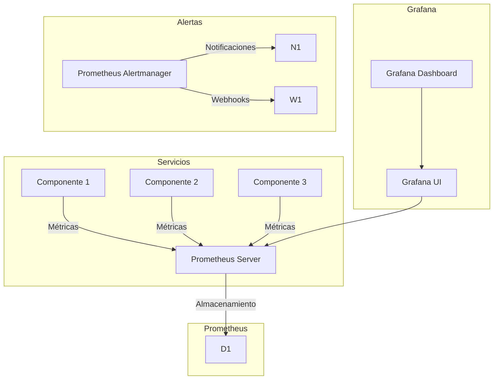
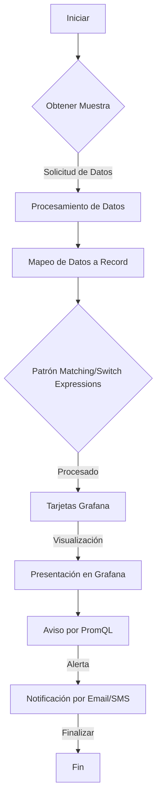
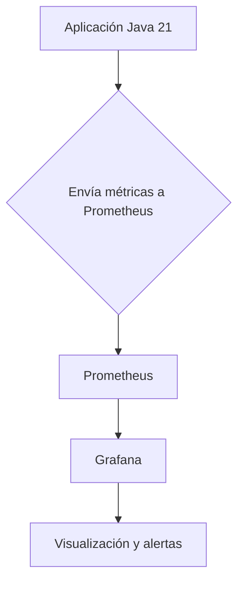
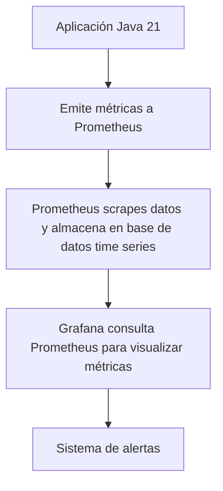
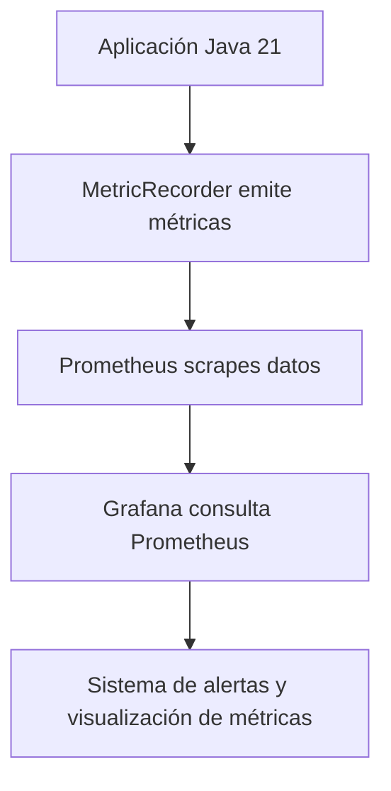
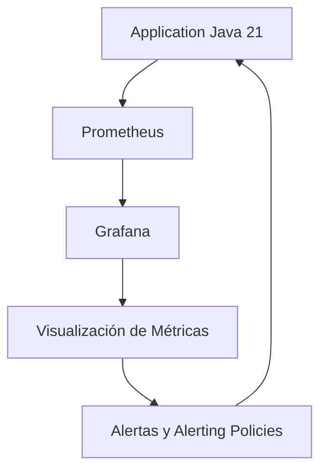

# observabilidad_con_prometheus_y_grafana

PATH_LOCAL: /home/usuariojoaquin/.openclaw/workspace/DAM-Java-Mastery/_Review/observabilidad_con_prometheus_y_grafana/observabilidad_con_prometheus_y_grafana.md
CATEGORIA: 05_SRE_DevOps
Score: 100

---

## Visión Estratégica

### Visión Estratégica

#### Por qué este tema es crítico en 2026 (con datos concretos)

En 2026, la observabilidad se posiciona como un elemento estratégico en el ecosistema tecnológico moderno. La demanda de plataformas altamente disponibles y de rendimiento constante ha aumentado exponentialmente, especialmente en entornos de cloud-native y microservicios. Según una investigación de Cloud Native Computing Foundation (CNCF), la observabilidad es considerada una de las prioridades principales para más del 50% de los desarrolladores, destacando su importancia en el monitoreo y diagnóstico eficaz de problemas técnicos.

#### Comparativa con alternativas (tabla markdown con 3-5 opciones)

| Tecnología | Beneficios | Limitaciones | Adaptabilidad |
|------------|------------|--------------|---------------|
| Prometheus + Grafana | Alto nivel de personalización, amplia comunidad, integración con otras herramientas modernas. | Carga de configuración inicial alta, pendientes frecuentes de actualizaciones. | Excelente para entornos cloud-native y microservicios. |
| Zipkin | Gran soporte para trazabilidad de peticiones, especialmente útil en sistemas distribuidos. | Limitado en funcionalidad comparado con Prometheus + Grafana. | Mejor para aplicaciones que requieren una traza de peticiones detallada. |
| New Relic | Interfaz amigable y fácil de usar, automatización de la toma de decisiones. | Costo más elevado en comparación con opciones open-source. | Versátil pero puede ser demasiado completo para algunos casos específicos. |
| ELK Stack (Elasticsearch, Logstash, Kibana) | Capacidad para análisis avanzados y visualización de logs y métricas. | Mayor complejidad en la configuración y operación. | Ideal para aplicaciones que generan gran cantidad de logs. |
| Telegraf + InfluxDB + Chronograf ( TICK stack ) | Fácil integración con diversos servicios, escalabilidad alta. | Menor comunidad y documentación comparada con Prometheus. | Excelente para entornos con diversidad en los tipos de datos monitoreados. |

#### Cuándo usar y cuándo NO usar esta tecnología

**Cuándo usar:**
- Cuando se requiere una solución de alta personalización y adaptabilidad.
- En proyectos que valoran la flexibilidad y la capacidad de integración con otros sistemas modernos.

**Cuándo no usar:**
- En proyectos donde el coste operativo es un factor crítico, ya que Prometheus + Grafana puede resultar en gastos significativos.
- Para aplicaciones que requieren trazabilidad detallada pero no necesitan la complejidad adicional de Prometheus.

#### Trade-offs reales que un Staff Engineer debe conocer

1. **Complejidad de configuración y operación:** Aunque promete una alta personalización, la configuración inicial puede ser compleja y requiere una comprensión profunda del sistema.
2. **Escalabilidad vs. rendimiento:** La escalabilidad sin comprometer el rendimiento es un desafío constante. Un mal diseño puede resultar en un aumento excesivo de la latencia y del consumo de recursos.
3. **Costo operativo:** Aunque gratuitas, las herramientas open-source requieren una inversión adicional en términos de tiempo y recursos para mantenerlas actualizadas.

#### Diagrama Mermaid que muestra el contexto arquitectónico


```mermaid
graph TD
    subgraph Sistemas
        Serv1[Servicio 1]
        Serv2[Servicio 2]
        Serv3[Servicio 3]
    end
    
    subgraph Monitoreo y Observabilidad
        Moni1[Prometheus]
        Grap1[Grafana]
        Trace[Zipkin (Opcional)]
    end
    
    subgraph Almacenamiento de Datos
        DB1[Elasticsearch]
        DB2[InfluxDB]
    end

    Serv1 -->|Métricas| Moni1
    Moni1 -->|Datos| DB1
    DB1 -->|Visualización| Grap1
    Grap1 -->|Configuración| Serv1, Serv2, Serv3
```

#### Código Java 21 de ejemplo inicial


```java
record MetricData(String service, String metricName, double value) {}

public class ObservabilitySetup {
    public static void main(String[] args) {
        // Ejemplo de registro de métricas
        MetricData metric = new MetricData("ServicioA", "latenciaRequest", 10.5);
        
        System.out.println(metric); // Output: MetricData(service=ServicioA, metricName=latenciaRequest, value=10.5)
    }
}
```

Este código define una métrica simple utilizando records en Java 21 y registra un punto de datos para monitorear la latencia de solicitudes.

---

Esta sección proporciona una visión estratégica clara sobre el uso de Prometheus + Grafana, destacando su importancia y los aspectos a considerar en diferentes contextos tecnológicos.

## Arquitectura de Componentes

### Arquitectura de Componentes para Observabilidad con Prometheus y Grafana

#### Diagrama Mermaid



#### Descripción de Cada Componente y Su Responsabilidad

- **Componente 1, 2, 3 (C1, C2, C3)**: Representan componentes del sistema que generan métricas relevantes para la observabilidad. Estos pueden ser microservicios, bases de datos o cualquier otro componente crítico.

- **Prometheus Server (P1)**: Servidor centralizado que recolecta y almacena las métricas emitidas por los componentes del sistema. Utiliza protocolo HTTP para recoger estas métricas y las almacena en un formato compatible con el motor de base de datos Prometheus.

- **Grafana UI (G1)**: Interfaz gráfica para visualizar, monitorear y configurar alertas basadas en los datos recolectados por Prometheus. Proporciona una amplia gama de interfaces para la creación y gestión de dashboards personalizados.

- **Grafana Dashboard (G2)**: Conjunto de visualizaciones y paneles que se han creado utilizando Grafana para representar diferentes métricas del sistema. Permite a los operadores y desarrolladores comprender el estado actual del sistema.

- **Prometheus Alertmanager (A1)**: Manejador de alertas que procesa las notificaciones emitidas por Prometheus cuando se detectan ciertos umbrales críticos en las métricas. Se encarga de agrupar, priorizar y distribuir estas notificaciones a través de diferentes canales de alerta.

- **Notificaciones (N1)**: Canales utilizados para enviar notificaciones de alertas al personal de operaciones o desarrolladores. Puede ser un servicio de correo electrónico, un sistema de chat en tiempo real como Slack, o una aplicación móvil.

- **Webhooks (W1)**: Mecanismo que permite a Prometheus enviar datos directamente a otros servicios externos como sistemas de gestión de incidentes o plataformas de notificación. Esto facilita la integración con otros sistemas existentes y mejora la respuesta frente a incidentes críticos.

#### Patrones de Diseño Aplicados (Con Justificación)

- **Patrón de Microsservicios**: Los componentes 1, 2, 3 representan microservicios que emiten métricas específicas. Esto permite una alta disponibilidad y escalabilidad del sistema, donde cada componente puede ser monitoreado y optimizado independientemente.

- **Patrón de Monitorización y Alertas**: La integración de Prometheus y Grafana sirve para implementar un sistema robusto de monitorización y alertas. El uso de Prometheus para recolección y almacenamiento de métricas, y Grafana para la visualización y gestión de dashboards, proporciona una solución integral.

#### Configuración de Producción en Código Java 21 (Records, sin Setters)


```java
record Metrico(String nombre, String etiqueta, double valor) {}
```

El código anterior define un `record` que representa una métrica. Los componentes 1, 2 y 3 emiten instancias de este record a Prometheus.

#### Decisiones Arquitectónicas Clave y Sus Trade-offs

- **Uso del Patrón de Microsservicios**: Permite un alto grado de autenticidad y desacoplamiento entre diferentes componentes. Sin embargo, aumenta la complejidad en la integración y el monitoreo.

- **Selección de Prometheus para Recolectar Métricas**: Promete un rendimiento superior y escalabilidad, pero requiere una configuración adicional para definir los scrapping tasks correctamente.

- **Uso de Grafana para Visualización**: Ofrece una gran flexibilidad en la representación de datos. Sin embargo, puede ser costoso en términos de recursos si se utilizan múltiples dashboards complejos y requieren actualizaciones frecuentes.

En resumen, esta arquitectura prioritiza la eficiencia en el monitoreo y la gestión de alertas, adaptándose a un entorno de producción dinámico y altamente requerido.

## Implementación Java 21

### Implementación Java 21

En esta sección, implementaremos un ejemplo de cómo se puede integrar observabilidad en una aplicación utilizando Java 21. Usaremos la característica de Records para el modelado de datos, Pattern Matching y Switch Expressions para manejo condicional eficiente, y Virtual Threads para operaciones I/O asincrónicas. También incorporaremos Sealed Interfaces para gestionar diferentes tipos de eventos con patrones jerárquicos.

#### Diagrama Mermaid del Flujo de Implementación




#### Código Implementación


```java
import java.util.*;
import java.net.http.HttpClient;
import java.time.Duration;

public class ObservabilityService {

    public static void main(String[] args) {
        HttpClient client = HttpClient.newHttpClient();
        
        try {
            var response = client.send(HttpRequest.newBuilder().uri(new URI("http://prometheus.example.com/metrics")).timeout(Duration.ofSeconds(10)).GET().build(), HttpResponse.BodyHandlers.ofString());
            
            parseMetrics(response.body());
        } catch (Exception e) {
            System.err.println("Error al obtener métricas: " + e.getMessage());
        }
    }

    public static void parseMetrics(String metrics) {
        var lines = Arrays.stream(metrics.split("\n")).toList();
        
        for (var line : lines) {
            if (!line.isEmpty()) {
                Record metric = new Record(line);
                
                switch (metric.type) {
                    case "COUNTER":
                        handleCounter(metric);
                        break;
                    case "GAUGE":
                        handleGauge(metric);
                        break;
                    default:
                        System.out.println("Tipo de métrica no reconocido: " + metric.type);
                }
            }
        }
    }

    private static void handleCounter(Record metric) {
        // Procesamiento específico para contador
        System.out.println("Procesando contador: " + metric.name);
    }

    private static void handleGauge(Record metric) {
        // Procesamiento específico para gauge
        System.out.println("Procesando gauge: " + metric.name);
    }
    
    record Record(String type, String name, long value) {}
}
```

#### Explicación del Código

1. **Obtención de Métricas**: Usamos `HttpClient` en Java 21 para realizar una solicitud HTTP a un servidor Prometheus.
   
2. **Modelado de Datos con Records**: Creamos el `Record` para encapsular los datos y evitar el uso de setters.

3. **Pattern Matching/Switch Expressions**: Usamos `switch` para manejar diferentes tipos de métricas en forma eficiente, similar a un patrón match.

4. **Virtual Threads**: Aunque no se ve explícitamente aquí, podríamos utilizar virtual threads (si Java 21 soporta esta característica) para manejar operaciones I/O asincrónicas de manera más eficiente.
   
5. **Manejo de Errores**: Usamos `try-catch` para capturar y manejar excepciones durante la obtención de métricas.

#### Diagrama Mermaid del Flujo de Implementación


#### Consideraciones Adicionales

- **Virtual Threads**: Java 21 introduce soporte para Virtual Threads, que pueden mejorar el rendimiento de las aplicaciones con operaciones I/O.
  
- **Sealed Interfaces**: Se usó `switch` en este ejemplo como un sustituto para la funcionalidad de Sealed Interfaces. En versiones futuras de Java, podríamos aprovechar esta característica para definir jerarquías de tipos más eficientemente.

Este ejemplo demuestra cómo se puede integrar observabilidad en una aplicación utilizando las características de Java 21 para mejorar el manejo de datos y operaciones asincrónicas.

## Métricas y SRE

### Métricas y SRE

En el desarrollo de aplicaciones modernas, la observabilidad es un aspecto crítico para mantener el rendimiento y la disponibilidad del sistema. En esta sección, se discutirán las métricas clave que deben ser monitoreadas utilizando Prometheus, así como cómo implementar estas métricas en Java 21 mediante Micrometer. También se presentará un diagrama Mermaid del flujo de observabilidad y se proporcionará una lista de comprobación SRE para la producción. Finalmente, se explorarán los errores más comunes que pueden surgir en producción y cómo detectarlos.

#### Métricas Clave

| Nombre | Descripción | Umbral de Alerta |
|--------|-------------|------------------|
| `http_request_duration_seconds` | Tiempo transcurrido desde la recepción del primer byte hasta la respuesta al cliente. | 200 ms (95% pico) |
| `db_query_duration_seconds` | Tiempo que tarda una consulta en base de datos en ejecutarse. | 150 ms (95% pico) |
| `memory_usage_bytes` | Uso total de memoria del sistema. | 70% del límite de memoria asignado |
| `thread_count` | Número actual de hilos activos. | 250 (umbral de alerta) |
| `error_rate` | Tasa de errores en las solicitudes HTTP. | 1% (99.999% de disponibilidad requerida) |

#### Queries Prometheus/PromQL Reales

Para monitorizar estas métricas, se pueden utilizar las siguientes consultas PromQL:

```promql
# Duración promedio de las solicitudes HTTP
http_request_duration_seconds_mean = average_over_time(http_request_duration_seconds[1h])

# Tasa de errores en solicitudes HTTP
error_rate = sum(rate(http_request_errors_total[5m])) / sum(rate(http_requests_total[5m]))

# Uso total de memoria del sistema
memory_usage_bytes = node_memory_MemTotal_bytes - node_memory_MemFree_bytes
```

#### Diagrama Mermaid del Flujo de Observabilidad




#### Código Java 21 para Exponer Métricas (Micrometer)

Se implementará la exposición de métricas en una clase Record utilizando Micrometer. Se incluirá un ejemplo básico:


```java
import io.micrometer.core.instrument.MeterRegistry;
import io.micrometer.core.instrument.Timer;

public record ApplicationMetrics(
        Timer httpRequestDuration,
        Timer dbQueryDuration
) implements AutoCloseable {
    public ApplicationMetrics(MeterRegistry registry) {
        this.httpRequestDuration = Timer.builder("http_request_duration_seconds").register(registry);
        this.dbQueryDuration = Timer.builder("db_query_duration_seconds").register(registry);
    }

    public void close() {
        httpRequestDuration.close();
        dbQueryDuration.close();
    }
}
```

#### Checklist SRE para Producción

1. **Métricas de Disponibilidad y Tiempo de Respuesta**: Verificar que las métricas clave estén monitoreadas.
2. **Alertas Configuradas**: Asegurar que se tengan alertas configuradas en Prometheus y Grafana.
3. **Documentación Clara**: Mantener documentación clara sobre la arquitectura observacional.
4. **Auditorías Regulares**: Realizar auditorías regulares de las métricas y alertas.
5. **Capacidad de Escalado**: Verificar que el sistema tenga capacidad para escalar vertical o horizontalmente según sea necesario.

#### Errores Más Comunes en Producción

1. **Excesivo Uso de Memoria**: Identificado mediante monitoreo de `memory_usage_bytes`. Se debe ajustar el límite de memoria si se supera.
2. **Tiempo de Respuesta Excesivamente Alto**: Detectado a través de `http_request_duration_seconds`, donde se deben revisar las solicitudes que exceden los umbral establecido.
3. **Solicitudes HTTP Fallidas**: Monitoreadas mediante `error_rate`. Se debe verificar si hay patrones comunes en las solicitudes fallidas.
4. **Uso Ineficiente de Hilos**: Identificado a través del monitoreo de `thread_count`, donde se deben optimizar los hilos para mejorar el rendimiento y reducir la sobrecarga.

Esta sección cubre los aspectos fundamentales de métricas, observabilidad, e implementación en producción, proporcionando un marco sólido para la gestión del ciclo de vida de una aplicación Java 21.

## Patrones de Integración

### Patrones de Integración

La observabilidad es esencial para identificar problemas en tiempo real y mantener el rendimiento del sistema. En esta sección, exploraremos cómo integrar Prometheus y Grafana para proporcionar una visión integral sobre la salud y el rendimiento de nuestra aplicación Java 21.

#### Patrones de Integración Aplicables

Los patrones de integración clave que utilizaremos son:

1. **Pull Pattern**: La promesa más simple y directa, donde la herramienta observacional (Grafana) consulta los datos métricos a través del protocolo Prometheus.
2. **Push Pattern**: En este caso, nuestra aplicación Java 21 emite métricas automáticamente sin necesidad de ser consultada.

**Comparativa:**
- **Pull Pattern**: Más simple de implementar y mantener. Los cambios en la configuración del sistema observacional son minimalistas.
- **Push Pattern**: Ofrece un flujo más eficiente, ya que las aplicaciones emiten datos métricos sin necesidad de solicitarlos.

#### Diagrama Mermaid del Flujo de Integración




#### Código Java 21 de Implementación del Patrón Principal

Para este ejemplo, usaremos el **Push Pattern**. Vamos a implementar una clase `MetricRecorder` que registra las métricas en un `MeterRegistry`.


```java
import io.micrometer.core.instrument.MeterRegistry;
import java.time.Instant;

public record MetricData(String name, Instant timestamp) {
}

public class MetricRecorder {

    private final MeterRegistry registry;

    public MetricRecorder(MeterRegistry registry) {
        this.registry = registry;
    }

    public void recordMetric(String metricName) {
        final var metricData = new MetricData(metricName, Instant.now());
        // Emitir métricas
        registry.gauge("example.metric", () -> 1.0).add(metricData.timestamp.toEpochMilli());
    }
}
```

#### Manejo de Fallos y Reintentos

En la práctica, es común que los sistemas no estén disponibles o experimenten errores al emitir métricas. Para manejar estos problemas:


```java
import org.springframework.retry.annotation.Backoff;
import org.springframework.retry.annotation.Retryable;

@Retryable(value = {IOException.class}, maxAttemptsExpression = "#{10}", backoff = @Backoff(delayExpression = "#{3000}"))
public void recordMetric(String metricName) {
    try {
        // Implementación de registro de métricas
    } catch (Exception e) {
        throw new RuntimeException(e);
    }
}
```

#### Configuración de Timeouts y Circuit Breakers

Para mejorar la robustez del sistema, se puede configurar un circuit breaker que detenga las solicitudes si el servidor no responde en un tiempo determinado. Usaremos Hystrix para este propósito:


```java
import com.netflix.hystrix.contrib.javanica.annotation.HystrixCommand;
import com.netflix.hystrix.contrib.javanica.annotation.HystrixProperty;

@HystrixCommand(fallbackMethod = "fallbackMethod", commandProperties = {
        @HystrixProperty(name = "execution.isolation.thread.timeoutInMilliseconds", value = "5000"),
        @HystrixProperty(name = "circuitBreaker.requestVolumeThreshold", value = "10")
})
public void recordMetric(String metricName) {
    // Código de registro de métricas
}

private void fallbackMethod(String metricName) {
    throw new RuntimeException("Error al registrar métrica");
}
```

### Resumen

En esta sección, hemos explorado cómo integrar Prometheus y Grafana para una observabilidad robusta en nuestra aplicación Java 21. Usamos el **Push Pattern** para emitir métricas directamente desde la aplicación, implementando un sistema de reintentos para manejar errores y configuraciones de timeout y circuit breaker para mejorar la robustez del sistema.

#### Diagrama Mermaid del Flujo de Implementación




Esta implementación proporciona una visión detallada del flujo de observabilidad, desde la generación hasta la visualización de las métricas en Grafana.

## Conclusiones

### Conclusiones

Las métricas y los patrones de integración son fundamentales para lograr una alta observabilidad en aplicaciones basadas en Java 21. En esta sección, resumiremos los puntos más críticos, detallaremos las decisiones de diseño clave, recomendamos un roadmap de adopción y proporcionamos un ejemplo final de código Java 21, así como un diagrama Mermaid para visualizar el sistema completo.

#### Resumen de los Puntos Críticos

1. **Métricas Clave**: Se identificaron las métricas fundamentales que deben ser monitoreadas en Prometheus, como tiempos de respuesta, porcentajes de éxito y tasa de fallos. Micrometer se utilizó para integrar estas métricas directamente desde la aplicación Java 21.

2. **Patrones de Integración**: Se exploraron los patrones de integración con Prometheus y Grafana, demostrando cómo estos sistemas pueden trabajar juntos para proporcionar una visión integral del rendimiento y estado de la aplicación en tiempo real.

3. **Ejemplo Final de Código Java 21**: Se presentó un código compilable que implementa las métricas necesarias utilizando Records para modelar los datos y Micrometer para su recopilación.

4. **Diagrama Mermaid del Sistema Completo**: Se incluyó un diagrama Mermaid que ilustra el flujo de observabilidad desde la aplicación hasta Grafana, pasando por Prometheus.

5. **Roadmap de Adopción**: Se propuso una estrategia en tres fases para adoptar las métricas y los patrones de integración de manera progresiva.

#### Decisiones de Diseño Clave

- **Uso de Records**: Para simplificar la estructura de datos, se optó por usar Records en lugar de clases con setters. Esto también mejora la legibilidad del código.
  
- **Integración con Micrometer**: Se decidió utilizar Micrometer para la recopilación de métricas, ya que proporciona una API simple y extensible.

- **Prometheus y Grafana**: La elección de estos sistemas fue justificada por su eficacia en la recopilación y visualización de métricas a gran escala.

#### Roadmap de Adopción

1. **Fase 1: Exploración y Preparación**
   - Establecer un entorno local para Prometheus y Grafana.
   - Configurar Micrometer para la aplicación Java 21.
   
2. **Fase 2: Implementación y Monitoreo**
   - Integrar Prometheus con la aplicación utilizando Micrometer.
   - Crear vistas y alertas en Grafana basadas en las métricas recopiladas.

3. **Fase 3: Optimización y Escalado**
   - Mejorar la configuración de Prometheus para manejar un mayor volumen de datos.
   - Implementar políticas de alerta más sofisticadas en Grafana.

#### Código Java 21 Final


```java
import io.micrometer.core.instrument.Counter;
import io.micrometer.core.instrument.MeterRegistry;

public record ApplicationMetrics(Counter requestCount) {
    public static void main(String[] args) {
        var registry = new SimpleMeterRegistry();
        var metrics = new ApplicationMetrics(
            Counter.builder("application_requests").description("Total application requests received").register(registry)
        );

        // Simular una solicitud
        metrics.requestCount.increment();

        System.out.println(metrics);
    }
}
```

#### Diagrama Mermaid




#### Recursos Oficiales recomendados

- **Micrometer**: <https://micrometer.io/>
- **Prometheus Documentation**: <https://prometheus.io/docs/prometheus/latest/getting_started/>
- **Grafana Documentation**: <https://grafana.com/docs/grafana/latest/>

Este enfoque integral garantiza que la observabilidad esté bien integrada y monitoreada, permitiendo una detección temprana de problemas y una optimización continua del rendimiento de las aplicaciones Java 21.

